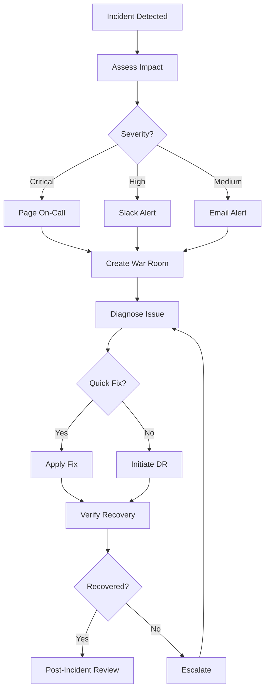

# GreenLang-First Disaster Recovery Plan

**Version:** 1.0.0
**Last Updated:** 2025-11-09
**Owner:** DevOps/SRE Team
**Test Schedule:** Quarterly

---

## Executive Summary

This Disaster Recovery (DR) plan outlines procedures for recovering from catastrophic failures of the GreenLang-First enforcement system. The plan covers detection, assessment, recovery, and prevention for various failure scenarios.

**Key Metrics:**
- **RTO (Recovery Time Objective):** <1 hour
- **RPO (Recovery Point Objective):** <15 minutes
- **Test Frequency:** Quarterly
- **Last Test Date:** TBD
- **Next Test Date:** TBD

---

## Table of Contents

1. [Failure Scenarios](#failure-scenarios)
2. [Emergency Contacts](#emergency-contacts)
3. [Recovery Procedures](#recovery-procedures)
4. [Testing & Validation](#testing--validation)
5. [Post-Incident](#post-incident)

---

## Failure Scenarios

### Scenario 1: Enforcement System Completely Down

**Symptoms:**
- All OPA pods in CrashLoopBackOff
- 503 Service Unavailable errors
- Monitoring alerts: "OPAServiceDown"
- Developers cannot commit/deploy

**Impact:** CRITICAL
- All policy enforcement stopped
- Deployments blocked
- Development workflow halted

**Detection:**
1. PagerDuty alert: "OPA Service Down"
2. Monitoring dashboard shows 0 healthy replicas
3. Developers report commit failures
4. CI/CD pipelines failing

**Recovery Steps:**

```bash
# STEP 1: Immediate Assessment (2 minutes)
# Check pod status
kubectl get pods -n greenlang-enforcement -l app=opa

# Check logs
kubectl logs -n greenlang-enforcement -l app=opa --tail=100

# Check events
kubectl get events -n greenlang-enforcement --sort-by='.lastTimestamp'

# STEP 2: Quick Fix Attempts (5 minutes)
# Restart pods
kubectl rollout restart deployment/opa-deployment -n greenlang-enforcement

# If still failing, check ConfigMap
kubectl get configmap opa-policies -n greenlang-enforcement -o yaml

# STEP 3: Emergency Rollback (3 minutes)
# Rollback to last known good version
kubectl rollout undo deployment/opa-deployment -n greenlang-enforcement

# Verify
kubectl rollout status deployment/opa-deployment -n greenlang-enforcement

# STEP 4: Enable Degraded Mode (2 minutes)
# If rollback fails, disable enforcement temporarily
kubectl patch deployment opa-deployment -n greenlang-enforcement \
  -p '{"spec":{"replicas":0}}'

# Update enforcement config to permissive mode
greenlang config set enforcement.mode permissive

# STEP 5: Communication (1 minute)
# Post to #greenlang-critical
# "OPA service down. Enforcement disabled temporarily. ETA: 30 minutes"

# STEP 6: Root Cause Analysis (10 minutes)
# Review logs, identify issue
# Fix underlying problem

# STEP 7: Restore Service (5 minutes)
# Re-enable with fix
kubectl patch deployment opa-deployment -n greenlang-enforcement \
  -p '{"spec":{"replicas":5}}'

# Wait for healthy
kubectl wait --for=condition=available --timeout=300s \
  deployment/opa-deployment -n greenlang-enforcement

# Re-enable strict enforcement
greenlang config set enforcement.mode strict

# STEP 8: Verification (5 minutes)
# Run validation suite
python .greenlang/deployment/validate.py --env production --full

# Test policy evaluation
curl http://opa-service:8181/v1/data/greenlang/deployment/allow \
  -d '{"input": {"environment": "production", "ium_score": 96}}'

# STEP 9: All-clear (1 minute)
# Post to #greenlang-critical
# "OPA service restored. All systems operational."
```

**RTO:** 30 minutes
**RPO:** 0 (stateless system)

**Prevention:**
- Increase pod replicas (min 5 in prod)
- Add pod disruption budget
- Implement circuit breaker
- Better health checks
- Canary deployments

---

### Scenario 2: Database Corruption

**Symptoms:**
- Metrics not being recorded
- Historical data missing
- Grafana dashboards empty
- Database errors in logs

**Impact:** HIGH
- Cannot track IUM history
- No audit trail
- Reporting broken

**Detection:**
1. Grafana alerts: "No data"
2. Query errors in Prometheus logs
3. Empty dashboards

**Recovery Steps:**

```bash
# STEP 1: Stop writes (2 minutes)
# Prevent further corruption
kubectl scale deployment prometheus-deployment -n greenlang-enforcement --replicas=0

# STEP 2: Identify corruption (5 minutes)
# Connect to database
kubectl exec -it postgres-0 -n greenlang-enforcement -- psql -U greenlang

# Check database integrity
\dt
SELECT pg_database_size('greenlang_production');

# Look for corruption
SELECT * FROM pg_stat_database WHERE datname = 'greenlang_production';

# STEP 3: Restore from backup (15 minutes)
# Get latest backup
aws s3 ls s3://greenlang-prod-backups/ --recursive | sort | tail -n 1

# Download backup
aws s3 cp s3://greenlang-prod-backups/backup_20251109_120000.sql.gz /tmp/

# Drop corrupted database (CAREFUL!)
kubectl exec -it postgres-0 -n greenlang-enforcement -- \
  psql -U postgres -c "DROP DATABASE greenlang_production;"

# Create new database
kubectl exec -it postgres-0 -n greenlang-enforcement -- \
  psql -U postgres -c "CREATE DATABASE greenlang_production OWNER greenlang;"

# Restore from backup
gunzip < /tmp/backup_20251109_120000.sql.gz | \
  kubectl exec -i postgres-0 -n greenlang-enforcement -- \
    psql -U greenlang greenlang_production

# STEP 4: Verify restoration (5 minutes)
# Check row counts
kubectl exec -it postgres-0 -n greenlang-enforcement -- \
  psql -U greenlang greenlang_production -c "SELECT COUNT(*) FROM metrics;"

# STEP 5: Restart services (3 minutes)
kubectl scale deployment prometheus-deployment -n greenlang-enforcement --replicas=2

# Wait for healthy
kubectl wait --for=condition=available --timeout=300s \
  deployment/prometheus-deployment -n greenlang-enforcement

# STEP 6: Validation (5 minutes)
# Check Grafana dashboards
curl http://grafana-service:3000/api/health

# Verify data is present
# Open Grafana, check dashboards

# STEP 7: Point-in-time recovery (if needed) (10 minutes)
# If backup is too old, replay WAL logs
# (PostgreSQL-specific, see PostgreSQL docs)
```

**RTO:** 40 minutes
**RPO:** 15 minutes (backup frequency)

**Prevention:**
- Increase backup frequency (every 3 hours → every 1 hour)
- Enable point-in-time recovery
- Implement replication
- Regular backup testing
- Database monitoring

---

### Scenario 3: OPA Policy Errors Blocking All PRs

**Symptoms:**
- All PRs failing enforcement checks
- False positives at 100%
- Policy syntax errors
- "Policy evaluation failed" errors

**Impact:** CRITICAL
- Development completely blocked
- No deployments possible
- Business impact

**Detection:**
1. Spike in #greenlang-support tickets
2. All CI/CD pipelines failing
3. Monitoring: Policy error rate 100%

**Recovery Steps:**

```bash
# STEP 1: Immediate Bypass (2 minutes)
# Switch to permissive mode IMMEDIATELY
greenlang config set enforcement.mode permissive

# Update ConfigMap
kubectl patch configmap opa-policies -n greenlang-enforcement \
  --type merge -p '{"data":{"deployment.rego":"package greenlang.deployment\ndefault allow = true"}}'

# Restart OPA to load new policies
kubectl rollout restart deployment/opa-deployment -n greenlang-enforcement

# STEP 2: Communication (1 minute)
# Slack #greenlang-critical
# "Policy error detected. Enforcement temporarily disabled. PRs can proceed."

# STEP 3: Identify bad policy (10 minutes)
# Get current policies
kubectl get configmap opa-policies -n greenlang-enforcement -o yaml > /tmp/current-policies.yaml

# Test policies locally
cd .greenlang/enforcement/opa-policies
opa test . -v

# If tests fail, identify failing policy
opa test . -v 2>&1 | grep "FAIL"

# STEP 4: Rollback to last good policies (5 minutes)
# Get previous ConfigMap version
kubectl rollout history configmap/opa-policies -n greenlang-enforcement

# Rollback
kubectl rollout undo configmap/opa-policies -n greenlang-enforcement

# Or restore from Git
git log -1 --name-only .greenlang/enforcement/opa-policies/
git checkout HEAD~1 .greenlang/enforcement/opa-policies/

# Apply
kubectl delete configmap opa-policies -n greenlang-enforcement
kubectl create configmap opa-policies -n greenlang-enforcement \
  --from-file=.greenlang/enforcement/opa-policies/

# STEP 5: Restart and verify (5 minutes)
kubectl rollout restart deployment/opa-deployment -n greenlang-enforcement

# Test policy
curl -X POST http://opa-service:8181/v1/data/greenlang/deployment/allow \
  -H 'Content-Type: application/json' \
  -d '{"input": {"environment": "production", "ium_score": 96}}'

# Should return: {"result": true}

# STEP 6: Re-enable enforcement (2 minutes)
greenlang config set enforcement.mode strict

# STEP 7: Monitor (10 minutes)
# Watch for errors
kubectl logs -n greenlang-enforcement -l app=opa -f

# Check false positive rate
# Should be <1%

# STEP 8: Root cause and fix (30 minutes)
# Review the bad policy commit
# Fix the issue
# Test thoroughly in staging
# Re-deploy to production
```

**RTO:** 25 minutes (to bypass)
**RTO:** 60 minutes (to fix properly)
**RPO:** 0

**Prevention:**
- Mandatory policy testing before deployment
- Canary deployments for policies
- Policy review process
- Automated policy validation in CI/CD
- Staging environment testing

---

### Scenario 4: Monitoring System Failure

**Symptoms:**
- Dashboards not loading
- No alerts firing
- Prometheus/Grafana down
- Cannot see metrics

**Impact:** MEDIUM
- Enforcement still works
- No visibility into system health
- Cannot detect issues early

**Detection:**
1. Manual check: Dashboards not loading
2. No alerts for expected conditions
3. Health check failures

**Recovery Steps:**

```bash
# STEP 1: Check component status (2 minutes)
kubectl get pods -n greenlang-enforcement -l component=monitoring

# STEP 2: Restart monitoring stack (5 minutes)
kubectl rollout restart deployment/prometheus-deployment -n greenlang-enforcement
kubectl rollout restart deployment/grafana-deployment -n greenlang-enforcement
kubectl rollout restart deployment/alertmanager-deployment -n greenlang-enforcement

# STEP 3: Check persistence (3 minutes)
# Verify PVCs are bound
kubectl get pvc -n greenlang-enforcement

# If PVC issues, check storage class
kubectl get storageclass

# STEP 4: Restore from backup if needed (15 minutes)
# Prometheus data
aws s3 sync s3://greenlang-prod-backups/prometheus/latest/ /tmp/prometheus-restore/

# Copy to pod
kubectl cp /tmp/prometheus-restore/ \
  greenlang-enforcement/prometheus-deployment-xxx:/prometheus

# STEP 5: Verify (5 minutes)
# Check Prometheus
curl http://prometheus-service:9090/-/healthy

# Check Grafana
curl http://grafana-service:3000/api/health

# Test queries
curl http://prometheus-service:9090/api/v1/query?query=up
```

**RTO:** 30 minutes
**RPO:** 15 minutes (scrape interval)

**Prevention:**
- Dedicated monitoring cluster
- Monitoring for the monitoring
- Regular backups
- HA configuration

---

### Scenario 5: Cloud Provider Outage

**Symptoms:**
- Entire cluster unreachable
- All services down
- AWS/GCP/Azure status page shows outage

**Impact:** CRITICAL
- Complete system down
- Multi-region failover required

**Detection:**
1. All health checks failing
2. Cloud provider status page
3. Cannot access cluster

**Recovery Steps:**

```bash
# STEP 1: Confirm outage (2 minutes)
# Check cloud provider status
# AWS: https://status.aws.amazon.com
# GCP: https://status.cloud.google.com

# STEP 2: Activate DR region (5 minutes)
# Switch kubectl context to DR region
kubectl config use-context production-dr

# Verify DR cluster is healthy
kubectl get nodes
kubectl get pods -n greenlang-enforcement

# STEP 3: Update DNS (3 minutes)
# Point DNS to DR region
# Update Route53/CloudDNS records
aws route53 change-resource-record-sets \
  --hosted-zone-id Z1234567890ABC \
  --change-batch file://dns-failover.json

# STEP 4: Scale up DR services (5 minutes)
# DR normally runs at reduced capacity
kubectl scale deployment opa-deployment -n greenlang-enforcement --replicas=5
kubectl scale deployment prometheus-deployment -n greenlang-enforcement --replicas=2

# STEP 5: Verify services (5 minutes)
# Run validation
python .greenlang/deployment/validate.py --env production --full

# STEP 6: Communication (2 minutes)
# Notify all teams
# "Primary region down. Failed over to DR. System operational."

# STEP 7: Monitor DR region (ongoing)
# Watch for any issues in DR

# STEP 8: Failback when primary restored (30 minutes)
# Sync data from DR to primary
# Update DNS back to primary
# Scale down DR to standby mode
```

**RTO:** 20 minutes
**RPO:** 15 minutes (replication lag)

**Prevention:**
- Active-active multi-region
- Regular DR drills
- Automated failover
- Cross-region replication

---

## Emergency Contacts

### On-Call Rotation

| Role | Primary | Secondary | Escalation |
|------|---------|-----------|------------|
| SRE On-Call | TBD | TBD | +1-XXX-XXX-XXXX |
| DevOps Lead | TBD | TBD | +1-XXX-XXX-XXXX |
| Engineering Manager | TBD | TBD | +1-XXX-XXX-XXXX |
| CTO | TBD | TBD | +1-XXX-XXX-XXXX |

### Vendor Contacts

| Vendor | Contact | Account ID | Support Level |
|--------|---------|------------|---------------|
| AWS | aws-support@greenlang.io | 123456789012 | Enterprise |
| PagerDuty | N/A | Auto | Premium |
| Slack | N/A | N/A | Free |

### Communication Channels

- **Critical Incidents:** #greenlang-critical (Slack)
- **War Room:** #incident-response (Slack)
- **Status Page:** https://status.greenlang.io
- **Email:** incidents@greenlang.io

---

## Recovery Procedures

### General Recovery Process



### Communication Template

```markdown
**INCIDENT ALERT**

Severity: [CRITICAL/HIGH/MEDIUM/LOW]
System: GreenLang-First Enforcement
Impact: [Description]
Status: [INVESTIGATING/IDENTIFIED/MONITORING/RESOLVED]

Timeline:
- [HH:MM] Issue detected
- [HH:MM] Investigation started
- [HH:MM] Root cause identified
- [HH:MM] Fix applied
- [HH:MM] Resolved

ETA: [Time or "Unknown"]

Updates: Every 15 minutes or when status changes
War Room: #incident-response
```

---

## Testing & Validation

### Quarterly DR Drills

**Schedule:** First Tuesday of each quarter, 2 PM EST

**Scenarios to Test:**
1. Complete system failure + recovery
2. Database corruption + restore
3. Bad policy deployment + rollback
4. Cloud provider outage + failover
5. Cascading failure

**Test Process:**

```bash
# 1. Schedule test (2 weeks notice)
# 2. Notify all stakeholders
# 3. Take snapshots before test
# 4. Execute failure scenario
# 5. Execute recovery procedure
# 6. Measure RTO/RPO
# 7. Document lessons learned
# 8. Update DR plan
```

**Success Criteria:**
- RTO < 1 hour
- RPO < 15 minutes
- All services restored
- No data loss
- Team executed plan correctly

**Last Test Results:**
- Date: TBD
- RTO: TBD
- RPO: TBD
- Issues: TBD
- Actions: TBD

---

## Post-Incident

### Post-Incident Review (PIR) Template

**Incident Summary:**
- Date/Time:
- Duration:
- Severity:
- Impact:

**Timeline:**
(Detailed timeline of events)

**Root Cause:**
(What caused the incident)

**Resolution:**
(How it was fixed)

**What Went Well:**
- (List positives)

**What Went Wrong:**
- (List issues)

**Action Items:**
- [ ] Item 1 (Owner: X, Due: Y)
- [ ] Item 2 (Owner: X, Due: Y)

**Prevention:**
(How to prevent in future)

### Incident Metrics

Track these metrics:
- MTTD (Mean Time To Detect)
- MTTA (Mean Time To Acknowledge)
- MTTR (Mean Time To Repair)
- Incident frequency
- False positive rate

---

## Appendix

### A. Backup Verification

```bash
# Verify backups are running
kubectl get cronjobs -n greenlang-enforcement

# Test restore (monthly)
# 1. Restore to test environment
# 2. Verify data integrity
# 3. Document results
```

### B. Emergency Scripts

All emergency scripts located in:
`.greenlang/deployment/scripts/emergency/`

- `emergency-rollback.sh` - Full system rollback
- `disable-enforcement.sh` - Bypass enforcement
- `failover-to-dr.sh` - DR failover
- `restore-from-backup.sh` - Data restoration

### C. Runbook Quick Links

- [Deployment Runbook](./docs/runbooks/deployment.md)
- [Troubleshooting Guide](./docs/runbooks/troubleshooting.md)
- [Incident Response](./docs/runbooks/incident-response.md)
- [Maintenance Procedures](./docs/runbooks/maintenance.md)

---

**Document Owner:** DevOps Team
**Review Frequency:** Quarterly
**Last Review:** TBD
**Next Review:** TBD
**Approval:** CTO

---

**TEST THIS PLAN BEFORE YOU NEED IT!**
