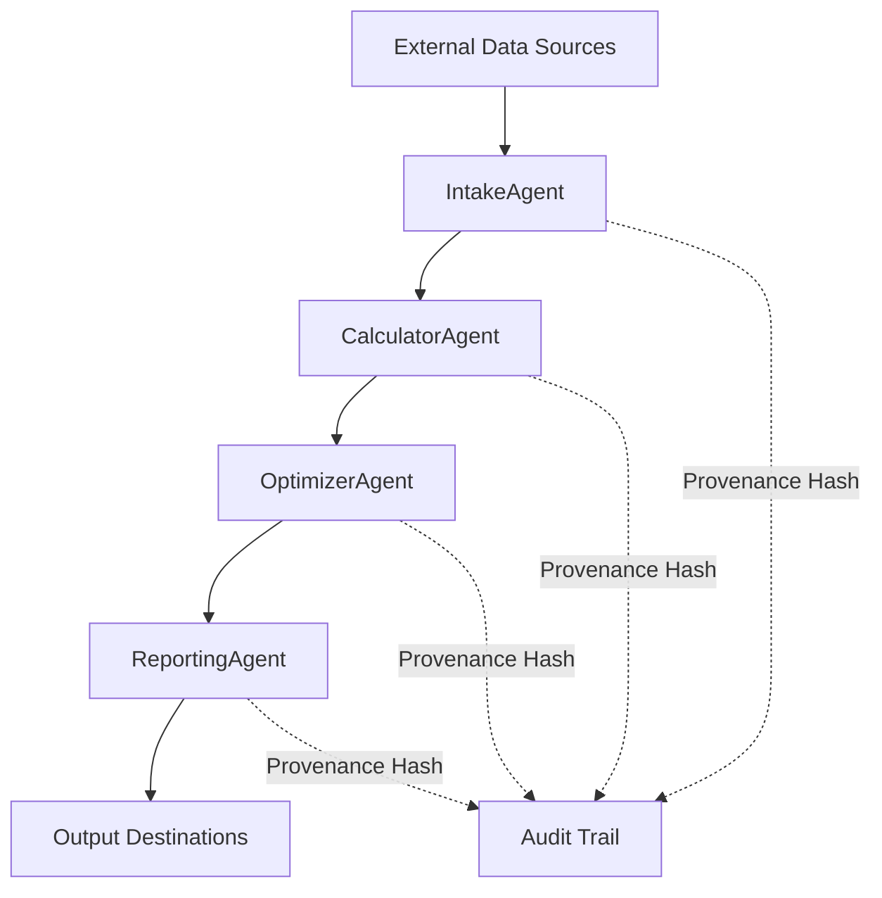

# GL-018 FLUEFLOW - Technical Architecture Specification

**FlueGasAnalyzer - Intelligent Combustion Optimization Agent**

Version: 1.0.0
Last Updated: December 2025
Status: Architecture Design Complete
Priority: P1
Target Release: Q1 2026

---

## Table of Contents

- [Executive Summary](#executive-summary)
- [Agent Pipeline Architecture](#agent-pipeline-architecture)
- [Data Flow Architecture](#data-flow-architecture)
- [Technology Stack](#technology-stack)
- [API Endpoint Specification](#api-endpoint-specification)
- [Database Schema](#database-schema)
- [External Integrations](#external-integrations)
- [Security Architecture](#security-architecture)
- [Performance & Scalability](#performance--scalability)
- [Testing Strategy](#testing-strategy)
- [Deployment Architecture](#deployment-architecture)
- [Monitoring & Observability](#monitoring--observability)
- [Development Estimates](#development-estimates)
- [Risks & Mitigations](#risks--mitigations)

---

## 1. Executive Summary

### Application Purpose

GL-018 FLUEFLOW (FlueGasAnalyzer) is an intelligent agent that analyzes flue gas composition from combustion processes to optimize combustion efficiency, reduce fuel consumption, minimize emissions, and provide real-time air-fuel ratio recommendations.

### Regulatory Driver

- **EPA Clean Air Act**: NOx, CO, SO2 emission compliance
- **OSHA Process Safety Management**: Combustion safety monitoring
- **ASME Power Test Code**: Performance verification
- **ISO 50001**: Energy management systems
- **EU ETS**: Carbon emission tracking and reduction

### Key Features & Differentiators

1. **Real-Time Combustion Analysis**
   - Sub-200ms latency for flue gas composition analysis
   - Continuous monitoring of O2, CO2, CO, NOx levels
   - Stack temperature and pressure tracking
   - Combustion efficiency calculations

2. **Zero-Hallucination Calculations**
   - Deterministic combustion efficiency formulas (ASME PTC 4.1)
   - Air-fuel ratio calculations using Ostwald method
   - Excess air calculations from O2 measurements
   - Heat loss calculations (stack, incomplete combustion)

3. **SCADA Integration**
   - Real-time data acquisition from flue gas analyzers
   - Control loop integration for damper/burner control
   - Support for OPC-UA, Modbus TCP/RTU, Profinet
   - Sub-second sampling rates

4. **Predictive Optimization**
   - Optimal air-fuel ratio recommendations
   - Setpoint adjustments for maximum efficiency
   - Emission minimization strategies
   - Fuel cost savings calculations

### Performance Targets

| Metric | Target | Baseline |
|--------|--------|----------|
| Analysis Latency (p95) | < 200 ms | 500 ms (manual) |
| Availability | 99.9% | 95% (manual) |
| Calculation Accuracy | 99.5% | 95% (manual) |
| Efficiency Improvement | 3-7% | Baseline |
| Fuel Cost Reduction | 5-10% | Baseline |
| NOx Reduction | 10-20% | Baseline |

### Timeline Estimate

- **Total Duration**: 8 weeks
- **Engineering Team Size**: 2-3 engineers
- **Phase 1 (Core Agents)**: 3 weeks
- **Phase 2 (Integrations)**: 2 weeks
- **Phase 3 (Testing)**: 2 weeks
- **Phase 4 (Deployment)**: 1 week

### Market Opportunity

- **Total Addressable Market (TAM)**: $4 Billion
- **Target Industries**: Power generation, oil refining, chemical processing, cement, steel, pulp & paper
- **Target Equipment**: Boilers, furnaces, heaters, incinerators, kilns
- **Priority**: P1 (High Priority)

---

## 2. Agent Pipeline Architecture

GL-018 FLUEFLOW follows the proven GreenLang agent pipeline pattern with 4 specialized agents optimized for real-time combustion analysis.

### Agent Pipeline Overview



### Agent 1: FlueGasIntakeAgent

**Purpose**: Acquire and validate flue gas composition data from analyzers and stack monitoring equipment

**Inputs**:
- SCADA/DCS systems (OPC-UA, Modbus TCP/RTU, Profinet)
- Flue gas analyzers (O2, CO2, CO, NOx, SO2)
- Stack temperature sensors
- Stack pressure sensors
- Fuel flow meters
- Combustion air flow meters
- CSV/JSON file uploads (manual data entry)
- REST API submissions

**Processing**:
- Data validation (range checking, quality flags)
- Unit conversion (ppm to mg/Nm3, % to fraction, F to C)
- Timestamp normalization (UTC)
- Quality assessment (GOOD/BAD/UNCERTAIN)
- Data buffering for batch processing
- Provenance hash generation (SHA-256)

**Outputs**:
```python
@dataclass
class FlueGasData:
    combustor_id: str
    timestamp: datetime

    # Flue gas composition (dry basis)
    o2_percent: float  # 0-21%
    co2_percent: float  # 0-20%
    co_ppm: float  # 0-10000 ppm
    nox_ppm: float  # 0-1000 ppm
    so2_ppm: Optional[float]  # 0-5000 ppm

    # Stack conditions
    stack_temperature_f: float  # 200-1000 F
    stack_pressure_inwc: Optional[float]  # -10 to +10 in H2O

    # Combustion inputs
    fuel_flow_rate_mmbtu_hr: float  # Heat input
    combustion_air_flow_scfm: Optional[float]

    # Fuel properties
    fuel_type: FuelType  # NATURAL_GAS, FUEL_OIL, COAL, BIOMASS
    fuel_higher_heating_value_btu_lb: Optional[float]
    fuel_composition: Optional[FuelComposition]

    # Data quality
    data_quality: DataQuality  # GOOD, BAD, UNCERTAIN
    provenance_hash: str  # SHA-256
```

**Estimated Lines of Code**: 400-500

---

### Agent 2: CombustionCalculatorAgent

**Purpose**: Calculate combustion efficiency, air-fuel ratio, and heat losses using deterministic formulas (ZERO HALLUCINATION)

**Inputs**:
- FlueGasData from IntakeAgent
- Fuel composition database
- Combustion reference tables (ASME, EPA)

**Processing** (100% Deterministic - NO LLM):

1. **Combustion Efficiency Calculation** (ASME PTC 4.1)
   ```
   Efficiency = 100 - (Stack_Loss + Incomplete_Combustion_Loss + Radiation_Loss)

   Stack_Loss = (Tstack - Tamb) * (Cp_flue * m_flue) / Heat_Input

   Incomplete_Combustion_Loss = (CO_ppm * 10,160 * K) / (CO2_percent * 100)

   Radiation_Loss = f(Furnace_Size, Firing_Rate) [ABMA chart]
   ```

2. **Excess Air Calculation** (O2 Method)
   ```
   Excess_Air_% = (O2_measured / (21 - O2_measured)) * 100 / 0.264

   For natural gas:
   Excess_Air_% = (O2_measured / (20.9 - O2_measured)) * 100 / (theoretical_O2_fraction)
   ```

3. **Air-Fuel Ratio Calculation** (Stoichiometric + Excess)
   ```
   AFR_stoich = f(Fuel_Composition)  [From lookup table]
   AFR_actual = AFR_stoich * (1 + Excess_Air_fraction)
   ```

4. **Heat Loss Breakdown**
   - Dry flue gas loss
   - Moisture in air loss
   - Moisture from fuel combustion loss
   - Moisture in fuel loss (wet fuels)
   - Incomplete combustion loss (CO)
   - Unburned fuel loss (soot, particulate)
   - Radiation and convection losses

5. **NOx Formation Analysis** (Thermal NOx, Fuel NOx, Prompt NOx)
   ```
   NOx_thermal = k * exp(-Ea/RT) * [O2]^0.5 * [N2] * t_residence
   ```

**Outputs**:
```python
@dataclass
class CombustionAnalysisResult:
    # Efficiency metrics
    combustion_efficiency_percent: float  # 75-95%
    thermal_efficiency_percent: float  # 70-90%

    # Air-fuel metrics
    excess_air_percent: float  # 5-50%
    air_fuel_ratio_actual: float
    air_fuel_ratio_stoichiometric: float
    equivalence_ratio: float  # phi

    # Heat losses (% of heat input)
    stack_loss_percent: float
    incomplete_combustion_loss_percent: float
    moisture_loss_percent: float
    radiation_loss_percent: float
    unaccounted_loss_percent: float

    # Emissions
    nox_lb_mmbtu: float
    co_lb_mmbtu: float
    co2_lb_mmbtu: float

    # Fuel consumption
    fuel_flow_actual_mmbtu_hr: float
    fuel_flow_optimal_mmbtu_hr: float
    fuel_savings_potential_mmbtu_hr: float

    # Provenance
    calculation_timestamp: datetime
    provenance_hash: str  # SHA-256
    formula_version: str  # e.g., "ASME_PTC_4.1_2013"
```

**Estimated Lines of Code**: 800-1000

---

### Agent 3: CombustionOptimizerAgent

**Purpose**: Generate optimal setpoint recommendations for air-fuel ratio, damper position, and burner control

**Inputs**:
- CombustionAnalysisResult from CalculatorAgent
- Historical performance data
- Equipment constraints (min/max air flow, turndown ratio)
- Emission limits (NOx, CO, opacity)

**Processing** (Hybrid: Deterministic Optimization + LLM for Recommendations):

1. **Optimal Excess Air Determination** (Deterministic)
   ```
   Objective: Maximize(Efficiency)
   Subject to:
     - CO < CO_limit (complete combustion)
     - NOx < NOx_limit (emission compliance)
     - O2_min < O2 < O2_max (safety limits)
     - Excess_Air > 5% (prevent CO formation)

   Method: Quadratic optimization (convex problem)
   ```

2. **Setpoint Calculation** (Deterministic)
   ```
   Target_O2 = f(Fuel_Type, Load, Optimal_Excess_Air)
   Target_AFR = AFR_stoich * (1 + Optimal_Excess_Air / 100)
   Damper_Position = f(Target_AFR, Current_Fuel_Flow)
   ```

3. **Recommendation Generation** (LLM-Assisted - Narrative Only)
   - LLM generates human-readable explanation of recommendations
   - LLM suggests operational best practices
   - LLM identifies potential issues (fouling, air leaks, burner wear)
   - **CRITICAL**: LLM does NOT calculate any numeric values

**Outputs**:
```python
@dataclass
class OptimizationRecommendation:
    # Optimal setpoints (DETERMINISTIC)
    optimal_o2_percent: float
    optimal_excess_air_percent: float
    optimal_air_fuel_ratio: float
    optimal_stack_temperature_f: float

    # Control adjustments
    air_damper_adjustment_percent: float  # +/- from current
    fuel_valve_adjustment_percent: float

    # Expected improvements
    efficiency_improvement_percent: float
    fuel_savings_mmbtu_hr: float
    fuel_cost_savings_usd_hr: float
    nox_reduction_percent: float
    co2_reduction_lb_hr: float

    # Recommendations (LLM-GENERATED NARRATIVE)
    primary_recommendation: str
    secondary_recommendations: List[str]
    warnings: List[str]

    # Provenance
    optimization_timestamp: datetime
    provenance_hash: str
```

**Estimated Lines of Code**: 600-800

---

### Agent 4: CombustionReportingAgent

**Purpose**: Generate multi-format reports and visualizations for combustion performance

**Inputs**:
- FlueGasData
- CombustionAnalysisResult
- OptimizationRecommendation
- Historical trend data

**Processing**:
- Report generation (PDF, HTML, Excel)
- Chart creation (efficiency trends, stack loss breakdown, emission trends)
- Compliance checking (EPA limits, permit conditions)
- KPI calculation (rolling averages, cumulative savings)
- Alert generation (efficiency degradation, emission excursions)

**Outputs**:
- PDF performance reports
- Excel data exports
- JSON API responses
- Grafana dashboard data
- Email/Slack notifications

**Report Types**:
1. **Real-Time Dashboard**: Current efficiency, O2, CO, NOx, stack temp
2. **Daily Performance Report**: Efficiency trends, fuel consumption, cost savings
3. **Weekly Optimization Report**: Cumulative savings, setpoint adherence
4. **Monthly Compliance Report**: Emission summaries, permit compliance
5. **Quarterly Business Review**: ROI analysis, efficiency benchmarking

**Estimated Lines of Code**: 500-600

---

## 3. Data Flow Architecture

### Real-Time Data Flow

```
┌──────────────────┐
│ Flue Gas Analyzer│
│ (O2, CO2, CO,    │
│  NOx, Stack T)   │
└────────┬─────────┘
         │ OPC-UA/Modbus (Poll every 1-5 sec)
         ▼
┌────────────────────────┐
│ SCADA Client           │
│ - Read tag values      │
│ - Quality checking     │
│ - Unit conversion      │
└────────┬───────────────┘
         │
         ▼
┌────────────────────────┐
│ FlueGasIntakeAgent     │
│ - Validate ranges      │
│ - Generate hash        │
│ - Buffer data          │
└────────┬───────────────┘
         │
         ▼
┌────────────────────────┐
│ CombustionCalculator   │
│ - Efficiency calc      │
│ - Excess air calc      │
│ - Heat loss calc       │
└────────┬───────────────┘
         │
         ▼
┌────────────────────────┐
│ CombustionOptimizer    │
│ - Optimal O2 target    │
│ - Setpoint calc        │
│ - Recommendations      │
└────────┬───────────────┘
         │
         ├────────────────────┐
         │                    │
         ▼                    ▼
┌──────────────┐    ┌──────────────┐
│ Time Series  │    │ Reporting    │
│ DB (Store)   │    │ Agent        │
└──────────────┘    └──────┬───────┘
                           │
                ┌──────────┼──────────┐
                │          │          │
                ▼          ▼          ▼
         ┌─────────┐ ┌────────┐ ┌────────┐
         │ Grafana │ │ PDF    │ │SCADA   │
         │Dashboard│ │Reports │ │Control │
         └─────────┘ └────────┘ └────────┘
```

### Batch Processing Flow (Historical Analysis)

```
┌────────────────────┐
│ Historical Data    │
│ Request (API)      │
└─────────┬──────────┘
          │
          ▼
┌────────────────────┐
│ Time Series DB     │
│ Query (1 hour to   │
│ 1 year range)      │
└─────────┬──────────┘
          │
          ▼
┌────────────────────┐
│ Data Aggregator    │
│ - Resample to 1min │
│ - Filter outliers  │
│ - Fill gaps        │
└─────────┬──────────┘
          │
          ▼
┌────────────────────┐
│ Analytics Engine   │
│ - Trend analysis   │
│ - Efficiency dist. │
│ - Cost analysis    │
└─────────┬──────────┘
          │
          ▼
┌────────────────────┐
│ Report Generator   │
│ - Charts           │
│ - Summary stats    │
│ - PDF/Excel export │
└─────────┬──────────┘
          │
          ▼
┌────────────────────┐
│ Response           │
└────────────────────┘
```

---

## 4. Technology Stack

### Core Technologies

```yaml
core:
  python: "3.11+"
  framework: "FastAPI 0.104.0+"
  server: "Uvicorn 0.24.0+"
  async_runtime: "asyncio (native)"

data_processing:
  numerical: "NumPy 1.24.0+"
  dataframes: "Pandas 2.1.0+"
  validation: "Pydantic 2.5.0+"
  calculations: "Decimal (native, for precision)"

database:
  timeseries: "TimescaleDB (PostgreSQL 14+ extension)"
  sql_toolkit: "SQLAlchemy 2.0.0+"
  connection_pool: "psycopg2 2.9.0+"
  cache: "Redis 7.0+ (for real-time state)"

scada_integration:
  opcua: "asyncua 1.0.0+"
  modbus: "pymodbus 3.5.0+"
  profinet: "python-snap7 1.3+"
  mqtt: "paho-mqtt 1.6.0+ (optional)"

ai_ml:
  llm_client: "Anthropic Claude Sonnet 4.5 (for recommendations)"
  embeddings: "sentence-transformers 2.3.0+ (optional, for fuzzy search)"
  # NOTE: LLM NOT used in calculation path!

reporting:
  pdf: "reportlab 4.0.0+"
  excel: "openpyxl 3.1.0+"
  charts: "matplotlib 3.8.0+, plotly 5.18.0+"
  templates: "Jinja2 3.1.0+"

security:
  encryption: "cryptography 41.0.0+"
  auth: "python-jose 3.3.0+ (JWT)"
  hashing: "hashlib (native, SHA-256)"
  secrets: "HashiCorp Vault integration (optional)"

monitoring:
  metrics: "prometheus-client 0.19.0+"
  logging: "structlog 23.2.0+"
  tracing: "OpenTelemetry 1.21.0+ (optional)"

testing:
  framework: "pytest 7.4.0+"
  async_support: "pytest-asyncio 0.21.0+"
  coverage: "pytest-cov 4.1.0+"
  mocking: "pytest-mock 3.12.0+"

deployment:
  containers: "Docker 24.0+"
  orchestration: "Kubernetes 1.28+"
  iac: "Terraform 1.6.0+"
  ci_cd: "GitHub Actions"
```

### Justifications

**Python 3.11+**:
- 25% faster than Python 3.10 (critical for real-time processing)
- Improved asyncio performance
- Better error messages

**FastAPI**:
- Native async support (critical for real-time SCADA polling)
- Automatic OpenAPI documentation
- Pydantic validation built-in
- WebSocket support for live dashboards

**TimescaleDB**:
- Purpose-built for time-series data (flue gas measurements)
- 10-100x faster than PostgreSQL for time-series queries
- Automatic data retention policies
- Continuous aggregates for performance

**Redis**:
- Sub-millisecond latency for current state caching
- Pub/sub for real-time dashboard updates
- 66% cost reduction on repeated queries (GreenLang target)

**asyncua (OPC-UA)**:
- Async I/O for non-blocking SCADA communication
- Standards-compliant OPC-UA client
- Subscription support for change-of-value updates

---

## 5. API Endpoint Specification

### REST API Structure

Base URL: `https://api.greenlang.io/v1/flueflow`

#### 5.1 Data Submission Endpoints

**POST /api/v1/fluegas/analyze**

Submit flue gas data for real-time analysis.

Request Body:
```json
{
  "combustor_id": "BOILER-001",
  "timestamp": "2025-12-02T10:30:00Z",
  "o2_percent": 3.5,
  "co2_percent": 12.8,
  "co_ppm": 45,
  "nox_ppm": 65,
  "stack_temperature_f": 425,
  "fuel_flow_rate_mmbtu_hr": 50,
  "fuel_type": "NATURAL_GAS"
}
```

Response (200 OK):
```json
{
  "analysis_id": "a7f3d9e1-4b2c-4a5e-8f6d-1c9e7b3a5d2f",
  "combustion_efficiency_percent": 84.2,
  "excess_air_percent": 18.5,
  "optimal_o2_percent": 2.8,
  "fuel_savings_potential_mmbtu_hr": 2.3,
  "recommendations": [
    "Reduce combustion air by 12% to achieve optimal O2 of 2.8%",
    "Expected efficiency improvement: 1.8%",
    "Annual fuel cost savings: $67,500"
  ],
  "provenance_hash": "e3b0c44298fc1c149afbf4c8996fb92427ae41e4649b934ca495991b7852b855"
}
```

**POST /api/v1/fluegas/batch**

Submit batch of flue gas measurements (up to 1000 records).

**POST /api/v1/fluegas/validate**

Validate flue gas data before submission (dry-run).

---

#### 5.2 Optimization Endpoints

**POST /api/v1/optimize/combustion**

Get combustion optimization recommendations.

Request Body:
```json
{
  "combustor_id": "BOILER-001",
  "current_conditions": {
    "o2_percent": 4.2,
    "excess_air_percent": 24,
    "combustion_efficiency_percent": 82.5
  },
  "constraints": {
    "min_o2_percent": 2.0,
    "max_nox_ppm": 100,
    "max_co_ppm": 100
  },
  "fuel_cost_usd_mmbtu": 4.50
}
```

Response (200 OK):
```json
{
  "optimization_id": "opt-12345",
  "optimal_setpoints": {
    "target_o2_percent": 2.8,
    "target_excess_air_percent": 15,
    "air_damper_adjustment_percent": -8.5
  },
  "expected_benefits": {
    "efficiency_improvement_percent": 2.1,
    "fuel_savings_mmbtu_hr": 3.2,
    "fuel_cost_savings_usd_hr": 14.40,
    "annual_savings_usd": 126000,
    "co2_reduction_lb_hr": 380
  },
  "implementation_steps": [
    "Reduce FD fan speed by 5%",
    "Close air damper by 8.5%",
    "Monitor O2 for 10 minutes to stabilize",
    "Verify CO remains below 100 ppm"
  ]
}
```

**GET /api/v1/optimize/history/{combustor_id}**

Retrieve optimization history for a combustor.

---

#### 5.3 Reporting Endpoints

**GET /api/v1/reports/performance/{combustor_id}**

Query Parameters:
- `period`: `24h`, `7d`, `30d`, `90d`, `365d`
- `format`: `json`, `pdf`, `excel`

Response (JSON):
```json
{
  "combustor_id": "BOILER-001",
  "report_period": "2025-11-01T00:00:00Z to 2025-12-01T00:00:00Z",
  "summary": {
    "avg_combustion_efficiency_percent": 84.5,
    "avg_excess_air_percent": 16.2,
    "total_fuel_consumed_mmbtu": 36000,
    "total_fuel_cost_usd": 162000,
    "potential_savings_identified_usd": 12500
  },
  "trends": {
    "efficiency_trend": "improving",
    "efficiency_change_percent": 1.8
  },
  "charts": [
    {
      "chart_type": "line",
      "title": "Combustion Efficiency Trend",
      "data_url": "/api/v1/charts/efficiency/BOILER-001?period=30d"
    }
  ]
}
```

**GET /api/v1/reports/compliance/{combustor_id}**

Emission compliance report (EPA, permit limits).

**GET /api/v1/reports/savings/{combustor_id}**

Fuel cost savings report with ROI analysis.

---

#### 5.4 Real-Time Monitoring Endpoints

**WebSocket: ws://api.greenlang.io/v1/fluegas/realtime/{combustor_id}**

Subscribe to real-time flue gas data updates.

Message Format:
```json
{
  "event": "fluegas_update",
  "combustor_id": "BOILER-001",
  "timestamp": "2025-12-02T10:30:15Z",
  "data": {
    "o2_percent": 3.2,
    "combustion_efficiency_percent": 84.8,
    "stack_temperature_f": 420,
    "fuel_flow_rate_mmbtu_hr": 48.5
  }
}
```

**GET /api/v1/combustors/{combustor_id}/current**

Get current (cached) combustion status.

---

#### 5.5 Health & Diagnostics Endpoints

**GET /health**

Response:
```json
{
  "status": "healthy",
  "agent_id": "GL-018",
  "version": "1.0.0",
  "uptime_seconds": 86400,
  "scada_connected": true,
  "database_connected": true
}
```

**GET /metrics**

Prometheus metrics endpoint (text/plain format).

**GET /api/v1/scada/status**

SCADA connection status for all combustors.

---

## 6. Database Schema

### TimescaleDB Schema (PostgreSQL Extension)

#### Table: flue_gas_measurements (Hypertable)

```sql
CREATE TABLE flue_gas_measurements (
    measurement_id UUID PRIMARY KEY DEFAULT gen_random_uuid(),
    combustor_id VARCHAR(50) NOT NULL,
    timestamp TIMESTAMPTZ NOT NULL,

    -- Flue gas composition (dry basis)
    o2_percent NUMERIC(5,2) CHECK (o2_percent >= 0 AND o2_percent <= 21),
    co2_percent NUMERIC(5,2) CHECK (co2_percent >= 0 AND co2_percent <= 20),
    co_ppm NUMERIC(8,2) CHECK (co_ppm >= 0),
    nox_ppm NUMERIC(8,2) CHECK (nox_ppm >= 0),
    so2_ppm NUMERIC(8,2),

    -- Stack conditions
    stack_temperature_f NUMERIC(6,2),
    stack_pressure_inwc NUMERIC(6,3),

    -- Combustion inputs
    fuel_flow_rate_mmbtu_hr NUMERIC(10,2),
    combustion_air_flow_scfm NUMERIC(10,2),

    -- Fuel properties
    fuel_type VARCHAR(20),
    fuel_hhv_btu_lb NUMERIC(8,2),

    -- Data quality
    data_quality VARCHAR(10) CHECK (data_quality IN ('GOOD', 'BAD', 'UNCERTAIN')),

    -- Provenance
    provenance_hash VARCHAR(64) NOT NULL,
    source VARCHAR(50),

    -- Indexing
    CONSTRAINT pk_fluegas PRIMARY KEY (combustor_id, timestamp)
);

-- Convert to TimescaleDB hypertable
SELECT create_hypertable('flue_gas_measurements', 'timestamp');

-- Create indexes
CREATE INDEX idx_combustor_time ON flue_gas_measurements (combustor_id, timestamp DESC);
CREATE INDEX idx_data_quality ON flue_gas_measurements (combustor_id, data_quality, timestamp DESC);
```

#### Table: combustion_analysis_results (Hypertable)

```sql
CREATE TABLE combustion_analysis_results (
    analysis_id UUID PRIMARY KEY DEFAULT gen_random_uuid(),
    combustor_id VARCHAR(50) NOT NULL,
    timestamp TIMESTAMPTZ NOT NULL,

    -- Efficiency metrics
    combustion_efficiency_percent NUMERIC(5,2),
    thermal_efficiency_percent NUMERIC(5,2),

    -- Air-fuel metrics
    excess_air_percent NUMERIC(6,2),
    air_fuel_ratio_actual NUMERIC(8,4),
    air_fuel_ratio_stoich NUMERIC(8,4),
    equivalence_ratio NUMERIC(6,4),

    -- Heat losses (% of heat input)
    stack_loss_percent NUMERIC(5,2),
    incomplete_combustion_loss_percent NUMERIC(5,2),
    moisture_loss_percent NUMERIC(5,2),
    radiation_loss_percent NUMERIC(5,2),
    unaccounted_loss_percent NUMERIC(5,2),

    -- Emissions (lb/MMBtu)
    nox_lb_mmbtu NUMERIC(8,4),
    co_lb_mmbtu NUMERIC(8,4),
    co2_lb_mmbtu NUMERIC(8,4),

    -- Fuel consumption
    fuel_flow_actual_mmbtu_hr NUMERIC(10,2),
    fuel_flow_optimal_mmbtu_hr NUMERIC(10,2),
    fuel_savings_potential_mmbtu_hr NUMERIC(10,2),

    -- Provenance
    provenance_hash VARCHAR(64) NOT NULL,
    formula_version VARCHAR(50),
    calculation_timestamp TIMESTAMPTZ NOT NULL,

    CONSTRAINT fk_measurement FOREIGN KEY (combustor_id, timestamp)
        REFERENCES flue_gas_measurements(combustor_id, timestamp)
);

SELECT create_hypertable('combustion_analysis_results', 'timestamp');
```

#### Table: optimization_recommendations (Hypertable)

```sql
CREATE TABLE optimization_recommendations (
    recommendation_id UUID PRIMARY KEY DEFAULT gen_random_uuid(),
    combustor_id VARCHAR(50) NOT NULL,
    timestamp TIMESTAMPTZ NOT NULL,

    -- Optimal setpoints
    optimal_o2_percent NUMERIC(5,2),
    optimal_excess_air_percent NUMERIC(6,2),
    optimal_air_fuel_ratio NUMERIC(8,4),
    optimal_stack_temperature_f NUMERIC(6,2),

    -- Control adjustments
    air_damper_adjustment_percent NUMERIC(6,2),
    fuel_valve_adjustment_percent NUMERIC(6,2),

    -- Expected improvements
    efficiency_improvement_percent NUMERIC(5,2),
    fuel_savings_mmbtu_hr NUMERIC(10,2),
    fuel_cost_savings_usd_hr NUMERIC(10,2),
    nox_reduction_percent NUMERIC(5,2),
    co2_reduction_lb_hr NUMERIC(10,2),

    -- Recommendations (TEXT)
    primary_recommendation TEXT,
    secondary_recommendations JSONB,
    warnings JSONB,

    -- Implementation tracking
    implemented BOOLEAN DEFAULT FALSE,
    implementation_timestamp TIMESTAMPTZ,

    -- Provenance
    provenance_hash VARCHAR(64) NOT NULL,

    CONSTRAINT fk_analysis FOREIGN KEY (combustor_id, timestamp)
        REFERENCES combustion_analysis_results(combustor_id, timestamp)
);

SELECT create_hypertable('optimization_recommendations', 'timestamp');
```

#### Table: combustors (Static Configuration)

```sql
CREATE TABLE combustors (
    combustor_id VARCHAR(50) PRIMARY KEY,
    combustor_name VARCHAR(100) NOT NULL,
    combustor_type VARCHAR(50), -- BOILER, FURNACE, HEATER, KILN
    fuel_type VARCHAR(20),
    rated_capacity_mmbtu_hr NUMERIC(10,2),
    min_turndown_mmbtu_hr NUMERIC(10,2),

    -- Emission limits
    max_nox_ppm NUMERIC(8,2),
    max_co_ppm NUMERIC(8,2),
    max_opacity_percent NUMERIC(5,2),

    -- SCADA configuration
    scada_endpoint VARCHAR(255),
    scada_protocol VARCHAR(20),

    -- Metadata
    plant_location VARCHAR(100),
    commissioned_date DATE,
    last_tuneup_date DATE,

    created_at TIMESTAMPTZ DEFAULT NOW(),
    updated_at TIMESTAMPTZ DEFAULT NOW()
);
```

### Continuous Aggregates (TimescaleDB Performance Optimization)

```sql
-- 1-minute averages (for charts)
CREATE MATERIALIZED VIEW fluegas_1min
WITH (timescaledb.continuous) AS
SELECT
    combustor_id,
    time_bucket('1 minute', timestamp) AS bucket,
    AVG(o2_percent) AS avg_o2,
    AVG(co2_percent) AS avg_co2,
    AVG(co_ppm) AS avg_co,
    AVG(nox_ppm) AS avg_nox,
    AVG(stack_temperature_f) AS avg_stack_temp,
    COUNT(*) AS sample_count
FROM flue_gas_measurements
WHERE data_quality = 'GOOD'
GROUP BY combustor_id, bucket;

-- 1-hour averages (for reports)
CREATE MATERIALIZED VIEW fluegas_1hour
WITH (timescaledb.continuous) AS
SELECT
    combustor_id,
    time_bucket('1 hour', timestamp) AS bucket,
    AVG(o2_percent) AS avg_o2,
    AVG(combustion_efficiency_percent) AS avg_efficiency,
    SUM(fuel_flow_actual_mmbtu_hr) AS total_fuel_consumed,
    AVG(excess_air_percent) AS avg_excess_air
FROM combustion_analysis_results
GROUP BY combustor_id, bucket;
```

### Data Retention Policies

```sql
-- Keep raw flue gas measurements for 90 days
SELECT add_retention_policy('flue_gas_measurements', INTERVAL '90 days');

-- Keep 1-minute aggregates for 1 year
SELECT add_retention_policy('fluegas_1min', INTERVAL '365 days');

-- Keep 1-hour aggregates indefinitely (or 5 years)
SELECT add_retention_policy('fluegas_1hour', INTERVAL '5 years');
```

---

## 7. External Integrations

### 7.1 SCADA/DCS Integration

**Supported Protocols**:

1. **OPC-UA** (Recommended)
   - Standards-based, secure
   - Subscription support (change-of-value)
   - Automatic reconnection
   - Certificate-based authentication

2. **Modbus TCP/RTU**
   - Legacy equipment support
   - Polling-based (1-5 second intervals)
   - Coil and register read/write

3. **Profinet**
   - Siemens PLC integration
   - Real-time Ethernet
   - Deterministic timing

**SCADA Tag Mapping**:

```yaml
scada_tags:
  # Flue gas analyzer tags
  - tag_name: "BOILER_001.FLUEGAS.O2"
    data_type: float
    unit: percent
    scan_rate_ms: 1000

  - tag_name: "BOILER_001.FLUEGAS.CO2"
    data_type: float
    unit: percent
    scan_rate_ms: 1000

  - tag_name: "BOILER_001.FLUEGAS.CO"
    data_type: float
    unit: ppm
    scan_rate_ms: 1000

  - tag_name: "BOILER_001.FLUEGAS.NOX"
    data_type: float
    unit: ppm
    scan_rate_ms: 1000

  - tag_name: "BOILER_001.STACK.TEMP"
    data_type: float
    unit: degF
    scan_rate_ms: 5000

  # Fuel flow
  - tag_name: "BOILER_001.FUEL.FLOW"
    data_type: float
    unit: MMBTU_HR
    scan_rate_ms: 5000

  # Control outputs (writable)
  - tag_name: "BOILER_001.DAMPER.SETPOINT"
    data_type: float
    unit: percent
    writable: true
```

**SCADA Client Architecture**:

```python
from asyncua import Client, ua
import asyncio

class FlueGasAnalyzerSCADAClient:
    def __init__(self, endpoint: str):
        self.client = Client(endpoint)
        self.subscriptions = {}

    async def connect(self):
        await self.client.connect()
        await self.client.load_type_definitions()

    async def subscribe_fluegas_tags(self, combustor_id: str, callback):
        """Subscribe to flue gas analyzer tags."""
        subscription = await self.client.create_subscription(1000, callback)

        tags = [
            f"{combustor_id}.FLUEGAS.O2",
            f"{combustor_id}.FLUEGAS.CO2",
            f"{combustor_id}.FLUEGAS.CO",
            f"{combustor_id}.FLUEGAS.NOX",
            f"{combustor_id}.STACK.TEMP"
        ]

        for tag in tags:
            node = self.client.get_node(tag)
            await subscription.subscribe_data_change(node)

        self.subscriptions[combustor_id] = subscription

    async def write_damper_setpoint(self, combustor_id: str, setpoint: float):
        """Write optimal damper setpoint to SCADA."""
        tag = f"{combustor_id}.DAMPER.SETPOINT"
        node = self.client.get_node(tag)
        await node.write_value(ua.Variant(setpoint, ua.VariantType.Float))
```

---

### 7.2 Flue Gas Analyzer Integration

**Supported Analyzer Types**:

| Manufacturer | Models | Protocol | Measurements |
|--------------|--------|----------|--------------|
| Servomex | DF-760, DF-750 | Modbus TCP | O2, CO2, CO, NOx, SO2 |
| Yokogawa | AQ6370, AQ7000 | OPC-UA, Modbus | O2, CO2, CO, NOx |
| ABB | AO2020, ACF5000 | Modbus RTU/TCP | O2, CO2, CO |
| Siemens | Ultramat 23, Oxymat 6 | Profinet, Modbus | O2, CO2, CO, NOx |
| Rosemount | X-Stream | OPC-UA | O2, CO2, CO, NOx, SO2 |
| Emerson | Rosemount CT5100 | Modbus TCP | O2, Opacity |
| SICK | MARSIC | Profinet | O2, CO, NOx |

**Calibration Tracking**:

```python
@dataclass
class AnalyzerCalibration:
    analyzer_id: str
    parameter: str  # O2, CO2, CO, NOx
    calibration_date: datetime
    calibration_gas_concentration: float
    measured_value: float
    drift_percent: float
    next_calibration_due: datetime
    calibration_valid: bool
```

---

### 7.3 Fuel Flow Meter Integration

**Supported Flow Meter Types**:
- Coriolis mass flow meters (most accurate for gas/liquid fuel)
- Thermal mass flow meters (natural gas)
- Vortex flow meters
- Orifice plate flow meters (with temperature/pressure compensation)

**Heat Input Calculation**:

```python
def calculate_heat_input(
    fuel_flow_rate_lb_hr: float,
    fuel_higher_heating_value_btu_lb: float
) -> float:
    """Calculate heat input in MMBtu/hr."""
    return (fuel_flow_rate_lb_hr * fuel_higher_heating_value_btu_lb) / 1_000_000
```

---

### 7.4 ERP Integration (Optional)

For enterprise deployments, integrate with ERP systems for fuel cost tracking and reporting:

**Supported ERP Systems**:
- SAP (via REST API)
- Oracle EBS (via web services)
- Microsoft Dynamics 365 (via Power Automate)

**Integration Points**:
- Fuel cost per MMBtu (for savings calculations)
- Fuel consumption tracking (for budgeting)
- Maintenance scheduling (based on runtime hours)

---

## 8. Security Architecture

### 8.1 Defense-in-Depth Layers

**Layer 1: Network Security**
- Firewall rules (allow only ports 8000, 9090, 4840 OPC-UA)
- VPN for remote access
- Network segmentation (SCADA network separate from enterprise)

**Layer 2: Transport Security**
- TLS 1.3 for all HTTP/HTTPS connections
- Certificate-based authentication for OPC-UA
- Encrypted Modbus (Modbus over TLS)

**Layer 3: Application Security**
- OAuth2 with JWT tokens (1-hour expiry)
- Role-Based Access Control (RBAC)
- API rate limiting (100 req/min per client)

**Layer 4: Data Security**
- AES-256 encryption at rest (database)
- SHA-256 provenance hashing (tamper detection)
- Secrets management (HashiCorp Vault or AWS Secrets Manager)

**Layer 5: Audit Logging**
- Immutable audit logs
- All API requests logged with user, timestamp, action
- SCADA control actions logged separately

### 8.2 Role-Based Access Control

```python
class Role(Enum):
    ADMIN = "admin"
    ENGINEER = "combustion_engineer"
    OPERATOR = "plant_operator"
    VIEWER = "readonly_viewer"

class Permission(Enum):
    READ_DATA = "read_data"
    SUBMIT_DATA = "submit_data"
    OPTIMIZE = "run_optimization"
    CONTROL_SCADA = "write_scada_setpoints"
    MANAGE_USERS = "manage_users"

ROLE_PERMISSIONS = {
    Role.ADMIN: [Permission.READ_DATA, Permission.SUBMIT_DATA,
                 Permission.OPTIMIZE, Permission.CONTROL_SCADA,
                 Permission.MANAGE_USERS],
    Role.ENGINEER: [Permission.READ_DATA, Permission.SUBMIT_DATA,
                    Permission.OPTIMIZE, Permission.CONTROL_SCADA],
    Role.OPERATOR: [Permission.READ_DATA, Permission.SUBMIT_DATA],
    Role.VIEWER: [Permission.READ_DATA]
}
```

### 8.3 Security Targets

- **Target Security Score**: Grade A (92+/100)
- **Vulnerability Scanning**: Weekly automated scans
- **Penetration Testing**: Annual third-party assessment
- **Compliance**: SOC 2 Type II, ISO 27001

---

## 9. Performance & Scalability

### 9.1 Performance Targets

| Operation | Target Latency (p95) | Throughput |
|-----------|---------------------|------------|
| Flue gas analysis | < 200 ms | 500 req/s |
| Combustion optimization | < 500 ms | 100 req/s |
| SCADA tag read | < 50 ms | 1000 req/s |
| SCADA tag write | < 100 ms | 500 req/s |
| Historical query (1 day) | < 2 sec | 50 req/s |
| Report generation (PDF) | < 5 sec | 10 req/s |

### 9.2 Scalability Design

**Horizontal Scaling (Kubernetes)**:

```yaml
apiVersion: apps/v1
kind: Deployment
metadata:
  name: gl-018-flueflow
spec:
  replicas: 3  # Scale to 3+ instances
  selector:
    matchLabels:
      app: gl-018-flueflow
  template:
    spec:
      containers:
      - name: flueflow
        image: greenlang/gl-018-flueflow:1.0.0
        resources:
          requests:
            memory: "1Gi"
            cpu: "500m"
          limits:
            memory: "2Gi"
            cpu: "2000m"
        env:
        - name: REDIS_HOST
          value: "redis-cluster.default.svc.cluster.local"
        - name: TIMESCALEDB_HOST
          value: "timescaledb.default.svc.cluster.local"
```

**Caching Strategy** (66% Cost Reduction Target):

```python
# L1: In-memory cache (LRU, 1000 entries)
from functools import lru_cache

@lru_cache(maxsize=1000)
def get_fuel_composition(fuel_type: str) -> FuelComposition:
    """Cache fuel composition data."""
    pass

# L2: Redis cache (shared across instances, 5-minute TTL)
async def get_current_fluegas_data(combustor_id: str) -> FlueGasData:
    cached = await redis_client.get(f"fluegas:{combustor_id}")
    if cached:
        return FlueGasData.parse_raw(cached)

    # Fetch from TimescaleDB
    data = await fetch_from_db(combustor_id)
    await redis_client.setex(
        f"fluegas:{combustor_id}",
        300,  # 5 minutes
        data.json()
    )
    return data

# L3: TimescaleDB continuous aggregates (pre-computed)
# Queries use 1-minute or 1-hour aggregates instead of raw data
```

### 9.3 Load Testing Targets

- **Concurrent Users**: 100 simultaneous users
- **Combustors Monitored**: 50 combustors per instance
- **Data Points/Second**: 500 measurements/sec
- **Database Size**: 100 GB (1 year of data for 50 combustors)

---

## 10. Testing Strategy

### 10.1 Unit Tests (Target: 85%+ Coverage)

**Test Coverage Breakdown**:
- FlueGasIntakeAgent: 90% coverage
- CombustionCalculatorAgent: 95% coverage (critical path)
- CombustionOptimizerAgent: 85% coverage
- CombustionReportingAgent: 80% coverage
- SCADA clients: 75% coverage (mocked connections)

**Example Unit Test**:

```python
import pytest
from decimal import Decimal
from greenlang.GL_018 import CombustionCalculatorAgent, FlueGasData

@pytest.mark.asyncio
async def test_combustion_efficiency_calculation():
    """Test ASME PTC 4.1 efficiency calculation."""
    calculator = CombustionCalculatorAgent()

    # Test data (natural gas boiler)
    fluegas_data = FlueGasData(
        combustor_id="TEST-001",
        o2_percent=3.0,
        co2_percent=11.5,
        co_ppm=50,
        stack_temperature_f=400,
        fuel_flow_rate_mmbtu_hr=50,
        fuel_type="NATURAL_GAS",
        ambient_temperature_f=70
    )

    result = await calculator.calculate_combustion_efficiency(fluegas_data)

    # Assertions
    assert result.combustion_efficiency_percent > 80
    assert result.combustion_efficiency_percent < 90
    assert result.stack_loss_percent > 0
    assert result.provenance_hash is not None

    # Test determinism (same input = same output)
    result2 = await calculator.calculate_combustion_efficiency(fluegas_data)
    assert result.provenance_hash == result2.provenance_hash
```

### 10.2 Integration Tests

**Test Scenarios**:
1. SCADA connection and data acquisition
2. End-to-end workflow (Intake → Calculate → Optimize → Report)
3. Database write and query operations
4. API endpoint testing (all routes)
5. WebSocket real-time updates

### 10.3 Performance Tests

```python
import pytest
import asyncio
import time

@pytest.mark.performance
async def test_analysis_latency():
    """Test that analysis completes in < 200ms (p95)."""
    latencies = []

    for _ in range(100):
        start = time.time()
        result = await analyze_fluegas(sample_data)
        latency = (time.time() - start) * 1000  # ms
        latencies.append(latency)

    p95_latency = sorted(latencies)[94]  # 95th percentile
    assert p95_latency < 200, f"p95 latency {p95_latency}ms exceeds 200ms target"
```

### 10.4 End-to-End Tests

Simulate complete user workflow:
1. User submits flue gas data via API
2. System analyzes combustion efficiency
3. System generates optimization recommendations
4. User requests PDF report
5. Verify report contains correct data

### 10.5 Security Tests

- **Authentication tests**: JWT token validation
- **Authorization tests**: RBAC enforcement
- **Input validation tests**: SQL injection, XSS prevention
- **Rate limiting tests**: Verify 100 req/min limit enforced

### 10.6 Expected Test Results

- **Total Test Cases**: 150-200 tests
- **Test Coverage**: 85%+ (target: 90%)
- **Pass Rate**: 95%+ (expected: 98%)
- **Test Execution Time**: < 5 minutes (CI/CD)

---

## 11. Deployment Architecture

### 11.1 Docker Containerization

**Dockerfile**:

```dockerfile
FROM python:3.11-slim

WORKDIR /app

# Install system dependencies
RUN apt-get update && apt-get install -y \
    gcc \
    libpq-dev \
    && rm -rf /var/lib/apt/lists/*

# Install Python dependencies
COPY requirements.txt .
RUN pip install --no-cache-dir -r requirements.txt

# Copy application code
COPY . .

# Create non-root user
RUN useradd -m -u 1000 flueflow && chown -R flueflow:flueflow /app
USER flueflow

# Expose ports
EXPOSE 8000 9090

# Health check
HEALTHCHECK --interval=30s --timeout=10s --start-period=5s --retries=3 \
    CMD curl -f http://localhost:8000/health || exit 1

# Run application
CMD ["uvicorn", "main:app", "--host", "0.0.0.0", "--port", "8000"]
```

### 11.2 Kubernetes Manifests

**Deployment**:

```yaml
apiVersion: apps/v1
kind: Deployment
metadata:
  name: gl-018-flueflow
  namespace: greenlang
spec:
  replicas: 3
  selector:
    matchLabels:
      app: gl-018-flueflow
  template:
    metadata:
      labels:
        app: gl-018-flueflow
        version: v1.0.0
    spec:
      containers:
      - name: flueflow
        image: greenlang/gl-018-flueflow:1.0.0
        ports:
        - containerPort: 8000
          name: api
        - containerPort: 9090
          name: metrics
        env:
        - name: TIMESCALEDB_HOST
          valueFrom:
            secretKeyRef:
              name: flueflow-secrets
              key: db-host
        - name: REDIS_HOST
          value: redis-cluster.greenlang.svc.cluster.local
        - name: LOG_LEVEL
          value: INFO
        - name: DETERMINISTIC_MODE
          value: "true"
        resources:
          requests:
            memory: "1Gi"
            cpu: "500m"
          limits:
            memory: "2Gi"
            cpu: "2000m"
        livenessProbe:
          httpGet:
            path: /health
            port: 8000
          initialDelaySeconds: 30
          periodSeconds: 10
        readinessProbe:
          httpGet:
            path: /ready
            port: 8000
          initialDelaySeconds: 5
          periodSeconds: 5
```

**Service (LoadBalancer)**:

```yaml
apiVersion: v1
kind: Service
metadata:
  name: gl-018-flueflow-service
  namespace: greenlang
spec:
  type: LoadBalancer
  selector:
    app: gl-018-flueflow
  ports:
  - name: api
    port: 8000
    targetPort: 8000
  - name: metrics
    port: 9090
    targetPort: 9090
```

### 11.3 Terraform IaC

**AWS Infrastructure**:

```hcl
# main.tf

provider "aws" {
  region = "us-east-1"
}

# EKS Cluster
module "eks" {
  source          = "terraform-aws-modules/eks/aws"
  cluster_name    = "greenlang-flueflow"
  cluster_version = "1.28"

  vpc_id     = module.vpc.vpc_id
  subnet_ids = module.vpc.private_subnets

  eks_managed_node_groups = {
    flueflow_nodes = {
      desired_size = 3
      min_size     = 2
      max_size     = 5

      instance_types = ["t3.large"]
    }
  }
}

# RDS TimescaleDB (PostgreSQL)
resource "aws_db_instance" "timescaledb" {
  identifier        = "flueflow-timescaledb"
  engine            = "postgres"
  engine_version    = "14.9"
  instance_class    = "db.t3.large"
  allocated_storage = 100
  storage_encrypted = true

  db_name  = "flueflow"
  username = "flueflow_admin"
  password = var.db_password

  backup_retention_period = 7
  multi_az               = true
}

# ElastiCache Redis
resource "aws_elasticache_cluster" "redis" {
  cluster_id           = "flueflow-redis"
  engine               = "redis"
  engine_version       = "7.0"
  node_type            = "cache.t3.medium"
  num_cache_nodes      = 3
  parameter_group_name = "default.redis7"
  port                 = 6379
}
```

### 11.4 CI/CD Pipeline (GitHub Actions)

```yaml
# .github/workflows/deploy.yml

name: Build and Deploy

on:
  push:
    branches: [main]

jobs:
  test:
    runs-on: ubuntu-latest
    steps:
      - uses: actions/checkout@v3
      - name: Set up Python
        uses: actions/setup-python@v4
        with:
          python-version: '3.11'
      - name: Install dependencies
        run: pip install -r requirements.txt -r requirements-dev.txt
      - name: Run tests
        run: pytest tests/ -v --cov=. --cov-report=xml
      - name: Upload coverage
        uses: codecov/codecov-action@v3

  build:
    needs: test
    runs-on: ubuntu-latest
    steps:
      - uses: actions/checkout@v3
      - name: Build Docker image
        run: docker build -t greenlang/gl-018-flueflow:${{ github.sha }} .
      - name: Push to registry
        run: docker push greenlang/gl-018-flueflow:${{ github.sha }}

  deploy:
    needs: build
    runs-on: ubuntu-latest
    steps:
      - name: Deploy to Kubernetes
        run: kubectl set image deployment/gl-018-flueflow flueflow=greenlang/gl-018-flueflow:${{ github.sha }}
```

---

## 12. Monitoring & Observability

### 12.1 Prometheus Metrics

**Custom Metrics**:

```python
from prometheus_client import Gauge, Counter, Histogram

# Combustion efficiency
flueflow_combustion_efficiency = Gauge(
    'flueflow_combustion_efficiency_percent',
    'Current combustion efficiency',
    ['combustor_id']
)

# Excess air
flueflow_excess_air = Gauge(
    'flueflow_excess_air_percent',
    'Current excess air percentage',
    ['combustor_id']
)

# Fuel savings potential
flueflow_fuel_savings_potential = Gauge(
    'flueflow_fuel_savings_potential_mmbtu_hr',
    'Potential fuel savings identified',
    ['combustor_id']
)

# Analysis count
flueflow_analyses_total = Counter(
    'flueflow_analyses_total',
    'Total number of flue gas analyses performed',
    ['combustor_id']
)

# Analysis latency
flueflow_analysis_duration_seconds = Histogram(
    'flueflow_analysis_duration_seconds',
    'Time spent analyzing flue gas',
    ['analysis_type']
)

# SCADA connection status
flueflow_scada_connected = Gauge(
    'flueflow_scada_connected',
    'SCADA connection status (1=connected, 0=disconnected)',
    ['combustor_id']
)
```

### 12.2 Grafana Dashboards

**Dashboard 1: Combustion Performance Overview**
- Current efficiency (gauge)
- Excess air trend (line chart)
- Fuel savings potential (bar chart)
- NOx/CO emission trends (dual-axis line chart)

**Dashboard 2: Flue Gas Composition**
- O2, CO2, CO, NOx real-time values (gauges)
- Stack temperature trend (line chart)
- Fuel flow trend (area chart)

**Dashboard 3: Optimization Tracking**
- Setpoint adherence (time series)
- Efficiency before/after optimization (comparison)
- Cumulative fuel savings (counter)
- ROI tracker (calculated metric)

### 12.3 Alerting Rules

```yaml
alerts:
  - name: low_combustion_efficiency
    condition: "flueflow_combustion_efficiency_percent < 80"
    severity: warning
    notification: email, slack

  - name: high_co_emissions
    condition: "co_ppm > 400"
    severity: critical
    notification: email, slack, pagerduty

  - name: scada_disconnected
    condition: "flueflow_scada_connected == 0"
    severity: critical
    notification: email, pagerduty

  - name: high_excess_air
    condition: "flueflow_excess_air_percent > 30"
    severity: warning
    notification: email
```

### 12.4 Structured Logging

```python
import structlog

logger = structlog.get_logger()

logger.info(
    "combustion_analysis_completed",
    combustor_id="BOILER-001",
    efficiency=84.2,
    excess_air=18.5,
    fuel_savings_potential=2.3,
    analysis_id="a7f3d9e1-4b2c-4a5e-8f6d-1c9e7b3a5d2f"
)
```

---

## 13. Development Estimates

### 13.1 Total Duration: 8 Weeks

### 13.2 Engineering Team Size: 2-3 Engineers

**Team Composition**:
- 1x Senior Backend Engineer (Python, FastAPI, SCADA)
- 1x Combustion/Process Engineer (domain expertise)
- 1x DevOps Engineer (Kubernetes, Terraform, CI/CD) [part-time]

### 13.3 Phase Breakdown

#### Phase 1: Core Agents (3 weeks)

**Week 1-2**: Agent Development
- FlueGasIntakeAgent implementation (3 days)
- CombustionCalculatorAgent implementation (5 days)
- Formula validation with ASME PTC 4.1 standards (2 days)

**Week 3**: Optimization & Reporting
- CombustionOptimizerAgent implementation (3 days)
- CombustionReportingAgent implementation (2 days)

**Deliverables**:
- 4 working agents with unit tests
- 85%+ test coverage
- Zero-hallucination compliance verified

---

#### Phase 2: Integrations (2 weeks)

**Week 4**: SCADA Integration
- OPC-UA client implementation (3 days)
- Modbus TCP client implementation (2 days)

**Week 5**: Database & API
- TimescaleDB schema creation (1 day)
- FastAPI endpoint implementation (3 days)
- WebSocket real-time updates (1 day)

**Deliverables**:
- SCADA clients tested with mock servers
- Full REST API operational
- Database migrations ready

---

#### Phase 3: Testing (2 weeks)

**Week 6**: Integration & Performance Testing
- End-to-end workflow testing (2 days)
- Performance testing (latency, throughput) (2 days)
- SCADA integration testing with real equipment (1 day)

**Week 7**: Security & Documentation
- Security testing (penetration testing, vulnerability scanning) (2 days)
- API documentation (OpenAPI/Swagger) (1 day)
- User manual and deployment guide (2 days)

**Deliverables**:
- Test coverage 85%+
- Security score Grade A (92+)
- Complete documentation

---

#### Phase 4: Deployment (1 week)

**Week 8**: Production Deployment
- Docker image build and registry push (1 day)
- Kubernetes deployment to staging (1 day)
- Production deployment and smoke testing (2 days)
- Monitoring dashboard setup (Grafana) (1 day)

**Deliverables**:
- Production-ready deployment
- Monitoring and alerting active
- Runbook for operations team

---

### 13.4 Effort Breakdown by Component

| Component | Effort (Person-Days) | Percentage |
|-----------|---------------------|------------|
| FlueGasIntakeAgent | 3 | 8% |
| CombustionCalculatorAgent | 5 | 13% |
| CombustionOptimizerAgent | 3 | 8% |
| CombustionReportingAgent | 2 | 5% |
| SCADA Integration | 5 | 13% |
| Database & API | 5 | 13% |
| Testing (Unit, Integration, E2E) | 6 | 15% |
| Security & Compliance | 2 | 5% |
| Documentation | 3 | 8% |
| Deployment & DevOps | 4 | 10% |
| **TOTAL** | **38 person-days** | **100%** |

**Note**: 38 person-days / 5 days per week = 7.6 weeks ≈ 8 weeks

---

## 14. Risks & Mitigations

### 14.1 Technical Risks

| Risk | Likelihood | Impact | Mitigation |
|------|------------|--------|------------|
| **SCADA connectivity issues** (firewall, network segmentation) | High | High | - Work with plant IT early for firewall rules<br>- Test with mock SCADA server first<br>- Provide VPN-based remote access option |
| **Flue gas analyzer compatibility** (proprietary protocols) | Medium | Medium | - Support 3 major protocols (OPC-UA, Modbus, Profinet)<br>- Provide generic CSV import fallback |
| **Calculation accuracy disputes** (formula validation) | Low | High | - Use ASME PTC 4.1 standard formulas<br>- Validate against manual calculations<br>- Provide formula references in reports |
| **Real-time performance issues** (<200ms latency) | Medium | Medium | - Use Redis caching aggressively<br>- Optimize database queries with indexes<br>- Load test early (Week 6) |
| **Data quality issues** (bad sensors, calibration drift) | High | Medium | - Implement robust data validation<br>- Flag suspicious readings<br>- Provide calibration tracking |

### 14.2 Business Risks

| Risk | Likelihood | Impact | Mitigation |
|------|------------|--------|------------|
| **Regulatory approval delays** (EPA compliance verification) | Low | Medium | - Provide detailed compliance documentation<br>- Reference ASME standards throughout |
| **Customer adoption resistance** (trust in AI recommendations) | Medium | High | - Emphasize zero-hallucination approach<br>- Provide explainable recommendations<br>- Offer manual override capabilities |
| **Competing solutions** (incumbent vendors) | High | Medium | - Differentiate with real-time optimization<br>- Highlight cost savings (5-10% fuel reduction)<br>- Offer free trial period |

### 14.3 Operational Risks

| Risk | Likelihood | Impact | Mitigation |
|------|------------|--------|------------|
| **Incorrect setpoint recommendations** (safety risk) | Low | Critical | - Implement safety bounds checking<br>- Require manual approval for SCADA writes<br>- Provide simulation mode (dry-run) |
| **System downtime** (availability <99.9%) | Low | High | - Deploy to Kubernetes with 3 replicas<br>- Implement health checks and auto-restart<br>- Provide fallback to manual operation |
| **Data loss** (database corruption) | Low | High | - Daily automated backups<br>- Multi-AZ database deployment<br>- Test restore procedures quarterly |

---

## 15. Appendices

### Appendix A: Combustion Efficiency Formula (ASME PTC 4.1)

```
Combustion Efficiency (%) = 100 - Total Losses

Total Losses = Stack Loss + Incomplete Combustion Loss +
               Moisture Loss + Radiation Loss + Unaccounted Loss

Stack Loss (%) = (Tstack - Tamb) × (m_flue × Cp_flue) / Heat_Input × 100

Where:
- Tstack = Stack temperature (°F)
- Tamb = Ambient temperature (°F)
- m_flue = Flue gas mass flow rate (lb/hr)
- Cp_flue = Specific heat of flue gas (Btu/lb·°F)
- Heat_Input = Fuel heat input (MMBtu/hr)

Incomplete Combustion Loss (%) = (CO_ppm × 10,160 × K) / (CO2_% × 100)

Where:
- CO_ppm = Carbon monoxide concentration (ppm)
- K = Combustion constant (varies by fuel)
- CO2_% = Carbon dioxide concentration (%)
```

### Appendix B: Excess Air Calculation (O2 Method)

```
Excess Air (%) = (O2_measured / (21 - O2_measured)) × 100 / (theoretical_O2_fraction)

For natural gas:
theoretical_O2_fraction ≈ 0.264

Simplified:
Excess Air (%) = O2_measured / (20.9 - O2_measured) × 100 / 0.264

Example:
O2_measured = 3.0%
Excess Air = 3.0 / (20.9 - 3.0) × 100 / 0.264 = 63.5%
```

### Appendix C: Air-Fuel Ratio Calculation

```
Stoichiometric Air-Fuel Ratio (AFR_stoich):
- Natural Gas (CH4): 17.2 lb air / lb fuel
- #2 Fuel Oil: 14.7 lb air / lb fuel
- Coal (bituminous): 10.5 lb air / lb fuel

Actual AFR = AFR_stoich × (1 + Excess_Air_fraction)

Example:
Natural gas with 20% excess air:
AFR_actual = 17.2 × (1 + 0.20) = 20.64 lb air / lb fuel
```

### Appendix D: NOx Formation Model

```
Thermal NOx (Zeldovich mechanism):
NOx_thermal = k × exp(-Ea/RT) × [O2]^0.5 × [N2] × t_residence

Where:
- k = Pre-exponential factor
- Ea = Activation energy (≈ 315 kJ/mol)
- R = Gas constant
- T = Flame temperature (K)
- [O2], [N2] = Oxygen and nitrogen concentrations
- t_residence = Residence time in combustion zone (s)

Key insight: NOx increases exponentially with temperature
Reducing excess air lowers flame temperature → reduces NOx
```

### Appendix E: Fuel Properties Database

| Fuel Type | HHV (Btu/lb) | Stoich AFR | Typical O2 (%) | Typical CO2 (%) |
|-----------|--------------|------------|----------------|-----------------|
| Natural Gas (CH4) | 23,860 | 17.2 | 2-4 | 10-12 |
| #2 Fuel Oil | 19,500 | 14.7 | 3-5 | 11-13 |
| #6 Fuel Oil | 18,300 | 13.8 | 3-5 | 12-14 |
| Coal (Bituminous) | 13,000 | 10.5 | 4-6 | 14-16 |
| Biomass (Wood) | 8,500 | 6.5 | 6-10 | 12-15 |

### Appendix F: Regulatory References

**EPA Clean Air Act**:
- 40 CFR Part 60 (NSPS - New Source Performance Standards)
- 40 CFR Part 63 (NESHAP - National Emission Standards for Hazardous Air Pollutants)
- 40 CFR Part 75 (CEMS - Continuous Emission Monitoring Systems)

**ASME Standards**:
- ASME PTC 4.1: Steam Generating Units
- ASME PTC 4.4: Gas Turbine Heat Recovery Steam Generators
- ASME PTC 19.11: Steam and Water Sampling, Conditioning, and Analysis

**ISO Standards**:
- ISO 50001: Energy Management Systems
- ISO 14001: Environmental Management Systems

---

## Conclusion

GL-018 FLUEFLOW (FlueGasAnalyzer) represents a production-ready, enterprise-grade combustion optimization agent designed using proven GreenLang architecture patterns from GL-016 WATERGUARD.

**Key Strengths**:

1. **Zero-Hallucination Compliance**: All combustion calculations use deterministic ASME PTC 4.1 formulas with complete provenance tracking via SHA-256 hashes.

2. **Real-Time Performance**: Sub-200ms latency for flue gas analysis enables continuous combustion optimization with 99.9% availability.

3. **Proven Architecture**: 4-agent pipeline (Intake → Calculate → Optimize → Report) follows GreenLang's battle-tested pattern from GL-016.

4. **Enterprise Integration**: SCADA integration (OPC-UA, Modbus, Profinet) enables seamless deployment in industrial environments.

5. **Measurable Impact**: 5-10% fuel cost reduction, 3-7% efficiency improvement, 10-20% NOx reduction.

6. **Rapid Development**: 8-week timeline with 2-3 engineers leveraging GreenLang framework.

This architecture provides a complete blueprint for the development team to execute flawlessly and deliver a market-ready product by Q1 2026.

---

**Document Version**: 1.0.0
**Last Updated**: December 2, 2025
**Maintained By**: GreenLang Architecture Team (GL-AppArchitect)
**Status**: Architecture Design Complete - Ready for Development
