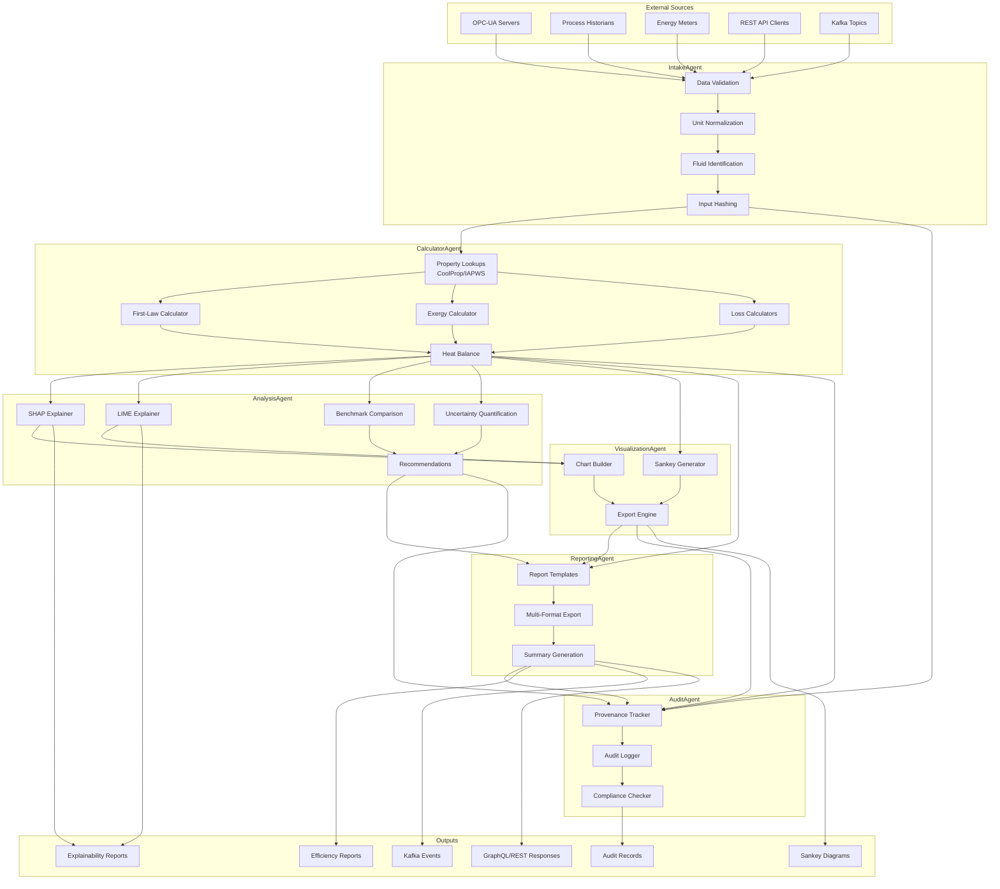

# GL-009 ThermalIQ Architecture Specification

## ThermalFluidAnalyzer - Complete System Architecture

---

## 1. Executive Summary

### Application Purpose and Regulatory Driver

GL-009 ThermalIQ (ThermalFluidAnalyzer) is a shared calculation library designed to provide zero-hallucination deterministic thermodynamic calculations for industrial thermal systems. It supports 25+ heat transfer fluids with comprehensive exergy analysis, SHAP/LIME explainability, and Sankey diagram generation.

**Primary Regulatory Drivers:**
- ISO 50001:2018 (Energy Management Systems)
- ASME PTC 4 series (Performance Test Codes)
- EPA 40 CFR Part 60 (Emissions Monitoring)

### Key Features and Differentiators

| Feature | Description | Differentiator |
|---------|-------------|----------------|
| Multi-Fluid Support | 25+ heat transfer fluids (water/steam, Therminol, Dowtherm, glycols, molten salts, refrigerants) | Industry-leading fluid library |
| Zero Hallucination | All calculations use CoolProp/IAPWS - no LLM in calculation path | Regulatory compliance guaranteed |
| Exergy Analysis | Second-law thermodynamic analysis with improvement potential | Beyond first-law efficiency |
| SHAP/LIME Explainability | Full ML model interpretability | Transparent AI decisions |
| Sankey Diagrams | Interactive energy/exergy flow visualization | Plotly-based, exportable |
| Provenance Tracking | SHA-256 hashed calculation chain | Complete audit trail |

### Performance Targets

| Metric | Target | Measurement |
|--------|--------|-------------|
| Property Lookup | <10ms | Single fluid property |
| Efficiency Calculation | <100ms | Complete first-law calculation |
| Exergy Analysis | <500ms | Full second-law analysis |
| Sankey Generation | <1s | Complete diagram with export |
| Test Coverage | >90% | Unit + integration tests |
| Availability | 99.9% | Uptime SLA |

### Timeline Estimate

| Phase | Duration | Engineers | Deliverables |
|-------|----------|-----------|--------------|
| Phase 1: Core Library | 4 weeks | 3 | Fluid properties, calculators |
| Phase 2: Explainability | 3 weeks | 2 | SHAP/LIME integration |
| Phase 3: Visualization | 2 weeks | 2 | Sankey diagrams, reports |
| Phase 4: Integration | 3 weeks | 2 | OPC-UA, Kafka, GraphQL |
| Phase 5: Testing | 2 weeks | 2 | Full test suite, benchmarks |
| Phase 6: Deployment | 2 weeks | 1 | K8s, monitoring, docs |
| **Total** | **16 weeks** | **3-4 avg** | Production-ready |

---

## 2. Module Structure

```
GL-009_ThermalIQ/
|
|-- pack.yaml                    # Agent pack specification
|-- requirements.txt             # Python dependencies
|-- pyproject.toml              # Project configuration
|-- Dockerfile                  # Container build
|-- docker-compose.yaml         # Local development
|
|-- core/                       # Core orchestration and schemas
|   |-- __init__.py
|   |-- orchestrator.py         # ThermalIQOrchestrator main class
|   |-- config.py               # Configuration management
|   |-- schemas.py              # Pydantic data models
|   |-- exceptions.py           # Custom exceptions
|   |-- constants.py            # Physical constants
|   |-- provenance.py           # SHA-256 provenance tracking
|   |-- handlers.py             # Event handlers
|
|-- fluids/                     # Thermal fluid library
|   |-- __init__.py
|   |-- base.py                 # Abstract base fluid class
|   |-- registry.py             # Fluid registry and factory
|   |-- coolprop_fluids.py      # CoolProp-backed fluids
|   |-- iapws_steam.py          # IAPWS-IF97 water/steam
|   |-- custom_fluids.py        # Custom fluid implementations
|   |-- mixtures.py             # Glycol mixtures, etc.
|   |-- molten_salts.py         # Solar salt, Hitec, etc.
|   |-- refrigerants.py         # R134a, R410A, NH3, CO2
|   |-- property_cache.py       # LRU cache for properties
|   |-- validation.py           # Property range validation
|
|-- calculators/                # Zero-hallucination calculators
|   |-- __init__.py
|   |-- efficiency_calculator.py      # First-law efficiency
|   |-- exergy_calculator.py          # Second-law exergy analysis
|   |-- heat_balance_calculator.py    # Heat balance closure
|   |-- combustion_calculator.py      # Combustion efficiency
|   |-- loss_calculator.py            # Radiation, convection losses
|   |-- steam_calculator.py           # Steam enthalpy, quality
|   |-- heat_transfer_calculator.py   # U-value, LMTD, NTU
|   |-- uncertainty_calculator.py     # Monte Carlo, sensitivity
|   |-- benchmark_calculator.py       # Industry benchmarks
|
|-- explainability/             # SHAP/LIME explainability
|   |-- __init__.py
|   |-- shap_explainer.py       # SHAP value generation
|   |-- lime_explainer.py       # LIME local explanations
|   |-- feature_importance.py   # Global feature importance
|   |-- engineering_rationale.py # Human-readable explanations
|   |-- report_generator.py     # Explainability reports
|   |-- visualization.py        # SHAP/LIME plots
|
|-- visualization/              # Sankey and other visualizations
|   |-- __init__.py
|   |-- sankey_generator.py     # Plotly Sankey diagrams
|   |-- energy_sankey.py        # Energy flow diagrams
|   |-- exergy_sankey.py        # Exergy flow diagrams
|   |-- loss_breakdown.py       # Loss breakdown charts
|   |-- trend_charts.py         # Efficiency trend visualization
|   |-- export.py               # SVG, PNG, PDF export
|   |-- color_schemes.py        # Consistent color palettes
|
|-- api/                        # API layer
|   |-- __init__.py
|   |-- rest_api.py             # FastAPI REST endpoints
|   |-- graphql_schema.py       # Strawberry GraphQL schema
|   |-- graphql_resolvers.py    # GraphQL resolvers
|   |-- middleware.py           # Auth, logging, tracing
|   |-- rate_limiter.py         # API rate limiting
|   |-- validators.py           # Request validation
|   |-- response_models.py      # API response schemas
|
|-- streaming/                  # Event streaming
|   |-- __init__.py
|   |-- kafka_producer.py       # Kafka message production
|   |-- kafka_consumer.py       # Kafka message consumption
|   |-- avro_schemas.py         # Avro schema definitions
|   |-- event_router.py         # Event routing logic
|
|-- connectors/                 # External system connectors
|   |-- __init__.py
|   |-- opcua_connector.py      # OPC-UA client
|   |-- historian_connector.py  # Process historian clients
|   |-- modbus_connector.py     # Modbus energy meters
|   |-- base_connector.py       # Abstract connector interface
|
|-- tests/                      # Test suite
|   |-- __init__.py
|   |-- conftest.py             # Pytest fixtures
|   |-- test_fluids/
|   |   |-- test_coolprop.py
|   |   |-- test_iapws.py
|   |   |-- test_mixtures.py
|   |   |-- test_molten_salts.py
|   |-- test_calculators/
|   |   |-- test_efficiency.py
|   |   |-- test_exergy.py
|   |   |-- test_heat_balance.py
|   |   |-- test_uncertainty.py
|   |-- test_explainability/
|   |   |-- test_shap.py
|   |   |-- test_lime.py
|   |-- test_visualization/
|   |   |-- test_sankey.py
|   |-- test_api/
|   |   |-- test_rest.py
|   |   |-- test_graphql.py
|   |-- test_integration/
|   |   |-- test_end_to_end.py
|   |   |-- test_streaming.py
|   |-- benchmarks/
|       |-- bench_properties.py
|       |-- bench_calculations.py
|
|-- deploy/                     # Deployment configurations
|   |-- kubernetes/
|   |   |-- deployment.yaml
|   |   |-- service.yaml
|   |   |-- configmap.yaml
|   |   |-- secret.yaml
|   |   |-- hpa.yaml
|   |   |-- pdb.yaml
|   |-- helm/
|   |   |-- Chart.yaml
|   |   |-- values.yaml
|   |   |-- templates/
|   |-- terraform/
|       |-- main.tf
|       |-- variables.tf
|
|-- monitoring/
|   |-- prometheus_rules.yaml
|   |-- grafana_dashboard.json
|   |-- alerts.yaml
|
|-- docs/
    |-- api_reference.md
    |-- fluid_library.md
    |-- calculation_methods.md
    |-- integration_guide.md
```

---

## 3. Agent Pipeline Architecture

### Pipeline Overview

```
+------------------+     +-------------------+     +------------------+
|   IntakeAgent    | --> | CalculatorAgent   | --> | AnalysisAgent    |
| (Data Ingestion) |     | (Zero-Halluc.)    |     | (Exergy/Explain) |
+------------------+     +-------------------+     +------------------+
                                                            |
                                                            v
+------------------+     +-------------------+     +------------------+
|   AuditAgent     | <-- | ReportingAgent    | <-- | VisualizationAgt |
| (Provenance)     |     | (Multi-Format)    |     | (Sankey/Charts)  |
+------------------+     +-------------------+     +------------------+
```

### Agent 1: IntakeAgent

**Purpose:** Ingest and normalize thermal process data from multiple sources.

**Inputs:**
- OPC-UA real-time sensor data
- Process historian queries
- CSV/JSON/Excel file uploads
- REST API requests
- Kafka stream messages

**Processing:**
- Data validation against schemas
- Unit conversion and normalization
- Fluid identification and validation
- Operating condition extraction
- Input provenance hash generation

**Outputs:**
- Normalized `ThermalProcessData` objects
- Validation reports
- Input provenance chain

**Estimated Lines of Code:** 1,500-2,000

---

### Agent 2: CalculatorAgent (Zero-Hallucination Core)

**Purpose:** Execute all deterministic thermodynamic calculations.

**Inputs:**
- Normalized process data from IntakeAgent
- Fluid identification
- Operating conditions
- Calculation mode (efficiency/exergy/balance)

**Processing (Zero-Hallucination):**
```
ALL CALCULATIONS USE DETERMINISTIC LOOKUPS:
- CoolProp library for fluid properties
- IAPWS-IF97 for water/steam
- Validated correlations for custom fluids
- NO LLM INVOLVEMENT IN CALCULATIONS
```

**Key Calculations:**
1. First-Law Efficiency: `eta_1 = Q_useful / Q_input`
2. Exergy Flow: `Ex = m * [(h - h0) - T0 * (s - s0)]`
3. Exergy Destruction: `Ex_d = T0 * S_gen`
4. Heat Losses: Radiation, convection, flue gas
5. Combustion Efficiency: From flue gas analysis

**Outputs:**
- `EfficiencyResult` with all metrics
- `ExergyAnalysisResult` with destruction breakdown
- `HeatBalanceResult` with closure verification
- Calculation provenance hashes

**Estimated Lines of Code:** 3,000-4,000

---

### Agent 3: AnalysisAgent

**Purpose:** Perform advanced analysis including explainability and recommendations.

**Inputs:**
- Calculation results from CalculatorAgent
- Historical efficiency data
- Industry benchmarks
- ML model predictions (if applicable)

**Processing:**
- SHAP value computation for feature importance
- LIME local explanations
- Benchmark comparison (percentile ranking)
- Improvement opportunity identification
- Uncertainty quantification (Monte Carlo)

**Outputs:**
- `ExplainabilityReport` with SHAP/LIME results
- `BenchmarkComparison` with gap analysis
- `ImprovementOpportunities` prioritized list
- `UncertaintyAnalysis` with confidence intervals

**Estimated Lines of Code:** 2,500-3,000

---

### Agent 4: VisualizationAgent

**Purpose:** Generate visual representations of thermal analysis.

**Inputs:**
- Energy/exergy balance data
- Loss breakdown
- Trend data
- Diagram configuration

**Processing:**
- Sankey diagram construction (Plotly)
- Energy flow node/link generation
- Exergy flow visualization
- Color coding by category
- Export to multiple formats

**Outputs:**
- `SankeyDiagramData` with Plotly config
- SVG/PNG/PDF exports
- Interactive HTML reports
- Embedded chart objects

**Estimated Lines of Code:** 1,500-2,000

---

### Agent 5: ReportingAgent

**Purpose:** Generate comprehensive multi-format reports.

**Inputs:**
- All calculation results
- Visualizations
- Explainability data
- Audit records

**Processing:**
- Report template rendering
- Multi-format generation (PDF, Excel, JSON, XML)
- Executive summary synthesis
- Recommendation prioritization
- Regulatory compliance formatting

**Outputs:**
- PDF technical reports
- Excel data exports
- JSON/XML API responses
- XBRL-ready data (future)

**Estimated Lines of Code:** 1,500-2,000

---

### Agent 6: AuditAgent

**Purpose:** Maintain complete provenance and audit trail.

**Inputs:**
- All agent outputs
- Calculation provenance hashes
- User actions
- System events

**Processing:**
- SHA-256 hash chain verification
- Append-only audit log maintenance
- Tamper detection
- Compliance report generation
- 7-year retention management

**Outputs:**
- `AuditRecord` with full provenance
- Compliance certificates
- Chain-of-custody reports
- Tamper detection alerts

**Estimated Lines of Code:** 1,000-1,500

---

## 4. Data Flow Diagram



---

## 5. Key Classes and Responsibilities

### Core Module

```python
class ThermalIQOrchestrator:
    """
    Main orchestrator for ThermalIQ agent.
    Coordinates all agents and manages workflow.
    """
    def calculate_efficiency(self, data: ThermalProcessData) -> EfficiencyResult
    def analyze_exergy(self, data: ThermalProcessData) -> ExergyAnalysisResult
    def generate_sankey(self, result: EfficiencyResult) -> SankeyDiagramData
    def explain_prediction(self, result: Any, method: str) -> ExplainabilityReport
    def get_fluid_properties(self, fluid: str, T: float, P: float) -> FluidProperties
```

### Fluids Module

```python
class ThermalFluid(ABC):
    """Abstract base class for all thermal fluids."""
    @abstractmethod
    def get_properties(self, T_C: float, P_bar: float) -> FluidProperties
    @abstractmethod
    def validate_conditions(self, T_C: float, P_bar: float) -> bool

class FluidRegistry:
    """Factory and registry for all supported fluids."""
    def get_fluid(self, name: str) -> ThermalFluid
    def list_fluids(self) -> List[str]
    def get_fluid_info(self, name: str) -> FluidInfo

class CoolPropFluid(ThermalFluid):
    """Fluid backed by CoolProp library."""
    def __init__(self, coolprop_name: str)
    def get_properties(self, T_C: float, P_bar: float) -> FluidProperties

class IAPWSWaterSteam(ThermalFluid):
    """Water/Steam using IAPWS-IF97 formulation."""
    def get_properties(self, T_C: float, P_bar: float) -> FluidProperties
    def get_saturation_properties(self, P_bar: float) -> SaturationProperties

class GlycolMixture(ThermalFluid):
    """Glycol-water mixtures with concentration dependence."""
    def __init__(self, glycol_type: str, concentration_percent: float)
```

### Calculators Module

```python
class EfficiencyCalculator:
    """First-law thermal efficiency calculator."""
    FORMULA_VERSION = "EFF_v1.0"

    def calculate_first_law(self, inputs: EnergyInputs, outputs: EnergyOutputs) -> EfficiencyResult
    def calculate_combustion_efficiency(self, fuel: FuelData, flue_gas: FlueGasData) -> float
    def calculate_heat_losses(self, losses: HeatLosses) -> LossBreakdown

class ExergyCalculator:
    """Second-law exergy analysis calculator."""
    FORMULA_VERSION = "EXERGY_v1.0"

    def __init__(self, T0_K: float = 298.15, P0_kPa: float = 101.325)
    def calculate_stream_exergy(self, stream: ThermalStream) -> StreamExergy
    def calculate_destruction(self, system: ThermalSystem) -> ExergyDestruction
    def calculate_improvement_potential(self) -> float

class HeatBalanceCalculator:
    """Heat balance closure verification."""
    def calculate_balance(self, inputs: List[EnergyFlow], outputs: List[EnergyFlow]) -> HeatBalance
    def verify_closure(self, balance: HeatBalance, tolerance: float = 0.02) -> bool

class UncertaintyCalculator:
    """Monte Carlo uncertainty quantification."""
    def quantify_uncertainty(self, calculation: Callable, inputs: Dict, uncertainties: Dict) -> UncertaintyResult
    def sensitivity_analysis(self, calculation: Callable, inputs: Dict) -> SensitivityResult
```

### Explainability Module

```python
class SHAPExplainer:
    """SHAP-based model explainability."""
    def __init__(self, model: Any, background_data: np.ndarray)
    def explain(self, instance: np.ndarray) -> SHAPExplanation
    def get_feature_importance(self) -> Dict[str, float]
    def generate_summary_plot(self) -> bytes  # PNG
    def generate_force_plot(self, instance: np.ndarray) -> str  # HTML

class LIMEExplainer:
    """LIME local interpretable explanations."""
    def __init__(self, model: Any, feature_names: List[str])
    def explain(self, instance: np.ndarray, num_features: int = 10) -> LIMEExplanation
    def get_local_weights(self) -> Dict[str, float]
    def generate_html_report(self) -> str

class EngineeringRationale:
    """Human-readable engineering explanations."""
    def generate_rationale(self, result: CalculationResult, explanation: Any) -> str
    def identify_root_causes(self, inefficiency: float) -> List[RootCause]
```

### Visualization Module

```python
class SankeyGenerator:
    """Plotly-based Sankey diagram generator."""
    def __init__(self, color_scheme: ColorScheme = DEFAULT_COLORS)
    def generate_energy_sankey(self, balance: EnergyBalance) -> SankeyDiagramData
    def generate_exergy_sankey(self, exergy: ExergyAnalysis) -> SankeyDiagramData
    def to_plotly_figure(self, data: SankeyDiagramData) -> go.Figure
    def export_svg(self, figure: go.Figure) -> bytes
    def export_png(self, figure: go.Figure, scale: int = 2) -> bytes
```

### API Module

```python
# FastAPI REST endpoints
@app.post("/api/v1/thermaliq/efficiency/calculate")
async def calculate_efficiency(request: EfficiencyRequest) -> EfficiencyResponse

@app.post("/api/v1/thermaliq/exergy/analyze")
async def analyze_exergy(request: ExergyRequest) -> ExergyResponse

@app.post("/api/v1/thermaliq/sankey/generate")
async def generate_sankey(request: SankeyRequest) -> SankeyResponse

@app.get("/api/v1/thermaliq/fluids/{fluid_name}/properties")
async def get_fluid_properties(fluid_name: str, T_C: float, P_bar: float) -> FluidPropertiesResponse

# GraphQL Schema
@strawberry.type
class Query:
    @strawberry.field
    def fluid_properties(self, fluid_name: str, temperature_C: float, pressure_bar: float) -> FluidProperties

    @strawberry.field
    def efficiency_calculation(self, calculation_id: str) -> EfficiencyResult

@strawberry.type
class Mutation:
    @strawberry.mutation
    def calculate_efficiency(self, input: EfficiencyInput) -> EfficiencyResult
```

---

## 6. Thermodynamic Calculation Approach for 25+ Fluids

### Zero-Hallucination Architecture

```
CRITICAL: NO LLM IN CALCULATION PATH

All thermodynamic calculations use:
1. CoolProp library (validated against NIST)
2. IAPWS-IF97 formulation (international standard)
3. Custom correlations with published coefficients
4. Lookup tables with linear interpolation

LLM is ONLY used for:
- Classification of improvement opportunities
- Natural language recommendation generation
- Report narrative synthesis
- Entity resolution for equipment names
```

### Fluid Property Calculation Strategy

```python
def get_properties(fluid_name: str, T_C: float, P_bar: float) -> FluidProperties:
    """
    Zero-hallucination property lookup strategy.
    """
    # 1. Check cache first (LRU cache, 85%+ hit rate target)
    cache_key = f"{fluid_name}:{T_C:.2f}:{P_bar:.3f}"
    if cache_key in property_cache:
        return property_cache[cache_key]

    # 2. Route to appropriate library
    if fluid_name in COOLPROP_FLUIDS:
        # CoolProp: 100+ fluids with validated properties
        props = CoolProp.PropsSI(['D','C','V','L','H','S'],
                                  'T', T_C+273.15, 'P', P_bar*1e5,
                                  coolprop_name)

    elif fluid_name in ['Water', 'Steam']:
        # IAPWS-IF97: Industrial steam formulation
        props = iapws.IAPWS97(T=T_C+273.15, P=P_bar*0.1)

    elif fluid_name in MOLTEN_SALTS:
        # Custom correlations from literature
        props = molten_salt_correlations(fluid_name, T_C)

    elif fluid_name in SYNTHETIC_OILS:
        # Manufacturer-provided correlations
        props = synthetic_oil_correlations(fluid_name, T_C)

    else:
        raise UnsupportedFluidError(fluid_name)

    # 3. Validate results
    validate_property_ranges(props, fluid_name, T_C, P_bar)

    # 4. Cache and return
    property_cache[cache_key] = props
    return props
```

### Supported Fluid Categories

| Category | Fluids | Library | Temperature Range |
|----------|--------|---------|-------------------|
| Water/Steam | Water, Steam | CoolProp + IAPWS | 0-600 C |
| Synthetic HTFs | Therminol VP-1, 55, 66, XP, Dowtherm A, G, Q | CoolProp + custom | -40 to 400 C |
| Glycols | Ethylene Glycol, Propylene Glycol, DEG, TEG | CoolProp | -50 to 160 C |
| Silicones | Syltherm 800, XLT | Custom | -100 to 400 C |
| Mineral Oils | Mobiltherm 603, 605, Shell Thermia B | Custom | -10 to 315 C |
| Molten Salts | Solar Salt, Hitec, Hitec XL | Custom | 120-600 C |
| Refrigerants | R134a, R410A, R717, CO2 | CoolProp | -77 to 132 C |
| Gases | Air, N2, Combustion Gas | CoolProp + custom | -200 to 1500 C |

### Calculation Formulas (Deterministic)

**First-Law Efficiency:**
```
eta_1 = Q_useful / Q_input
      = (m_out * h_out - m_in * h_in) / (m_fuel * HHV)
```

**Exergy Flow:**
```
Ex = m_dot * [(h - h_0) - T_0 * (s - s_0)]

where:
  h_0, s_0 = dead state enthalpy/entropy at T_0, P_0
  T_0 = 298.15 K (25 C) reference temperature
```

**Exergy Destruction:**
```
Ex_destruction = T_0 * S_generation
               = Ex_in - Ex_out - Ex_useful
```

**Heat Loss - Radiation:**
```
Q_rad = epsilon * sigma * A * (T_s^4 - T_amb^4)

where:
  sigma = 5.67e-8 W/m2-K4 (Stefan-Boltzmann)
  epsilon = surface emissivity (0-1)
```

**Heat Loss - Convection:**
```
Q_conv = h * A * (T_s - T_amb)

where:
  h = convection coefficient (natural/forced)
```

---

## 7. Integration Patterns

### OPC-UA Integration

```python
class OPCUAConnector:
    """
    OPC-UA connector for real-time process data.
    """
    async def connect(self, endpoint: str, security_mode: str):
        """Connect with certificate-based authentication."""

    async def subscribe_tags(self, tags: List[str], interval_ms: int = 1000):
        """Subscribe to tag updates with configurable interval."""

    async def read_values(self, tags: List[str]) -> Dict[str, TagValue]:
        """Read current values for specified tags."""
```

### Kafka Streaming

```python
class ThermalIQKafkaProducer:
    """
    Kafka producer for efficiency events.
    """
    TOPICS = {
        'telemetry': 'thermaliq.telemetry.normalized',
        'efficiency': 'thermaliq.efficiency.calculated',
        'exergy': 'thermaliq.exergy.analysis',
        'sankey': 'thermaliq.sankey.generated',
        'audit': 'thermaliq.audit.log'
    }

    async def publish_efficiency_result(self, result: EfficiencyResult):
        """Publish efficiency calculation to Kafka."""
```

### GraphQL API

```graphql
type Query {
  fluidProperties(
    fluidName: String!
    temperatureC: Float!
    pressureBar: Float!
  ): FluidProperties!

  efficiencyCalculation(id: ID!): EfficiencyResult

  supportedFluids: [FluidInfo!]!
}

type Mutation {
  calculateEfficiency(input: EfficiencyInput!): EfficiencyResult!

  analyzeExergy(input: ExergyInput!): ExergyAnalysisResult!

  generateSankey(input: SankeyInput!): SankeyDiagramData!
}

type Subscription {
  efficiencyUpdated(equipmentId: ID!): EfficiencyResult!
}
```

---

## 8. Security Architecture

### Authentication Flow

```
Client -> API Gateway -> JWT Validation -> ThermalIQ API
                    |
                    v
              OAuth2/OIDC Provider
              (Keycloak, Auth0, Azure AD)
```

### RBAC Permissions

| Role | Permissions |
|------|-------------|
| viewer | Read results, view reports |
| analyst | + Generate reports |
| engineer | + Run calculations, configure fluids |
| admin | + Manage configuration, audit access |

### Secrets Management

```yaml
# HashiCorp Vault integration
secrets:
  path: secret/data/thermaliq
  keys:
    - DATABASE_URL
    - KAFKA_CREDENTIALS
    - OPCUA_CERTIFICATE
    - API_SIGNING_KEY
```

---

## 9. Performance and Scalability

### Caching Strategy

```python
# Three-tier caching
CACHE_TIERS = {
    'L1': 'in_memory_lru',      # 10,000 entries, <1ms
    'L2': 'redis',               # 1M entries, <5ms
    'L3': 'postgresql',          # Persistent, <50ms
}

# Property cache configuration
PROPERTY_CACHE = {
    'max_size': 100_000,
    'ttl_seconds': 3600,
    'hit_rate_target': 0.85
}
```

### Horizontal Scaling

```yaml
# Kubernetes HPA configuration
apiVersion: autoscaling/v2
kind: HorizontalPodAutoscaler
metadata:
  name: thermaliq-hpa
spec:
  scaleTargetRef:
    apiVersion: apps/v1
    kind: Deployment
    name: thermaliq
  minReplicas: 2
  maxReplicas: 20
  metrics:
    - type: Resource
      resource:
        name: cpu
        target:
          type: Utilization
          averageUtilization: 70
```

---

## 10. Testing Strategy

### Test Coverage Targets

| Category | Coverage Target | Test Types |
|----------|-----------------|------------|
| Fluid Properties | 95% | Unit, property validation |
| Calculators | 95% | Unit, formula verification |
| Explainability | 85% | Unit, integration |
| API | 90% | Unit, integration, E2E |
| Streaming | 85% | Integration |
| **Overall** | **90%** | All |

### Benchmark Tests

```python
@pytest.mark.benchmark
def test_property_lookup_performance():
    """Property lookup must complete in <10ms."""
    fluid = registry.get_fluid('Therminol_VP1')

    start = time.perf_counter()
    for _ in range(1000):
        props = fluid.get_properties(T_C=300, P_bar=1)
    elapsed = time.perf_counter() - start

    assert elapsed / 1000 < 0.010  # <10ms per lookup
```

---

## 11. Development Estimates

| Component | Weeks | Engineers | LOC Estimate |
|-----------|-------|-----------|--------------|
| Core/Orchestrator | 2 | 2 | 2,000 |
| Fluids Library | 3 | 2 | 3,000 |
| Calculators | 3 | 2 | 4,000 |
| Explainability | 2 | 2 | 2,500 |
| Visualization | 2 | 1 | 2,000 |
| API Layer | 2 | 1 | 2,000 |
| Streaming | 1 | 1 | 1,000 |
| Connectors | 2 | 1 | 1,500 |
| Tests | 2 | 2 | 3,000 |
| Deployment | 1 | 1 | 500 |
| **Total** | **16** | **3-4 avg** | **~21,500** |

---

## 12. Risks and Mitigations

| Risk | Probability | Impact | Mitigation |
|------|-------------|--------|------------|
| CoolProp calculation errors | Low | High | Validate against NIST, extensive testing |
| Custom fluid correlation accuracy | Medium | Medium | Cross-validate with manufacturer data |
| SHAP computation performance | Medium | Medium | Background data sampling, caching |
| OPC-UA connectivity issues | Medium | Medium | Retry logic, graceful degradation |
| Kafka message ordering | Low | Medium | Partition by equipment ID |
| Property extrapolation errors | Medium | High | Strict range validation, fail-closed |

---

## 13. Appendices

### A. Physical Constants

```python
PHYSICAL_CONSTANTS = {
    'STEFAN_BOLTZMANN': 5.670374419e-8,  # W/m2-K4
    'UNIVERSAL_GAS': 8.314462618,         # J/mol-K
    'ABSOLUTE_ZERO_C': -273.15,
    'STANDARD_PRESSURE_BAR': 1.01325,
    'STANDARD_TEMPERATURE_K': 298.15,
}
```

### B. Regulatory References

- ISO 50001:2018 - Energy management systems
- ASME PTC 4-2013 - Fired Steam Generators
- ASME PTC 4.1-2008 - Steam Generating Units
- ASME PTC 19.1-2018 - Test Uncertainty
- IAPWS-IF97 - Industrial Formulation for Water/Steam
- CoolProp Documentation - http://www.coolprop.org/

### C. Competitor Analysis

| Feature | ThermalIQ | Competitor A | Competitor B |
|---------|-----------|--------------|--------------|
| Fluids Supported | 25+ | 10 | 15 |
| Zero-Hallucination | Yes | No | Partial |
| SHAP/LIME | Yes | No | SHAP only |
| Exergy Analysis | Yes | Limited | Yes |
| Sankey Diagrams | Yes | Yes | No |
| OPC-UA Integration | Yes | Yes | No |
| Audit Trail | 7 years | 1 year | 3 years |
