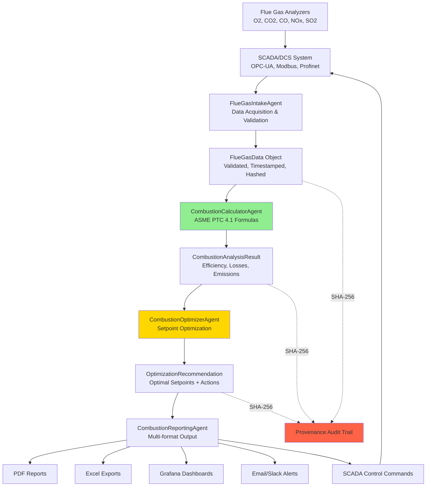

# GL-018 FLUEFLOW - Architecture Diagrams

**Visual Architecture Reference**
Last Updated: December 2, 2025

---

## System Architecture Overview

```
┌───────────────────────────────────────────────────────────────────────┐
│                           CLIENT LAYER                                 │
│                                                                        │
│  ┌──────────────┐  ┌──────────────┐  ┌──────────────┐                │
│  │  Grafana     │  │   REST API   │  │  WebSocket   │                │
│  │  Dashboard   │  │   Clients    │  │   Clients    │                │
│  └──────────────┘  └──────────────┘  └──────────────┘                │
└───────────────────────────────────────────────────────────────────────┘
                               │
                               │ HTTPS/WSS
                               ▼
┌───────────────────────────────────────────────────────────────────────┐
│                          API GATEWAY LAYER                             │
│                                                                        │
│  ┌────────────────────────────────────────────────────────────────┐  │
│  │  FastAPI Application (Port 8000)                               │  │
│  │  - Authentication/Authorization (OAuth2 + JWT)                 │  │
│  │  - Rate Limiting (100 req/min)                                 │  │
│  │  - Request Validation (Pydantic)                               │  │
│  │  - WebSocket Subscriptions (real-time updates)                 │  │
│  └────────────────────────────────────────────────────────────────┘  │
└───────────────────────────────────────────────────────────────────────┘
                               │
                               ▼
┌───────────────────────────────────────────────────────────────────────┐
│                         AGENT PIPELINE LAYER                           │
│                                                                        │
│  ┌─────────────────────────────────────────────────────────────────┐ │
│  │                    FlueGasIntakeAgent                           │ │
│  │  - SCADA data acquisition (OPC-UA, Modbus, Profinet)           │ │
│  │  - Data validation and quality assessment                      │ │
│  │  - Unit conversion (ppm ↔ mg/Nm³, °F ↔ °C)                    │ │
│  │  - Provenance hash generation (SHA-256)                        │ │
│  └─────────────────────────┬───────────────────────────────────────┘ │
│                            │                                           │
│                            ▼                                           │
│  ┌─────────────────────────────────────────────────────────────────┐ │
│  │              CombustionCalculatorAgent                          │ │
│  │  - Combustion efficiency (ASME PTC 4.1)                        │ │
│  │  - Excess air calculation (O2 method)                          │ │
│  │  - Air-fuel ratio (stoichiometric + actual)                    │ │
│  │  - Heat loss breakdown (stack, moisture, incomplete)           │ │
│  │  - 100% DETERMINISTIC - NO LLM                                 │ │
│  └─────────────────────────┬───────────────────────────────────────┘ │
│                            │                                           │
│                            ▼                                           │
│  ┌─────────────────────────────────────────────────────────────────┐ │
│  │              CombustionOptimizerAgent                           │ │
│  │  - Optimal excess air determination                            │ │
│  │  - Setpoint recommendations (O2, damper position)              │ │
│  │  - Multi-objective optimization (efficiency, emissions)        │ │
│  │  - LLM for narrative recommendations ONLY                      │ │
│  └─────────────────────────┬───────────────────────────────────────┘ │
│                            │                                           │
│                            ▼                                           │
│  ┌─────────────────────────────────────────────────────────────────┐ │
│  │              CombustionReportingAgent                           │ │
│  │  - PDF/Excel report generation                                 │ │
│  │  - Grafana dashboard data formatting                           │ │
│  │  - Compliance reports (EPA, permit limits)                     │ │
│  │  - Email/Slack notifications                                   │ │
│  └─────────────────────────────────────────────────────────────────┘ │
└───────────────────────────────────────────────────────────────────────┘
                               │
                ┌──────────────┼──────────────┐
                │              │              │
                ▼              ▼              ▼
┌──────────────────┐ ┌──────────────────┐ ┌──────────────────┐
│  DATA LAYER      │ │  INTEGRATION     │ │  MONITORING      │
│                  │ │  LAYER           │ │  LAYER           │
└──────────────────┘ └──────────────────┘ └──────────────────┘
        │                     │                     │
        ▼                     ▼                     ▼
┌──────────────┐     ┌──────────────┐     ┌──────────────┐
│ TimescaleDB  │     │ SCADA Client │     │ Prometheus   │
│ (PostgreSQL) │     │ (OPC-UA)     │     │ Exporter     │
├──────────────┤     ├──────────────┤     ├──────────────┤
│ Redis Cache  │     │ Modbus Client│     │ Grafana      │
│ (State)      │     ├──────────────┤     │ Dashboard    │
├──────────────┤     │ Profinet     │     ├──────────────┤
│ Config Store │     │ Client       │     │ Alert        │
│ (YAML)       │     └──────────────┘     │ Manager      │
└──────────────┘                          └──────────────┘
```

---

## Agent Pipeline Data Flow



---

## Real-Time Data Flow (Detail)

```
┌──────────────────────────────────────────────────────────────────┐
│                    INDUSTRIAL EQUIPMENT                          │
│                                                                  │
│  ┌─────────────┐  ┌─────────────┐  ┌─────────────┐            │
│  │   Boiler    │  │   Furnace   │  │   Heater    │            │
│  │  Flue Gas   │  │  Flue Gas   │  │  Flue Gas   │            │
│  └──────┬──────┘  └──────┬──────┘  └──────┬──────┘            │
│         │                │                │                     │
│         └────────────────┼────────────────┘                     │
│                          │                                      │
└──────────────────────────┼──────────────────────────────────────┘
                           │
                           ▼
┌──────────────────────────────────────────────────────────────────┐
│               FLUE GAS ANALYZERS                                 │
│                                                                  │
│  ┌──────────┐ ┌──────────┐ ┌──────────┐ ┌──────────┐          │
│  │ O2 Sensor│ │CO2 Sensor│ │CO Sensor │ │NOx Sensor│          │
│  │ (0-21%)  │ │(0-20%)   │ │(0-500ppm)│ │(0-500ppm)│          │
│  └────┬─────┘ └────┬─────┘ └────┬─────┘ └────┬─────┘          │
│       │            │            │            │                  │
│  ┌────┴────────────┴────────────┴────────────┴───────┐         │
│  │         Analyzer Controller                       │         │
│  │         (4-20mA, Modbus, HART)                    │         │
│  └────────────────────────┬──────────────────────────┘         │
└───────────────────────────┼─────────────────────────────────────┘
                            │
                            ▼
┌──────────────────────────────────────────────────────────────────┐
│                  SCADA/DCS SYSTEM                                │
│                                                                  │
│  ┌────────────────────────────────────────────────────┐         │
│  │  PLC / DCS Controller                              │         │
│  │  - Tag Database (O2, CO, NOx, Stack Temp)         │         │
│  │  - Control Loops (O2 trim, fuel flow)             │         │
│  │  - Alarm Management                                │         │
│  └────────────────────────┬───────────────────────────┘         │
│                           │                                      │
│  ┌────────────────────────▼───────────────────────────┐         │
│  │  OPC-UA Server / Modbus Server                     │         │
│  │  - Real-time tag publishing                        │         │
│  │  - Subscription support (change-of-value)          │         │
│  └────────────────────────┬───────────────────────────┘         │
└───────────────────────────┼─────────────────────────────────────┘
                            │
                            │ Network (Ethernet, Industrial)
                            │ Poll every 1-5 seconds
                            ▼
┌──────────────────────────────────────────────────────────────────┐
│                   GL-018 FLUEFLOW AGENT                          │
│                                                                  │
│  ┌────────────────────────────────────────────────────┐         │
│  │  SCADA Client (asyncua / pymodbus)                 │         │
│  │  - Async I/O for non-blocking communication        │         │
│  │  - Auto-reconnect with exponential backoff         │         │
│  │  - Tag subscription management                     │         │
│  └────────────────────────┬───────────────────────────┘         │
│                           │                                      │
│                           ▼                                      │
│  ┌────────────────────────────────────────────────────┐         │
│  │  FlueGasIntakeAgent                                │         │
│  │  - Data validation (range, quality flags)          │         │
│  │  - Unit conversion                                 │         │
│  │  - Timestamp normalization (UTC)                   │         │
│  │  - SHA-256 provenance hash                         │         │
│  └────────────────────────┬───────────────────────────┘         │
│                           │                                      │
│                           ▼                                      │
│  ┌────────────────────────────────────────────────────┐         │
│  │  Redis Cache (L2 Cache)                            │         │
│  │  - Current flue gas values (5-min TTL)             │         │
│  │  - Frequently accessed data                        │         │
│  │  - Pub/Sub for WebSocket updates                   │         │
│  └────────────────────────┬───────────────────────────┘         │
│                           │                                      │
│                           ▼                                      │
│  ┌────────────────────────────────────────────────────┐         │
│  │  CombustionCalculatorAgent                         │         │
│  │  - ASME PTC 4.1 efficiency calculation             │         │
│  │  - Excess air calculation (O2 method)              │         │
│  │  - Air-fuel ratio calculation                      │         │
│  │  - Heat loss breakdown                             │         │
│  │  - Latency: < 200ms (p95 target)                   │         │
│  └────────────────────────┬───────────────────────────┘         │
│                           │                                      │
│                           ▼                                      │
│  ┌────────────────────────────────────────────────────┐         │
│  │  TimescaleDB (Time-Series Database)                │         │
│  │  - Hypertable: flue_gas_measurements               │         │
│  │  - Hypertable: combustion_analysis_results         │         │
│  │  - Continuous aggregates (1-min, 1-hour)           │         │
│  │  - Data retention: 90 days (raw), 1 year (1-min)   │         │
│  └────────────────────────┬───────────────────────────┘         │
│                           │                                      │
│                           ▼                                      │
│  ┌────────────────────────────────────────────────────┐         │
│  │  CombustionOptimizerAgent                          │         │
│  │  - Optimal setpoint calculation                    │         │
│  │  - Multi-objective optimization                    │         │
│  │  - LLM narrative generation (Claude Sonnet 4.5)    │         │
│  └────────────────────────┬───────────────────────────┘         │
│                           │                                      │
│                ┌──────────┼──────────┐                          │
│                │          │          │                          │
│                ▼          ▼          ▼                          │
│       ┌──────────┐ ┌──────────┐ ┌──────────┐                  │
│       │ Grafana  │ │ FastAPI  │ │ SCADA    │                  │
│       │Dashboard │ │ Response │ │ Control  │                  │
│       │(WebSocket│ │ (REST)   │ │Commands  │                  │
│       └──────────┘ └──────────┘ └──────────┘                  │
└──────────────────────────────────────────────────────────────────┘
```

---

## Database Schema (TimescaleDB)

```
┌─────────────────────────────────────────────────────────────┐
│               flue_gas_measurements (Hypertable)            │
├─────────────────────────────────────────────────────────────┤
│ measurement_id       UUID PRIMARY KEY                       │
│ combustor_id         VARCHAR(50) NOT NULL                   │
│ timestamp            TIMESTAMPTZ NOT NULL                   │
│                                                             │
│ o2_percent           NUMERIC(5,2)                           │
│ co2_percent          NUMERIC(5,2)                           │
│ co_ppm               NUMERIC(8,2)                           │
│ nox_ppm              NUMERIC(8,2)                           │
│ so2_ppm              NUMERIC(8,2)                           │
│ stack_temperature_f  NUMERIC(6,2)                           │
│ fuel_flow_rate       NUMERIC(10,2)                          │
│                                                             │
│ data_quality         VARCHAR(10)                            │
│ provenance_hash      VARCHAR(64) NOT NULL                   │
│ source               VARCHAR(50)                            │
│                                                             │
│ PRIMARY KEY (combustor_id, timestamp)                       │
│ INDEX: combustor_id, timestamp DESC                         │
└─────────────────────────────────────────────────────────────┘
                           │
                           │ Continuous Aggregation
                           ▼
┌─────────────────────────────────────────────────────────────┐
│          fluegas_1min (Continuous Aggregate)                │
├─────────────────────────────────────────────────────────────┤
│ combustor_id         VARCHAR(50)                            │
│ bucket               TIMESTAMPTZ (1-minute intervals)       │
│ avg_o2               NUMERIC(5,2)                           │
│ avg_co2              NUMERIC(5,2)                           │
│ avg_co               NUMERIC(8,2)                           │
│ avg_nox              NUMERIC(8,2)                           │
│ avg_stack_temp       NUMERIC(6,2)                           │
│ sample_count         INTEGER                                │
└─────────────────────────────────────────────────────────────┘
                           │
                           │ Further Aggregation
                           ▼
┌─────────────────────────────────────────────────────────────┐
│          fluegas_1hour (Continuous Aggregate)               │
├─────────────────────────────────────────────────────────────┤
│ combustor_id         VARCHAR(50)                            │
│ bucket               TIMESTAMPTZ (1-hour intervals)         │
│ avg_o2               NUMERIC(5,2)                           │
│ avg_efficiency       NUMERIC(5,2)                           │
│ total_fuel_consumed  NUMERIC(10,2)                          │
│ avg_excess_air       NUMERIC(6,2)                           │
└─────────────────────────────────────────────────────────────┘

┌─────────────────────────────────────────────────────────────┐
│        combustion_analysis_results (Hypertable)             │
├─────────────────────────────────────────────────────────────┤
│ analysis_id                    UUID PRIMARY KEY             │
│ combustor_id                   VARCHAR(50) NOT NULL         │
│ timestamp                      TIMESTAMPTZ NOT NULL         │
│                                                             │
│ combustion_efficiency_percent  NUMERIC(5,2)                 │
│ excess_air_percent             NUMERIC(6,2)                 │
│ air_fuel_ratio_actual          NUMERIC(8,4)                 │
│                                                             │
│ stack_loss_percent             NUMERIC(5,2)                 │
│ moisture_loss_percent          NUMERIC(5,2)                 │
│ incomplete_combustion_loss     NUMERIC(5,2)                 │
│                                                             │
│ nox_lb_mmbtu                   NUMERIC(8,4)                 │
│ co_lb_mmbtu                    NUMERIC(8,4)                 │
│ co2_lb_mmbtu                   NUMERIC(8,4)                 │
│                                                             │
│ fuel_savings_potential         NUMERIC(10,2)                │
│ provenance_hash                VARCHAR(64) NOT NULL         │
│ formula_version                VARCHAR(50)                  │
│                                                             │
│ FOREIGN KEY (combustor_id, timestamp)                       │
│   REFERENCES flue_gas_measurements(combustor_id, timestamp) │
└─────────────────────────────────────────────────────────────┘

┌─────────────────────────────────────────────────────────────┐
│      optimization_recommendations (Hypertable)              │
├─────────────────────────────────────────────────────────────┤
│ recommendation_id              UUID PRIMARY KEY             │
│ combustor_id                   VARCHAR(50) NOT NULL         │
│ timestamp                      TIMESTAMPTZ NOT NULL         │
│                                                             │
│ optimal_o2_percent             NUMERIC(5,2)                 │
│ optimal_excess_air_percent     NUMERIC(6,2)                 │
│ air_damper_adjustment_percent  NUMERIC(6,2)                 │
│                                                             │
│ efficiency_improvement_percent NUMERIC(5,2)                 │
│ fuel_savings_mmbtu_hr          NUMERIC(10,2)                │
│ fuel_cost_savings_usd_hr       NUMERIC(10,2)                │
│                                                             │
│ primary_recommendation         TEXT                         │
│ secondary_recommendations      JSONB                        │
│ warnings                       JSONB                        │
│                                                             │
│ implemented                    BOOLEAN DEFAULT FALSE        │
│ implementation_timestamp       TIMESTAMPTZ                  │
│ provenance_hash                VARCHAR(64) NOT NULL         │
└─────────────────────────────────────────────────────────────┘
```

---

## Deployment Architecture (Kubernetes)

```
┌─────────────────────────────────────────────────────────────────┐
│                     KUBERNETES CLUSTER                          │
│                                                                 │
│  ┌───────────────────────────────────────────────────────────┐ │
│  │              Load Balancer (Ingress Controller)           │ │
│  │              - NGINX Ingress                              │ │
│  │              - TLS Termination                            │ │
│  │              - Rate Limiting                              │ │
│  └─────────────────────────┬─────────────────────────────────┘ │
│                            │                                    │
│         ┌──────────────────┼──────────────────┐                │
│         │                  │                  │                │
│         ▼                  ▼                  ▼                │
│  ┌──────────┐      ┌──────────┐      ┌──────────┐            │
│  │ FLUEFLOW │      │ FLUEFLOW │      │ FLUEFLOW │            │
│  │ Pod 1    │      │ Pod 2    │      │ Pod 3    │            │
│  │          │      │          │      │          │            │
│  │ CPU: 500m│      │ CPU: 500m│      │ CPU: 500m│            │
│  │ Mem: 1Gi │      │ Mem: 1Gi │      │ Mem: 1Gi │            │
│  └─────┬────┘      └─────┬────┘      └─────┬────┘            │
│        │                 │                 │                  │
│        └─────────────────┼─────────────────┘                  │
│                          │                                    │
│         ┌────────────────┼────────────────┐                   │
│         │                │                │                   │
│         ▼                ▼                ▼                   │
│  ┌─────────────┐  ┌─────────────┐  ┌─────────────┐          │
│  │TimescaleDB  │  │Redis Cluster│  │Prometheus   │          │
│  │(StatefulSet)│  │(StatefulSet)│  │(Deployment) │          │
│  │             │  │             │  │             │          │
│  │ Replicas: 3 │  │ Replicas: 3 │  │ Replicas: 2 │          │
│  │ PV: 100GB   │  │ PV: 10GB    │  │ PV: 50GB    │          │
│  └─────────────┘  └─────────────┘  └─────────────┘          │
│                                                               │
│  ┌─────────────────────────────────────────────────────────┐ │
│  │                 ConfigMaps & Secrets                    │ │
│  │  - flueflow-config (YAML configuration)                │ │
│  │  - scada-credentials (encrypted)                       │ │
│  │  - database-credentials (encrypted)                    │ │
│  │  - jwt-secret (encrypted)                              │ │
│  └─────────────────────────────────────────────────────────┘ │
└─────────────────────────────────────────────────────────────────┘

┌─────────────────────────────────────────────────────────────────┐
│                    EXTERNAL CONNECTIONS                         │
│                                                                 │
│  ┌──────────────┐  ┌──────────────┐  ┌──────────────┐         │
│  │   SCADA      │  │   Flue Gas   │  │   Grafana    │         │
│  │   Server     │  │   Analyzers  │  │   (External) │         │
│  │ (OPC-UA/     │  │  (Modbus)    │  │              │         │
│  │  Modbus)     │  │              │  │              │         │
│  └──────────────┘  └──────────────┘  └──────────────┘         │
└─────────────────────────────────────────────────────────────────┘
```

---

## Security Architecture

```
┌─────────────────────────────────────────────────────────────────┐
│                    DEFENSE-IN-DEPTH LAYERS                      │
└─────────────────────────────────────────────────────────────────┘

┌─────────────────────────────────────────────────────────────────┐
│  Layer 1: Network Security                                      │
│  ┌──────────────────────────────────────────────────────────┐  │
│  │  Firewall Rules                                          │  │
│  │  - Allow: 8000 (API), 9090 (Metrics), 4840 (OPC-UA)     │  │
│  │  - Deny: All other inbound traffic                      │  │
│  │  - VPN for remote access                                │  │
│  │  - Network segmentation (SCADA separate from enterprise)│  │
│  └──────────────────────────────────────────────────────────┘  │
└─────────────────────────────────────────────────────────────────┘
                           │
                           ▼
┌─────────────────────────────────────────────────────────────────┐
│  Layer 2: Transport Security                                    │
│  ┌──────────────────────────────────────────────────────────┐  │
│  │  TLS 1.3 (HTTPS)                                         │  │
│  │  - Certificate-based authentication for OPC-UA          │  │
│  │  - Mutual TLS (mTLS) for agent-to-agent communication   │  │
│  │  - Encrypted Modbus (Modbus over TLS)                   │  │
│  └──────────────────────────────────────────────────────────┘  │
└─────────────────────────────────────────────────────────────────┘
                           │
                           ▼
┌─────────────────────────────────────────────────────────────────┐
│  Layer 3: Application Security                                  │
│  ┌──────────────────────────────────────────────────────────┐  │
│  │  OAuth2 + JWT Authentication                            │  │
│  │  - 1-hour token expiry                                   │  │
│  │  - Role-Based Access Control (RBAC):                    │  │
│  │    * ADMIN: Full access                                 │  │
│  │    * ENGINEER: Read, optimize, control SCADA            │  │
│  │    * OPERATOR: Read, submit data                        │  │
│  │    * VIEWER: Read-only                                  │  │
│  │  - API Rate Limiting: 100 req/min per client            │  │
│  └──────────────────────────────────────────────────────────┘  │
└─────────────────────────────────────────────────────────────────┘
                           │
                           ▼
┌─────────────────────────────────────────────────────────────────┐
│  Layer 4: Data Security                                         │
│  ┌──────────────────────────────────────────────────────────┐  │
│  │  AES-256 Encryption at Rest (database)                  │  │
│  │  SHA-256 Provenance Hashing (tamper detection)          │  │
│  │  Secrets Management (HashiCorp Vault / AWS Secrets)     │  │
│  │  - SCADA credentials encrypted                          │  │
│  │  - Database passwords encrypted                         │  │
│  │  - JWT secret key encrypted                             │  │
│  └──────────────────────────────────────────────────────────┘  │
└─────────────────────────────────────────────────────────────────┘
                           │
                           ▼
┌─────────────────────────────────────────────────────────────────┐
│  Layer 5: Audit Logging                                         │
│  ┌──────────────────────────────────────────────────────────┐  │
│  │  Immutable Audit Logs                                    │  │
│  │  - All API requests logged (user, timestamp, action)    │  │
│  │  - SCADA control commands logged separately             │  │
│  │  - Calculation provenance tracked (SHA-256)             │  │
│  │  - Compliance audit trail (EPA reporting)               │  │
│  └──────────────────────────────────────────────────────────┘  │
└─────────────────────────────────────────────────────────────────┘
```

---

## Monitoring Architecture

```
┌─────────────────────────────────────────────────────────────────┐
│                   PROMETHEUS METRICS COLLECTION                 │
│                                                                 │
│  ┌──────────────────────────────────────────────────────────┐  │
│  │  FLUEFLOW Application (Port 9090)                        │  │
│  │                                                          │  │
│  │  Custom Metrics:                                         │  │
│  │  - flueflow_combustion_efficiency_pct                   │  │
│  │  - flueflow_excess_air_pct                              │  │
│  │  - flueflow_oxygen_pct_dry                              │  │
│  │  - flueflow_carbon_monoxide_ppm                         │  │
│  │  - flueflow_nox_ppm_at_3pct_o2                          │  │
│  │  - flueflow_stack_temperature_f                         │  │
│  │  - flueflow_fuel_consumption_mmbtu_hr                   │  │
│  │  - flueflow_annual_fuel_cost_usd                        │  │
│  │  - flueflow_potential_savings_usd                       │  │
│  │  - flueflow_co2_emissions_tons_year                     │  │
│  │  - flueflow_emissions_compliant                         │  │
│  │  - flueflow_optimizations_total                         │  │
│  │  - flueflow_alerts_total{severity,type}                 │  │
│  │                                                          │  │
│  │  Standard Metrics:                                       │  │
│  │  - process_cpu_seconds_total                            │  │
│  │  - process_resident_memory_bytes                        │  │
│  │  - http_requests_total{method,endpoint,status}          │  │
│  │  - http_request_duration_seconds{method,endpoint}       │  │
│  └──────────────────────────────────────────────────────────┘  │
└──────────────────────────┬──────────────────────────────────────┘
                           │
                           │ Scrape every 15 seconds
                           ▼
┌─────────────────────────────────────────────────────────────────┐
│                   PROMETHEUS SERVER                             │
│                                                                 │
│  - Time-series database for metrics                            │
│  - Alerting rules engine                                       │
│  - Query language (PromQL)                                     │
│  - Retention: 30 days                                          │
└──────────────────────────┬──────────────────────────────────────┘
                           │
                           ▼
┌─────────────────────────────────────────────────────────────────┐
│                   ALERTMANAGER                                  │
│                                                                 │
│  Alert Rules:                                                  │
│  - high_carbon_monoxide (CO > 100 ppm) → PagerDuty             │
│  - low_combustion_efficiency (< 75%) → Email                   │
│  - nox_limit_exceeded (NOx > permit) → PagerDuty               │
│  - high_excess_air (> 30%) → Slack                             │
│  - analyzer_fault → Email                                      │
└──────────────────────────┬──────────────────────────────────────┘
                           │
                           ▼
┌─────────────────────────────────────────────────────────────────┐
│                   GRAFANA DASHBOARDS                            │
│                                                                 │
│  Dashboard 1: Combustion Overview                              │
│  - Current efficiency (gauge)                                  │
│  - Excess air trend (line chart)                               │
│  - Emissions vs. limits (bar chart)                            │
│                                                                 │
│  Dashboard 2: Flue Gas Analysis                                │
│  - O2, CO2, CO, NOx real-time values (gauges)                  │
│  - Stack temperature trend (line chart)                        │
│  - Fuel flow trend (area chart)                                │
│                                                                 │
│  Dashboard 3: Efficiency Dashboard                             │
│  - Heat losses breakdown (pie chart)                           │
│  - Efficiency trend (line chart)                               │
│  - Optimization opportunities (table)                          │
│                                                                 │
│  Dashboard 4: Emissions Compliance                             │
│  - NOx, CO, SO2 vs. limits (gauge + line chart)                │
│  - Compliance status (indicator)                               │
│  - Excursion log (table)                                       │
└─────────────────────────────────────────────────────────────────┘
```

---

**Document Version**: 1.0.0
**Last Updated**: December 2, 2025
**Maintained By**: GreenLang Architecture Team (GL-AppArchitect)
