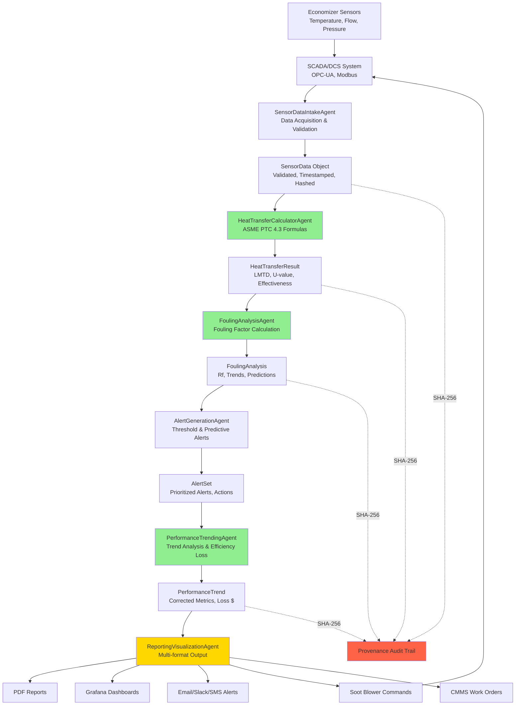

# GL-020 ECONOPULSE - Architecture Diagrams

**Visual Architecture Reference**
Last Updated: December 3, 2025

---

## System Architecture Overview

```
+===========================================================================+
|                           CLIENT LAYER                                     |
|                                                                            |
|  +----------------+  +----------------+  +----------------+  +----------+  |
|  |   Operations   |  |   Maintenance  |  |   Dashboard    |  |  Mobile  |  |
|  |   Control UI   |  |   Planning UI  |  |   (Grafana)    |  |   App    |  |
|  +----------------+  +----------------+  +----------------+  +----------+  |
|  +----------------+  +----------------+  +----------------+                |
|  |   REST API     |  |   WebSocket    |  |   SCADA/HMI    |                |
|  |   Clients      |  |   Real-time    |  |   Integration  |                |
|  +----------------+  +----------------+  +----------------+                |
+===========================================================================+
                                |
                                | HTTPS/WSS/OPC-UA
                                v
+===========================================================================+
|                          API GATEWAY LAYER                                 |
|                                                                            |
|  +---------------------------------------------------------------------+  |
|  |  FastAPI Application (Port 8000)                                    |  |
|  |  - Authentication/Authorization (OAuth2 + JWT)                      |  |
|  |  - Rate Limiting (100 req/min standard, 500/min for sensors)        |  |
|  |  - Request Validation (Pydantic)                                    |  |
|  |  - WebSocket Subscriptions (real-time performance alerts)           |  |
|  |  - Sensor Data Ingestion Endpoint (high-throughput)                 |  |
|  +---------------------------------------------------------------------+  |
+===========================================================================+
                                |
                                v
+===========================================================================+
|                         AGENT PIPELINE LAYER                               |
|                    (6-Stage Monitoring Pipeline)                           |
|                                                                            |
|  +---------------------------------------------------------------------+  |
|  |                    SensorDataIntakeAgent                            |  |
|  |  - Multi-sensor data acquisition (feedwater, flue gas, flow)        |  |
|  |  - SCADA/DCS integration (OPC-UA, Modbus, Profinet)                 |  |
|  |  - Data validation and quality assessment                           |  |
|  |  - Unit conversion and normalization                                |  |
|  |  - Provenance hash generation (SHA-256)                             |  |
|  |  - 100% DETERMINISTIC - NO LLM                                      |  |
|  +-----------------------------+---------------------------------------+  |
|                                |                                           |
|                                v                                           |
|  +---------------------------------------------------------------------+  |
|  |                    HeatTransferCalculatorAgent                      |  |
|  |  - LMTD (Log Mean Temperature Difference) calculation               |  |
|  |  - Overall Heat Transfer Coefficient (U-value)                      |  |
|  |  - Heat Duty (Q) calculations                                       |  |
|  |  - Effectiveness (epsilon) calculations                             |  |
|  |  - ASME PTC 4.3 compliant formulas                                  |  |
|  |  - 100% DETERMINISTIC - NO LLM                                      |  |
|  +-----------------------------+---------------------------------------+  |
|                                |                                           |
|                                v                                           |
|  +---------------------------------------------------------------------+  |
|  |                    FoulingAnalysisAgent                             |  |
|  |  - Fouling Factor (Rf) calculation and trending                     |  |
|  |  - Baseline performance comparison                                  |  |
|  |  - Fouling rate prediction (regression model)                       |  |
|  |  - Gas-side ash deposition modeling                                 |  |
|  |  - Water-side scaling detection                                     |  |
|  |  - 100% DETERMINISTIC - NO LLM                                      |  |
|  +-----------------------------+---------------------------------------+  |
|                                |                                           |
|                                v                                           |
|  +---------------------------------------------------------------------+  |
|  |                    AlertGenerationAgent                             |  |
|  |  - Threshold-based alert generation                                 |  |
|  |  - Rate-of-change (derivative) alerts                               |  |
|  |  - Predictive maintenance alerts (statistical model)                |  |
|  |  - Alert prioritization (Critical/High/Medium/Low)                  |  |
|  |  - Soot blower trigger recommendations                              |  |
|  |  - 100% DETERMINISTIC - NO LLM                                      |  |
|  +-----------------------------+---------------------------------------+  |
|                                |                                           |
|                                v                                           |
|  +---------------------------------------------------------------------+  |
|  |                    PerformanceTrendingAgent                         |  |
|  |  - Real-time trend calculation (moving averages)                    |  |
|  |  - Historical performance comparison                                |  |
|  |  - Seasonal normalization (ambient temperature correction)          |  |
|  |  - Load-corrected performance metrics                               |  |
|  |  - Efficiency loss quantification (kW, $/hour)                      |  |
|  |  - 100% DETERMINISTIC - NO LLM                                      |  |
|  +-----------------------------+---------------------------------------+  |
|                                |                                           |
|                                v                                           |
|  +---------------------------------------------------------------------+  |
|  |                    ReportingVisualizationAgent                      |  |
|  |  - Real-time dashboard data formatting                              |  |
|  |  - PDF/Excel performance reports                                    |  |
|  |  - Cleaning history analysis                                        |  |
|  |  - ROI tracking (cleaning cost vs. efficiency gain)                 |  |
|  |  - Email/Slack/SMS notifications                                    |  |
|  |  - LLM for narrative recommendations ONLY                           |  |
|  +---------------------------------------------------------------------+  |
+===========================================================================+
                                |
                +---------------+---------------+
                |               |               |
                v               v               v
+------------------+ +------------------+ +------------------+
|  DATA LAYER      | |  INTEGRATION     | |  MONITORING      |
|                  | |  LAYER           | |  LAYER           |
+------------------+ +------------------+ +------------------+
        |                     |                     |
        v                     v                     v
+------------------+ +------------------+ +------------------+
| TimescaleDB      | | OPC-UA Client    | | Prometheus       |
| (Time-Series)    | | (SCADA)          | | Exporter         |
+------------------+ +------------------+ +------------------+
| Redis Cache      | | Modbus Client    | | Grafana          |
| (Real-time)      | | (PLC/RTU)        | | Dashboard        |
+------------------+ +------------------+ +------------------+
| PostgreSQL       | | Soot Blower API  | | Alert            |
| (Config/Audit)   | | (Control)        | | Manager          |
+------------------+ +------------------+ +------------------+
```

---

## Agent Pipeline Data Flow



---

## Six-Agent Pipeline Architecture (Detail)

```
+===========================================================================+
|                      GL-020 ECONOPULSE PIPELINE                            |
|                    (6-Agent Monitoring Architecture)                       |
+===========================================================================+

           +------------------+
           |  SENSOR INPUTS   |
           +--------+---------+
                    |
    +---------------+---------------+---------------+
    |               |               |               |
    v               v               v               v
+-------+       +-------+       +-------+       +-------+
|Feedwtr|       |FlueGas|       | Flow  |       | Diff  |
| Temp  |       | Temp  |       | Rate  |       |Press. |
|Sensors|       |Sensors|       |Sensors|       |Sensors|
+---+---+       +---+---+       +---+---+       +---+---+
    |               |               |               |
    +-------+-------+-------+-------+-------+-------+
            |               |               |
            v               v               v
    +--------------+  +--------------+  +--------------+
    |  OPC-UA/     |  |   Modbus     |  |  Profinet/   |
    |  SCADA       |  |   RTU/TCP    |  |  EthernetIP  |
    +--------------+  +--------------+  +--------------+
            |               |               |
            +-------+-------+---------------+
                    |
                    v
    +===============================================+
    |   AGENT 1: SensorDataIntakeAgent              |
    |                                               |
    | - Multi-protocol data acquisition             |
    | - Temperature validation (0-1000 deg F)       |
    | - Flow rate validation (0-500,000 lb/hr)      |
    | - Pressure validation (0-500 psig)            |
    | - Timestamp synchronization (NTP)             |
    | - SHA-256 provenance hash                     |
    +=======================+======================+
                            |
                            v
    +===============================================+
    |   AGENT 2: HeatTransferCalculatorAgent        |
    |                                               |
    | Formulas (ASME PTC 4.3):                      |
    |                                               |
    | LMTD = (dT1 - dT2) / ln(dT1/dT2)             |
    |                                               |
    | Q = m_dot * Cp * (T_out - T_in)               |
    |                                               |
    | U = Q / (A * LMTD)                            |
    |                                               |
    | epsilon = Q_actual / Q_max                    |
    |                                               |
    | 100% DETERMINISTIC - NO LLM                   |
    +=======================+======================+
                            |
                            v
    +===============================================+
    |   AGENT 3: FoulingAnalysisAgent               |
    |                                               |
    | Fouling Factor:                               |
    | Rf = (1/U_actual) - (1/U_clean)               |
    |                                               |
    | Fouling Rate (regression):                    |
    | dRf/dt = slope of Rf vs. time                 |
    |                                               |
    | Time to Threshold:                            |
    | t_clean = (Rf_threshold - Rf_current)/rate   |
    |                                               |
    | 100% DETERMINISTIC - NO LLM                   |
    +=======================+======================+
                            |
                            v
    +===============================================+
    |   AGENT 4: AlertGenerationAgent               |
    |                                               |
    | Alert Types:                                  |
    | - Threshold: Rf > 0.002 hr-ft2-F/BTU         |
    | - Rate: dRf/dt > 0.0001/day                  |
    | - Predictive: time_to_clean < 72 hours       |
    | - Equipment: Soot blower malfunction         |
    |                                               |
    | Priority Levels:                              |
    | - CRITICAL: Immediate action required         |
    | - HIGH: Action within 4 hours                |
    | - MEDIUM: Action within 24 hours             |
    | - LOW: Informational                         |
    |                                               |
    | 100% DETERMINISTIC - NO LLM                   |
    +=======================+======================+
                            |
                            v
    +===============================================+
    |   AGENT 5: PerformanceTrendingAgent           |
    |                                               |
    | Trend Calculations:                           |
    | - Moving averages (1hr, 8hr, 24hr)           |
    | - Load-corrected performance                 |
    | - Ambient temperature correction             |
    | - Seasonal baseline comparison               |
    |                                               |
    | Efficiency Loss:                              |
    | dEta = (U_clean - U_actual) / U_clean        |
    | Loss_kW = dEta * Q_rated                     |
    | Loss_USD = Loss_kW * fuel_price * hours      |
    |                                               |
    | 100% DETERMINISTIC - NO LLM                   |
    +=======================+======================+
                            |
                            v
    +===============================================+
    |   AGENT 6: ReportingVisualizationAgent        |
    |                                               |
    | Outputs:                                      |
    | - Grafana dashboard data (JSON)              |
    | - PDF performance reports                    |
    | - Excel data exports                         |
    | - Email/Slack/SMS alerts                     |
    | - Soot blower trigger commands               |
    | - CMMS work order generation                 |
    |                                               |
    | LLM Usage (Narrative ONLY):                  |
    | - Natural language performance summaries     |
    | - Cleaning recommendations text              |
    | - Trend interpretation                       |
    |                                               |
    | NO calculations by LLM                        |
    +===============================================+
                            |
        +-------------------+-------------------+
        |           |           |           |
        v           v           v           v
    +-------+   +-------+   +-------+   +-------+
    |Grafana|   | PDF   |   | Soot  |   | CMMS  |
    |Dashbd |   |Report |   |Blower |   | Work  |
    |       |   |       |   |Trigger|   | Order |
    +-------+   +-------+   +-------+   +-------+
```

---

## Sensor Data Flow from Field to Alerts

```
+===========================================================================+
|                    ECONOMIZER INSTRUMENTATION                              |
|                                                                            |
|  +-------------------------------+  +-------------------------------+     |
|  |    FEEDWATER SIDE             |  |    FLUE GAS SIDE              |     |
|  |                               |  |                               |     |
|  |  +--------+    +--------+    |  |  +--------+    +--------+    |     |
|  |  | T_in   |    | T_out  |    |  |  | T_in   |    | T_out  |    |     |
|  |  | (TE-1) |    | (TE-2) |    |  |  | (TE-3) |    | (TE-4) |    |     |
|  |  |230 degF|    |310 degF|    |  |  |650 degF|    |350 degF|    |     |
|  |  +---+----+    +---+----+    |  |  +---+----+    +---+----+    |     |
|  |      |            |          |  |      |            |          |     |
|  |  +---+----+    +---+----+    |  |  +---+----+    +---+----+    |     |
|  |  | FT-1   |    | PT-1   |    |  |  | FT-2   |    | PDT-1  |    |     |
|  |  |Flow    |    |Press   |    |  |  |Flow    |    |DiffPrs |    |     |
|  |  |200klb/h|    |350 psig|    |  |  |2.5MCF/h|    |1.2 inH2O   |     |
|  |  +---+----+    +---+----+    |  |  +---+----+    +---+----+    |     |
|  +------|------------|----------+  +------|------------|----------+     |
|         |            |                    |            |                 |
|         +------------+--------------------+------------+                 |
|                      |                                                   |
+===========================================================================+
                       |
                       | 4-20mA / HART / Modbus
                       v
+===========================================================================+
|                    SCADA/DCS SYSTEM                                        |
|                                                                            |
|  +---------------------------------------------------------------------+  |
|  |  PLC / DCS Controller                                               |  |
|  |  +---------------------------------------------------------------+  |  |
|  |  |  Tag Database                                                  |  |  |
|  |  |  - ECON_FW_TEMP_IN       (TE-1)   230.5 degF                   |  |  |
|  |  |  - ECON_FW_TEMP_OUT      (TE-2)   310.2 degF                   |  |  |
|  |  |  - ECON_FG_TEMP_IN       (TE-3)   648.7 degF                   |  |  |
|  |  |  - ECON_FG_TEMP_OUT      (TE-4)   351.3 degF                   |  |  |
|  |  |  - ECON_FW_FLOW          (FT-1)   198,500 lb/hr                |  |  |
|  |  |  - ECON_FG_FLOW          (FT-2)   2,485,000 SCFH               |  |  |
|  |  |  - ECON_DIFF_PRESS       (PDT-1)  1.18 inH2O                   |  |  |
|  |  |  - ECON_FW_PRESS         (PT-1)   348.5 psig                   |  |  |
|  |  |  - SOOT_BLOWER_1_STATUS           READY                        |  |  |
|  |  |  - SOOT_BLOWER_2_STATUS           RUNNING                      |  |  |
|  |  +---------------------------------------------------------------+  |  |
|  +---------------------------------------------------------------------+  |
|                                                                            |
|  +---------------------------------------------------------------------+  |
|  |  OPC-UA Server (Port 4840)                                          |  |
|  |  - Real-time tag publishing                                         |  |
|  |  - Subscription: change-of-value + sampling (1 second)              |  |
|  |  - Historical access interface                                      |  |
|  +---------------------------------------------------------------------+  |
+===========================================================================+
                       |
                       | OPC-UA / Modbus TCP
                       | Polling: 1-5 seconds
                       v
+===========================================================================+
|                    GL-020 ECONOPULSE AGENT                                 |
|                                                                            |
|  +---------------------------------------------------------------------+  |
|  |  SensorDataIntakeAgent                                              |  |
|  |                                                                     |  |
|  |  +---------------------------------------------------------------+  |  |
|  |  |  Data Validation                                               |  |  |
|  |  |  - Range check: 0 < T_fw_in < 500 degF                         |  |  |
|  |  |  - Range check: T_fw_out > T_fw_in (sanity)                    |  |  |
|  |  |  - Quality flag check (GOOD/BAD/UNCERTAIN)                     |  |  |
|  |  |  - Timestamp validation (within 60 seconds of server time)     |  |  |
|  |  +---------------------------------------------------------------+  |  |
|  |                                                                     |  |
|  |  +---------------------------------------------------------------+  |  |
|  |  |  Unit Conversion                                               |  |  |
|  |  |  - Temperature: degF <-> degC                                  |  |  |
|  |  |  - Flow: lb/hr <-> kg/hr, SCFH <-> Nm3/hr                      |  |  |
|  |  |  - Pressure: psig <-> kPa, inH2O <-> Pa                        |  |  |
|  |  +---------------------------------------------------------------+  |  |
|  |                                                                     |  |
|  |  +---------------------------------------------------------------+  |  |
|  |  |  Provenance Generation                                         |  |  |
|  |  |  SHA-256 Hash = hash(                                          |  |  |
|  |  |    all_sensor_values + timestamp + source_id                   |  |  |
|  |  |  )                                                             |  |  |
|  |  +---------------------------------------------------------------+  |  |
|  +---------------------------------------------------------------------+  |
|                       |                                                    |
|                       v                                                    |
|  +---------------------------------------------------------------------+  |
|  |  HeatTransferCalculatorAgent                                        |  |
|  |                                                                     |  |
|  |  Inputs:                                                            |  |
|  |  - T_fw_in = 230.5 degF                                             |  |
|  |  - T_fw_out = 310.2 degF                                            |  |
|  |  - T_fg_in = 648.7 degF                                             |  |
|  |  - T_fg_out = 351.3 degF                                            |  |
|  |  - m_fw = 198,500 lb/hr                                             |  |
|  |  - A = 12,500 ft2 (from config)                                     |  |
|  |                                                                     |  |
|  |  Calculations:                                                      |  |
|  |  +---------------------------------------------------------------+  |  |
|  |  |  dT1 = T_fg_in - T_fw_out = 648.7 - 310.2 = 338.5 degF         |  |  |
|  |  |  dT2 = T_fg_out - T_fw_in = 351.3 - 230.5 = 120.8 degF         |  |  |
|  |  |                                                                |  |  |
|  |  |  LMTD = (dT1 - dT2) / ln(dT1/dT2)                              |  |  |
|  |  |       = (338.5 - 120.8) / ln(338.5/120.8)                      |  |  |
|  |  |       = 217.7 / 1.031                                          |  |  |
|  |  |       = 211.2 degF                                              |  |  |
|  |  |                                                                |  |  |
|  |  |  Q = m_fw * Cp * (T_fw_out - T_fw_in)                          |  |  |
|  |  |    = 198,500 * 1.0 * (310.2 - 230.5)                           |  |  |
|  |  |    = 15,820,850 BTU/hr                                          |  |  |
|  |  |                                                                |  |  |
|  |  |  U = Q / (A * LMTD)                                             |  |  |
|  |  |    = 15,820,850 / (12,500 * 211.2)                             |  |  |
|  |  |    = 5.99 BTU/(hr-ft2-degF)                                    |  |  |
|  |  +---------------------------------------------------------------+  |  |
|  +---------------------------------------------------------------------+  |
|                       |                                                    |
|                       v                                                    |
|  +---------------------------------------------------------------------+  |
|  |  FoulingAnalysisAgent                                               |  |
|  |                                                                     |  |
|  |  Configuration:                                                     |  |
|  |  - U_clean = 8.5 BTU/(hr-ft2-degF) (baseline)                       |  |
|  |  - Rf_threshold = 0.002 hr-ft2-degF/BTU (cleaning trigger)          |  |
|  |                                                                     |  |
|  |  Calculations:                                                      |  |
|  |  +---------------------------------------------------------------+  |  |
|  |  |  Rf = (1/U_actual) - (1/U_clean)                               |  |  |
|  |  |     = (1/5.99) - (1/8.5)                                       |  |  |
|  |  |     = 0.167 - 0.118                                            |  |  |
|  |  |     = 0.049 hr-ft2-degF/BTU                                    |  |  |
|  |  |                                                                |  |  |
|  |  |  Fouling Factor Status: EXCEEDED THRESHOLD                     |  |  |
|  |  |                                                                |  |  |
|  |  |  Efficiency Loss:                                               |  |  |
|  |  |  dEta = (U_clean - U_actual) / U_clean                         |  |  |
|  |  |       = (8.5 - 5.99) / 8.5                                     |  |  |
|  |  |       = 29.5%                                                  |  |  |
|  |  +---------------------------------------------------------------+  |  |
|  +---------------------------------------------------------------------+  |
|                       |                                                    |
|                       v                                                    |
|  +---------------------------------------------------------------------+  |
|  |  AlertGenerationAgent                                               |  |
|  |                                                                     |  |
|  |  Alert Generated:                                                   |  |
|  |  +---------------------------------------------------------------+  |  |
|  |  |  ALERT ID: ALT-20251203-001                                    |  |  |
|  |  |  PRIORITY: CRITICAL                                            |  |  |
|  |  |  TYPE: FOULING_THRESHOLD_EXCEEDED                              |  |  |
|  |  |                                                                |  |  |
|  |  |  MESSAGE: Economizer fouling factor (0.049) exceeds            |  |  |
|  |  |           threshold (0.002). Efficiency loss: 29.5%.           |  |  |
|  |  |           Immediate soot blowing recommended.                  |  |  |
|  |  |                                                                |  |  |
|  |  |  ACTIONS:                                                      |  |  |
|  |  |  - Trigger soot blower sequence                                |  |  |
|  |  |  - Generate maintenance work order                             |  |  |
|  |  |  - Notify operations team (Email/Slack/SMS)                    |  |  |
|  |  +---------------------------------------------------------------+  |  |
|  +---------------------------------------------------------------------+  |
+===========================================================================+
```

---

## Database Schema (TimescaleDB + PostgreSQL)

```
+===========================================================================+
|                    TIME-SERIES DATA (TimescaleDB)                          |
+===========================================================================+

+--------------------------------------------------------------------------+
|               economizer_measurements (Hypertable)                        |
+--------------------------------------------------------------------------+
| measurement_id              UUID PRIMARY KEY                              |
| economizer_id               VARCHAR(50) NOT NULL                          |
| tenant_id                   UUID NOT NULL                                 |
| timestamp                   TIMESTAMPTZ NOT NULL                          |
|                                                                           |
| -- Feedwater Side --                                                      |
| feedwater_temp_in_f         NUMERIC(8,2)        (inlet temperature)       |
| feedwater_temp_out_f        NUMERIC(8,2)        (outlet temperature)      |
| feedwater_flow_lb_hr        NUMERIC(12,2)       (mass flow rate)          |
| feedwater_pressure_psig     NUMERIC(8,2)        (operating pressure)      |
|                                                                           |
| -- Flue Gas Side --                                                       |
| flue_gas_temp_in_f          NUMERIC(8,2)        (inlet temperature)       |
| flue_gas_temp_out_f         NUMERIC(8,2)        (outlet temperature)      |
| flue_gas_flow_scfh          NUMERIC(14,2)       (volumetric flow)         |
| differential_pressure_inh2o NUMERIC(6,3)        (tube bank dP)            |
|                                                                           |
| -- Soot Blower Status --                                                  |
| soot_blower_1_status        VARCHAR(20)         (READY/RUNNING/FAULT)     |
| soot_blower_2_status        VARCHAR(20)                                   |
| last_soot_blow_timestamp    TIMESTAMPTZ                                   |
|                                                                           |
| -- Data Quality --                                                        |
| data_quality                VARCHAR(10)         (GOOD/BAD/UNCERTAIN)      |
| provenance_hash             VARCHAR(64) NOT NULL (SHA-256)                |
| source                      VARCHAR(50)         (OPC-UA/Modbus/API)       |
|                                                                           |
| PRIMARY KEY (economizer_id, timestamp)                                    |
| INDEX: tenant_id, timestamp DESC                                          |
| INDEX: economizer_id, data_quality                                        |
+--------------------------------------------------------------------------+
                              |
                              | Processed by HeatTransferCalculatorAgent
                              v
+--------------------------------------------------------------------------+
|               heat_transfer_calculations (Hypertable)                     |
+--------------------------------------------------------------------------+
| calculation_id              UUID PRIMARY KEY                              |
| economizer_id               VARCHAR(50) NOT NULL                          |
| tenant_id                   UUID NOT NULL                                 |
| timestamp                   TIMESTAMPTZ NOT NULL                          |
| measurement_id              UUID NOT NULL FK                              |
|                                                                           |
| -- Temperature Differences --                                             |
| delta_t1_f                  NUMERIC(8,2)        (hot end approach)        |
| delta_t2_f                  NUMERIC(8,2)        (cold end approach)       |
| lmtd_f                      NUMERIC(8,2)        (log mean temp diff)      |
|                                                                           |
| -- Heat Transfer --                                                       |
| heat_duty_btu_hr            NUMERIC(14,2)       (Q actual)                |
| u_value_actual              NUMERIC(8,4)        (BTU/hr-ft2-F)            |
| effectiveness               NUMERIC(6,4)        (epsilon, 0-1)            |
|                                                                           |
| -- Reference Values --                                                    |
| surface_area_ft2            NUMERIC(10,2)       (from config)             |
| u_value_clean               NUMERIC(8,4)        (baseline U)              |
|                                                                           |
| -- Audit --                                                               |
| formula_version             VARCHAR(20)         (ASME_PTC_4.3_2023)       |
| provenance_hash             VARCHAR(64) NOT NULL                          |
|                                                                           |
| FOREIGN KEY (measurement_id) REFERENCES economizer_measurements           |
| INDEX: economizer_id, timestamp DESC                                      |
+--------------------------------------------------------------------------+
                              |
                              | Processed by FoulingAnalysisAgent
                              v
+--------------------------------------------------------------------------+
|               fouling_analysis (Hypertable)                               |
+--------------------------------------------------------------------------+
| analysis_id                 UUID PRIMARY KEY                              |
| economizer_id               VARCHAR(50) NOT NULL                          |
| tenant_id                   UUID NOT NULL                                 |
| timestamp                   TIMESTAMPTZ NOT NULL                          |
| calculation_id              UUID NOT NULL FK                              |
|                                                                           |
| -- Fouling Metrics --                                                     |
| fouling_factor_rf           NUMERIC(10,6)       (hr-ft2-F/BTU)            |
| fouling_rate_per_day        NUMERIC(10,8)       (dRf/dt)                  |
| time_to_threshold_hours     NUMERIC(8,2)        (predicted)               |
|                                                                           |
| -- Performance Impact --                                                  |
| efficiency_loss_percent     NUMERIC(6,2)        ((U_clean-U)/U_clean)     |
| heat_recovery_loss_btu_hr   NUMERIC(14,2)       (lost heat duty)          |
| fuel_penalty_usd_hr         NUMERIC(10,2)       (cost of lost efficiency) |
|                                                                           |
| -- Fouling Classification --                                              |
| fouling_type                VARCHAR(30)         (GAS_SIDE/WATER_SIDE)     |
| fouling_severity            VARCHAR(20)         (LOW/MEDIUM/HIGH/CRITICAL)|
|                                                                           |
| -- Reference --                                                           |
| threshold_rf                NUMERIC(10,6)       (cleaning trigger)        |
| baseline_timestamp          TIMESTAMPTZ         (when clean baseline set) |
| provenance_hash             VARCHAR(64) NOT NULL                          |
|                                                                           |
| INDEX: economizer_id, timestamp DESC                                      |
| INDEX: fouling_severity                                                   |
+--------------------------------------------------------------------------+

+--------------------------------------------------------------------------+
|               performance_trends (Hypertable)                             |
+--------------------------------------------------------------------------+
| trend_id                    UUID PRIMARY KEY                              |
| economizer_id               VARCHAR(50) NOT NULL                          |
| tenant_id                   UUID NOT NULL                                 |
| timestamp                   TIMESTAMPTZ NOT NULL                          |
|                                                                           |
| -- Trend Metrics --                                                       |
| u_value_1hr_avg             NUMERIC(8,4)        (1-hour moving avg)       |
| u_value_8hr_avg             NUMERIC(8,4)        (8-hour moving avg)       |
| u_value_24hr_avg            NUMERIC(8,4)        (24-hour moving avg)      |
|                                                                           |
| -- Load-Corrected Performance --                                          |
| load_percent                NUMERIC(5,2)        (% of rated capacity)     |
| u_value_corrected           NUMERIC(8,4)        (normalized to 100%)      |
| ambient_temp_correction     NUMERIC(6,2)        (seasonal adjustment)     |
|                                                                           |
| -- Efficiency Loss Trending --                                            |
| cumulative_loss_btu         NUMERIC(16,2)       (since last cleaning)     |
| cumulative_loss_usd         NUMERIC(12,2)       (monetary impact)         |
|                                                                           |
| -- Comparison --                                                          |
| percent_of_baseline         NUMERIC(6,2)        (current vs clean)        |
| days_since_cleaning         INTEGER                                       |
|                                                                           |
| provenance_hash             VARCHAR(64) NOT NULL                          |
|                                                                           |
| INDEX: economizer_id, timestamp DESC                                      |
+--------------------------------------------------------------------------+

+===========================================================================+
|                    CONTINUOUS AGGREGATES                                   |
+===========================================================================+

+--------------------------------------------------------------------------+
|               economizer_1min (Continuous Aggregate)                      |
+--------------------------------------------------------------------------+
| economizer_id               VARCHAR(50)                                   |
| bucket                      TIMESTAMPTZ (1-minute intervals)              |
|                                                                           |
| avg_fw_temp_gain_f          NUMERIC(8,2)        (T_out - T_in)            |
| avg_fg_temp_drop_f          NUMERIC(8,2)        (T_in - T_out)            |
| avg_lmtd_f                  NUMERIC(8,2)                                  |
| avg_u_value                 NUMERIC(8,4)                                  |
| avg_heat_duty_mmbtu_hr      NUMERIC(10,4)                                 |
| avg_fouling_factor          NUMERIC(10,6)                                 |
| avg_diff_pressure           NUMERIC(6,3)                                  |
|                                                                           |
| sample_count                INTEGER                                       |
| data_quality_good_pct       NUMERIC(5,2)        (% good quality samples)  |
+--------------------------------------------------------------------------+

+--------------------------------------------------------------------------+
|               economizer_1hour (Continuous Aggregate)                     |
+--------------------------------------------------------------------------+
| economizer_id               VARCHAR(50)                                   |
| bucket                      TIMESTAMPTZ (1-hour intervals)                |
|                                                                           |
| avg_u_value                 NUMERIC(8,4)                                  |
| avg_fouling_factor          NUMERIC(10,6)                                 |
| avg_efficiency_loss_pct     NUMERIC(6,2)                                  |
| total_heat_duty_mmbtu       NUMERIC(12,2)                                 |
| total_efficiency_loss_usd   NUMERIC(10,2)                                 |
| soot_blow_count             INTEGER                                       |
+--------------------------------------------------------------------------+

+--------------------------------------------------------------------------+
|               economizer_1day (Continuous Aggregate)                      |
+--------------------------------------------------------------------------+
| economizer_id               VARCHAR(50)                                   |
| bucket                      TIMESTAMPTZ (1-day intervals)                 |
|                                                                           |
| avg_u_value                 NUMERIC(8,4)                                  |
| min_u_value                 NUMERIC(8,4)                                  |
| max_u_value                 NUMERIC(8,4)                                  |
| avg_fouling_factor          NUMERIC(10,6)                                 |
| total_efficiency_loss_usd   NUMERIC(12,2)                                 |
| soot_blow_count             INTEGER                                       |
| cleaning_events             INTEGER                                       |
| alerts_generated            INTEGER                                       |
+--------------------------------------------------------------------------+

+===========================================================================+
|                    RELATIONAL DATA (PostgreSQL)                            |
+===========================================================================+

+--------------------------------------------------------------------------+
|               alerts (Alerts Table)                                       |
+--------------------------------------------------------------------------+
| alert_id                    UUID PRIMARY KEY                              |
| economizer_id               VARCHAR(50) NOT NULL                          |
| tenant_id                   UUID NOT NULL                                 |
| timestamp                   TIMESTAMPTZ NOT NULL                          |
|                                                                           |
| alert_type                  VARCHAR(50) NOT NULL                          |
|   -- FOULING_THRESHOLD_EXCEEDED                                           |
|   -- FOULING_RATE_HIGH                                                    |
|   -- CLEANING_PREDICTED_SOON                                              |
|   -- DIFF_PRESSURE_HIGH                                                   |
|   -- SOOT_BLOWER_FAULT                                                    |
|   -- SENSOR_FAULT                                                         |
|                                                                           |
| priority                    VARCHAR(20) NOT NULL                          |
|   -- CRITICAL, HIGH, MEDIUM, LOW                                          |
|                                                                           |
| message                     TEXT NOT NULL                                 |
| details                     JSONB                                         |
| recommended_actions         JSONB                                         |
|                                                                           |
| status                      VARCHAR(20) DEFAULT 'ACTIVE'                  |
|   -- ACTIVE, ACKNOWLEDGED, RESOLVED, SUPPRESSED                           |
|                                                                           |
| acknowledged_by             VARCHAR(100)                                  |
| acknowledged_at             TIMESTAMPTZ                                   |
| resolved_at                 TIMESTAMPTZ                                   |
| resolution_notes            TEXT                                          |
|                                                                           |
| provenance_hash             VARCHAR(64) NOT NULL                          |
|                                                                           |
| INDEX: tenant_id, status, priority                                        |
| INDEX: economizer_id, timestamp DESC                                      |
+--------------------------------------------------------------------------+

+--------------------------------------------------------------------------+
|               cleaning_events (Cleaning History)                          |
+--------------------------------------------------------------------------+
| event_id                    UUID PRIMARY KEY                              |
| economizer_id               VARCHAR(50) NOT NULL                          |
| tenant_id                   UUID NOT NULL                                 |
|                                                                           |
| cleaning_type               VARCHAR(30) NOT NULL                          |
|   -- SOOT_BLOW_AUTO                                                       |
|   -- SOOT_BLOW_MANUAL                                                     |
|   -- WATER_WASH                                                           |
|   -- CHEMICAL_CLEAN                                                       |
|   -- MECHANICAL_CLEAN                                                     |
|                                                                           |
| started_at                  TIMESTAMPTZ NOT NULL                          |
| completed_at                TIMESTAMPTZ                                   |
| duration_minutes            INTEGER                                       |
|                                                                           |
| -- Pre-Cleaning Metrics --                                                |
| pre_u_value                 NUMERIC(8,4)                                  |
| pre_fouling_factor          NUMERIC(10,6)                                 |
| pre_diff_pressure           NUMERIC(6,3)                                  |
|                                                                           |
| -- Post-Cleaning Metrics --                                               |
| post_u_value                NUMERIC(8,4)                                  |
| post_fouling_factor         NUMERIC(10,6)                                 |
| post_diff_pressure          NUMERIC(6,3)                                  |
|                                                                           |
| -- Effectiveness --                                                       |
| recovery_percent            NUMERIC(6,2)        ((post-pre)/pre*100)      |
| cost_usd                    NUMERIC(10,2)       (cleaning cost)           |
| roi_usd                     NUMERIC(10,2)       (savings - cost)          |
|                                                                           |
| initiated_by                VARCHAR(100)        (user or AUTO)            |
| notes                       TEXT                                          |
|                                                                           |
| INDEX: economizer_id, started_at DESC                                     |
+--------------------------------------------------------------------------+

+--------------------------------------------------------------------------+
|               economizer_config (Equipment Configuration)                 |
+--------------------------------------------------------------------------+
| config_id                   UUID PRIMARY KEY                              |
| economizer_id               VARCHAR(50) UNIQUE NOT NULL                   |
| tenant_id                   UUID NOT NULL                                 |
|                                                                           |
| -- Equipment Identification --                                            |
| economizer_name             VARCHAR(200) NOT NULL                         |
| manufacturer                VARCHAR(100)                                  |
| model                       VARCHAR(100)                                  |
| serial_number               VARCHAR(100)                                  |
| installation_date           DATE                                          |
|                                                                           |
| -- Design Parameters --                                                   |
| surface_area_ft2            NUMERIC(10,2) NOT NULL                        |
| tube_count                  INTEGER                                       |
| tube_od_inches              NUMERIC(6,3)                                  |
| tube_material               VARCHAR(50)                                   |
| fin_type                    VARCHAR(50)        (PLAIN/SERRATED/SOLID)     |
| fin_density_per_inch        NUMERIC(4,1)                                  |
|                                                                           |
| -- Design Performance --                                                  |
| design_u_value              NUMERIC(8,4) NOT NULL                         |
| design_heat_duty_mmbtu_hr   NUMERIC(10,2) NOT NULL                        |
| design_fg_temp_in_f         NUMERIC(8,2)                                  |
| design_fg_temp_out_f        NUMERIC(8,2)                                  |
| design_fw_temp_in_f         NUMERIC(8,2)                                  |
| design_fw_temp_out_f        NUMERIC(8,2)                                  |
|                                                                           |
| -- Baseline Performance (Clean) --                                        |
| baseline_u_value            NUMERIC(8,4) NOT NULL                         |
| baseline_established_at     TIMESTAMPTZ                                   |
|                                                                           |
| -- Alert Thresholds --                                                    |
| fouling_threshold_rf        NUMERIC(10,6) DEFAULT 0.002                   |
| fouling_rate_threshold      NUMERIC(10,8) DEFAULT 0.0001                  |
| diff_pressure_max_inh2o     NUMERIC(6,3) DEFAULT 3.0                      |
|                                                                           |
| -- Soot Blower Configuration --                                           |
| soot_blower_count           INTEGER                                       |
| soot_blower_type            VARCHAR(50)        (RETRACTABLE/ROTARY)       |
| auto_soot_blow_enabled      BOOLEAN DEFAULT TRUE                          |
| soot_blow_interval_hours    INTEGER DEFAULT 8                             |
|                                                                           |
| -- Economic Parameters --                                                 |
| fuel_price_usd_mmbtu        NUMERIC(8,4) DEFAULT 3.50                     |
| cleaning_cost_usd           NUMERIC(10,2)                                 |
|                                                                           |
| created_at                  TIMESTAMPTZ NOT NULL                          |
| updated_at                  TIMESTAMPTZ NOT NULL                          |
|                                                                           |
| INDEX: tenant_id                                                          |
+--------------------------------------------------------------------------+

+--------------------------------------------------------------------------+
|               soot_blower_operations (Soot Blower Log)                    |
+--------------------------------------------------------------------------+
| operation_id                UUID PRIMARY KEY                              |
| economizer_id               VARCHAR(50) NOT NULL                          |
| soot_blower_id              VARCHAR(50) NOT NULL                          |
| tenant_id                   UUID NOT NULL                                 |
|                                                                           |
| started_at                  TIMESTAMPTZ NOT NULL                          |
| completed_at                TIMESTAMPTZ                                   |
| status                      VARCHAR(20)         (SUCCESS/FAILED/ABORTED)  |
|                                                                           |
| trigger_source              VARCHAR(30)                                   |
|   -- AUTO_SCHEDULE                                                        |
|   -- AUTO_THRESHOLD                                                       |
|   -- MANUAL_OPERATOR                                                      |
|   -- MANUAL_API                                                           |
|                                                                           |
| steam_pressure_psig         NUMERIC(8,2)                                  |
| steam_consumption_lbs       NUMERIC(10,2)                                 |
|                                                                           |
| pre_diff_pressure           NUMERIC(6,3)                                  |
| post_diff_pressure          NUMERIC(6,3)                                  |
| diff_pressure_reduction_pct NUMERIC(5,2)                                  |
|                                                                           |
| fault_code                  VARCHAR(20)                                   |
| fault_description           TEXT                                          |
|                                                                           |
| INDEX: economizer_id, started_at DESC                                     |
+--------------------------------------------------------------------------+
```

---

## Real-Time vs Batch Processing Architecture

```
+===========================================================================+
|                    PROCESSING ARCHITECTURE                                 |
+===========================================================================+

+-----------------------------------------------------------------------+
|                        REAL-TIME PATH                                  |
|                     (Latency: < 500 ms)                                |
+-----------------------------------------------------------------------+
|                                                                        |
|  +------------------+      +------------------+      +---------------+ |
|  | Sensor Data      |      | Redis Pub/Sub    |      | WebSocket     | |
|  | (1-5 sec poll)   | ---> | (Real-time       | ---> | Clients       | |
|  |                  |      |  distribution)   |      | (Grafana)     | |
|  +------------------+      +------------------+      +---------------+ |
|         |                                                              |
|         v                                                              |
|  +------------------+      +------------------+      +---------------+ |
|  | SensorIntake     |      | HeatTransfer     |      | Alert         | |
|  | Agent            | ---> | Calculator       | ---> | Generation    | |
|  | (validate)       |      | (LMTD, U)        |      | Agent         | |
|  +------------------+      +------------------+      +---------------+ |
|                                   |                        |           |
|                                   v                        v           |
|                            +-----------+            +------------+     |
|                            | Redis     |            | Alert      |     |
|                            | Cache     |            | Dispatch   |     |
|                            | (L1/L2)   |            | (Email/SMS)|     |
|                            +-----------+            +------------+     |
|                                                                        |
|  Use Cases:                                                            |
|  - Live dashboard updates                                              |
|  - Critical threshold alerts                                           |
|  - Soot blower trigger decisions                                       |
|  - Real-time trend display                                             |
|                                                                        |
+-----------------------------------------------------------------------+

+-----------------------------------------------------------------------+
|                        BATCH PATH                                      |
|                     (Frequency: 1-15 minutes)                          |
+-----------------------------------------------------------------------+
|                                                                        |
|  +------------------+      +------------------+      +---------------+ |
|  | TimescaleDB      |      | Fouling          |      | Performance   | |
|  | (1-min agg)      | ---> | Analysis         | ---> | Trending      | |
|  |                  |      | Agent            |      | Agent         | |
|  +------------------+      +------------------+      +---------------+ |
|         |                        |                        |            |
|         v                        v                        v            |
|  +------------------+      +------------------+      +---------------+ |
|  | Continuous       |      | Fouling Rate     |      | Trend         | |
|  | Aggregates       |      | Prediction       |      | Analysis      | |
|  | (1min/1hr/1day)  |      | (Regression)     |      | (MA, EWM)     | |
|  +------------------+      +------------------+      +---------------+ |
|                                   |                        |           |
|                                   v                        v           |
|                            +-----------+            +------------+     |
|                            | Predictive|            | Performance|     |
|                            | Alerts    |            | Reports    |     |
|                            +-----------+            +------------+     |
|                                                                        |
|  Use Cases:                                                            |
|  - Fouling trend analysis                                              |
|  - Predictive maintenance scheduling                                   |
|  - Daily/weekly performance reports                                    |
|  - ROI calculations                                                    |
|  - Historical comparisons                                              |
|                                                                        |
+-----------------------------------------------------------------------+

+-----------------------------------------------------------------------+
|                        SCHEDULED JOBS                                  |
|                     (Frequency: Daily/Weekly)                          |
+-----------------------------------------------------------------------+
|                                                                        |
|  +-------------------------------------------------------------------+|
|  |  Daily Jobs (02:00 AM UTC)                                        ||
|  |  - Generate daily performance summary                              ||
|  |  - Calculate 24-hour efficiency loss cost                          ||
|  |  - Update fouling rate regression                                  ||
|  |  - Baseline drift detection                                        ||
|  +-------------------------------------------------------------------+|
|                                                                        |
|  +-------------------------------------------------------------------+|
|  |  Weekly Jobs (Sunday 03:00 AM UTC)                                ||
|  |  - Generate weekly performance report (PDF)                        ||
|  |  - Calculate cleaning ROI analysis                                 ||
|  |  - Update seasonal baseline corrections                            ||
|  |  - Generate maintenance recommendations                            ||
|  +-------------------------------------------------------------------+|
|                                                                        |
|  +-------------------------------------------------------------------+|
|  |  Monthly Jobs (1st of month 04:00 AM UTC)                         ||
|  |  - Generate monthly compliance report                              ||
|  |  - Long-term trend analysis                                        ||
|  |  - Equipment health assessment                                     ||
|  |  - Budget impact analysis                                          ||
|  +-------------------------------------------------------------------+|
|                                                                        |
+-----------------------------------------------------------------------+
```

---

## Alert Escalation Flow

```
+===========================================================================+
|                    ALERT ESCALATION ARCHITECTURE                           |
+===========================================================================+

                    +-------------------------+
                    |   Alert Generation      |
                    |   Agent                 |
                    +------------+------------+
                                 |
                                 v
                    +-------------------------+
                    |   Alert Classification  |
                    |   & Prioritization      |
                    +------------+------------+
                                 |
         +-----------------------+-----------------------+
         |                       |                       |
         v                       v                       v
+----------------+      +----------------+      +----------------+
|    CRITICAL    |      |     HIGH       |      | MEDIUM / LOW   |
|                |      |                |      |                |
| Immediate      |      | 4-hour         |      | 24-hour        |
| response       |      | response       |      | response       |
+-------+--------+      +-------+--------+      +-------+--------+
        |                       |                       |
        v                       v                       v
+================+      +================+      +================+
|  TIER 1        |      |  TIER 1        |      |  TIER 1        |
|  (0-5 min)     |      |  (0-30 min)    |      |  (0-4 hr)      |
+----------------+      +----------------+      +----------------+
| - Dashboard    |      | - Dashboard    |      | - Dashboard    |
|   popup        |      |   highlight    |      |   log entry    |
| - SMS to       |      | - Email to     |      | - Email digest |
|   on-call      |      |   operations   |      |   (daily)      |
| - Auto soot    |      | - Slack        |      |                |
|   blow trigger |      |   channel      |      |                |
| - PagerDuty    |      |                |      |                |
+-------+--------+      +-------+--------+      +-------+--------+
        |                       |                       |
        | No ACK in 5 min       | No ACK in 30 min      |
        v                       v                       |
+================+      +================+              |
|  TIER 2        |      |  TIER 2        |              |
|  (5-15 min)    |      |  (30-120 min)  |              |
+----------------+      +----------------+              |
| - Phone call   |      | - Phone call   |              |
|   to shift     |      |   to on-call   |              |
|   supervisor   |      | - Escalate to  |              |
| - Escalate to  |      |   maint. mgr   |              |
|   plant mgr    |      |                |              |
+-------+--------+      +-------+--------+              |
        |                       |                       |
        | No ACK in 15 min      |                       |
        v                       |                       |
+================+              |                       |
|  TIER 3        |              |                       |
|  (15-30 min)   |              |                       |
+----------------+              |                       |
| - Phone call   |              |                       |
|   to plant     |              |                       |
|   manager      |              |                       |
| - Auto         |              |                       |
|   equipment    |              |                       |
|   isolation    |              |                       |
|   (if enabled) |              |                       |
+----------------+              |                       |
                                |                       |
                                v                       v
                    +---------------------------+
                    |   All Alerts Logged       |
                    |   - Alert database        |
                    |   - Audit trail           |
                    |   - Compliance reporting  |
                    +---------------------------+

+===========================================================================+
|                    ALERT TYPES & THRESHOLDS                                |
+===========================================================================+

+-----------------------------------------------------------------------+
| Alert Type                    | Threshold           | Priority        |
+-------------------------------+---------------------+-----------------+
| FOULING_THRESHOLD_EXCEEDED    | Rf > 0.002          | CRITICAL        |
|                               | hr-ft2-F/BTU        |                 |
+-------------------------------+---------------------+-----------------+
| FOULING_RATE_HIGH             | dRf/dt > 0.0001/day | HIGH            |
+-------------------------------+---------------------+-----------------+
| CLEANING_PREDICTED_SOON       | time_to_threshold   | MEDIUM          |
|                               | < 72 hours          |                 |
+-------------------------------+---------------------+-----------------+
| CLEANING_PREDICTED_WEEK       | time_to_threshold   | LOW             |
|                               | < 168 hours         |                 |
+-------------------------------+---------------------+-----------------+
| DIFF_PRESSURE_HIGH            | dP > 2.5 inH2O      | HIGH            |
+-------------------------------+---------------------+-----------------+
| DIFF_PRESSURE_CRITICAL        | dP > 3.5 inH2O      | CRITICAL        |
+-------------------------------+---------------------+-----------------+
| SOOT_BLOWER_FAULT             | Status = FAULT      | HIGH            |
+-------------------------------+---------------------+-----------------+
| SENSOR_FAULT                  | Quality = BAD       | MEDIUM          |
+-------------------------------+---------------------+-----------------+
| EFFICIENCY_LOSS_HIGH          | Loss > 20%          | MEDIUM          |
+-------------------------------+---------------------+-----------------+
| EFFICIENCY_LOSS_CRITICAL      | Loss > 35%          | CRITICAL        |
+-------------------------------+---------------------+-----------------+
| U_VALUE_DEVIATION             | |U - baseline|      | LOW             |
|                               | > 15%               |                 |
+-------------------------------+---------------------+-----------------+
| TEMP_APPROACH_LOW             | dT2 < 50 F          | MEDIUM          |
|                               | (cold end pinch)    |                 |
+-------------------------------+---------------------+-----------------+
```

---

## Integration Points Diagram

```
+===========================================================================+
|                    EXTERNAL SYSTEM INTEGRATIONS                            |
+===========================================================================+

+-----------------------------------+
|        SCADA/DCS INTEGRATION      |
+-----------------------------------+
|                                   |
|  OPC-UA Server                    |
|  +-----------------------+        |
|  | Protocol: OPC-UA      |        |
|  | Port: 4840            |        |
|  | Auth: Certificates    |        |
|  | Security: Sign+Encrypt|        |
|  | Sync: Real-time (1s)  |        |
|  | Tags:                 |        |
|  |  - Temperature (8)    |        |
|  |  - Flow (4)           |        |
|  |  - Pressure (4)       |        |
|  |  - Soot Blower (2-4)  |        |
|  +-----------------------+        |
|                                   |
|  Modbus TCP/RTU                   |
|  +-----------------------+        |
|  | Protocol: Modbus TCP  |        |
|  | Port: 502             |        |
|  | Auth: IP Whitelist    |        |
|  | Sync: Polling (1-5s)  |        |
|  | Registers:            |        |
|  |  - Holding (30xxx)    |        |
|  |  - Input (40xxx)      |        |
|  +-----------------------+        |
|                                   |
|  Profinet / EtherNet/IP           |
|  +-----------------------+        |
|  | Protocol: Industrial  |        |
|  | Port: Various         |        |
|  | Sync: Cyclic (10ms+)  |        |
|  +-----------------------+        |
|                                   |
+-----------------------------------+

+-----------------------------------+
|     SOOT BLOWER CONTROL           |
+-----------------------------------+
|                                   |
|  Soot Blower Controller           |
|  +-----------------------+        |
|  | Protocol: OPC-UA/     |        |
|  |           Modbus      |        |
|  | Control: Write tags   |        |
|  | - START_SEQUENCE      |        |
|  | - STOP_SEQUENCE       |        |
|  | - SELECT_BLOWER       |        |
|  | Feedback:             |        |
|  | - STATUS              |        |
|  | - STEAM_PRESSURE      |        |
|  | - POSITION            |        |
|  +-----------------------+        |
|                                   |
|  Sequence Control Logic           |
|  +-----------------------+        |
|  | Interlock checks:     |        |
|  | - Steam available     |        |
|  | - Not in maintenance  |        |
|  | - Cooldown elapsed    |        |
|  | - No active alarms    |        |
|  +-----------------------+        |
|                                   |
+-----------------------------------+

+-----------------------------------+
|     CMMS/EAM INTEGRATION          |
+-----------------------------------+
|                                   |
|  SAP PM                           |
|  +-----------------------+        |
|  | Protocol: RFC/BAPI    |        |
|  | Auth: SSO/Basic       |        |
|  | Work Order Creation:  |        |
|  |  - Notification type  |        |
|  |  - Priority           |        |
|  |  - Equipment ID       |        |
|  |  - Description        |        |
|  | Sync: On-demand       |        |
|  +-----------------------+        |
|                                   |
|  Maximo                           |
|  +-----------------------+        |
|  | Protocol: REST API    |        |
|  | Auth: OAuth2          |        |
|  | Endpoints:            |        |
|  |  - POST /workorders   |        |
|  |  - GET /asset/{id}    |        |
|  | Sync: On-demand       |        |
|  +-----------------------+        |
|                                   |
|  Generic CMMS                     |
|  +-----------------------+        |
|  | Protocol: REST/SOAP   |        |
|  | Auth: API Key         |        |
|  | Format: JSON/XML      |        |
|  +-----------------------+        |
|                                   |
+-----------------------------------+

+-----------------------------------+
|     HISTORIAN INTEGRATION         |
+-----------------------------------+
|                                   |
|  OSIsoft PI                       |
|  +-----------------------+        |
|  | Protocol: PI Web API  |        |
|  | Auth: Kerberos        |        |
|  | Read: Historical data |        |
|  | Write: Calculated tags|        |
|  | Tags:                 |        |
|  |  - ECON.LMTD          |        |
|  |  - ECON.UVALUE        |        |
|  |  - ECON.FOULING       |        |
|  +-----------------------+        |
|                                   |
|  Wonderware Historian             |
|  +-----------------------+        |
|  | Protocol: IDAL        |        |
|  | Auth: Windows         |        |
|  +-----------------------+        |
|                                   |
|  InfluxDB (External)              |
|  +-----------------------+        |
|  | Protocol: InfluxDB v2 |        |
|  | Auth: Token           |        |
|  | Format: Line Protocol |        |
|  +-----------------------+        |
|                                   |
+-----------------------------------+

+-----------------------------------+
|     NOTIFICATION CHANNELS         |
+-----------------------------------+
|                                   |
|  Email (SMTP)                     |
|  +-----------------------+        |
|  | Protocol: SMTP/TLS    |        |
|  | Port: 587             |        |
|  | Templates: HTML       |        |
|  | Attachments: PDF      |        |
|  +-----------------------+        |
|                                   |
|  Slack                            |
|  +-----------------------+        |
|  | Protocol: REST API    |        |
|  | Auth: Bot Token       |        |
|  | Channels:             |        |
|  |  - #operations        |        |
|  |  - #maintenance       |        |
|  |  - #alerts-critical   |        |
|  +-----------------------+        |
|                                   |
|  SMS (Twilio)                     |
|  +-----------------------+        |
|  | Protocol: REST API    |        |
|  | Auth: Account SID     |        |
|  | Use: Critical alerts  |        |
|  +-----------------------+        |
|                                   |
|  PagerDuty                        |
|  +-----------------------+        |
|  | Protocol: Events API  |        |
|  | Auth: Integration Key |        |
|  | Severity mapping:     |        |
|  |  - CRITICAL -> crit   |        |
|  |  - HIGH -> error      |        |
|  |  - MEDIUM -> warning  |        |
|  +-----------------------+        |
|                                   |
|  Microsoft Teams                  |
|  +-----------------------+        |
|  | Protocol: Webhook     |        |
|  | Auth: Connector URL   |        |
|  | Cards: Adaptive Card  |        |
|  +-----------------------+        |
|                                   |
+-----------------------------------+

+-----------------------------------+
|     FILE EXPORTS                  |
+-----------------------------------+
|                                   |
|  CSV Export                       |
|  +-----------------------+        |
|  | Format: UTF-8 CSV     |        |
|  | Schedule: On-demand   |        |
|  | Data: Raw, aggregated |        |
|  +-----------------------+        |
|                                   |
|  Excel Export                     |
|  +-----------------------+        |
|  | Format: .xlsx         |        |
|  | Template: Configurable|        |
|  | Charts: Embedded      |        |
|  +-----------------------+        |
|                                   |
|  PDF Reports                      |
|  +-----------------------+        |
|  | Format: PDF/A         |        |
|  | Schedule: Daily/Weekly|        |
|  | Branding: Configurable|        |
|  +-----------------------+        |
|                                   |
+-----------------------------------+
```

---

## Deployment Architecture (Kubernetes)

```
+===========================================================================+
|                     KUBERNETES CLUSTER                                     |
|                                                                            |
|  +---------------------------------------------------------------------+  |
|  |              Load Balancer (Ingress Controller)                     |  |
|  |              - NGINX Ingress                                        |  |
|  |              - TLS Termination (Let's Encrypt)                      |  |
|  |              - Rate Limiting                                        |  |
|  |              - WebSocket Support                                    |  |
|  +-----------------------------+---------------------------------------+  |
|                                |                                           |
|         +----------------------+----------------------+                    |
|         |                      |                      |                    |
|         v                      v                      v                    |
|  +------------+         +------------+         +------------+             |
|  | ECONOPULSE |         | ECONOPULSE |         | ECONOPULSE |             |
|  | API Pod 1  |         | API Pod 2  |         | API Pod 3  |             |
|  |            |         |            |         |            |             |
|  | CPU: 500m  |         | CPU: 500m  |         | CPU: 500m  |             |
|  | Mem: 1Gi   |         | Mem: 1Gi   |         | Mem: 1Gi   |             |
|  | Port: 8000 |         | Port: 8000 |         | Port: 8000 |             |
|  +-----+------+         +-----+------+         +-----+------+             |
|        |                      |                      |                    |
|        +----------------------+----------------------+                    |
|                               |                                           |
|         +---------------------+---------------------+                     |
|         |                     |                     |                     |
|         v                     v                     v                     |
|  +-------------+       +-------------+       +-------------+             |
|  | TimescaleDB |       | Redis       |       | RabbitMQ    |             |
|  | (Stateful)  |       | Cluster     |       | (Job Queue) |             |
|  |             |       |             |       |             |             |
|  | Replicas: 3 |       | Replicas: 3 |       | Replicas: 3 |             |
|  | PV: 200GB   |       | PV: 10GB    |       | PV: 20GB    |             |
|  +-------------+       +-------------+       +-------------+             |
|                                                                           |
|  +---------------------------------------------------------------------+  |
|  |              SCADA Connector Pods (Dedicated Node Pool)             |  |
|  |                                                                     |  |
|  |  +------------------+  +------------------+  +------------------+   |  |
|  |  | OPC-UA Client    |  | Modbus Client    |  | Profinet Client  |   |  |
|  |  | Pod              |  | Pod              |  | Pod (Optional)   |   |  |
|  |  | CPU: 250m        |  | CPU: 250m        |  | CPU: 250m        |   |  |
|  |  | Mem: 512Mi       |  | Mem: 512Mi       |  | Mem: 512Mi       |   |  |
|  |  +------------------+  +------------------+  +------------------+   |  |
|  +---------------------------------------------------------------------+  |
|                                                                           |
|  +---------------------------------------------------------------------+  |
|  |              Background Workers (Celery)                            |  |
|  |                                                                     |  |
|  |  +------------------+  +------------------+  +------------------+   |  |
|  |  | Trend Worker     |  | Report Worker    |  | Alert Worker     |   |  |
|  |  | Pod              |  | Pod              |  | Pod              |   |  |
|  |  | CPU: 500m        |  | CPU: 500m        |  | CPU: 250m        |   |  |
|  |  | Mem: 1Gi         |  | Mem: 1Gi         |  | Mem: 512Mi       |   |  |
|  |  +------------------+  +------------------+  +------------------+   |  |
|  +---------------------------------------------------------------------+  |
|                                                                           |
|  +---------------------------------------------------------------------+  |
|  |                 ConfigMaps & Secrets                                |  |
|  |  - econopulse-config (YAML configuration)                          |  |
|  |  - scada-credentials (encrypted)                                   |  |
|  |  - database-credentials (encrypted)                                |  |
|  |  - jwt-secret (encrypted)                                          |  |
|  |  - notification-secrets (SMTP, Slack, Twilio)                      |  |
|  +---------------------------------------------------------------------+  |
+===========================================================================+

+===========================================================================+
|                    EXTERNAL CONNECTIONS                                    |
|                                                                            |
|  +----------------+  +----------------+  +----------------+               |
|  |   SCADA/DCS    |  |   Grafana      |  |   Soot Blower  |               |
|  |   (OPC-UA)     |  |   (Dashboards) |  |   Controller   |               |
|  |   Port: 4840   |  |   Port: 3000   |  |   (Modbus)     |               |
|  +----------------+  +----------------+  +----------------+               |
|  +----------------+  +----------------+  +----------------+               |
|  |   CMMS/EAM     |  |   Historian    |  |   Notifications|               |
|  |   (SAP/Maximo) |  |   (PI/Influx)  |  |   (Slack/SMS)  |               |
|  +----------------+  +----------------+  +----------------+               |
+===========================================================================+
```

---

## Zero-Hallucination Architecture

```
+===========================================================================+
|                    ZERO-HALLUCINATION GUARANTEE                            |
|                    (Critical Design Principle)                             |
+===========================================================================+

+===========================================================================+
|  ALLOWED: Deterministic Heat Transfer Calculations                         |
|  +---------------------------------------------------------------------+  |
|  |                                                                     |  |
|  |  ASME PTC 4.3 COMPLIANT FORMULAS:                                   |  |
|  |                                                                     |  |
|  |  Log Mean Temperature Difference (LMTD):                            |  |
|  |  -------------------------------------------------------            |  |
|  |  LMTD = (dT1 - dT2) / ln(dT1/dT2)                                   |  |
|  |                                                                     |  |
|  |  where:                                                             |  |
|  |    dT1 = T_fg_in - T_fw_out   (hot end approach)                    |  |
|  |    dT2 = T_fg_out - T_fw_in   (cold end approach)                   |  |
|  |                                                                     |  |
|  |  Special case (dT1 = dT2):                                          |  |
|  |    LMTD = dT1 = dT2                                                 |  |
|  |                                                                     |  |
|  |  Heat Duty:                                                         |  |
|  |  -------------------------------------------------------            |  |
|  |  Q = m_dot * Cp * (T_out - T_in)                                    |  |
|  |                                                                     |  |
|  |  where:                                                             |  |
|  |    m_dot = mass flow rate (lb/hr)                                   |  |
|  |    Cp = specific heat (BTU/lb-F)                                    |  |
|  |    T_out, T_in = temperatures (F)                                   |  |
|  |                                                                     |  |
|  |  Overall Heat Transfer Coefficient:                                 |  |
|  |  -------------------------------------------------------            |  |
|  |  U = Q / (A * LMTD)                                                 |  |
|  |                                                                     |  |
|  |  where:                                                             |  |
|  |    Q = heat duty (BTU/hr)                                           |  |
|  |    A = surface area (ft2)                                           |  |
|  |    LMTD = log mean temperature difference (F)                       |  |
|  |                                                                     |  |
|  |  Effectiveness:                                                     |  |
|  |  -------------------------------------------------------            |  |
|  |  epsilon = Q_actual / Q_max                                         |  |
|  |                                                                     |  |
|  |  where:                                                             |  |
|  |    Q_max = C_min * (T_fg_in - T_fw_in)                              |  |
|  |    C_min = min(m_fg*Cp_fg, m_fw*Cp_fw)                              |  |
|  |                                                                     |  |
|  +---------------------------------------------------------------------+  |
+===========================================================================+

+===========================================================================+
|  ALLOWED: Deterministic Fouling Calculations                               |
|  +---------------------------------------------------------------------+  |
|  |                                                                     |  |
|  |  Fouling Factor:                                                    |  |
|  |  -------------------------------------------------------            |  |
|  |  Rf = (1/U_actual) - (1/U_clean)                                    |  |
|  |                                                                     |  |
|  |  Units: hr-ft2-F/BTU                                                |  |
|  |                                                                     |  |
|  |  Fouling Rate (Linear Regression):                                  |  |
|  |  -------------------------------------------------------            |  |
|  |  dRf/dt = slope of Rf vs. time                                      |  |
|  |                                                                     |  |
|  |  Calculated using least squares regression on                       |  |
|  |  last N data points (configurable window)                           |  |
|  |                                                                     |  |
|  |  Time to Threshold:                                                 |  |
|  |  -------------------------------------------------------            |  |
|  |  t_clean = (Rf_threshold - Rf_current) / (dRf/dt)                   |  |
|  |                                                                     |  |
|  |  Efficiency Loss:                                                   |  |
|  |  -------------------------------------------------------            |  |
|  |  dEta = (U_clean - U_actual) / U_clean                              |  |
|  |                                                                     |  |
|  |  Economic Loss:                                                     |  |
|  |  -------------------------------------------------------            |  |
|  |  Loss_BTU_hr = dEta * Q_design                                      |  |
|  |  Loss_USD_hr = (Loss_BTU_hr / 1,000,000) * fuel_price               |  |
|  |                                                                     |  |
|  |  All calculations are:                                              |  |
|  |  - Implemented in Python with NumPy/Pandas                          |  |
|  |  - Unit tested with known reference values                          |  |
|  |  - Traceable via SHA-256 provenance hashes                          |  |
|  |  - Reproducible (bit-perfect)                                       |  |
|  |                                                                     |  |
|  +---------------------------------------------------------------------+  |
+===========================================================================+

+===========================================================================+
|  ALLOWED: Deterministic Alert Logic                                        |
|  +---------------------------------------------------------------------+  |
|  |                                                                     |  |
|  |  Threshold Alerts:                                                  |  |
|  |  -------------------------------------------------------            |  |
|  |  IF Rf > threshold THEN generate_alert(FOULING_EXCEEDED)            |  |
|  |  IF dP > dP_max THEN generate_alert(DIFF_PRESSURE_HIGH)             |  |
|  |                                                                     |  |
|  |  Rate-of-Change Alerts:                                             |  |
|  |  -------------------------------------------------------            |  |
|  |  IF dRf/dt > rate_threshold THEN generate_alert(RATE_HIGH)          |  |
|  |                                                                     |  |
|  |  Predictive Alerts:                                                 |  |
|  |  -------------------------------------------------------            |  |
|  |  IF t_clean < warning_hours THEN generate_alert(CLEAN_SOON)         |  |
|  |                                                                     |  |
|  |  All alert logic is:                                                |  |
|  |  - Boolean conditions only (no probabilistic inference)             |  |
|  |  - Configurable thresholds via database                             |  |
|  |  - Auditable via provenance hash                                    |  |
|  |                                                                     |  |
|  +---------------------------------------------------------------------+  |
+===========================================================================+

+===========================================================================+
|  RESTRICTED: LLM Usage (Narrative Only)                                    |
|  +---------------------------------------------------------------------+  |
|  |                                                                     |  |
|  |  LLM (Claude Sonnet 4.5) is ONLY used for:                          |  |
|  |                                                                     |  |
|  |  1. Generating natural language performance summaries               |  |
|  |     Example: "Economizer ECO-001 is operating at 70.5% of           |  |
|  |     baseline efficiency. Fouling factor indicates moderate          |  |
|  |     ash buildup on the gas side. Soot blowing recommended           |  |
|  |     within the next 24 hours to restore performance."               |  |
|  |                                                                     |  |
|  |  2. Generating cleaning recommendations text                        |  |
|  |     Example: "Based on fouling trends, a water wash may be          |  |
|  |     more effective than soot blowing for this unit given            |  |
|  |     the low differential pressure recovery after recent             |  |
|  |     soot blow cycles."                                              |  |
|  |                                                                     |  |
|  |  3. Answering operator questions about performance                  |  |
|  |     Example: "What is causing the drop in economizer                |  |
|  |     effectiveness this week?"                                       |  |
|  |                                                                     |  |
|  |  LLM is NEVER used for:                                             |  |
|  |  - LMTD calculations                                                |  |
|  |  - U-value calculations                                             |  |
|  |  - Fouling factor calculations                                      |  |
|  |  - Alert threshold decisions                                        |  |
|  |  - Efficiency loss quantification                                   |  |
|  |  - Economic impact calculations                                     |  |
|  |  - Soot blower trigger decisions                                    |  |
|  |                                                                     |  |
|  +---------------------------------------------------------------------+  |
+===========================================================================+

+===========================================================================+
|  PROVENANCE TRACKING (SHA-256)                                             |
|  +---------------------------------------------------------------------+  |
|  |                                                                     |  |
|  |  Input Hash = SHA-256(                                              |  |
|  |    sensor_data_json +                                               |  |
|  |    economizer_config_json +                                         |  |
|  |    timestamp_utc                                                    |  |
|  |  )                                                                  |  |
|  |                                                                     |  |
|  |  Calculation Hash = SHA-256(                                        |  |
|  |    input_hash +                                                     |  |
|  |    lmtd_value +                                                     |  |
|  |    u_value +                                                        |  |
|  |    fouling_factor +                                                 |  |
|  |    formula_version                                                  |  |
|  |  )                                                                  |  |
|  |                                                                     |  |
|  |  Alert Hash = SHA-256(                                              |  |
|  |    calculation_hash +                                               |  |
|  |    alert_type +                                                     |  |
|  |    threshold_used +                                                 |  |
|  |    timestamp_utc                                                    |  |
|  |  )                                                                  |  |
|  |                                                                     |  |
|  |  Chain: input_hash -> calculation_hash -> alert_hash -> report_hash |  |
|  |                                                                     |  |
|  |  Audit: Any tampering breaks the hash chain                         |  |
|  |         Reproducibility: same inputs = same hash                    |  |
|  |                                                                     |  |
|  +---------------------------------------------------------------------+  |
+===========================================================================+
```

---

**Document Version**: 1.0.0
**Last Updated**: December 3, 2025
**Maintained By**: GreenLang Architecture Team (GL-AppArchitect)
