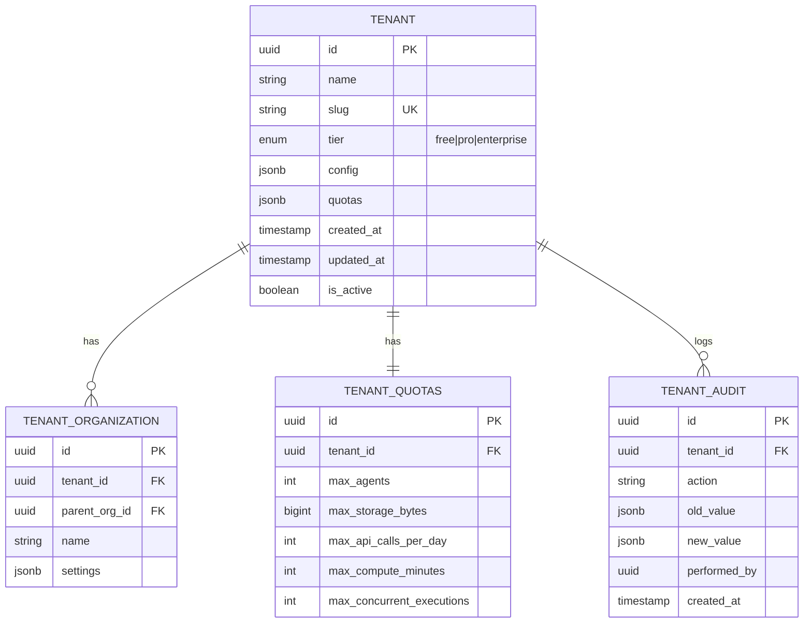
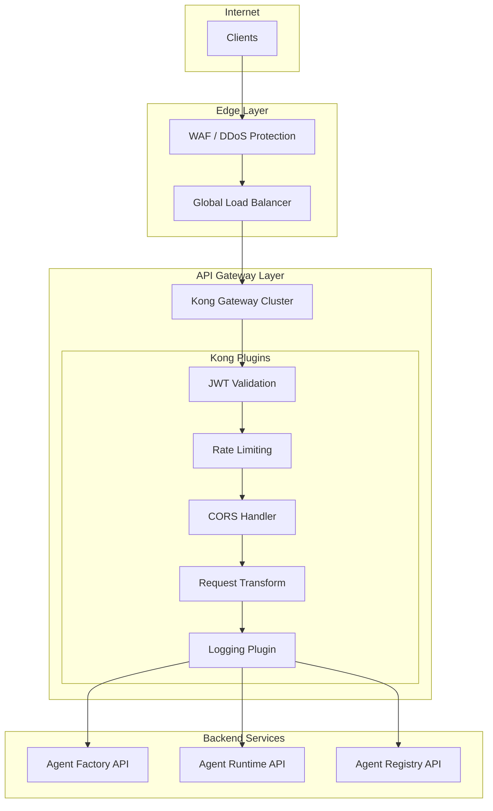
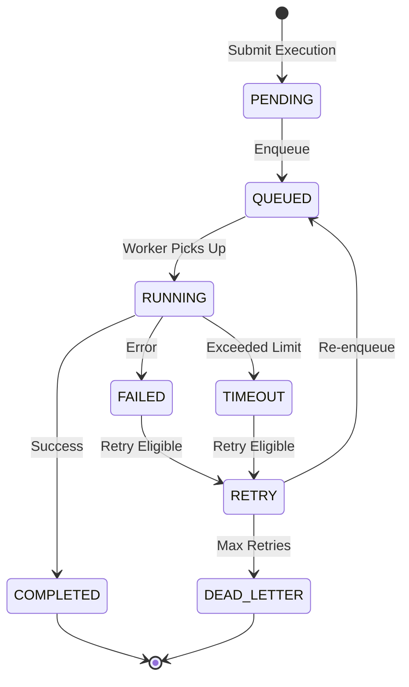

# GL-Agent-Factory Enterprise Architecture Specification

**Version:** 2.0
**Date:** December 4, 2025
**Author:** GL-AppArchitect
**Priority:** P1 - HIGH PRIORITY
**Status:** READY FOR IMPLEMENTATION

---

## Executive Summary

This document provides the complete enterprise architecture specification for the GreenLang Agent Factory platform. It defines the foundational patterns, infrastructure components, and implementation tasks required to build a production-grade, multi-tenant platform capable of supporting 10,000+ concurrent agents with 99.99% uptime.

### Architecture Vision

```
+============================================================================+
|                    GreenLang Agent Factory - Target Architecture            |
+============================================================================+
|                                                                             |
|  +-----------------+    +-------------------+    +---------------------+    |
|  |   Multi-Tenant  |    |   API Gateway     |    |   Service Mesh      |    |
|  |   Isolation     |    |   (Kong/Envoy)    |    |   (Istio)           |    |
|  |                 |    |                   |    |                     |    |
|  | - Namespace/    |    | - JWT/OAuth2      |    | - mTLS              |    |
|  |   Tenant        |    | - Rate Limiting   |    | - Traffic Mgmt      |    |
|  | - RLS Policies  |    | - API Versioning  |    | - Canary Deploy     |    |
|  | - Data Isolation|    | - Transformation  |    | - Observability     |    |
|  +-----------------+    +-------------------+    +---------------------+    |
|           |                      |                        |                 |
|           +----------------------+------------------------+                 |
|                                  |                                          |
|                    +-------------v--------------+                           |
|                    |    Agent Execution Engine  |                           |
|                    |                            |                           |
|                    | - Async Execution          |                           |
|                    | - Process Isolation (gVisor)|                          |
|                    | - Resource Quotas           |                          |
|                    | - Lifecycle Hooks           |                          |
|                    | - State Management          |                          |
|                    +----------------------------+                           |
|                                  |                                          |
|         +------------------------+------------------------+                 |
|         |                        |                        |                 |
|  +------v------+         +-------v-------+        +-------v-------+         |
|  | PostgreSQL  |         |    Redis      |        |    Kafka      |         |
|  | + TimescaleDB|        |   Cluster     |        |   Cluster     |         |
|  | + RLS       |         |               |        |               |         |
|  +-------------+         +---------------+        +---------------+         |
|                                                                             |
+============================================================================+
```

### Key Metrics Targets

| Metric | Target | Measurement |
|--------|--------|-------------|
| **Concurrent Agents** | 10,000+ | Peak capacity |
| **API Latency (P95)** | <100ms | All endpoints |
| **Agent Execution** | <2s | P95 latency |
| **Uptime SLO** | 99.99% | Annual |
| **MTTR** | <30 min | Mean time to recovery |
| **Cache Hit Rate** | 66%+ | LLM response caching |
| **Zero Hallucination** | 100% | Calculation path |

---

## SECTION 1: MULTI-TENANCY ARCHITECTURE (20 Tasks)

### 1.1 Tenant Data Model Design

This section defines the foundational data structures for tenant management.



#### Task List: Tenant Data Model

| ID | Task | Description | Dependency | Estimate | Owner |
|----|------|-------------|------------|----------|-------|
| **MTD-001** | Design tenant core schema | Create tenants table with id, name, slug, tier, config, quotas, timestamps, is_active | None | 2 days | Data Engineering |
| **MTD-002** | Create tenant_organizations table | Implement hierarchy support for sub-organizations within tenants | MTD-001 | 1 day | Data Engineering |
| **MTD-003** | Build tenant_quotas table | Define quotas: max_agents, max_storage_bytes, max_api_calls, max_compute_minutes, max_concurrent | MTD-001 | 1 day | Data Engineering |
| **MTD-004** | Implement tenant_config JSONB | Design flexible JSON schema for tenant-specific settings (features, branding, integrations) | MTD-001 | 1 day | Data Engineering |
| **MTD-005** | Add tenant audit trail table | Create tenant_audit table with action, old_value, new_value, performed_by, timestamp | MTD-001 | 2 days | Data Engineering |

### 1.2 Namespace-per-Tenant Kubernetes Strategy

```yaml
# Namespace Template for Tenant Isolation
apiVersion: v1
kind: Namespace
metadata:
  name: tenant-${TENANT_ID}
  labels:
    greenlang.ai/tenant-id: "${TENANT_ID}"
    greenlang.ai/tier: "${TIER}"
    greenlang.ai/isolation: "full"
  annotations:
    scheduler.alpha.kubernetes.io/node-selector: "workload-type=tenant"
```

#### Task List: Namespace Isolation

| ID | Task | Description | Dependency | Estimate | Owner |
|----|------|-------------|------------|----------|-------|
| **NSI-001** | Design namespace-per-tenant strategy | Document namespace naming convention, labeling strategy, and lifecycle management | MTD-001 | 2 days | DevOps/SRE |
| **NSI-002** | Create namespace provisioning Terraform module | Automate namespace creation with proper labels, annotations, and RBAC bindings | NSI-001 | 3 days | DevOps/SRE |
| **NSI-003** | Implement tenant-specific ResourceQuota manifests | Define CPU, memory, storage, and object count limits per tenant tier | NSI-002 | 2 days | DevOps/SRE |
| **NSI-004** | Build tenant-specific LimitRange configurations | Set default and max resource requests/limits for pods in tenant namespaces | NSI-002 | 1 day | DevOps/SRE |
| **NSI-005** | Configure NetworkPolicy for strict tenant isolation | Implement deny-all default with explicit allow rules for required traffic | NSI-002 | 2 days | DevOps/SRE |

### 1.3 Row-Level Security (RLS) Implementation

```sql
-- RLS Policy Pattern for Multi-Tenant Tables
-- Enable RLS on agents table
ALTER TABLE agents ENABLE ROW LEVEL SECURITY;

-- Create RLS policy for tenant isolation
CREATE POLICY tenant_isolation_policy ON agents
    USING (tenant_id = current_setting('app.current_tenant_id')::uuid);

-- Create admin bypass policy
CREATE POLICY admin_bypass_policy ON agents
    USING (current_setting('app.is_admin')::boolean = true);

-- Force RLS for all roles except superuser
ALTER TABLE agents FORCE ROW LEVEL SECURITY;
```

#### Task List: Row-Level Security

| ID | Task | Description | Dependency | Estimate | Owner |
|----|------|-------------|------------|----------|-------|
| **RLS-001** | Enable PostgreSQL RLS for agents table | Implement row-level security with tenant_id filtering policy | MTD-001 | 2 days | Data Engineering |
| **RLS-002** | Implement RLS policies for agent_versions table | Add RLS policies ensuring version data is tenant-isolated | RLS-001 | 1 day | Data Engineering |
| **RLS-003** | Add RLS for agent_executions table | Protect execution history and results with tenant filtering | RLS-001 | 1 day | Data Engineering |
| **RLS-004** | Create RLS bypass for admin users | Implement secure admin bypass using session variables | RLS-001 | 1 day | Data Engineering |
| **RLS-005** | Build RLS policy test suite | Create comprehensive tests verifying RLS isolation (100% coverage target) | RLS-001..004 | 2 days | Data Engineering |

### 1.4 Tenant Context Propagation Patterns

```python
# Tenant Context Middleware Pattern
from contextvars import ContextVar
from fastapi import Request, HTTPException
import jwt

tenant_context: ContextVar[str] = ContextVar('tenant_id', default=None)

class TenantMiddleware:
    """
    Extracts tenant_id from JWT claims and propagates through request lifecycle.
    """

    async def __call__(self, request: Request, call_next):
        # Extract JWT from Authorization header
        auth_header = request.headers.get("Authorization", "")
        if not auth_header.startswith("Bearer "):
            raise HTTPException(status_code=401, detail="Missing Bearer token")

        token = auth_header[7:]
        try:
            payload = jwt.decode(token, verify=True)
            tenant_id = payload.get("tenant_id")

            if not tenant_id:
                raise HTTPException(status_code=403, detail="No tenant_id in token")

            # Set tenant context for this request
            tenant_context.set(tenant_id)

            # Inject into SQLAlchemy session
            await self._set_database_tenant(tenant_id)

            response = await call_next(request)
            return response

        except jwt.InvalidTokenError as e:
            raise HTTPException(status_code=401, detail=str(e))

    async def _set_database_tenant(self, tenant_id: str):
        """Set tenant_id in PostgreSQL session for RLS."""
        async with get_db_session() as session:
            await session.execute(
                f"SET app.current_tenant_id = '{tenant_id}'"
            )
```

#### Task List: Tenant Context Propagation

| ID | Task | Description | Dependency | Estimate | Owner |
|----|------|-------------|------------|----------|-------|
| **TCP-001** | Extract tenant_id from JWT claims in middleware | Implement FastAPI middleware to extract and validate tenant_id from JWT | RLS-001 | 2 days | Platform Team |
| **TCP-002** | Inject tenant_id into SQLAlchemy queries automatically | Create session factory that sets app.current_tenant_id for RLS | TCP-001 | 2 days | Platform Team |
| **TCP-003** | Add tenant context to structured logs | Enrich all log entries with tenant_id for filtered log analysis | TCP-001 | 1 day | Platform Team |
| **TCP-004** | Propagate tenant context through Kafka message headers | Include tenant_id in Kafka message headers for consumer filtering | TCP-001 | 2 days | Platform Team |
| **TCP-005** | Build tenant context unit and integration tests | Verify tenant isolation across all propagation paths | TCP-001..004 | 2 days | Platform Team |

### 1.5 Tenant Isolation Verification

| ID | Task | Description | Dependency | Estimate | Owner |
|----|------|-------------|------------|----------|-------|
| **TIV-001** | Create cross-tenant access test suite | Build automated tests attempting cross-tenant data access (must fail) | RLS-005, TCP-005 | 2 days | Security Team |
| **TIV-002** | Implement tenant isolation chaos testing | Use chaos engineering to verify isolation under failure conditions | TIV-001 | 2 days | DevOps/SRE |
| **TIV-003** | Build tenant isolation monitoring dashboard | Create Grafana dashboard showing isolation health metrics | TIV-001 | 1 day | DevOps/SRE |
| **TIV-004** | Document tenant isolation architecture | Create runbook and ADR documenting isolation guarantees | TIV-001..003 | 1 day | Platform Team |
| **TIV-005** | Establish tenant isolation SLO | Define and implement 100% isolation SLO with alerting | TIV-001..004 | 1 day | DevOps/SRE |

---

## SECTION 2: API GATEWAY IMPLEMENTATION (20 Tasks)

### 2.1 Gateway Selection and Deployment



#### Task List: Gateway Core

| ID | Task | Description | Dependency | Estimate | Owner |
|----|------|-------------|------------|----------|-------|
| **GWC-001** | Evaluate and select API Gateway | Compare Kong vs Ambassador vs NGINX Ingress; document decision in ADR | None | 2 days | Platform Team |
| **GWC-002** | Deploy Kong Gateway to Kubernetes via Helm | Install Kong using official Helm chart with HA configuration (3+ replicas) | GWC-001 | 2 days | DevOps/SRE |
| **GWC-003** | Configure TLS termination with cert-manager | Set up automatic TLS certificate provisioning using Let's Encrypt | GWC-002 | 1 day | DevOps/SRE |
| **GWC-004** | Implement request routing to backend services | Configure Kong routes for /api/v1/factory, /api/v1/runtime, /api/v1/registry | GWC-002 | 2 days | Platform Team |
| **GWC-005** | Add request/response transformation middleware | Implement header injection, request validation, response envelope wrapping | GWC-004 | 2 days | Platform Team |

### 2.2 Authentication and Authorization (JWT/OAuth2)

```yaml
# Kong JWT Plugin Configuration
apiVersion: configuration.konghq.com/v1
kind: KongPlugin
metadata:
  name: jwt-auth
  namespace: greenlang
config:
  uri_param_names:
    - token
  cookie_names:
    - session
  header_names:
    - Authorization
  claims_to_verify:
    - exp
    - iss
  key_claim_name: iss
  secret_is_base64: false
  run_on_preflight: true
plugin: jwt
```

#### Task List: Authentication and Authorization

| ID | Task | Description | Dependency | Estimate | Owner |
|----|------|-------------|------------|----------|-------|
| **GAA-001** | Implement JWT validation middleware (RS256 signature) | Configure Kong JWT plugin with RS256 signature verification and claim validation | GWC-002 | 2 days | Platform Team |
| **GAA-002** | Add OAuth 2.0 / OIDC integration for SSO | Integrate with identity providers (Okta, Azure AD, Google Workspace) | GAA-001 | 3 days | Platform Team |
| **GAA-003** | Create API key authentication for service accounts | Implement API key auth for machine-to-machine communication | GAA-001 | 2 days | Platform Team |
| **GAA-004** | Build RBAC enforcement layer | Implement roles: admin, developer, operator, viewer with granular permissions | GAA-001 | 4 days | Platform Team |
| **GAA-005** | Implement permission caching in Redis (TTL: 5 minutes) | Cache RBAC decisions to reduce latency; implement cache invalidation on role change | GAA-004 | 1 day | Platform Team |

### 2.3 Rate Limiting with Redis Backend

```python
# Rate Limiter Configuration Schema
from pydantic import BaseModel
from typing import Dict, Literal

class RateLimitConfig(BaseModel):
    """
    Rate limiting configuration with tiered limits.
    Uses sliding window algorithm with Redis backend.
    """
    # Per-tenant limits (requests per minute)
    tenant_limits: Dict[Literal["free", "pro", "enterprise"], int] = {
        "free": 60,        # 1 request/second
        "pro": 600,        # 10 requests/second
        "enterprise": 6000  # 100 requests/second
    }

    # Per-endpoint limits (more restrictive for sensitive operations)
    endpoint_limits: Dict[str, int] = {
        "/api/v1/agents/create": 10,      # 10 per minute
        "/api/v1/agents/execute": 100,    # 100 per minute
        "/api/v1/agents/delete": 5,       # 5 per minute
        "default": 1000                    # 1000 per minute default
    }

    # Burst multiplier for temporary spikes
    burst_multiplier: float = 5.0

    # Window size in seconds (sliding window)
    window_size_seconds: int = 60

    # Redis key pattern
    redis_key_pattern: str = "ratelimit:{tenant_id}:{endpoint}:{window}"
```

#### Task List: Rate Limiting

| ID | Task | Description | Dependency | Estimate | Owner |
|----|------|-------------|------------|----------|-------|
| **GRL-001** | Implement sliding window rate limiter (Redis-based) | Build rate limiter using Redis sorted sets for accurate sliding window | GWC-002 | 3 days | Platform Team |
| **GRL-002** | Add per-tenant rate limits (configurable quotas) | Implement tiered limits based on tenant.tier (free/pro/enterprise) | GRL-001, MTD-003 | 2 days | Platform Team |
| **GRL-003** | Create per-endpoint rate limits | Implement stricter limits for sensitive endpoints (create: 10/min, delete: 5/min) | GRL-001 | 1 day | Platform Team |
| **GRL-004** | Add rate limit headers | Return X-RateLimit-Limit, X-RateLimit-Remaining, X-RateLimit-Reset headers | GRL-001 | 1 day | Platform Team |
| **GRL-005** | Implement rate limit bypass for internal services | Allow internal service mesh traffic to bypass rate limiting using mTLS identity | GRL-001 | 1 day | Platform Team |

### 2.4 API Versioning Strategy

```
API Versioning Strategy: URL Path Versioning

Current Version: v1
Deprecation Policy: 12-month support after new version release

URL Structure:
  /api/v1/agents        - Current version (stable)
  /api/v2/agents        - Next version (when available)
  /api/v1-beta/agents   - Beta features for v1

Version Negotiation:
  Primary: URL path (/v1/, /v2/)
  Secondary: Accept header (application/vnd.greenlang.v1+json)

Deprecation Headers:
  Sunset: Sat, 01 Jan 2027 00:00:00 GMT
  Deprecation: true
  Link: </api/v2/agents>; rel="successor-version"
```

#### Task List: API Versioning

| ID | Task | Description | Dependency | Estimate | Owner |
|----|------|-------------|------------|----------|-------|
| **GAV-001** | Design API versioning strategy | Document URL path versioning strategy (/v1/, /v2/) with 12-month deprecation policy | None | 1 day | Platform Team |
| **GAV-002** | Implement version routing in gateway | Configure Kong to route requests based on URL path version prefix | GAV-001, GWC-004 | 2 days | Platform Team |
| **GAV-003** | Add version negotiation via Accept header | Support content negotiation (application/vnd.greenlang.v1+json) as fallback | GAV-002 | 1 day | Platform Team |
| **GAV-004** | Create deprecation warning headers | Add Sunset, Deprecation, and Link headers for deprecated versions | GAV-002 | 1 day | Platform Team |
| **GAV-005** | Build version compatibility matrix documentation | Create and maintain documentation of version compatibility and migration guides | GAV-001 | 1 day | Platform Team |

---

## SECTION 3: AGENT EXECUTION ENGINE (15 Tasks)

### 3.1 Async Execution Patterns



```python
# Agent Execution State Machine
from enum import Enum
from dataclasses import dataclass
from datetime import datetime
from typing import Optional, Dict, Any

class ExecutionState(Enum):
    PENDING = "pending"
    QUEUED = "queued"
    RUNNING = "running"
    COMPLETED = "completed"
    FAILED = "failed"
    TIMEOUT = "timeout"
    CANCELLED = "cancelled"
    DEAD_LETTER = "dead_letter"

@dataclass
class AgentExecution:
    """Represents an agent execution with full lifecycle tracking."""
    id: str
    agent_id: str
    tenant_id: str
    state: ExecutionState
    input_payload: Dict[str, Any]
    output_result: Optional[Dict[str, Any]] = None
    error_message: Optional[str] = None
    retry_count: int = 0
    max_retries: int = 3
    timeout_seconds: int = 300
    created_at: datetime = None
    started_at: Optional[datetime] = None
    completed_at: Optional[datetime] = None

    # Resource tracking
    cpu_time_ms: int = 0
    memory_peak_mb: int = 0
    tokens_consumed: int = 0

    # Provenance
    provenance_hash: Optional[str] = None
    execution_trace: list = None
```

#### Task List: Async Execution Patterns

| ID | Task | Description | Dependency | Estimate | Owner |
|----|------|-------------|------------|----------|-------|
| **AEX-001** | Refactor agent runtime to support async execution with asyncio | Convert synchronous execution paths to async using asyncio event loops | None | 3 days | Platform Team |
| **AEX-002** | Implement execution queue with priority levels (P0-P3) | Build Kafka-backed execution queue with priority partitioning | AEX-001 | 2 days | Platform Team |
| **AEX-003** | Create execution state machine (PENDING -> RUNNING -> COMPLETED/FAILED) | Implement state transitions with persistence and event emission | AEX-001 | 2 days | AI/Agent Team |
| **AEX-004** | Build execution result callback mechanism | Implement webhook callbacks for execution completion notification | AEX-003 | 2 days | Platform Team |
| **AEX-005** | Add execution cancellation support | Allow in-flight executions to be gracefully cancelled via API | AEX-003 | 1 day | Platform Team |

### 3.2 Process Isolation (gVisor Containers)

```yaml
# gVisor RuntimeClass Configuration
apiVersion: node.k8s.io/v1
kind: RuntimeClass
metadata:
  name: gvisor
handler: runsc
scheduling:
  nodeSelector:
    kubernetes.io/runtime: gvisor
  tolerations:
    - key: "gvisor"
      operator: "Equal"
      value: "true"
      effect: "NoSchedule"

---
# Agent Execution Pod with gVisor
apiVersion: v1
kind: Pod
metadata:
  name: agent-execution-${EXECUTION_ID}
  namespace: tenant-${TENANT_ID}
spec:
  runtimeClassName: gvisor
  securityContext:
    runAsNonRoot: true
    runAsUser: 1000
    fsGroup: 1000
    seccompProfile:
      type: RuntimeDefault
  containers:
    - name: agent
      image: greenlang/agent-runtime:v1
      securityContext:
        allowPrivilegeEscalation: false
        capabilities:
          drop:
            - ALL
        readOnlyRootFilesystem: true
      resources:
        limits:
          cpu: "${CPU_LIMIT}"
          memory: "${MEMORY_LIMIT}"
        requests:
          cpu: "${CPU_REQUEST}"
          memory: "${MEMORY_REQUEST}"
```

#### Task List: Process Isolation

| ID | Task | Description | Dependency | Estimate | Owner |
|----|------|-------------|------------|----------|-------|
| **PIS-001** | Deploy gVisor runtime class to Kubernetes cluster | Install and configure gVisor (runsc) as an alternative container runtime | None | 2 days | DevOps/SRE |
| **PIS-002** | Implement agent process isolation using gVisor sandboxing | Configure agent execution pods to use gVisor runtime class | PIS-001 | 3 days | DevOps/SRE |
| **PIS-003** | Configure securityContext for least privilege | Set runAsNonRoot, readOnlyRootFilesystem, drop all capabilities | PIS-002 | 1 day | DevOps/SRE |
| **PIS-004** | Implement network isolation for agent pods | Configure NetworkPolicy to restrict agent pod network access | PIS-002 | 2 days | DevOps/SRE |
| **PIS-005** | Build process isolation verification tests | Create automated tests verifying sandbox isolation properties | PIS-001..004 | 2 days | Security Team |

### 3.3 Resource Limiting and Quotas

```python
# Resource Quota Configuration
from pydantic import BaseModel
from typing import Literal

class AgentResourceQuota(BaseModel):
    """
    Resource limits for agent execution.
    Applied per execution and per tenant.
    """
    # CPU limits
    cpu_request: str = "100m"        # 0.1 CPU cores
    cpu_limit: str = "1000m"         # 1 CPU core max

    # Memory limits
    memory_request: str = "128Mi"    # 128 MB minimum
    memory_limit: str = "512Mi"      # 512 MB max

    # Execution time limits
    timeout_seconds: int = 300       # 5 minute default timeout
    timeout_warning_percent: int = 80  # Warn at 80% of timeout

    # Storage limits
    ephemeral_storage_limit: str = "1Gi"  # 1 GB scratch space

    # Network limits (if applicable)
    max_outbound_requests: int = 100  # Max external API calls per execution

class TenantResourceQuota(BaseModel):
    """
    Aggregate resource limits per tenant.
    """
    max_concurrent_executions: int = 10
    max_daily_executions: int = 1000
    max_daily_compute_minutes: int = 500
    max_daily_tokens: int = 1_000_000

    tier_multipliers: dict = {
        "free": 1.0,
        "pro": 10.0,
        "enterprise": 100.0
    }
```

#### Task List: Resource Limiting

| ID | Task | Description | Dependency | Estimate | Owner |
|----|------|-------------|------------|----------|-------|
| **RES-001** | Create agent resource limiter with CPU/memory/time quotas | Implement per-execution resource limits using Kubernetes resource requests/limits | AEX-001 | 2 days | Platform Team |
| **RES-002** | Implement per-tenant concurrent execution limits | Enforce max_concurrent_executions based on tenant tier | RES-001, MTD-003 | 2 days | Platform Team |
| **RES-003** | Build resource usage tracking and metering | Track CPU time, memory peak, and tokens consumed per execution | RES-001 | 2 days | Platform Team |
| **RES-004** | Add resource quota alerting (approaching limits) | Alert tenants when usage reaches 80% of quota | RES-003 | 1 day | Platform Team |
| **RES-005** | Create resource usage dashboard per tenant | Build Grafana dashboard showing tenant resource consumption | RES-003 | 1 day | DevOps/SRE |

### 3.4 Lifecycle Hooks and State Management

```python
# Agent Lifecycle Hooks System
from abc import ABC, abstractmethod
from typing import Any, Dict, Optional
from enum import Enum

class LifecycleHook(Enum):
    PRE_INIT = "pre_init"
    POST_INIT = "post_init"
    PRE_VALIDATE = "pre_validate"
    POST_VALIDATE = "post_validate"
    PRE_EXECUTE = "pre_execute"
    POST_EXECUTE = "post_execute"
    ON_ERROR = "on_error"
    CLEANUP = "cleanup"

class AgentLifecycleManager:
    """
    Manages agent lifecycle hooks for extensible execution flow.
    """

    def __init__(self, agent_id: str, execution_id: str):
        self.agent_id = agent_id
        self.execution_id = execution_id
        self.hooks: Dict[LifecycleHook, list] = {h: [] for h in LifecycleHook}
        self.state: Dict[str, Any] = {}

    def register_hook(self, hook: LifecycleHook, callback: callable):
        """Register a callback for a lifecycle hook."""
        self.hooks[hook].append(callback)

    async def trigger_hook(self, hook: LifecycleHook, context: Dict[str, Any]) -> Dict[str, Any]:
        """Trigger all callbacks for a lifecycle hook."""
        result = context.copy()
        for callback in self.hooks[hook]:
            try:
                result = await callback(result)
            except Exception as e:
                if hook != LifecycleHook.ON_ERROR:
                    await self.trigger_hook(LifecycleHook.ON_ERROR, {"error": e, **result})
                raise
        return result

    async def run_with_lifecycle(self, execute_fn: callable, input_data: Dict[str, Any]) -> Dict[str, Any]:
        """Execute agent with full lifecycle hook support."""
        context = {"input": input_data, "agent_id": self.agent_id}

        try:
            context = await self.trigger_hook(LifecycleHook.PRE_INIT, context)
            context = await self.trigger_hook(LifecycleHook.POST_INIT, context)
            context = await self.trigger_hook(LifecycleHook.PRE_VALIDATE, context)
            context = await self.trigger_hook(LifecycleHook.POST_VALIDATE, context)
            context = await self.trigger_hook(LifecycleHook.PRE_EXECUTE, context)

            result = await execute_fn(context["input"])
            context["output"] = result

            context = await self.trigger_hook(LifecycleHook.POST_EXECUTE, context)
            return context["output"]

        except Exception as e:
            context["error"] = e
            await self.trigger_hook(LifecycleHook.ON_ERROR, context)
            raise

        finally:
            await self.trigger_hook(LifecycleHook.CLEANUP, context)
```

#### Task List: Lifecycle Hooks

| ID | Task | Description | Dependency | Estimate | Owner |
|----|------|-------------|------------|----------|-------|
| **LFH-001** | Design agent lifecycle hooks system | Define hooks: pre-init, post-init, pre-validate, post-validate, pre-exec, post-exec, on-error, cleanup | AEX-003 | 3 days | AI/Agent Team |
| **LFH-002** | Implement agent health check mechanism (liveness + readiness) | Add health endpoints and probe configuration for agent pods | LFH-001 | 2 days | Platform Team |
| **LFH-003** | Build agent configuration hot-reload without restart | Support live configuration updates via ConfigMap changes | LFH-001 | 2 days | Platform Team |
| **LFH-004** | Implement graceful agent shutdown with configurable timeout | Handle SIGTERM with cleanup hooks, default 30s timeout | LFH-001 | 1 day | Platform Team |
| **LFH-005** | Create agent lifecycle event emitter for observability | Emit events to Kafka for each lifecycle transition | LFH-001 | 2 days | Platform Team |

---

## SECTION 4: SERVICE MESH (ISTIO) IMPLEMENTATION (15 Tasks)

### 4.1 Istio Deployment Configuration

```yaml
# Istio Installation Values
apiVersion: install.istio.io/v1alpha1
kind: IstioOperator
metadata:
  name: greenlang-istio
  namespace: istio-system
spec:
  profile: production

  meshConfig:
    accessLogFile: /dev/stdout
    enableTracing: true
    defaultConfig:
      tracing:
        sampling: 100.0
        zipkin:
          address: jaeger-collector.monitoring:9411

    # Enable mTLS by default
    mtls:
      mode: STRICT

  components:
    pilot:
      k8s:
        resources:
          requests:
            cpu: 500m
            memory: 2Gi
          limits:
            cpu: 1000m
            memory: 4Gi
        hpaSpec:
          minReplicas: 2
          maxReplicas: 5

    ingressGateways:
      - name: istio-ingressgateway
        enabled: true
        k8s:
          resources:
            requests:
              cpu: 500m
              memory: 512Mi
          hpaSpec:
            minReplicas: 3
            maxReplicas: 10

  values:
    global:
      proxy:
        resources:
          requests:
            cpu: 100m
            memory: 128Mi
          limits:
            cpu: 500m
            memory: 256Mi
```

#### Task List: Istio Deployment

| ID | Task | Description | Dependency | Estimate | Owner |
|----|------|-------------|------------|----------|-------|
| **SMI-001** | Deploy Istio control plane (1.19+) via Helm | Install Istio using production profile with HA configuration | None | 2 days | DevOps/SRE |
| **SMI-002** | Enable automatic sidecar injection for greenlang namespace | Configure namespace labels for automatic Envoy sidecar injection | SMI-001 | 1 day | DevOps/SRE |
| **SMI-003** | Configure mTLS (STRICT mode) for inter-service communication | Enable mutual TLS for all service-to-service traffic within mesh | SMI-002 | 2 days | DevOps/SRE |
| **SMI-004** | Create VirtualService for agent-factory routing | Define traffic routing rules with retries, timeouts, and load balancing | SMI-002 | 2 days | DevOps/SRE |
| **SMI-005** | Add DestinationRule for circuit breaker configuration | Configure outlier detection and connection pool settings | SMI-004 | 2 days | DevOps/SRE |

### 4.2 Canary Deployment Strategies

```yaml
# Canary Deployment VirtualService
apiVersion: networking.istio.io/v1beta1
kind: VirtualService
metadata:
  name: agent-factory-canary
  namespace: greenlang
spec:
  hosts:
    - agent-factory
  http:
    - match:
        - headers:
            x-canary:
              exact: "true"
      route:
        - destination:
            host: agent-factory
            subset: canary
          weight: 100

    # Gradual rollout: 5% -> 25% -> 50% -> 100%
    - route:
        - destination:
            host: agent-factory
            subset: stable
          weight: 95
        - destination:
            host: agent-factory
            subset: canary
          weight: 5

---
apiVersion: networking.istio.io/v1beta1
kind: DestinationRule
metadata:
  name: agent-factory-versions
  namespace: greenlang
spec:
  host: agent-factory
  subsets:
    - name: stable
      labels:
        version: stable
    - name: canary
      labels:
        version: canary
```

#### Task List: Traffic Management

| ID | Task | Description | Dependency | Estimate | Owner |
|----|------|-------------|------------|----------|-------|
| **STM-001** | Implement canary deployment strategy (5% -> 25% -> 50% -> 100%) | Configure VirtualService with weighted routing for gradual rollouts | SMI-004 | 3 days | DevOps/SRE |
| **STM-002** | Configure blue-green deployment switch | Implement instant traffic switch capability for rollback scenarios | SMI-004 | 2 days | DevOps/SRE |
| **STM-003** | Add traffic mirroring for production debugging | Enable shadow traffic to staging for testing new versions | SMI-004 | 2 days | DevOps/SRE |
| **STM-004** | Implement fault injection for chaos testing | Configure delay and abort injection for resilience testing | SMI-004 | 2 days | DevOps/SRE |
| **STM-005** | Create A/B testing traffic split configuration | Enable header-based routing for feature flag testing | SMI-004 | 2 days | DevOps/SRE |

### 4.3 Observability Integration

```yaml
# Istio Telemetry Configuration
apiVersion: telemetry.istio.io/v1alpha1
kind: Telemetry
metadata:
  name: greenlang-telemetry
  namespace: greenlang
spec:
  # Tracing configuration
  tracing:
    - providers:
        - name: jaeger
      randomSamplingPercentage: 10.0

  # Access logging
  accessLogging:
    - providers:
        - name: envoy
      filter:
        expression: "response.code >= 400"

---
# ServiceMonitor for Prometheus scraping
apiVersion: monitoring.coreos.com/v1
kind: ServiceMonitor
metadata:
  name: istio-mesh-monitor
  namespace: monitoring
spec:
  selector:
    matchLabels:
      app: istiod
  endpoints:
    - port: http-monitoring
      interval: 15s
      path: /metrics
```

#### Task List: Observability Integration

| ID | Task | Description | Dependency | Estimate | Owner |
|----|------|-------------|------------|----------|-------|
| **SOI-001** | Enable Istio Prometheus metrics export | Configure Istio telemetry to export metrics to Prometheus | SMI-001 | 1 day | DevOps/SRE |
| **SOI-002** | Configure Jaeger tracing integration | Set up distributed tracing with Jaeger collector and sampling | SMI-001 | 2 days | DevOps/SRE |
| **SOI-003** | Create Kiali service mesh dashboard | Deploy Kiali for service mesh visualization and health monitoring | SMI-001 | 1 day | DevOps/SRE |
| **SOI-004** | Add Envoy access logs to ELK stack | Configure access logging with structured log format to Elasticsearch | SMI-001 | 2 days | DevOps/SRE |
| **SOI-005** | Build service mesh Grafana dashboards | Create dashboards for mesh health, traffic, and latency metrics | SOI-001 | 2 days | DevOps/SRE |

---

## SECTION 5: ARCHITECTURE DECISION RECORDS (ADRs)

### ADR-001: Database Selection (PostgreSQL + TimescaleDB)

```markdown
# ADR-001: Database Selection

## Status
ACCEPTED

## Context
GreenLang Agent Factory requires a database solution that supports:
- Multi-tenant data isolation (Row-Level Security)
- High-volume time-series data for agent metrics and audit logs
- Complex queries for regulatory reporting
- ACID compliance for financial calculations
- Horizontal read scaling for high query throughput

## Decision
We will use **PostgreSQL 15+** as the primary relational database with **TimescaleDB** extension for time-series data.

### Primary Database: PostgreSQL 15+
- Native Row-Level Security for multi-tenant isolation
- JSONB for flexible configuration storage
- Mature ecosystem and tooling
- Cloud-managed options (RDS, Cloud SQL, Azure PostgreSQL)

### Time-Series Extension: TimescaleDB
- Automatic partitioning (hypertables) for audit_logs and metrics
- 10-100x query improvement for time-series aggregations
- Continuous aggregates for pre-computed rollups
- Compression for historical data (90%+ space savings)

## Alternatives Considered

### MongoDB
- Pros: Flexible schema, native sharding
- Cons: No native RLS, weaker consistency guarantees, less suitable for financial calculations

### CockroachDB
- Pros: Distributed, PostgreSQL-compatible
- Cons: Higher operational complexity, cost concerns, RLS less mature

### ClickHouse (for time-series)
- Pros: Excellent analytics performance
- Cons: Additional operational burden, weaker OLTP capabilities

## Consequences

### Positive
- Single database technology for simpler operations
- Native RLS simplifies multi-tenant security
- TimescaleDB handles audit log scale (billions of rows)
- Strong ecosystem (pgBouncer, pg_stat_statements, etc.)

### Negative
- Requires careful index management for performance
- Read replica lag may affect some use cases
- TimescaleDB license considerations for commercial use

## Implementation Notes
- Use pg_partman for non-time-series partitioning (tenants with >1M agents)
- Implement connection pooling with PgBouncer (10,000 client connections)
- Configure streaming replication with 3 read replicas
- Enable pg_stat_statements for query performance monitoring
```

### ADR-002: Message Queue (Redis Streams vs RabbitMQ)

```markdown
# ADR-002: Message Queue Selection

## Status
ACCEPTED

## Context
The Agent Factory requires message queue capabilities for:
- Agent execution job queuing with priorities (P0-P3)
- Event streaming for agent lifecycle events
- Pub/sub for real-time notifications
- Dead letter queue handling for failed jobs
- High throughput (10,000+ messages/second)

## Decision
We will use a **hybrid approach**:
- **Kafka** for event streaming (lifecycle events, metrics, audit logs)
- **Redis Streams** for job queuing (agent execution queue)

### Kafka (Event Streaming)
- agent_lifecycle topic: Agent create/update/delete/promote events
- agent_execution topic: Execution start/complete/fail events
- audit_log topic: Compliance audit trail (infinite retention with compaction)
- agent_metrics topic: Performance metrics (1-hour retention)

### Redis Streams (Job Queue)
- agent_execution_queue: Priority-based execution queue
- Advantages: Already deployed for caching, lower latency, simpler operations
- Consumer groups for distributed processing

## Alternatives Considered

### Kafka Only
- Pros: Single system for all messaging
- Cons: Higher latency for job queue use case, more complex consumer management

### RabbitMQ
- Pros: Traditional job queue, priority queues native
- Cons: Additional operational burden, less suitable for event streaming

### Amazon SQS
- Pros: Fully managed, integrates with AWS
- Cons: Vendor lock-in, 256KB message limit, no priority queues

## Consequences

### Positive
- Best tool for each use case (Kafka for streaming, Redis for queuing)
- Redis already deployed for caching, minimal additional infrastructure
- Kafka provides durable event log for replay and analytics
- Clear separation of concerns

### Negative
- Two systems to operate and monitor
- Different programming models (streams vs consumer groups)
- Redis Streams less mature than Kafka for complex scenarios

## Implementation Notes
- Kafka: 6 brokers, 3 AZ, managed MSK or Strimzi
- Redis Streams: Existing 6-node cluster with Sentinel
- Consumer lag alerting for both systems
- Dead letter queues with alerting
```

### ADR-003: Cache Strategy

```markdown
# ADR-003: Cache Strategy

## Status
ACCEPTED

## Context
Caching is critical for:
- Reducing LLM API costs (target: 66% reduction)
- Improving API latency (<100ms P95)
- Reducing database load
- Supporting high concurrency (10,000+ concurrent agents)

## Decision
Implement a **multi-tier caching strategy**:

### L1 Cache: In-Memory (Process-Local)
- Technology: Python lru_cache or cachetools
- Capacity: 100MB per process
- TTL: 5 minutes
- Use case: Hot path data (emission factors, config)

### L2 Cache: Redis Cluster
- Technology: Redis 7.0 Cluster (6 nodes)
- Capacity: 20GB total (shared across tenants)
- TTL: 1 hour default, configurable per key type
- Use case: Session data, permission cache, EF cache

### L3 Cache: LLM Response Cache
- Technology: Redis with semantic hashing
- Key: SHA-256(model + prompt + temperature)
- TTL: 24 hours for deterministic prompts, 1 hour for variable
- Semantic similarity matching for cache hits

### Cache Key Convention
```
{tenant_id}:{entity_type}:{entity_id}:{version}
Example: tenant-123:agent:agent-456:v1.2.3
```

## Cache Invalidation Strategy
- Event-driven invalidation via Kafka consumers
- TTL-based expiration as fallback
- Manual invalidation API for emergency use
- Cache stampede protection with lock + recompute pattern

## Alternatives Considered

### Memcached
- Pros: Simpler, multi-threaded
- Cons: No persistence, no clustering, no pub/sub

### CDN Caching (CloudFront)
- Pros: Edge caching, reduced origin load
- Cons: Limited for dynamic API responses, tenant isolation concerns

## Consequences

### Positive
- 66%+ LLM cost reduction through response caching
- Sub-millisecond L1 cache hits
- Graceful degradation (L1 -> L2 -> origin)
- Cache hit metrics for optimization

### Negative
- Cache consistency challenges
- Memory pressure in L1 cache
- Redis cluster operational complexity

## Metrics
- Cache hit rate target: L1 80%, L2 66%, LLM 66%
- Cache latency target: L1 <1ms, L2 <5ms
```

### ADR-004: Event Sourcing Approach

```markdown
# ADR-004: Event Sourcing Approach

## Status
ACCEPTED (Partial Event Sourcing)

## Context
Event sourcing provides benefits for:
- Complete audit trail for regulatory compliance
- Reproducible state (zero-hallucination verification)
- Temporal queries ("state at time T")
- Integration via event streams

However, full event sourcing adds complexity:
- Event schema evolution
- Eventual consistency challenges
- Increased storage requirements
- Steeper learning curve

## Decision
Implement **Partial Event Sourcing** for critical paths:

### Event-Sourced Entities
1. **Agent Lifecycle**: All agent create/update/promote/deprecate events
2. **Agent Executions**: Execution requests and results
3. **Audit Log**: All compliance-relevant actions
4. **Provenance Chain**: Calculation trace for zero-hallucination guarantee

### Traditional CRUD Entities
1. **Tenant Configuration**: Direct updates (not event-sourced)
2. **User Preferences**: Direct updates
3. **Cache Data**: Ephemeral, not persisted as events

### Event Schema
```json
{
  "event_id": "uuid",
  "event_type": "agent.created",
  "aggregate_type": "agent",
  "aggregate_id": "agent-123",
  "tenant_id": "tenant-456",
  "timestamp": "2025-12-04T10:00:00Z",
  "version": 1,
  "payload": {
    "name": "Fuel Emissions Agent",
    "version": "1.0.0",
    "status": "draft"
  },
  "metadata": {
    "user_id": "user-789",
    "correlation_id": "req-abc",
    "causation_id": "event-xyz"
  }
}
```

### Event Storage
- Kafka topics with compaction for current state
- PostgreSQL event_store table for queryable history
- S3 for long-term archival (7+ years for compliance)

## Alternatives Considered

### Full Event Sourcing
- Pros: Pure event-driven architecture
- Cons: High complexity, eventual consistency everywhere

### No Event Sourcing
- Pros: Simple, familiar CRUD
- Cons: No audit trail, no reproducibility

## Consequences

### Positive
- Complete audit trail for compliance (CSRD, CBAM, EUDR)
- Reproducible calculations for zero-hallucination verification
- Event-driven integrations via Kafka
- Temporal queries for debugging

### Negative
- Dual-write pattern (events + projections)
- Event schema evolution complexity
- Eventual consistency for read models

## Implementation Notes
- Use Avro schemas with Confluent Schema Registry
- Backward-compatible schema evolution only
- Event upcasting for old events
- Snapshotting every 1000 events for performance
```

---

## SECTION 6: IMPLEMENTATION TIMELINE

### Phase 1: Foundation (Weeks 1-8)

```
Week 1-2: Multi-Tenancy Foundation
  - MTD-001..005: Tenant data model
  - GWC-001..003: API Gateway deployment

Week 3-4: API Gateway & Auth
  - GWC-004..005: Routing and transformation
  - GAA-001..003: JWT and OAuth2

Week 5-6: Row-Level Security & Rate Limiting
  - RLS-001..005: PostgreSQL RLS policies
  - GRL-001..005: Redis rate limiting

Week 7-8: Namespace Isolation & Context Propagation
  - NSI-001..005: K8s namespace strategy
  - TCP-001..005: Tenant context middleware
```

### Phase 2: Execution Engine & Service Mesh (Weeks 9-16)

```
Week 9-10: Agent Execution Engine
  - AEX-001..005: Async execution patterns
  - RES-001..003: Resource limiting

Week 11-12: Process Isolation
  - PIS-001..005: gVisor sandboxing
  - LFH-001..003: Lifecycle hooks

Week 13-14: Istio Deployment
  - SMI-001..005: Service mesh installation
  - STM-001..002: Canary deployments

Week 15-16: Observability & Testing
  - SOI-001..005: Mesh observability
  - TIV-001..005: Isolation verification
```

### Phase 3: Optimization & Documentation (Weeks 17-20)

```
Week 17-18: API Versioning & Optimization
  - GAV-001..005: API versioning
  - Performance tuning

Week 19-20: Documentation & ADRs
  - ADR finalization
  - Runbooks and playbooks
  - Architecture documentation
```

---

## SECTION 7: SUCCESS CRITERIA

### Phase 1 Exit Criteria (Week 8)

| Criteria | Target | Measurement |
|----------|--------|-------------|
| Tenant data model deployed | Complete | Schema in production |
| RLS policies active | 100% tables | Policy coverage |
| API Gateway operational | 99.9% uptime | Monitoring |
| JWT authentication | Working | Integration tests |
| Rate limiting | <1% bypass | Audit logs |
| Namespace isolation | 100% tenants | K8s validation |

### Phase 2 Exit Criteria (Week 16)

| Criteria | Target | Measurement |
|----------|--------|-------------|
| Async execution | <2s P95 | Latency metrics |
| gVisor isolation | All agents | RuntimeClass validation |
| Resource quotas | Enforced | Quota breach attempts |
| Istio mTLS | STRICT mode | Security audit |
| Canary deployments | Working | Deployment count |
| Tracing coverage | 100% services | Jaeger spans |

### Phase 3 Exit Criteria (Week 20)

| Criteria | Target | Measurement |
|----------|--------|-------------|
| API versioning | v1 stable | No breaking changes |
| ADRs documented | 4+ ADRs | Document count |
| Runbooks complete | All critical paths | Runbook coverage |
| Performance targets | Met | Benchmark results |
| Security audit | Pass | Audit report |

---

## SECTION 8: RISK REGISTER

| Risk | Probability | Impact | Mitigation |
|------|-------------|--------|------------|
| gVisor performance overhead | Medium | Medium | Benchmark early, fallback to seccomp |
| Istio complexity | High | Medium | Phased rollout, team training |
| RLS bypass vulnerabilities | Low | Critical | Comprehensive testing, security audit |
| Tenant context leakage | Low | Critical | Chaos testing, monitoring |
| API Gateway bottleneck | Medium | High | HPA, load testing, caching |
| Event sourcing complexity | Medium | Medium | Partial adoption, team training |
| Multi-region latency | Low | Medium | Edge caching, regional deployments |

---

## SECTION 9: APPENDICES

### Appendix A: Technology Stack Summary

| Category | Technology | Version | Purpose |
|----------|------------|---------|---------|
| Database | PostgreSQL | 15+ | Primary data store |
| Time-Series | TimescaleDB | 2.11+ | Metrics and audit logs |
| Cache | Redis | 7.0+ | L2 cache, rate limiting, queues |
| Event Streaming | Kafka | 3.5+ | Event sourcing, messaging |
| API Gateway | Kong | 3.4+ | Auth, rate limiting, routing |
| Service Mesh | Istio | 1.19+ | mTLS, traffic management |
| Container Runtime | gVisor | Latest | Process isolation |
| Orchestration | Kubernetes | 1.28+ | Container orchestration |
| Tracing | Jaeger | 1.50+ | Distributed tracing |
| Metrics | Prometheus | 2.47+ | Metrics collection |

### Appendix B: Task Count Summary

| Section | Task Count |
|---------|------------|
| Multi-Tenancy Architecture | 20 |
| API Gateway Implementation | 20 |
| Agent Execution Engine | 15 |
| Service Mesh (Istio) | 15 |
| **TOTAL** | **70** |

### Appendix C: Team Assignments

| Team | Primary Responsibility | Task IDs |
|------|------------------------|----------|
| Data Engineering | Tenant data model, RLS | MTD-*, RLS-* |
| DevOps/SRE | Namespace isolation, Istio, gVisor | NSI-*, SMI-*, STM-*, SOI-*, PIS-* |
| Platform Team | API Gateway, Rate Limiting, Context Propagation | GWC-*, GAA-*, GRL-*, GAV-*, TCP-*, AEX-*, RES-*, LFH-* |
| Security Team | Isolation verification | TIV-*, PIS-005 |
| AI/Agent Team | Execution state machine, Lifecycle hooks | AEX-003, LFH-001 |

---

**Document Owner:** GL-AppArchitect
**Created:** December 4, 2025
**Status:** READY FOR IMPLEMENTATION
**Review Cycle:** Weekly during execution
**Next Review:** December 11, 2025