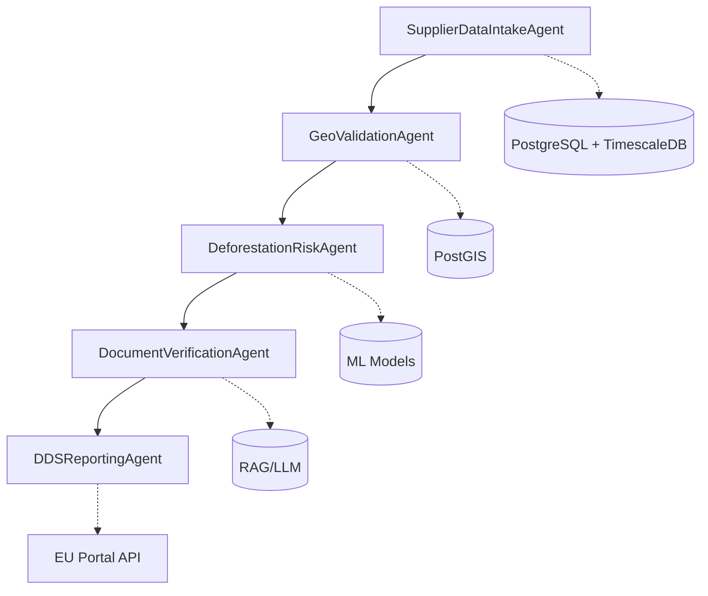

# GL-EUDR-APP: EU Deforestation Regulation Compliance Platform
## Project Plan & Development Strategy

---

## EXECUTIVE SUMMARY

**Project**: EUDR Deforestation Compliance Platform
**Code**: GL-EUDR-APP
**Priority**: TIER 1 - EXTREME URGENCY
**Deadline**: December 30, 2025 (Large/Medium Companies)
**Duration**: 16 weeks (Q1-Q2 2025)
**Team Size**: 6-8 Engineers
**Revenue Target**: $50M ARR by Year 3
**Market**: 100,000+ EU importers/operators

---

## 1. REGULATORY REQUIREMENTS

### 1.1 Core EUDR Requirements (Regulation 2023/1115)

**Covered Commodities (7):**
- Cattle (beef, leather, gelatin)
- Cocoa (chocolate, cocoa butter)
- Coffee (roasted, instant, extracts)
- Palm Oil (derivatives, biofuels)
- Rubber (tires, industrial products)
- Soy (oil, meal, protein)
- Wood (furniture, paper, pulp)

**Compliance Obligations:**
1. **Deforestation-Free**: Products must not originate from land deforested after December 31, 2020
2. **Legal Compliance**: Must comply with all laws in country of production
3. **Due Diligence Statement**: Required before placing products on EU market
4. **Geolocation Data**: Precise coordinates (6 decimal places) for all production plots
5. **Risk Assessment**: Systematic evaluation of deforestation and legality risks
6. **Risk Mitigation**: Adequate measures to address identified risks

### 1.2 Technical Requirements

**Geolocation Requirements:**
- Latitude/Longitude to 6 decimal places minimum
- WGS-84 coordinate system
- Point data for plots < 4 hectares
- Polygon perimeter for plots > 4 hectares
- GeoJSON format support for bulk uploads

**Verification Requirements:**
- Satellite imagery analysis (Sentinel-2, Landsat)
- Forest cover change detection (2020 baseline)
- Document verification (certificates, permits)
- Supply chain traceability (SHA-256 provenance)
- Audit trail (immutable logging)

**Reporting Requirements:**
- Due Diligence Statement submission to EU portal
- Risk assessment documentation
- Mitigation measures reporting
- Annual compliance reports
- Real-time monitoring dashboards

---

## 2. SYSTEM ARCHITECTURE

### 2.1 5-Agent Pipeline Architecture



### 2.2 Agent Specifications

**Agent 1: SupplierDataIntakeAgent**
- Purpose: Ingest supplier and procurement data
- Technologies: Apache NiFi, Kafka, REST APIs
- Integrations: 60+ ERP connectors (SAP, Oracle, Microsoft)
- Output: Normalized supplier data, procurement records

**Agent 2: GeoValidationAgent (DETERMINISTIC)**
- Purpose: Zero-hallucination coordinate validation
- Technologies: PostGIS, GDAL, Shapely
- Functions:
  - Coordinate format validation (WGS-84)
  - Boundary checks (country, region)
  - Plot overlap detection
  - Area calculation (hectares)
- Output: Validated geolocation data

**Agent 3: DeforestationRiskAgent (AI/ML)**
- Purpose: Satellite-based deforestation detection
- Technologies: TensorFlow, PyTorch, GDAL
- Data Sources:
  - Sentinel-2 (10m resolution)
  - Landsat 8/9 (30m resolution)
  - Planet Labs (3m resolution - premium)
- ML Models:
  - U-Net for segmentation
  - Random Forest for classification
  - Change detection algorithms
- Output: Risk scores, deforestation alerts

**Agent 4: DocumentVerificationAgent (AI/LLM)**
- Purpose: Verify compliance documents
- Technologies: LangChain, OpenAI/Anthropic APIs, ChromaDB
- Functions:
  - OCR for scanned documents
  - RAG for compliance checking
  - Certificate validation
  - Permit verification
- Output: Document compliance status

**Agent 5: DDSReportingAgent**
- Purpose: Generate and submit Due Diligence Statements
- Technologies: Node.js, React, REST/SOAP
- Functions:
  - DDS template generation
  - EU portal integration
  - Bulk submission handling
  - Status tracking
- Output: Submitted DDS, compliance certificates

### 2.3 Technology Stack

**Backend:**
- Language: Python 3.11 + Node.js 20
- Framework: FastAPI + Express.js
- Database: PostgreSQL 15 + TimescaleDB
- GIS: PostGIS 3.3
- Cache: Redis 7
- Queue: RabbitMQ/Kafka

**AI/ML:**
- Frameworks: TensorFlow 2.14, PyTorch 2.0
- LLM: OpenAI GPT-4, Anthropic Claude
- Vector DB: ChromaDB, Pinecone
- Image Processing: GDAL, Rasterio

**Frontend:**
- Framework: React 18 + Next.js 14
- UI: Material-UI v5
- Maps: Mapbox GL JS
- Charts: D3.js, Recharts

**Infrastructure:**
- Container: Docker, Kubernetes
- Cloud: AWS/GCP/Azure
- Monitoring: Prometheus, Grafana
- CI/CD: GitHub Actions, ArgoCD

---

## 3. DEVELOPMENT TIMELINE (16 WEEKS)

### Phase 1: Foundation (Weeks 1-4)
**Sprint 1-2: Core Infrastructure & Data Intake**
- Set up development environment
- Implement SupplierDataIntakeAgent
- Build ERP connectors (SAP, Oracle priority)
- Design database schema
- Create API scaffolding

### Phase 2: Geo-Validation (Weeks 5-8)
**Sprint 3-4: Geographic Processing**
- Implement GeoValidationAgent
- PostGIS setup and optimization
- Coordinate validation algorithms
- Boundary checking systems
- Plot management interface

### Phase 3: Risk Assessment (Weeks 9-12)
**Sprint 5-6: ML & Satellite Integration**
- Implement DeforestationRiskAgent
- Train ML models on historical data
- Integrate Sentinel-2 API
- Build change detection pipeline
- Risk scoring algorithms

### Phase 4: Compliance & Reporting (Weeks 13-16)
**Sprint 7-8: Document Processing & DDS**
- Implement DocumentVerificationAgent
- RAG/LLM integration
- DDSReportingAgent development
- EU portal integration
- End-to-end testing

---

## 4. SPRINT 1 DETAILED PLAN (Weeks 1-2)

### 4.1 User Stories

**EUDR-001: ERP Data Integration**
```
As a compliance officer
I want to automatically import supplier data from our ERP system
So that I don't need to manually enter supplier information
```
**Acceptance Criteria:**
- SAP connector implemented and tested
- Oracle connector implemented and tested
- Data mapping configuration UI
- Error handling and retry logic
- Import history and audit logs

**EUDR-002: Supplier Registration**
```
As a supplier manager
I want to register new suppliers with their production locations
So that we can track the origin of our commodities
```
**Acceptance Criteria:**
- Supplier registration form with validation
- Geolocation input (manual + file upload)
- Commodity type selection
- Document upload capability
- API endpoint for programmatic registration

**EUDR-003: Database Architecture**
```
As a system architect
I want a scalable database schema for EUDR compliance data
So that we can handle millions of transactions efficiently
```
**Acceptance Criteria:**
- PostgreSQL + TimescaleDB setup
- PostGIS extension configured
- Database schema created
- Initial migrations completed
- Performance benchmarks met (10k TPS)

**EUDR-004: API Foundation**
```
As a developer
I want RESTful APIs for core operations
So that frontend and external systems can integrate
```
**Acceptance Criteria:**
- FastAPI application structure
- Authentication/authorization (JWT)
- OpenAPI documentation
- Rate limiting implemented
- CORS configuration

### 4.2 Sprint 1 Dependencies

**External:**
- ERP system access credentials
- EU portal API documentation
- Satellite data API keys
- Cloud infrastructure provisioning

**Internal:**
- Team onboarding completed
- Development environments set up
- Git repository access
- CI/CD pipelines configured

### 4.3 Sprint 1 Deliverables

1. Working ERP connectors (SAP, Oracle)
2. Database schema and initial setup
3. API scaffolding with authentication
4. Basic supplier registration functionality
5. Technical documentation
6. Sprint 1 demo to stakeholders

---

## 5. RISK ASSESSMENT & MITIGATION

### 5.1 Critical Risks

**Risk 1: EU Portal API Delays**
- **Impact**: HIGH - Cannot submit DDS without integration
- **Probability**: MEDIUM - API still in development
- **Mitigation**:
  - Early engagement with EU technical team
  - Build mock API for testing
  - Manual submission fallback option

**Risk 2: Satellite Data Quality**
- **Impact**: HIGH - False positives/negatives in deforestation detection
- **Probability**: MEDIUM - Cloud cover, resolution issues
- **Mitigation**:
  - Multiple satellite sources (Sentinel + Landsat)
  - ML model ensemble approach
  - Human-in-the-loop verification for high-risk cases

**Risk 3: ERP Integration Complexity**
- **Impact**: MEDIUM - Delays in data intake
- **Probability**: HIGH - Each ERP has unique challenges
- **Mitigation**:
  - Start with top 3 ERPs (80% market share)
  - Build generic adapter framework
  - Offer CSV/Excel import as fallback

**Risk 4: Regulatory Changes**
- **Impact**: HIGH - Requirements may change before deadline
- **Probability**: LOW - Regulation is finalized
- **Mitigation**:
  - Flexible architecture to accommodate changes
  - Regular regulatory update monitoring
  - Legal advisor on retainer

**Risk 5: Scalability Issues**
- **Impact**: HIGH - System crashes under load
- **Probability**: MEDIUM - 100k+ companies need compliance
- **Mitigation**:
  - Horizontal scaling architecture
  - Load testing from Sprint 3
  - CDN for static assets
  - Database partitioning strategy

### 5.2 Technical Risks

**Risk 6: ML Model Accuracy**
- **Impact**: HIGH - Incorrect risk assessments
- **Probability**: MEDIUM - Complex forest detection
- **Mitigation**:
  - 90% accuracy target with human review
  - Continuous model training
  - Expert forestry consultation

**Risk 7: Data Privacy Compliance**
- **Impact**: MEDIUM - GDPR violations
- **Probability**: LOW - Standard compliance
- **Mitigation**:
  - Privacy by design
  - Data encryption at rest/transit
  - Regular security audits

---

## 6. TEAM STRUCTURE & RESPONSIBILITIES

### 6.1 Core Team (8 Engineers)

1. **Technical Lead/Architect** (1)
   - System design and architecture
   - Technical decision making
   - Code review and quality

2. **Backend Engineers** (2)
   - Agent implementation
   - API development
   - Database optimization

3. **ML Engineer** (1)
   - Satellite image processing
   - Deforestation detection models
   - Model training pipeline

4. **Integration Engineer** (1)
   - ERP connectors
   - EU portal integration
   - Third-party APIs

5. **Frontend Engineer** (1)
   - React dashboard
   - User interface
   - Data visualization

6. **DevOps Engineer** (1)
   - Infrastructure automation
   - CI/CD pipelines
   - Monitoring and alerting

7. **QA Engineer** (1)
   - Test automation
   - Performance testing
   - Compliance validation

### 6.2 Extended Team Support

- **Product Manager**: Requirements and prioritization
- **UX Designer**: User experience optimization
- **Legal Advisor**: Regulatory compliance
- **Customer Success**: Beta customer management

---

## 7. SUCCESS METRICS

### 7.1 Technical KPIs

- **System Uptime**: 99.9% availability
- **Response Time**: < 2s for 95% of requests
- **ML Accuracy**: > 90% for deforestation detection
- **Data Processing**: 10,000 DDS/day capacity
- **Integration Coverage**: 60+ ERP systems

### 7.2 Business KPIs

- **Beta Customers**: 20 companies by Q2 2025
- **DDS Processed**: 1,000+ by June 2025
- **Revenue Pipeline**: $10M by Q3 2025
- **Market Share**: 5% of EU importers by 2026

### 7.3 Compliance KPIs

- **Audit Success Rate**: 100% pass rate
- **False Positive Rate**: < 5%
- **Document Processing Time**: < 24 hours
- **EU Portal Success Rate**: > 98%

---

## 8. BUDGET ESTIMATE

### 8.1 Development Costs (16 weeks)

- **Team Salaries**: $320,000 (8 engineers x 16 weeks)
- **Infrastructure**: $50,000 (AWS/GCP)
- **Satellite Data**: $30,000 (API subscriptions)
- **Tools & Licenses**: $20,000
- **Total Development**: $420,000

### 8.2 Annual Operating Costs

- **Infrastructure**: $200,000/year
- **Satellite Data**: $150,000/year
- **Support & Maintenance**: $300,000/year
- **Total Operating**: $650,000/year

---

## 9. GO-TO-MARKET STRATEGY

### 9.1 Target Segments

**Tier 1: Large Importers** (1,000 companies)
- Annual revenue > €100M
- Complex supply chains
- High compliance risk

**Tier 2: Medium Importers** (10,000 companies)
- Annual revenue €10-100M
- Moderate complexity
- Price sensitive

**Tier 3: Small Importers** (90,000 companies)
- Annual revenue < €10M
- Simple supply chains
- Self-service preference

### 9.2 Pricing Model

- **Enterprise**: €50,000/year (unlimited DDS)
- **Professional**: €10,000/year (up to 1,000 DDS)
- **Starter**: €2,000/year (up to 100 DDS)
- **Pay-per-use**: €50/DDS

---

## 10. NEXT STEPS

### Immediate Actions (Week 1)

1. **Team Assembly**
   - Recruit remaining engineers
   - Set up development environment
   - Conduct EUDR training

2. **Infrastructure Setup**
   - Provision cloud resources
   - Set up CI/CD pipeline
   - Configure monitoring

3. **Stakeholder Alignment**
   - Present plan to executives
   - Identify beta customers
   - Engage with EU authorities

4. **Development Kickoff**
   - Sprint 1 planning session
   - Assign user stories
   - Daily standup schedule

### Week 2-4 Milestones

- ERP connector prototypes (SAP, Oracle)
- Database schema implementation
- API authentication system
- Basic UI mockups
- First integration test

### Critical Path Items

1. EU portal API access (Block: DDS submission)
2. Satellite data subscriptions (Block: Risk assessment)
3. Beta customer agreements (Block: Real-world testing)
4. Security audit scheduling (Block: Production launch)

---

## APPENDICES

### A. Technical Architecture Diagrams
[Detailed system architecture diagrams to be added]

### B. Database Schema
[PostgreSQL + PostGIS schema definitions to be added]

### C. API Documentation
[OpenAPI specifications to be added]

### D. Compliance Checklist
[EUDR compliance verification checklist to be added]

### E. Risk Register
[Comprehensive risk tracking spreadsheet to be added]

---

*Document Version: 1.0*
*Last Updated: November 2024*
*Author: GL-EUDR Project Management Team*
*Status: APPROVED FOR EXECUTION*