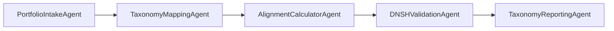

# GL-Taxonomy-APP: EU Taxonomy Alignment Platform
## Project Plan & Technical Specification

**Version:** 1.0
**Date:** November 10, 2024
**Status:** TIER 2 - HIGH URGENCY
**Deadline:** January 1, 2026 (Simplified rules effective)
**Full Enforcement:** July 2027

---

## 1. EXECUTIVE SUMMARY

The GL-Taxonomy-APP is a regulatory compliance platform enabling financial institutions to calculate Green Asset Ratio (GAR) and Green Investment Ratio (GIR) in accordance with EU Taxonomy Regulation 2020/852. With January 2026 simplified disclosure rules approaching, this platform provides automated taxonomy alignment assessment, DNSH validation, and regulatory reporting capabilities.

### Key Metrics
- **Target Market:** 10,000+ EU financial institutions
- **Affected Assets:** €4.18 trillion (31.5% of EU funds)
- **Revenue Potential:** $70M ARR by Year 3
- **Development Timeline:** 16 weeks (critical path)
- **Team Size:** 7-9 engineers

---

## 2. REGULATORY REQUIREMENTS

### 2.1 EU Taxonomy Framework

#### Six Environmental Objectives
1. **Climate Change Mitigation** (Active)
2. **Climate Change Adaptation** (Active)
3. **Sustainable Use of Water Resources** (2026+)
4. **Circular Economy Transition** (2026+)
5. **Pollution Prevention & Control** (2026+)
6. **Biodiversity & Ecosystem Protection** (2026+)

#### Taxonomy Alignment Criteria
An economic activity is taxonomy-aligned if it:
1. **Substantially contributes** to at least one environmental objective
2. **Does No Significant Harm (DNSH)** to other five objectives
3. **Complies with Minimum Safeguards** (OECD Guidelines, UN Guiding Principles)
4. **Meets Technical Screening Criteria** (TSC) for the activity

### 2.2 Technical Screening Criteria Database

**Coverage Required:**
- 150+ economic activities across 13 sectors
- NACE code mapping (4-digit level)
- Quantitative thresholds per activity
- Climate delegated acts (88 activities)
- Environmental delegated acts (62+ activities)

**Key Sectors:**
1. Energy (renewable, gas, nuclear)
2. Manufacturing (cement, steel, chemicals)
3. Transport (vehicles, shipping, aviation)
4. Buildings (construction, renovation)
5. Water & Waste Management
6. ICT & Digital
7. Financial & Insurance Activities

### 2.3 DNSH Assessment Framework

**DNSH Criteria per Objective:**
- Climate mitigation: GHG emissions thresholds
- Climate adaptation: Physical climate risk assessment
- Water resources: Water stress analysis, discharge quality
- Circular economy: Waste hierarchy, recycling rates
- Pollution: EU chemical regulations compliance
- Biodiversity: Environmental Impact Assessments

### 2.4 Green Asset Ratio (GAR) Methodology

**GAR Formula:**
```
GAR = Taxonomy-aligned assets / Total covered assets

Where:
- Numerator: Exposures to taxonomy-aligned activities
- Denominator: Total assets excluding sovereign exposures, central banks, trading book
```

**Asset Categories:**
1. **Corporate Exposures:** Loans, debt securities, equity
2. **Retail Exposures:** Mortgages (EPC ratings), auto loans (CO2 thresholds)
3. **Local Government Finance:** Municipal green bonds
4. **Project Finance:** Renewable energy, infrastructure

**Reporting Templates:**
- Template 1: GAR stock (point-in-time)
- Template 2: GAR flow (new business)
- Template 3: GAR by sector
- Template 4: Off-balance sheet exposures

---

## 3. TECHNICAL ARCHITECTURE

### 3.1 Five-Agent Pipeline Architecture



#### Agent 1: PortfolioIntakeAgent
**Purpose:** Data ingestion and standardization
**Inputs:** CSV, Excel, API feeds, loan books
**Outputs:** Normalized portfolio records
**Key Features:**
- Multi-format parser (CSV, XLSX, JSON, XML)
- NACE code enrichment
- Counterparty identification
- Data quality validation

#### Agent 2: TaxonomyMappingAgent (AI-Enhanced)
**Purpose:** Map economic activities to taxonomy
**Technology:** LLM with RAG (Retrieval Augmented Generation)
**Inputs:** Company descriptions, revenue streams
**Outputs:** Activity classification with confidence scores
**Key Features:**
- 150+ activity classifier
- NACE to taxonomy mapping
- Revenue/CAPEX/OPEX split detection
- Fallback to manual review queue

#### Agent 3: AlignmentCalculatorAgent
**Purpose:** Deterministic GAR/GIR calculations
**Inputs:** Classified activities, financial data
**Outputs:** Alignment percentages
**Key Features:**
- TSC threshold validation
- Weighted average calculations
- Partial alignment handling
- Transitional activity logic

#### Agent 4: DNSHValidationAgent
**Purpose:** Verify DNSH compliance
**Inputs:** Activity data, environmental metrics
**Outputs:** DNSH pass/fail per objective
**Key Features:**
- 6-objective assessment matrix
- Evidence collection framework
- Minimum safeguards check
- Audit trail generation

#### Agent 5: TaxonomyReportingAgent
**Purpose:** Generate regulatory disclosures
**Inputs:** Calculated GAR/GIR
**Outputs:** XBRL files, PDF reports
**Key Features:**
- EBA reporting templates
- XBRL taxonomy generation
- Audit package creation
- Period-over-period analytics

### 3.2 Technology Stack

**Backend:**
- Python 3.10+ (FastAPI framework)
- PostgreSQL 15 (taxonomy database)
- Redis (caching layer)
- Celery (async processing)

**AI/ML Components:**
- OpenAI GPT-4 / Anthropic Claude (activity classification)
- LangChain (RAG pipeline)
- Pinecone/Weaviate (vector database)
- scikit-learn (threshold calculations)

**Frontend:**
- React 18 + TypeScript
- Material-UI components
- Recharts (data visualization)
- AG-Grid (portfolio tables)

**Infrastructure:**
- Docker + Kubernetes
- AWS/Azure deployment
- GitHub Actions CI/CD
- Terraform IaC

---

## 4. DEVELOPMENT TIMELINE (16 WEEKS)

### Phase 1: Foundation (Weeks 1-4)
**Week 1-2: Taxonomy Database**
- [ ] Create PostgreSQL schema
- [ ] Import 150+ activities from Delegated Acts
- [ ] Build NACE mapping tables
- [ ] Implement TSC threshold logic

**Week 3-4: Data Ingestion Pipeline**
- [ ] Build PortfolioIntakeAgent
- [ ] CSV/Excel parsers
- [ ] API integration framework
- [ ] Data validation rules

### Phase 2: Core Engine (Weeks 5-8)
**Week 5-6: AI Classification**
- [ ] TaxonomyMappingAgent development
- [ ] LLM integration (GPT-4/Claude)
- [ ] RAG pipeline setup
- [ ] Training data preparation

**Week 7-8: Calculation Engine**
- [ ] AlignmentCalculatorAgent
- [ ] GAR formula implementation
- [ ] Weighted average logic
- [ ] Partial alignment handling

### Phase 3: Compliance Layer (Weeks 9-12)
**Week 9-10: DNSH Framework**
- [ ] DNSHValidationAgent
- [ ] 6-objective assessment
- [ ] Evidence management
- [ ] Minimum safeguards

**Week 11-12: Reporting Module**
- [ ] TaxonomyReportingAgent
- [ ] EBA template generation
- [ ] XBRL export
- [ ] PDF report builder

### Phase 4: Production Ready (Weeks 13-16)
**Week 13-14: Integration & Testing**
- [ ] End-to-end testing
- [ ] Performance optimization
- [ ] Security audit
- [ ] Documentation

**Week 15-16: Beta Launch**
- [ ] Deploy to staging
- [ ] Beta customer onboarding (5 banks)
- [ ] Feedback collection
- [ ] Production deployment

---

## 5. TEAM COMPOSITION

### Core Team (7-9 Engineers)

1. **Technical Lead/Architect** (Senior)
   - System design
   - Agent orchestration
   - Technical decisions

2. **Backend Engineer** (Senior)
   - FastAPI development
   - Database design
   - API development

3. **Calculation Specialist** (Senior)
   - GAR/GIR formulas
   - Financial calculations
   - Regulatory logic

4. **AI/ML Engineer** (Senior)
   - LLM integration
   - Classification models
   - RAG pipeline

5. **Frontend Engineer** (Mid-Senior)
   - React dashboard
   - Data visualization
   - User workflows

6. **Data Engineer** (Mid-Senior)
   - ETL pipelines
   - Data quality
   - Integration connectors

7. **QA/Compliance Engineer** (Mid-Senior)
   - Regulatory testing
   - Calculation validation
   - Audit trails

8. **DevOps Engineer** (Mid-Senior)
   - Infrastructure
   - CI/CD pipeline
   - Monitoring

9. **Technical Writer** (Contract)
   - API documentation
   - User guides
   - Regulatory mapping

---

## 6. TECHNICAL SPECIFICATIONS

### 6.1 Classification Engine Design

```python
class TaxonomyClassifier:
    """
    Multi-stage classification pipeline:
    1. NACE code mapping (deterministic)
    2. Keyword matching (rule-based)
    3. LLM classification (AI-enhanced)
    4. Confidence scoring
    5. Manual review queue
    """

    def classify_activity(self, company_data):
        # Stage 1: NACE mapping
        if nace_code := company_data.get('nace_code'):
            if activity := self.nace_to_taxonomy.get(nace_code):
                return activity, confidence=0.95

        # Stage 2: Keyword matching
        if keywords := self.extract_keywords(company_data['description']):
            if matches := self.keyword_matcher.find_activities(keywords):
                return matches[0], confidence=0.80

        # Stage 3: LLM classification
        prompt = self.build_classification_prompt(company_data)
        llm_result = self.llm.classify(prompt)

        if llm_result.confidence > 0.70:
            return llm_result.activity, llm_result.confidence

        # Stage 4: Manual review
        return None, confidence=0.0
```

### 6.2 Revenue Allocation Logic

```python
class RevenueAllocator:
    """
    Allocate company revenues to taxonomy activities
    """

    def allocate_revenues(self, company, activities):
        allocations = {}

        # Revenue streams mapping
        for revenue_stream in company.revenue_streams:
            activity = self.map_to_activity(revenue_stream)

            if activity.is_taxonomy_eligible():
                alignment = self.calculate_alignment(
                    activity=activity,
                    tsc_data=company.environmental_data,
                    dnsh_data=company.dnsh_evidence
                )

                allocations[activity] = {
                    'revenue': revenue_stream.amount,
                    'capex': revenue_stream.capex,
                    'opex': revenue_stream.opex,
                    'eligible': True,
                    'aligned': alignment.is_aligned,
                    'alignment_pct': alignment.percentage
                }

        return allocations
```

### 6.3 GAR Calculation Methodology

```python
class GARCalculator:
    """
    Green Asset Ratio calculation per EBA guidelines
    """

    def calculate_gar(self, portfolio):
        # Numerator: Taxonomy-aligned assets
        aligned_assets = 0

        for exposure in portfolio.exposures:
            if exposure.type == 'corporate':
                # Use reported alignment
                aligned_assets += exposure.amount * exposure.green_ratio

            elif exposure.type == 'retail_mortgage':
                # Use EPC rating thresholds
                if exposure.epc_rating in ['A', 'B']:
                    aligned_assets += exposure.amount

            elif exposure.type == 'auto_loan':
                # Use CO2 emission thresholds
                if exposure.co2_emissions < 50:  # g/km
                    aligned_assets += exposure.amount

        # Denominator: Total covered assets
        covered_assets = portfolio.total_assets
        covered_assets -= portfolio.sovereign_exposures
        covered_assets -= portfolio.central_bank_exposures
        covered_assets -= portfolio.trading_book

        # GAR calculation
        gar = aligned_assets / covered_assets if covered_assets > 0 else 0

        return {
            'gar_percentage': gar * 100,
            'aligned_assets': aligned_assets,
            'covered_assets': covered_assets,
            'calculation_date': datetime.now()
        }
```

---

## 7. RISK ASSESSMENT & MITIGATION

### 7.1 Critical Risks

| Risk | Impact | Probability | Mitigation Strategy |
|------|--------|-------------|-------------------|
| **Regulatory Changes** | High | Medium | Modular architecture, configurable rules engine |
| **Data Quality Issues** | High | High | Validation framework, manual review queue |
| **LLM Hallucination** | High | Medium | Deterministic fallback, confidence thresholds |
| **Calculation Errors** | Critical | Low | Extensive testing, audit logs, dual validation |
| **Timeline Slippage** | High | Medium | MVP approach, phased delivery |
| **Integration Complexity** | Medium | High | Standard APIs, comprehensive documentation |
| **Scalability Issues** | Medium | Medium | Cloud-native architecture, horizontal scaling |
| **Customer Adoption** | High | Medium | Beta program, white-glove onboarding |

### 7.2 Mitigation Strategies

1. **Regulatory Compliance**
   - Weekly regulation monitoring
   - Legal advisory board
   - Configurable rules engine
   - Version control for regulations

2. **Data Quality Assurance**
   - Multi-stage validation
   - Data completeness scoring
   - Anomaly detection
   - Manual review workflows

3. **Technical Reliability**
   - 99.9% uptime SLA
   - Disaster recovery plan
   - Real-time monitoring
   - Automated testing (>80% coverage)

4. **Security & Privacy**
   - SOC 2 Type II compliance
   - GDPR compliance
   - End-to-end encryption
   - Regular security audits

---

## 8. SUCCESS METRICS & KPIs

### Technical KPIs
- Classification accuracy: >95%
- Calculation accuracy: 100% (deterministic)
- API response time: <2 seconds
- System uptime: 99.9%
- Data processing: 1M records/hour

### Business KPIs
- Beta customers: 10 banks (Q4 2025)
- Production customers: 50 (Q1 2026)
- Assets under calculation: €500B (Year 1)
- Revenue target: $10M ARR (Year 1)
- Customer satisfaction: >4.5/5

### Regulatory KPIs
- Audit pass rate: 100%
- Regulatory filing accuracy: 100%
- XBRL validation: 100% compliant
- Report generation: <5 minutes

---

## 9. GO-TO-MARKET STRATEGY

### Phase 1: Beta Launch (Q4 2025)
- 10 pilot banks
- Free access for feedback
- White-glove support
- Feature iteration

### Phase 2: Production Launch (Q1 2026)
- Tiered pricing model
- API-first approach
- Partner integrations
- Compliance certification

### Pricing Model
- **Starter:** €5,000/month (up to €10B assets)
- **Professional:** €15,000/month (up to €100B assets)
- **Enterprise:** Custom pricing (>€100B assets)
- **API Access:** Usage-based pricing

---

## 10. NEXT STEPS

### Immediate Actions (Week 1)
1. [ ] Set up development environment
2. [ ] Create GitHub repository structure
3. [ ] Initialize database schema
4. [ ] Import first 20 taxonomy activities
5. [ ] Build POC for GAR calculation

### Week 2-4 Priorities
1. [ ] Complete taxonomy database (150+ activities)
2. [ ] Develop PortfolioIntakeAgent
3. [ ] Create API specification
4. [ ] Set up CI/CD pipeline
5. [ ] Begin LLM integration research

### Critical Milestones
- **December 2024:** Taxonomy database complete
- **January 2025:** Core calculation engine
- **February 2025:** DNSH framework
- **March 2025:** Beta version ready
- **April 2025:** Customer pilots
- **June 2025:** Production launch

---

## APPENDICES

### A. Regulatory References
- EU Taxonomy Regulation (EU) 2020/852
- Climate Delegated Act (EU) 2021/2139
- Complementary Climate Delegated Act (EU) 2022/1214
- Environmental Delegated Act (EU) 2023/2486
- Disclosures Delegated Act (EU) 2021/2178

### B. Technical Standards
- EBA ITS on Pillar 3 ESG risks disclosure
- ESMA Guidelines on fund names using ESG terms
- ECB Guide on climate-related and environmental risks

### C. Competition Analysis
- Clarity AI (€50M funding)
- MSCI ESG Manager
- ISS ESG Solutions
- Bloomberg ESG Data
- Sustainalytics (Morningstar)

### D. Resources Required
- Development team: 7-9 engineers
- Infrastructure: $15,000/month
- LLM API costs: $5,000/month
- Compliance/Legal: $50,000 one-time
- Total budget: $1.5M (16 weeks)

---

**Document Version:** 1.0
**Last Updated:** November 10, 2024
**Status:** Ready for Review
**Next Review:** November 17, 2024