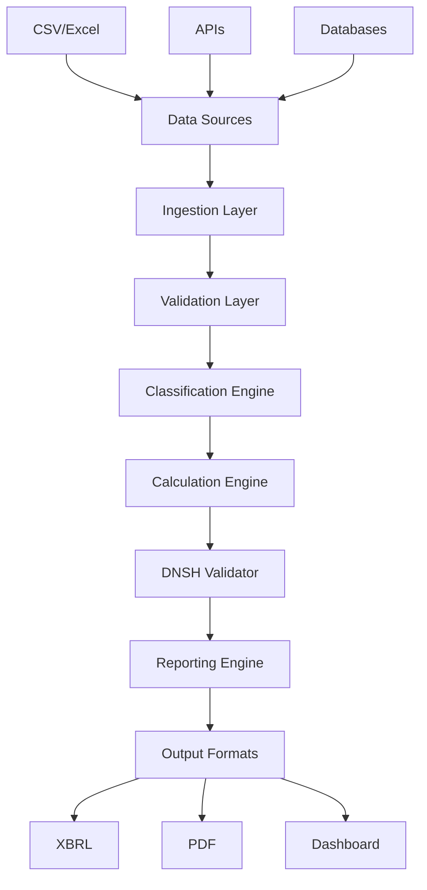

# GL-Taxonomy-APP: Technical Requirements Document
## EU Taxonomy Alignment Platform

**Version:** 1.0
**Date:** November 10, 2024
**Classification:** TIER 2 - HIGH URGENCY

---

## 1. SYSTEM REQUIREMENTS

### 1.1 Functional Requirements

#### FR-001: Portfolio Data Ingestion
- Support CSV, XLSX, JSON, XML formats
- Handle 1M+ records per upload
- Validate NACE codes (4-digit)
- Support batch and streaming ingestion
- Maintain data lineage

#### FR-002: Taxonomy Classification
- Classify against 150+ economic activities
- Map NACE codes to taxonomy activities
- Provide confidence scoring (0-100%)
- Support manual override capability
- Queue ambiguous cases for review

#### FR-003: GAR/GIR Calculation
- Calculate Green Asset Ratio (banks)
- Calculate Green Investment Ratio (asset managers)
- Support partial alignment (0-100%)
- Handle transitional activities
- Calculate flow and stock metrics

#### FR-004: DNSH Validation
- Assess 6 environmental objectives
- Validate technical screening criteria
- Check minimum safeguards
- Track evidence documentation
- Generate audit trails

#### FR-005: Regulatory Reporting
- Generate EBA templates (1-4)
- Export XBRL format
- Create PDF reports
- Support quarterly/annual periods
- Maintain versioning

### 1.2 Non-Functional Requirements

#### NFR-001: Performance
- Response time: <2 seconds for queries
- Batch processing: 100K records/hour
- Concurrent users: 1,000+
- API rate limit: 1,000 requests/minute
- Report generation: <5 minutes

#### NFR-002: Scalability
- Horizontal scaling capability
- Support 10,000+ institutions
- Handle €5 trillion in assets
- Multi-tenant architecture
- Cloud-native deployment

#### NFR-003: Security
- SOC 2 Type II compliance
- GDPR compliance
- End-to-end encryption (AES-256)
- Role-based access control
- Multi-factor authentication

#### NFR-004: Reliability
- Availability: 99.9% uptime
- Recovery Time Objective: <1 hour
- Recovery Point Objective: <15 minutes
- Automated backups: Daily
- Disaster recovery plan

#### NFR-005: Auditability
- Complete audit logging
- Immutable calculation history
- Change tracking
- User activity monitoring
- Regulatory evidence chain

---

## 2. DATA ARCHITECTURE

### 2.1 Core Data Models

```sql
-- Taxonomy Activities
CREATE TABLE taxonomy_activities (
    id UUID PRIMARY KEY,
    activity_code VARCHAR(20) UNIQUE,
    nace_codes TEXT[],
    sector VARCHAR(100),
    objective VARCHAR(50),
    activity_name TEXT,
    description TEXT,
    technical_criteria JSONB,
    dnsh_criteria JSONB,
    version VARCHAR(10),
    effective_date DATE,
    created_at TIMESTAMP DEFAULT NOW()
);

-- Portfolio Holdings
CREATE TABLE portfolio_holdings (
    id UUID PRIMARY KEY,
    institution_id UUID,
    holding_id VARCHAR(100),
    counterparty_name TEXT,
    nace_code VARCHAR(10),
    exposure_amount DECIMAL(20,2),
    exposure_type VARCHAR(50),
    currency VARCHAR(3),
    reporting_date DATE,
    created_at TIMESTAMP DEFAULT NOW()
);

-- Alignment Calculations
CREATE TABLE alignment_calculations (
    id UUID PRIMARY KEY,
    holding_id UUID,
    activity_id UUID,
    eligibility_status BOOLEAN,
    alignment_percentage DECIMAL(5,2),
    revenue_aligned DECIMAL(20,2),
    capex_aligned DECIMAL(20,2),
    opex_aligned DECIMAL(20,2),
    dnsh_pass BOOLEAN,
    calculation_date TIMESTAMP,
    calculation_version VARCHAR(10)
);

-- GAR Results
CREATE TABLE gar_results (
    id UUID PRIMARY KEY,
    institution_id UUID,
    reporting_period DATE,
    gar_percentage DECIMAL(5,2),
    aligned_assets DECIMAL(20,2),
    covered_assets DECIMAL(20,2),
    calculation_metadata JSONB,
    created_at TIMESTAMP DEFAULT NOW()
);
```

### 2.2 Data Flow Architecture



---

## 3. API SPECIFICATIONS

### 3.1 REST API Endpoints

#### Portfolio Management
```yaml
POST /api/v1/portfolios/upload
  description: Upload portfolio data
  request:
    content-type: multipart/form-data
    file: binary
    format: enum[csv, xlsx, json]
  response:
    upload_id: uuid
    status: processing
    records_count: integer

GET /api/v1/portfolios/{portfolio_id}
  description: Retrieve portfolio details
  response:
    holdings: array
    total_exposure: decimal
    currency: string
    reporting_date: date

PUT /api/v1/portfolios/{portfolio_id}/holdings/{holding_id}
  description: Update holding information
  request:
    nace_code: string
    exposure_amount: decimal
    environmental_data: object
```

#### Taxonomy Classification
```yaml
POST /api/v1/classify
  description: Classify economic activities
  request:
    company_name: string
    description: text
    nace_code: string
    revenue_streams: array
  response:
    activities: array
      - activity_code: string
        confidence: decimal
        eligible: boolean

GET /api/v1/taxonomy/activities
  description: List taxonomy activities
  parameters:
    sector: string
    objective: string
    nace_code: string
  response:
    activities: array
    total_count: integer
```

#### GAR Calculation
```yaml
POST /api/v1/calculations/gar
  description: Calculate Green Asset Ratio
  request:
    portfolio_id: uuid
    reporting_date: date
    calculation_method: enum[stock, flow]
  response:
    gar_percentage: decimal
    aligned_assets: decimal
    covered_assets: decimal
    breakdown_by_sector: object

GET /api/v1/calculations/{calculation_id}
  description: Retrieve calculation details
  response:
    status: enum[pending, completed, failed]
    results: object
    audit_trail: array
```

#### Reporting
```yaml
POST /api/v1/reports/generate
  description: Generate regulatory report
  request:
    calculation_id: uuid
    template: enum[gar_stock, gar_flow, sector, offbalance]
    format: enum[xbrl, pdf, excel]
  response:
    report_id: uuid
    download_url: string
    expires_at: timestamp

GET /api/v1/reports/{report_id}/download
  description: Download generated report
  response:
    content-type: application/octet-stream
    content: binary
```

### 3.2 WebSocket Events

```javascript
// Real-time calculation updates
ws.on('calculation.progress', (data) => {
    // { calculation_id, progress: 0-100, status, message }
});

ws.on('classification.complete', (data) => {
    // { holding_id, activities, confidence }
});

ws.on('report.ready', (data) => {
    // { report_id, download_url }
});
```

---

## 4. INTEGRATION REQUIREMENTS

### 4.1 External Data Sources

#### Bloomberg Terminal
- Real-time ESG scores
- Company fundamentals
- NACE code enrichment
- Green bond identification

#### GLEIF (Legal Entity Identifier)
- LEI validation
- Parent company mapping
- Ownership structure

#### EU Taxonomy Compass
- Official activity list
- Technical criteria updates
- DNSH requirements

### 4.2 Banking Systems Integration

#### Core Banking Systems
- Loan book data extraction
- Counterparty information
- Exposure calculations
- Collateral data

#### Risk Management Systems
- Credit risk metrics
- Climate risk assessments
- Stress testing data

#### Regulatory Reporting Systems
- FINREP integration
- COREP alignment
- Pillar 3 disclosures

---

## 5. TESTING REQUIREMENTS

### 5.1 Test Coverage

#### Unit Testing
- Calculation engine: 100% coverage
- Classification logic: 95% coverage
- Data validation: 90% coverage
- API endpoints: 85% coverage

#### Integration Testing
- End-to-end workflows
- External API mocking
- Database transactions
- Message queue processing

#### Performance Testing
- Load testing: 10,000 concurrent users
- Stress testing: 5M records processing
- Latency testing: <2s response time
- Throughput: 1M calculations/day

### 5.2 Compliance Testing

#### Regulatory Validation
- GAR formula accuracy
- DNSH criteria checking
- TSC threshold validation
- XBRL schema compliance

#### Security Testing
- Penetration testing
- OWASP Top 10 validation
- SQL injection prevention
- Authentication/authorization

---

## 6. DEPLOYMENT REQUIREMENTS

### 6.1 Infrastructure

#### Cloud Provider (AWS/Azure)
```yaml
Production Environment:
  - Application Servers: 8x c5.2xlarge
  - Database: RDS PostgreSQL (db.r5.4xlarge)
  - Cache: ElastiCache Redis (cache.r6g.xlarge)
  - Load Balancer: Application Load Balancer
  - Storage: S3 (10TB)
  - CDN: CloudFront

Staging Environment:
  - Application Servers: 4x c5.xlarge
  - Database: RDS PostgreSQL (db.t3.large)
  - Cache: ElastiCache Redis (cache.t3.medium)
```

### 6.2 DevOps Pipeline

```yaml
CI/CD Pipeline:
  - Source: GitHub
  - CI: GitHub Actions
  - Container Registry: ECR/ACR
  - Orchestration: Kubernetes (EKS/AKS)
  - Monitoring: Prometheus + Grafana
  - Logging: ELK Stack
  - APM: New Relic/DataDog
```

### 6.3 Deployment Stages

1. **Development:** Feature branches, local testing
2. **Integration:** Develop branch, automated testing
3. **Staging:** Pre-production validation
4. **Production:** Blue-green deployment
5. **DR Site:** Hot standby configuration

---

## 7. MONITORING & OBSERVABILITY

### 7.1 Application Metrics

```yaml
Business Metrics:
  - GAR calculations per day
  - Classification accuracy
  - Report generation time
  - API usage by endpoint
  - Customer engagement

Technical Metrics:
  - Response time (p50, p95, p99)
  - Error rate by service
  - Database query performance
  - Message queue depth
  - Resource utilization
```

### 7.2 Alerting Rules

```yaml
Critical Alerts:
  - System downtime > 5 minutes
  - Error rate > 5%
  - Response time p99 > 5 seconds
  - Database connection pool exhausted
  - Calculation failures > 1%

Warning Alerts:
  - CPU usage > 80%
  - Memory usage > 85%
  - Disk usage > 90%
  - Queue depth > 10,000
  - API rate limit exceeded
```

---

## 8. DOCUMENTATION REQUIREMENTS

### 8.1 Technical Documentation

1. **API Documentation** (OpenAPI/Swagger)
2. **Database Schema Documentation**
3. **Architecture Decision Records**
4. **Deployment Guide**
5. **Troubleshooting Guide**

### 8.2 User Documentation

1. **User Manual** (PDF, 100+ pages)
2. **Quick Start Guide** (10 pages)
3. **Video Tutorials** (10 videos)
4. **FAQ Section**
5. **Regulatory Mapping Guide**

### 8.3 Compliance Documentation

1. **Calculation Methodology**
2. **Audit Trail Specification**
3. **Data Governance Policy**
4. **Security Controls**
5. **Regulatory Alignment Matrix**

---

## 9. ACCEPTANCE CRITERIA

### 9.1 Feature Acceptance

- [ ] Portfolio upload processes 100K records in <10 minutes
- [ ] Classification achieves >95% accuracy on test set
- [ ] GAR calculation matches manual calculations 100%
- [ ] DNSH validation covers all 6 objectives
- [ ] XBRL export validates against official schema

### 9.2 Performance Acceptance

- [ ] API response time p95 < 2 seconds
- [ ] System handles 1,000 concurrent users
- [ ] Report generation < 5 minutes for 1M records
- [ ] 99.9% uptime over 30 days
- [ ] Zero critical security vulnerabilities

### 9.3 Regulatory Acceptance

- [ ] Complies with EU Taxonomy Regulation
- [ ] Meets EBA disclosure requirements
- [ ] Passes external audit review
- [ ] GDPR compliant data handling
- [ ] Complete audit trail maintained

---

## 10. RISK REGISTER

| Risk ID | Description | Impact | Mitigation |
|---------|------------|--------|------------|
| R-001 | Regulatory changes mid-development | High | Modular architecture, weekly regulation review |
| R-002 | LLM classification errors | High | Confidence thresholds, manual review queue |
| R-003 | Data quality from banks | High | Validation rules, data quality scoring |
| R-004 | Performance at scale | Medium | Load testing, horizontal scaling |
| R-005 | Integration complexity | Medium | Standard APIs, comprehensive docs |
| R-006 | Timeline pressure | High | MVP approach, phased delivery |
| R-007 | Calculation disputes | High | Transparent methodology, audit logs |
| R-008 | Security breach | Critical | Security-first design, regular audits |

---

**Document Status:** APPROVED
**Next Review:** December 1, 2024
**Owner:** GL-Taxonomy Project Team