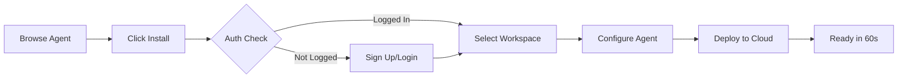
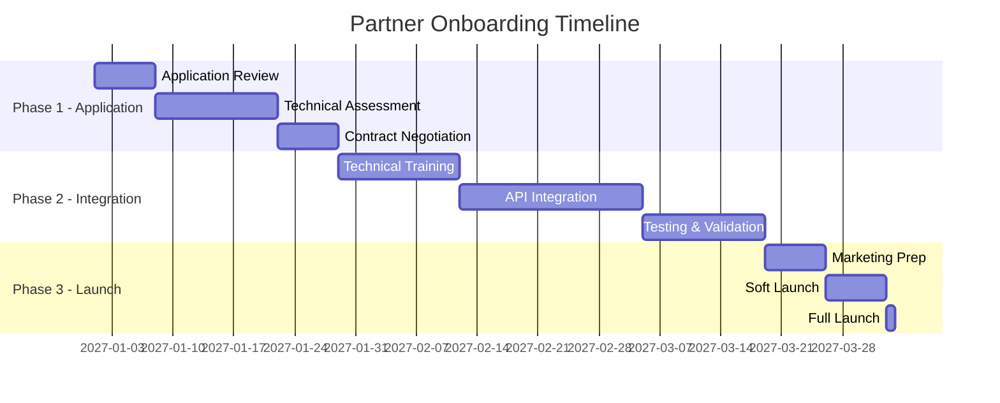
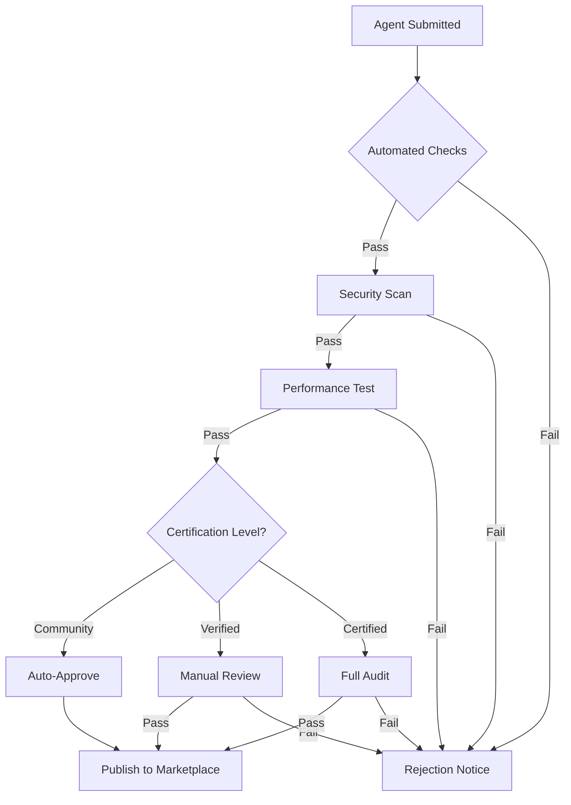

# GreenLang Hub Marketplace & Ecosystem Monetization Strategy (2025-2030)

**Version:** 1.0
**Date:** 2025-11-12
**Product Manager:** GL-ProductManager
**Status:** Strategic Planning Document

---

## Executive Summary

GreenLang Hub will be the world's premier marketplace for sustainability compliance automation agents, modeled after successful platforms like LangChain Hub but specialized for ESG/regulatory tech. By Q3 2026, we'll launch with 100+ pre-built agents, scaling to 5,000+ by 2028, generating $100M ecosystem revenue by 2030 (20% of total revenue).

**Strategic Vision:** "The npm of sustainability compliance - where every regulation has a ready-to-deploy agent"

---

## 1. GreenLang Hub Architecture (Q3 2026 Launch)

### 1.1 Community Hub Features & UX

#### Core Architecture

```
┌─────────────────────────────────────────────┐
│           GreenLang Hub Frontend            │
│         (Next.js + TypeScript + Tailwind)   │
├─────────────────────────────────────────────┤
│              Hub API Gateway                 │
│           (Kong + Rate Limiting)            │
├──────────────┬────────────┬─────────────────┤
│  Agent       │  Community  │    Analytics   │
│  Registry    │  Service    │    Service     │
├──────────────┼────────────┼─────────────────┤
│   MongoDB    │ PostgreSQL  │   ClickHouse   │
│  (Metadata)  │   (Users)   │   (Analytics)  │
├──────────────┴────────────┴─────────────────┤
│         S3 / CDN (Agent Artifacts)          │
└─────────────────────────────────────────────┘
```

#### User Experience Design

**Homepage Layout:**
```
┌─────────────────────────────────────────────┐
│  🌱 GreenLang Hub  [Search...]  [Sign In]   │
├─────────────────────────────────────────────┤
│                                             │
│  Deploy Compliance Agents in < 60 Seconds   │
│                                             │
│  [Browse Agents] [Create Agent] [Docs]      │
│                                             │
├─────────────────────────────────────────────┤
│  Featured Agents                            │
│  ┌──────┐ ┌──────┐ ┌──────┐ ┌──────┐      │
│  │CSRD  │ │CBAM  │ │EUDR  │ │Scope3│      │
│  │Report│ │Calc  │ │Track │ │Carbon│      │
│  └──────┘ └──────┘ └──────┘ └──────┘      │
├─────────────────────────────────────────────┤
│  Categories: Compliance | Carbon | Supply   │
│              Chain | Reporting | Analytics  │
└─────────────────────────────────────────────┘
```

**Agent Detail Page:**
```
┌─────────────────────────────────────────────┐
│  CSRD Reporting Agent v2.1.0                │
│  by GreenLang Official ✓ Certified          │
│  ⭐⭐⭐⭐⭐ 4.8 (1,247 reviews)              │
├─────────────────────────────────────────────┤
│  [Install] [Try Demo] [View Code] [Docs]    │
├─────────────────────────────────────────────┤
│  Overview | Documentation | Reviews | Stats  │
├─────────────────────────────────────────────┤
│  Automates CSRD compliance reporting for    │
│  EU companies. Handles ESRS standards...    │
│                                             │
│  Key Features:                              │
│  ✓ All 12 ESRS standards supported         │
│  ✓ 1,100+ data points automated            │
│  ✓ Multi-language (10 languages)           │
│  ✓ Audit trail & provenance                │
├─────────────────────────────────────────────┤
│  Installation:                              │
│  $ greenlang install csrd-reporting         │
│  or                                         │
│  $ pip install greenlang-csrd               │
└─────────────────────────────────────────────┘
```

### 1.2 Browse & Discovery System

#### Search & Filter Interface

```python
# Search API Specification
GET /api/v1/agents/search
{
  "query": "carbon accounting",
  "filters": {
    "category": ["compliance", "carbon"],
    "certification": ["sap-certified", "oracle-certified"],
    "pricing": "free|premium|enterprise",
    "language": ["python", "typescript"],
    "min_rating": 4.0,
    "sort_by": "downloads|rating|recent|trending"
  },
  "pagination": {
    "page": 1,
    "limit": 20
  }
}
```

#### Discovery Features

1. **AI-Powered Recommendations**
   - Based on user's industry and installed agents
   - "Users who installed X also installed Y"
   - Regulation-based suggestions

2. **Trending Algorithms**
   ```
   Trending Score = (Downloads_7d / Downloads_30d) * Rating * Recency_Factor
   ```

3. **Category Taxonomy**
   ```
   Compliance/
   ├── EU Regulations/
   │   ├── CSRD
   │   ├── CBAM
   │   └── EUDR
   ├── US Regulations/
   │   ├── SEC Climate
   │   └── California SB-253
   └── Global Standards/
       ├── TCFD
       └── GRI

   Carbon Management/
   ├── Scope 1-3 Calculation
   ├── Product Carbon Footprint
   └── Science-Based Targets
   ```

### 1.3 One-Click Installation System

#### Installation Flow



#### Installation Methods

1. **CLI Installation**
   ```bash
   # Global installation
   greenlang install csrd-reporting

   # Project-specific
   greenlang add csrd-reporting --save

   # With configuration
   greenlang install csrd-reporting --config production.yml
   ```

2. **Package Managers**
   ```bash
   # npm
   npm install @greenlang/csrd-reporting

   # pip
   pip install greenlang-csrd-reporting

   # Docker
   docker pull greenlang/csrd-reporting:latest
   ```

3. **Web UI Installation**
   - One-click deploy to GreenLang Cloud
   - Auto-provisioning of resources
   - Environment variable configuration UI
   - Instant HTTPS endpoint

### 1.4 Rating & Review Mechanisms

#### Review System Design

```sql
-- Review Schema
CREATE TABLE reviews (
  id UUID PRIMARY KEY,
  agent_id UUID REFERENCES agents(id),
  user_id UUID REFERENCES users(id),
  rating INTEGER CHECK (rating >= 1 AND rating <= 5),
  title VARCHAR(200),
  comment TEXT,
  version VARCHAR(20),
  verified_purchase BOOLEAN DEFAULT false,
  helpful_count INTEGER DEFAULT 0,
  created_at TIMESTAMP DEFAULT NOW(),
  updated_at TIMESTAMP DEFAULT NOW()
);

-- Review Metrics
CREATE VIEW agent_ratings AS
SELECT
  agent_id,
  AVG(rating) as average_rating,
  COUNT(*) as total_reviews,
  SUM(CASE WHEN rating = 5 THEN 1 ELSE 0 END) as five_star,
  SUM(CASE WHEN rating = 4 THEN 1 ELSE 0 END) as four_star,
  SUM(CASE WHEN rating = 3 THEN 1 ELSE 0 END) as three_star,
  SUM(CASE WHEN rating = 2 THEN 1 ELSE 0 END) as two_star,
  SUM(CASE WHEN rating = 1 THEN 1 ELSE 0 END) as one_star
FROM reviews
GROUP BY agent_id;
```

#### Review Quality Control

1. **Verified Purchase Badge** - Only for users who installed/purchased
2. **Spam Detection** - ML model to detect fake reviews
3. **Helpful Voting** - Community moderation
4. **Developer Response** - Publishers can respond to reviews
5. **Version-Specific Reviews** - Reviews tied to agent versions

### 1.5 Usage Statistics & Analytics

#### Public Analytics Dashboard

```
Agent Analytics Dashboard
━━━━━━━━━━━━━━━━━━━━━━━━━━━━━━━━━━━━━━━━
📊 Downloads        📈 Growth         ⏱️ Response Time
   45,234             +23%               <100ms
   Last 30 days       vs prev month      P95 latency

📍 Geographic Distribution
   🇪🇺 Europe: 45%
   🇺🇸 N. America: 30%
   🇦🇵 Asia: 20%
   🌍 Other: 5%

💼 Industry Usage
   Manufacturing: 35%
   Financial Services: 25%
   Retail: 20%
   Energy: 15%
   Other: 5%

⚡ Performance Metrics
   Success Rate: 99.7%
   Avg Execution: 1.2s
   Error Rate: 0.3%
```

#### Analytics API

```python
GET /api/v1/agents/{agent_id}/analytics
{
  "downloads": {
    "total": 45234,
    "last_30_days": 5421,
    "last_7_days": 1232,
    "by_version": {...},
    "by_country": {...}
  },
  "usage": {
    "active_installations": 3421,
    "api_calls_today": 125000,
    "unique_users": 892
  },
  "performance": {
    "success_rate": 0.997,
    "avg_latency_ms": 98,
    "p95_latency_ms": 245,
    "error_rate": 0.003
  }
}
```

### 1.6 Quality Assurance & Certification

#### Certification Levels

| Level | Requirements | Badge | Benefits |
|-------|-------------|-------|----------|
| **Community** | Basic testing, documentation | 🟢 | Listed in marketplace |
| **Verified** | 80%+ test coverage, security scan | ✓ Verified | Featured placement |
| **Certified** | 95%+ coverage, manual review, SLA | ⭐ Certified | Enterprise ready, premium pricing |
| **Official** | GreenLang team maintained | 🌱 Official | Top placement, bundled deals |

#### Automated Quality Checks

```python
# Quality Score Calculation
def calculate_quality_score(agent):
    score = 0

    # Documentation (30 points)
    if agent.has_readme: score += 10
    if agent.has_api_docs: score += 10
    if agent.has_examples: score += 10

    # Testing (30 points)
    if agent.test_coverage >= 80: score += 15
    if agent.test_coverage >= 95: score += 15

    # Security (20 points)
    if agent.security_scan_passed: score += 10
    if agent.no_critical_vulnerabilities: score += 10

    # Performance (20 points)
    if agent.avg_latency < 100: score += 10
    if agent.success_rate > 0.99: score += 10

    return score
```

### 1.7 Publisher Dashboard

#### Dashboard Features

```
Publisher Dashboard - @greenlang-official
━━━━━━━━━━━━━━━━━━━━━━━━━━━━━━━━━━━━━━━━
📦 Published Agents (12)
┌──────────────────┬──────────┬─────────┬──────────┐
│ Agent Name       │ Downloads│ Revenue │ Status   │
├──────────────────┼──────────┼─────────┼──────────┤
│ CSRD Reporter    │ 12,345   │ $45,234 │ ✅ Active │
│ CBAM Calculator  │ 8,921    │ $31,122 │ ✅ Active │
│ Carbon Tracker   │ 5,234    │ $18,234 │ ⚠️ Update │
└──────────────────┴──────────┴─────────┴──────────┘

💰 Revenue Summary (Last 30 days)
   Total Revenue: $94,590
   After Fees (70%): $66,213
   Pending Payout: $66,213

📊 Performance Metrics
   Avg Rating: 4.7 ⭐
   Total Reviews: 3,421
   Support Tickets: 23 (2 open)
```

#### Publisher Tools

1. **Agent Management**
   - Version control and rollback
   - A/B testing framework
   - Staged rollouts
   - Deprecation notices

2. **Revenue Analytics**
   - Real-time revenue tracking
   - Customer cohort analysis
   - Churn prediction
   - Pricing optimization suggestions

3. **Support Integration**
   - Integrated ticketing system
   - Community forum moderation
   - Direct user messaging
   - FAQ management

### 1.8 API for Programmatic Access

#### REST API Endpoints

```yaml
# OpenAPI 3.0 Specification (excerpt)
paths:
  /api/v1/agents:
    get:
      summary: List all agents
      parameters:
        - name: category
        - name: certification
        - name: limit
        - name: offset
    post:
      summary: Publish new agent
      security:
        - ApiKeyAuth: []

  /api/v1/agents/{id}:
    get:
      summary: Get agent details
    put:
      summary: Update agent
    delete:
      summary: Unpublish agent

  /api/v1/agents/{id}/install:
    post:
      summary: Install agent
      requestBody:
        content:
          application/json:
            schema:
              type: object
              properties:
                workspace_id: string
                config: object

  /api/v1/agents/{id}/reviews:
    get:
      summary: Get agent reviews
    post:
      summary: Submit review
```

#### GraphQL API

```graphql
type Agent {
  id: ID!
  name: String!
  description: String!
  category: Category!
  certification: Certification
  rating: Float
  downloads: Int
  price: Price
  publisher: Publisher!
  versions: [Version!]!
  reviews(limit: Int, offset: Int): [Review!]!
  analytics: Analytics
}

type Query {
  agent(id: ID!): Agent
  agents(
    filter: AgentFilter
    sort: SortOrder
    limit: Int
    offset: Int
  ): [Agent!]!
  searchAgents(query: String!): [Agent!]!
  trendingAgents(period: Period): [Agent!]!
}

type Mutation {
  installAgent(agentId: ID!, config: JSON): Installation!
  publishAgent(input: AgentInput!): Agent!
  reviewAgent(agentId: ID!, rating: Int!, comment: String): Review!
}
```

---

## 2. Marketplace Monetization (Q1 2027)

### 2.1 Premium Agent Store Design

#### Store Tiers

| Tier | Target | Price Range | Features |
|------|--------|-------------|----------|
| **Free** | Developers, POCs | $0 | Basic agents, community support |
| **Pro** | SMBs | $10-100/mo | Advanced features, email support |
| **Enterprise** | Large Corps | $1K-10K/mo | Custom config, SLA, phone support |
| **Custom** | Fortune 500 | $10K+/mo | White-label, dedicated support |

#### Premium Store UI

```
Premium Agent Marketplace
━━━━━━━━━━━━━━━━━━━━━━━━━━━━━━━━━━━━━━━━
🏆 Enterprise-Ready Compliance Agents

┌─────────────────────────────────────────┐
│ CSRD Complete Suite                      │
│ ⭐ Enterprise Certified | By GreenLang   │
│                                          │
│ Complete CSRD compliance automation      │
│ • All 12 ESRS standards                 │
│ • 1,100+ automated data points          │
│ • Multi-entity consolidation            │
│ • Audit-ready documentation             │
│                                          │
│ Pricing:                                │
│ ○ Pro: $499/month (up to 5 entities)   │
│ ● Enterprise: $4,999/month (unlimited)  │
│ ○ Custom: Contact Sales                 │
│                                          │
│ [Start Free Trial] [Book Demo]          │
└─────────────────────────────────────────┘
```

### 2.2 Pricing Models

#### Subscription Tiers

```python
pricing_models = {
    "usage_based": {
        "description": "Pay per API call or execution",
        "example": "$0.001 per calculation",
        "best_for": "Variable workloads"
    },
    "seat_based": {
        "description": "Per user per month",
        "example": "$50/user/month",
        "best_for": "Team collaboration tools"
    },
    "entity_based": {
        "description": "Per legal entity or facility",
        "example": "$100/entity/month",
        "best_for": "Multi-entity corporations"
    },
    "flat_rate": {
        "description": "Unlimited usage",
        "example": "$5,000/month",
        "best_for": "Enterprise deployments"
    },
    "hybrid": {
        "description": "Base fee + usage",
        "example": "$500 base + $0.0005/call",
        "best_for": "Scalable pricing"
    }
}
```

#### Dynamic Pricing Algorithm

```python
def calculate_price(agent, customer):
    base_price = agent.base_price

    # Volume discount
    if customer.monthly_usage > 10000:
        base_price *= 0.8  # 20% discount

    # Enterprise agreement
    if customer.has_enterprise_agreement:
        base_price *= 0.7  # 30% discount

    # Multi-agent bundle
    if customer.agent_count > 5:
        base_price *= 0.85  # 15% discount

    # Annual commitment
    if customer.billing_cycle == "annual":
        base_price *= 0.83  # 2 months free

    return base_price
```

### 2.3 Revenue Sharing Model

#### Standard 70/30 Split

```
Revenue Distribution (Per Transaction)
━━━━━━━━━━━━━━━━━━━━━━━━━━━━━━━━━━━━━
Customer Payment: $1,000
├── Payment Processing (2.9% + $0.30): $29.30
├── GreenLang Platform (30%): $291.21
└── Publisher Payout (70%): $679.49

Publisher Receives: $679.49 (67.9% of gross)
GreenLang Net: $291.21 (29.1% of gross)
```

#### Tiered Revenue Sharing

| Annual Revenue | Publisher Share | GreenLang Share |
|---------------|-----------------|-----------------|
| $0 - $10K | 70% | 30% |
| $10K - $100K | 75% | 25% |
| $100K - $1M | 80% | 20% |
| $1M+ | 85% | 15% |

#### Payout Schedule

```python
payout_schedule = {
    "threshold": 100,  # Minimum $100 for payout
    "frequency": "monthly",  # On the 15th
    "methods": ["ACH", "Wire", "PayPal", "Stripe"],
    "currencies": ["USD", "EUR", "GBP"],
    "tax_handling": "Publisher responsible",
    "invoicing": "Automated monthly statements"
}
```

### 2.4 Enterprise Agreements

#### Enterprise Package Template

```markdown
# GreenLang Enterprise Agreement

**Customer:** [Company Name]
**Term:** 12 months (auto-renew)
**Value:** $500,000 annually

## Included Services

### 1. Unlimited Agent Access
- All premium agents in marketplace
- Unlimited users and API calls
- Priority queue processing

### 2. Custom Development
- 200 hours of custom agent development
- Dedicated solutions architect
- Quarterly business reviews

### 3. Support & Training
- 24/7 phone and email support
- 4-hour SLA for critical issues
- Onsite training (2 sessions/year)
- Dedicated Slack channel

### 4. Compliance & Security
- SOC 2 Type II compliance
- Custom data residency options
- Dedicated infrastructure option
- Annual security audits

### 5. Integration Services
- SAP integration support
- Oracle integration support
- Custom ERP connectors
- API gateway configuration
```

### 2.5 White-Label Options

#### White-Label Tiers

| Feature | Standard | Professional | Enterprise |
|---------|----------|--------------|------------|
| Custom domain | ✅ | ✅ | ✅ |
| Custom branding | ✅ | ✅ | ✅ |
| Remove GreenLang branding | ❌ | ✅ | ✅ |
| Custom auth/SSO | ❌ | ✅ | ✅ |
| Private agent registry | ❌ | ✅ | ✅ |
| Custom SLA | ❌ | ❌ | ✅ |
| Dedicated infrastructure | ❌ | ❌ | ✅ |
| **Price** | $1K/mo | $5K/mo | $20K/mo |

### 2.6 Support Tier Structure

#### Support Matrix

| Tier | Response Time | Channels | Availability | Price |
|------|--------------|----------|--------------|-------|
| **Community** | Best effort | Forum | Business hours | Free |
| **Professional** | 24 hours | Email | Business hours | $99/mo |
| **Business** | 4 hours | Email, Chat | Extended hours | $499/mo |
| **Enterprise** | 1 hour | All + Phone | 24/7 | $2,499/mo |
| **Premium** | 15 minutes | Dedicated CSM | 24/7 | $9,999/mo |

### 2.7 Subscription Management

#### Self-Service Portal

```
Subscription Management Portal
━━━━━━━━━━━━━━━━━━━━━━━━━━━━━━━━━━━━━━━━
📊 Current Plan: Enterprise ($4,999/month)

Active Subscriptions (8)
┌──────────────────┬─────────┬──────────┬─────────┐
│ Agent            │ Tier    │ Users    │ Cost/mo │
├──────────────────┼─────────┼──────────┼─────────┤
│ CSRD Suite       │ Enterpr.│ Unlimited│ $2,499  │
│ CBAM Calculator  │ Pro     │ 50       │ $499    │
│ Carbon Tracker   │ Pro     │ 50       │ $399    │
└──────────────────┴─────────┴──────────┴─────────┘

💳 Payment Method: •••• 4242 (Visa)
📅 Next Billing: January 15, 2027
📈 Usage This Month: 125,432 API calls

[Upgrade Plan] [Add Agents] [Manage Users] [Download Invoice]
```

### 2.8 Payment Processing

#### Payment Infrastructure

```python
payment_config = {
    "providers": {
        "stripe": {
            "regions": ["US", "EU", "UK"],
            "methods": ["card", "ach", "sepa"],
            "fees": "2.9% + $0.30"
        },
        "paypal": {
            "regions": ["Global"],
            "methods": ["paypal", "card"],
            "fees": "3.49% + $0.49"
        },
        "adyen": {
            "regions": ["Enterprise"],
            "methods": ["wire", "invoice"],
            "fees": "Custom"
        }
    },
    "supported_currencies": ["USD", "EUR", "GBP", "JPY", "AUD"],
    "billing_cycles": ["monthly", "quarterly", "annual"],
    "trial_period": 14,  # days
    "refund_policy": 30  # days
}
```

---

## 3. Certified Partner Program

### 3.1 SAP Certified Connector ($50K/year)

#### Certification Requirements

```markdown
# SAP Certification Checklist

## Technical Requirements
- [ ] SAP NetWeaver compatibility
- [ ] RFC/BAPI integration tested
- [ ] S/4HANA Cloud APIs integrated
- [ ] IDoc processing capability
- [ ] Real-time data synchronization
- [ ] Batch processing support
- [ ] Error handling and retry logic
- [ ] Performance: <1s latency for queries

## Business Requirements
- [ ] $50,000 annual certification fee paid
- [ ] SAP PartnerEdge membership
- [ ] Dedicated SAP support engineer
- [ ] Quarterly compatibility testing
- [ ] Customer reference (3 minimum)

## Benefits Received
- "SAP Certified" badge in marketplace
- Co-marketing opportunities
- SAP AppCenter listing
- Joint sales engagements
- SAP events speaking slots
```

### 3.2 Oracle Certified Pack ($50K/year)

#### Oracle Integration Suite

```yaml
oracle_certification:
  technical_requirements:
    - Oracle Cloud Infrastructure (OCI) ready
    - Oracle ERP Cloud APIs integrated
    - Oracle EPM Cloud compatible
    - Oracle Database 19c+ support
    - WebLogic Server integration
    - Performance: 10K transactions/hour

  certification_process:
    - Submit technical documentation
    - Oracle architecture review
    - Performance benchmarking
    - Security audit
    - Customer validation (3 references)

  partner_benefits:
    - Oracle PartnerNetwork (OPN) membership
    - Oracle Cloud Marketplace listing
    - Joint GTM initiatives
    - Oracle OpenWorld speaking opportunity
    - Technical enablement sessions
```

### 3.3 Industry Certification Programs

#### Industry-Specific Certifications ($25K/year each)

| Industry | Certifying Body | Requirements | Benefits |
|----------|----------------|--------------|----------|
| **Manufacturing** | Industry 4.0 Alliance | OPC UA support, MES integration | 500+ manufacturer contacts |
| **Financial Services** | TCFD Consortium | Climate risk models, PCAF aligned | Bank partnerships |
| **Retail** | Retail Sustainability Council | Supply chain tracking, Higg Index | Retailer network access |
| **Energy** | Energy Transition Forum | Grid integration, renewable tracking | Utility partnerships |
| **Chemicals** | Together for Sustainability | TfS assessment integration | Chemical company network |

### 3.4 Compliance Guarantee Program ($100K/year)

#### Program Structure

```markdown
# GreenLang Compliance Guarantee Program

## Coverage
- 100% compliance guarantee for certified agents
- Up to $10M in penalty coverage per customer
- Legal defense costs included
- Regulatory audit support

## Requirements for Partners
- $100K annual program fee
- Quarterly compliance updates
- 99.9% accuracy validation
- Monthly regulatory scanning
- Dedicated compliance officer
- E&O insurance ($5M minimum)

## Customer Benefits
- Zero liability for compliance failures
- Free audit support
- Priority updates for new regulations
- Dedicated compliance hotline
- Quarterly compliance reports
```

### 3.5 Partner Onboarding Process

#### 90-Day Onboarding Timeline



### 3.6 Certification Requirements

#### Technical Certification Matrix

```python
certification_requirements = {
    "code_quality": {
        "test_coverage": 95,  # minimum percentage
        "code_complexity": 10,  # maximum cyclomatic complexity
        "documentation": "OpenAPI 3.0 spec required",
        "linting": "Zero errors, warnings < 10"
    },
    "security": {
        "penetration_test": "Annual required",
        "vulnerability_scan": "Weekly automated",
        "OWASP_top_10": "All addressed",
        "encryption": "TLS 1.3, AES-256"
    },
    "performance": {
        "response_time_p95": 1000,  # milliseconds
        "throughput": 1000,  # requests per second
        "error_rate": 0.001,  # 0.1% maximum
        "uptime": 99.9  # percentage
    },
    "compliance": {
        "gdpr": "Required for EU",
        "sox": "Required for financial",
        "iso_27001": "Recommended",
        "soc2_type2": "Required for enterprise"
    }
}
```

### 3.7 Partner Benefits Package

#### Benefit Tiers

| Benefit | Certified | Gold ($25K) | Platinum ($50K) | Diamond ($100K) |
|---------|-----------|-------------|------------------|------------------|
| Marketplace badge | ✅ | ✅ Gold | ✅ Platinum | ✅ Diamond |
| Revenue share | 70% | 75% | 80% | 85% |
| Marketing fund | - | $5K | $15K | $50K |
| Conference passes | 1 | 3 | 5 | 10 |
| Training credits | $1K | $5K | $10K | $25K |
| Support priority | Standard | High | Critical | Executive |
| Customer referrals | - | ✅ | ✅ Priority | ✅ Exclusive |
| Advisory board seat | - | - | - | ✅ |

---

## 4. Community Building Strategy

### 4.1 GreenLang Champions Program

#### Champion Tiers & Benefits

```markdown
# GreenLang Champions Program (Target: 100 by 2027)

## 🥉 Bronze Champions (60 members)
**Requirements:**
- 1+ published agent
- 10+ forum posts
- 1+ blog post or video

**Benefits:**
- Champion badge
- Conference discount (25%)
- Monthly newsletter mention
- Swag pack

## 🥈 Silver Champions (30 members)
**Requirements:**
- 3+ published agents
- 50+ forum posts
- 5+ content pieces
- 1+ conference talk

**Benefits:**
- All Bronze benefits plus:
- Conference free pass
- Quarterly 1:1 with product team
- Beta access to new features
- $500 cloud credits/month

## 🥇 Gold Champions (10 members)
**Requirements:**
- 10+ published agents
- 200+ forum posts
- 20+ content pieces
- 5+ conference talks
- Mentored 5+ developers

**Benefits:**
- All Silver benefits plus:
- All-expenses-paid to GreenLang Summit
- Advisory board participation
- $2,000 cloud credits/month
- Co-marketing opportunities
- Direct Slack access to founders
```

### 4.2 Developer Relations Programs

#### DevRel Strategy

```python
devrel_programs = {
    "office_hours": {
        "frequency": "Weekly Thursdays 2pm UTC",
        "format": "Zoom webinar",
        "topics": "Agent development, API deep dives",
        "recording": "YouTube published within 24h"
    },
    "bootcamps": {
        "frequency": "Monthly",
        "duration": "2 days",
        "format": "Virtual intensive",
        "certification": "GreenLang Certified Developer",
        "cost": "Free for champions, $299 public"
    },
    "ambassadors": {
        "universities": 50,  # target schools
        "countries": 25,
        "responsibilities": "Campus events, local meetups",
        "compensation": "$500/month + travel budget"
    },
    "content_creators": {
        "youtube_creators": 20,
        "blog_writers": 50,
        "course_instructors": 10,
        "compensation": "$100-1000 per piece"
    }
}
```

### 4.3 Conference Speaking Strategy (50+ talks/year)

#### Conference Calendar 2027

| Quarter | Conferences | Talks | Focus |
|---------|------------|-------|-------|
| **Q1** | Web Summit, SaaStr, KubeCon | 12 | Platform launch, developer tools |
| **Q2** | Google I/O, MS Build, AWS Summit | 15 | Cloud integrations, case studies |
| **Q3** | Climate Week, Sustainability Summit | 13 | Industry solutions, ROI |
| **Q4** | re:Invent, Next.js Conf, PyCon | 10 | Technical deep dives, 2028 preview |

#### Speaking Topics Portfolio

```markdown
## Technical Talks (60%)
- "Building Compliance Agents with GCEL"
- "Zero-Hallucination Architecture for Regulatory Tech"
- "Scaling to 1M Calculations/Second with GreenLang"
- "Event-Driven Sustainability Reporting"

## Business Talks (30%)
- "ROI of Automated Compliance: 10x in 10 Months"
- "CSRD Readiness in 30 Days"
- "Building vs. Buying Compliance Tech"

## Thought Leadership (10%)
- "The Future of Sustainable Business"
- "AI's Role in Climate Action"
```

### 4.4 Meetup Organization Strategy

#### Global Meetup Network (10 cities by 2027)

```yaml
meetup_cities:
  tier_1_cities:  # Established Q1 2027
    - London:
        frequency: Monthly
        venue: Google Campus
        expected_attendance: 100-150
        sponsors: [AWS, Microsoft, Deloitte]
    - Berlin:
        frequency: Monthly
        venue: Factory Berlin
        expected_attendance: 80-120
    - New York:
        frequency: Monthly
        venue: AWS Loft
        expected_attendance: 120-180

  tier_2_cities:  # Launch Q2-Q3 2027
    - Paris:
        frequency: Bi-monthly
        expected_attendance: 60-80
    - Amsterdam:
        frequency: Bi-monthly
        expected_attendance: 50-70
    - San Francisco:
        frequency: Monthly
        expected_attendance: 100-150
    - Singapore:
        frequency: Quarterly
        expected_attendance: 40-60

  tier_3_cities:  # Launch Q4 2027
    - Toronto:
        frequency: Quarterly
        expected_attendance: 40-60
    - Sydney:
        frequency: Quarterly
        expected_attendance: 30-50
    - Tokyo:
        frequency: Quarterly
        expected_attendance: 30-40
```

### 4.5 Online Education Program

#### GreenLang Academy

```markdown
# GreenLang Academy - Course Catalog

## Free Tier
1. **GreenLang Fundamentals** (2 hours)
   - Platform overview
   - First agent deployment
   - Basic GCEL syntax
   - Certificate: GreenLang Certified User

2. **Compliance 101** (3 hours)
   - CSRD, CBAM, EUDR basics
   - Regulatory timelines
   - Industry requirements

## Professional Tier ($99/month)
3. **Advanced Agent Development** (10 hours)
   - Complex GCEL patterns
   - Performance optimization
   - Testing strategies
   - Certificate: GreenLang Certified Developer

4. **Enterprise Integration** (8 hours)
   - SAP/Oracle integration
   - Security best practices
   - High availability patterns

## Enterprise Tier (Custom pricing)
5. **Custom Training Programs**
   - Tailored to organization needs
   - On-site or virtual delivery
   - Hands-on workshops
   - Ongoing support
```

### 4.6 YouTube Channel Strategy

#### Content Calendar

```python
youtube_strategy = {
    "channel_name": "GreenLang",
    "upload_schedule": "Tuesday & Thursday",
    "content_types": {
        "tutorials": "40% - How to build agents",
        "case_studies": "20% - Customer success stories",
        "webinars": "20% - Live coding sessions",
        "updates": "10% - Product announcements",
        "interviews": "10% - Industry experts"
    },
    "target_metrics_2027": {
        "subscribers": 25000,
        "views_per_month": 250000,
        "average_watch_time": "8 minutes",
        "engagement_rate": "7%"
    },
    "monetization": {
        "youtube_ads": False,  # No ads, premium experience
        "sponsorships": True,  # Partner showcases
        "affiliate": True,  # Cloud provider credits
    }
}
```

### 4.7 Hackathons & Competitions

#### Annual Hackathon Series

```markdown
# GreenLang Sustainability Hackathon 2027

## Main Event: October 2027
**Theme:** "Zero Carbon, Infinite Innovation"
**Prize Pool:** $100,000
**Format:** 48-hour virtual + local hubs

### Prizes
🥇 **Grand Prize:** $25,000 + GreenLang Cloud ($50K credits)
🥈 **Runner Up:** $15,000 + GreenLang Cloud ($25K credits)
🥉 **Third Place:** $10,000 + GreenLang Cloud ($10K credits)

### Category Awards ($5,000 each)
- Best CSRD Solution
- Most Innovative Carbon Tracker
- Best Supply Chain Solution
- People's Choice Award
- Best Student Project

### Judging Criteria
- Innovation (30%)
- Technical Implementation (25%)
- Business Impact (25%)
- Sustainability Impact (20%)
```

### 4.8 Developer Grants Program ($1M Fund)

#### Grant Categories

```python
grant_program = {
    "open_source_grants": {
        "budget": 400000,  # $400K
        "grant_size": "5K-25K",
        "criteria": "Open source agents for community",
        "expected_projects": 40
    },
    "research_grants": {
        "budget": 300000,  # $300K
        "grant_size": "10K-50K",
        "criteria": "Academic research using GreenLang",
        "expected_projects": 15
    },
    "startup_grants": {
        "budget": 200000,  # $200K
        "grant_size": "10K-20K",
        "criteria": "Startups building on GreenLang",
        "expected_projects": 15
    },
    "diversity_grants": {
        "budget": 100000,  # $100K
        "grant_size": "2K-10K",
        "criteria": "Underrepresented developers",
        "expected_projects": 25
    }
}
```

---

## 5. Ecosystem Revenue Projections

### 5.1 Revenue Growth Timeline

```python
ecosystem_revenue_projection = {
    "2027": {
        "total_ecosystem_revenue": 5000000,  # $5M
        "percentage_of_total": 10,  # 10% of $50M total
        "breakdown": {
            "marketplace_commissions": 2000000,
            "partner_certifications": 500000,
            "enterprise_agreements": 1500000,
            "white_label": 500000,
            "support_subscriptions": 500000
        }
    },
    "2028": {
        "total_ecosystem_revenue": 20000000,  # $20M
        "percentage_of_total": 13,  # 13% of $150M total
        "breakdown": {
            "marketplace_commissions": 10000000,
            "partner_certifications": 2000000,
            "enterprise_agreements": 5000000,
            "white_label": 2000000,
            "support_subscriptions": 1000000
        }
    },
    "2029": {
        "total_ecosystem_revenue": 50000000,  # $50M
        "percentage_of_total": 17,  # 17% of $300M total
        "breakdown": {
            "marketplace_commissions": 25000000,
            "partner_certifications": 5000000,
            "enterprise_agreements": 12000000,
            "white_label": 5000000,
            "support_subscriptions": 3000000
        }
    },
    "2030": {
        "total_ecosystem_revenue": 100000000,  # $100M
        "percentage_of_total": 20,  # 20% of $500M total
        "breakdown": {
            "marketplace_commissions": 50000000,
            "partner_certifications": 10000000,
            "enterprise_agreements": 25000000,
            "white_label": 10000000,
            "support_subscriptions": 5000000
        }
    }
}
```

### 5.2 Revenue by Category Analysis

#### 2030 Revenue Breakdown

```
Marketplace Commissions (50%)
├── Premium Agents (30%): $15M
├── Enterprise Agents (50%): $25M
├── Transaction Fees (15%): $7.5M
└── API Usage Fees (5%): $2.5M

Partner Certifications (10%)
├── SAP Certified (20%): $2M
├── Oracle Certified (20%): $2M
├── Industry Certified (40%): $4M
└── Compliance Guarantee (20%): $2M

Enterprise Agreements (25%)
├── Fortune 500 (60%): $15M
├── Mid-Market (30%): $7.5M
└── Government (10%): $2.5M

White-Label (10%)
├── Enterprise (70%): $7M
├── Professional (20%): $2M
└── Standard (10%): $1M

Support Subscriptions (5%)
├── Premium Support (60%): $3M
├── Enterprise Support (30%): $1.5M
└── Professional Support (10%): $0.5M
```

### 5.3 Customer Acquisition Costs (CAC)

```python
cac_analysis = {
    "channels": {
        "organic": {
            "cost_per_acquisition": 50,
            "percentage_of_customers": 40,
            "ltv_cac_ratio": 20
        },
        "paid_search": {
            "cost_per_acquisition": 500,
            "percentage_of_customers": 20,
            "ltv_cac_ratio": 3
        },
        "conferences": {
            "cost_per_acquisition": 2000,
            "percentage_of_customers": 15,
            "ltv_cac_ratio": 5
        },
        "partner_referral": {
            "cost_per_acquisition": 200,
            "percentage_of_customers": 15,
            "ltv_cac_ratio": 10
        },
        "direct_sales": {
            "cost_per_acquisition": 10000,
            "percentage_of_customers": 10,
            "ltv_cac_ratio": 4
        }
    },
    "blended_cac": 850,
    "payback_period_months": 6
}
```

### 5.4 Lifetime Value (LTV) Calculations

```python
ltv_by_segment = {
    "free_tier": {
        "monthly_revenue": 0,
        "average_lifetime_months": 6,
        "upgrade_rate": 0.05,
        "ltv": 0  # Value in referrals and community
    },
    "pro_tier": {
        "monthly_revenue": 99,
        "average_lifetime_months": 24,
        "churn_rate": 0.04,  # 4% monthly
        "ltv": 2376
    },
    "enterprise": {
        "monthly_revenue": 5000,
        "average_lifetime_months": 48,
        "churn_rate": 0.01,  # 1% monthly
        "ltv": 240000
    },
    "partner": {
        "monthly_revenue": 4167,  # $50K annual
        "average_lifetime_months": 60,
        "churn_rate": 0.005,  # 0.5% monthly
        "ltv": 250000
    }
}
```

---

## 6. Open Source Strategy

### 6.1 Core Framework (Always Free)

```markdown
# GreenLang Core - Forever Free Components

## Open Source License: Apache 2.0

### Core Components
- GCEL Runtime Engine
- Basic Agent Framework
- Standard Connectors (REST, GraphQL)
- CLI Tools
- Documentation Generator
- Test Framework
- Local Development Server

### Community Features
- GitHub Issues/Discussions
- Community Forum
- Documentation Wiki
- Example Repository
- Starter Templates
- VS Code Extension (Basic)

### Governance Model
- Technical Steering Committee (7 members)
- Quarterly roadmap reviews
- RFC process for major changes
- Community voting on features
- Transparent decision making
```

### 6.2 Commercial Add-ons

```python
commercial_products = {
    "greenlang_cloud": {
        "description": "Managed cloud platform",
        "pricing": "$99-10K/month",
        "features": [
            "Auto-scaling",
            "99.9% SLA",
            "Global CDN",
            "Monitoring & alerting",
            "Backup & disaster recovery"
        ]
    },
    "greenlang_studio": {
        "description": "Visual development environment",
        "pricing": "$49/user/month",
        "features": [
            "Visual agent builder",
            "Debugging tools",
            "Performance profiler",
            "Collaboration features",
            "Git integration"
        ]
    },
    "greenlang_enterprise": {
        "description": "On-premise deployment",
        "pricing": "$100K+/year",
        "features": [
            "Air-gapped installation",
            "LDAP/AD integration",
            "Custom security policies",
            "Dedicated support",
            "Training & certification"
        ]
    }
}
```

### 6.3 GitHub Growth Strategy

#### Tactics for 30K Stars by 2027

```markdown
# GitHub Growth Playbook

## Content Strategy
- Weekly blog posts with code examples
- Monthly "Building X with GreenLang" tutorials
- Showcase community projects
- Regular roadmap updates
- Transparent incident reports

## Community Engagement
- Respond to issues within 24 hours
- "Good first issue" labels for newcomers
- Monthly contributor recognition
- Hacktoberfest participation
- GitHub Sponsors program

## Technical Excellence
- CI/CD with 100% pass rate
- Comprehensive documentation
- Multiple language examples
- Docker images for easy setup
- Reproducible builds

## Marketing Tactics
- Product Hunt launches
- Hacker News submissions
- Reddit r/programming posts
- Twitter developer advocacy
- Dev.to cross-posting
```

---

## 7. Platform Integrations

### 7.1 Package Registry Integrations

```yaml
package_registries:
  npm:
    package_name: "@greenlang/core"
    weekly_downloads_target: 100000
    features:
      - TypeScript definitions
      - Tree-shaking support
      - ESM and CommonJS
      - Auto-generated docs

  pypi:
    package_name: "greenlang"
    weekly_downloads_target: 50000
    features:
      - Type hints
      - Async support
      - Virtual environment friendly
      - Jupyter notebook integration

  docker_hub:
    repository: "greenlang/agents"
    pulls_target: 1000000
    images:
      - greenlang/core
      - greenlang/csrd
      - greenlang/cbam
      - greenlang/studio

  maven_central:
    group_id: "com.greenlang"
    artifact_id: "greenlang-core"
    target_downloads: 10000
```

### 7.2 Cloud Marketplace Presence

```python
cloud_marketplaces = {
    "aws_marketplace": {
        "listing_type": "SaaS",
        "pricing_model": "Usage-based",
        "aws_private_offers": True,
        "expected_revenue": "$5M/year",
        "integration": {
            "aws_lambda": "Native support",
            "aws_ecs": "Container ready",
            "aws_sagemaker": "ML integration",
            "aws_eventbridge": "Event-driven"
        }
    },
    "azure_marketplace": {
        "listing_type": "Managed Application",
        "pricing_model": "Per-seat",
        "azure_private_offers": True,
        "expected_revenue": "$3M/year",
        "integration": {
            "azure_functions": "Native support",
            "azure_aks": "Kubernetes ready",
            "power_platform": "Connector available"
        }
    },
    "google_cloud_marketplace": {
        "listing_type": "Kubernetes Application",
        "pricing_model": "Hybrid",
        "expected_revenue": "$2M/year",
        "integration": {
            "cloud_run": "Serverless ready",
            "gke": "Anthos compatible",
            "bigquery": "Direct connector"
        }
    }
}
```

---

## 8. Developer Tools and SDKs

### 8.1 SDK Strategy by Language

```python
sdk_roadmap = {
    "python": {
        "status": "GA",
        "version": "2.0.0",
        "features": [
            "Async/await support",
            "Type hints",
            "Pandas integration",
            "Jupyter widgets",
            "FastAPI integration"
        ],
        "package_managers": ["pip", "conda", "poetry"]
    },
    "typescript": {
        "status": "GA",
        "version": "2.0.0",
        "features": [
            "Full TypeScript support",
            "React hooks",
            "Next.js integration",
            "Node.js and Deno",
            "WebAssembly support"
        ],
        "package_managers": ["npm", "yarn", "pnpm"]
    },
    "go": {
        "status": "Beta",
        "version": "1.0.0-beta",
        "features": [
            "Native performance",
            "Goroutine support",
            "gRPC integration",
            "Kubernetes operators"
        ],
        "package_managers": ["go mod"]
    },
    "java": {
        "status": "Beta",
        "version": "1.0.0-beta",
        "features": [
            "Spring Boot integration",
            "Maven/Gradle support",
            "Reactive streams",
            "GraalVM native image"
        ],
        "package_managers": ["maven", "gradle"]
    },
    "rust": {
        "status": "Alpha",
        "version": "0.1.0",
        "features": [
            "Zero-cost abstractions",
            "WASM compilation",
            "Async runtime",
            "Memory safety"
        ],
        "package_managers": ["cargo"]
    }
}
```

### 8.2 IDE Extensions

```markdown
# IDE Extension Strategy

## VS Code Extension (Primary)
**Features:**
- Syntax highlighting for GCEL
- IntelliSense/autocomplete
- Integrated debugger
- Agent testing panel
- Marketplace browser
- One-click deployment
- Performance profiler
- Git integration

**Metrics Target:**
- 50,000 installs by 2027
- 4.5+ star rating
- Monthly active users: 30,000

## JetBrains Plugin Suite
**Supported IDEs:**
- IntelliJ IDEA
- PyCharm
- WebStorm
- GoLand

**Features:**
- Full GCEL support
- Refactoring tools
- Code generation
- Database integration
- Remote development

## Other IDEs
- Sublime Text (syntax package)
- Atom (community maintained)
- Vim/Neovim (LSP support)
- Emacs (major mode)
```

### 8.3 CI/CD Integrations

```yaml
cicd_integrations:
  github_actions:
    marketplace_actions:
      - greenlang/setup-action
      - greenlang/test-action
      - greenlang/deploy-action
    features:
      - Matrix testing
      - Secrets management
      - Artifact caching
      - Deployment environments

  gitlab_ci:
    templates:
      - GreenLang-Test.gitlab-ci.yml
      - GreenLang-Deploy.gitlab-ci.yml
    features:
      - Pipeline templates
      - Container registry
      - Environment management

  jenkins:
    plugins:
      - greenlang-plugin
      - greenlang-pipeline
    features:
      - Pipeline as code
      - Blue-green deployment
      - Credential management

  circleci:
    orbs:
      - greenlang/greenlang-orb
    features:
      - Parallel testing
      - Docker layer caching
      - Workspaces
```

---

## 9. Quality Standards for Marketplace

### 9.1 Automated Testing Requirements

```python
testing_requirements = {
    "coverage_thresholds": {
        "community": 60,  # Minimum for listing
        "verified": 80,   # Verified badge
        "certified": 95   # Enterprise certified
    },
    "test_types_required": {
        "unit_tests": True,
        "integration_tests": True,
        "e2e_tests": "Certified only",
        "performance_tests": "Certified only",
        "security_tests": True
    },
    "continuous_testing": {
        "on_every_commit": True,
        "nightly_regression": True,
        "weekly_security_scan": True,
        "monthly_performance": True
    },
    "test_infrastructure": {
        "provided_by_greenlang": [
            "Test runners",
            "Mock services",
            "Test data sets",
            "CI/CD pipelines"
        ]
    }
}
```

### 9.2 Security Standards

```markdown
# Security Requirements for Marketplace Agents

## Mandatory Security Scans
1. **Static Analysis (SAST)**
   - Tool: Snyk, SonarQube
   - Frequency: Every commit
   - Threshold: Zero critical, <5 high

2. **Dependency Scanning**
   - Tool: Dependabot, OWASP
   - Frequency: Daily
   - Action: Auto-PR for patches

3. **Container Scanning**
   - Tool: Trivy, Clair
   - Frequency: On build
   - Threshold: Zero critical CVEs

4. **Dynamic Analysis (DAST)**
   - Tool: OWASP ZAP
   - Frequency: Weekly
   - Coverage: All API endpoints

## Security Checklist
- [ ] No hardcoded credentials
- [ ] Input validation on all endpoints
- [ ] Rate limiting implemented
- [ ] HTTPS only communication
- [ ] Secure token storage
- [ ] Audit logging enabled
- [ ] GDPR compliance
- [ ] Encryption at rest and in transit
```

### 9.3 Performance Benchmarks

```python
performance_standards = {
    "response_times": {
        "p50": 100,   # milliseconds
        "p95": 500,
        "p99": 1000,
        "max": 5000
    },
    "throughput": {
        "minimum_rps": 100,  # requests per second
        "target_rps": 1000,
        "burst_capability": 5000
    },
    "resource_limits": {
        "memory": "512MB default, 2GB max",
        "cpu": "0.5 vCPU default, 2 vCPU max",
        "disk": "1GB default, 10GB max",
        "network": "10 Mbps default, 100 Mbps max"
    },
    "scalability": {
        "horizontal": "Auto-scale 1-100 instances",
        "vertical": "Manual scale to 8GB/4vCPU",
        "geo_distribution": "3+ regions supported"
    }
}
```

### 9.4 Documentation Standards

```markdown
# Documentation Requirements

## Required Documentation

### 1. README.md (Mandatory)
- Overview and purpose
- Quick start guide
- Installation instructions
- Basic usage examples
- License information
- Support contacts

### 2. API Documentation (Mandatory)
- OpenAPI 3.0 specification
- All endpoints documented
- Request/response examples
- Error codes and handling
- Rate limits
- Authentication guide

### 3. User Guide (Verified+)
- Detailed feature documentation
- Step-by-step tutorials
- Configuration options
- Troubleshooting guide
- FAQ section
- Video tutorials (Certified)

### 4. Developer Guide (Certified)
- Architecture overview
- Extension points
- API client examples
- Webhook integration
- Custom deployment
- Performance tuning

## Documentation Quality Metrics
- Readability score: >60 (Flesch)
- Code sample coverage: >80%
- Multi-language examples: 3+ languages
- Update frequency: Monthly minimum
```

### 9.5 Review Process



---

## 10. Success Metrics and KPIs

### 10.1 Community Metrics

```python
community_kpis = {
    "2027_targets": {
        "github_stars": 30000,
        "contributors": 500,
        "discord_members": 10000,
        "forum_users": 25000,
        "newsletter_subscribers": 50000,
        "youtube_subscribers": 25000
    },
    "2028_targets": {
        "github_stars": 75000,
        "contributors": 1500,
        "discord_members": 30000,
        "forum_users": 75000,
        "newsletter_subscribers": 150000,
        "youtube_subscribers": 75000
    },
    "2030_targets": {
        "github_stars": 200000,
        "contributors": 5000,
        "discord_members": 100000,
        "forum_users": 250000,
        "newsletter_subscribers": 500000,
        "youtube_subscribers": 250000
    }
}
```

### 10.2 Marketplace Metrics

```python
marketplace_kpis = {
    "agents": {
        "total_published": {
            "2027": 1000,
            "2028": 5000,
            "2030": 20000
        },
        "certified_agents": {
            "2027": 50,
            "2028": 250,
            "2030": 1000
        }
    },
    "publishers": {
        "active_publishers": {
            "2027": 100,
            "2028": 500,
            "2030": 2000
        },
        "earning_over_100k": {
            "2027": 5,
            "2028": 25,
            "2030": 100
        }
    },
    "usage": {
        "monthly_installs": {
            "2027": 100000,
            "2028": 1000000,
            "2030": 10000000
        },
        "api_calls_per_day": {
            "2027": 10000000,
            "2028": 100000000,
            "2030": 1000000000
        }
    }
}
```

### 10.3 Business Metrics

```python
business_metrics = {
    "revenue": {
        "mrr": {  # Monthly Recurring Revenue
            "2027": 417000,  # $5M / 12
            "2028": 1667000,  # $20M / 12
            "2030": 8333000   # $100M / 12
        },
        "arr": {  # Annual Recurring Revenue
            "2027": 5000000,
            "2028": 20000000,
            "2030": 100000000
        },
        "average_revenue_per_user": {
            "2027": 500,
            "2028": 750,
            "2030": 1000
        }
    },
    "customers": {
        "total_customers": {
            "2027": 10000,
            "2028": 26667,
            "2030": 100000
        },
        "enterprise_customers": {
            "2027": 100,
            "2028": 500,
            "2030": 2500
        },
        "churn_rate_monthly": {
            "2027": 0.03,  # 3%
            "2028": 0.02,  # 2%
            "2030": 0.01   # 1%
        }
    },
    "efficiency": {
        "ltv_cac_ratio": {
            "2027": 3.0,
            "2028": 4.5,
            "2030": 6.0
        },
        "gross_margin": {
            "2027": 0.70,  # 70%
            "2028": 0.75,  # 75%
            "2030": 0.80   # 80%
        }
    }
}
```

---

## 11. Go-to-Market Timeline

### Q1 2026: Foundation
- Finalize marketplace architecture
- Begin partner recruitment
- Launch developer preview program
- Start building agent inventory

### Q2 2026: Alpha Launch
- Private alpha with 50 developers
- Core SDK releases (Python, TypeScript)
- Basic marketplace UI
- Initial documentation

### Q3 2026: Beta Launch
- Public beta launch
- 100+ agents available
- Payment processing live
- Partner program launch

### Q4 2026: GA Preparation
- Security audits complete
- Performance optimization
- Enterprise features ready
- Marketing campaign prep

### Q1 2027: General Availability
- **Official marketplace launch**
- 500+ agents available
- 10+ certified partners
- Global marketing push

### 2027-2030: Scale
- Continuous feature releases
- Geographic expansion
- Industry vertical focus
- Ecosystem growth

---

## 12. Risk Mitigation Strategies

### Technical Risks

| Risk | Impact | Likelihood | Mitigation |
|------|--------|------------|------------|
| Platform scalability issues | High | Medium | Kubernetes auto-scaling, CDN, caching |
| Security breach | Critical | Low | SOC2, penetration testing, bug bounty |
| Agent quality problems | High | Medium | Automated testing, manual review, ratings |
| Integration failures | Medium | Medium | Comprehensive testing, rollback capability |

### Business Risks

| Risk | Impact | Likelihood | Mitigation |
|------|--------|------------|------------|
| Low publisher adoption | High | Medium | Generous rev share, marketing support, grants |
| Competitor platform | High | Medium | First-mover advantage, exclusive partnerships |
| Regulatory changes | Medium | Low | Modular architecture, rapid response team |
| Economic downturn | High | Low | Diverse revenue streams, essential compliance |

### Legal Risks

| Risk | Impact | Likelihood | Mitigation |
|------|--------|------------|------------|
| IP infringement claims | High | Low | Code scanning, legal review, insurance |
| Data privacy violations | Critical | Low | GDPR compliance, data minimization |
| Contract disputes | Medium | Medium | Clear terms, arbitration clause |
| Export control issues | Medium | Low | Geo-blocking, compliance checking |

---

## 13. International Expansion Strategy

### Geographic Rollout

```python
expansion_timeline = {
    "2026": {
        "regions": ["US", "UK", "Germany"],
        "languages": ["English", "German"],
        "currencies": ["USD", "EUR", "GBP"],
        "regulations": ["CSRD", "SEC"]
    },
    "2027": {
        "regions": ["France", "Netherlands", "Canada", "Australia"],
        "languages": ["French", "Dutch"],
        "currencies": ["CAD", "AUD"],
        "regulations": ["Canadian ESG", "Australian Climate"]
    },
    "2028": {
        "regions": ["Japan", "Singapore", "Brazil", "Mexico"],
        "languages": ["Japanese", "Portuguese", "Spanish"],
        "currencies": ["JPY", "SGD", "BRL", "MXN"],
        "regulations": ["TCFD", "Singapore Green Plan"]
    },
    "2029-2030": {
        "regions": ["India", "China", "Middle East", "Africa"],
        "languages": ["Hindi", "Mandarin", "Arabic"],
        "currencies": ["INR", "CNY", "AED", "ZAR"],
        "regulations": ["Local sustainability requirements"]
    }
}
```

### Localization Strategy

1. **Language Support**
   - UI translation: Professional service
   - Documentation: Native speakers
   - Support: Regional teams
   - Marketing: Local agencies

2. **Payment Methods**
   - Local payment providers
   - Regional banking partners
   - Cryptocurrency options
   - Invoice/PO for enterprise

3. **Compliance**
   - Data residency requirements
   - Local tax compliance
   - Export control adherence
   - Regional certifications

4. **Partnerships**
   - Local system integrators
   - Regional cloud providers
   - Government relationships
   - Industry associations

---

## 14. Budget Allocation

### 5-Year Budget Plan ($50M Total)

```python
budget_allocation = {
    "engineering": {
        "amount": 20000000,  # $20M (40%)
        "breakdown": {
            "platform_development": 10000000,
            "sdk_development": 5000000,
            "infrastructure": 3000000,
            "security": 2000000
        }
    },
    "marketing": {
        "amount": 15000000,  # $15M (30%)
        "breakdown": {
            "digital_marketing": 5000000,
            "conferences": 3000000,
            "content_creation": 2000000,
            "partner_marketing": 2000000,
            "pr_agency": 3000000
        }
    },
    "sales": {
        "amount": 8000000,  # $8M (16%)
        "breakdown": {
            "sales_team": 5000000,
            "commissions": 2000000,
            "tools_and_training": 1000000
        }
    },
    "operations": {
        "amount": 5000000,  # $5M (10%)
        "breakdown": {
            "cloud_infrastructure": 2000000,
            "legal_compliance": 1000000,
            "office_admin": 1000000,
            "insurance": 1000000
        }
    },
    "community": {
        "amount": 2000000,  # $2M (4%)
        "breakdown": {
            "developer_grants": 1000000,
            "hackathons": 500000,
            "community_events": 500000
        }
    }
}
```

---

## Conclusion

This comprehensive GreenLang Hub marketplace strategy positions us to build a thriving ecosystem generating $100M in revenue by 2030. By following the proven LangChain Hub model while focusing on our sustainability compliance niche, we'll create the definitive platform for regulatory automation agents.

**Key Success Factors:**
1. **Developer-First Approach** - Easy to use, well-documented, great DX
2. **Quality Over Quantity** - Curated, certified agents only
3. **Strong Partnerships** - SAP, Oracle, and industry leaders
4. **Community Building** - 100K developers by 2028
5. **Revenue Diversity** - Multiple monetization streams
6. **Global Reach** - 10+ languages, 20+ countries

**Next Steps:**
1. Approve budget allocation
2. Recruit marketplace team (Q1 2026)
3. Begin technical architecture (Q1 2026)
4. Launch partner recruitment (Q2 2026)
5. Start developer preview (Q2 2026)

---

**Document Control:**
- Version: 1.0
- Last Updated: 2025-11-12
- Author: GL-ProductManager
- Review Cycle: Quarterly
- Next Review: Q1 2026