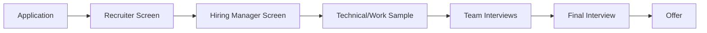

# GreenLang Hub Team Organization Structure (2025-2030)

**Version:** 1.0
**Date:** 2025-11-12
**Product Manager:** GL-ProductManager
**Status:** Organizational Planning Document

---

## Executive Summary

This document outlines the comprehensive team structure required to build, launch, and scale the GreenLang Hub marketplace from Q1 2026 through 2030, growing from 15 initial team members to 150+ by 2030.

---

## 1. Organizational Chart Overview

```
                    GreenLang Hub Division
                    (VP, Marketplace & Ecosystem)
                              |
        ┌────────────┬────────┴────────┬────────────┐
        │            │                 │            │
  Engineering    Product         Marketing      Operations
   (40-60%)     (15-20%)        (20-25%)        (10-15%)
```

---

## 2. Phase 1: Foundation Team (Q1-Q2 2026) - 15 People

### 2.1 Leadership (3 People)

#### VP, Marketplace & Ecosystem
**Reports to:** Chief Product Officer
**Compensation:** $250K-350K + equity
**Responsibilities:**
- Overall marketplace strategy and P&L
- Partner relationship management
- Board presentations
- Fundraising support
- Team building and culture

#### Director of Engineering, Marketplace
**Reports to:** VP Marketplace
**Compensation:** $200K-275K + equity
**Responsibilities:**
- Technical architecture and roadmap
- Engineering team management
- Technology vendor relationships
- Infrastructure planning
- Budget management

#### Head of Developer Relations
**Reports to:** VP Marketplace
**Compensation:** $175K-225K + equity
**Responsibilities:**
- Developer community strategy
- Content and education programs
- Conference and event strategy
- Partner enablement
- Community metrics

### 2.2 Engineering Team (7 People)

#### Senior Backend Engineer (2)
**Reports to:** Director of Engineering
**Compensation:** $150K-200K + equity
**Responsibilities:**
- Marketplace platform development
- API design and implementation
- Database architecture
- Performance optimization
- Code reviews

**Tech Stack:**
- Python (FastAPI)
- Node.js (TypeScript)
- PostgreSQL, MongoDB
- Redis, RabbitMQ
- Kubernetes, Docker

#### Senior Frontend Engineer (2)
**Reports to:** Director of Engineering
**Compensation:** $140K-190K + equity
**Responsibilities:**
- Marketplace UI development
- Agent discovery and search
- Dashboard development
- Mobile responsiveness
- Performance optimization

**Tech Stack:**
- React, Next.js
- TypeScript
- Tailwind CSS
- GraphQL
- Vercel, Cloudflare

#### DevOps/SRE Engineer (1)
**Reports to:** Director of Engineering
**Compensation:** $160K-210K + equity
**Responsibilities:**
- Infrastructure as code
- CI/CD pipeline management
- Monitoring and alerting
- Incident response
- Security hardening

**Tech Stack:**
- Kubernetes, Helm
- Terraform, Ansible
- GitHub Actions
- Prometheus, Grafana
- AWS/GCP/Azure

#### Security Engineer (1)
**Reports to:** Director of Engineering
**Compensation:** $160K-220K + equity
**Responsibilities:**
- Security architecture
- Vulnerability scanning
- Penetration testing
- Compliance (SOC 2, GDPR)
- Security training

**Tech Stack:**
- Snyk, SonarQube
- OWASP tools
- AWS Security Hub
- Vault, Secrets Manager

#### QA Engineer (1)
**Reports to:** Director of Engineering
**Compensation:** $120K-160K + equity
**Responsibilities:**
- Test automation
- Quality assurance processes
- Performance testing
- Regression testing
- Bug triage

**Tech Stack:**
- Pytest, Jest
- Selenium, Cypress
- k6, JMeter
- Postman, REST Assured

### 2.3 Product Team (2 People)

#### Senior Product Manager, Marketplace
**Reports to:** VP Marketplace
**Compensation:** $160K-210K + equity
**Responsibilities:**
- Product roadmap and requirements
- User research and interviews
- Feature prioritization
- Go-to-market planning
- Metrics and analytics

**Skills:**
- B2B marketplace experience
- Developer tools background
- Data-driven decision making
- Technical fluency
- Stakeholder management

#### Product Designer
**Reports to:** Senior Product Manager
**Compensation:** $130K-180K + equity
**Responsibilities:**
- UI/UX design
- User research
- Wireframing and prototyping
- Design system maintenance
- Usability testing

**Tools:**
- Figma
- Adobe Creative Suite
- Sketch
- InVision
- UserTesting

### 2.4 Developer Relations (2 People)

#### Developer Advocate (2)
**Reports to:** Head of DevRel
**Compensation:** $120K-170K + equity
**Responsibilities:**
- Content creation (blogs, videos, tutorials)
- Conference speaking
- Community support
- SDK documentation
- Sample application development

**Background:**
- Software engineering experience
- Public speaking skills
- Technical writing ability
- Community management
- Social media presence

### 2.5 Operations (1 Person)

#### Marketplace Operations Manager
**Reports to:** VP Marketplace
**Compensation:** $110K-150K + equity
**Responsibilities:**
- Publisher onboarding
- Partner support
- Payment processing
- Compliance monitoring
- Data analysis

---

## 3. Phase 2: Growth Team (Q3 2026-Q4 2027) - 50 People

### 3.1 Engineering Expansion (+20 People = 27 Total)

#### Platform Team (8 People)
- **Engineering Manager, Platform:** $180K-240K
- **Senior Backend Engineers (3):** $150K-200K each
- **Backend Engineers (3):** $120K-170K each
- **Data Engineer:** $140K-190K

**Focus:**
- Scalability improvements
- Multi-region deployment
- API v2 development
- Analytics infrastructure

#### SDK & Integrations Team (6 People)
- **Engineering Manager, SDKs:** $180K-240K
- **Senior SDK Engineers (2):** $150K-200K each
- **SDK Engineers (2):** $120K-170K each
- **Integration Engineer:** $130K-180K

**Focus:**
- Python, TypeScript, Go, Java SDKs
- ERP integrations (SAP, Oracle)
- Cloud marketplace integrations
- CI/CD integrations

#### Infrastructure Team (4 People)
- **SRE Team Lead:** $180K-230K
- **Senior SRE Engineers (2):** $160K-210K each
- **Cloud Cost Engineer:** $130K-180K

**Focus:**
- Global infrastructure
- Cost optimization
- Performance tuning
- Disaster recovery

#### Security & Compliance Team (2 People)
- **Senior Security Engineer:** $170K-230K
- **Compliance Engineer:** $130K-180K

**Focus:**
- SOC 2 Type II
- ISO 27001
- Penetration testing
- Compliance automation

### 3.2 Product Expansion (+5 People = 7 Total)

#### Product Managers (3)
- **PM, Publisher Experience:** $150K-200K
- **PM, Customer Experience:** $150K-200K
- **PM, Certifications:** $140K-190K

#### Design Team (2)
- **Senior Product Designer:** $150K-200K
- **Product Designer:** $120K-170K

### 3.3 Developer Relations (+6 People = 8 Total)

#### Team Structure
- **Developer Relations Manager:** $160K-210K
- **Senior Developer Advocates (2):** $140K-190K each
- **Developer Advocates (2):** $110K-160K each
- **Technical Writer:** $100K-140K

### 3.4 Marketing (+10 People = 10 Total)

#### Leadership
- **Head of Marketing, Marketplace:** $180K-240K + equity

#### Content & Community (4 People)
- **Content Marketing Manager:** $120K-170K
- **Community Manager:** $90K-130K
- **Video Producer:** $80K-120K
- **Social Media Manager:** $70K-110K

#### Demand Generation (3 People)
- **Demand Gen Manager:** $130K-180K
- **Digital Marketing Manager:** $100K-150K
- **SEO/Content Specialist:** $80K-120K

#### Partner Marketing (2 People)
- **Partner Marketing Manager:** $120K-170K
- **Event Marketing Manager:** $100K-150K

### 3.5 Sales (+5 People = 5 Total)

#### Team Structure
- **Head of Sales, Marketplace:** $180K-250K + commission
- **Enterprise Account Executives (2):** $120K-180K + commission
- **Sales Engineers (2):** $130K-180K + bonus

### 3.6 Operations (+4 People = 5 Total)

#### Team Structure
- **Director of Operations:** $160K-210K
- **Publisher Success Managers (2):** $90K-130K each
- **Data Analyst:** $100K-140K

---

## 4. Phase 3: Scale Team (2028-2030) - 150 People

### 4.1 Engineering (60 People)

#### Platform Engineering (20)
- 2 Engineering Managers
- 4 Senior Staff Engineers
- 10 Senior Engineers
- 4 Engineers

#### SDK & Integrations (15)
- 1 Engineering Manager
- 2 Senior Staff Engineers
- 8 Senior Engineers
- 4 Engineers

#### Infrastructure & SRE (12)
- 1 Director of Infrastructure
- 2 SRE Managers
- 6 Senior SRE Engineers
- 3 SRE Engineers

#### Security & Compliance (8)
- 1 Head of Security
- 2 Senior Security Engineers
- 2 Security Engineers
- 2 Compliance Engineers
- 1 Security Operations

#### Data & Analytics (5)
- 1 Data Engineering Manager
- 2 Senior Data Engineers
- 2 Data Scientists

### 4.2 Product (25 People)

#### Product Management (12)
- 1 VP of Product
- 3 Senior Product Managers
- 8 Product Managers

#### Design (8)
- 1 Design Manager
- 2 Senior Product Designers
- 3 Product Designers
- 2 UX Researchers

#### Product Analytics (5)
- 1 Product Analytics Manager
- 4 Product Analysts

### 4.3 Developer Relations (20 People)

#### Team Structure
- 1 Director of Developer Relations
- 2 Developer Relations Managers
- 10 Developer Advocates (global)
- 4 Technical Writers
- 3 Community Managers

### 4.4 Marketing (25 People)

#### Leadership
- 1 VP of Marketing

#### Content & Brand (8)
- 1 Content Director
- 3 Content Marketers
- 2 Video Producers
- 2 Graphic Designers

#### Demand Generation (8)
- 1 Demand Gen Director
- 2 Digital Marketing Managers
- 2 SEO Specialists
- 2 Growth Marketers
- 1 Marketing Ops

#### Partner & Events (5)
- 1 Partner Marketing Director
- 2 Partner Marketing Managers
- 2 Event Marketing Managers

#### Communications (4)
- 1 PR Manager
- 2 Communications Managers
- 1 Analyst Relations

### 4.5 Sales (30 People)

#### Leadership
- 1 VP of Sales
- 3 Regional Sales Directors

#### Enterprise Sales (15)
- 15 Account Executives (global)

#### Sales Engineering (8)
- 1 SE Manager
- 7 Sales Engineers

#### Sales Operations (3)
- 1 Sales Ops Manager
- 2 Sales Ops Analysts

### 4.6 Customer Success (15 People)

#### Team Structure
- 1 Director of Customer Success
- 2 Customer Success Managers (Enterprise)
- 8 Publisher Success Managers
- 4 Technical Support Engineers

### 4.7 Operations & Finance (10 People)

#### Team Structure
- 1 Director of Business Operations
- 2 Business Analysts
- 2 Financial Analysts
- 2 Legal/Compliance
- 3 Operations Coordinators

---

## 5. Hiring Timeline by Quarter

```python
hiring_timeline = {
    "2026_Q1": {
        "total_headcount": 10,
        "new_hires": 10,
        "priority_roles": [
            "VP Marketplace",
            "Director of Engineering",
            "Senior Backend Engineers (2)",
            "Senior Frontend Engineers (2)",
            "DevOps Engineer",
            "Product Manager",
            "Developer Advocates (2)"
        ]
    },
    "2026_Q2": {
        "total_headcount": 15,
        "new_hires": 5,
        "priority_roles": [
            "Head of DevRel",
            "Security Engineer",
            "QA Engineer",
            "Product Designer",
            "Operations Manager"
        ]
    },
    "2026_Q3": {
        "total_headcount": 22,
        "new_hires": 7,
        "priority_roles": [
            "Engineering Manager (Platform)",
            "Backend Engineers (3)",
            "Senior Product Designer",
            "PM (Publisher Experience)",
            "DevRel Manager"
        ]
    },
    "2026_Q4": {
        "total_headcount": 30,
        "new_hires": 8,
        "priority_roles": [
            "Head of Marketing",
            "Content Manager",
            "Community Manager",
            "Data Engineer",
            "Senior SRE",
            "SDK Engineers (2)",
            "Technical Writer"
        ]
    },
    "2027_Q1": {
        "total_headcount": 40,
        "new_hires": 10,
        "priority_roles": [
            "Head of Sales",
            "AEs (2)",
            "Sales Engineers (2)",
            "Partner Marketing Manager",
            "Senior Security Engineer",
            "Integration Engineer",
            "Developer Advocates (2)"
        ]
    },
    "2027_Q2": {
        "total_headcount": 50,
        "new_hires": 10,
        "priority_roles": [
            "Director of Operations",
            "Publisher Success (2)",
            "Demand Gen Manager",
            "SDK Engineers (2)",
            "Backend Engineers (2)",
            "Video Producer",
            "Social Media Manager"
        ]
    },
    "2028": {
        "total_headcount": 80,
        "new_hires": 30,
        "focus": "International expansion, enterprise sales"
    },
    "2029": {
        "total_headcount": 115,
        "new_hires": 35,
        "focus": "Product diversification, vertical teams"
    },
    "2030": {
        "total_headcount": 150,
        "new_hires": 35,
        "focus": "Scale operations, automation"
    }
}
```

---

## 6. Compensation Philosophy

### 6.1 Salary Bands by Level

```python
compensation_bands = {
    "IC1_Junior": {
        "salary_range": "80K-110K",
        "equity": "0.01-0.05%",
        "years_experience": "0-2"
    },
    "IC2_Mid_Level": {
        "salary_range": "110K-150K",
        "equity": "0.05-0.10%",
        "years_experience": "2-5"
    },
    "IC3_Senior": {
        "salary_range": "150K-200K",
        "equity": "0.10-0.25%",
        "years_experience": "5-8"
    },
    "IC4_Staff": {
        "salary_range": "200K-250K",
        "equity": "0.25-0.50%",
        "years_experience": "8-12"
    },
    "IC5_Senior_Staff": {
        "salary_range": "250K-320K",
        "equity": "0.50-1.00%",
        "years_experience": "12+"
    },
    "M1_Manager": {
        "salary_range": "160K-210K",
        "equity": "0.20-0.40%",
        "years_experience": "6-10"
    },
    "M2_Senior_Manager": {
        "salary_range": "200K-260K",
        "equity": "0.40-0.75%",
        "years_experience": "10-15"
    },
    "M3_Director": {
        "salary_range": "240K-320K",
        "equity": "0.75-1.50%",
        "years_experience": "12-18"
    },
    "M4_VP": {
        "salary_range": "300K-450K",
        "equity": "1.50-3.00%",
        "years_experience": "15+"
    }
}
```

### 6.2 Geographic Adjustments

```python
geo_multipliers = {
    "san_francisco": 1.00,  # Base
    "new_york": 0.95,
    "seattle": 0.90,
    "austin": 0.85,
    "denver": 0.80,
    "remote_us": 0.75,
    "london": 0.90,
    "berlin": 0.75,
    "bangalore": 0.40,
    "warsaw": 0.50
}
```

### 6.3 Benefits Package

```markdown
# GreenLang Hub Benefits

## Health & Wellness
- Medical, dental, vision (100% premium for employee)
- Mental health support (Modern Health, Headspace)
- $1,000 annual wellness stipend
- Life insurance (2x salary)

## Financial
- 401(k) with 4% match
- Equity compensation (4-year vest, 1-year cliff)
- Annual bonus (10-20% target, role dependent)
- Employee stock purchase plan (15% discount)

## Time Off
- Unlimited PTO (minimum 20 days encouraged)
- 12 paid holidays
- Parental leave (16 weeks primary, 8 weeks secondary)
- Sabbatical (4 weeks after 5 years)

## Professional Development
- $3,000 annual learning budget
- Conference attendance (2 per year)
- Professional certification reimbursement
- Internal training programs

## Work Environment
- Remote-first with office access
- $2,000 home office stipend
- Co-working space membership
- Latest equipment (MacBook Pro, monitor, etc.)

## Perks
- Internet reimbursement ($100/month)
- Phone reimbursement ($75/month)
- Commuter benefits
- Team offsites (quarterly)
- Employee referral bonus ($5K-10K)
```

---

## 7. Recruiting Strategy

### 7.1 Sourcing Channels

```python
sourcing_strategy = {
    "inbound": {
        "careers_page": "30% of hires",
        "job_boards": ["LinkedIn", "Indeed", "Glassdoor"],
        "employee_referrals": "25% of hires, $5K-10K bonus"
    },
    "outbound": {
        "recruiters": "2 in-house, 3 agency partners",
        "linkedin_recruiting": "40% of hires",
        "github_recruiting": "Technical roles",
        "university_recruiting": "Junior roles"
    },
    "specialized": {
        "devrel": ["DevRel Careers", "Community Club"],
        "engineering": ["Hired", "TripleByte"],
        "product": ["Mind the Product", "Product School"]
    }
}
```

### 7.2 Interview Process



**Timeline:** 2-3 weeks from application to offer

**Interview Stages:**
1. **Recruiter Screen (30 min)**
   - Role fit, compensation expectations, logistics

2. **Hiring Manager Screen (45 min)**
   - Experience deep-dive, role expectations, culture fit

3. **Technical/Work Sample (1-2 hours)**
   - Engineering: Take-home project or live coding
   - Product: Product case study
   - DevRel: Content sample + presentation
   - Design: Portfolio review + design exercise

4. **Team Interviews (3 hours)**
   - 4-5 interviews with cross-functional team
   - Technical depth, collaboration, values alignment

5. **Final Interview (30 min)**
   - Executive or VP interview
   - Vision alignment, career goals, questions

### 7.3 Diversity & Inclusion Goals

```python
diversity_goals = {
    "gender": {
        "engineering": "40% women by 2030",
        "leadership": "50% women by 2030",
        "overall": "45% women by 2030"
    },
    "ethnicity": {
        "underrepresented_minorities": "30% by 2030"
    },
    "geography": {
        "international": "40% outside US by 2030"
    },
    "programs": [
        "Blind resume screening",
        "Diverse interview panels",
        "Partnerships with coding bootcamps",
        "University scholarships",
        "Employee resource groups",
        "Bias training for interviewers"
    ]
}
```

---

## 8. Performance Management

### 8.1 Performance Review Cycle

```markdown
# Annual Performance Cycle

## Q1: Goal Setting
- Individual OKRs aligned with company goals
- Manager 1:1 to discuss priorities
- Career development planning

## Q2: Mid-Year Check-In
- Progress review on OKRs
- 360-degree feedback collection
- Course corrections if needed

## Q3: Informal Reviews
- Continuous feedback encouraged
- Manager 1:1s (weekly or bi-weekly)
- Peer recognition program

## Q4: Annual Review
- Final OKR assessment
- Performance rating (1-5 scale)
- Compensation review
- Promotion discussions
```

### 8.2 Performance Rating Scale

```python
performance_ratings = {
    "5_exceptional": {
        "description": "Far exceeds expectations",
        "percentage": "5-10%",
        "bonus_multiplier": 2.0,
        "equity_refresh": "150% of target"
    },
    "4_exceeds": {
        "description": "Exceeds expectations",
        "percentage": "20-25%",
        "bonus_multiplier": 1.5,
        "equity_refresh": "125% of target"
    },
    "3_meets": {
        "description": "Meets expectations",
        "percentage": "60-65%",
        "bonus_multiplier": 1.0,
        "equity_refresh": "100% of target"
    },
    "2_below": {
        "description": "Below expectations",
        "percentage": "5-10%",
        "bonus_multiplier": 0.5,
        "equity_refresh": "50% of target",
        "action": "Performance improvement plan"
    },
    "1_unsatisfactory": {
        "description": "Unsatisfactory",
        "percentage": "0-2%",
        "bonus_multiplier": 0.0,
        "equity_refresh": "0%",
        "action": "Exit conversation"
    }
}
```

### 8.3 Career Ladders

#### Engineering Career Ladder Example

```
IC Track (Individual Contributor):
IC1 → IC2 → IC3 (Senior) → IC4 (Staff) → IC5 (Senior Staff) → IC6 (Principal)

Management Track:
IC3 (Senior) → M1 (Manager) → M2 (Senior Manager) → M3 (Director) → M4 (VP)

Parallel Tracks:
- Can switch between IC and management
- IC5/IC6 have equivalent scope to M2/M3
- Compensation parity between tracks
```

---

## 9. Training & Development Programs

### 9.1 Onboarding Program

```markdown
# GreenLang Hub 30-60-90 Day Onboarding

## Week 1: Orientation
- Company overview and values
- Product deep-dive
- Meet your team and cross-functional partners
- Set up development environment
- First commit/contribution

## Weeks 2-4: Ramp-Up
- Shadow experienced team members
- Complete training modules
- Small projects and bug fixes
- Customer/publisher conversations

## Days 30-60: Building Momentum
- Own a feature or project
- Present work to team
- Participate in planning
- Start mentoring newer employees

## Days 60-90: Full Velocity
- Full project ownership
- Contributing to roadmap
- Mentor new hires
- 90-day review with manager
```

### 9.2 Technical Training

```python
training_programs = {
    "engineering": [
        "GreenLang Platform Architecture (2 days)",
        "GCEL Advanced Development (3 days)",
        "Security Best Practices (1 day)",
        "Performance Optimization (1 day)",
        "Kubernetes Deep Dive (2 days)"
    ],
    "product": [
        "Developer Persona Workshop (1 day)",
        "Data-Driven Product Management (2 days)",
        "B2B Marketplace Dynamics (1 day)",
        "Pricing Strategy (1 day)"
    ],
    "devrel": [
        "Technical Content Creation (2 days)",
        "Conference Speaking Mastery (1 day)",
        "Community Management (1 day)",
        "Developer Marketing (1 day)"
    ]
}
```

### 9.3 Leadership Development

```markdown
# Leadership Development Program (6 months)

## Curriculum
1. Leading High-Performance Teams
2. Strategic Thinking & Execution
3. Stakeholder Management
4. Data-Driven Decision Making
5. Coaching & Feedback
6. Building Inclusive Teams

## Format
- Monthly workshops (4 hours)
- Executive coaching (1:1 monthly)
- Peer learning groups
- 360-degree feedback
- Capstone project

## Eligibility
- ICs on senior+ track interested in management
- Managers seeking advancement
- Cross-functional leaders
```

---

## 10. Budget Allocation (5-Year Total: $120M)

```python
personnel_budget = {
    "2026": {
        "headcount_eoy": 30,
        "total_compensation": 6000000,  # $6M
        "average_cost": 200000,
        "breakdown": {
            "salaries": 4500000,
            "benefits": 900000,
            "recruiting": 300000,
            "training": 150000,
            "facilities": 150000
        }
    },
    "2027": {
        "headcount_eoy": 50,
        "total_compensation": 12000000,  # $12M
        "average_cost": 240000,
        "breakdown": {
            "salaries": 9000000,
            "benefits": 1800000,
            "recruiting": 600000,
            "training": 300000,
            "facilities": 300000
        }
    },
    "2028": {
        "headcount_eoy": 80,
        "total_compensation": 24000000,  # $24M
        "average_cost": 300000,
        "breakdown": {
            "salaries": 18000000,
            "benefits": 3600000,
            "recruiting": 1200000,
            "training": 600000,
            "facilities": 600000
        }
    },
    "2029": {
        "headcount_eoy": 115,
        "total_compensation": 38000000,  # $38M
        "average_cost": 330000,
        "breakdown": {
            "salaries": 28500000,
            "benefits": 5700000,
            "recruiting": 1900000,
            "training": 950000,
            "facilities": 950000
        }
    },
    "2030": {
        "headcount_eoy": 150,
        "total_compensation": 52000000,  # $52M
        "average_cost": 347000,
        "breakdown": {
            "salaries": 39000000,
            "benefits": 7800000,
            "recruiting": 2600000,
            "training": 1300000,
            "facilities": 1300000
        }
    }
}

# Total 5-Year Personnel Budget: $132M
```

---

## 11. Key Metrics & Success Criteria

### 11.1 Team Health Metrics

```python
team_health_kpis = {
    "engagement": {
        "employee_nps": ">40",
        "retention_rate": ">90% annually",
        "glassdoor_rating": ">4.0"
    },
    "performance": {
        "% high performers": "25-30%",
        "promotion_rate": "15-20% annually",
        "internal_mobility": "10% annually"
    },
    "diversity": {
        "gender_diversity": "45% by 2030",
        "leadership_diversity": "50% by 2030",
        "international": "40% by 2030"
    },
    "productivity": {
        "time_to_productivity": "<30 days",
        "offer_acceptance_rate": ">80%",
        "time_to_hire": "<30 days"
    }
}
```

### 11.2 Organizational Efficiency

```python
efficiency_metrics = {
    "revenue_per_employee": {
        "2027": 100000,   # $5M / 50 people
        "2028": 250000,   # $20M / 80 people
        "2030": 667000    # $100M / 150 people
    },
    "engineering_efficiency": {
        "deploy_frequency": "Daily",
        "lead_time": "<1 day",
        "mttr": "<1 hour",
        "change_failure_rate": "<5%"
    },
    "customer_facing_ratio": {
        "target": "40% in customer-facing roles",
        "breakdown": "Sales, CS, DevRel, Product"
    }
}
```

---

## 12. Remote Work Policy

### 12.1 Work Location Options

```markdown
# GreenLang Hub Remote Work Policy

## Option 1: Fully Remote
- Work from anywhere (within supported countries)
- Required: Reliable internet, dedicated workspace
- Office visits: Quarterly team offsites

## Option 2: Hybrid
- 2-3 days/week in office (flexible schedule)
- Core collaboration hours (10am-3pm local time)
- Office locations: San Francisco, New York, London, Berlin

## Option 3: Office-Based
- Full-time office access
- Flexible hours (core hours required)
- Remote work available as needed

## Supported Countries (2026)
- United States (all states)
- United Kingdom
- Germany
- Canada
- Australia

## Expansion (2027-2030)
- France, Netherlands, Spain
- Poland, Czech Republic
- Singapore, Japan
- Brazil, Mexico
```

### 12.2 Remote Work Stipends

```python
remote_work_benefits = {
    "home_office_setup": {
        "one_time": 2000,  # $2,000
        "equipment": "MacBook Pro, monitor, keyboard, mouse, chair"
    },
    "monthly_stipends": {
        "internet": 100,
        "phone": 75,
        "coworking": 300  # Optional
    },
    "office_visits": {
        "travel_reimbursed": True,
        "accommodation": "Company-provided",
        "frequency": "Quarterly team offsites"
    }
}
```

---

## 13. Organization Culture & Values

### 13.1 Core Values

```markdown
# GreenLang Hub Core Values

## 1. Developer Obsession
We build for developers, by developers. Every decision starts with:
"Does this make our developers' lives better?"

## 2. Open By Default
We default to transparency, open source, and community collaboration.
We share our learnings, code, and progress openly.

## 3. Sustainability First
We're not just building tools – we're enabling a sustainable future.
Every agent we build contributes to climate action.

## 4. Ship Fast, Learn Faster
We move quickly, iterate based on feedback, and aren't afraid to fail.
Done is better than perfect.

## 5. Inclusive Growth
We build diverse teams and inclusive products. Everyone belongs here,
and our products work for everyone.
```

### 13.2 Cultural Rituals

```markdown
# Team Rituals

## Daily
- Async standups (written updates)
- #wins channel celebrations
- Open Q&A in Slack

## Weekly
- Team demos (Fridays)
- 1:1s with managers
- All-hands (company-wide)

## Monthly
- Product launches
- Learning lunches (guest speakers)
- Social events

## Quarterly
- Offsites (2 days)
- OKR planning sessions
- Performance reviews

## Annually
- GreenLang Summit (all-company)
- Hackathon week
- Compensation reviews
```

---

## Conclusion

This organizational structure scales GreenLang Hub from a startup team of 15 to a mature division of 150+, generating $100M+ in ecosystem revenue. The phased approach ensures:

1. **Phase 1 (2026)**: Foundation with core team focused on MVP
2. **Phase 2 (2027)**: Growth team scaling marketplace and partnerships
3. **Phase 3 (2028-2030)**: Mature organization with specialized teams

**Key Success Factors:**
- Hire A+ talent with competitive compensation
- Build remote-first, globally distributed team
- Invest in developer relations and community
- Foster culture of transparency and speed
- Scale sustainably with strong retention

**Next Steps:**
1. Approve headcount plan and budget
2. Begin executive searches (VP, Directors)
3. Finalize office strategy (SF, NY, London)
4. Launch recruiting campaigns
5. Build onboarding and training programs

---

**Document Control:**
- Version: 1.0
- Last Updated: 2025-11-12
- Author: GL-ProductManager
- Review Cycle: Quarterly
- Next Review: Q1 2026