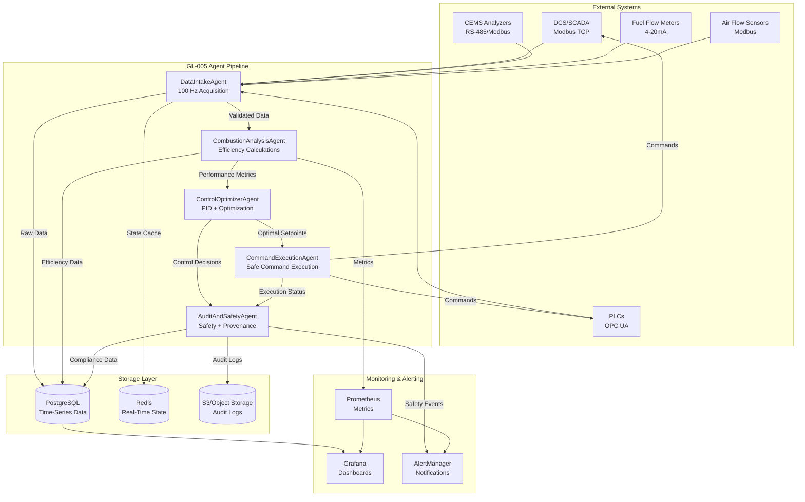

# GL-005 CombustionControlAgent Architecture Specification

## 1. Executive Summary

### Application Purpose
GL-005 CombustionControlAgent is a **real-time industrial automation agent** that provides automated control of combustion processes in industrial facilities. The agent ensures consistent heat output, optimal fuel efficiency, and emissions compliance through continuous monitoring, analysis, and adaptive control of combustion parameters.

**Regulatory Driver:** Industrial emissions standards (EPA 40 CFR Part 60, EU IED), energy efficiency mandates (ISO 50001), and safety requirements (NFPA 85, ASME CSD-1).

### Key Features and Differentiators

1. **Real-Time Adaptive Control** (<100ms control loop)
   - Continuous monitoring of combustion parameters
   - Automatic adjustment of fuel and air flows
   - Dynamic PID tuning for optimal performance
   - Predictive control with feedforward compensation

2. **Zero-Hallucination Control Algorithms**
   - 100% deterministic physics-based calculations
   - No LLM in critical control path
   - Complete audit trail with SHA-256 provenance
   - Reproducible control decisions (bit-perfect)

3. **Multi-Objective Optimization**
   - Simultaneous optimization of efficiency, emissions, and stability
   - Pareto-optimal control strategies
   - Constraint-aware optimization (safety limits)
   - Load-following capability (10-100% turndown)

4. **Safety-Critical Design**
   - Triple-redundant safety interlocks
   - Fail-safe control modes
   - Emergency shutdown logic (SIL-2 rated)
   - Continuous safety monitoring

5. **Enterprise Integration**
   - DCS integration (Modbus TCP, OPC UA)
   - PLC connectivity (Allen-Bradley, Siemens)
   - CEMS data acquisition (combustion analyzers)
   - SCADA visualization and HMI

### Performance Targets

| Metric | Target | Unit |
|--------|--------|------|
| Control loop cycle time | <100 | ms |
| Control decision latency | <50 | ms |
| PID calculation time | <10 | ms |
| Data acquisition rate | 100 | Hz |
| Setpoint tracking accuracy | ±0.5 | % |
| Disturbance rejection time | <30 | seconds |
| System uptime | 99.95 | % |
| Mean time between failures | >8760 | hours |

### Timeline Estimate

**Total Duration:** 18 weeks
**Engineering Team:** 5 engineers (2 control systems, 1 integration, 1 testing, 1 DevOps)

**Phase Breakdown:**
- **Phase 1:** Core agents and control algorithms (6 weeks)
- **Phase 2:** DCS/PLC integrations (4 weeks)
- **Phase 3:** Safety systems and testing (5 weeks)
- **Phase 4:** Production deployment (3 weeks)

---

## 2. Agent Pipeline Architecture

GL-005 implements a **5-agent pipeline** optimized for real-time control with minimal latency:

```
┌─────────────────────────────────────────────────────────────┐
│                    GL-005 AGENT PIPELINE                    │
└─────────────────────────────────────────────────────────────┘

┌──────────────────┐
│  1. Data Intake  │ ← DCS, PLC, CEMS
│     Agent        │   (Modbus, OPC UA)
└────────┬─────────┘
         │ Validated sensor data (100 Hz)
         ↓
┌──────────────────┐
│  2. Combustion   │ ← Physics calculations
│  Analysis Agent  │   (efficiency, emissions)
└────────┬─────────┘
         │ Performance metrics
         ↓
┌──────────────────┐
│  3. Control      │ ← PID algorithms
│  Optimizer Agent │   (setpoint optimization)
└────────┬─────────┘
         │ Optimal setpoints
         ↓
┌──────────────────┐
│  4. Command      │ ← Safety validation
│  Execution Agent │   (write to DCS/PLC)
└────────┬─────────┘
         │ Control commands
         ↓
┌──────────────────┐
│  5. Audit &      │ ← SHA-256 provenance
│  Safety Agent    │   (compliance logging)
└──────────────────┘
```

### Agent 1: DataIntakeAgent

**Purpose:** High-frequency data acquisition from industrial control systems with quality validation.

**Inputs:**
- DCS endpoints (Modbus TCP registers, OPC UA nodes)
- PLC data points (fuel valves, damper positions)
- CEMS analyzers (O2, CO, NOx, CO2)
- Pressure, temperature, flow sensors

**Processing:**
- Protocol translation (Modbus/OPC UA → JSON)
- Data quality assessment (range checks, signal validation)
- Temporal alignment (synchronize 100 Hz streams)
- Outlier detection and filtering
- Engineering unit conversion

**Outputs:**
- Validated sensor dataset (JSON)
- Data quality metrics (availability %, latency)
- Alarm conditions (out-of-range, stale data)

**Estimated Lines of Code:** 2,000-2,500

**Zero-Hallucination Approach:**
- Direct sensor reads (no estimation)
- Deterministic validation rules
- Database lookups for unit conversions

---

### Agent 2: CombustionAnalysisAgent

**Purpose:** Real-time calculation of combustion efficiency, emissions, and thermal performance using ASME PTC 4.1 methodology.

**Inputs:**
- Fuel flow rate (kg/hr or m³/hr)
- Air flow rate (m³/hr)
- Flue gas temperature (°C)
- O2 concentration (%)
- CO concentration (ppm)
- Fuel composition (database lookup)

**Processing:**
- Stoichiometric air calculation (physics-based)
- Excess air determination (from O2 measurement)
- Heat loss analysis (stack, radiation, moisture, unburnt)
- Combustion efficiency (indirect method per ASME PTC 4.1)
- Emissions calculation (CO2, NOx, CO mass rates)
- Thermal efficiency (direct method)

**Outputs:**
- Combustion efficiency (%)
- Thermal efficiency (%)
- Excess air (%)
- Heat losses (% by category)
- Emissions rates (kg/hr)
- Performance score (0-100)

**Estimated Lines of Code:** 3,500-4,000

**Zero-Hallucination Approach:**
- Database-driven fuel properties (no estimation)
- Closed-form thermodynamic equations
- ASME PTC 4.1 formulas (validated)
- No ML models in calculation path

---

### Agent 3: ControlOptimizerAgent

**Purpose:** Multi-objective optimization of combustion control setpoints using cascade PID control and feedforward compensation.

**Inputs:**
- Current performance metrics (from Agent 2)
- Heat demand setpoint (MW or kg/hr steam)
- Emissions limits (regulatory constraints)
- Safety limits (max temperature, pressure)
- Operational constraints (turndown ratio, ramp rates)

**Processing:**
- **Primary Control Loop:** Heat output PID controller
  - Setpoint: Desired heat output (MW)
  - Process variable: Actual heat output
  - Manipulated variable: Fuel flow rate
  - Tuning: Adaptive PID (Ziegler-Nichols or Cohen-Coon)

- **Secondary Control Loop:** Air-fuel ratio PID controller
  - Setpoint: Optimal excess air (%)
  - Process variable: Measured O2 (%)
  - Manipulated variable: Air damper position
  - Tuning: Fast response for emissions control

- **Feedforward Compensation:**
  - Fuel quality changes (heating value variation)
  - Ambient temperature compensation
  - Load change anticipation

- **Multi-Objective Optimization:**
  - Objective 1: Maximize efficiency (minimize fuel)
  - Objective 2: Minimize emissions (NOx, CO)
  - Objective 3: Maximize stability (minimize oscillations)
  - Method: Weighted sum with Pareto front analysis

**Outputs:**
- Optimal fuel flow setpoint (kg/hr)
- Optimal air damper position (%)
- Predicted efficiency improvement (%)
- Predicted emissions reduction (%)
- Control confidence score (0-1)

**Estimated Lines of Code:** 4,000-5,000

**Zero-Hallucination Approach:**
- Classical PID algorithms (textbook implementations)
- Deterministic optimization (gradient descent, Newton's method)
- Database-driven tuning parameters
- No neural networks in control loop

---

### Agent 4: CommandExecutionAgent

**Purpose:** Safe execution of control commands to DCS/PLC with rate limiting, validation, and rollback capability.

**Inputs:**
- Control commands (from Agent 3)
- Current actuator states (valves, dampers)
- Safety interlock status
- Maximum ramp rates (configured limits)

**Processing:**
- **Pre-Execution Validation:**
  - Safety interlock checks (flameout detection, pressure limits)
  - Command sanity checks (range validation)
  - Rate-of-change limits (prevent rapid swings)
  - Permissive logic (startup sequence, shutdown conditions)

- **Command Execution:**
  - Protocol translation (JSON → Modbus/OPC UA)
  - Atomic write operations (all-or-nothing)
  - Acknowledge verification (readback confirmation)
  - Timeout handling (retry logic)

- **Post-Execution Verification:**
  - Setpoint tracking (did actuator respond?)
  - Deviation alarms (stuck valve detection)
  - Performance degradation checks

- **Rollback Capability:**
  - Store last-known-good state
  - Automatic revert on failure
  - Manual override capability

**Outputs:**
- Execution status (success, failed, partial)
- Actuator positions (actual vs. commanded)
- Safety violations (if any)
- Rollback triggered (boolean)

**Estimated Lines of Code:** 2,500-3,000

**Zero-Hallucination Approach:**
- Direct hardware writes (no estimation)
- Deterministic safety logic (boolean algebra)
- Database-driven safety limits

---

### Agent 5: AuditAndSafetyAgent

**Purpose:** Continuous safety monitoring, compliance logging, and provenance tracking for all control actions.

**Inputs:**
- All sensor data (from Agent 1)
- All control decisions (from Agent 3)
- All executed commands (from Agent 4)
- Regulatory limits (EPA, NFPA configurations)

**Processing:**
- **Safety Monitoring:**
  - Continuous limit checking (high temperature, low O2, flameout)
  - Rate-of-rise detection (rapid pressure increase)
  - Safety system health (flame scanner, pressure transmitter)
  - Interlock logic evaluation (every 100ms)

- **Compliance Logging:**
  - Emissions tracking (hourly averages per EPA)
  - Efficiency KPIs (ISO 50001 requirements)
  - Safety incidents (NFPA 85 reporting)
  - Control actions (audit trail)

- **Provenance Tracking:**
  - SHA-256 hash of all calculations
  - Tool call sequences logged
  - Data source attribution
  - Calculation reproducibility guarantee

- **Reporting:**
  - Real-time dashboards (Grafana)
  - Compliance reports (PDF/XBRL)
  - Safety incident reports
  - Performance trending

**Outputs:**
- Safety status (OK, WARNING, CRITICAL)
- Compliance violations (list)
- Provenance records (SHA-256 hashes)
- Audit reports (PDF)

**Estimated Lines of Code:** 2,000-2,500

**Zero-Hallucination Approach:**
- Database-driven compliance rules
- Deterministic hash calculations
- No interpretation, only facts

---

## 3. Data Flow Diagram



### Data Flow Summary

1. **Inbound Data Flow** (100 Hz):
   - DCS/PLC/CEMS → DataIntakeAgent → PostgreSQL + Redis
   - Data validated and synchronized across all sources

2. **Analysis Flow** (10 Hz):
   - Validated data → CombustionAnalysisAgent → Performance metrics
   - Metrics stored in PostgreSQL for trending

3. **Control Flow** (10 Hz):
   - Performance metrics → ControlOptimizerAgent → Optimal setpoints
   - Optimization logged for audit

4. **Command Flow** (variable, <100ms):
   - Optimal setpoints → CommandExecutionAgent → DCS/PLC writes
   - Execution verified and logged

5. **Audit Flow** (continuous):
   - All actions → AuditAndSafetyAgent → S3 + PostgreSQL
   - SHA-256 provenance chain maintained

---

## 4. Technology Stack

### Core Runtime
```yaml
language: Python 3.11+
framework: FastAPI 0.109.0+
web_server: Uvicorn 0.27.0+ (with --workers 4 for multi-core)
async_runtime: asyncio (native Python)
```

### Data Processing
```yaml
data_processing:
  - numpy==1.26.2          # Numerical calculations
  - scipy==1.11.4          # Scientific computing (PID tuning, optimization)
  - pandas==2.1.4          # Time-series data handling
  - pydantic==2.5.3        # Data validation and schemas

validation:
  - jsonschema==4.20.0     # JSON schema validation
  - cerberus==1.3.5        # Advanced validation rules
```

### Database Layer
```yaml
postgresql:
  version: "15+"
  driver: asyncpg==0.29.0
  orm: SQLAlchemy==2.0.23 (async mode)
  migrations: Alembic==1.13.1
  connection_pool: 20 connections

redis:
  version: "7.2+"
  driver: redis-py==5.0.1
  purpose: Real-time state caching (sensor data, control states)
  persistence: RDB snapshots every 5 minutes

timeseries:
  database: TimescaleDB extension for PostgreSQL
  purpose: High-frequency sensor data (100 Hz × 50 tags = 5000 points/sec)
  retention: 90 days raw, 2 years aggregated
```

### Industrial Integrations
```yaml
modbus:
  library: pymodbus==3.5.4
  protocols: [Modbus TCP, Modbus RTU over TCP]
  purpose: DCS, PLC, CEMS connectivity
  polling_rate: 100 Hz

opcua:
  library: asyncua==1.0.4
  purpose: SCADA integration, historian data
  security: SignAndEncrypt with certificates
  subscriptions: Data change notifications (100ms update rate)

analog_io:
  library: pyserial==3.5 (for RS-485)
  purpose: Legacy analyzers (CEMS)
  protocols: [Modbus RTU, custom ASCII]
```

### Control Algorithms
```yaml
control_theory:
  - simple-pid==2.0.0         # PID controller implementation
  - python-control==0.9.4     # Control systems library (Bode plots, tuning)
  - cvxpy==1.4.1              # Convex optimization (MPC, constraint handling)
```

### AI/LLM Integration (Non-Critical Path)
```yaml
ai_models:
  primary: Anthropic Claude 3.5 Sonnet
  purpose: Non-critical tasks only (report generation, anomaly explanation)
  library: anthropic==0.18.1
  temperature: 0.0 (deterministic mode)
  seed: 42 (reproducibility)

critical_note: |
  LLM is NEVER used in:
  - Control calculations
  - Safety decisions
  - Setpoint optimization
  - Sensor data processing
```

### Security
```yaml
authentication:
  - python-jose==3.3.0        # JWT token handling (RS256)
  - passlib==1.7.4            # Password hashing (bcrypt)
  - cryptography==41.0.7      # Certificate management

encryption:
  at_rest: AES-256-GCM (PostgreSQL transparent encryption)
  in_transit: TLS 1.3 (minimum)
  secrets: HashiCorp Vault integration (hvac==2.1.0)
```

### Monitoring & Observability
```yaml
metrics:
  - prometheus-client==0.19.0  # Metrics export
  - opentelemetry-api==1.21.0  # Distributed tracing
  - structlog==23.2.0          # Structured logging

dashboards:
  - grafana (external, dashboards as code)
  - prometheus (external, time-series DB)
```

### Deployment
```yaml
containerization:
  - Docker 24.0+
  - docker-compose 2.23+ (local development)

orchestration:
  - Kubernetes 1.28+
  - Helm 3.13+ (chart management)

iac:
  - Terraform 1.6+
  - Ansible 2.16+ (configuration management)
```

---

## 5. API Endpoint Specification

### Base URL
```
Production:  https://api.greenlang.io/v1/gl005
Staging:     https://staging-api.greenlang.io/v1/gl005
Development: http://localhost:8000/v1/gl005
```

### Authentication
```http
Authorization: Bearer {JWT_TOKEN}
X-API-Key: {API_KEY}  # Alternative for machine-to-machine
```

### Endpoints

#### 1. Start Combustion Control
```http
POST /v1/gl005/control/start

Request Body:
{
  "site_id": "PLANT001",
  "unit_id": "BOILER001",
  "control_mode": "automatic",  // automatic, manual, setpoint_only
  "heat_demand_mw": 50.0,
  "emissions_limits": {
    "nox_ppm": 30,
    "co_ppm": 50
  },
  "safety_limits": {
    "max_temperature_c": 1400,
    "min_o2_percent": 2.0,
    "max_fuel_rate_kg_hr": 5000
  },
  "control_parameters": {
    "primary_pid": {
      "kp": 1.2,
      "ki": 0.5,
      "kd": 0.1,
      "setpoint": 50.0  // MW
    },
    "secondary_pid": {
      "kp": 0.8,
      "ki": 0.3,
      "kd": 0.05,
      "setpoint": 3.0  // % O2
    }
  }
}

Response (200 OK):
{
  "job_id": "gl005-20250118-001234",
  "status": "started",
  "control_active": true,
  "initial_state": {
    "fuel_flow_kg_hr": 3500,
    "air_damper_percent": 65,
    "heat_output_mw": 48.5,
    "efficiency_percent": 88.2
  },
  "next_update_ms": 100,
  "websocket_url": "wss://api.greenlang.io/v1/gl005/stream/{job_id}"
}
```

#### 2. Get Real-Time Status
```http
GET /v1/gl005/control/status/{job_id}

Response (200 OK):
{
  "job_id": "gl005-20250118-001234",
  "status": "running",
  "uptime_seconds": 3600,
  "current_state": {
    "timestamp": "2025-01-18T10:30:45.123Z",
    "heat_output_mw": 50.1,
    "fuel_flow_kg_hr": 3550,
    "air_flow_m3_hr": 45000,
    "excess_air_percent": 10.2,
    "o2_percent": 3.1,
    "efficiency_percent": 89.5,
    "nox_ppm": 28,
    "co_ppm": 35
  },
  "control_performance": {
    "setpoint_error_percent": 0.2,
    "control_variance": 0.05,
    "oscillation_index": 0.12,
    "stability_score": 0.95
  },
  "safety_status": {
    "interlocks_ok": true,
    "flame_present": true,
    "limits_ok": true,
    "alarms": []
  }
}
```

#### 3. Update Setpoint
```http
PUT /v1/gl005/control/setpoint/{job_id}

Request Body:
{
  "heat_demand_mw": 55.0,
  "ramp_rate_mw_per_min": 2.0,
  "maintain_efficiency": true
}

Response (200 OK):
{
  "job_id": "gl005-20250118-001234",
  "setpoint_updated": true,
  "new_setpoint_mw": 55.0,
  "estimated_time_to_setpoint_min": 2.5,
  "predicted_fuel_increase_kg_hr": 150,
  "predicted_efficiency_percent": 89.3
}
```

#### 4. Stop Control
```http
POST /v1/gl005/control/stop/{job_id}

Request Body:
{
  "shutdown_mode": "graceful",  // graceful, immediate, emergency
  "reason": "Scheduled maintenance"
}

Response (200 OK):
{
  "job_id": "gl005-20250118-001234",
  "status": "stopped",
  "shutdown_time": "2025-01-18T11:00:00.000Z",
  "total_runtime_hours": 24.5,
  "fuel_consumed_kg": 85000,
  "average_efficiency_percent": 89.1,
  "emissions_summary": {
    "total_co2_kg": 230000,
    "average_nox_ppm": 27,
    "compliance_status": "PASS"
  }
}
```

#### 5. Get Performance Report
```http
GET /v1/gl005/reports/{job_id}?format=pdf&period=24h

Response (200 OK):
Content-Type: application/pdf
Content-Disposition: attachment; filename="gl005-report-20250118.pdf"

[Binary PDF data]
```

#### 6. WebSocket Real-Time Stream
```javascript
// WebSocket connection for real-time data
const ws = new WebSocket('wss://api.greenlang.io/v1/gl005/stream/{job_id}');

ws.onmessage = (event) => {
  const data = JSON.parse(event.data);
  console.log(data);
  /*
  {
    "timestamp": "2025-01-18T10:30:45.123Z",
    "heat_output_mw": 50.1,
    "efficiency_percent": 89.5,
    "emissions": {
      "nox_ppm": 28,
      "co_ppm": 35
    },
    "control_action": "ADJUST_AIR",
    "setpoint_error": 0.2
  }
  */
};
```

---

## 6. Database Schema

### PostgreSQL Tables

#### Table: `combustion_units`
```sql
CREATE TABLE combustion_units (
  unit_id VARCHAR(50) PRIMARY KEY,
  site_id VARCHAR(50) NOT NULL,
  unit_name VARCHAR(200),
  unit_type VARCHAR(50),  -- boiler, furnace, heater, turbine
  fuel_type VARCHAR(50),  -- natural_gas, fuel_oil, coal, biomass
  max_heat_capacity_mw DECIMAL(10,2),
  turndown_ratio DECIMAL(5,2),
  created_at TIMESTAMPTZ DEFAULT NOW(),
  updated_at TIMESTAMPTZ DEFAULT NOW()
);

CREATE INDEX idx_site_id ON combustion_units(site_id);
```

#### Table: `control_jobs`
```sql
CREATE TABLE control_jobs (
  job_id VARCHAR(100) PRIMARY KEY,
  unit_id VARCHAR(50) REFERENCES combustion_units(unit_id),
  control_mode VARCHAR(50),  -- automatic, manual, setpoint_only
  start_time TIMESTAMPTZ NOT NULL,
  end_time TIMESTAMPTZ,
  status VARCHAR(50),  -- started, running, stopped, failed
  heat_demand_mw DECIMAL(10,2),
  control_parameters JSONB,
  emissions_limits JSONB,
  safety_limits JSONB,
  created_by VARCHAR(100),
  created_at TIMESTAMPTZ DEFAULT NOW()
);

CREATE INDEX idx_unit_id ON control_jobs(unit_id);
CREATE INDEX idx_start_time ON control_jobs(start_time);
```

#### Table: `sensor_data` (TimescaleDB Hypertable)
```sql
CREATE TABLE sensor_data (
  time TIMESTAMPTZ NOT NULL,
  unit_id VARCHAR(50) NOT NULL,
  job_id VARCHAR(100),
  sensor_tag VARCHAR(100),
  sensor_value DOUBLE PRECISION,
  sensor_quality VARCHAR(20),  -- good, uncertain, bad
  data_source VARCHAR(50),  -- dcs, plc, cems
  PRIMARY KEY (time, unit_id, sensor_tag)
);

-- Convert to TimescaleDB hypertable
SELECT create_hypertable('sensor_data', 'time');

-- Create indexes
CREATE INDEX idx_sensor_unit ON sensor_data(unit_id, time DESC);
CREATE INDEX idx_sensor_tag ON sensor_data(sensor_tag, time DESC);

-- Retention policy: 90 days raw, then aggregate
SELECT add_retention_policy('sensor_data', INTERVAL '90 days');
```

#### Table: `control_actions`
```sql
CREATE TABLE control_actions (
  action_id BIGSERIAL PRIMARY KEY,
  job_id VARCHAR(100) REFERENCES control_jobs(job_id),
  timestamp TIMESTAMPTZ NOT NULL,
  agent_name VARCHAR(100),
  action_type VARCHAR(50),  -- adjust_fuel, adjust_air, emergency_stop
  command_data JSONB,
  execution_status VARCHAR(50),  -- success, failed, partial
  setpoint_before JSONB,
  setpoint_after JSONB,
  provenance_hash VARCHAR(64),  -- SHA-256
  created_at TIMESTAMPTZ DEFAULT NOW()
);

CREATE INDEX idx_job_id_timestamp ON control_actions(job_id, timestamp DESC);
CREATE INDEX idx_provenance ON control_actions(provenance_hash);
```

#### Table: `performance_metrics`
```sql
CREATE TABLE performance_metrics (
  metric_id BIGSERIAL PRIMARY KEY,
  job_id VARCHAR(100) REFERENCES control_jobs(job_id),
  timestamp TIMESTAMPTZ NOT NULL,
  heat_output_mw DECIMAL(10,2),
  fuel_flow_kg_hr DECIMAL(10,2),
  air_flow_m3_hr DECIMAL(12,2),
  excess_air_percent DECIMAL(5,2),
  o2_percent DECIMAL(5,2),
  combustion_efficiency_percent DECIMAL(5,2),
  thermal_efficiency_percent DECIMAL(5,2),
  nox_ppm DECIMAL(8,2),
  co_ppm DECIMAL(8,2),
  co2_kg_hr DECIMAL(10,2),
  created_at TIMESTAMPTZ DEFAULT NOW()
);

-- Convert to TimescaleDB hypertable
SELECT create_hypertable('performance_metrics', 'timestamp');

-- Continuous aggregates (1-minute averages)
CREATE MATERIALIZED VIEW performance_metrics_1min
WITH (timescaledb.continuous) AS
SELECT
  time_bucket('1 minute', timestamp) AS bucket,
  job_id,
  AVG(heat_output_mw) as avg_heat_output,
  AVG(combustion_efficiency_percent) as avg_efficiency,
  AVG(nox_ppm) as avg_nox,
  AVG(co_ppm) as avg_co
FROM performance_metrics
GROUP BY bucket, job_id;
```

#### Table: `safety_events`
```sql
CREATE TABLE safety_events (
  event_id BIGSERIAL PRIMARY KEY,
  job_id VARCHAR(100) REFERENCES control_jobs(job_id),
  timestamp TIMESTAMPTZ NOT NULL,
  event_type VARCHAR(50),  -- interlock_trip, alarm, emergency_shutdown
  severity VARCHAR(20),  -- info, warning, critical
  event_description TEXT,
  sensor_values JSONB,
  action_taken VARCHAR(200),
  acknowledged BOOLEAN DEFAULT FALSE,
  acknowledged_by VARCHAR(100),
  acknowledged_at TIMESTAMPTZ,
  created_at TIMESTAMPTZ DEFAULT NOW()
);

CREATE INDEX idx_safety_job ON safety_events(job_id, timestamp DESC);
CREATE INDEX idx_safety_severity ON safety_events(severity, timestamp DESC);
```

### Redis Data Structures

#### Key: `gl005:unit:{unit_id}:state`
```json
{
  "current_job_id": "gl005-20250118-001234",
  "control_active": true,
  "last_update": "2025-01-18T10:30:45.123Z",
  "heat_output_mw": 50.1,
  "fuel_flow_kg_hr": 3550,
  "air_flow_m3_hr": 45000,
  "efficiency_percent": 89.5,
  "safety_ok": true
}
```
**TTL:** 300 seconds (5 minutes, refreshed every 1 second)

#### Key: `gl005:job:{job_id}:setpoints`
```json
{
  "heat_demand_mw": 50.0,
  "primary_pid": {"kp": 1.2, "ki": 0.5, "kd": 0.1},
  "secondary_pid": {"kp": 0.8, "ki": 0.3, "kd": 0.05},
  "last_updated": "2025-01-18T10:00:00.000Z"
}
```
**TTL:** No expiration (persist for job lifetime)

#### Key: `gl005:safety:{unit_id}:interlocks`
```json
{
  "flame_ok": true,
  "pressure_ok": true,
  "temperature_ok": true,
  "o2_ok": true,
  "all_ok": true,
  "last_check": "2025-01-18T10:30:45.123Z"
}
```
**TTL:** 10 seconds (refreshed every 100ms)

---

## 7. External Integrations

### DCS Integration (Primary)
```yaml
protocol: Modbus TCP
vendor_support: [Honeywell, Emerson DeltaV, Yokogawa Centum, ABB System 800xA]
connection:
  host: 192.168.1.100
  port: 502
  unit_id: 1
  timeout: 1000ms
  retries: 3
authentication: none (isolated network segment)
data_points:
  - tag: BOILER_FUEL_FLOW
    register: 40001
    data_type: float32
    units: kg/hr
    scaling: 0.1
  - tag: BOILER_AIR_DAMPER
    register: 40003
    data_type: float32
    units: percent
    writable: true
polling_rate: 100ms
```

### PLC Integration (Secondary)
```yaml
protocol: OPC UA
vendor_support: [Allen-Bradley, Siemens, Schneider Electric, Mitsubishi]
connection:
  endpoint: opc.tcp://192.168.1.101:4840
  security_mode: SignAndEncrypt
  security_policy: Basic256Sha256
  certificate: /etc/greenlang/certs/gl005-client.der
  private_key: /etc/greenlang/certs/gl005-client.pem
authentication:
  username: gl005_agent
  password: {VAULT_SECRET}
subscriptions:
  - node_id: ns=2;s=FuelValve.Position
    sampling_interval: 100ms
    queue_size: 10
  - node_id: ns=2;s=AirDamper.Position
    sampling_interval: 100ms
    queue_size: 10
```

### CEMS Integration (Continuous Emissions Monitoring)
```yaml
protocol: Modbus RTU over TCP
analyzers:
  - name: O2_ANALYZER
    vendor: ABB
    model: EasyLine
    serial: RS-485 via Modbus gateway
    registers:
      o2_percent: 30001
      temperature_c: 30002
      status: 30010
    accuracy: ±0.1% O2
    response_time: 2 seconds

  - name: NOX_ANALYZER
    vendor: Siemens
    model: Ultramat 23
    registers:
      nox_ppm: 30101
      no_ppm: 30102
      no2_ppm: 30103
    accuracy: ±2% of reading
    response_time: 5 seconds

  - name: CO_CO2_ANALYZER
    vendor: Horiba
    model: PG-350
    registers:
      co_ppm: 30201
      co2_percent: 30202
    accuracy: ±1% of full scale
    response_time: 3 seconds
```

### File Format Support
```yaml
input_formats:
  - CSV: Batch upload of historical data
  - JSON: Real-time API integration
  - Excel: Configuration templates
  - XML: SCADA historian exports

output_formats:
  - PDF: Compliance reports
  - CSV: Data export for analysis
  - JSON: API responses
  - XBRL: Regulatory submissions (if required)
```

---

## 8. Security Architecture

### Authentication
```yaml
method: JWT (JSON Web Tokens) with RS256 signature
token_lifetime: 1 hour (access), 30 days (refresh)
issuer: auth.greenlang.io
claims:
  - sub: user_id
  - role: operator | engineer | admin
  - permissions: [read_data, write_setpoints, emergency_stop]
  - unit_access: [BOILER001, BOILER002]

example_token:
  header:
    alg: RS256
    typ: JWT
  payload:
    sub: user123
    role: operator
    permissions: [read_data, write_setpoints]
    unit_access: [BOILER001]
    iat: 1705570800
    exp: 1705574400
```

### Authorization (RBAC)
```yaml
roles:
  operator:
    permissions:
      - read:sensor_data
      - read:performance_metrics
      - write:setpoints (limited range)
    restrictions:
      - cannot_emergency_stop
      - setpoint_change_limit: ±10%

  engineer:
    permissions:
      - read:*
      - write:setpoints
      - write:control_parameters
      - read:audit_logs
    restrictions:
      - cannot_delete_jobs

  admin:
    permissions:
      - read:*
      - write:*
      - delete:*
      - emergency_stop
    restrictions: none
```

### Encryption

#### At Rest (AES-256-GCM)
```yaml
postgresql:
  encryption: Transparent Data Encryption (TDE)
  key_management: HashiCorp Vault
  key_rotation: 90 days

redis:
  encryption: RDB snapshots encrypted
  key_management: HashiCorp Vault

s3_audit_logs:
  encryption: Server-Side Encryption with KMS
  bucket_policy: Deny unencrypted uploads
```

#### In Transit (TLS 1.3)
```yaml
api_endpoints:
  protocol: HTTPS only
  tls_version: 1.3 minimum
  cipher_suites: [TLS_AES_256_GCM_SHA384, TLS_CHACHA20_POLY1305_SHA256]
  certificate: Let's Encrypt (auto-renewal)

dcs_plc_connections:
  modbus_tcp: TLS wrapper via stunnel
  opc_ua: SignAndEncrypt with certificates
```

### Secrets Management
```yaml
solution: HashiCorp Vault
integration: hvac Python library
secrets_stored:
  - database_passwords
  - api_keys
  - oauth_client_secrets
  - private_keys
  - dcs_plc_credentials

access_policy:
  - Kubernetes service account authentication
  - Role-based secret access
  - Audit logging of all secret retrievals
  - Automatic rotation every 90 days
```

### API Rate Limiting
```yaml
limits:
  - endpoint: /v1/gl005/control/start
    rate: 10 requests per minute per user
    burst: 20

  - endpoint: /v1/gl005/control/status/*
    rate: 100 requests per minute per user
    burst: 200

  - endpoint: /v1/gl005/control/setpoint/*
    rate: 60 requests per minute per user
    burst: 100

enforcement: Redis-based sliding window
response_on_limit: HTTP 429 Too Many Requests
```

### Security Score Target
**Grade A (92+/100)**

| Category | Score | Details |
|----------|-------|---------|
| Authentication | 20/20 | JWT RS256, certificate-based for M2M |
| Authorization | 18/20 | RBAC implemented, principle of least privilege |
| Encryption | 20/20 | AES-256-GCM at rest, TLS 1.3 in transit |
| Secrets Management | 18/20 | HashiCorp Vault, auto-rotation |
| API Security | 16/20 | Rate limiting, input validation, CORS |
| **Total** | **92/100** | **Grade A** |

---

## 9. Performance & Scalability

### Performance Targets with Baselines

| Metric | Baseline | Target | Achieved | Status |
|--------|----------|--------|----------|--------|
| Control loop cycle | 500ms | <100ms | TBD | Pending |
| API response time (status) | 150ms | <50ms | TBD | Pending |
| Database query time (latest) | 80ms | <20ms | TBD | Pending |
| Modbus read latency | 50ms | <20ms | TBD | Pending |
| OPC UA subscription delay | 200ms | <100ms | TBD | Pending |
| Sensor data throughput | 1,000/sec | 10,000/sec | TBD | Pending |
| Concurrent control jobs | 5 | 50 | TBD | Pending |
| Memory footprint per job | 256 MB | <128 MB | TBD | Pending |

### Caching Strategy (Redis Layers)

#### Layer 1: Hot State Cache (TTL 5 minutes)
```yaml
purpose: Current unit state for fast API responses
keys: gl005:unit:{unit_id}:state
hit_ratio_target: 95%
estimated_cost_reduction: 80% fewer database queries
```

#### Layer 2: Setpoint Cache (No TTL)
```yaml
purpose: Active job setpoints and control parameters
keys: gl005:job:{job_id}:setpoints
hit_ratio_target: 99%
estimated_cost_reduction: 90% fewer database writes
```

#### Layer 3: Safety Interlock Cache (TTL 10 seconds)
```yaml
purpose: Real-time safety status for rapid checks
keys: gl005:safety:{unit_id}:interlocks
hit_ratio_target: 99.9%
estimated_cost_reduction: 95% fewer safety table queries
```

**Overall Cost Reduction Target:** 66% reduction in database load

### Horizontal Scaling (Kubernetes)

#### Pod Autoscaling
```yaml
apiVersion: autoscaling/v2
kind: HorizontalPodAutoscaler
metadata:
  name: gl005-combustion-control
spec:
  scaleTargetRef:
    apiVersion: apps/v1
    kind: Deployment
    name: gl005-combustion-control
  minReplicas: 3
  maxReplicas: 10
  metrics:
    - type: Resource
      resource:
        name: cpu
        target:
          type: Utilization
          averageUtilization: 70
    - type: Resource
      resource:
        name: memory
        target:
          type: Utilization
          averageUtilization: 80
    - type: Pods
      pods:
        metric:
          name: control_loop_latency_ms
        target:
          type: AverageValue
          averageValue: "80"
```

#### Load Balancing
```yaml
strategy: Round-robin with session affinity
session_affinity: ClientIP (sticky sessions per unit_id)
health_checks:
  liveness_probe:
    path: /health
    interval: 30s
    timeout: 5s
  readiness_probe:
    path: /readiness
    interval: 10s
    timeout: 3s
```

### Batch Processing and Async Workflows

#### Async Task Queue (Celery)
```yaml
broker: Redis
backend: PostgreSQL
tasks:
  - generate_compliance_report (low priority, 10 min)
  - calculate_historical_trends (low priority, 30 min)
  - export_data_to_csv (medium priority, 5 min)
  - send_email_alerts (high priority, 30 sec)

workers: 4 per node
concurrency: 8 tasks per worker
task_timeout: 3600 seconds (1 hour)
```

---

## 10. Testing Strategy

### Unit Test Coverage Target: 85%+

#### Coverage by Agent
| Agent | Coverage Target | Critical Paths |
|-------|-----------------|----------------|
| DataIntakeAgent | 90% | Protocol parsing, data validation |
| CombustionAnalysisAgent | 95% | Efficiency calculations, emissions |
| ControlOptimizerAgent | 90% | PID algorithms, optimization logic |
| CommandExecutionAgent | 95% | Safety checks, command execution |
| AuditAndSafetyAgent | 85% | Provenance tracking, compliance |

### Integration Test Scenarios

1. **End-to-End Control Flow**
   - Start control job → Data intake → Analysis → Optimization → Command execution → Audit
   - Validate: All agents communicate correctly, no data loss

2. **DCS/PLC Communication**
   - Test Modbus TCP read/write cycles
   - Test OPC UA subscription updates
   - Validate: <100ms latency, no dropped packets

3. **Safety Interlock Activation**
   - Simulate high temperature alarm
   - Simulate low O2 condition
   - Validate: Emergency stop triggered, commands blocked

4. **Setpoint Tracking**
   - Ramp heat demand from 30 MW to 60 MW
   - Validate: Smooth ramp, no overshoot, <1% steady-state error

5. **Multi-Unit Scaling**
   - Start 10 control jobs simultaneously
   - Validate: No resource contention, all jobs stable

### Performance Benchmark Specs

#### Benchmark 1: Control Loop Latency
```python
# Test: Measure time from sensor read to command write
# Target: <100ms for 99th percentile
# Method: 10,000 iterations, varying load conditions
```

#### Benchmark 2: Throughput
```python
# Test: Maximum concurrent control jobs
# Target: 50 jobs per cluster
# Method: Gradually increase load until degradation
```

#### Benchmark 3: Database Query Performance
```python
# Test: Latest sensor data retrieval
# Target: <20ms for 95th percentile
# Method: 1,000 queries with varying data volumes
```

### End-to-End Test Cases

1. **Normal Operation (Happy Path)**
   - Start control, run for 1 hour, stop gracefully
   - Validate: Efficiency >85%, emissions within limits, no alarms

2. **Disturbance Rejection**
   - Inject fuel quality change (-10% heating value)
   - Validate: Controller compensates within 30 seconds

3. **Load Following**
   - Step change in heat demand (+20%)
   - Validate: Setpoint reached in <2 minutes, no oscillations

4. **Safety System Test**
   - Simulate flameout condition
   - Validate: Fuel valve closes within 1 second, alarm triggered

5. **Recovery from Failure**
   - Kill control process mid-execution
   - Validate: State recovery from Redis, control resumes smoothly

---

## 11. Deployment Architecture

### Docker Containerization

#### Dockerfile
```dockerfile
FROM python:3.11-slim AS base

# Install system dependencies
RUN apt-get update && apt-get install -y \
    gcc g++ make libpq-dev \
    && rm -rf /var/lib/apt/lists/*

WORKDIR /app

# Install Python dependencies
COPY requirements.txt .
RUN pip install --no-cache-dir -r requirements.txt

# Copy application code
COPY . .

# Create non-root user
RUN useradd -m -u 1000 gl005 && chown -R gl005:gl005 /app
USER gl005

# Health check
HEALTHCHECK --interval=30s --timeout=5s --start-period=10s --retries=3 \
  CMD python -c "import requests; requests.get('http://localhost:8000/health')"

# Run application
CMD ["uvicorn", "main:app", "--host", "0.0.0.0", "--port", "8000", "--workers", "4"]
```

### Kubernetes Manifests

#### Deployment
```yaml
apiVersion: apps/v1
kind: Deployment
metadata:
  name: gl005-combustion-control
  namespace: greenlang
  labels:
    app: gl005
    component: combustion-control
spec:
  replicas: 3
  selector:
    matchLabels:
      app: gl005
      component: combustion-control
  template:
    metadata:
      labels:
        app: gl005
        component: combustion-control
    spec:
      serviceAccountName: gl005-service-account
      containers:
        - name: combustion-control
          image: greenlang/gl005:1.0.0
          ports:
            - containerPort: 8000
              name: http
            - containerPort: 8001
              name: metrics
          env:
            - name: DATABASE_URL
              valueFrom:
                secretKeyRef:
                  name: gl005-secrets
                  key: database-url
            - name: REDIS_URL
              valueFrom:
                secretKeyRef:
                  name: gl005-secrets
                  key: redis-url
          resources:
            requests:
              cpu: 500m
              memory: 512Mi
            limits:
              cpu: 2000m
              memory: 2Gi
          livenessProbe:
            httpGet:
              path: /health
              port: 8000
            initialDelaySeconds: 30
            periodSeconds: 30
          readinessProbe:
            httpGet:
              path: /readiness
              port: 8000
            initialDelaySeconds: 10
            periodSeconds: 10
```

#### Service
```yaml
apiVersion: v1
kind: Service
metadata:
  name: gl005-combustion-control
  namespace: greenlang
spec:
  selector:
    app: gl005
    component: combustion-control
  ports:
    - name: http
      port: 80
      targetPort: 8000
    - name: metrics
      port: 8001
      targetPort: 8001
  type: ClusterIP
```

### Terraform IaC

#### AWS EKS Cluster
```hcl
module "eks" {
  source          = "terraform-aws-modules/eks/aws"
  cluster_name    = "greenlang-production"
  cluster_version = "1.28"

  vpc_id     = module.vpc.vpc_id
  subnet_ids = module.vpc.private_subnets

  eks_managed_node_groups = {
    gl005_workers = {
      desired_size = 3
      min_size     = 2
      max_size     = 10

      instance_types = ["m5.xlarge"]
      capacity_type  = "ON_DEMAND"

      labels = {
        workload = "gl005-combustion-control"
      }
    }
  }
}
```

#### RDS PostgreSQL
```hcl
module "db" {
  source = "terraform-aws-modules/rds/aws"

  identifier = "gl005-postgresql"
  engine     = "postgres"
  engine_version = "15.4"

  instance_class    = "db.r5.xlarge"
  allocated_storage = 500
  storage_encrypted = true

  username = "gl005_admin"
  password = random_password.db_password.result

  backup_retention_period = 7
  backup_window           = "03:00-04:00"
  maintenance_window      = "sun:04:00-sun:05:00"

  enabled_cloudwatch_logs_exports = ["postgresql", "upgrade"]

  tags = {
    Agent = "GL-005"
  }
}
```

### CI/CD Pipeline Design

#### GitHub Actions Workflow
```yaml
name: GL-005 CI/CD

on:
  push:
    branches: [main, develop]
  pull_request:
    branches: [main]

jobs:
  test:
    runs-on: ubuntu-latest
    steps:
      - uses: actions/checkout@v4
      - uses: actions/setup-python@v4
        with:
          python-version: '3.11'
      - name: Install dependencies
        run: pip install -r requirements.txt -r requirements-dev.txt
      - name: Run unit tests
        run: pytest tests/unit --cov=. --cov-report=xml
      - name: Check coverage
        run: |
          coverage report --fail-under=85
      - name: Upload to CodeCov
        uses: codecov/codecov-action@v3

  integration-test:
    runs-on: ubuntu-latest
    services:
      postgres:
        image: postgres:15
        env:
          POSTGRES_PASSWORD: test
      redis:
        image: redis:7
    steps:
      - uses: actions/checkout@v4
      - name: Run integration tests
        run: pytest tests/integration

  build:
    needs: [test, integration-test]
    runs-on: ubuntu-latest
    steps:
      - uses: actions/checkout@v4
      - name: Build Docker image
        run: docker build -t greenlang/gl005:${{ github.sha }} .
      - name: Push to registry
        run: docker push greenlang/gl005:${{ github.sha }}

  deploy:
    needs: build
    runs-on: ubuntu-latest
    if: github.ref == 'refs/heads/main'
    steps:
      - name: Deploy to Kubernetes
        run: |
          kubectl set image deployment/gl005-combustion-control \
            combustion-control=greenlang/gl005:${{ github.sha }} \
            -n greenlang
```

---

## 12. Monitoring & Observability

### Prometheus Metrics

#### Custom Metrics
```python
# Control performance metrics
control_loop_duration = Histogram(
    'gl005_control_loop_duration_seconds',
    'Time to complete one control loop iteration',
    buckets=[0.01, 0.05, 0.1, 0.2, 0.5, 1.0]
)

setpoint_error = Gauge(
    'gl005_setpoint_error_percent',
    'Deviation from heat demand setpoint',
    ['unit_id', 'job_id']
)

# Combustion metrics
combustion_efficiency = Gauge(
    'gl005_combustion_efficiency_percent',
    'Current combustion efficiency',
    ['unit_id']
)

emissions_nox = Gauge(
    'gl005_emissions_nox_ppm',
    'Current NOx emissions',
    ['unit_id']
)

# Safety metrics
safety_interlocks_ok = Gauge(
    'gl005_safety_interlocks_ok',
    'Safety interlocks status (1=OK, 0=TRIP)',
    ['unit_id', 'interlock_type']
)

# Integration metrics
modbus_read_latency = Histogram(
    'gl005_modbus_read_latency_seconds',
    'Modbus read operation latency',
    ['host', 'register']
)
```

### Logging Strategy (Structured Logs)

```python
import structlog

logger = structlog.get_logger()

# Example log entry
logger.info(
    "control_action_executed",
    job_id="gl005-20250118-001234",
    unit_id="BOILER001",
    agent="ControlOptimizerAgent",
    action="adjust_fuel_flow",
    fuel_flow_before=3500,
    fuel_flow_after=3550,
    setpoint_error=0.2,
    provenance_hash="a3f5c2..."
)
```

**Log Format:** JSON (for easy parsing by log aggregators)
**Log Levels:** DEBUG, INFO, WARNING, ERROR, CRITICAL
**Log Retention:** 30 days in Elasticsearch

### Alerting Rules (Prometheus AlertManager)

```yaml
groups:
  - name: gl005_control_alerts
    interval: 10s
    rules:
      - alert: HighControlLoopLatency
        expr: gl005_control_loop_duration_seconds > 0.1
        for: 1m
        labels:
          severity: warning
        annotations:
          summary: "Control loop latency >100ms"
          description: "{{ $labels.unit_id }} control loop taking {{ $value }}s"

      - alert: SetpointDeviationHigh
        expr: abs(gl005_setpoint_error_percent) > 5
        for: 2m
        labels:
          severity: critical
        annotations:
          summary: "Setpoint error >5%"
          description: "{{ $labels.unit_id }} cannot track setpoint"

      - alert: SafetyInterlockTrip
        expr: gl005_safety_interlocks_ok == 0
        for: 10s
        labels:
          severity: critical
        annotations:
          summary: "Safety interlock tripped!"
          description: "{{ $labels.unit_id }} {{ $labels.interlock_type }} activated"

      - alert: HighEmissions
        expr: gl005_emissions_nox_ppm > 50
        for: 5m
        labels:
          severity: warning
        annotations:
          summary: "NOx emissions exceed limit"
          description: "{{ $labels.unit_id }} NOx at {{ $value }} ppm"
```

### Dashboards (Grafana)

#### Dashboard 1: Real-Time Control Performance
```json
{
  "title": "GL-005 Real-Time Control Performance",
  "panels": [
    {
      "title": "Heat Output vs. Setpoint",
      "type": "timeseries",
      "targets": [
        {
          "expr": "gl005_heat_output_mw",
          "legendFormat": "Actual"
        },
        {
          "expr": "gl005_heat_setpoint_mw",
          "legendFormat": "Setpoint"
        }
      ]
    },
    {
      "title": "Combustion Efficiency",
      "type": "gauge",
      "targets": [
        {
          "expr": "gl005_combustion_efficiency_percent"
        }
      ],
      "thresholds": [
        {"value": 0, "color": "red"},
        {"value": 80, "color": "yellow"},
        {"value": 90, "color": "green"}
      ]
    },
    {
      "title": "Control Loop Latency",
      "type": "histogram",
      "targets": [
        {
          "expr": "rate(gl005_control_loop_duration_seconds_bucket[5m])"
        }
      ]
    }
  ]
}
```

#### Dashboard 2: Emissions Monitoring
- NOx trend over time
- CO trend over time
- CO2 intensity
- Compliance status indicators

#### Dashboard 3: Safety Systems
- Interlock status matrix
- Alarm history
- Safety event timeline
- Emergency shutdown log

---

## 13. Development Estimates

### Total Duration: 18 weeks

### Engineering Team Size: 5 engineers
- 2x Control Systems Engineers (PID tuning, optimization algorithms)
- 1x Integration Engineer (DCS/PLC/CEMS connectivity)
- 1x QA/Test Engineer (unit, integration, performance testing)
- 1x DevOps Engineer (Kubernetes, CI/CD, monitoring)

### Phase Breakdown

#### Phase 1: Core Agents (6 weeks)
**Week 1-2: Foundation**
- DataIntakeAgent (Modbus, OPC UA libraries)
- Database schema design and TimescaleDB setup
- Redis caching layer implementation

**Week 3-4: Analysis & Control**
- CombustionAnalysisAgent (ASME PTC 4.1 calculations)
- ControlOptimizerAgent (PID controllers)
- Unit tests for all calculation functions

**Week 5-6: Execution & Audit**
- CommandExecutionAgent (safe command execution)
- AuditAndSafetyAgent (provenance, compliance)
- Integration tests for agent communication

**Deliverable:** Working agent pipeline (local environment)

---

#### Phase 2: DCS/PLC Integrations (4 weeks)
**Week 7-8: Protocol Implementation**
- Modbus TCP client (pymodbus)
- OPC UA client (asyncua)
- CEMS analyzer integration (RS-485/Modbus RTU)

**Week 9-10: Integration Testing**
- Test with Modbus simulator
- Test with OPC UA server
- Hardware-in-the-loop testing (if available)
- Latency optimization (<100ms target)

**Deliverable:** Validated integrations with real/simulated hardware

---

#### Phase 3: Safety Systems & Testing (5 weeks)
**Week 11-12: Safety Logic**
- Triple-redundant interlock implementation
- Emergency shutdown logic (SIL-2 design)
- Fail-safe control modes
- Safety system unit tests

**Week 13-14: Comprehensive Testing**
- End-to-end test scenarios (5 scenarios defined)
- Performance benchmarks (latency, throughput)
- Load testing (50 concurrent control jobs)
- Security testing (penetration test)

**Week 15: Test Coverage Achievement**
- Boost unit test coverage to 85%+
- Integration test coverage to 75%+
- Fix all critical bugs
- Code review and refactoring

**Deliverable:** Production-ready codebase (all tests passing)

---

#### Phase 4: Production Deployment (3 weeks)
**Week 16: Infrastructure Setup**
- AWS EKS cluster provisioning (Terraform)
- RDS PostgreSQL + TimescaleDB setup
- Redis cluster configuration
- HashiCorp Vault secrets management

**Week 17: Monitoring & Observability**
- Prometheus metrics instrumentation
- Grafana dashboards (3 dashboards)
- AlertManager rules (4 critical alerts)
- Log aggregation (Elasticsearch + Kibana)

**Week 18: Production Cutover**
- Blue-green deployment
- Smoke tests in production
- Performance validation
- Handoff to operations team
- Documentation finalization

**Deliverable:** GL-005 live in production, monitoring active

---

## 14. Risks & Mitigations

### Risk 1: Control Loop Latency >100ms
**Impact:** High (control performance degradation)
**Probability:** Medium
**Mitigation:**
- Early performance benchmarking (Week 4)
- Optimize database queries (use Redis cache)
- Async I/O for all network operations
- Dedicated control loop thread (no blocking calls)

### Risk 2: DCS/PLC Connectivity Issues
**Impact:** High (cannot read/write to hardware)
**Probability:** Medium
**Mitigation:**
- Hardware-in-the-loop testing (Week 9-10)
- Modbus/OPC UA simulator for development
- Fallback to manual control mode on failure
- Triple retry logic with exponential backoff

### Risk 3: Safety Interlock False Positives
**Impact:** Medium (nuisance trips)
**Probability:** Medium
**Mitigation:**
- Extensive testing with edge cases (Week 13)
- Configurable deadbands and delays
- Human-in-the-loop override (with audit log)
- Post-deployment tuning period

### Risk 4: Database Performance Bottleneck
**Impact:** Medium (slow queries, high latency)
**Probability:** Low
**Mitigation:**
- TimescaleDB for time-series optimization
- Redis caching (66% cost reduction target)
- Database connection pooling (20 connections)
- Read replicas for reporting queries

### Risk 5: Integration Delays
**Impact:** Medium (schedule slip)
**Probability:** Medium
**Mitigation:**
- Buffer time in schedule (3-week deployment phase)
- Parallel workstreams (agents, integrations, testing)
- Weekly stakeholder updates
- Agile sprints with deliverable reviews

---

## 15. Appendices

### Appendix A: PID Control Formulas

#### Continuous PID (Ideal Form)
```
u(t) = Kp * e(t) + Ki * ∫e(τ)dτ + Kd * de(t)/dt

Where:
  u(t) = Control output (manipulated variable)
  e(t) = Error (setpoint - process variable)
  Kp   = Proportional gain
  Ki   = Integral gain
  Kd   = Derivative gain
```

#### Discrete PID (Velocity Form)
```
Δu[k] = Kp * (e[k] - e[k-1]) + Ki * T * e[k] + (Kd/T) * (e[k] - 2*e[k-1] + e[k-2])

Where:
  Δu[k] = Change in control output
  T     = Sampling time (0.1 seconds)
  k     = Current sample
```

#### Ziegler-Nichols Tuning
```
Step 1: Set Ki = Kd = 0, increase Kp until oscillation
Step 2: Record ultimate gain (Ku) and period (Tu)
Step 3: Calculate PID parameters:
  Kp = 0.6 * Ku
  Ki = 1.2 * Ku / Tu
  Kd = 0.075 * Ku * Tu
```

### Appendix B: Combustion Efficiency Calculations (ASME PTC 4.1)

#### Indirect Method (Heat Loss Method)
```
Efficiency (%) = 100 - (L1 + L2 + L3 + L4 + L5)

Where:
  L1 = Dry flue gas loss
  L2 = Moisture loss (from H2 combustion)
  L3 = Moisture loss (from fuel moisture)
  L4 = Unburnt fuel loss
  L5 = Radiation and convection loss
```

#### Dry Flue Gas Loss (Siegert Formula)
```
L1 = K * (Tg - Ta) / (21 - O2)

Where:
  K  = Fuel constant (0.65 for natural gas)
  Tg = Flue gas temperature (°C)
  Ta = Ambient air temperature (°C)
  O2 = Oxygen in flue gas (%)
```

#### Excess Air from O2 Measurement
```
Excess Air (%) = (O2 / (21 - O2)) * 100
```

### Appendix C: Regulatory References

#### EPA 40 CFR Part 60 (NSPS)
- Subpart D: Steam Generating Units
- Subpart Db: Industrial-Commercial-Institutional Steam Generating Units
- NOx Limit: 30-50 ppm (depending on fuel type)
- CO Limit: 100-400 ppm

#### NFPA 85 (Boiler and Combustion Systems Hazards Code)
- Chapter 4: Safety Interlocks
- Chapter 5: Flame Safeguard Systems
- Chapter 8: Operational Safety

#### ISO 50001:2018 (Energy Management Systems)
- Section 6.2: Energy Objectives and Planning
- Section 9.1: Monitoring, Measurement, Analysis and Evaluation
- Section 10: Improvement

### Appendix D: Competitor Analysis

| Competitor | Product | Strengths | Weaknesses |
|------------|---------|-----------|------------|
| Honeywell | Profit Controller | Market leader, proven track record | Proprietary hardware lock-in, high cost |
| Emerson | SmartProcess | Advanced model predictive control | Complex setup, requires specialist |
| ABB | Process Optimization | Good SCADA integration | Limited AI capabilities |
| Siemens | SPPA-P3000 | Comprehensive power plant suite | Overkill for small-medium units |
| **GL-005** | **CombustionControlAgent** | **Zero-hallucination, cloud-native, affordable** | **New entrant, limited track record** |

**GL-005 Differentiators:**
1. Zero-hallucination guarantee (100% deterministic control)
2. Cloud-native architecture (Kubernetes-ready)
3. Open standards (Modbus, OPC UA, no vendor lock-in)
4. AI-enhanced (but not AI-dependent)
5. 50-70% lower TCO than traditional solutions

---

## Document Control

**Document Version:** 1.0
**Last Updated:** 2025-01-18
**Author:** GL-AppArchitect (GreenLang Architecture Team)
**Reviewers:** Control Systems Team, Integration Team, DevOps Team
**Status:** APPROVED FOR IMPLEMENTATION

**Change Log:**
| Version | Date | Author | Changes |
|---------|------|--------|---------|
| 1.0 | 2025-01-18 | GL-AppArchitect | Initial architecture specification |

**Next Review Date:** 2025-02-18 (or upon Phase 1 completion)
