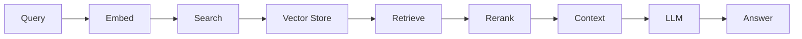

# RAG System Guide

## Retrieval-Augmented Generation Implementation

Complete guide to implementing RAG systems for context-aware agent responses.

---

## RAG Architecture



---

## Implementation

### Basic RAG System

```python
from greenlang.rag import RAGSystem

# Initialize
rag = RAGSystem(
    vector_store='faiss',
    embedding_model='all-mpnet-base-v2',
    llm_provider='openai'
)

# Add documents
await rag.add_document("doc.pdf")
await rag.add_document("report.docx")

# Query
result = await rag.query("What are our emissions?")
print(result.answer)  # Generated answer
print(result.sources)  # Source documents
```

### Document Processing

```python
class DocumentProcessor:
    """Process documents for RAG."""

    async def process(self, file_path: str) -> List[Chunk]:
        """Process document into chunks."""
        # Extract text
        text = await self.extract_text(file_path)

        # Chunk text
        chunks = self.chunk_text(
            text,
            chunk_size=1000,
            overlap=200
        )

        # Generate embeddings
        for chunk in chunks:
            chunk.embedding = await self.embed(chunk.text)

        return chunks

    def chunk_text(
        self,
        text: str,
        chunk_size: int,
        overlap: int
    ) -> List[Chunk]:
        """Chunk text with overlap."""
        chunks = []
        start = 0

        while start < len(text):
            end = start + chunk_size
            chunk_text = text[start:end]

            chunks.append(Chunk(
                text=chunk_text,
                start=start,
                end=end
            ))

            start = end - overlap

        return chunks
```

---

## Vector Search

### FAISS Implementation

```python
import faiss
import numpy as np

class FAISSVectorStore:
    """FAISS vector store."""

    def __init__(self, dimension: int = 768):
        self.dimension = dimension
        self.index = faiss.IndexFlatL2(dimension)
        self.documents = []

    def add(self, embeddings: List[List[float]], documents: List[Dict]):
        """Add embeddings to index."""
        vectors = np.array(embeddings).astype('float32')
        self.index.add(vectors)
        self.documents.extend(documents)

    def search(
        self,
        query_embedding: List[float],
        top_k: int = 10
    ) -> List[Dict]:
        """Search for similar vectors."""
        query_vector = np.array([query_embedding]).astype('float32')
        distances, indices = self.index.search(query_vector, top_k)

        results = []
        for dist, idx in zip(distances[0], indices[0]):
            if idx < len(self.documents):
                results.append({
                    'document': self.documents[idx],
                    'score': 1 / (1 + dist)  # Convert distance to similarity
                })

        return results
```

---

## Hybrid Search

### Combining Semantic and Keyword Search

```python
class HybridSearch:
    """Combine semantic and keyword search."""

    async def search(
        self,
        query: str,
        top_k: int = 10,
        semantic_weight: float = 0.7
    ) -> List[Dict]:
        """Hybrid search."""
        # Semantic search
        semantic_results = await self.semantic_search(query, top_k * 2)

        # Keyword search (BM25)
        keyword_results = await self.keyword_search(query, top_k * 2)

        # Combine and rerank
        combined = self.combine_results(
            semantic_results,
            keyword_results,
            semantic_weight
        )

        return combined[:top_k]

    def combine_results(
        self,
        semantic: List[Dict],
        keyword: List[Dict],
        weight: float
    ) -> List[Dict]:
        """Combine results with weighting."""
        scores = {}

        # Weight semantic scores
        for result in semantic:
            doc_id = result['id']
            scores[doc_id] = weight * result['score']

        # Weight keyword scores
        for result in keyword:
            doc_id = result['id']
            if doc_id in scores:
                scores[doc_id] += (1 - weight) * result['score']
            else:
                scores[doc_id] = (1 - weight) * result['score']

        # Sort by combined score
        return sorted(
            scores.items(),
            key=lambda x: x[1],
            reverse=True
        )
```

---

## Best Practices

### Document Chunking
- Chunk size: 1000-2000 tokens
- Overlap: 200 tokens
- Preserve context boundaries
- Include metadata

### Retrieval
- Use hybrid search for better results
- Implement reranking
- Filter by metadata
- Cache frequent queries

### Generation
- Include source citations
- Limit context tokens
- Handle no-match cases
- Validate responses

---

**Last Updated**: November 2024
**Version**: 1.0.0