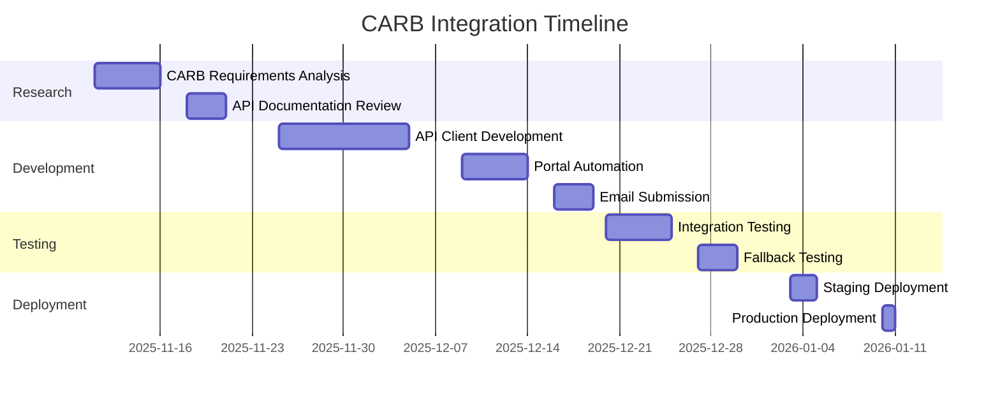

# CARB PORTAL INTEGRATION STRATEGY
# California Air Resources Board Submission System

**Version:** 1.0
**Date:** November 10, 2025
**Status:** Planning Phase
**Integration Target:** Q1 2026

---

## EXECUTIVE SUMMARY

This document outlines the integration strategy for connecting GL-SB253-APP with the California Air Resources Board (CARB) disclosure portal. Given that CARB's official API specifications are not yet published, we present a dual-track approach: primary API integration with comprehensive fallback mechanisms.

---

## 1. CURRENT CARB STATUS

### 1.1 Known Information

**Portal Launch:** December 1, 2025 (public docket for report posting)

**Submission Requirements:**
- Electronic submission mandatory
- GHG Protocol compliance required
- Third-party assurance documentation
- Annual reporting by June 30

**Technical Status:**
- API specifications: Not yet published
- Expected format: JSON/XML
- Authentication: Likely OAuth2
- Portal URL: ww2.arb.ca.gov/ghg-disclosure (expected)

### 1.2 CARB Communication Plan

```yaml
Engagement Timeline:
  November 2025:
    - Contact CARB technical team
    - Request API documentation
    - Join developer preview program (if available)

  December 2025:
    - Review portal when launched
    - Analyze submission formats
    - Test manual submission process

  January 2026:
    - Participate in CARB workshops
    - Submit technical questions
    - Request sandbox access

  February 2026:
    - Finalize integration approach
    - Complete API integration (if available)
    - Test submission pipeline
```

---

## 2. PRIMARY INTEGRATION STRATEGY (API-BASED)

### 2.1 Expected API Architecture

```python
class CARBAPIClient:
    """
    CARB Portal API Client (Primary Strategy)
    """

    def __init__(self):
        self.base_url = "https://ww2.arb.ca.gov/api/v1"
        self.auth_url = "https://ww2.arb.ca.gov/oauth/token"
        self.client_id = os.getenv("CARB_CLIENT_ID")
        self.client_secret = os.getenv("CARB_CLIENT_SECRET")
        self.access_token = None
        self.token_expiry = None

    async def authenticate(self):
        """
        OAuth2 authentication flow
        """
        payload = {
            "grant_type": "client_credentials",
            "client_id": self.client_id,
            "client_secret": self.client_secret,
            "scope": "ghg_disclosure.write ghg_disclosure.read"
        }

        response = await self.post(self.auth_url, payload)

        self.access_token = response["access_token"]
        self.token_expiry = datetime.now() + timedelta(seconds=response["expires_in"])

        return self.access_token

    async def submit_disclosure(self, disclosure):
        """
        Submit annual GHG disclosure to CARB
        """
        # Ensure authenticated
        if not self.access_token or datetime.now() >= self.token_expiry:
            await self.authenticate()

        # Prepare submission
        submission = self.format_disclosure(disclosure)

        # Validate before submission
        validation_result = self.validate_submission(submission)
        if not validation_result.is_valid:
            raise ValidationError(validation_result.errors)

        # Submit to CARB
        headers = {
            "Authorization": f"Bearer {self.access_token}",
            "Content-Type": "application/json"
        }

        response = await self.post(
            f"{self.base_url}/disclosures",
            submission,
            headers=headers
        )

        return {
            "submission_id": response["id"],
            "status": response["status"],
            "receipt": response["receipt_url"]
        }

    def format_disclosure(self, disclosure):
        """
        Format disclosure per CARB requirements
        """
        return {
            "reporting_entity": {
                "legal_name": disclosure.company_name,
                "doing_business_as": disclosure.dba_names,
                "ein": disclosure.ein,
                "ca_entity_number": disclosure.ca_entity_number,
                "annual_revenue": disclosure.revenue,
                "revenue_year": disclosure.revenue_year,
                "naics_code": disclosure.naics_code,
                "headquarters": {
                    "address": disclosure.hq_address,
                    "city": disclosure.hq_city,
                    "state": disclosure.hq_state,
                    "zip": disclosure.hq_zip,
                    "country": disclosure.hq_country
                },
                "ca_operations": {
                    "has_physical_presence": disclosure.ca_physical_presence,
                    "has_sales": disclosure.ca_sales,
                    "sales_amount": disclosure.ca_sales_amount
                }
            },
            "emissions_inventory": {
                "reporting_year": disclosure.reporting_year,
                "inventory_boundary": disclosure.boundary_approach,  # equity, control, etc.
                "scope_1": {
                    "total_mtco2e": disclosure.scope1_total,
                    "stationary_combustion": disclosure.scope1_stationary,
                    "mobile_combustion": disclosure.scope1_mobile,
                    "process_emissions": disclosure.scope1_process,
                    "fugitive_emissions": disclosure.scope1_fugitive
                },
                "scope_2": {
                    "location_based_mtco2e": disclosure.scope2_location,
                    "market_based_mtco2e": disclosure.scope2_market,
                    "renewable_energy_use": disclosure.renewable_percentage
                },
                "scope_3": self.format_scope3(disclosure) if disclosure.reporting_year >= 2027 else None
            },
            "methodology": {
                "calculation_approach": "GHG Protocol Corporate Standard",
                "emission_factors_source": disclosure.factor_sources,
                "data_quality_tier": disclosure.data_quality_tier,
                "estimation_percentage": disclosure.estimation_percentage
            },
            "assurance": {
                "provider_name": disclosure.assurance_provider,
                "provider_license": disclosure.provider_license_number,
                "assurance_level": disclosure.assurance_level,  # limited or reasonable
                "assurance_standard": disclosure.assurance_standard,  # ISAE 3410, AT-105, etc.
                "statement_date": disclosure.assurance_date,
                "statement_url": disclosure.assurance_statement_url
            }
        }
```

### 2.2 API Monitoring & Error Handling

```python
class CARBAPIMonitor:
    """
    Monitor CARB API health and handle errors
    """

    def __init__(self):
        self.retry_config = {
            "max_retries": 3,
            "backoff_factor": 2,
            "retry_statuses": [502, 503, 504]
        }

    async def submit_with_retry(self, client, disclosure):
        """
        Submit with exponential backoff retry
        """
        attempt = 0
        last_error = None

        while attempt < self.retry_config["max_retries"]:
            try:
                result = await client.submit_disclosure(disclosure)

                # Log success
                self.log_submission_success(result)

                return result

            except APIError as e:
                last_error = e

                if e.status_code not in self.retry_config["retry_statuses"]:
                    # Non-retryable error
                    self.log_submission_failure(e)
                    raise

                # Calculate backoff
                wait_time = self.retry_config["backoff_factor"] ** attempt

                self.log_retry_attempt(attempt, wait_time)
                await asyncio.sleep(wait_time)

                attempt += 1

        # Max retries exceeded
        self.trigger_fallback_strategy(disclosure, last_error)
        raise MaxRetriesExceeded(last_error)

    def trigger_fallback_strategy(self, disclosure, error):
        """
        Activate fallback submission method
        """
        notification = {
            "alert": "CARB API submission failed",
            "error": str(error),
            "fallback": "Manual submission required",
            "disclosure_id": disclosure.id,
            "deadline": disclosure.deadline
        }

        # Notify operations team
        self.send_alert(notification)

        # Generate manual submission package
        self.generate_manual_package(disclosure)
```

---

## 3. FALLBACK STRATEGIES

### 3.1 Semi-Automated Portal Submission

```python
class CARBPortalAutomation:
    """
    Selenium-based portal automation (Fallback Strategy 1)
    """

    def __init__(self):
        self.driver = webdriver.Chrome()
        self.portal_url = "https://ww2.arb.ca.gov/ghg-disclosure-portal"

    def submit_via_portal(self, disclosure):
        """
        Automate manual portal submission
        """
        try:
            # Navigate to portal
            self.driver.get(self.portal_url)

            # Login
            self.login(disclosure.credentials)

            # Fill submission form
            self.fill_entity_information(disclosure.entity_info)
            self.fill_emissions_data(disclosure.emissions)
            self.upload_assurance_statement(disclosure.assurance_doc)

            # Submit
            submission_id = self.submit_form()

            # Download receipt
            receipt = self.download_receipt(submission_id)

            return {
                "method": "portal_automation",
                "submission_id": submission_id,
                "receipt": receipt,
                "timestamp": datetime.utcnow()
            }

        except Exception as e:
            self.log_portal_error(e)
            # Fallback to manual process
            return self.generate_manual_package(disclosure)

    def generate_manual_package(self, disclosure):
        """
        Generate complete package for manual submission
        """
        package_dir = f"./submissions/{disclosure.id}"
        os.makedirs(package_dir, exist_ok=True)

        # Generate PDF report
        pdf_path = self.generate_pdf_report(disclosure, package_dir)

        # Export data files
        json_path = self.export_json_data(disclosure, package_dir)
        csv_path = self.export_csv_data(disclosure, package_dir)

        # Create submission checklist
        checklist_path = self.create_checklist(disclosure, package_dir)

        # Generate cover letter
        letter_path = self.generate_cover_letter(disclosure, package_dir)

        return {
            "method": "manual_package",
            "package_dir": package_dir,
            "files": {
                "report": pdf_path,
                "data_json": json_path,
                "data_csv": csv_path,
                "checklist": checklist_path,
                "cover_letter": letter_path
            },
            "instructions": self.generate_submission_instructions()
        }
```

### 3.2 Email Submission Fallback

```python
class CARBEmailSubmission:
    """
    Email-based submission (Fallback Strategy 2)
    """

    def __init__(self):
        self.carb_email = "ghg-disclosure@arb.ca.gov"  # Expected
        self.smtp_server = SMTPServer()

    async def submit_via_email(self, disclosure):
        """
        Submit disclosure via email with attachments
        """
        # Generate all required documents
        documents = self.prepare_documents(disclosure)

        # Create email
        email = {
            "to": self.carb_email,
            "cc": disclosure.company_email,
            "subject": f"GHG Disclosure Submission - {disclosure.company_name} - {disclosure.reporting_year}",
            "body": self.generate_email_body(disclosure),
            "attachments": documents
        }

        # Send with delivery confirmation
        result = await self.smtp_server.send_with_confirmation(email)

        # Archive submission
        self.archive_submission(disclosure, email, result)

        return {
            "method": "email_submission",
            "tracking_id": result.tracking_id,
            "delivery_status": result.delivery_status,
            "timestamp": result.timestamp
        }

    def prepare_documents(self, disclosure):
        """
        Prepare all required documents for email submission
        """
        documents = []

        # Main disclosure report (PDF)
        documents.append({
            "filename": f"GHG_Disclosure_{disclosure.company_name}_{disclosure.reporting_year}.pdf",
            "content": self.generate_pdf_report(disclosure),
            "mime_type": "application/pdf"
        })

        # Data file (Excel)
        documents.append({
            "filename": f"Emissions_Data_{disclosure.reporting_year}.xlsx",
            "content": self.generate_excel_data(disclosure),
            "mime_type": "application/vnd.openxmlformats-officedocument.spreadsheetml.sheet"
        })

        # Assurance statement
        documents.append({
            "filename": "Third_Party_Assurance_Statement.pdf",
            "content": disclosure.assurance_statement,
            "mime_type": "application/pdf"
        })

        # Supporting documentation
        for doc in disclosure.supporting_docs:
            documents.append(doc)

        return documents
```

---

## 4. IMPLEMENTATION TIMELINE

### 4.1 Development Phases



### 4.2 Milestones

| Date | Milestone | Deliverable |
|------|-----------|-------------|
| Nov 15, 2025 | Requirements Complete | CARB integration spec |
| Dec 1, 2025 | Portal Launch | Access portal, analyze |
| Dec 20, 2025 | API Client Ready | Primary integration complete |
| Dec 31, 2025 | Fallbacks Ready | All strategies tested |
| Jan 10, 2026 | Production Ready | Full integration live |

---

## 5. TESTING STRATEGY

### 5.1 Test Scenarios

```python
class CARBIntegrationTests:
    """
    Comprehensive CARB integration test suite
    """

    def test_successful_api_submission(self):
        """Test happy path API submission"""
        disclosure = create_test_disclosure()
        result = carb_client.submit_disclosure(disclosure)
        assert result.status == "accepted"

    def test_api_authentication_failure(self):
        """Test OAuth authentication error handling"""
        with invalid_credentials():
            assert fallback_activated()

    def test_api_timeout_handling(self):
        """Test API timeout and retry logic"""
        with simulated_timeout():
            assert retry_attempted(times=3)
            assert fallback_triggered()

    def test_portal_automation_fallback(self):
        """Test Selenium-based portal submission"""
        with api_unavailable():
            result = submit_via_portal()
            assert result.method == "portal_automation"

    def test_email_submission_fallback(self):
        """Test email-based submission"""
        with all_systems_down():
            result = submit_via_email()
            assert result.method == "email_submission"

    def test_data_validation(self):
        """Test CARB data validation rules"""
        invalid_disclosure = create_invalid_disclosure()
        with pytest.raises(ValidationError) as e:
            carb_client.submit_disclosure(invalid_disclosure)
        assert "validation_failed" in str(e)

    def test_multi_company_batch_submission(self):
        """Test batch submission for multiple entities"""
        disclosures = create_batch_disclosures(count=10)
        results = carb_client.batch_submit(disclosures)
        assert len(results) == 10
        assert all(r.status == "accepted" for r in results)
```

### 5.2 Mock CARB Environment

```yaml
Mock CARB Setup:
  docker_compose:
    carb_mock_api:
      image: mock-carb-api:latest
      ports:
        - 8080:8080
      environment:
        - MOCK_MODE=true
        - RESPONSE_DELAY_MS=100
        - ERROR_RATE=0.1

    carb_mock_portal:
      image: mock-carb-portal:latest
      ports:
        - 8081:8081
      environment:
        - PORTAL_VERSION=2025.12

  test_data:
    - valid_submissions: 100
    - invalid_submissions: 20
    - edge_cases: 15
```

---

## 6. MONITORING & ALERTS

### 6.1 Monitoring Dashboard

```python
class CARBMonitoringDashboard:
    """
    Real-time CARB integration monitoring
    """

    metrics = {
        "submission_success_rate": Gauge("carb_submission_success_rate"),
        "submission_latency": Histogram("carb_submission_latency_seconds"),
        "api_availability": Gauge("carb_api_availability"),
        "fallback_activations": Counter("carb_fallback_activations"),
        "validation_failures": Counter("carb_validation_failures")
    }

    alerts = {
        "api_down": {
            "condition": "api_availability < 0.5 for 5m",
            "severity": "critical",
            "notification": ["ops_team", "on_call"]
        },
        "high_failure_rate": {
            "condition": "submission_success_rate < 0.8 for 10m",
            "severity": "warning",
            "notification": ["dev_team"]
        },
        "deadline_approaching": {
            "condition": "days_to_deadline < 7",
            "severity": "info",
            "notification": ["compliance_team"]
        }
    }
```

### 6.2 Compliance Tracking

```sql
-- CARB Submission Tracking Dashboard
CREATE VIEW carb_submission_status AS
SELECT
    company_name,
    ein,
    reporting_year,
    submission_status,
    submission_method,
    submission_date,
    assurance_status,
    CASE
        WHEN submission_date IS NULL THEN 'Not Submitted'
        WHEN submission_date <= deadline_date THEN 'On Time'
        ELSE 'Late'
    END as compliance_status,
    deadline_date - CURRENT_DATE as days_remaining
FROM
    disclosure_submissions
WHERE
    state = 'CA'
ORDER BY
    days_remaining ASC;
```

---

## 7. CONTINGENCY PLANNING

### 7.1 Scenario Planning

| Scenario | Probability | Impact | Response |
|----------|------------|--------|----------|
| CARB API delayed | High | Medium | Use portal automation |
| API specs change | Medium | High | Rapid adaptation sprint |
| Portal unavailable | Low | Critical | Email submission ready |
| Mass submission surge | Medium | Medium | Queue management system |
| Assurance delays | Medium | High | Provisional submission |

### 7.2 Communication Protocol

```yaml
Escalation Matrix:
  Level_1_Issue:
    examples: [single_submission_failure, minor_validation_error]
    response_time: 1 hour
    notify: [dev_team]

  Level_2_Issue:
    examples: [api_outage, portal_down]
    response_time: 15 minutes
    notify: [dev_team, ops_team, product_manager]

  Level_3_Issue:
    examples: [complete_system_failure, deadline_risk]
    response_time: immediate
    notify: [all_stakeholders, executive_team, legal]
```

---

## 8. SUCCESS CRITERIA

### 8.1 Launch Criteria

- [ ] CARB API client fully tested
- [ ] All fallback strategies operational
- [ ] 10+ successful test submissions
- [ ] Monitoring dashboard live
- [ ] Support documentation complete
- [ ] Customer training materials ready

### 8.2 Production Metrics

| Metric | Target | Acceptable | Critical |
|--------|--------|------------|----------|
| Submission Success Rate | > 99% | > 95% | < 90% |
| Average Submission Time | < 30s | < 2m | > 5m |
| API Uptime | > 99.9% | > 99% | < 95% |
| Customer Satisfaction | > 4.5/5 | > 4.0/5 | < 3.5/5 |

---

## APPROVAL

| Role | Name | Date |
|------|------|------|
| Technical Lead | | |
| CARB Integration Lead | | |
| Compliance Officer | | |
| Product Manager | | |

---

**Document Version:** 1.0
**Last Updated:** November 10, 2025
**Next Review:** December 1, 2025 (CARB portal launch)