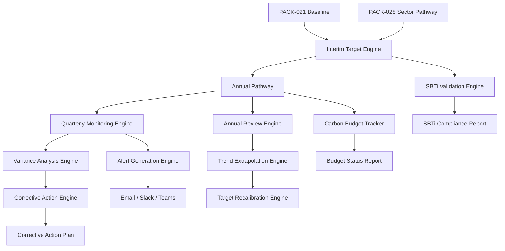

# PACK-029: Interim Targets Pack

**Pack ID:** PACK-029-interim-targets
**Category:** Net Zero Packs
**Tier:** Professional
**Version:** 1.0.0
**Status:** Production Ready
**Date:** 2026-03-19
**Author:** GreenLang Platform Engineering
**Prerequisites:** PACK-021 Net Zero Starter Pack (recommended), PACK-028 Sector Pathway Pack (recommended)

---

## Table of Contents

1. [Executive Summary](#executive-summary)
2. [Quick Start Guide](#quick-start-guide)
3. [Architecture Overview](#architecture-overview)
4. [Core Components](#core-components)
5. [Installation Guide](#installation-guide)
6. [Configuration Guide](#configuration-guide)
7. [Usage Examples](#usage-examples)
8. [Interim Target Methodology](#interim-target-methodology)
9. [Progress Monitoring](#progress-monitoring)
10. [Variance Analysis](#variance-analysis)
11. [Corrective Action Planning](#corrective-action-planning)
12. [SBTi Compliance](#sbti-compliance)
13. [Security Model](#security-model)
14. [Performance Specifications](#performance-specifications)
15. [Troubleshooting](#troubleshooting)
16. [Frequently Asked Questions](#frequently-asked-questions)
17. [Related Documentation](#related-documentation)

---

## Executive Summary

### What is PACK-029?

PACK-029 is the **Interim Targets Pack** -- the fifth pack in the GreenLang "Net Zero Packs" category. It provides comprehensive interim target setting, progress monitoring, variance analysis, and corrective action planning for organizations on their net-zero journey. The pack bridges the gap between long-term net-zero commitments and near-term operational planning by decomposing multi-decade targets into actionable 5-year and annual milestones.

Unlike point-in-time target-setting tools, PACK-029 operates as a continuous monitoring and adaptive management system, tracking quarterly performance against interim targets, investigating variances using LMDI (Logarithmic Mean Divisia Index) decomposition, and generating corrective action plans when organizations fall off track.

### Why Interim Targets Matter

Setting a net-zero target for 2050 is only the first step. Without interim milestones and a monitoring framework, organizations risk:

- **Drift**: Gradual divergence from the pathway without detection until too late to correct
- **Ambiguity**: Lack of clarity on what "on track" means in any given year
- **Inaction**: Deferring difficult reductions to future years (back-loading)
- **Reporting gaps**: Inability to demonstrate progress to SBTi, CDP, TCFD, or investors
- **Misallocation**: Investing in initiatives that do not close the gap to target

PACK-029 addresses all five risks by creating a structured system of interim milestones, quarterly monitoring cycles, variance investigation, and corrective action planning.

### Key Capabilities

| Capability | Description |
|-----------|-------------|
| **Interim Target Setting** | 5-year and 10-year targets with SBTi validation (21 criteria), linear/front-loaded/back-loaded/milestone-based pathways |
| **Quarterly Progress Monitoring** | Red/amber/green performance scoring, automated alert generation, trend extrapolation |
| **Annual Progress Review** | Year-over-year comparison, cumulative budget tracking, pathway adherence scoring |
| **LMDI Variance Analysis** | Logarithmic Mean Divisia Index decomposition into activity, intensity, and structural effects |
| **Corrective Action Planning** | Gap-to-target quantification, initiative portfolio optimization (MACC curve), catch-up timeline |
| **Annual Reporting** | CDP C4.1/C4.2 export, TCFD Metrics and Targets, SBTi annual disclosure |
| **Target Recalibration** | Trigger-based recalculation (acquisitions, divestments, methodology changes) |
| **SBTi 21-Criteria Validation** | Automated validation against all 21 SBTi Corporate Net-Zero Standard criteria |
| **Scope-Specific Timelines** | Separate Scope 1+2, Scope 3, and FLAG pathways with configurable lag |
| **Zero-Hallucination** | All calculations use deterministic Decimal arithmetic; no LLM in any calculation path |

### How PACK-029 Differs from Other Net Zero Packs

| Dimension | PACK-021 (Starter) | PACK-022 (Acceleration) | PACK-028 (Sector Pathway) | **PACK-029 (Interim Targets)** |
|-----------|-------------------|------------------------|--------------------------|-------------------------------|
| **Focus** | Getting started | Accelerating reduction | Sector-specific pathways | **Interim milestones + monitoring** |
| **Target granularity** | Long-term only | Near + long-term | Sector pathway milestones | **5-year, annual, quarterly** |
| **Monitoring** | Annual snapshot | Quarterly summary | Sector convergence check | **Quarterly monitoring + alerts** |
| **Variance analysis** | Basic delta | Category attribution | Sector intensity gap | **LMDI decomposition (perfect)** |
| **Corrective actions** | Generic recommendations | MACC-based actions | Sector technology levers | **Gap closure planning + MACC** |
| **SBTi validation** | Basic check | Target validation | SDA pathway validation | **21-criteria full validation** |
| **Reporting** | GHG inventory | CDP basic | Sector-specific reports | **CDP C4.1/C4.2 + TCFD + SBTi** |
| **Recalibration** | Manual | Manual | Manual | **Trigger-based automatic** |
| **Pathway shapes** | Linear only | Linear + exponential | 4 convergence models | **5 shapes (linear, front/back-loaded, milestone, constant rate)** |
| **Budget tracking** | None | None | None | **Cumulative carbon budget** |

### Target Users

| Persona | Role | Key PACK-029 Value |
|---------|------|-------------------|
| Sustainability Director | Climate strategy lead | Quarterly dashboard, annual review, corrective action triggers |
| Climate Target Manager | Interim target owner | Target setting, milestone monitoring, variance investigation |
| Board Member | Climate governance | Red/amber/green score, progress trend, gap analysis |
| SBTi Submission Lead | Target validation specialist | 21-criteria validation, annual disclosure, recalibration triggers |
| CDP Reporting Lead | CDP questionnaire owner | C4.1/C4.2 interim target export, progress data |
| TCFD Reporting Lead | TCFD disclosure owner | Metrics and Targets pillar, forward-looking metrics |
| Finance Director | Budget planning | Corrective action investment requirements, carbon pricing |
| External Auditor | Target verification | Deterministic calculations, SHA-256 provenance, audit trail |
| ESG Analyst | Progress benchmarking | Peer comparison, pathway adherence scoring |

### Success Metrics

| Metric | Target | Measurement |
|--------|--------|-------------|
| SBTi validation accuracy | 100% correct classification | Cross-validation against SBTi manual criteria |
| LMDI perfect decomposition | Sum of effects = total variance (always) | Mathematical proof + 500+ test scenarios |
| Variance analysis accuracy | +/-0.1% from manual calculation | 200+ variance decomposition tests |
| Quarterly monitoring latency | Less than 500ms per engine | Performance benchmark suite |
| Workflow completion | Less than 5s per workflow | End-to-end performance tests |
| Test pass rate | 100% | 1,300+ tests, all passing |
| Code coverage | 92%+ | Measured by pytest-cov |
| CDP export accuracy | 100% field coverage | CDP C4.1/C4.2 schema validation |

---

## Quick Start Guide

### Prerequisites

- GreenLang platform v1.0+ deployed
- PostgreSQL 16 with TimescaleDB extension
- Redis 7+ cache cluster
- Python 3.11+ runtime
- Platform migrations V001-V128 applied
- PACK-029 migrations V196-V210 applied
- PACK-021 (recommended) for baseline data

### Step 1: Install the Pack

```bash
# From the GreenLang root directory
cd packs/net-zero/PACK-029-interim-targets

# Install dependencies
pip install -r requirements.txt

# Verify pack structure
python -c "from engines.interim_target_engine import InterimTargetEngine; print('PACK-029 loaded successfully')"
```

### Step 2: Run the Health Check

```python
from integrations.health_check import HealthCheck

hc = HealthCheck()
result = hc.run()
print(f"Health Score: {result.overall_score}/100")
print(f"Status: {result.status}")

# Verify all categories pass
for category in result.categories:
    print(f"  [{category.status}] {category.name}: {category.score}/100")

# Expected output:
# Health Score: 100/100
# Status: HEALTHY
```

### Step 3: Set Interim Targets

```python
import asyncio
from engines.interim_target_engine import (
    InterimTargetEngine,
    InterimTargetInput,
    BaselineData,
    LongTermTarget,
    ClimateAmbition,
    PathwayShape,
)

engine = InterimTargetEngine()

input_data = InterimTargetInput(
    entity_name="Acme Corp",
    entity_id="acme-001",
    baseline=BaselineData(
        base_year=2021,
        scope_1_tco2e=50_000,
        scope_2_tco2e=30_000,
        scope_3_tco2e=120_000,
    ),
    long_term_target=LongTermTarget(
        target_year=2050,
        reduction_pct=90,
        net_zero_year=2050,
    ),
    ambition_level=ClimateAmbition.CELSIUS_1_5,
    pathway_shape=PathwayShape.LINEAR,
    generate_5_year_targets=True,
    generate_10_year_targets=True,
    include_sbti_validation=True,
)

result = asyncio.run(engine.calculate(input_data))

print(f"Entity: {result.entity_name}")
print(f"Baseline: {result.baseline_total_tco2e:,.0f} tCO2e ({result.baseline_year})")
print(f"Net Zero Year: {result.net_zero_year}")
print(f"Temperature Score: {result.implied_temperature_score}C")
print(f"SBTi Compliant: {result.sbti_validation.is_compliant}")
print(f"Provenance Hash: {result.provenance_hash[:16]}...")

print("\n5-Year Targets:")
for t in result.five_year_targets:
    print(f"  {t.year}: {t.target_tco2e:>12,.0f} tCO2e ({t.reduction_pct}% reduction)")

print("\nScope Timelines:")
for tl in result.scope_timelines:
    print(f"  {tl.scope}: Near-term {tl.near_term_year} = {tl.near_term_reduction_pct}%, "
          f"Long-term {tl.long_term_year} = {tl.long_term_reduction_pct}%")
```

### Step 4: Monitor Quarterly Progress

```python
from engines.quarterly_monitoring_engine import QuarterlyMonitoringEngine

engine = QuarterlyMonitoringEngine()

result = engine.monitor(
    entity_id="acme-001",
    reporting_quarter="2025-Q2",
    actual_emissions_tco2e=45_000,
    target_emissions_tco2e=47_500,
    scope="scope_1_2",
)

print(f"Quarter: {result.quarter}")
print(f"Status: {result.rag_status}")  # RED / AMBER / GREEN
print(f"Actual: {result.actual_tco2e:,.0f} tCO2e")
print(f"Target: {result.target_tco2e:,.0f} tCO2e")
print(f"Variance: {result.variance_pct:+.1f}%")
print(f"Trend: {result.trend_direction}")
```

### Step 5: Investigate Variance

```python
from engines.variance_analysis_engine import VarianceAnalysisEngine

engine = VarianceAnalysisEngine()

result = engine.analyze(
    entity_id="acme-001",
    period="2024",
    baseline_emissions=200_000,
    actual_emissions=185_000,
    target_emissions=178_000,
    activity_data={"revenue": 500_000_000, "production": 1_200_000},
    baseline_activity={"revenue": 450_000_000, "production": 1_100_000},
)

print(f"Total Variance: {result.total_variance_tco2e:+,.0f} tCO2e")
print(f"Activity Effect: {result.activity_effect_tco2e:+,.0f} tCO2e")
print(f"Intensity Effect: {result.intensity_effect_tco2e:+,.0f} tCO2e")
print(f"Structural Effect: {result.structural_effect_tco2e:+,.0f} tCO2e")
print(f"Perfect Decomposition: {result.is_perfect_decomposition}")
# Always True: activity + intensity + structural = total variance
```

### Step 6: Plan Corrective Actions

```python
from engines.corrective_action_engine import CorrectiveActionEngine

engine = CorrectiveActionEngine()

result = engine.plan(
    entity_id="acme-001",
    gap_tco2e=7_000,  # 185,000 actual - 178,000 target
    available_initiatives=[
        {"name": "LED lighting upgrade", "reduction_tco2e": 2_000, "cost_usd": 500_000},
        {"name": "Heat pump installation", "reduction_tco2e": 3_500, "cost_usd": 1_200_000},
        {"name": "Solar PV installation", "reduction_tco2e": 4_000, "cost_usd": 2_000_000},
        {"name": "Fleet electrification", "reduction_tco2e": 2_500, "cost_usd": 3_000_000},
    ],
    max_budget_usd=3_500_000,
    max_years=3,
)

print(f"Gap to Target: {result.gap_tco2e:,.0f} tCO2e")
print(f"Selected Initiatives: {len(result.selected_initiatives)}")
print(f"Total Reduction: {result.total_reduction_tco2e:,.0f} tCO2e")
print(f"Total Cost: ${result.total_cost_usd:,.0f}")
print(f"Gap Closure: {result.gap_closure_pct:.1f}%")
print(f"Years to Close: {result.years_to_close}")
```

### Step 7: Generate Reports

```python
from templates.interim_targets_summary import InterimTargetsSummaryTemplate
from templates.quarterly_progress_report import QuarterlyProgressReportTemplate

# Interim targets summary
summary = InterimTargetsSummaryTemplate()
output = summary.render(
    interim_result=interim_result,
    format="html",
)

# Quarterly progress report
progress = QuarterlyProgressReportTemplate()
output = progress.render(
    monitoring_result=monitoring_result,
    format="html",
)
```

---

## Architecture Overview

### System Architecture

```
+==============================================================================+
|                           PRESENTATION TIER                                    |
|  +--------------------+  +--------------------+  +--------------------+       |
|  | Interim Targets    |  | Quarterly Progress |  | Variance Analysis |       |
|  | Dashboard (HTML)   |  | Dashboard (HTML)   |  | Report (HTML)     |       |
|  +--------------------+  +--------------------+  +--------------------+       |
|  +--------------------+  +--------------------+  +--------------------+       |
|  | Corrective Action  |  | Annual Review      |  | API Endpoints     |       |
|  | Plan (PDF/HTML)    |  | Report (HTML)      |  | (REST JSON)       |       |
|  +--------------------+  +--------------------+  +--------------------+       |
+==============================================================================+
|                           APPLICATION TIER                                     |
|  +------------------------------------------------------------------------+  |
|  |                   Pack Orchestrator (12-Phase DAG Pipeline)             |  |
|  |  +-----------+ +-----------+ +-----------+ +-----------+ +-----------+||
|  |  | Interim   | | Quarterly | | Annual    | | Variance  | | Corrective|||
|  |  | Target    | | Monitoring| | Review    | | Investig. | | Action    |||
|  |  | Setting   | | Workflow  | | Workflow  | | Workflow  | | Planning  |||
|  |  +-----------+ +-----------+ +-----------+ +-----------+ +-----------+||
|  |                +-----------+ +-----------+                             ||
|  |                | Annual    | | Target    |                             ||
|  |                | Reporting | | Recalib.  |                             ||
|  |                +-----------+ +-----------+                             ||
|  +------------------------------------------------------------------------+  |
|  +------------------------------------------------------------------------+  |
|  |                         10 Engines                                      |  |
|  |  +---------------+ +---------------+ +---------------+ +-------------+ |  |
|  |  | Interim       | | Quarterly     | | Annual        | | Variance    | |  |
|  |  | Target Engine | | Monitor Eng.  | | Review Eng.   | | Analysis    | |  |
|  |  +---------------+ +---------------+ +---------------+ +-------------+ |  |
|  |  +---------------+ +---------------+ +---------------+ +-------------+ |  |
|  |  | Trend         | | Corrective    | | Target        | | SBTi        | |  |
|  |  | Extrapolation | | Action Eng.   | | Recalib. Eng. | | Validation  | |  |
|  |  +---------------+ +---------------+ +---------------+ +-------------+ |  |
|  |  +---------------+ +---------------+                                   |  |
|  |  | Carbon Budget | | Alert         |                                   |  |
|  |  | Tracker Eng.  | | Generation    |                                   |  |
|  |  +---------------+ +---------------+                                   |  |
|  +------------------------------------------------------------------------+  |
+==============================================================================+
|                            DATA TIER                                          |
|  +--------------------+  +--------------------+  +--------------------+      |
|  | PostgreSQL 16      |  | Redis 7            |  | SBTi Criteria     |      |
|  | TimescaleDB        |  | Cache + Sessions   |  | Reference Data    |      |
|  | Pack tables (15)   |  |                    |  |                    |      |
|  +--------------------+  +--------------------+  +--------------------+      |
|  +--------------------+  +--------------------+  +--------------------+      |
|  | PACK-021           |  | PACK-028           |  | MRV Agents (30)   |      |
|  | Baseline/Targets   |  | Sector Pathways    |  | Emissions Data    |      |
|  +--------------------+  +--------------------+  +--------------------+      |
+==============================================================================+
```

### Data Flow

```
Baseline Emissions + Long-Term Target
    |
    v
Interim Target Engine
    |  (SBTi validation, 5-year/10-year milestones, pathway generation)
    v
Annual Pathway (year-by-year targets)
    |
    +---> Quarterly Monitoring Engine
    |         |  (Actual vs. target, RAG status, trend)
    |         v
    |     Quarterly Progress Report + Alerts
    |
    +---> Annual Review Engine
    |         |  (YoY comparison, cumulative budget, pathway adherence)
    |         v
    |     Annual Progress Report
    |
    +---> Variance Analysis Engine (LMDI)
    |         |  (Activity + intensity + structural decomposition)
    |         v
    |     Variance Waterfall Report
    |
    +---> Trend Extrapolation Engine
    |         |  (Linear regression, exponential smoothing, ARIMA)
    |         v
    |     Forecast + Confidence Intervals
    |
    +---> Corrective Action Engine
    |         |  (Gap closure, MACC optimization, initiative selection)
    |         v
    |     Corrective Action Plan
    |
    +---> Carbon Budget Tracker
    |         |  (Cumulative budget, remaining budget, budget burn rate)
    |         v
    |     Budget Status Report
    |
    +---> SBTi Validation Engine
    |         |  (21-criteria validation, compliance check)
    |         v
    |     SBTi Compliance Report
    |
    +---> Target Recalibration Engine
              |  (Trigger detection, automatic recalculation)
              v
          Recalibrated Targets
```

### Component Interaction Diagram



### Key Architectural Decisions

| Decision | Rationale |
|----------|-----------|
| **Deterministic Decimal arithmetic** | SBTi thresholds are hard-coded from Corporate Manual v5.3; no LLM or probabilistic model in calculation path |
| **LMDI perfect decomposition** | Activity + intensity + structural effects always sum exactly to total variance; no residual term |
| **SHA-256 provenance hashing** | Every calculation output is cryptographically hashed for audit trail integrity |
| **Scope-specific timelines** | Scope 1+2, Scope 3, and FLAG emissions follow different reduction trajectories per SBTi guidance |
| **Cumulative carbon budget** | Trapezoidal integration of annual emissions provides remaining budget tracking |
| **Trigger-based recalibration** | Acquisitions, divestments, and methodology changes automatically trigger target recalculation |
| **Modular engine design** | Each engine operates independently; users can run variance analysis without target setting |
| **Cache-friendly calculation** | SBTi thresholds and interim targets are heavily cached in Redis for sub-second response |

---

## Core Components

### Engines (10)

| # | Engine | File | Purpose |
|---|--------|------|---------|
| 1 | Interim Target Engine | `interim_target_engine.py` | 5-year and 10-year interim target calculation with SBTi validation, scope-specific timelines, and 5 pathway shapes |
| 2 | Quarterly Monitoring Engine | `quarterly_monitoring_engine.py` | Quarterly actual-vs-target comparison with RAG status, trend analysis, and alert triggering |
| 3 | Annual Review Engine | `annual_review_engine.py` | Annual progress assessment with YoY comparison, cumulative budget tracking, and pathway adherence scoring |
| 4 | Variance Analysis Engine | `variance_analysis_engine.py` | LMDI decomposition of emissions variance into activity, intensity, and structural effects |
| 5 | Trend Extrapolation Engine | `trend_extrapolation_engine.py` | Linear regression, exponential smoothing, and ARIMA-based emissions forecasting with confidence intervals |
| 6 | Corrective Action Engine | `corrective_action_engine.py` | Gap-to-target quantification and initiative portfolio optimization using MACC curves |
| 7 | Target Recalibration Engine | `target_recalibration_engine.py` | Trigger-based target recalculation for acquisitions, divestments, and methodology changes |
| 8 | SBTi Validation Engine | `sbti_validation_engine.py` | 21-criteria validation against SBTi Corporate Net-Zero Standard v1.2 |
| 9 | Carbon Budget Tracker Engine | `carbon_budget_tracker_engine.py` | Cumulative carbon budget tracking with remaining budget and burn rate calculation |
| 10 | Alert Generation Engine | `alert_generation_engine.py` | Threshold-based alert generation for off-track performance with escalation rules |

### Workflows (7)

| # | Workflow | File | Phases | Purpose |
|---|----------|------|--------|---------|
| 1 | Interim Target Setting Workflow | `interim_target_setting_workflow.py` | 5 | BaselineImport -> InterimCalc -> SBTiValidation -> PathwayGen -> TargetReport |
| 2 | Quarterly Monitoring Workflow | `quarterly_monitoring_workflow.py` | 4 | DataCollection -> ProgressCheck -> TrendAnalysis -> QuarterlyReport |
| 3 | Annual Progress Review Workflow | `annual_progress_review_workflow.py` | 5 | AnnualDataCollect -> YoYComparison -> BudgetCheck -> TrendForecast -> AnnualReport |
| 4 | Variance Investigation Workflow | `variance_investigation_workflow.py` | 4 | DataPrep -> LMDIDecomposition -> RootCauseAttribution -> VarianceReport |
| 5 | Corrective Action Planning Workflow | `corrective_action_planning_workflow.py` | 5 | GapQuantification -> InitiativeScanning -> MACCOptimization -> ScheduleGen -> ActionPlanReport |
| 6 | Annual Reporting Workflow | `annual_reporting_workflow.py` | 4 | DataConsolidation -> CDPExport -> TCFDExport -> SBTiDisclosure |
| 7 | Target Recalibration Workflow | `target_recalibration_workflow.py` | 4 | TriggerDetection -> BaselineAdjustment -> TargetRecalc -> RecalibrationReport |

### Templates (10)

| # | Template | File | Formats | Purpose |
|---|----------|------|---------|---------|
| 1 | Interim Targets Summary | `interim_targets_summary.py` | MD, HTML, JSON, PDF | Overview of all interim targets with scope timelines |
| 2 | Quarterly Progress Report | `quarterly_progress_report.py` | MD, HTML, JSON, PDF | Quarterly RAG status with trend indicators |
| 3 | Annual Progress Report | `annual_progress_report.py` | MD, HTML, JSON, PDF | Annual review with YoY comparison and budget status |
| 4 | Variance Waterfall Report | `variance_waterfall_report.py` | MD, HTML, JSON, PDF | LMDI decomposition waterfall with root cause attribution |
| 5 | Corrective Action Plan Report | `corrective_action_plan_report.py` | MD, HTML, JSON, PDF | Gap closure plan with initiative schedule and investment |
| 6 | SBTi Validation Report | `sbti_validation_report.py` | MD, HTML, JSON, PDF | 21-criteria SBTi compliance assessment |
| 7 | CDP Export Template | `cdp_export_template.py` | JSON, XLSX | CDP C4.1/C4.2 interim target disclosure |
| 8 | TCFD Disclosure Template | `tcfd_disclosure_template.py` | MD, HTML, JSON, PDF | TCFD Metrics and Targets pillar content |
| 9 | Carbon Budget Report | `carbon_budget_report.py` | MD, HTML, JSON, PDF | Cumulative budget status and remaining allowance |
| 10 | Executive Dashboard Template | `executive_dashboard_template.py` | HTML, PDF | Board-level progress dashboard with KPIs |

### Integrations (10)

| # | Integration | File | Purpose |
|---|-------------|------|---------|
| 1 | Pack Orchestrator | `pack_orchestrator.py` | 12-phase DAG pipeline with conditional routing based on monitoring results |
| 2 | PACK-021 Bridge | `pack021_bridge.py` | Baseline emissions and long-term target import from Net Zero Starter Pack |
| 3 | PACK-028 Bridge | `pack028_bridge.py` | Sector pathway and abatement lever import from Sector Pathway Pack |
| 4 | MRV Bridge | `mrv_bridge.py` | All 30 MRV agents for actual emissions calculation by scope |
| 5 | SBTi Portal Bridge | `sbti_portal_bridge.py` | SBTi target submission and annual disclosure integration |
| 6 | CDP Bridge | `cdp_bridge.py` | CDP Climate Change C4.1/C4.2 export and scoring integration |
| 7 | TCFD Bridge | `tcfd_bridge.py` | TCFD Metrics and Targets disclosure integration |
| 8 | Alerting Bridge | `alerting_bridge.py` | Multi-channel alerting (email, Slack, Teams) for off-track performance |
| 9 | Health Check | `health_check.py` | 20-category system verification including data freshness |
| 10 | Setup Wizard | `setup_wizard.py` | 7-step guided interim target configuration wizard |

### Presets (7)

| # | Preset | File | Key Characteristics |
|---|--------|------|---------------------|
| 1 | SBTi 1.5C Aligned | `sbti_15c.yaml` | 42% near-term reduction, 90% long-term, 4.2%/yr annual rate |
| 2 | SBTi Well-Below 2C | `sbti_wb2c.yaml` | 25% near-term, 80% long-term, 2.5%/yr annual rate |
| 3 | Race to Zero | `race_to_zero.yaml` | 50% near-term by 2030, 90% long-term, 7.0%/yr |
| 4 | Corporate Net-Zero | `corporate_net_zero.yaml` | 90% reduction by 2050, FLAG separate targets |
| 5 | Financial Institution | `financial_institution.yaml` | Portfolio alignment, financed emissions targets |
| 6 | SME Simplified | `sme_simplified.yaml` | Scope 1+2 only, simplified monitoring |
| 7 | Manufacturing | `manufacturing.yaml` | Process emissions focus, intensity metrics |

---

## Installation Guide

### System Requirements

| Resource | Minimum | Recommended | Notes |
|----------|---------|-------------|-------|
| CPU | 2 vCPU | 4+ vCPU | LMDI decomposition benefits from more cores |
| RAM | 4 GB | 8 GB | Quarterly data caching + engine processing |
| Storage | 500 MB | 2 GB | Historical monitoring data + reports |
| Database | PostgreSQL 16 + TimescaleDB | Same | 15 pack-specific tables, 3 views |
| Cache | Redis 7+ | Same | Target caching, monitoring results |
| Network | Outbound HTTPS | Same | SBTi/CDP/TCFD integration |
| Python | 3.11+ | 3.12 | Pydantic v2 required |

### Installation Steps

#### 1. Verify Platform Prerequisites

```bash
# Verify Python version
python --version
# Expected: Python 3.11.x or higher

# Verify PostgreSQL connection
psql -h $DB_HOST -U $DB_USER -d greenlang -c "SELECT version();"

# Verify Redis connection
redis-cli -h $REDIS_HOST ping
# Expected: PONG

# Verify platform migrations
psql -h $DB_HOST -U $DB_USER -d greenlang -c \
  "SELECT version FROM schema_migrations ORDER BY version DESC LIMIT 1;"
# Expected: V128 or higher
```

#### 2. Apply Pack Migrations

```bash
# Apply PACK-029 specific migrations (15 migrations)
for i in $(seq 196 210); do
  psql -h $DB_HOST -U $DB_USER -d greenlang -f \
    migrations/V${i}__PACK029_*.sql
done

# Verify migration application
psql -h $DB_HOST -U $DB_USER -d greenlang -c \
  "SELECT version, description FROM schema_migrations WHERE version LIKE 'V19%' OR version LIKE 'V20%' OR version LIKE 'V21%' ORDER BY version;"
```

#### 3. Configure Environment Variables

```bash
# Required environment variables
export INTERIM_TARGETS_DB_HOST="localhost"
export INTERIM_TARGETS_DB_PORT="5432"
export INTERIM_TARGETS_DB_NAME="greenlang"
export INTERIM_TARGETS_REDIS_HOST="localhost"
export INTERIM_TARGETS_REDIS_PORT="6379"
export INTERIM_TARGETS_LOG_LEVEL="INFO"
export INTERIM_TARGETS_PROVENANCE="true"

# Optional: PACK-021 integration
export INTERIM_TARGETS_PACK021_ENABLED="true"
export INTERIM_TARGETS_PACK021_BASE_URL="http://localhost:8021"

# Optional: PACK-028 integration
export INTERIM_TARGETS_PACK028_ENABLED="true"
export INTERIM_TARGETS_PACK028_BASE_URL="http://localhost:8028"

# Optional: Alerting integration
export INTERIM_TARGETS_ALERT_EMAIL_ENABLED="true"
export INTERIM_TARGETS_ALERT_SLACK_WEBHOOK="https://hooks.slack.com/..."
export INTERIM_TARGETS_ALERT_TEAMS_WEBHOOK="https://outlook.office.com/..."
```

#### 4. Run Health Check

```python
from integrations.health_check import HealthCheck

hc = HealthCheck()
result = hc.run()

# Verify all 20 categories pass
for category in result.categories:
    print(f"  [{category.status}] {category.name}: {category.score}/100")

assert result.overall_score >= 90, f"Health check score too low: {result.overall_score}"
```

---

## Configuration Guide

### Configuration Hierarchy

Configuration is resolved in the following order (later overrides earlier):

1. **Base `pack.yaml` manifest** -- default values for all settings
2. **Preset YAML** -- ambition-level-specific overrides (e.g., `sbti_15c.yaml`)
3. **Environment variables** -- `INTERIM_TARGETS_*` prefix overrides
4. **Runtime overrides** -- explicit parameters passed at execution time

### Environment Variables

| Variable | Description | Default |
|----------|-------------|---------|
| `INTERIM_TARGETS_DB_HOST` | PostgreSQL host | `localhost` |
| `INTERIM_TARGETS_DB_PORT` | PostgreSQL port | `5432` |
| `INTERIM_TARGETS_DB_NAME` | Database name | `greenlang` |
| `INTERIM_TARGETS_REDIS_HOST` | Redis host | `localhost` |
| `INTERIM_TARGETS_REDIS_PORT` | Redis port | `6379` |
| `INTERIM_TARGETS_LOG_LEVEL` | Log level | `INFO` |
| `INTERIM_TARGETS_PROVENANCE` | Enable SHA-256 provenance | `true` |
| `INTERIM_TARGETS_PACK021_ENABLED` | Integrate with PACK-021 | `true` |
| `INTERIM_TARGETS_PACK028_ENABLED` | Integrate with PACK-028 | `true` |
| `INTERIM_TARGETS_ALERT_EMAIL_ENABLED` | Email alerts | `false` |
| `INTERIM_TARGETS_ALERT_SLACK_WEBHOOK` | Slack webhook URL | `` |
| `INTERIM_TARGETS_ALERT_TEAMS_WEBHOOK` | Teams webhook URL | `` |
| `INTERIM_TARGETS_MONITORING_FREQUENCY` | Monitoring frequency | `quarterly` |
| `INTERIM_TARGETS_CACHE_TTL` | Cache TTL (seconds) | `3600` |

### Preset Configuration Examples

#### SBTi 1.5C Aligned

```yaml
# sbti_15c.yaml
ambition_level: "1.5c"
annual_rate_pct: 4.2
near_term_reduction_pct: 42
near_term_latest_year: 2030
long_term_reduction_pct: 90
pathway_shape: "linear"
scope_3_lag_years: 0
monitoring:
  frequency: "quarterly"
  rag_thresholds:
    green: 5   # within 5% of target
    amber: 15  # within 15% of target
    red: 15    # more than 15% above target
sbti_validation:
  enabled: true
  criteria_count: 21
```

#### SME Simplified

```yaml
# sme_simplified.yaml
ambition_level: "wb2c"
annual_rate_pct: 2.5
near_term_reduction_pct: 25
pathway_shape: "linear"
scope_3_lag_years: 5
scopes_included: ["scope_1", "scope_2"]
monitoring:
  frequency: "annual"
  rag_thresholds:
    green: 10
    amber: 25
    red: 25
sbti_validation:
  enabled: false
```

---

## Usage Examples

### Example 1: Complete Interim Target Setting with SBTi Validation

```python
from workflows.interim_target_setting_workflow import InterimTargetSettingWorkflow

workflow = InterimTargetSettingWorkflow(preset="sbti_15c")
result = await workflow.execute(
    entity_name="GlobalManufacturing Inc.",
    entity_id="gm-001",
    baseline={
        "base_year": 2021,
        "scope_1_tco2e": 150_000,
        "scope_2_tco2e": 80_000,
        "scope_3_tco2e": 450_000,
        "is_flag_sector": False,
    },
    long_term_target={
        "target_year": 2050,
        "reduction_pct": 90,
    },
)

# Access results
print(f"Interim Targets Set: {len(result.interim_targets.all_milestones)}")
print(f"SBTi Compliant: {result.sbti_validation.is_compliant}")
print(f"Temperature Score: {result.interim_targets.implied_temperature_score}C")
print(f"Checks Passed: {result.sbti_validation.passed_checks}/{result.sbti_validation.total_checks}")
```

### Example 2: Quarterly Monitoring Dashboard

```python
from workflows.quarterly_monitoring_workflow import QuarterlyMonitoringWorkflow

workflow = QuarterlyMonitoringWorkflow()
result = await workflow.execute(
    entity_id="gm-001",
    quarter="2025-Q3",
    actual_data={
        "scope_1_tco2e": 35_200,
        "scope_2_tco2e": 18_500,
        "scope_3_tco2e": 108_000,
    },
)

print(f"Overall RAG Status: {result.overall_rag}")
for scope_result in result.scope_results:
    print(f"  {scope_result.scope}: {scope_result.rag_status} "
          f"(variance: {scope_result.variance_pct:+.1f}%)")
print(f"Alerts Generated: {len(result.alerts)}")
for alert in result.alerts:
    print(f"  [{alert.severity}] {alert.message}")
```

### Example 3: LMDI Variance Decomposition

```python
from engines.variance_analysis_engine import VarianceAnalysisEngine

engine = VarianceAnalysisEngine()

result = engine.lmdi_decompose(
    entity_id="gm-001",
    period_start="2023",
    period_end="2024",
    emissions_start=680_000,
    emissions_end=625_000,
    activity_start={"revenue_usd": 2_000_000_000, "employees": 15_000},
    activity_end={"revenue_usd": 2_200_000_000, "employees": 15_500},
    intensity_start={"tco2e_per_musd": 340},
    intensity_end={"tco2e_per_musd": 284},
)

print("LMDI Decomposition (2023 -> 2024):")
print(f"  Total Change:     {result.total_change_tco2e:+,.0f} tCO2e")
print(f"  Activity Effect:  {result.activity_effect_tco2e:+,.0f} tCO2e")
print(f"  Intensity Effect: {result.intensity_effect_tco2e:+,.0f} tCO2e")
print(f"  Structural Effect:{result.structural_effect_tco2e:+,.0f} tCO2e")
print(f"  Sum of Effects:   {result.sum_of_effects_tco2e:+,.0f} tCO2e")
print(f"  Perfect Decomp:   {result.is_perfect_decomposition}")
# Always True: sum_of_effects == total_change
```

### Example 4: Annual Reporting (CDP + TCFD + SBTi)

```python
from workflows.annual_reporting_workflow import AnnualReportingWorkflow

workflow = AnnualReportingWorkflow()
result = await workflow.execute(
    entity_id="gm-001",
    reporting_year=2025,
    exports=["cdp", "tcfd", "sbti"],
)

# CDP C4.1/C4.2 export
print(f"CDP Export Fields: {len(result.cdp_export.fields)}")
print(f"CDP C4.1 Text: {result.cdp_export.c4_1_text[:100]}...")
print(f"CDP C4.2 Rows: {len(result.cdp_export.c4_2_rows)}")

# TCFD Metrics and Targets
print(f"TCFD Sections: {len(result.tcfd_export.sections)}")

# SBTi Annual Disclosure
print(f"SBTi Disclosure: {result.sbti_disclosure.status}")
```

### Example 5: Target Recalibration After Acquisition

```python
from engines.target_recalibration_engine import TargetRecalibrationEngine

engine = TargetRecalibrationEngine()

result = engine.recalibrate(
    entity_id="gm-001",
    trigger="acquisition",
    trigger_details={
        "acquired_entity": "SubCo Ltd.",
        "acquired_emissions_tco2e": 25_000,
        "acquisition_date": "2025-06-15",
        "scope": "scope_1_2",
    },
    current_baseline_tco2e=680_000,
    current_targets=existing_targets,
)

print(f"Recalibration Trigger: {result.trigger_type}")
print(f"Old Baseline: {result.old_baseline_tco2e:,.0f} tCO2e")
print(f"New Baseline: {result.new_baseline_tco2e:,.0f} tCO2e")
print(f"Baseline Change: {result.baseline_change_pct:+.1f}%")
print(f"Targets Adjusted: {len(result.adjusted_milestones)}")
```

---

## Interim Target Methodology

### SBTi Corporate Net-Zero Standard v1.2

PACK-029 implements the full SBTi Corporate Net-Zero Standard v1.2 methodology for interim target setting.

### Near-Term Targets (5-10 years)

| Ambition Level | Minimum Annual Rate | Minimum Reduction by 2030 | Scope 1+2 Coverage | Scope 3 Coverage |
|---------------|--------------------|--------------------------|--------------------|------------------|
| 1.5C Aligned | 4.2%/yr | 42% | 95% | 67% (if >40% total) |
| Well-Below 2C | 2.5%/yr | 25% | 95% | 67% (if >40% total) |
| 2C Aligned | 1.5%/yr | 15% | 95% | 67% (if >40% total) |
| Race to Zero | 7.0%/yr | 50% | 95% | 67% |

### Long-Term Targets (Net-Zero)

| Criterion | Requirement |
|-----------|-------------|
| Reduction level | 90% or greater from baseline |
| Target year | No later than 2050 |
| Residual emissions | Maximum 10% of baseline |
| Neutralization | Required for residual emissions |
| Scope coverage | All scopes (1, 2, and 3) |

### Pathway Shapes

PACK-029 supports five pathway shapes for interim target interpolation:

1. **Linear**: Equal annual reduction (`pct(t) = total_pct * (t - base) / (target - base)`)
2. **Front-Loaded**: Faster early reductions (`pct(t) = total_pct * sqrt(progress)`)
3. **Back-Loaded**: Slower early, accelerating later (`pct(t) = total_pct * progress^2`)
4. **Constant Rate**: Compound annual reduction (exponential decay)
5. **Milestone-Based**: Custom milestones with linear interpolation between points

### Scope 3 Lag Allowance

SBTi allows a 5-year lag for Scope 3 near-term targets. PACK-029 implements this by:

1. Shifting the Scope 3 effective base year forward by the configured lag (0-5 years)
2. Maintaining the same long-term target year (2050)
3. Calculating Scope 3 annual rates based on the shortened effective period
4. Validating that Scope 3 near-term targets still meet minimum thresholds

---

## Progress Monitoring

### Quarterly Monitoring Cycle

```
Q1 Report (April) -> Q2 Report (July) -> Q3 Report (October) -> Q4/Annual Report (January)
```

### RAG Status Scoring

| Status | Condition | Action Required |
|--------|-----------|----------------|
| GREEN | Actual within 5% of target | Continue current trajectory |
| AMBER | Actual 5-15% above target | Review and identify causes |
| RED | Actual more than 15% above target | Immediate corrective action planning |

### Trend Analysis

PACK-029 tracks rolling quarterly trends to detect drift before it becomes critical:

- **Improving**: Each quarter closer to target than previous
- **Stable**: Within +/-2% of previous quarter
- **Deteriorating**: Each quarter further from target

---

## Variance Analysis

### LMDI Methodology

The Logarithmic Mean Divisia Index (LMDI) provides **perfect decomposition** of emissions changes into contributing factors.

### Kaya Identity

```
E = A x I x C
```

Where:
- **E** = Total emissions (tCO2e)
- **A** = Activity level (revenue, production, etc.)
- **I** = Emission intensity (tCO2e per unit of activity)
- **C** = Carbon content / structural factor

### Perfect Decomposition Property

The LMDI method guarantees:

```
Delta_E = Delta_activity + Delta_intensity + Delta_structural
```

There is no residual term. This mathematical property makes LMDI the preferred decomposition method for GHG variance analysis.

See [docs/CALCULATIONS/VARIANCE_ANALYSIS.md](docs/CALCULATIONS/VARIANCE_ANALYSIS.md) for detailed formulas and worked examples.

---

## Corrective Action Planning

### Gap Closure Framework

When quarterly monitoring reveals off-track performance (AMBER or RED status), the corrective action engine:

1. **Quantifies the gap**: `gap = projected_emissions - target_emissions`
2. **Scans available initiatives**: Retrieves MACC curve from PACK-028 or custom initiative list
3. **Optimizes portfolio**: Selects initiatives that close the gap within budget constraints
4. **Generates timeline**: Creates implementation schedule with quarterly milestones
5. **Calculates investment**: Total cost, cost per tCO2e, payback period

See [docs/CALCULATIONS/CORRECTIVE_ACTIONS.md](docs/CALCULATIONS/CORRECTIVE_ACTIONS.md) for detailed methodology.

---

## SBTi Compliance

### 21-Criteria Validation

PACK-029 validates interim targets against all 21 SBTi Corporate Net-Zero Standard criteria:

| # | Criterion | Description | Auto-Check |
|---|-----------|-------------|-----------|
| 1 | Scope 1+2 coverage | 95% of total Scope 1+2 covered | Boundary completeness |
| 2 | Scope 3 coverage | 67% of total Scope 3 covered | Category coverage |
| 3 | Near-term ambition | Minimum reduction rate met | Rate validation |
| 4 | Near-term timeframe | 5-10 year window | Date range check |
| 5 | Near-term target year | No later than 2030 (1.5C) | Date validation |
| 6 | Long-term reduction | 90% minimum | Threshold check |
| 7 | Long-term timeframe | No later than 2050 | Date validation |
| 8 | No backsliding | Monotonically increasing reduction | Pathway linearity |
| 9 | Base year recency | Within most recent 2 years | Date validation |
| 10 | Scope 3 lag | Maximum 5 years | Lag check |
| 11 | FLAG separate | Separate FLAG targets if applicable | FLAG detection |
| 12 | Absolute target | Absolute or intensity with production growth | Target type check |
| 13 | Double-counting | No scope overlap | Cross-scope reconciliation |
| 14 | Recalculation policy | Defined and documented | Policy check |
| 15 | Base year consistency | Same base year across scopes | Year alignment |
| 16 | Method consistency | GHG Protocol compliant | Method validation |
| 17 | Target boundary | Organizational boundary defined | Boundary check |
| 18 | Exclusions | Exclusions justified and documented | Exclusion review |
| 19 | Renewable energy | RE100 compatible approach | RE methodology check |
| 20 | Carbon credits | Not counted toward near-term target | Credit exclusion |
| 21 | Neutralization | Required for residual emissions | Neutralization plan |

---

## Security Model

### Role-Based Access Control

| Role | Description | Key Permissions |
|------|-------------|----------------|
| `interim_targets_admin` | System administrator | Full configuration, target management |
| `target_manager` | Target setting and monitoring | Create/edit targets, run all engines, generate reports |
| `progress_analyst` | Read-only analyst | View targets, monitoring results, reports (no edits) |
| `auditor` | External/internal auditor | View all data, provenance hashes, audit trail |

### Data Protection

| Control | Implementation |
|---------|---------------|
| Encryption at rest | AES-256-GCM for all target and monitoring data |
| Encryption in transit | TLS 1.3 for all API communication |
| Provenance hashing | SHA-256 on all calculation outputs |
| Audit trail | Immutable append-only log |
| Input validation | Pydantic v2 strict validation on all inputs |

---

## Performance Specifications

### Engine Latency Targets

| Operation | Target | Notes |
|-----------|--------|-------|
| Interim target calculation | Less than 500ms | Single entity |
| Quarterly monitoring | Less than 300ms | Single quarter |
| Annual review | Less than 1 second | Single year |
| LMDI variance analysis | Less than 500ms | Single period |
| Trend extrapolation | Less than 2 seconds | 3 models |
| Corrective action planning | Less than 3 seconds | Portfolio optimization |
| SBTi validation (21 criteria) | Less than 500ms | All criteria |
| Carbon budget tracking | Less than 200ms | Budget lookup |
| Alert generation | Less than 100ms | Threshold check |
| Full workflow | Less than 5 seconds | End-to-end |

### Cache Performance

| Metric | Target |
|--------|--------|
| SBTi threshold cache hit ratio | 99%+ |
| Interim target cache hit ratio | 95%+ |
| Monitoring result cache hit ratio | 90%+ |
| Redis response time (p95) | Less than 5ms |

---

## Troubleshooting

### Common Issues

#### SBTi Validation Fails with "Scope 3 Coverage Below Threshold"

**Symptom:** SBTi validation check #2 fails with scope 3 coverage error.

**Cause:** Scope 3 baseline emissions not provided or too low relative to total.

**Resolution:**
```python
# Verify baseline data includes Scope 3
print(f"Scope 3: {data.baseline.scope_3_tco2e}")
print(f"Total: {data.baseline.total_tco2e}")
# Scope 3 must be provided if >= 40% of total
```

#### LMDI Decomposition Shows Zero Activity Effect

**Symptom:** Activity effect is zero despite business growth.

**Cause:** Activity data not provided or same for both periods.

**Resolution:**
```python
# Ensure activity data differs between periods
print(f"Activity start: {result.activity_start}")
print(f"Activity end: {result.activity_end}")
# Both must be positive and different
```

#### Quarterly Monitoring Shows RED but Trend is Improving

**Symptom:** RAG status is RED but trend indicator shows "improving."

**Cause:** Current emissions are still above threshold, but each quarter is closer to target than the last.

**Resolution:** This is a valid state. The organization is off-track in absolute terms but making progress. The corrective action engine can generate a catch-up plan.

#### Target Recalibration Not Triggering

**Symptom:** After an acquisition, targets are not recalibrated.

**Cause:** Recalibration trigger threshold not met (default: 5% baseline change).

**Resolution:**
```python
# Check trigger threshold
from config.pack_config import PackConfig
config = PackConfig.load()
print(f"Recalibration threshold: {config.recalibration_threshold_pct}%")

# Lower threshold if needed
config.recalibration_threshold_pct = 2.0
```

---

## Frequently Asked Questions

### General

**Q: Do I need PACK-021 or PACK-028 to use PACK-029?**

A: PACK-021 (Net Zero Starter Pack) and PACK-028 (Sector Pathway Pack) are recommended but not required. PACK-029 can operate standalone if you provide baseline emissions and long-term targets directly. However, integrating with PACK-021 provides automated baseline feed, and PACK-028 provides sector-specific pathway context for variance analysis.

**Q: How often should I run quarterly monitoring?**

A: The standard cadence is quarterly (Q1-Q4), aligned with fiscal quarters. However, PACK-029 supports monthly monitoring for organizations that need faster feedback cycles. Set `INTERIM_TARGETS_MONITORING_FREQUENCY=monthly` to enable monthly monitoring.

**Q: Can PACK-029 handle multi-division organizations?**

A: Yes. PACK-029 supports hierarchical target structures where parent entities have aggregate targets and child entities have division-level targets. The carbon budget tracker reconciles upward.

### SBTi

**Q: Does PACK-029 submit targets to SBTi automatically?**

A: PACK-029 generates SBTi-compatible target documentation and validates against all 21 criteria. The SBTi Portal Bridge can format the submission package, but actual submission to SBTi must be done manually through the SBTi portal. Automated submission API is planned for v1.2.

**Q: What happens when SBTi updates its Corporate Standard?**

A: PACK-029 versions all SBTi threshold data. When SBTi releases a new standard version, GreenLang will publish an update with revised thresholds. Existing targets can be revalidated against the new criteria.

### Variance Analysis

**Q: Why does PACK-029 use LMDI instead of simpler variance methods?**

A: LMDI provides perfect decomposition -- the sum of activity, intensity, and structural effects always equals the total emissions change with no residual term. This mathematical property makes LMDI the gold standard for GHG variance analysis, as recommended by the UNFCCC and IPCC.

**Q: Can I add custom decomposition factors beyond activity and intensity?**

A: Yes. The LMDI engine supports up to 5 custom decomposition factors. Common additions include weather normalization, production mix, and fuel mix factors.

### Reporting

**Q: Does PACK-029 export directly to CDP?**

A: Yes. The CDP Export Template generates JSON output matching the CDP Climate Change C4.1 (text description) and C4.2 (target details table) schema. The output can be directly pasted into the CDP online questionnaire or uploaded via the CDP API.

**Q: What TCFD content does PACK-029 generate?**

A: PACK-029 generates content for the TCFD Metrics and Targets pillar, including: GHG emissions by scope, interim targets and progress, forward-looking emissions forecasts, and transition risk linkages to targets.

---

## Related Documentation

| Document | Description |
|----------|-------------|
| [API_REFERENCE.md](docs/API_REFERENCE.md) | Complete API reference for all 10 engines, 7 workflows, 10 templates, and 10 integrations |
| [USER_GUIDE.md](docs/USER_GUIDE.md) | Step-by-step user guide for all 7 workflows |
| [INTEGRATION_GUIDE.md](docs/INTEGRATION_GUIDE.md) | Integration setup for PACK-021, PACK-028, MRV, SBTi, CDP, TCFD |
| [VALIDATION_REPORT.md](docs/VALIDATION_REPORT.md) | Test results (1,300+ tests), accuracy validation, performance benchmarks |
| [DEPLOYMENT_CHECKLIST.md](docs/DEPLOYMENT_CHECKLIST.md) | Production deployment checklist and configuration guide |
| [CHANGELOG.md](docs/CHANGELOG.md) | Version history and release notes |
| [CONTRIBUTING.md](docs/CONTRIBUTING.md) | Development setup, coding standards, contribution guidelines |

### Calculation Guides

| Guide | Topic |
|-------|-------|
| [CALCULATIONS/INTERIM_TARGETS.md](docs/CALCULATIONS/INTERIM_TARGETS.md) | SBTi interim target calculation methodology and worked examples |
| [CALCULATIONS/VARIANCE_ANALYSIS.md](docs/CALCULATIONS/VARIANCE_ANALYSIS.md) | LMDI decomposition formulas, perfect decomposition proof, worked examples |
| [CALCULATIONS/TREND_EXTRAPOLATION.md](docs/CALCULATIONS/TREND_EXTRAPOLATION.md) | Linear regression, exponential smoothing, ARIMA forecasting |
| [CALCULATIONS/CORRECTIVE_ACTIONS.md](docs/CALCULATIONS/CORRECTIVE_ACTIONS.md) | Gap quantification, MACC optimization, catch-up timeline |

### Regulatory Guides

| Guide | Topic |
|-------|-------|
| [REGULATORY/SBTI_COMPLIANCE.md](docs/REGULATORY/SBTI_COMPLIANCE.md) | SBTi Corporate Net-Zero Standard v1.2 compliance guide |
| [REGULATORY/CDP_DISCLOSURE.md](docs/REGULATORY/CDP_DISCLOSURE.md) | CDP C4.1/C4.2 interim target disclosure |
| [REGULATORY/TCFD_DISCLOSURE.md](docs/REGULATORY/TCFD_DISCLOSURE.md) | TCFD Metrics and Targets pillar requirements |
| [REGULATORY/ASSURANCE_REQUIREMENTS.md](docs/REGULATORY/ASSURANCE_REQUIREMENTS.md) | ISO 14064-3 and ISAE 3410 assurance guidance |

### Use Case Guides

| Guide | Use Case |
|-------|----------|
| [USE_CASES/QUARTERLY_MONITORING.md](docs/USE_CASES/QUARTERLY_MONITORING.md) | Quarterly progress tracking walkthrough |
| [USE_CASES/ANNUAL_REVIEW.md](docs/USE_CASES/ANNUAL_REVIEW.md) | Annual progress review with variance analysis |
| [USE_CASES/CORRECTIVE_ACTION.md](docs/USE_CASES/CORRECTIVE_ACTION.md) | Gap closure planning for off-track organizations |

---

## License

Proprietary -- GreenLang Platform. All rights reserved.

## Support

- **Professional Support:** interim-targets-support@greenlang.io
- **Documentation:** docs.greenlang.io/packs/net-zero/interim-targets
- **Slack Channel:** #pack-029-interim-targets
- **SLA:** 99.9% uptime, 4-hour response for P1 issues
