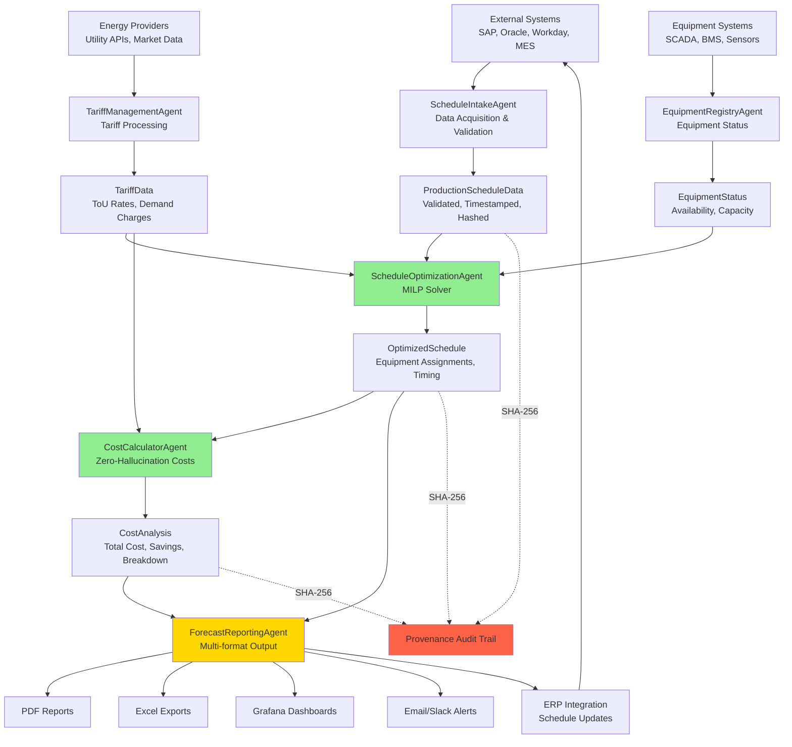

# GL-019 HEATSCHEDULER - Architecture Diagrams

**Visual Architecture Reference**
Last Updated: December 3, 2025

---

## System Architecture Overview

```
+-------------------------------------------------------------------------+
|                           CLIENT LAYER                                   |
|                                                                          |
|  +----------------+  +----------------+  +----------------+              |
|  |  Production    |  |   Energy       |  |   Dashboard    |              |
|  |  Planning UI   |  |   Manager UI   |  |   (Grafana)    |              |
|  +----------------+  +----------------+  +----------------+              |
|  +----------------+  +----------------+  +----------------+              |
|  |  REST API      |  |   WebSocket    |  |   Mobile App   |              |
|  |  Clients       |  |   Clients      |  |   (Optional)   |              |
|  +----------------+  +----------------+  +----------------+              |
+-------------------------------------------------------------------------+
                                |
                                | HTTPS/WSS
                                v
+-------------------------------------------------------------------------+
|                          API GATEWAY LAYER                               |
|                                                                          |
|  +-------------------------------------------------------------------+  |
|  |  FastAPI Application (Port 8000)                                  |  |
|  |  - Authentication/Authorization (OAuth2 + JWT)                    |  |
|  |  - Rate Limiting (100 req/min)                                    |  |
|  |  - Request Validation (Pydantic)                                  |  |
|  |  - WebSocket Subscriptions (schedule updates)                     |  |
|  +-------------------------------------------------------------------+  |
+-------------------------------------------------------------------------+
                                |
                                v
+-------------------------------------------------------------------------+
|                         AGENT PIPELINE LAYER                             |
|                                                                          |
|  +-------------------------------------------------------------------+  |
|  |                    ScheduleIntakeAgent                            |  |
|  |  - ERP/MES data acquisition (SAP, Oracle, Workday)               |  |
|  |  - Production schedule parsing (CSV, JSON, XML, Excel)           |  |
|  |  - Data validation and quality assessment                        |  |
|  |  - Provenance hash generation (SHA-256)                          |  |
|  +-----------------------------+-------------------------------------+  |
|                                |                                         |
|                                v                                         |
|  +-------------------------------------------------------------------+  |
|  |                    TariffManagementAgent                          |  |
|  |  - Real-time energy tariff ingestion                             |  |
|  |  - Time-of-Use (ToU) rate processing                             |  |
|  |  - Demand charge calculation                                      |  |
|  |  - Market price updates (if applicable)                          |  |
|  |  - 100% DETERMINISTIC - NO LLM                                   |  |
|  +-----------------------------+-------------------------------------+  |
|                                |                                         |
|                                v                                         |
|  +-------------------------------------------------------------------+  |
|  |                    EquipmentRegistryAgent                         |  |
|  |  - Heating equipment catalog management                          |  |
|  |  - Availability and maintenance windows                          |  |
|  |  - Capacity and efficiency curves                                |  |
|  |  - Real-time status from SCADA/BMS                               |  |
|  |  - 100% DETERMINISTIC - NO LLM                                   |  |
|  +-----------------------------+-------------------------------------+  |
|                                |                                         |
|                                v                                         |
|  +-------------------------------------------------------------------+  |
|  |                    ScheduleOptimizationAgent                      |  |
|  |  - Mixed-Integer Linear Programming (MILP) solver                |  |
|  |  - Multi-objective optimization (cost, efficiency, constraints)  |  |
|  |  - Equipment scheduling with constraints                         |  |
|  |  - Peak demand management                                         |  |
|  |  - 100% DETERMINISTIC - NO LLM                                   |  |
|  +-----------------------------+-------------------------------------+  |
|                                |                                         |
|                                v                                         |
|  +-------------------------------------------------------------------+  |
|  |                    CostCalculatorAgent                            |  |
|  |  - Zero-hallucination energy cost calculations                   |  |
|  |  - Cost breakdown by tariff component                            |  |
|  |  - Savings calculation vs. baseline                              |  |
|  |  - 100% DETERMINISTIC - NO LLM                                   |  |
|  +-----------------------------+-------------------------------------+  |
|                                |                                         |
|                                v                                         |
|  +-------------------------------------------------------------------+  |
|  |                    ForecastReportingAgent                         |  |
|  |  - Cost savings forecast generation                              |  |
|  |  - PDF/Excel report generation                                   |  |
|  |  - Schedule visualization                                         |  |
|  |  - Notifications (email, Slack, webhook)                         |  |
|  |  - LLM for narrative recommendations ONLY                        |  |
|  +-------------------------------------------------------------------+  |
+-------------------------------------------------------------------------+
                                |
                +---------------+---------------+
                |               |               |
                v               v               v
+------------------+ +------------------+ +------------------+
|  DATA LAYER      | |  INTEGRATION     | |  MONITORING      |
|                  | |  LAYER           | |  LAYER           |
+------------------+ +------------------+ +------------------+
        |                     |                     |
        v                     v                     v
+------------------+ +------------------+ +------------------+
| PostgreSQL 14+   | | SAP Connector    | | Prometheus       |
| (Schedule Data)  | | (RFC/BAPI)       | | Exporter         |
+------------------+ +------------------+ +------------------+
| Redis Cache      | | Oracle Connector | | Grafana          |
| (State/Tariffs)  | | (REST/JDBC)      | | Dashboard        |
+------------------+ +------------------+ +------------------+
| Config Store     | | Energy Mgmt API  | | Alert            |
| (YAML)           | | (SCADA/BMS)      | | Manager          |
+------------------+ +------------------+ +------------------+
```

---

## Agent Pipeline Data Flow



---

## Six-Agent Pipeline Architecture

```
+--------------------------------------------------------------------------+
|                      GL-019 HEATSCHEDULER PIPELINE                       |
|                           (6-Agent Architecture)                          |
+--------------------------------------------------------------------------+

           +------------------+
           |  EXTERNAL DATA   |
           |  SOURCES         |
           +--------+---------+
                    |
    +---------------+---------------+---------------+
    |               |               |               |
    v               v               v               v
+-------+       +-------+       +-------+       +-------+
| SAP   |       |Oracle |       |Energy |       | SCADA |
| ERP   |       | ERP   |       | Tariff|       | /BMS  |
+---+---+       +---+---+       +---+---+       +---+---+
    |               |               |               |
    +-------+-------+               |               |
            |                       |               |
            v                       v               v
    +--------------+        +--------------+  +--------------+
    |   AGENT 1    |        |   AGENT 2    |  |   AGENT 3    |
    |   Schedule   |        |   Tariff     |  |   Equipment  |
    |   Intake     |        |   Management |  |   Registry   |
    |              |        |              |  |              |
    | - Parse      |        | - ToU rates  |  | - Avail.     |
    | - Validate   |        | - Demand chg |  | - Capacity   |
    | - Hash       |        | - Market     |  | - Efficiency |
    +--------------+        +--------------+  +--------------+
            |                       |               |
            +-----------+-----------+---------------+
                        |
                        v
            +-----------------------+
            |       AGENT 4         |
            |  Schedule             |
            |  Optimization         |
            |                       |
            | - MILP Solver         |
            | - Constraint handling |
            | - Peak management     |
            | - Equipment assign    |
            +-----------+-----------+
                        |
                        v
            +-----------------------+
            |       AGENT 5         |
            |  Cost                 |
            |  Calculator           |
            |                       |
            | - Energy costs        |
            | - Demand charges      |
            | - Savings calc        |
            | - Cost breakdown      |
            +-----------+-----------+
                        |
                        v
            +-----------------------+
            |       AGENT 6         |
            |  Forecast             |
            |  Reporting            |
            |                       |
            | - Reports (PDF/Excel) |
            | - Dashboards          |
            | - Notifications       |
            | - ERP updates         |
            +-----------+-----------+
                        |
        +---------------+---------------+
        |               |               |
        v               v               v
    +-------+       +-------+       +-------+
    | PDF   |       |Grafana|       | ERP   |
    |Report |       |Dashbd |       |Update |
    +-------+       +-------+       +-------+
```

---

## Schedule Optimization Data Flow (Detail)

```
+--------------------------------------------------------------------------+
|                   PRODUCTION PLANNING SYSTEMS                             |
|                                                                           |
|  +-----------------+  +-----------------+  +-----------------+            |
|  |   SAP PP/PM     |  |   Oracle SCM    |  |   Workday       |            |
|  |   (Production)  |  |   (Supply)      |  |   (Workforce)   |            |
|  +--------+--------+  +--------+--------+  +--------+--------+            |
|           |                    |                    |                     |
|           +--------------------+--------------------+                     |
|                                |                                          |
+--------------------------------|------------------------------------------+
                                 |
                                 v
+--------------------------------------------------------------------------+
|                   SCHEDULE INTAKE AGENT                                   |
|                                                                           |
|  +--------------------------------------------------------------------+  |
|  |  ERP Connector (SAP RFC, Oracle REST, Generic API)                 |  |
|  |  - Async I/O for non-blocking communication                        |  |
|  |  - Auto-retry with exponential backoff                             |  |
|  |  - Multi-format parsing (JSON, XML, CSV, Excel)                    |  |
|  +-----------------------------+--------------------------------------+  |
|                                |                                          |
|                                v                                          |
|  +--------------------------------------------------------------------+  |
|  |  Production Schedule Parser                                        |  |
|  |  - Job extraction (product, quantity, deadline)                    |  |
|  |  - Heating requirements calculation                                |  |
|  |  - Priority assignment                                             |  |
|  |  - Constraint extraction (must-run, cannot-run windows)            |  |
|  +-----------------------------+--------------------------------------+  |
|                                |                                          |
|                                v                                          |
|  +--------------------------------------------------------------------+  |
|  |  Data Validation & Provenance                                      |  |
|  |  - Schema validation (Pydantic)                                    |  |
|  |  - Range checks (temperatures, capacities)                         |  |
|  |  - SHA-256 provenance hash                                         |  |
|  |  - Timestamp normalization (UTC)                                   |  |
|  +-----------------------------+--------------------------------------+  |
+--------------------------------|------------------------------------------+
                                 |
                                 v
+--------------------------------------------------------------------------+
|                   TARIFF MANAGEMENT AGENT                                 |
|                                                                           |
|  +--------------------------------------------------------------------+  |
|  |  Tariff Data Ingestion                                             |  |
|  |  - Utility API integration                                         |  |
|  |  - Time-of-Use (ToU) schedule parsing                              |  |
|  |  - Demand charge tiers                                             |  |
|  |  - Real-time market prices (if applicable)                         |  |
|  +--------------------------------------------------------------------+  |
|                                                                           |
|  +--------------------------------------------------------------------+  |
|  |  Tariff Data Structure                                             |  |
|  |  +------------------------------------------------------------+   |  |
|  |  | Period       | Rate ($/kWh) | Demand ($/kW) | Category     |   |  |
|  |  |--------------|--------------|---------------|--------------|   |  |
|  |  | 00:00-06:00  | $0.045       | $8.00         | Off-Peak     |   |  |
|  |  | 06:00-10:00  | $0.085       | $12.00        | Mid-Peak     |   |  |
|  |  | 10:00-14:00  | $0.125       | $18.00        | On-Peak      |   |  |
|  |  | 14:00-18:00  | $0.145       | $22.00        | Critical     |   |  |
|  |  | 18:00-22:00  | $0.085       | $12.00        | Mid-Peak     |   |  |
|  |  | 22:00-00:00  | $0.045       | $8.00         | Off-Peak     |   |  |
|  |  +------------------------------------------------------------+   |  |
|  +--------------------------------------------------------------------+  |
+--------------------------------------------------------------------------+
                                 |
                                 v
+--------------------------------------------------------------------------+
|                   EQUIPMENT REGISTRY AGENT                                |
|                                                                           |
|  +--------------------------------------------------------------------+  |
|  |  Equipment Catalog                                                 |  |
|  |  +------------------------------------------------------------+   |  |
|  |  | Equipment ID | Type         | Capacity | Efficiency | Status|   |  |
|  |  |--------------|--------------|----------|------------|-------|   |  |
|  |  | HTR-001      | Gas Boiler   | 500 kW   | 92%        | Online|   |  |
|  |  | HTR-002      | Electric     | 250 kW   | 98%        | Online|   |  |
|  |  | HTR-003      | Gas Boiler   | 750 kW   | 88%        | Maint |   |  |
|  |  | HTR-004      | Heat Pump    | 300 kW   | 350% COP   | Online|   |  |
|  |  +------------------------------------------------------------+   |  |
|  +--------------------------------------------------------------------+  |
|                                                                           |
|  +--------------------------------------------------------------------+  |
|  |  Real-Time Status (SCADA/BMS)                                      |  |
|  |  - Equipment availability                                          |  |
|  |  - Current load                                                    |  |
|  |  - Maintenance windows                                             |  |
|  |  - Efficiency degradation                                          |  |
|  +--------------------------------------------------------------------+  |
+--------------------------------------------------------------------------+
                                 |
                                 v
+--------------------------------------------------------------------------+
|                   SCHEDULE OPTIMIZATION AGENT                             |
|                                                                           |
|  +--------------------------------------------------------------------+  |
|  |  Mixed-Integer Linear Programming (MILP) Solver                    |  |
|  |  Library: PuLP, OR-Tools, or Gurobi (commercial)                   |  |
|  |                                                                    |  |
|  |  Objective Function:                                               |  |
|  |    minimize: SUM(energy_cost + demand_charge)                      |  |
|  |                                                                    |  |
|  |  Subject to:                                                       |  |
|  |    - Production requirements met (heating demand per job)          |  |
|  |    - Equipment capacity constraints                                |  |
|  |    - Equipment availability (maintenance windows)                  |  |
|  |    - Peak demand limits (contractual)                              |  |
|  |    - Minimum run times (equipment constraints)                     |  |
|  |    - Maximum starts per day (equipment wear)                       |  |
|  |    - Production deadlines (hard constraints)                       |  |
|  |    - Workforce availability (shift patterns)                       |  |
|  +--------------------------------------------------------------------+  |
|                                                                           |
|  +--------------------------------------------------------------------+  |
|  |  Optimization Output                                               |  |
|  |  - Equipment assignments (which heater for which job)              |  |
|  |  - Start/end times for each heating operation                      |  |
|  |  - Load profiles (kW per 15-min interval)                          |  |
|  |  - Peak demand prediction                                          |  |
|  |  - Constraint violation warnings (if any)                          |  |
|  +--------------------------------------------------------------------+  |
+--------------------------------------------------------------------------+
                                 |
                                 v
+--------------------------------------------------------------------------+
|                   COST CALCULATOR AGENT                                   |
|                                                                           |
|  +--------------------------------------------------------------------+  |
|  |  Zero-Hallucination Energy Cost Calculation                        |  |
|  |                                                                    |  |
|  |  DETERMINISTIC FORMULAS ONLY:                                      |  |
|  |                                                                    |  |
|  |  Energy Cost = SUM(kWh_interval * rate_interval)                   |  |
|  |                                                                    |  |
|  |  Demand Charge = MAX(kW_peak) * demand_rate                        |  |
|  |                                                                    |  |
|  |  Total Cost = Energy Cost + Demand Charge + Fixed Charges          |  |
|  |                                                                    |  |
|  |  Savings = Baseline Cost - Optimized Cost                          |  |
|  |                                                                    |  |
|  |  Baseline Cost = Cost with naive scheduling (FIFO)                 |  |
|  |  Optimized Cost = Cost with MILP-optimized schedule                |  |
|  +--------------------------------------------------------------------+  |
|                                                                           |
|  +--------------------------------------------------------------------+  |
|  |  Cost Breakdown Output                                             |  |
|  |  - Energy cost by tariff period                                    |  |
|  |  - Demand charge calculation                                       |  |
|  |  - Savings vs. baseline                                            |  |
|  |  - Savings by optimization type (ToU shift, peak shaving)          |  |
|  |  - Provenance hash for audit trail                                 |  |
|  +--------------------------------------------------------------------+  |
+--------------------------------------------------------------------------+
                                 |
                                 v
+--------------------------------------------------------------------------+
|                   FORECAST REPORTING AGENT                                |
|                                                                           |
|  +--------------------------------------------------------------------+  |
|  |  Report Generation                                                 |  |
|  |  - PDF schedule report                                             |  |
|  |  - Excel export (detailed schedule)                                |  |
|  |  - Grafana dashboard data                                          |  |
|  +--------------------------------------------------------------------+  |
|                                                                           |
|  +--------------------------------------------------------------------+  |
|  |  Notifications                                                     |  |
|  |  - Email (schedule summary, cost savings)                          |  |
|  |  - Slack (alerts, schedule changes)                                |  |
|  |  - Webhook (ERP integration)                                       |  |
|  +--------------------------------------------------------------------+  |
|                                                                           |
|  +--------------------------------------------------------------------+  |
|  |  LLM-Generated Narrative (Claude Sonnet 4.5)                       |  |
|  |  - Natural language schedule summary                               |  |
|  |  - Recommendations for manual adjustments                          |  |
|  |  - Cost savings explanation                                        |  |
|  |  - NOTE: Narrative ONLY - NO calculations by LLM                   |  |
|  +--------------------------------------------------------------------+  |
+--------------------------------------------------------------------------+
```

---

## Database Schema (PostgreSQL)

```
+--------------------------------------------------------------------------+
|               production_schedules (Main Table)                           |
+--------------------------------------------------------------------------+
| schedule_id              UUID PRIMARY KEY                                 |
| tenant_id                UUID NOT NULL (multi-tenant)                     |
| schedule_date            DATE NOT NULL                                    |
| created_at               TIMESTAMPTZ NOT NULL                             |
| updated_at               TIMESTAMPTZ NOT NULL                             |
|                                                                           |
| source_system            VARCHAR(50) (SAP, Oracle, CSV, API)              |
| source_reference         VARCHAR(100)                                     |
| provenance_hash          VARCHAR(64) NOT NULL (SHA-256)                   |
| status                   VARCHAR(20) (DRAFT, OPTIMIZED, PUBLISHED)        |
|                                                                           |
| PRIMARY KEY (schedule_id)                                                 |
| INDEX: tenant_id, schedule_date                                           |
+--------------------------------------------------------------------------+
                              |
                              | One-to-Many
                              v
+--------------------------------------------------------------------------+
|               production_jobs (Jobs Table)                                |
+--------------------------------------------------------------------------+
| job_id                   UUID PRIMARY KEY                                 |
| schedule_id              UUID NOT NULL FK                                 |
| tenant_id                UUID NOT NULL                                    |
|                                                                           |
| product_id               VARCHAR(50) NOT NULL                             |
| product_name             VARCHAR(200)                                     |
| quantity                 NUMERIC(12,2) NOT NULL                           |
| unit                     VARCHAR(20) (kg, pieces, liters)                 |
|                                                                           |
| heating_requirement_kwh  NUMERIC(12,4) NOT NULL                           |
| temperature_setpoint_c   NUMERIC(6,2)                                     |
| duration_minutes         INTEGER NOT NULL                                 |
|                                                                           |
| earliest_start           TIMESTAMPTZ NOT NULL                             |
| latest_end               TIMESTAMPTZ NOT NULL (deadline)                  |
| priority                 INTEGER (1=highest, 5=lowest)                    |
|                                                                           |
| FOREIGN KEY (schedule_id) REFERENCES production_schedules                 |
| INDEX: schedule_id, priority                                              |
+--------------------------------------------------------------------------+
                              |
                              | One-to-Many
                              v
+--------------------------------------------------------------------------+
|               optimized_assignments (Assignments Table)                   |
+--------------------------------------------------------------------------+
| assignment_id            UUID PRIMARY KEY                                 |
| job_id                   UUID NOT NULL FK                                 |
| schedule_id              UUID NOT NULL FK                                 |
| equipment_id             VARCHAR(50) NOT NULL FK                          |
|                                                                           |
| scheduled_start          TIMESTAMPTZ NOT NULL                             |
| scheduled_end            TIMESTAMPTZ NOT NULL                             |
| power_kw                 NUMERIC(10,2) NOT NULL                           |
|                                                                           |
| energy_cost_usd          NUMERIC(12,4) NOT NULL                           |
| demand_charge_usd        NUMERIC(12,4)                                    |
| tariff_period            VARCHAR(20) (off-peak, mid-peak, on-peak)        |
|                                                                           |
| optimization_run_id      UUID NOT NULL                                    |
| provenance_hash          VARCHAR(64) NOT NULL                             |
|                                                                           |
| FOREIGN KEY (job_id) REFERENCES production_jobs                           |
| INDEX: schedule_id, scheduled_start                                       |
+--------------------------------------------------------------------------+

+--------------------------------------------------------------------------+
|               energy_tariffs (Tariff Table)                               |
+--------------------------------------------------------------------------+
| tariff_id                UUID PRIMARY KEY                                 |
| tenant_id                UUID NOT NULL                                    |
| tariff_name              VARCHAR(100) NOT NULL                            |
| effective_date           DATE NOT NULL                                    |
| expiry_date              DATE                                             |
|                                                                           |
| utility_provider         VARCHAR(100)                                     |
| rate_schedule_code       VARCHAR(50)                                      |
|                                                                           |
| created_at               TIMESTAMPTZ NOT NULL                             |
| provenance_hash          VARCHAR(64) NOT NULL                             |
|                                                                           |
| INDEX: tenant_id, effective_date                                          |
+--------------------------------------------------------------------------+
                              |
                              | One-to-Many
                              v
+--------------------------------------------------------------------------+
|               tariff_periods (Tariff Periods Table)                       |
+--------------------------------------------------------------------------+
| period_id                UUID PRIMARY KEY                                 |
| tariff_id                UUID NOT NULL FK                                 |
|                                                                           |
| day_type                 VARCHAR(20) (weekday, weekend, holiday)          |
| start_time               TIME NOT NULL                                    |
| end_time                 TIME NOT NULL                                    |
|                                                                           |
| energy_rate_kwh          NUMERIC(8,5) NOT NULL ($/kWh)                    |
| demand_rate_kw           NUMERIC(8,4) ($/kW)                              |
| period_category          VARCHAR(20) (off-peak, mid-peak, on-peak, crit)  |
|                                                                           |
| FOREIGN KEY (tariff_id) REFERENCES energy_tariffs                         |
| INDEX: tariff_id, day_type, start_time                                    |
+--------------------------------------------------------------------------+

+--------------------------------------------------------------------------+
|               heating_equipment (Equipment Registry)                      |
+--------------------------------------------------------------------------+
| equipment_id             VARCHAR(50) PRIMARY KEY                          |
| tenant_id                UUID NOT NULL                                    |
| equipment_name           VARCHAR(200) NOT NULL                            |
| equipment_type           VARCHAR(50) (gas_boiler, electric, heat_pump)    |
|                                                                           |
| capacity_kw              NUMERIC(10,2) NOT NULL                           |
| min_load_kw              NUMERIC(10,2) (minimum operational load)         |
| efficiency_percent       NUMERIC(5,2) (or COP for heat pumps)             |
|                                                                           |
| fuel_type                VARCHAR(30) (electricity, natural_gas, propane)  |
| fuel_rate_per_kwh        NUMERIC(8,5) ($/kWh equivalent)                  |
|                                                                           |
| min_run_time_minutes     INTEGER (minimum continuous operation)           |
| max_starts_per_day       INTEGER (equipment wear constraint)              |
| startup_energy_kwh       NUMERIC(8,4) (energy for cold start)             |
|                                                                           |
| location                 VARCHAR(100)                                     |
| is_active                BOOLEAN DEFAULT TRUE                             |
| created_at               TIMESTAMPTZ NOT NULL                             |
|                                                                           |
| INDEX: tenant_id, equipment_type, is_active                               |
+--------------------------------------------------------------------------+

+--------------------------------------------------------------------------+
|               equipment_availability (Availability Table)                 |
+--------------------------------------------------------------------------+
| availability_id          UUID PRIMARY KEY                                 |
| equipment_id             VARCHAR(50) NOT NULL FK                          |
|                                                                           |
| unavailable_start        TIMESTAMPTZ NOT NULL                             |
| unavailable_end          TIMESTAMPTZ NOT NULL                             |
| reason                   VARCHAR(50) (maintenance, repair, offline)       |
| notes                    TEXT                                             |
|                                                                           |
| FOREIGN KEY (equipment_id) REFERENCES heating_equipment                   |
| INDEX: equipment_id, unavailable_start                                    |
+--------------------------------------------------------------------------+

+--------------------------------------------------------------------------+
|               optimization_runs (Audit Table)                             |
+--------------------------------------------------------------------------+
| run_id                   UUID PRIMARY KEY                                 |
| schedule_id              UUID NOT NULL FK                                 |
| tenant_id                UUID NOT NULL                                    |
|                                                                           |
| started_at               TIMESTAMPTZ NOT NULL                             |
| completed_at             TIMESTAMPTZ                                      |
| status                   VARCHAR(20) (RUNNING, SUCCESS, FAILED)           |
|                                                                           |
| solver_type              VARCHAR(30) (PuLP, OR-Tools, Gurobi)             |
| solver_time_seconds      NUMERIC(8,3)                                     |
| objective_value          NUMERIC(14,4) (total cost)                       |
|                                                                           |
| jobs_count               INTEGER                                          |
| assignments_count        INTEGER                                          |
| constraints_violated     INTEGER DEFAULT 0                                |
|                                                                           |
| baseline_cost_usd        NUMERIC(14,4)                                    |
| optimized_cost_usd       NUMERIC(14,4)                                    |
| savings_usd              NUMERIC(14,4)                                    |
| savings_percent          NUMERIC(5,2)                                     |
|                                                                           |
| input_hash               VARCHAR(64) NOT NULL (SHA-256)                   |
| output_hash              VARCHAR(64) NOT NULL (SHA-256)                   |
|                                                                           |
| FOREIGN KEY (schedule_id) REFERENCES production_schedules                 |
| INDEX: tenant_id, started_at                                              |
+--------------------------------------------------------------------------+
```

---

## Deployment Architecture (Kubernetes)

```
+--------------------------------------------------------------------------+
|                     KUBERNETES CLUSTER                                    |
|                                                                           |
|  +--------------------------------------------------------------------+  |
|  |              Load Balancer (Ingress Controller)                    |  |
|  |              - NGINX Ingress                                       |  |
|  |              - TLS Termination                                     |  |
|  |              - Rate Limiting                                       |  |
|  +-----------------------------+--------------------------------------+  |
|                                |                                          |
|         +--------------+-------+-------+--------------+                   |
|         |              |               |              |                   |
|         v              v               v              v                   |
|  +----------+   +----------+   +----------+   +----------+               |
|  | HEATSCHD |   | HEATSCHD |   | HEATSCHD |   | OPTIM    |               |
|  | API Pod  |   | API Pod  |   | API Pod  |   | Worker   |               |
|  |    1     |   |    2     |   |    3     |   | Pod      |               |
|  |          |   |          |   |          |   |          |               |
|  | CPU: 500m|   | CPU: 500m|   | CPU: 500m|   | CPU: 2   |               |
|  | Mem: 1Gi |   | Mem: 1Gi |   | Mem: 1Gi |   | Mem: 4Gi |               |
|  +-----+----+   +-----+----+   +-----+----+   +-----+----+               |
|        |              |              |              |                     |
|        +-------+------+------+-------+              |                     |
|                |             |                      |                     |
|                v             v                      v                     |
|  +--------------------+ +--------------------+ +--------------------+     |
|  | PostgreSQL 14+     | | Redis Cluster      | | RabbitMQ           |     |
|  | (StatefulSet)      | | (StatefulSet)      | | (Job Queue)        |     |
|  |                    | |                    | |                    |     |
|  | Replicas: 3        | | Replicas: 3        | | Replicas: 3        |     |
|  | PV: 100GB          | | PV: 10GB           | | PV: 20GB           |     |
|  +--------------------+ +--------------------+ +--------------------+     |
|                                                                           |
|  +--------------------------------------------------------------------+  |
|  |                 ConfigMaps & Secrets                               |  |
|  |  - heatscheduler-config (YAML configuration)                      |  |
|  |  - erp-credentials (encrypted)                                    |  |
|  |  - database-credentials (encrypted)                               |  |
|  |  - jwt-secret (encrypted)                                         |  |
|  |  - solver-license (Gurobi, if used)                               |  |
|  +--------------------------------------------------------------------+  |
+--------------------------------------------------------------------------+

+--------------------------------------------------------------------------+
|                    EXTERNAL CONNECTIONS                                   |
|                                                                           |
|  +----------------+  +----------------+  +----------------+               |
|  |   SAP ERP      |  |   Oracle ERP   |  |   Utility API  |               |
|  |   (RFC/BAPI)   |  |   (REST/JDBC)  |  |   (Tariffs)    |               |
|  +----------------+  +----------------+  +----------------+               |
|  +----------------+  +----------------+  +----------------+               |
|  |   SCADA/BMS    |  |   Grafana      |  |   Email/Slack  |               |
|  |   (Equipment)  |  |   (Dashboards) |  |   (Alerts)     |               |
|  +----------------+  +----------------+  +----------------+               |
+--------------------------------------------------------------------------+
```

---

## Security Architecture

```
+--------------------------------------------------------------------------+
|                    DEFENSE-IN-DEPTH LAYERS                                |
+--------------------------------------------------------------------------+

+--------------------------------------------------------------------------+
|  Layer 1: Network Security                                                |
|  +--------------------------------------------------------------------+  |
|  |  Firewall Rules                                                    |  |
|  |  - Allow: 8000 (API), 9090 (Metrics), 443 (HTTPS)                 |  |
|  |  - Deny: All other inbound traffic                                |  |
|  |  - VPN for ERP connections                                        |  |
|  |  - Network segmentation (production separate from enterprise)     |  |
|  +--------------------------------------------------------------------+  |
+--------------------------------------------------------------------------+
                             |
                             v
+--------------------------------------------------------------------------+
|  Layer 2: Transport Security                                              |
|  +--------------------------------------------------------------------+  |
|  |  TLS 1.3 (HTTPS)                                                   |  |
|  |  - Certificate-based authentication for ERP connections           |  |
|  |  - Mutual TLS (mTLS) for agent-to-agent communication             |  |
|  |  - Encrypted database connections (PostgreSQL SSL)                |  |
|  +--------------------------------------------------------------------+  |
+--------------------------------------------------------------------------+
                             |
                             v
+--------------------------------------------------------------------------+
|  Layer 3: Application Security                                            |
|  +--------------------------------------------------------------------+  |
|  |  OAuth2 + JWT Authentication                                       |  |
|  |  - 1-hour token expiry                                             |  |
|  |  - Role-Based Access Control (RBAC):                              |  |
|  |    * ADMIN: Full access, configuration changes                    |  |
|  |    * PLANNER: Create/optimize schedules, view reports             |  |
|  |    * OPERATOR: View schedules, acknowledge alerts                 |  |
|  |    * VIEWER: Read-only dashboard access                           |  |
|  |  - API Rate Limiting: 100 req/min per client                      |  |
|  +--------------------------------------------------------------------+  |
+--------------------------------------------------------------------------+
                             |
                             v
+--------------------------------------------------------------------------+
|  Layer 4: Data Security                                                   |
|  +--------------------------------------------------------------------+  |
|  |  AES-256 Encryption at Rest (database)                            |  |
|  |  SHA-256 Provenance Hashing (tamper detection)                    |  |
|  |  Secrets Management (HashiCorp Vault / AWS Secrets Manager)       |  |
|  |  - ERP credentials encrypted                                      |  |
|  |  - Database passwords encrypted                                   |  |
|  |  - JWT secret key encrypted                                       |  |
|  |  - Solver license keys encrypted                                  |  |
|  +--------------------------------------------------------------------+  |
+--------------------------------------------------------------------------+
                             |
                             v
+--------------------------------------------------------------------------+
|  Layer 5: Audit Logging                                                   |
|  +--------------------------------------------------------------------+  |
|  |  Immutable Audit Logs                                              |  |
|  |  - All API requests logged (user, timestamp, action)              |  |
|  |  - Schedule changes logged (before/after)                         |  |
|  |  - Optimization runs logged (inputs, outputs, savings)            |  |
|  |  - Cost calculation provenance tracked (SHA-256)                  |  |
|  +--------------------------------------------------------------------+  |
+--------------------------------------------------------------------------+
```

---

## Monitoring Architecture

```
+--------------------------------------------------------------------------+
|                   PROMETHEUS METRICS COLLECTION                           |
|                                                                           |
|  +--------------------------------------------------------------------+  |
|  |  HEATSCHEDULER Application (Port 9090)                             |  |
|  |                                                                    |  |
|  |  Custom Metrics:                                                   |  |
|  |  - heatscheduler_schedules_total{status}                          |  |
|  |  - heatscheduler_jobs_total{status,priority}                      |  |
|  |  - heatscheduler_optimization_duration_seconds                    |  |
|  |  - heatscheduler_cost_savings_usd_total                           |  |
|  |  - heatscheduler_savings_percent                                  |  |
|  |  - heatscheduler_peak_demand_kw                                   |  |
|  |  - heatscheduler_energy_cost_usd{period}                          |  |
|  |  - heatscheduler_demand_charge_usd                                |  |
|  |  - heatscheduler_equipment_utilization{equipment_id}              |  |
|  |  - heatscheduler_constraints_violated_total                       |  |
|  |  - heatscheduler_erp_sync_duration_seconds                        |  |
|  |  - heatscheduler_tariff_updates_total                             |  |
|  |                                                                    |  |
|  |  Standard Metrics:                                                 |  |
|  |  - process_cpu_seconds_total                                      |  |
|  |  - process_resident_memory_bytes                                  |  |
|  |  - http_requests_total{method,endpoint,status}                    |  |
|  |  - http_request_duration_seconds{method,endpoint}                 |  |
|  +--------------------------------------------------------------------+  |
+------------------------------+-------------------------------------------+
                               |
                               | Scrape every 15 seconds
                               v
+--------------------------------------------------------------------------+
|                   PROMETHEUS SERVER                                       |
|                                                                           |
|  - Time-series database for metrics                                      |
|  - Alerting rules engine                                                 |
|  - Query language (PromQL)                                               |
|  - Retention: 30 days                                                    |
+------------------------------+-------------------------------------------+
                               |
                               v
+--------------------------------------------------------------------------+
|                   ALERTMANAGER                                            |
|                                                                           |
|  Alert Rules:                                                            |
|  - optimization_failed (solver timeout) -> PagerDuty                     |
|  - cost_savings_below_threshold (< 5%) -> Email                          |
|  - equipment_unavailable (critical heater offline) -> Slack              |
|  - erp_sync_failed (SAP connection lost) -> PagerDuty                    |
|  - high_peak_demand (approaching contractual limit) -> Slack             |
|  - tariff_update_failed -> Email                                         |
+------------------------------+-------------------------------------------+
                               |
                               v
+--------------------------------------------------------------------------+
|                   GRAFANA DASHBOARDS                                      |
|                                                                           |
|  Dashboard 1: Schedule Overview                                          |
|  - Today's schedule (Gantt-style timeline)                               |
|  - Equipment assignments (heatmap)                                       |
|  - Cost breakdown by period (bar chart)                                  |
|                                                                           |
|  Dashboard 2: Cost Analysis                                              |
|  - Daily/weekly cost trend (line chart)                                  |
|  - Savings vs. baseline (gauge)                                          |
|  - Cost by equipment (pie chart)                                         |
|                                                                           |
|  Dashboard 3: Optimization Performance                                   |
|  - Solver time trend (line chart)                                        |
|  - Savings percentage distribution (histogram)                           |
|  - Constraint violations (table)                                         |
|                                                                           |
|  Dashboard 4: Equipment Utilization                                      |
|  - Equipment load by hour (heatmap)                                      |
|  - Availability timeline (Gantt)                                         |
|  - Efficiency trends (line chart)                                        |
+--------------------------------------------------------------------------+
```

---

## Integration Points

```
+--------------------------------------------------------------------------+
|                   EXTERNAL SYSTEM INTEGRATIONS                            |
+--------------------------------------------------------------------------+

+-----------------------------------+
|        ERP CONNECTORS             |
+-----------------------------------+
|                                   |
|  SAP ERP                          |
|  +-----------------------+        |
|  | Protocol: RFC/BAPI    |        |
|  | Auth: SSO/Basic       |        |
|  | Data: PP (Production) |        |
|  |       PM (Maint.)     |        |
|  | Sync: Pull (15 min)   |        |
|  +-----------------------+        |
|                                   |
|  Oracle ERP                       |
|  +-----------------------+        |
|  | Protocol: REST API    |        |
|  | Auth: OAuth2          |        |
|  | Data: SCM, MFG        |        |
|  | Sync: Pull (15 min)   |        |
|  +-----------------------+        |
|                                   |
|  Workday                          |
|  +-----------------------+        |
|  | Protocol: REST API    |        |
|  | Auth: OAuth2          |        |
|  | Data: Workforce       |        |
|  | Sync: Pull (1 hour)   |        |
|  +-----------------------+        |
|                                   |
+-----------------------------------+

+-----------------------------------+
|     ENERGY MANAGEMENT             |
+-----------------------------------+
|                                   |
|  Utility Tariff APIs              |
|  +-----------------------+        |
|  | Protocol: REST/SOAP   |        |
|  | Auth: API Key         |        |
|  | Data: ToU rates,      |        |
|  |       demand charges  |        |
|  | Sync: Pull (daily)    |        |
|  +-----------------------+        |
|                                   |
|  Energy Market (optional)         |
|  +-----------------------+        |
|  | Protocol: WebSocket   |        |
|  | Auth: API Key         |        |
|  | Data: Real-time       |        |
|  |       market prices   |        |
|  | Sync: Real-time       |        |
|  +-----------------------+        |
|                                   |
+-----------------------------------+

+-----------------------------------+
|     EQUIPMENT SYSTEMS             |
+-----------------------------------+
|                                   |
|  SCADA/BMS                        |
|  +-----------------------+        |
|  | Protocol: OPC-UA,     |        |
|  |           Modbus,     |        |
|  |           BACnet      |        |
|  | Auth: Certificates    |        |
|  | Data: Equipment       |        |
|  |       status,         |        |
|  |       availability    |        |
|  | Sync: Real-time       |        |
|  |       (1-5 sec)       |        |
|  +-----------------------+        |
|                                   |
+-----------------------------------+

+-----------------------------------+
|     FILE IMPORTS                  |
+-----------------------------------+
|                                   |
|  CSV Import                       |
|  +-----------------------+        |
|  | Format: UTF-8 CSV     |        |
|  | Max Size: 50 MB       |        |
|  | Columns: job_id,      |        |
|  |   product, quantity,  |        |
|  |   heating_req,        |        |
|  |   deadline            |        |
|  +-----------------------+        |
|                                   |
|  Excel Import                     |
|  +-----------------------+        |
|  | Format: .xlsx, .xls   |        |
|  | Max Size: 50 MB       |        |
|  | Template: Provided    |        |
|  +-----------------------+        |
|                                   |
|  JSON Import                      |
|  +-----------------------+        |
|  | Format: JSON          |        |
|  | Max Size: 50 MB       |        |
|  | Schema: OpenAPI       |        |
|  +-----------------------+        |
|                                   |
+-----------------------------------+
```

---

## Agent Coordination Pattern

```
+--------------------------------------------------------------------------+
|                   AGENT COORDINATION PATTERN                              |
|                   (Event-Driven with Message Queue)                       |
+--------------------------------------------------------------------------+

    +-------------------+
    |  API Request      |
    |  (Schedule Submit)|
    +--------+----------+
             |
             v
    +-------------------+
    |  Message Queue    |
    |  (RabbitMQ)       |
    +--------+----------+
             |
             |  schedule.intake.request
             v
    +-------------------+
    | ScheduleIntake    |
    | Agent             |
    +--------+----------+
             |
             |  schedule.intake.complete
             |  (emits ProductionScheduleData)
             v
    +-------------------+
    |  Parallel Fan-Out |
    +--------+----------+
             |
    +--------+--------+
    |                 |
    v                 v
+----------+    +----------+
| Tariff   |    | Equip.   |
| Agent    |    | Registry |
+----+-----+    +----+-----+
     |               |
     |               |
     +-------+-------+
             |
             |  All data ready
             v
    +-------------------+
    | Schedule          |
    | Optimization      |
    | Agent (MILP)      |
    +--------+----------+
             |
             |  optimization.complete
             |  (emits OptimizedSchedule)
             v
    +-------------------+
    | Cost Calculator   |
    | Agent             |
    +--------+----------+
             |
             |  cost.calculated
             |  (emits CostAnalysis)
             v
    +-------------------+
    | Forecast          |
    | Reporting Agent   |
    +--------+----------+
             |
             |  Fan-Out to outputs
             |
    +--------+--------+--------+
    |        |        |        |
    v        v        v        v
+------+ +------+ +------+ +------+
| PDF  | |Grafana| |Email | | ERP  |
|Report| |Update | |Alert | |Sync  |
+------+ +------+ +------+ +------+
```

---

## Zero-Hallucination Architecture

```
+--------------------------------------------------------------------------+
|                   ZERO-HALLUCINATION GUARANTEE                            |
|                   (Critical Design Principle)                             |
+--------------------------------------------------------------------------+

+--------------------------------------------------------------------------+
|  ALLOWED: Deterministic Calculations                                      |
|  +--------------------------------------------------------------------+  |
|  |                                                                    |  |
|  |  Energy Cost = SUM(kWh_i * rate_i) for all intervals i             |  |
|  |                                                                    |  |
|  |  Demand Charge = MAX(kW_peak) * demand_rate                        |  |
|  |                                                                    |  |
|  |  Total Cost = Energy_Cost + Demand_Charge + Fixed_Charges          |  |
|  |                                                                    |  |
|  |  Savings = Baseline_Cost - Optimized_Cost                          |  |
|  |                                                                    |  |
|  |  Savings % = (Savings / Baseline_Cost) * 100                       |  |
|  |                                                                    |  |
|  |  Equipment Energy = Power_kW * Duration_hours * (1/Efficiency)     |  |
|  |                                                                    |  |
|  |  All calculations are:                                             |  |
|  |  - Implemented in Python with NumPy/Pandas                         |  |
|  |  - Unit tested with known reference values                         |  |
|  |  - Traceable via SHA-256 provenance hashes                         |  |
|  |  - Reproducible (bit-perfect)                                      |  |
|  |                                                                    |  |
|  +--------------------------------------------------------------------+  |
+--------------------------------------------------------------------------+

+--------------------------------------------------------------------------+
|  ALLOWED: MILP Optimization (Deterministic Solver)                        |
|  +--------------------------------------------------------------------+  |
|  |                                                                    |  |
|  |  Solver: PuLP (open source) or OR-Tools (Google)                   |  |
|  |  Algorithm: Branch-and-Bound / Branch-and-Cut                      |  |
|  |                                                                    |  |
|  |  Given same inputs:                                                |  |
|  |  - Same tariff data                                                |  |
|  |  - Same production jobs                                            |  |
|  |  - Same equipment availability                                     |  |
|  |  - Same constraints                                                |  |
|  |                                                                    |  |
|  |  Produces identical outputs:                                       |  |
|  |  - Same schedule assignments                                       |  |
|  |  - Same cost calculation                                           |  |
|  |  - Same savings estimate                                           |  |
|  |                                                                    |  |
|  +--------------------------------------------------------------------+  |
+--------------------------------------------------------------------------+

+--------------------------------------------------------------------------+
|  RESTRICTED: LLM Usage (Narrative Only)                                   |
|  +--------------------------------------------------------------------+  |
|  |                                                                    |  |
|  |  LLM (Claude Sonnet 4.5) is ONLY used for:                         |  |
|  |                                                                    |  |
|  |  1. Generating natural language schedule summaries                 |  |
|  |     Example: "Today's schedule shifts 65% of heating to off-peak   |  |
|  |     hours, resulting in estimated savings of $1,234."              |  |
|  |                                                                    |  |
|  |  2. Generating recommendations text                                |  |
|  |     Example: "Consider adding a second shift to reduce peak        |  |
|  |     demand charges during the 2-6 PM window."                      |  |
|  |                                                                    |  |
|  |  3. Answering user questions about the schedule                    |  |
|  |     Example: "Why was Heater HTR-002 assigned to Job #123?"        |  |
|  |                                                                    |  |
|  |  LLM is NEVER used for:                                            |  |
|  |  - Cost calculations                                               |  |
|  |  - Savings estimates                                               |  |
|  |  - Schedule optimization                                           |  |
|  |  - Equipment assignment decisions                                  |  |
|  |  - Tariff rate lookups                                             |  |
|  |                                                                    |  |
|  +--------------------------------------------------------------------+  |
+--------------------------------------------------------------------------+

+--------------------------------------------------------------------------+
|  PROVENANCE TRACKING (SHA-256)                                            |
|  +--------------------------------------------------------------------+  |
|  |                                                                    |  |
|  |  Input Hash = SHA-256(                                             |  |
|  |    production_schedule_json +                                      |  |
|  |    tariff_data_json +                                              |  |
|  |    equipment_status_json +                                         |  |
|  |    timestamp                                                       |  |
|  |  )                                                                 |  |
|  |                                                                    |  |
|  |  Output Hash = SHA-256(                                            |  |
|  |    optimized_schedule_json +                                       |  |
|  |    cost_breakdown_json +                                           |  |
|  |    savings_json +                                                  |  |
|  |    input_hash                                                      |  |
|  |  )                                                                 |  |
|  |                                                                    |  |
|  |  Chain: input_hash -> optimization_hash -> cost_hash -> report_hash|  |
|  |                                                                    |  |
|  |  Audit: Any tampering breaks the hash chain                        |  |
|  |                                                                    |  |
|  +--------------------------------------------------------------------+  |
+--------------------------------------------------------------------------+
```

---

**Document Version**: 1.0.0
**Last Updated**: December 3, 2025
**Maintained By**: GreenLang Architecture Team (GL-AppArchitect)
