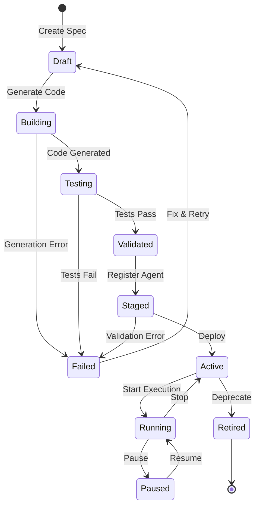

# GreenLang Agent Factory: Data Flow Patterns

**Version:** 1.0.0
**Date:** December 3, 2025
**Status:** ARCHITECTURE SPECIFICATION
**Classification:** Technical Architecture Document

---

## Overview

This document defines the data flow patterns for the GreenLang Agent Factory, covering agent lifecycle management, specification-to-code generation, deployment workflows, evaluation pipelines, and runtime telemetry.

---

## 1. Agent Lifecycle Data Flows

### 1.1 Complete Agent Lifecycle

```
+===========================================================================+
|                        Agent Lifecycle States                              |
+===========================================================================+
|                                                                           |
|   [SPEC]     [GENERATE]    [VALIDATE]    [REGISTER]    [DEPLOY]          |
|     |            |             |             |             |              |
|     v            v             v             v             v              |
|  +------+    +------+      +------+      +------+      +------+          |
|  |Draft |    |Build |      |Test  |      |Staged|      |Active|          |
|  +--+---+    +--+---+      +--+---+      +--+---+      +--+---+          |
|     |           |             |             |             |               |
|     |           |             |             |             v               |
|     |           |             |             |          +------+          |
|     |           |             |             +--------->|Running|         |
|     |           |             |                        +--+---+          |
|     |           |             |                           |               |
|     |           |             v                           v               |
|     |           |          +------+                   +------+           |
|     |           +--------->|Failed|                   |Paused|           |
|     |                      +------+                   +------+           |
|     |                                                    |               |
|     |                                                    v               |
|     |                                                 +------+           |
|     +------------------------------------------------>|Retired|          |
|                                                       +------+           |
|                                                                           |
+===========================================================================+
```

### 1.2 Lifecycle State Transitions



### 1.3 Lifecycle Events

| Event | Source State | Target State | Data Payload | Trigger |
|-------|--------------|--------------|--------------|---------|
| `agent.created` | - | Draft | PackSpec | API/CLI |
| `agent.generated` | Draft | Building | GenerationConfig | Factory |
| `agent.built` | Building | Testing | CodeArtifact | Generator |
| `agent.validated` | Testing | Validated | QualityReport | Validator |
| `agent.registered` | Validated | Staged | AgentDescriptor | Registry |
| `agent.deployed` | Staged | Active | DeploymentInfo | Deployer |
| `agent.started` | Active | Running | ExecutionContext | Runtime |
| `agent.stopped` | Running | Active | ExecutionResult | Runtime |
| `agent.paused` | Running | Paused | PauseReason | Operator |
| `agent.resumed` | Paused | Running | ResumeContext | Operator |
| `agent.retired` | Active | Retired | RetirementReason | Operator |
| `agent.failed` | Any | Failed | ErrorDetails | System |

---

## 2. Spec to Code to Deployment Flow

### 2.1 End-to-End Generation Pipeline

```
+===========================================================================+
|                    Spec -> Code -> Deployment Pipeline                     |
+===========================================================================+

     [User/CI]                    [Agent Factory]                [Kubernetes]
         |                              |                              |
         |  1. Submit pack.yaml         |                              |
         |----------------------------->|                              |
         |                              |                              |
         |                    2. Parse & Validate                      |
         |                              |                              |
         |                    3. Match Domain                          |
         |                              |                              |
         |                    4. Select Template                       |
         |                              |                              |
         |                    5. Generate Code (<100ms)                |
         |                              |                              |
         |                    6. Generate Tests                        |
         |                              |                              |
         |                    7. Run Quality Validation                |
         |                              |                              |
         |                    8. Build Pack (tar.gz)                   |
         |                              |                              |
         |                    9. Register Agent                        |
         |                              |                              |
         |                              |  10. Generate K8s Manifests  |
         |                              |----------------------------->|
         |                              |                              |
         |                              |  11. Apply Deployment        |
         |                              |----------------------------->|
         |                              |                              |
         |                              |  12. Configure HPA           |
         |                              |----------------------------->|
         |                              |                              |
         |                              |  13. Setup Service           |
         |                              |----------------------------->|
         |                              |                              |
         |  14. Return Agent ID + URL   |                              |
         |<-----------------------------|                              |
         |                              |                              |
```

### 2.2 Detailed Data Flow Diagram

```
+-------------+     +-------------+     +-------------+     +-------------+
|  pack.yaml  |     |   Parsed    |     |   Domain    |     |  Template   |
|  (Input)    |---->|    Spec     |---->|   Match     |---->|  Selection  |
+-------------+     +-------------+     +-------------+     +-------------+
                                                                   |
                    +----------------------------------------------+
                    |
                    v
+-------------+     +-------------+     +-------------+     +-------------+
|   Code      |     |    Test     |     |  Quality    |     |   Pack      |
|   Gen       |---->|    Gen      |---->|  Validate   |---->|   Build     |
+-------------+     +-------------+     +-------------+     +-------------+
                                                                   |
                    +----------------------------------------------+
                    |
                    v
+-------------+     +-------------+     +-------------+     +-------------+
|  Register   |     |  Manifest   |     |   Deploy    |     |   Agent     |
|  Agent      |---->|    Gen      |---->|   to K8s    |---->|   Running   |
+-------------+     +-------------+     +-------------+     +-------------+
```

### 2.3 Data Transformations

| Stage | Input | Transform | Output | Latency Target |
|-------|-------|-----------|--------|----------------|
| Parse | pack.yaml (YAML) | YAML Parser | PackSpec (Pydantic) | <10ms |
| Validate | PackSpec | JSON Schema + Rules | ValidationResult | <20ms |
| Match | PackSpec | Domain Classifier | DomainMatch | <5ms |
| Generate | Template + Context | Jinja2 Render | SourceCode | <50ms |
| Test Gen | PackSpec + Code | Template Render | TestCode | <30ms |
| Quality | Code + Tests | Static Analysis | QualityReport | <5s |
| Pack | All Artifacts | tar.gz Archive | AgentPack | <1s |
| Register | AgentPack | Registry API | AgentDescriptor | <100ms |
| Deploy | AgentDescriptor | K8s API | Deployment | <30s |

---

## 3. Agent Execution Data Flows

### 3.1 Request Processing Pipeline

```
+===========================================================================+
|                        Agent Execution Pipeline                            |
+===========================================================================+

 [Client]        [Gateway]       [Runtime]        [Agent]         [OS]
    |                |               |               |               |
    | 1. Request     |               |               |               |
    |--------------->|               |               |               |
    |                |               |               |               |
    |                | 2. Auth/Rate  |               |               |
    |                |    Limit      |               |               |
    |                |               |               |               |
    |                | 3. Route      |               |               |
    |                |-------------->|               |               |
    |                |               |               |               |
    |                |               | 4. Discover   |               |
    |                |               |    Agent      |               |
    |                |               |               |               |
    |                |               | 5. Validate   |               |
    |                |               |    Input      |               |
    |                |               |               |               |
    |                |               | 6. Execute    |               |
    |                |               |-------------->|               |
    |                |               |               |               |
    |                |               |               | 7. Lookup EF  |
    |                |               |               |-------------->|
    |                |               |               |               |
    |                |               |               | 8. Calculate  |
    |                |               |               |-------------->|
    |                |               |               |               |
    |                |               |               | 9. Provenance |
    |                |               |               |<--------------|
    |                |               |               |               |
    |                |               | 10. Validate  |               |
    |                |               |<--------------|               |
    |                |               |     Output    |               |
    |                |               |               |               |
    | 11. Response   |               |               |               |
    |<---------------|<--------------|               |               |
    |                |               |               |               |
```

### 3.2 Zero-Hallucination Calculation Flow

```
+===========================================================================+
|                    Zero-Hallucination Calculation Path                     |
+===========================================================================+
|                                                                           |
|   CRITICAL: NO LLM IN THIS PATH - ALL DETERMINISTIC                       |
|                                                                           |
|   +-------------+     +-------------+     +-------------+                 |
|   |   Input     |     |  Validate   |     |   Lookup    |                 |
|   |   Data      |---->|   Schema    |---->|   EF DB     |                 |
|   +-------------+     +-------------+     +-------------+                 |
|                                                  |                        |
|                                                  v                        |
|   +-------------+     +-------------+     +-------------+                 |
|   |   Output    |     |  Generate   |     |   Execute   |                 |
|   |   Result    |<----|  Provenance |<----|   Formula   |                 |
|   +-------------+     +-------------+     +-------------+                 |
|                              |                                            |
|                              v                                            |
|                       +-------------+                                     |
|                       | SHA-256     |                                     |
|                       | Hash Chain  |                                     |
|                       +-------------+                                     |
|                                                                           |
+===========================================================================+

Provenance Chain Structure:
+---------------------------------------------------------------------------+
| {                                                                          |
|   "calculation_id": "calc_abc123",                                        |
|   "timestamp": "2025-12-03T10:30:00Z",                                    |
|   "input_hash": "sha256:a1b2c3d4...",                                     |
|   "formula_id": "scope1_emissions_v2",                                    |
|   "formula_hash": "sha256:e5f6g7h8...",                                   |
|   "emission_factor": {                                                     |
|     "ef_cid": "ef_428b1c64829dc8f5",                                      |
|     "source": "EPA",                                                       |
|     "value": 53.06,                                                        |
|     "unit": "kgCO2e/mmBtu",                                               |
|     "version": "2024-Q4"                                                   |
|   },                                                                       |
|   "result": 2653.0,                                                        |
|   "result_hash": "sha256:i9j0k1l2...",                                    |
|   "chain_hash": "sha256:m3n4o5p6..."  <- Links to previous calculation   |
| }                                                                          |
+---------------------------------------------------------------------------+
```

### 3.3 LLM-Assisted Flow (Non-Calculation Tasks)

```
+===========================================================================+
|                    LLM-Assisted Processing Path                            |
+===========================================================================+
|                                                                           |
|   ALLOWED USES: Classification, Entity Resolution, Narrative Generation   |
|   PROHIBITED: Numeric calculations, emission factor lookups               |
|                                                                           |
|   +-------------+     +-------------+     +-------------+                 |
|   |   Input     |     |   RAG       |     |   LLM       |                 |
|   |   Text      |---->|  Retrieval  |---->|   Process   |                 |
|   +-------------+     +-------------+     +-------------+                 |
|                                                  |                        |
|                                                  v                        |
|   +-------------+     +-------------+     +-------------+                 |
|   |   Output    |     |   Cite      |     |  Validate   |                 |
|   |   Result    |<----|   Sources   |<----|   Output    |                 |
|   +-------------+     +-------------+     +-------------+                 |
|                                                                           |
+===========================================================================+

LLM Usage Policy:
+---------------------------------------------------------------------------+
| ALLOWED:                              | PROHIBITED:                        |
| - Text classification                 | - Emission factor lookups          |
| - Entity extraction                   | - Carbon calculations              |
| - Fuel type identification            | - Financial computations           |
| - Materiality assessment (qualitative)| - Unit conversions                 |
| - Narrative generation                | - Formula execution                |
| - Report summarization                | - Any numeric output               |
+---------------------------------------------------------------------------+
```

---

## 4. Evaluation Data Flows

### 4.1 Quality Evaluation Pipeline

```
+===========================================================================+
|                    Agent Quality Evaluation Pipeline                       |
+===========================================================================+

     [Source Code]              [Evaluators]              [Reports]
           |                          |                       |
           |   1. Static Analysis     |                       |
           |------------------------->|                       |
           |                          |                       |
           |   2. Complexity Check    |                       |
           |------------------------->|                       |
           |                          |                       |
           |   3. Test Coverage       |                       |
           |------------------------->|                       |
           |                          |                       |
           |   4. Security Scan       |                       |
           |------------------------->|                       |
           |                          |                       |
           |   5. Standards Check     |                       |
           |------------------------->|                       |
           |                          |                       |
           |                          |   6. Aggregate        |
           |                          |--------------------->|
           |                          |                       |
           |                          |   7. Score (0-100)   |
           |                          |--------------------->|
           |                          |                       |
           |                          |   8. Pass/Fail       |
           |                          |--------------------->|
           |                          |                       |
```

### 4.2 12-Dimension Quality Data

```
+===========================================================================+
|                    12-Dimension Quality Assessment                         |
+===========================================================================+

Dimension                Weight    Input Data                 Output Metric
-------------------------------------------------------------------------------
1. Functional Quality    10%       Unit test results          Pass rate %
2. Performance           10%       Benchmark results          Latency P95
3. Compatibility         5%        Integration tests          Compat score
4. Usability             5%        API analysis               DX score
5. Reliability           10%       Failure injection          MTBF hours
6. Security              15%       SAST/DAST scans            Vuln count
7. Maintainability       10%       Code metrics               Maint index
8. Portability           5%        Platform tests             Platform score
9. Scalability           10%       Load tests                 Max throughput
10. Interoperability     5%        Protocol tests             API compat %
11. Reusability          5%        Component analysis         Reuse %
12. Testability          10%       Coverage analysis          Coverage %
-------------------------------------------------------------------------------
TOTAL                    100%                                  Quality Score

Quality Gates:
- PASS: Score >= 70%
- CONDITIONAL: Score 60-69% (requires review)
- FAIL: Score < 60%
```

### 4.3 Continuous Evaluation Data Flow

```
+-------------+     +-------------+     +-------------+     +-------------+
|   Agent     |     |  Metrics    |     |  Evaluate   |     |  Dashboard  |
|   Runtime   |---->|  Collector  |---->|   Engine    |---->|   & Alerts  |
+-------------+     +-------------+     +-------------+     +-------------+
      |                   |                   |                   |
      |                   |                   |                   |
      v                   v                   v                   v
+-------------+     +-------------+     +-------------+     +-------------+
|  Execution  |     |  Time       |     |  Quality    |     |  Grafana    |
|  Traces     |     |  Series DB  |     |  Scores     |     |  Panels     |
+-------------+     +-------------+     +-------------+     +-------------+
```

---

## 5. Runtime Telemetry Flows

### 5.1 Observability Data Pipeline

```
+===========================================================================+
|                    Runtime Telemetry Pipeline                              |
+===========================================================================+

     [Agents]              [Collectors]            [Storage]         [UI]
         |                      |                      |               |
         | Metrics (Prometheus) |                      |               |
         |--------------------->|                      |               |
         |                      |  Store               |               |
         |                      |--------------------->|               |
         |                      |                      |               |
         | Logs (Structured)    |                      |               |
         |--------------------->|                      |               |
         |                      |  Index               |               |
         |                      |--------------------->|               |
         |                      |                      |               |
         | Traces (OpenTelemetry)|                     |               |
         |--------------------->|                      |               |
         |                      |  Aggregate           |               |
         |                      |--------------------->|               |
         |                      |                      |               |
         |                      |                      |  Query        |
         |                      |                      |<--------------|
         |                      |                      |               |
         |                      |                      |  Visualize    |
         |                      |                      |-------------->|
         |                      |                      |               |
```

### 5.2 Metrics Data Model

```yaml
# Agent Metrics Schema
metrics:
  # Request Metrics
  agent_requests_total:
    type: counter
    labels: [agent_id, tenant_id, status, method]
    description: "Total agent requests"

  agent_request_duration_seconds:
    type: histogram
    labels: [agent_id, tenant_id, method]
    buckets: [0.01, 0.05, 0.1, 0.25, 0.5, 1, 2.5, 5, 10]
    description: "Request duration distribution"

  # Calculation Metrics
  agent_calculations_total:
    type: counter
    labels: [agent_id, formula_id, status]
    description: "Total calculations performed"

  agent_calculation_precision:
    type: gauge
    labels: [agent_id, formula_id]
    description: "Calculation precision (decimal places)"

  # Resource Metrics
  agent_memory_bytes:
    type: gauge
    labels: [agent_id]
    description: "Memory usage in bytes"

  agent_cpu_seconds_total:
    type: counter
    labels: [agent_id]
    description: "CPU time consumed"

  # Cache Metrics
  agent_cache_hits_total:
    type: counter
    labels: [agent_id, cache_tier]
    description: "Cache hits"

  agent_cache_misses_total:
    type: counter
    labels: [agent_id, cache_tier]
    description: "Cache misses"

  # LLM Metrics (if applicable)
  agent_llm_tokens_total:
    type: counter
    labels: [agent_id, model, token_type]
    description: "LLM tokens consumed"

  agent_llm_cost_usd:
    type: counter
    labels: [agent_id, model]
    description: "LLM API cost in USD"
```

### 5.3 Structured Logging Schema

```json
{
  "log_schema": {
    "timestamp": "2025-12-03T10:30:00.123Z",
    "level": "INFO|WARN|ERROR|DEBUG",
    "service": "agent-runtime",
    "agent_id": "carbon-calc-v1",
    "tenant_id": "tenant-123",
    "trace_id": "abc123def456",
    "span_id": "789ghi",
    "message": "Calculation completed",
    "context": {
      "formula_id": "scope1_emissions",
      "input_hash": "sha256:...",
      "result": 2653.0,
      "duration_ms": 45,
      "cache_hit": true
    },
    "error": {
      "type": "ValidationError",
      "message": "Invalid fuel type",
      "stack_trace": "..."
    }
  }
}
```

### 5.4 Distributed Tracing

```
+===========================================================================+
|                    Distributed Trace Example                               |
+===========================================================================+

Trace ID: abc123def456
Duration: 245ms

+------------------+----------------------------------------+
| Span             | Timeline                               |
+------------------+----------------------------------------+
| api-gateway      | [====]                                 | 15ms
| auth-service     |  [==]                                  | 8ms
| agent-runtime    |     [========================]         | 180ms
|   - discover     |     [===]                              | 25ms
|   - validate     |        [==]                            | 10ms
|   - execute      |          [================]            | 130ms
|     - ef-lookup  |          [===]                         | 20ms
|     - calculate  |             [=========]                | 95ms
|     - provenance |                      [==]              | 15ms
|   - finalize     |                        [===]           | 15ms
| response         |                            [===]       | 12ms
+------------------+----------------------------------------+
```

---

## 6. Message Bus Patterns

### 6.1 Event-Driven Architecture

```
+===========================================================================+
|                    Message Bus Architecture                                |
+===========================================================================+

                          +-------------------+
                          |    Kafka/Redis    |
                          |    Message Bus    |
                          +---------+---------+
                                    |
          +-------------------------+-------------------------+
          |                         |                         |
+---------v---------+    +---------v---------+    +---------v---------+
|   agent.lifecycle |    |  agent.execution  |    |   agent.metrics   |
|      Topic        |    |      Topic        |    |      Topic        |
+-------------------+    +-------------------+    +-------------------+
| - agent.created   |    | - exec.started    |    | - metrics.batch   |
| - agent.deployed  |    | - exec.completed  |    | - health.check    |
| - agent.retired   |    | - exec.failed     |    | - alert.triggered |
+-------------------+    +-------------------+    +-------------------+
```

### 6.2 Message Patterns

| Pattern | Use Case | Implementation |
|---------|----------|----------------|
| Pub/Sub | Event broadcasting | Kafka topics |
| Request/Reply | Sync agent calls | Redis with correlation ID |
| Work Queue | Task distribution | Consumer groups |
| Saga | Distributed transactions | Event sourcing |
| Dead Letter | Failed messages | DLQ topic |

### 6.3 Message Flow Example

```
+-------------+     +-------------+     +-------------+     +-------------+
|  Producer   |     |  Message    |     |  Consumer   |     |  Handler    |
|  (Agent A)  |---->|    Bus      |---->|  Group      |---->|  (Agent B)  |
+-------------+     +-------------+     +-------------+     +-------------+
      |                   |                   |                   |
      |  1. Create Msg    |                   |                   |
      |------------------>|                   |                   |
      |                   |                   |                   |
      |                   |  2. Persist       |                   |
      |                   |  (Kafka/Redis)    |                   |
      |                   |                   |                   |
      |                   |  3. Notify        |                   |
      |                   |------------------>|                   |
      |                   |                   |                   |
      |                   |                   |  4. Fetch         |
      |                   |<------------------|                   |
      |                   |                   |                   |
      |                   |  5. Deliver       |                   |
      |                   |------------------>|                   |
      |                   |                   |                   |
      |                   |                   |  6. Process       |
      |                   |                   |------------------>|
      |                   |                   |                   |
      |                   |                   |  7. Ack           |
      |                   |<------------------|                   |
      |                   |                   |                   |
```

---

## 7. Caching Data Flows

### 7.1 4-Tier Cache Architecture

```
+===========================================================================+
|                    4-Tier Caching Architecture                             |
+===========================================================================+

Request Flow:

   Request --> [L1: Memory] --> [L2: Redis] --> [L3: CDN] --> [L4: DB]
                   |                |               |             |
                  Hit              Hit             Hit           Miss
                   |                |               |             |
                  <--              <--             <--            |
                                                                  |
                                                            Populate
                                                                  |
   <-------------------------------------------------------------|

Tier Details:
+--------+----------------+-------------+------------+-------------+
| Tier   | Storage        | Latency     | Size       | TTL         |
+--------+----------------+-------------+------------+-------------+
| L1     | In-Process     | <1ms        | 100MB      | 5 min       |
| L2     | Redis Cluster  | <5ms        | 10GB       | 1 hour      |
| L3     | CDN Edge       | <20ms       | Unlimited  | 24 hours    |
| L4     | PostgreSQL     | <50ms       | Unlimited  | Permanent   |
+--------+----------------+-------------+------------+-------------+
```

### 7.2 Cache Key Patterns

```python
# Cache Key Patterns
CACHE_KEYS = {
    # Emission Factor Cache
    "ef:{source}:{fuel_type}:{region}:{year}": "EF lookup",

    # Calculation Result Cache
    "calc:{formula_id}:{input_hash}": "Deterministic result",

    # Agent Metadata Cache
    "agent:{agent_id}:meta": "Agent descriptor",

    # Session Cache
    "session:{tenant_id}:{session_id}": "User session",

    # Rate Limit Cache
    "rate:{tenant_id}:{endpoint}:{window}": "Rate limit counter",
}

# Cache Invalidation Events
INVALIDATION_EVENTS = [
    "ef.updated",       # Emission factor dataset updated
    "agent.deployed",   # New agent version deployed
    "tenant.updated",   # Tenant configuration changed
]
```

### 7.3 Cache Hit Rate Targets

| Cache Type | Target Hit Rate | Current | Notes |
|------------|-----------------|---------|-------|
| EF Lookups | 95% | 96.2% | Quarterly updates only |
| Calculation Results | 80% | 78.5% | High input variance |
| Agent Metadata | 99% | 99.1% | Rarely changes |
| LLM Responses | 66% | 64.3% | Prompt-based caching |

---

## 8. Data Security Flows

### 8.1 Encryption in Transit

```
+===========================================================================+
|                    Encryption in Transit                                   |
+===========================================================================+

External Traffic:
+----------+     TLS 1.3      +----------+     mTLS       +----------+
|  Client  | --------------> | Gateway  | ------------> | Service  |
+----------+                  +----------+                +----------+

Internal Traffic:
+----------+     mTLS         +----------+     mTLS      +----------+
| Service  | --------------> | Service  | ------------> | Database |
|    A     |                  |    B     |                |          |
+----------+                  +----------+                +----------+

Certificate Management:
- Issuer: cert-manager with Let's Encrypt
- Rotation: Automatic, 90-day certificates
- Storage: Kubernetes secrets (encrypted at rest)
```

### 8.2 Tenant Data Isolation

```
+===========================================================================+
|                    Tenant Data Isolation Flow                              |
+===========================================================================+

                      API Gateway
                          |
                          | Extract tenant_id from JWT
                          v
                    +------------+
                    | Tenant     |
                    | Context    |
                    +------+-----+
                           |
          +----------------+----------------+
          |                                 |
          v                                 v
    +------------+                   +------------+
    | Tenant A   |                   | Tenant B   |
    | Database   |                   | Database   |
    | (Isolated) |                   | (Isolated) |
    +------------+                   +------------+

Isolation Mechanisms:
1. Separate PostgreSQL database per tenant
2. Row-Level Security (RLS) policies
3. Tenant context injection in all queries
4. Network policies per namespace
```

---

## 9. Batch Processing Flows

### 9.1 Bulk Agent Execution

```
+===========================================================================+
|                    Batch Processing Pipeline                               |
+===========================================================================+

     [Batch Job]           [Workers]            [Aggregator]      [Output]
          |                    |                     |               |
          | 1. Split into      |                     |               |
          |    partitions      |                     |               |
          |------------------->|                     |               |
          |                    |                     |               |
          |                    | 2. Process          |               |
          |                    |    parallel         |               |
          |                    |                     |               |
          |                    | 3. Emit results     |               |
          |                    |------------------->|               |
          |                    |                     |               |
          |                    |                     | 4. Aggregate  |
          |                    |                     |-------------->|
          |                    |                     |               |
          | 5. Status update   |                     |               |
          |<-------------------|---------------------|               |
          |                    |                     |               |

Batch Configuration:
- Partition Size: 1,000 records
- Worker Parallelism: 10 workers
- Timeout: 30 minutes per partition
- Retry Policy: 3 attempts with exponential backoff
```

### 9.2 ETL Data Flow

```
+-------------+     +-------------+     +-------------+     +-------------+
|   Extract   |     |  Transform  |     |    Load     |     |   Report    |
|  (Sources)  |---->|  (Agents)   |---->|  (Targets)  |---->| (Outputs)   |
+-------------+     +-------------+     +-------------+     +-------------+
      |                   |                   |                   |
      v                   v                   v                   v
+-------------+     +-------------+     +-------------+     +-------------+
| - SAP       |     | - Carbon    |     | - Data Lake |     | - PDF       |
| - Oracle    |     |   Calc      |     | - PostgreSQL|     | - Excel     |
| - CSV/Excel |     | - Normalize |     | - Vector DB |     | - XBRL      |
| - APIs      |     | - Validate  |     | - S3        |     | - Dashboard |
+-------------+     +-------------+     +-------------+     +-------------+
```

---

## 10. Performance Optimization Flows

### 10.1 Request Optimization

```
+===========================================================================+
|                    Request Optimization Pipeline                           |
+===========================================================================+

Original Request Flow:
[Client] -> [Gateway] -> [Auth] -> [Routing] -> [Agent] -> [DB] -> [Response]
            |            |          |            |          |
           15ms        10ms       5ms          50ms      20ms    = 100ms total

Optimized Request Flow:
[Client] -> [CDN] -> [Gateway] -> [Agent] -> [Cache] -> [Response]
           |         |            |          |
          5ms       8ms         25ms       2ms         = 40ms total

Optimizations Applied:
1. CDN caching for static content
2. Connection pooling
3. Redis caching for hot data
4. Async I/O for parallel operations
5. Response compression
```

### 10.2 Data Access Patterns

| Access Pattern | Optimization | Latency Reduction |
|----------------|--------------|-------------------|
| Frequent EF Lookups | L1 + L2 Cache | 95% |
| Agent Discovery | Capability Index | 80% |
| Audit Log Writes | Async Batch | 70% |
| Report Generation | Pre-computation | 60% |
| Metric Collection | Batch Flush | 50% |

---

## Related Documents

| Document | Location | Description |
|----------|----------|-------------|
| Architecture Overview | `../system-design/00-ARCHITECTURE_OVERVIEW.md` | High-level system view |
| Layer Architecture | `../system-design/01-LAYER_ARCHITECTURE.md` | Layer specifications |
| Infrastructure Requirements | `../infrastructure/00-INFRASTRUCTURE_REQUIREMENTS.md` | Compute/storage/network |
| Security Architecture | `../security/00-SECURITY_ARCHITECTURE.md` | Security design |

---

**Document Owner:** GL-AppArchitect
**Last Updated:** December 3, 2025
**Review Cycle:** Quarterly
