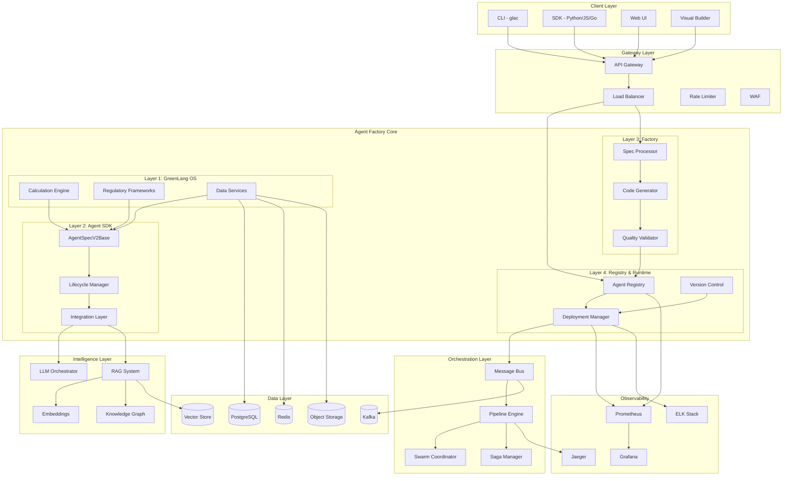

# GreenLang Agent Factory: System Architecture Overview

**Version:** 1.0.0
**Date:** December 3, 2025
**Status:** ARCHITECTURE SPECIFICATION
**Classification:** Technical Architecture Document

---

## Executive Summary

The GreenLang Agent Factory is an enterprise-grade platform for creating, deploying, and managing AI agents at scale. Built on top of GreenLang OS (the calculation engine and regulatory framework), the Agent Factory provides a complete lifecycle management system for 10,000+ concurrent agents with zero-hallucination guarantees for all regulatory calculations.

### Key Capabilities

| Capability | Target | Technology |
|------------|--------|------------|
| Agent Creation | <100ms per agent | Template-based code generation |
| Concurrent Agents | 10,000+ | Kubernetes horizontal scaling |
| Zero Hallucination | 100% deterministic | No LLM in calculation path |
| Provenance | SHA-256 chains | Complete audit trail |
| Multi-Tenancy | Complete isolation | Separate DB per tenant |
| API Latency | <100ms P95 | Redis caching, connection pooling |
| Uptime Target | 99.99% | Multi-AZ deployment |

---

## System Architecture Diagram

### High-Level Architecture

```
                                    GreenLang Agent Factory
+=====================================================================================+
|                                                                                     |
|   +-------------------------+     +-------------------------+     +--------------+ |
|   |    Client Layer         |     |    Gateway Layer        |     |  Monitoring  | |
|   |  - CLI (glac)           |---->|  - API Gateway          |---->|  - Prometheus| |
|   |  - SDK (Python/JS/Go)   |     |  - Load Balancer        |     |  - Grafana   | |
|   |  - Web UI               |     |  - Rate Limiter         |     |  - Jaeger    | |
|   |  - Visual Builder       |     |  - WAF                  |     |  - ELK Stack | |
|   +-------------------------+     +------------+------------+     +--------------+ |
|                                                |                                    |
|   +------------------------------------------------------------------------------------+
|   |                           AGENT FACTORY CORE                                      |
|   | +-----------------------------------------------------------------------------+   |
|   | |                    Layer 4: Agent Registry & Runtime                        |   |
|   | |  +------------------+  +------------------+  +---------------------+        |   |
|   | |  | Agent Registry   |  | Version Control  |  | Deployment Manager  |        |   |
|   | |  | - Discovery      |  | - Semantic Ver   |  | - Blue/Green        |        |   |
|   | |  | - Health Monitor |  | - Canary Deploy  |  | - Rollback          |        |   |
|   | |  | - Load Balancing |  | - A/B Testing    |  | - Auto-scaling      |        |   |
|   | |  +------------------+  +------------------+  +---------------------+        |   |
|   | +-----------------------------------------------------------------------------+   |
|   |                                      |                                            |
|   | +-----------------------------------------------------------------------------+   |
|   | |                    Layer 3: Agent Factory                                   |   |
|   | |  +------------------+  +------------------+  +---------------------+        |   |
|   | |  | Spec Processor   |  | Code Generator   |  | Quality Validator   |        |   |
|   | |  | - YAML Parser    |  | - Templates      |  | - 12-Dimension QA   |        |   |
|   | |  | - Schema Valid   |  | - AI-Assist      |  | - Test Coverage     |        |   |
|   | |  | - Domain Match   |  | - Pack Builder   |  | - Security Scan     |        |   |
|   | |  +------------------+  +------------------+  +---------------------+        |   |
|   | +-----------------------------------------------------------------------------+   |
|   |                                      |                                            |
|   | +-----------------------------------------------------------------------------+   |
|   | |                    Layer 2: Agent SDK v1                                    |   |
|   | |  +------------------+  +------------------+  +---------------------+        |   |
|   | |  | AgentSpecV2Base  |  | Lifecycle Mgmt   |  | Integration Layer   |        |   |
|   | |  | - Generic[In,Out]|  | - Init/Val/Exec  |  | - ERP Connectors    |        |   |
|   | |  | - Schema Valid   |  | - Hooks System   |  | - File Formats      |        |   |
|   | |  | - Citation Track |  | - Metrics/Logs   |  | - API Gateway       |        |   |
|   | |  +------------------+  +------------------+  +---------------------+        |   |
|   | +-----------------------------------------------------------------------------+   |
|   |                                      |                                            |
|   | +-----------------------------------------------------------------------------+   |
|   | |                    Layer 1: GreenLang OS (Foundation)                       |   |
|   | |  +------------------+  +------------------+  +---------------------+        |   |
|   | |  | Calculation      |  | Regulatory       |  | Data Services       |        |   |
|   | |  | Engine           |  | Frameworks       |  |                     |        |   |
|   | |  | - Zero-Hallucin  |  | - CSRD/ESRS      |  | - PostgreSQL        |        |   |
|   | |  | - Emission Factor|  | - CBAM           |  | - Redis Cache       |        |   |
|   | |  | - Formulas DB    |  | - EUDR/SB253     |  | - Vector Store      |        |   |
|   | |  | - Provenance     |  | - GHG Protocol   |  | - Object Storage    |        |   |
|   | |  +------------------+  +------------------+  +---------------------+        |   |
|   | +-----------------------------------------------------------------------------+   |
|   +-----------------------------------------------------------------------------------+
|                                                                                     |
|   +-------------------------+     +-------------------------+     +--------------+ |
|   |    Intelligence Layer   |     |    Orchestration        |     |  Security    | |
|   |  - LLM Orchestrator     |     |  - Message Bus (Kafka)  |     |  - OAuth/JWT | |
|   |  - RAG System           |     |  - Pipeline Engine      |     |  - RBAC      | |
|   |  - Embeddings           |     |  - Swarm Coordinator    |     |  - Encryption| |
|   |  - Knowledge Graph      |     |  - Saga Manager         |     |  - Audit Log | |
|   +-------------------------+     +-------------------------+     +--------------+ |
|                                                                                     |
+=====================================================================================+
                                           |
                    +----------------------+----------------------+
                    |                      |                      |
            +-------v-------+      +-------v-------+      +-------v-------+
            | PostgreSQL    |      | Redis Cluster |      | Kafka Cluster |
            | - Tenants     |      | - Cache       |      | - Events      |
            | - Agents      |      | - Sessions    |      | - Messages    |
            | - Audit Logs  |      | - Rate Limits |      | - Streaming   |
            +---------------+      +---------------+      +---------------+
```

### Mermaid Architecture Diagram



---

## Component Relationships

### Layer Interactions

```
+-------------------+     +-------------------+     +-------------------+
|   External API    |     |   Agent Request   |     |   Admin Console   |
+--------+----------+     +--------+----------+     +--------+----------+
         |                         |                         |
         v                         v                         v
+------------------------------------------------------------------------+
|                        API Gateway (Kong/Ambassador)                     |
|  - Authentication (JWT/OAuth)                                           |
|  - Rate Limiting (per tenant, per endpoint)                             |
|  - Request Validation                                                    |
|  - Load Balancing                                                        |
+----------------------------------+-------------------------------------+
                                   |
            +----------------------+----------------------+
            |                      |                      |
            v                      v                      v
+-------------------+   +-------------------+   +-------------------+
| Agent Factory API |   |  Agent Runtime    |   |  Registry API     |
| POST /agents      |   |  POST /execute    |   |  GET /agents      |
| POST /validate    |   |  GET /status      |   |  GET /health      |
| POST /deploy      |   |  POST /batch      |   |  PUT /version     |
+--------+----------+   +--------+----------+   +--------+----------+
         |                       |                       |
         v                       v                       v
+------------------------------------------------------------------------+
|                        Internal Service Mesh (Istio)                     |
|  - mTLS between services                                                 |
|  - Service discovery                                                     |
|  - Traffic management                                                    |
|  - Observability                                                         |
+------------------------------------------------------------------------+
```

### Data Flow Summary

| Flow Type | Source | Destination | Protocol | Data |
|-----------|--------|-------------|----------|------|
| Agent Creation | Factory API | Code Generator | gRPC | AgentSpec YAML |
| Agent Execution | Runtime API | Agent Instance | HTTP/gRPC | Payload JSON |
| Event Streaming | Agents | Kafka | TCP | Event Messages |
| Metrics | All Services | Prometheus | HTTP | Metrics |
| Logs | All Services | ELK | TCP | Structured Logs |
| Cache | Services | Redis | TCP | Session/Cache |
| Persistence | Services | PostgreSQL | TCP | Domain Data |

---

## Technology Stack

### Core Platform

| Category | Technology | Version | Purpose |
|----------|------------|---------|---------|
| **Language** | Python | 3.11+ | Core development |
| **Framework** | FastAPI | 0.104.0+ | High-performance APIs |
| **Async** | asyncio, aiohttp | Native | Concurrent operations |
| **Validation** | Pydantic | 2.5.0+ | Data validation |

### AI/ML Stack

| Category | Technology | Version | Purpose |
|----------|------------|---------|---------|
| **LLM** | Claude API, OpenAI | Latest | Language models |
| **Embeddings** | Sentence Transformers | 2.3.0+ | Vector generation |
| **Vector DB** | FAISS, Pinecone | 1.7.4+ | Similarity search |
| **Graph DB** | Neo4j | 5.0+ | Knowledge graphs |

### Infrastructure Stack

| Category | Technology | Version | Purpose |
|----------|------------|---------|---------|
| **Container** | Docker | 24.0+ | Containerization |
| **Orchestration** | Kubernetes | 1.28+ | Container orchestration |
| **Service Mesh** | Istio | 1.19+ | Microservice networking |
| **Message Queue** | Kafka | 3.5+ | Event streaming |
| **Database** | PostgreSQL | 15+ | Relational data |
| **Cache** | Redis | 7.0+ | In-memory cache |
| **Storage** | S3/MinIO | Latest | Object storage |

### Observability Stack

| Category | Technology | Version | Purpose |
|----------|------------|---------|---------|
| **Metrics** | Prometheus | 2.47+ | Metrics collection |
| **Visualization** | Grafana | 10.0+ | Dashboards |
| **Logging** | ELK Stack | 8.10+ | Log aggregation |
| **Tracing** | Jaeger | 1.50+ | Distributed tracing |

---

## System Boundaries

### External Interfaces

```
+---------------------------+       +---------------------------+
|   Enterprise Systems      |       |   External Services       |
|                           |       |                           |
|  +-------------------+    |       |  +-------------------+    |
|  | SAP ERP           |----+       +--| Anthropic Claude  |    |
|  | Oracle Cloud      |    |       |  | OpenAI GPT-4      |    |
|  | Workday           |    |       |  | Pinecone          |    |
|  | Salesforce        |    |       |  +-------------------+    |
|  +-------------------+    |       |                           |
|                           |       |  +-------------------+    |
|  +-------------------+    |       |  | AWS Services      |    |
|  | Data Sources      |    |       |  | - S3              |    |
|  | - CSV/Excel       |----+       +--| - SQS             |    |
|  | - JSON/XML        |    |       |  | - Lambda          |    |
|  | - PDF/XBRL        |    |       |  +-------------------+    |
|  +-------------------+    |       |                           |
+---------------------------+       +---------------------------+
            |                                   |
            |   +---------------------------+   |
            +-->|   GreenLang Agent Factory |<--+
                |                           |
                |  +-----------------------+|
                |  | ERP Connector Layer   ||
                |  | - SAP RFC/BAPI        ||
                |  | - Oracle REST         ||
                |  | - Workday SOAP        ||
                |  | - Generic REST/GraphQL||
                |  +-----------------------+|
                +---------------------------+
```

### Trust Boundaries

| Boundary | Inside | Outside | Control |
|----------|--------|---------|---------|
| Network Perimeter | Internal services | Internet | WAF, DDoS protection |
| API Gateway | Authenticated requests | Public requests | JWT, OAuth, Rate limiting |
| Service Mesh | Service-to-service | External calls | mTLS, Network policies |
| Tenant Boundary | Tenant data | Other tenants | Separate DB, RBAC |
| Agent Sandbox | Agent execution | Host system | Container isolation |

---

## Scalability Model

### Horizontal Scaling

```
                     Load Balancer
                          |
        +-----------------+-----------------+
        |                 |                 |
   +----v----+       +----v----+       +----v----+
   | API GW  |       | API GW  |       | API GW  |
   | Pod 1   |       | Pod 2   |       | Pod 3   |
   +---------+       +---------+       +---------+
        |                 |                 |
        +-----------------+-----------------+
                          |
        +-----------------+-----------------+
        |                 |                 |
   +----v----+       +----v----+       +----v----+
   | Factory |       | Factory |       | Factory |
   | Pod 1   |       | Pod 2   |       | Pod N   |
   +---------+       +---------+       +---------+
        |                 |                 |
        +-----------------+-----------------+
                          |
        +-----------------+-----------------+
        |                 |                 |
   +----v----+       +----v----+       +----v----+
   | Runtime |       | Runtime |       | Runtime |
   | Pod 1   |       | Pod 2   |       | Pod N   |
   +---------+       +---------+       +---------+
```

### Scaling Targets

| Component | Min Replicas | Max Replicas | Scale Metric | Target |
|-----------|--------------|--------------|--------------|--------|
| API Gateway | 3 | 20 | CPU | 70% |
| Factory Service | 3 | 50 | Queue Depth | 100 |
| Runtime Service | 10 | 500 | Concurrent Agents | 20/pod |
| Registry Service | 3 | 10 | Requests/sec | 1000 |

---

## Deployment Topology

### Multi-Region Architecture

```
                        Global Load Balancer
                               |
          +--------------------+--------------------+
          |                    |                    |
    +-----v-----+        +-----v-----+        +-----v-----+
    |  US-EAST  |        |  EU-WEST  |        |  AP-SOUTH |
    |  Region   |        |  Region   |        |  Region   |
    +-----------+        +-----------+        +-----------+
          |                    |                    |
    +-----v-----+        +-----v-----+        +-----v-----+
    | K8s       |        | K8s       |        | K8s       |
    | Cluster   |        | Cluster   |        | Cluster   |
    +-----------+        +-----------+        +-----------+
          |                    |                    |
    +-----v-----+        +-----v-----+        +-----v-----+
    | PostgreSQL|<------>| PostgreSQL|<------>| PostgreSQL|
    | Primary   | Repl   | Replica   | Repl   | Replica   |
    +-----------+        +-----------+        +-----------+
```

### Environment Tiers

| Environment | Purpose | Replicas | Data | Access |
|-------------|---------|----------|------|--------|
| Development | Feature development | 1 | Synthetic | Developers |
| Staging | Integration testing | 2 | Anonymized | QA Team |
| Production | Live workloads | 3-N | Real | Customers |
| DR | Disaster recovery | 2 | Replicated | Automated |

---

## Performance Targets

### System-Wide SLOs

| Metric | Target | Measurement | Alert Threshold |
|--------|--------|-------------|-----------------|
| Agent Creation | <100ms | P95 latency | >150ms |
| Agent Execution | <2s | P95 latency | >3s |
| API Latency | <100ms | P95 latency | >150ms |
| Throughput | 10,000 agents/min | Peak capacity | <5000 |
| Availability | 99.99% | Uptime | <99.9% |
| Error Rate | <0.1% | Request errors | >1% |

### Resource Budgets

| Component | CPU Request | CPU Limit | Memory Request | Memory Limit |
|-----------|-------------|-----------|----------------|--------------|
| API Gateway | 500m | 2000m | 512Mi | 2Gi |
| Factory | 1000m | 4000m | 1Gi | 4Gi |
| Runtime | 500m | 2000m | 512Mi | 2Gi |
| Registry | 250m | 1000m | 256Mi | 1Gi |

---

## Success Criteria

### Technical KPIs

| KPI | Current | Target | Timeline |
|-----|---------|--------|----------|
| Agent Creation Time | 80ms | <100ms | Maintained |
| Concurrent Agents | 1,000 | 10,000+ | Q2 2026 |
| Test Coverage | 85% | 90% | Q1 2026 |
| Security Score | 85/100 | 95/100 | Q1 2026 |
| Zero Hallucination | 99.9% | 100% | Maintained |

### Operational KPIs

| KPI | Current | Target | Timeline |
|-----|---------|--------|----------|
| MTTR | 2 hours | 30 minutes | Q2 2026 |
| Change Failure Rate | 10% | 5% | Q1 2026 |
| Deployment Frequency | Weekly | Daily | Q1 2026 |
| Lead Time | 2 weeks | 2 days | Q2 2026 |

---

## Related Documents

| Document | Location | Description |
|----------|----------|-------------|
| Layer Architecture | `01-LAYER_ARCHITECTURE.md` | Detailed layer specifications |
| Data Flow Patterns | `../data-flows/00-DATA_FLOW_PATTERNS.md` | Data flow documentation |
| Infrastructure Requirements | `../infrastructure/00-INFRASTRUCTURE_REQUIREMENTS.md` | Compute/storage/network |
| Security Architecture | `../security/00-SECURITY_ARCHITECTURE.md` | Security design |
| AgentSpec V2 Guide | `../../AGENTSPEC_V2_FOUNDATION_GUIDE.md` | Agent specification standard |

---

**Document Owner:** GL-AppArchitect
**Last Updated:** December 3, 2025
**Review Cycle:** Quarterly
