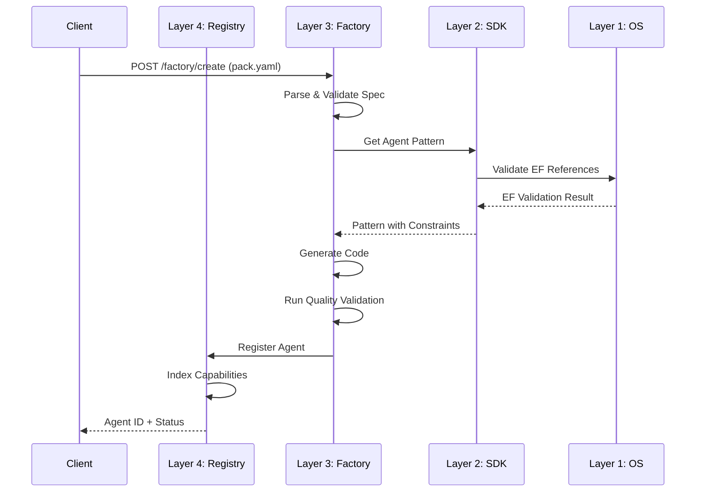
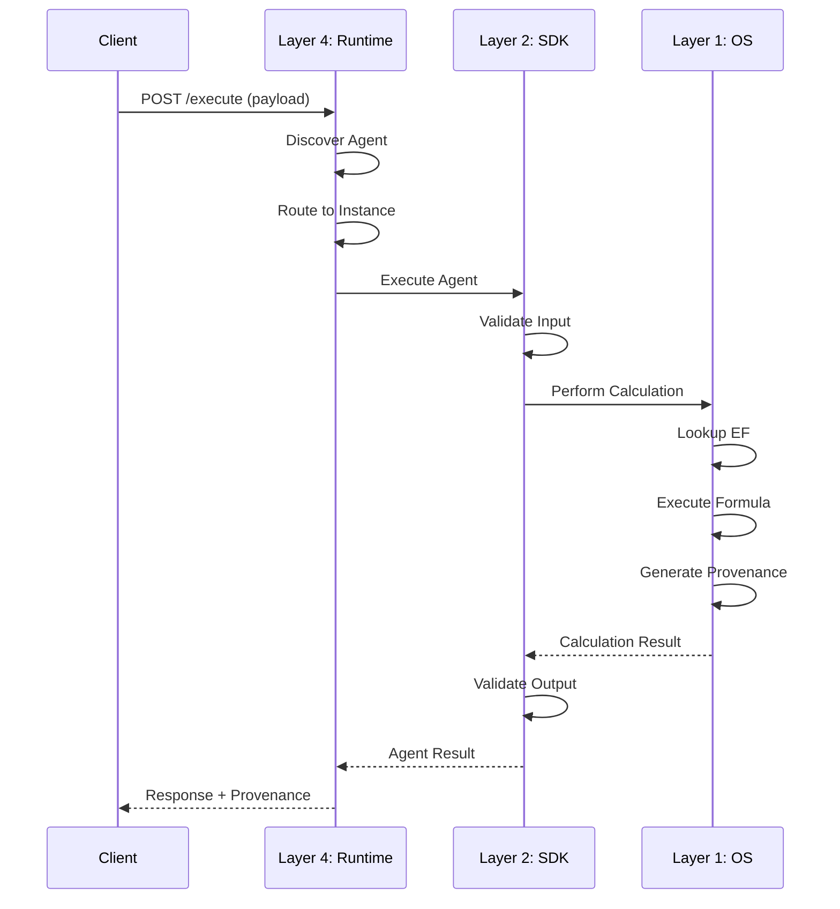

# GreenLang Agent Factory: Layer Architecture

**Version:** 1.0.0
**Date:** December 3, 2025
**Status:** ARCHITECTURE SPECIFICATION
**Classification:** Technical Architecture Document

---

## Overview

The GreenLang Agent Factory is organized into four distinct layers, each with specific responsibilities and well-defined interfaces. This layered architecture ensures separation of concerns, testability, and the ability to evolve components independently.

```
+===========================================================================+
|                                                                           |
|  Layer 4: Agent Registry & Runtime                                        |
|  -------------------------------------------------------------------------+
|  Responsibilities: Discovery, Deployment, Version Control, Governance    |
|                                                                           |
+===========================================================================+
                                    |
                                    v
+===========================================================================+
|                                                                           |
|  Layer 3: Agent Factory                                                   |
|  -------------------------------------------------------------------------+
|  Responsibilities: Spec Processing, Code Generation, Quality Validation  |
|                                                                           |
+===========================================================================+
                                    |
                                    v
+===========================================================================+
|                                                                           |
|  Layer 2: Agent SDK v1                                                    |
|  -------------------------------------------------------------------------+
|  Responsibilities: Base Classes, Lifecycle, Integrations, Patterns       |
|                                                                           |
+===========================================================================+
                                    |
                                    v
+===========================================================================+
|                                                                           |
|  Layer 1: GreenLang OS (Foundation)                                       |
|  -------------------------------------------------------------------------+
|  Responsibilities: Calculation Engine, Regulatory Frameworks, Data Svc   |
|                                                                           |
+===========================================================================+
```

---

## Layer 1: GreenLang OS (Foundation)

### Purpose

GreenLang OS is the foundational calculation engine that provides zero-hallucination computational capabilities, regulatory framework compliance, and shared infrastructure services. This layer is the bedrock upon which all agents are built.

### Architecture

```
+-----------------------------------------------------------------------+
|                        GreenLang OS (Foundation)                        |
+-----------------------------------------------------------------------+
|                                                                         |
|  +---------------------------+  +---------------------------+          |
|  |   Calculation Engine      |  |   Regulatory Frameworks   |          |
|  |                           |  |                           |          |
|  |  +-------------------+    |  |  +-------------------+    |          |
|  |  | Emission Factors  |    |  |  | CSRD/ESRS         |    |          |
|  |  | - EF Database     |    |  |  | - DR Standards    |    |          |
|  |  | - EF Versioning   |    |  |  | - XBRL Templates  |    |          |
|  |  | - EF Lookups      |    |  |  | - Materiality     |    |          |
|  |  +-------------------+    |  |  +-------------------+    |          |
|  |                           |  |                           |          |
|  |  +-------------------+    |  |  +-------------------+    |          |
|  |  | Formula Engine    |    |  |  | CBAM              |    |          |
|  |  | - 8000+ Formulas  |    |  |  | - CN Codes        |    |          |
|  |  | - Deterministic   |    |  |  | - Precursor Calc  |    |          |
|  |  | - Validated       |    |  |  | - Border Tax      |    |          |
|  |  +-------------------+    |  |  +-------------------+    |          |
|  |                           |  |                           |          |
|  |  +-------------------+    |  |  +-------------------+    |          |
|  |  | Provenance        |    |  |  | GHG Protocol      |    |          |
|  |  | - SHA-256 Chains  |    |  |  | - Scope 1/2/3     |    |          |
|  |  | - Audit Trail     |    |  |  | - Categories      |    |          |
|  |  | - Reproducibility |    |  |  | - Boundaries      |    |          |
|  |  +-------------------+    |  |  +-------------------+    |          |
|  |                           |  |                           |          |
|  +---------------------------+  +---------------------------+          |
|                                                                         |
|  +---------------------------+  +---------------------------+          |
|  |   Data Services          |  |   Shared Infrastructure   |          |
|  |                           |  |                           |          |
|  |  +-------------------+    |  |  +-------------------+    |          |
|  |  | PostgreSQL        |    |  |  | Redis Cache       |    |          |
|  |  | - Multi-tenant    |    |  |  | - 4-Tier Caching  |    |          |
|  |  | - RLS Enabled     |    |  |  | - Session Store   |    |          |
|  |  +-------------------+    |  |  +-------------------+    |          |
|  |                           |  |                           |          |
|  |  +-------------------+    |  |  +-------------------+    |          |
|  |  | Vector Store      |    |  |  | Message Bus       |    |          |
|  |  | - ChromaDB (Dev)  |    |  |  | - Redis Streams   |    |          |
|  |  | - Pinecone (Prod) |    |  |  | - Kafka (Scale)   |    |          |
|  |  +-------------------+    |  |  +-------------------+    |          |
|  |                           |  |                           |          |
|  +---------------------------+  +---------------------------+          |
|                                                                         |
+-----------------------------------------------------------------------+
```

### Components

#### 1.1 Calculation Engine

The calculation engine provides deterministic, zero-hallucination computations.

**Critical Principle:** NO LLM IN CALCULATION PATH

```python
# Calculation Engine Interface
class CalculationEngine:
    """
    Zero-hallucination calculation engine.
    All numeric computations are deterministic lookups or validated formulas.
    """

    def get_emission_factor(
        self,
        fuel_type: str,
        region: str,
        year: int,
        source: str = "EPA"
    ) -> EmissionFactor:
        """
        Lookup emission factor from validated database.
        Returns: EmissionFactor with provenance tracking.
        """
        pass

    def calculate(
        self,
        formula_id: str,
        inputs: Dict[str, float],
        context: CalculationContext
    ) -> CalculationResult:
        """
        Execute validated formula with full provenance.
        Returns: Result with SHA-256 hash chain.
        """
        pass

    def validate_formula(
        self,
        formula: str,
        inputs: Dict[str, Any]
    ) -> ValidationResult:
        """
        Validate formula syntax and input compatibility.
        """
        pass
```

**Emission Factor Database:**

| Attribute | Specification |
|-----------|---------------|
| Total EFs | 50,000+ entries |
| Sources | EPA, IPCC, GWP, DEFRA, ecoinvent |
| Versioning | Semantic versioning per dataset |
| Update Cycle | Quarterly validation |
| Lookup Time | <5ms P95 |

**Formula Database:**

| Attribute | Specification |
|-----------|---------------|
| Total Formulas | 8,000+ validated |
| Domains | Carbon, Energy, Water, Waste, LCA |
| Validation | Unit tests + property-based testing |
| Precision | Configurable (default: 6 decimal places) |

#### 1.2 Regulatory Frameworks

Pre-built compliance logic for major sustainability regulations.

```python
# Regulatory Framework Interface
class RegulatoryFramework:
    """Base class for all regulatory frameworks."""

    framework_id: str
    version: str
    effective_date: date

    def get_requirements(self) -> List[Requirement]:
        """Get all framework requirements."""
        pass

    def validate_report(self, report: Report) -> ValidationResult:
        """Validate report against framework requirements."""
        pass

    def generate_disclosure(self, data: Dict) -> Disclosure:
        """Generate framework-compliant disclosure."""
        pass

# Supported Frameworks
SUPPORTED_FRAMEWORKS = {
    "csrd_esrs": CSRDESRSFramework,      # EU Corporate Sustainability Reporting
    "cbam": CBAMFramework,                # Carbon Border Adjustment Mechanism
    "eudr": EUDRFramework,                # EU Deforestation Regulation
    "ghg_protocol": GHGProtocolFramework, # Greenhouse Gas Protocol
    "sb253": SB253Framework,              # California Climate Disclosure
    "sec_climate": SECClimateFramework,   # SEC Climate Rule
    "tcfd": TCFDFramework,                # Task Force on Climate-related Disclosures
    "tnfd": TNFDFramework,                # Taskforce on Nature-related Disclosures
}
```

#### 1.3 Data Services

Shared data access layer with multi-tenancy and security built-in.

```python
# Data Services Configuration
class DataServicesConfig:
    postgresql:
        host: str
        port: int = 5432
        database: str = "greenlang_master"
        pool_size: int = 20
        max_overflow: int = 10

    redis:
        host: str
        port: int = 6379
        cluster_mode: bool = False
        sentinel_enabled: bool = True

    vector_store:
        provider: Literal["chromadb", "pinecone"]
        collection_name: str
        dimension: int = 384
```

### Layer 1 APIs

| API Endpoint | Method | Purpose |
|--------------|--------|---------|
| `/api/v1/ef/lookup` | GET | Emission factor lookup |
| `/api/v1/ef/calculate` | POST | Execute calculation |
| `/api/v1/formulas/{id}` | GET | Get formula definition |
| `/api/v1/frameworks/{id}` | GET | Get framework requirements |
| `/api/v1/provenance/{hash}` | GET | Verify provenance chain |

---

## Layer 2: Agent SDK v1

### Purpose

The Agent SDK provides standardized patterns, base classes, and integration utilities for building GreenLang agents. It ensures consistency across all agents while enabling customization.

### Architecture

```
+-----------------------------------------------------------------------+
|                           Agent SDK v1                                  |
+-----------------------------------------------------------------------+
|                                                                         |
|  +---------------------------+  +---------------------------+          |
|  |   AgentSpec V2 Base      |  |   Lifecycle Management    |          |
|  |                           |  |                           |          |
|  |  +-------------------+    |  |  +-------------------+    |          |
|  |  | AgentSpecV2Base   |    |  |  | Lifecycle Hooks   |    |          |
|  |  | - Generic[In,Out] |    |  |  | - pre_initialize  |    |          |
|  |  | - Schema Valid    |    |  |  | - post_initialize |    |          |
|  |  | - Type Safety     |    |  |  | - pre_execute     |    |          |
|  |  +-------------------+    |  |  | - post_execute    |    |          |
|  |                           |  |  +-------------------+    |          |
|  |  +-------------------+    |  |                           |          |
|  |  | AgentV2Wrapper    |    |  |  +-------------------+    |          |
|  |  | - Zero-code Migr  |    |  |  | State Management  |    |          |
|  |  | - Backward Compat |    |  |  | - Checkpointing   |    |          |
|  |  +-------------------+    |  |  | - Recovery        |    |          |
|  |                           |  |  | - Persistence     |    |          |
|  +---------------------------+  |  +-------------------+    |          |
|                                  +---------------------------+          |
|                                                                         |
|  +---------------------------+  +---------------------------+          |
|  |   Integration Layer      |  |   Agent Patterns          |          |
|  |                           |  |                           |          |
|  |  +-------------------+    |  |  +-------------------+    |          |
|  |  | ERP Connectors    |    |  |  | StatelessAgent    |    |          |
|  |  | - SAP RFC/BAPI    |    |  |  | - Pure functions  |    |          |
|  |  | - Oracle REST     |    |  |  | - Idempotent      |    |          |
|  |  | - Workday SOAP    |    |  |  +-------------------+    |          |
|  |  +-------------------+    |  |                           |          |
|  |                           |  |  +-------------------+    |          |
|  |  +-------------------+    |  |  | StatefulAgent     |    |          |
|  |  | File Formats      |    |  |  | - State tracking  |    |          |
|  |  | - CSV/Excel       |    |  |  | - Memory          |    |          |
|  |  | - JSON/XML        |    |  |  +-------------------+    |          |
|  |  | - PDF/XBRL        |    |  |                           |          |
|  |  +-------------------+    |  |  +-------------------+    |          |
|  |                           |  |  | CalculatorAgent   |    |          |
|  |  +-------------------+    |  |  | - Zero-hallucin   |    |          |
|  |  | LLM Integration   |    |  |  | - Provenance      |    |          |
|  |  | - Claude API      |    |  |  +-------------------+    |          |
|  |  | - OpenAI API      |    |  |                           |          |
|  |  | - Prompt Caching  |    |  |  +-------------------+    |          |
|  |  +-------------------+    |  |  | ComplianceAgent   |    |          |
|  |                           |  |  | - Framework rules |    |          |
|  +---------------------------+  |  | - Validation      |    |          |
|                                  |  +-------------------+    |          |
|                                  +---------------------------+          |
|                                                                         |
+-----------------------------------------------------------------------+
```

### Components

#### 2.1 AgentSpec V2 Base

The foundational base class for all GreenLang agents.

```python
from abc import ABC, abstractmethod
from typing import Generic, TypeVar

InT = TypeVar("InT")  # Input type
OutT = TypeVar("OutT")  # Output type

class AgentSpecV2Base(ABC, Generic[InT, OutT]):
    """
    Production-ready base class implementing the Agent[Input, Output] pattern.

    Features:
    - Generic typing for type-safe Input/Output handling
    - Standard lifecycle: initialize -> validate -> execute -> finalize
    - Automatic schema validation against pack.yaml
    - Built-in citation tracking
    - Metrics collection
    - Comprehensive error handling
    """

    def __init__(self, pack_path: Optional[Path] = None):
        self.pack_path = pack_path
        self.spec: Optional[PackSpec] = None
        self._lifecycle_hooks: Dict[str, List[Callable]] = {}
        self._metrics: AgentMetrics = AgentMetrics()
        self._citations: List[Citation] = []

    # Lifecycle Methods
    def initialize(self) -> None:
        """Load pack.yaml, setup resources."""
        self._run_hooks("pre_initialize")
        if self.pack_path:
            self.spec = self._load_pack_spec()
        self._initialize_impl()
        self._run_hooks("post_initialize")

    def validate_input(self, input_data: InT, context: ExecutionContext) -> InT:
        """Check required fields, constraints."""
        self._run_hooks("pre_validate")
        validated = self._validate_input_impl(input_data, context)
        self._run_hooks("post_validate")
        return validated

    @abstractmethod
    def execute(self, validated_input: InT, context: ExecutionContext) -> OutT:
        """Run agent logic - MUST be implemented by subclass."""
        pass

    def validate_output(self, output: OutT, context: ExecutionContext) -> OutT:
        """Verify output schema."""
        return self._validate_output_impl(output, context)

    def finalize(self, result: AgentResult[OutT], context: ExecutionContext) -> AgentResult[OutT]:
        """Add citations, metadata."""
        result.citations = self._citations
        result.metadata.update(self._metrics.to_dict())
        return result

    # Main Entry Point
    def run(self, payload: InT) -> AgentResult[OutT]:
        """
        Main entry point for agent execution.
        Handles full lifecycle with error handling.
        """
        context = ExecutionContext.create()

        try:
            self.initialize()
            validated_input = self.validate_input(payload, context)
            output = self.execute(validated_input, context)
            validated_output = self.validate_output(output, context)
            result = AgentResult(success=True, data=validated_output)
            return self.finalize(result, context)
        except GLValidationError as e:
            return AgentResult(success=False, error=str(e))
        except Exception as e:
            return AgentResult(success=False, error=f"Execution error: {e}")

    # Hook System
    def add_lifecycle_hook(self, event: str, callback: Callable) -> None:
        """Register callback for lifecycle event."""
        if event not in self._lifecycle_hooks:
            self._lifecycle_hooks[event] = []
        self._lifecycle_hooks[event].append(callback)
```

#### 2.2 Agent Patterns

Pre-built agent patterns for common use cases.

```python
# Agent Type Hierarchy
BaseAgent (Abstract)
|
+-- StatelessAgent
|   |-- Pure functions, no persistent state
|   |-- Idempotent, cacheable
|   +-- Use: Simple transformations, validations
|
+-- StatefulAgent
|   |-- Persistent state management
|   |-- Checkpointing and recovery
|   +-- Use: Workflows, sequential processing
|
+-- CalculatorAgent
|   |-- Zero-hallucination calculations
|   |-- Provenance tracking (SHA-256)
|   +-- Use: Carbon emissions, financial calculations
|
+-- ComplianceAgent
|   |-- Regulatory framework rules
|   |-- Validation and reporting
|   +-- Use: CSRD, CBAM, GHG Protocol
|
+-- IntegratorAgent
|   |-- External system connections
|   |-- Data transformation
|   +-- Use: ERP connectors, API integrations
|
+-- ReporterAgent
    |-- Multi-format output generation
    |-- Template-based rendering
    +-- Use: PDF, Excel, XBRL reports
```

#### 2.3 pack.yaml Specification

The declarative agent specification format.

```yaml
# pack.yaml - Agent Specification
schema_version: "2.0.0"
id: "emissions/carbon_calculator_v1"
name: "Carbon Calculator Agent"
version: "1.0.0"
summary: "Calculate carbon emissions with zero hallucination"

# Metadata
tags: ["emissions", "scope1", "scope2", "scope3"]
owners: ["emissions-team"]
license: "MIT"

# Compute Section
compute:
  entrypoint: "python://agents.carbon_calculator:compute"
  deterministic: true

  inputs:
    fuel_type:
      dtype: "string"
      required: true
      enum: ["natural_gas", "diesel", "coal", "electricity"]

    consumption:
      dtype: "float64"
      unit: "kWh"
      required: true
      ge: 0

    country:
      dtype: "string"
      required: true
      pattern: "^[A-Z]{2}$"

  outputs:
    co2e_emissions_kg:
      dtype: "float64"
      unit: "kgCO2e"

    emission_factor_used:
      dtype: "float64"
      unit: "kgCO2e/kWh"

    calculation_provenance:
      dtype: "string"
      description: "SHA-256 hash of calculation chain"

  factors:
    - ref: "ef://epa/stationary-combustion/2024"
    - ref: "ef://ipcc/gwp/ar6"

# AI Section (optional - for non-calculation tasks)
ai:
  system_prompt: |
    You are a carbon emissions analyst. Classify fuel types
    and provide context. NEVER perform calculations.
  budget:
    max_tokens: 1000
    temperature: 0.1
  rag:
    collections:
      - "emission_factors"
      - "regulatory_guidance"

# Provenance Section
provenance:
  ef_version_pin: "2024-Q4"
  gwp_set: "AR6"
  enable_audit: true
  citation_required: true
```

### Layer 2 APIs

| API Endpoint | Method | Purpose |
|--------------|--------|---------|
| `/api/v1/sdk/agents` | GET | List available agent patterns |
| `/api/v1/sdk/patterns/{id}` | GET | Get pattern specification |
| `/api/v1/sdk/validate` | POST | Validate pack.yaml |
| `/api/v1/sdk/migrate` | POST | Migrate legacy agent to V2 |

---

## Layer 3: Agent Factory

### Purpose

The Agent Factory transforms declarative specifications (pack.yaml) into production-ready agent code with automated quality validation.

### Architecture

```
+-----------------------------------------------------------------------+
|                           Agent Factory                                 |
+-----------------------------------------------------------------------+
|                                                                         |
|  +---------------------------------------------------------------+    |
|  |                    Spec Processor                              |    |
|  |  +-------------------+  +-------------------+  +-------------+ |    |
|  |  | YAML Parser       |  | Schema Validator  |  | Domain      | |    |
|  |  | - Parse pack.yaml |  | - JSON Schema     |  | Matcher     | |    |
|  |  | - Resolve refs    |  | - Semantic rules  |  | - Templates | |    |
|  |  +-------------------+  +-------------------+  +-------------+ |    |
|  +---------------------------------------------------------------+    |
|                                    |                                    |
|                                    v                                    |
|  +---------------------------------------------------------------+    |
|  |                    Code Generator                              |    |
|  |  +-------------------+  +-------------------+  +-------------+ |    |
|  |  | Template Engine   |  | AI-Assisted Gen   |  | Pack        | |    |
|  |  | - 100+ templates  |  | - Code completion |  | Builder     | |    |
|  |  | - Jinja2 based    |  | - Test generation |  | - tar.gz    | |    |
|  |  +-------------------+  +-------------------+  +-------------+ |    |
|  +---------------------------------------------------------------+    |
|                                    |                                    |
|                                    v                                    |
|  +---------------------------------------------------------------+    |
|  |                    Quality Validator                           |    |
|  |  +-------------------+  +-------------------+  +-------------+ |    |
|  |  | 12-Dimension QA   |  | Test Coverage     |  | Security    | |    |
|  |  | - Code quality    |  | - 85%+ required   |  | Scanner     | |    |
|  |  | - Maintainability |  | - Auto-generated  |  | - SAST/DAST | |    |
|  |  +-------------------+  +-------------------+  +-------------+ |    |
|  +---------------------------------------------------------------+    |
|                                                                         |
+-----------------------------------------------------------------------+
```

### Components

#### 3.1 Spec Processor

Parses and validates agent specifications.

```python
class SpecProcessor:
    """Process and validate agent specifications."""

    def parse(self, pack_yaml: str) -> PackSpec:
        """Parse pack.yaml into structured specification."""
        raw = yaml.safe_load(pack_yaml)
        return self._build_spec(raw)

    def validate(self, spec: PackSpec) -> ValidationResult:
        """Validate specification against schema and semantic rules."""
        errors = []

        # Schema validation
        errors.extend(self._validate_schema(spec))

        # Semantic validation
        errors.extend(self._validate_unique_names(spec))
        errors.extend(self._validate_unit_compatibility(spec))
        errors.extend(self._validate_constraint_logic(spec))
        errors.extend(self._validate_entrypoint_format(spec))

        return ValidationResult(
            valid=len(errors) == 0,
            errors=errors
        )

    def match_domain(self, spec: PackSpec) -> DomainMatch:
        """Match specification to appropriate domain and templates."""
        domain_scores = {}
        for domain in DOMAINS:
            score = self._calculate_domain_affinity(spec, domain)
            domain_scores[domain] = score

        best_domain = max(domain_scores, key=domain_scores.get)
        return DomainMatch(
            domain=best_domain,
            confidence=domain_scores[best_domain],
            suggested_templates=DOMAIN_TEMPLATES[best_domain]
        )
```

#### 3.2 Code Generator

Template-based code generation with AI assistance.

```python
class CodeGenerator:
    """Generate production-ready agent code from specifications."""

    def __init__(self):
        self.template_engine = Jinja2Engine()
        self.ai_assistant = Optional[AICodeAssistant] = None

    def generate(self, config: GeneratorConfig) -> GenerationOutput:
        """
        Generate complete agent code package.

        Performance Target: <100ms for template-based generation
        """
        start_time = time.time()

        # Select template
        template = self._select_template(config.specification)

        # Generate code
        agent_code = self.template_engine.render(
            template=template.agent_template,
            context=self._build_context(config)
        )

        # Generate tests
        test_code = self.template_engine.render(
            template=template.test_template,
            context=self._build_context(config)
        )

        # Post-process
        agent_code = self._optimize_imports(agent_code)
        agent_code = self._add_type_hints(agent_code)
        agent_code = self._inject_logging(agent_code)

        generation_time_ms = (time.time() - start_time) * 1000

        return GenerationOutput(
            agent_code=agent_code,
            test_code=test_code,
            generation_time_ms=generation_time_ms,
            lines_of_code=len(agent_code.split('\n'))
        )

    def generate_pack(self, agent_dir: Path, metadata: PackMetadata) -> PackOutput:
        """Create distributable agent pack."""
        pack_builder = PackBuilder()
        return pack_builder.create_pack(agent_dir, metadata)
```

#### 3.3 Quality Validator

12-dimension quality validation framework.

```python
class QualityValidator:
    """
    Comprehensive quality validation with 12 dimensions.
    Minimum score of 70% required for deployment.
    """

    DIMENSIONS = {
        "code_quality": 0.25,      # Complexity, maintainability, style
        "test_coverage": 0.30,     # Line coverage, branch coverage
        "documentation": 0.15,     # Docstrings, type hints
        "performance": 0.10,       # Anti-patterns, optimization
        "security": 0.10,          # Vulnerabilities, best practices
        "standards": 0.10,         # GreenLang compliance, zero-hallucination
    }

    THRESHOLDS = {
        "test_coverage": 0.85,     # 85%+ required
        "docstring_coverage": 0.80,
        "complexity_max": 10,      # Per method
        "type_hint_coverage": 0.90,
        "overall_minimum": 0.70,   # 70%+ for deployment
    }

    def validate(self, code_path: Path, test_path: Path, spec: PackSpec) -> QualityResult:
        """Run complete quality validation."""
        scores = {}

        # Code quality analysis
        scores["code_quality"] = self._analyze_code_quality(code_path)

        # Test coverage
        scores["test_coverage"] = self._measure_test_coverage(code_path, test_path)

        # Documentation
        scores["documentation"] = self._check_documentation(code_path)

        # Performance
        scores["performance"] = self._analyze_performance(code_path)

        # Security
        scores["security"] = self._run_security_scan(code_path)

        # GreenLang standards
        scores["standards"] = self._check_greenlang_standards(code_path, spec)

        # Calculate weighted score
        weighted_score = sum(
            scores[dim] * weight
            for dim, weight in self.DIMENSIONS.items()
        )

        return QualityResult(
            scores=scores,
            overall_score=weighted_score,
            is_valid=weighted_score >= self.THRESHOLDS["overall_minimum"],
            errors=self._collect_errors(scores),
            warnings=self._collect_warnings(scores)
        )
```

### Layer 3 APIs

| API Endpoint | Method | Purpose |
|--------------|--------|---------|
| `/api/v1/factory/create` | POST | Create agent from spec |
| `/api/v1/factory/validate` | POST | Validate spec only |
| `/api/v1/factory/generate` | POST | Generate code without deploy |
| `/api/v1/factory/templates` | GET | List available templates |
| `/api/v1/factory/quality/{id}` | GET | Get quality report |

---

## Layer 4: Agent Registry & Runtime

### Purpose

The Registry & Runtime layer handles agent discovery, version control, deployment, and runtime execution with full governance.

### Architecture

```
+-----------------------------------------------------------------------+
|                     Agent Registry & Runtime                            |
+-----------------------------------------------------------------------+
|                                                                         |
|  +---------------------------+  +---------------------------+          |
|  |   Agent Registry         |  |   Version Control         |          |
|  |                           |  |                           |          |
|  |  +-------------------+    |  |  +-------------------+    |          |
|  |  | Service Discovery |    |  |  | Semantic Version  |    |          |
|  |  | - Capability index|    |  |  | - Major.Minor.Patch|   |          |
|  |  | - Health monitor  |    |  |  | - Compatibility   |    |          |
|  |  | - Load balancing  |    |  |  +-------------------+    |          |
|  |  +-------------------+    |  |                           |          |
|  |                           |  |  +-------------------+    |          |
|  |  +-------------------+    |  |  | Deployment Strat  |    |          |
|  |  | Agent Metadata    |    |  |  | - Canary release  |    |          |
|  |  | - Tags, domains   |    |  |  | - A/B testing     |    |          |
|  |  | - Dependencies    |    |  |  | - Feature flags   |    |          |
|  |  +-------------------+    |  |  +-------------------+    |          |
|  |                           |  |                           |          |
|  +---------------------------+  +---------------------------+          |
|                                                                         |
|  +---------------------------+  +---------------------------+          |
|  |   Deployment Manager     |  |   Governance              |          |
|  |                           |  |                           |          |
|  |  +-------------------+    |  |  +-------------------+    |          |
|  |  | K8s Deployer      |    |  |  | Access Control    |    |          |
|  |  | - Blue/Green      |    |  |  | - RBAC policies   |    |          |
|  |  | - Rolling updates |    |  |  | - Tenant isolation|    |          |
|  |  +-------------------+    |  |  +-------------------+    |          |
|  |                           |  |                           |          |
|  |  +-------------------+    |  |  +-------------------+    |          |
|  |  | Auto-Scaler       |    |  |  | Audit & Compliance|    |          |
|  |  | - HPA config      |    |  |  | - Usage tracking  |    |          |
|  |  | - Cost-aware      |    |  |  | - Quota enforce   |    |          |
|  |  +-------------------+    |  |  +-------------------+    |          |
|  |                           |  |                           |          |
|  +---------------------------+  +---------------------------+          |
|                                                                         |
+-----------------------------------------------------------------------+
```

### Components

#### 4.1 Agent Registry

Centralized agent discovery and management.

```python
class AgentRegistry:
    """
    Distributed agent registry with capability-based discovery.
    Supports 10,000+ agents with <50ms discovery latency.
    """

    def __init__(self, message_bus: MessageBus):
        self.message_bus = message_bus
        self._agents: Dict[str, AgentDescriptor] = {}
        self._capability_index: Dict[str, Set[str]] = {}
        self._health_scores: Dict[str, float] = {}

    async def register(self, descriptor: AgentDescriptor) -> str:
        """
        Register agent with the registry.

        Args:
            descriptor: Agent metadata including capabilities, version, endpoint

        Returns:
            Registration ID
        """
        agent_id = descriptor.agent_id

        # Store descriptor
        self._agents[agent_id] = descriptor

        # Update capability index
        for capability in descriptor.capabilities:
            if capability not in self._capability_index:
                self._capability_index[capability] = set()
            self._capability_index[capability].add(agent_id)

        # Initialize health
        self._health_scores[agent_id] = 1.0

        # Publish registration event
        await self.message_bus.publish(
            "agent.registry.registered",
            {"agent_id": agent_id, "descriptor": descriptor.dict()}
        )

        return agent_id

    async def discover(
        self,
        capabilities: List[str],
        min_health_score: float = 0.8,
        version_constraint: Optional[str] = None,
        location_preference: Optional[str] = None,
        max_results: int = 10
    ) -> List[AgentDescriptor]:
        """
        Discover agents matching criteria.

        Performance: <50ms P95 for 10,000 agents
        """
        candidates = set()

        # Find by capabilities
        for capability in capabilities:
            if capability in self._capability_index:
                candidates.update(self._capability_index[capability])

        # Filter by health
        candidates = {
            agent_id for agent_id in candidates
            if self._health_scores.get(agent_id, 0) >= min_health_score
        }

        # Filter by version
        if version_constraint:
            candidates = self._filter_by_version(candidates, version_constraint)

        # Sort by health score
        sorted_agents = sorted(
            candidates,
            key=lambda x: self._health_scores.get(x, 0),
            reverse=True
        )

        return [self._agents[agent_id] for agent_id in sorted_agents[:max_results]]

    async def heartbeat(self, agent_id: str, metrics: Dict[str, float]) -> None:
        """Update agent health based on metrics."""
        health_score = self._calculate_health(metrics)
        self._health_scores[agent_id] = health_score
```

#### 4.2 Deployment Manager

Kubernetes-native deployment with advanced strategies.

```python
class DeploymentManager:
    """
    Kubernetes deployment manager with blue/green, canary, and rollback.
    """

    def __init__(self, k8s_client: KubernetesClient):
        self.k8s_client = k8s_client

    async def deploy(
        self,
        agent_pack: AgentPack,
        config: DeploymentConfig
    ) -> DeploymentResult:
        """
        Deploy agent pack to Kubernetes.

        Strategies:
        - ROLLING: Gradual replacement
        - BLUE_GREEN: Zero-downtime switch
        - CANARY: Gradual traffic shift
        """
        # Generate Kubernetes manifests
        manifests = self._generate_manifests(agent_pack, config)

        # Apply based on strategy
        if config.strategy == DeploymentStrategy.ROLLING:
            return await self._deploy_rolling(manifests)
        elif config.strategy == DeploymentStrategy.BLUE_GREEN:
            return await self._deploy_blue_green(manifests)
        elif config.strategy == DeploymentStrategy.CANARY:
            return await self._deploy_canary(manifests, config.canary_percentage)

    def _generate_manifests(
        self,
        pack: AgentPack,
        config: DeploymentConfig
    ) -> List[Dict]:
        """Generate Kubernetes manifests for agent deployment."""
        return [
            self._generate_deployment(pack, config),
            self._generate_service(pack, config),
            self._generate_hpa(pack, config),
            self._generate_pdb(pack, config),
            self._generate_network_policy(pack, config),
        ]

    async def rollback(self, deployment_id: str, target_version: str) -> RollbackResult:
        """Rollback to previous version."""
        deployment = await self.k8s_client.get_deployment(deployment_id)
        return await self.k8s_client.rollback(deployment, target_version)
```

### Layer 4 APIs

| API Endpoint | Method | Purpose |
|--------------|--------|---------|
| `/api/v1/registry/agents` | GET | List all agents |
| `/api/v1/registry/agents/{id}` | GET | Get agent details |
| `/api/v1/registry/discover` | POST | Discover agents by capability |
| `/api/v1/registry/health/{id}` | GET | Get agent health |
| `/api/v1/deploy` | POST | Deploy agent |
| `/api/v1/deploy/{id}/rollback` | POST | Rollback deployment |
| `/api/v1/deploy/{id}/scale` | POST | Scale deployment |

---

## Integration Points

### Cross-Layer Communication

```
+-------------+     +-------------+     +-------------+     +-------------+
|   Layer 4   |     |   Layer 3   |     |   Layer 2   |     |   Layer 1   |
|   Registry  |<--->|   Factory   |<--->|    SDK      |<--->|   OS        |
+-------------+     +-------------+     +-------------+     +-------------+
      |                   |                   |                   |
      |                   |                   |                   |
      v                   v                   v                   v
+-------------------------------------------------------------------------+
|                        Message Bus (Kafka/Redis)                          |
+-------------------------------------------------------------------------+
```

### Layer Dependencies

| Layer | Depends On | Provides To |
|-------|------------|-------------|
| Layer 1 (OS) | None (Foundation) | Layer 2, 3, 4 |
| Layer 2 (SDK) | Layer 1 | Layer 3, 4 |
| Layer 3 (Factory) | Layer 1, 2 | Layer 4 |
| Layer 4 (Registry) | Layer 1, 2, 3 | External Clients |

### API Integration Matrix

| API Consumer | Layer 1 | Layer 2 | Layer 3 | Layer 4 |
|--------------|---------|---------|---------|---------|
| CLI (glac) | | | Create | Deploy, Monitor |
| Web UI | | | Create, Validate | Manage, Monitor |
| SDK | Calculate | Patterns | | Execute |
| CI/CD | | Validate | Build | Deploy |
| Monitoring | Metrics | Metrics | Quality | Health |

---

## Layer Interaction Sequence

### Agent Creation Flow



### Agent Execution Flow



---

## Related Documents

| Document | Location | Description |
|----------|----------|-------------|
| Architecture Overview | `00-ARCHITECTURE_OVERVIEW.md` | High-level system view |
| Data Flow Patterns | `../data-flows/00-DATA_FLOW_PATTERNS.md` | Data flow documentation |
| Infrastructure Requirements | `../infrastructure/00-INFRASTRUCTURE_REQUIREMENTS.md` | Compute/storage/network |
| Security Architecture | `../security/00-SECURITY_ARCHITECTURE.md` | Security design |
| AgentSpec V2 Guide | `../../AGENTSPEC_V2_FOUNDATION_GUIDE.md` | Agent specification standard |

---

**Document Owner:** GL-AppArchitect
**Last Updated:** December 3, 2025
**Review Cycle:** Quarterly
