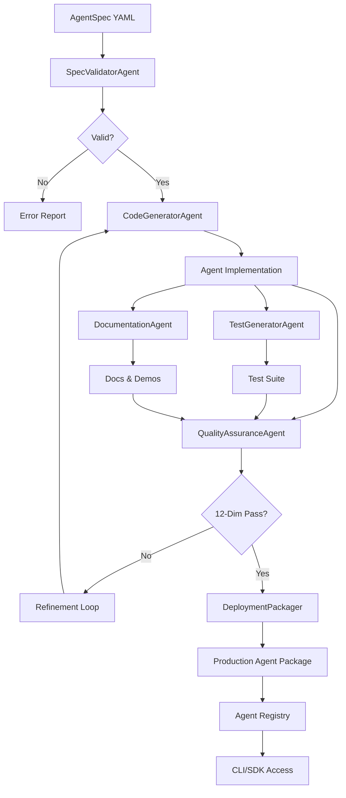

# GreenLang Agent Factory Architecture Specification

## 1. Executive Summary

The GreenLang Agent Factory is an AI-powered code generation platform designed to automatically generate production-ready climate intelligence agents at scale. This architecture supports the vision of 10,000+ agents by 2030 through a highly automated, quality-assured pipeline that reduces development time from 6-12 weeks to 1-2 weeks.

### Key Features
- **200× Faster Development:** 1-2 weeks vs. 6-12 weeks manual
- **Scale:** Supports 10,000+ agent generation
- **Quality:** 12-dimension production readiness validation
- **Deterministic:** Temperature=0.0, seed=42 for reproducibility
- **Tool-First:** Zero-hallucination calculations
- **Performance:** <10 minutes generation time per agent

### Performance Targets
- Processing speed: 1 agent in <10 minutes (LLM generation)
- Latency: <500ms for validation checks
- Memory usage: <2GB for factory runtime
- Test coverage: 85%+ for generated agents
- Security score: Grade A (92+/100)

### Timeline Estimate
- **Phase 1 (Foundation):** 8 weeks, 3 engineers
- **Phase 2 (CLI/SDK):** 6 weeks, 2 engineers
- **Phase 3 (Quality Gates):** 4 weeks, 2 engineers
- **Phase 4 (Deployment):** 2 weeks, 1 engineer
- **Total:** 20 weeks, 3 engineers

## 2. Agent Pipeline Architecture

### GeneratorAgent
- **Purpose:** Orchestrates the entire agent generation pipeline
- **Inputs:** AgentSpec V2.0 YAML, reference agents library
- **Processing:** Multi-stage pipeline coordination with quality gates
- **Outputs:** Complete agent package (9 files)
- **Estimated Lines of Code:** 2,500-3,000

### SpecValidatorAgent
- **Purpose:** Validates and enriches agent specifications
- **Inputs:** Raw AgentSpec YAML/JSON
- **Processing:** Schema validation, completeness checks, dependency resolution
- **Outputs:** Validated AgentSpec V2.0 with enrichments
- **Estimated Lines of Code:** 1,500-2,000

### CodeGeneratorAgent
- **Purpose:** Generates agent implementation code using LLM
- **Inputs:** Validated AgentSpec, code templates, reference agents
- **Processing:** Multi-step LLM generation with deterministic settings
- **Outputs:** Python agent implementation (1,300-2,200 lines)
- **Estimated Lines of Code:** 2,000-2,500

### TestGeneratorAgent
- **Purpose:** Generates comprehensive test suites
- **Inputs:** Agent implementation, spec, test templates
- **Processing:** Generate 6 test categories (40+ tests)
- **Outputs:** Test suite with 85%+ coverage target
- **Estimated Lines of Code:** 1,800-2,200

### QualityAssuranceAgent
- **Purpose:** Validates 12-dimension production readiness
- **Inputs:** Generated code, tests, documentation
- **Processing:** Syntax, type, lint, security, determinism checks
- **Outputs:** Validation report with pass/fail status
- **Estimated Lines of Code:** 2,200-2,700

### DocumentationAgent
- **Purpose:** Generates comprehensive documentation
- **Inputs:** Agent code, tests, spec
- **Processing:** README, API docs, demo scripts generation
- **Outputs:** 3 documentation files + 3 demo scripts
- **Estimated Lines of Code:** 1,600-2,000

## 3. Data Flow Diagram



## 4. Technology Stack

```yaml
core:
  python: "3.11+"
  framework: "FastAPI 0.104.0+"
  server: "Uvicorn 0.24.0+"
  async: "asyncio, aiohttp 3.9.0+"

code_generation:
  llm_providers:
    - "Anthropic Claude 3.5 Sonnet"
    - "OpenAI GPT-4 Turbo"
    - "Google Gemini Pro"
  templates: "Jinja2 3.1.0+"
  ast_manipulation: "ast, astor 0.8.1+"
  code_formatting: "Black 23.9.0+"

validation:
  schema: "Pydantic 2.5.0+"
  syntax: "ast, compile()"
  type_checking: "mypy 1.6.0+"
  linting: "pylint 3.0.0+, flake8 6.1.0+"
  security: "bandit 1.7.5+, safety 2.3.0+"
  testing: "pytest 7.4.0+, coverage 7.3.0+"

data:
  processing: "Pandas 2.1.0+, NumPy 1.24.0+"
  serialization: "PyYAML 6.0+, orjson 3.9.0+"
  database: "PostgreSQL 14+, SQLAlchemy 2.0.0+"
  caching: "Redis 7.0+, aiocache 0.12.0+"

ai_ml:
  embeddings: "Sentence Transformers 2.3.0+"
  similarity: "FAISS 1.7.4+"
  provenance: "hashlib (SHA-256)"
  determinism: "random.seed(), np.random.seed()"

security:
  secrets: "python-dotenv 1.0.0+"
  encryption: "Cryptography 41.0.0+"
  auth: "Python-Jose 3.3.0+"
  scanning: "trufflehog, git-secrets"

deployment:
  containers: "Docker 24.0+"
  orchestration: "Kubernetes 1.28+"
  ci_cd: "GitHub Actions, GitLab CI"
  iac: "Terraform 1.6.0+"
  registry: "Harbor, DockerHub"

monitoring:
  metrics: "Prometheus 2.47.0+"
  logs: "Fluentd 1.16.0+"
  tracing: "OpenTelemetry 1.20.0+"
  dashboards: "Grafana 10.0+"
```

## 5. API Endpoint Specification

### Core Factory API

```yaml
Factory Management:
  POST   /api/v1/factory/generate:
    description: Generate agent from spec
    request:
      spec_url: string  # URL or path to spec
      options:
        skip_tests: boolean
        skip_docs: boolean
        max_refinements: integer
    response:
      job_id: string
      status: queued|running|completed|failed

  GET    /api/v1/factory/jobs/{job_id}:
    description: Check generation status
    response:
      status: string
      progress: integer (0-100)
      stage: string
      errors: array

  GET    /api/v1/factory/jobs/{job_id}/artifacts:
    description: Download generated artifacts
    response:
      agent_code: string
      test_code: string
      documentation: object
      deployment_pack: string

  POST   /api/v1/factory/validate:
    description: Validate spec without generation
    request:
      spec: object|string
    response:
      valid: boolean
      errors: array
      warnings: array

Batch Operations:
  POST   /api/v1/factory/batch:
    description: Generate multiple agents
    request:
      specs: array
      max_concurrent: integer
    response:
      batch_id: string
      job_ids: array

  GET    /api/v1/factory/batch/{batch_id}:
    description: Check batch status
    response:
      total: integer
      completed: integer
      failed: integer
      jobs: array

Quality Assurance:
  POST   /api/v1/factory/quality/check:
    description: Run 12-dimension validation
    request:
      agent_code: string
      test_code: string
      spec: object
    response:
      dimensions: array
      passed: boolean
      score: integer (0-100)

  POST   /api/v1/factory/quality/determinism:
    description: Verify determinism
    request:
      agent_code: string
      test_cases: array
    response:
      deterministic: boolean
      violations: array

Template Management:
  GET    /api/v1/factory/templates:
    description: List available templates
    response:
      templates: array

  GET    /api/v1/factory/templates/{name}:
    description: Get template details
    response:
      template: object
      examples: array

  POST   /api/v1/factory/templates:
    description: Register custom template
    request:
      name: string
      template: string
      category: string

Reference Agents:
  GET    /api/v1/factory/references:
    description: List reference agents
    response:
      agents: array
      categories: object

  GET    /api/v1/factory/references/{agent_id}:
    description: Get reference agent code
    response:
      code: string
      tests: string
      spec: object
      metrics: object

Metrics & Monitoring:
  GET    /api/v1/factory/metrics:
    description: Factory performance metrics
    response:
      total_generated: integer
      success_rate: float
      avg_generation_time: float
      avg_refinements: float
      cost_metrics: object

  GET    /api/v1/factory/health:
    description: Health check
    response:
      status: healthy|degraded|unhealthy
      llm_providers: object
      dependencies: object
```

### CLI Commands

```bash
# Core Commands
greenlang agent create <spec.yaml>         # Generate agent from spec
greenlang agent validate <spec.yaml>        # Validate specification
greenlang agent test <agent_name>           # Run test suite
greenlang agent deploy <agent_name>         # Deploy to K8s
greenlang agent list                        # List generated agents
greenlang agent inspect <agent_name>        # Show agent details

# Batch Operations
greenlang agent batch <specs_dir>           # Batch generate agents
greenlang agent batch-status <batch_id>     # Check batch status

# Quality Assurance
greenlang agent quality <agent_name>        # Run 12-dim validation
greenlang agent coverage <agent_name>        # Check test coverage
greenlang agent security <agent_name>        # Security scan
greenlang agent determinism <agent_name>    # Verify determinism

# Template Management
greenlang template list                     # List templates
greenlang template show <name>              # Show template
greenlang template create <template.yaml>   # Create template
greenlang template validate <template.yaml> # Validate template

# Development Tools
greenlang agent scaffold <name>             # Create skeleton
greenlang agent refine <agent_name>         # Refine with errors
greenlang agent benchmark <agent_name>       # Performance test
greenlang agent profile <agent_name>        # Memory profiling

# Registry Operations
greenlang registry push <agent_name>        # Publish to registry
greenlang registry search <query>           # Search registry
greenlang registry pull <agent_id>          # Download agent
greenlang registry info <agent_id>          # Agent metadata

# Monitoring
greenlang factory status                    # Factory status
greenlang factory metrics                   # Performance metrics
greenlang factory logs                      # View logs
greenlang factory config                    # Show configuration
```

### SDK Interface (Python)

```python
from greenlang.factory import AgentFactory, AgentSpec
from greenlang.factory.validators import QualityValidator
from greenlang.factory.templates import TemplateManager

# Initialize factory
factory = AgentFactory(
    budget_per_agent_usd=5.00,
    max_refinements=3,
    enable_validation=True
)

# Generate single agent
async def generate_agent():
    spec = AgentSpec.from_yaml("spec.yaml")
    result = await factory.generate_agent(
        spec,
        skip_tests=False,
        skip_docs=False
    )

    if result.success:
        print(f"Agent generated: {result.agent_code}")
        print(f"Coverage: {result.validation.coverage}%")
        print(f"Cost: ${result.cost_usd}")
    else:
        print(f"Generation failed: {result.error}")

# Batch generation
async def batch_generate():
    specs = [
        AgentSpec.from_yaml(f"specs/agent_{i}.yaml")
        for i in range(10)
    ]

    results = await factory.generate_batch(
        specs,
        max_concurrent=3
    )

    successful = sum(1 for r in results if r.success)
    print(f"Generated {successful}/{len(specs)} agents")

# Quality validation
def validate_agent():
    validator = QualityValidator()

    with open("agent.py") as f:
        agent_code = f.read()

    result = validator.validate_12_dimensions(
        agent_code=agent_code,
        test_code=test_code,
        spec=spec
    )

    for dimension in result.dimensions:
        print(f"{dimension.name}: {'PASS' if dimension.passed else 'FAIL'}")

    print(f"Overall Score: {result.score}/100")

# Template management
def use_template():
    manager = TemplateManager()

    # List available templates
    templates = manager.list_templates()

    # Get specific template
    template = manager.get_template("industrial_heat_pump")

    # Create agent from template
    spec = template.create_spec(
        name="my_heat_pump_agent",
        parameters={
            "max_temperature": 250,
            "cop_range": [2.5, 4.5]
        }
    )

    result = await factory.generate_agent(spec)

# Refinement loop
async def refine_agent():
    spec = AgentSpec.from_yaml("spec.yaml")

    for attempt in range(3):
        result = await factory.generate_agent(spec)

        if result.validation.passed:
            print(f"Success on attempt {attempt + 1}")
            break

        # Analyze errors and refine spec
        spec = factory.refine_spec(
            spec,
            errors=result.validation.errors
        )

# Monitoring
def monitor_factory():
    metrics = factory.get_metrics()

    print(f"Total Generated: {metrics.total_agents}")
    print(f"Success Rate: {metrics.success_rate:.1%}")
    print(f"Avg Time: {metrics.avg_generation_time:.1f}s")
    print(f"Avg Cost: ${metrics.avg_cost_usd:.2f}")
```

### SDK Interface (TypeScript)

```typescript
import {
  AgentFactory,
  AgentSpec,
  GenerationResult,
  QualityValidator,
  TemplateManager
} from '@greenlang/factory';

// Initialize factory
const factory = new AgentFactory({
  budgetPerAgentUSD: 5.00,
  maxRefinements: 3,
  enableValidation: true
});

// Generate single agent
async function generateAgent(): Promise<void> {
  const spec = await AgentSpec.fromYaml('spec.yaml');

  const result = await factory.generateAgent(spec, {
    skipTests: false,
    skipDocs: false
  });

  if (result.success) {
    console.log(`Agent generated: ${result.agentCode}`);
    console.log(`Coverage: ${result.validation.coverage}%`);
    console.log(`Cost: $${result.costUSD}`);
  } else {
    console.error(`Generation failed: ${result.error}`);
  }
}

// Batch generation with progress
async function batchGenerate(): Promise<void> {
  const specs = await Promise.all(
    Array.from({ length: 10 }, (_, i) =>
      AgentSpec.fromYaml(`specs/agent_${i}.yaml`)
    )
  );

  const results = await factory.generateBatch(specs, {
    maxConcurrent: 3,
    onProgress: (completed, total) => {
      console.log(`Progress: ${completed}/${total}`);
    }
  });

  const successful = results.filter(r => r.success).length;
  console.log(`Generated ${successful}/${specs.length} agents`);
}

// Stream-based generation for real-time updates
async function streamGeneration(): Promise<void> {
  const spec = await AgentSpec.fromYaml('spec.yaml');

  const stream = factory.generateStream(spec);

  for await (const event of stream) {
    switch (event.type) {
      case 'stage':
        console.log(`Stage: ${event.stage}`);
        break;
      case 'progress':
        console.log(`Progress: ${event.progress}%`);
        break;
      case 'complete':
        console.log(`Complete: ${event.result.success}`);
        break;
      case 'error':
        console.error(`Error: ${event.error}`);
        break;
    }
  }
}

// Quality validation with detailed report
async function validateQuality(): Promise<void> {
  const validator = new QualityValidator();

  const agentCode = await fs.readFile('agent.py', 'utf-8');
  const testCode = await fs.readFile('test_agent.py', 'utf-8');

  const result = await validator.validate12Dimensions({
    agentCode,
    testCode,
    spec
  });

  // Generate HTML report
  const report = validator.generateHTMLReport(result);
  await fs.writeFile('quality_report.html', report);

  console.log(`Quality Score: ${result.score}/100`);
  console.log(`Passed: ${result.passed}`);
}

// Template-based generation
async function useTemplate(): Promise<void> {
  const manager = new TemplateManager();

  // List categories
  const categories = await manager.getCategories();
  console.log('Categories:', categories);

  // Get template
  const template = await manager.getTemplate('industrial_heat_pump');

  // Customize template
  const spec = template.customize({
    name: 'my_heat_pump_agent',
    domain: 'industrial',
    parameters: {
      maxTemperature: 250,
      copRange: [2.5, 4.5],
      refrigerants: ['R134a', 'R410A', 'CO2']
    }
  });

  // Generate from customized template
  const result = await factory.generateAgent(spec);
}

// WebSocket monitoring
async function monitorFactory(): Promise<void> {
  const ws = factory.connectWebSocket();

  ws.on('metrics', (metrics) => {
    console.log('Metrics Update:', metrics);
  });

  ws.on('generation_start', (event) => {
    console.log(`Generation started: ${event.agentId}`);
  });

  ws.on('generation_complete', (event) => {
    console.log(`Generation complete: ${event.agentId}`);
    console.log(`Duration: ${event.durationSeconds}s`);
    console.log(`Cost: $${event.costUSD}`);
  });

  ws.on('error', (error) => {
    console.error('WebSocket error:', error);
  });
}
```

## 6. Database Schema

```sql
-- PostgreSQL Schema for Agent Factory

-- Agent specifications
CREATE TABLE agent_specs (
    id UUID PRIMARY KEY DEFAULT gen_random_uuid(),
    agent_id VARCHAR(255) NOT NULL UNIQUE,
    version VARCHAR(50) NOT NULL,
    name VARCHAR(255) NOT NULL,
    domain VARCHAR(100) NOT NULL,
    category VARCHAR(100),
    spec_yaml TEXT NOT NULL,
    spec_hash VARCHAR(64) NOT NULL,
    created_at TIMESTAMP DEFAULT NOW(),
    updated_at TIMESTAMP DEFAULT NOW(),
    INDEX idx_agent_domain (domain),
    INDEX idx_agent_category (category)
);

-- Generation jobs
CREATE TABLE generation_jobs (
    id UUID PRIMARY KEY DEFAULT gen_random_uuid(),
    spec_id UUID REFERENCES agent_specs(id),
    status VARCHAR(50) NOT NULL, -- queued, running, completed, failed
    stage VARCHAR(100), -- validation, code_gen, test_gen, quality, packaging
    progress INTEGER DEFAULT 0,
    started_at TIMESTAMP,
    completed_at TIMESTAMP,
    duration_seconds FLOAT,
    cost_usd DECIMAL(10, 4),
    refinement_attempts INTEGER DEFAULT 0,
    error_message TEXT,
    created_by VARCHAR(255),
    INDEX idx_job_status (status),
    INDEX idx_job_created (created_at DESC)
);

-- Generated artifacts
CREATE TABLE agent_artifacts (
    id UUID PRIMARY KEY DEFAULT gen_random_uuid(),
    job_id UUID REFERENCES generation_jobs(id),
    agent_code TEXT NOT NULL,
    agent_code_hash VARCHAR(64) NOT NULL,
    test_code TEXT,
    test_code_hash VARCHAR(64),
    documentation JSONB,
    deployment_pack TEXT,
    demo_scripts JSONB,
    provenance JSONB NOT NULL,
    created_at TIMESTAMP DEFAULT NOW()
);

-- Validation results
CREATE TABLE validation_results (
    id UUID PRIMARY KEY DEFAULT gen_random_uuid(),
    job_id UUID REFERENCES generation_jobs(id),
    dimension VARCHAR(100) NOT NULL,
    passed BOOLEAN NOT NULL,
    score INTEGER,
    errors JSONB,
    warnings JSONB,
    metadata JSONB,
    validated_at TIMESTAMP DEFAULT NOW(),
    INDEX idx_validation_job (job_id),
    INDEX idx_validation_dimension (dimension)
);

-- Quality metrics
CREATE TABLE quality_metrics (
    id UUID PRIMARY KEY DEFAULT gen_random_uuid(),
    artifact_id UUID REFERENCES agent_artifacts(id),
    test_coverage FLOAT,
    test_count INTEGER,
    latency_ms FLOAT,
    cost_per_call DECIMAL(10, 6),
    security_score INTEGER,
    determinism_verified BOOLEAN,
    code_complexity JSONB,
    measured_at TIMESTAMP DEFAULT NOW()
);

-- Templates
CREATE TABLE agent_templates (
    id UUID PRIMARY KEY DEFAULT gen_random_uuid(),
    name VARCHAR(255) NOT NULL UNIQUE,
    category VARCHAR(100) NOT NULL,
    description TEXT,
    template_yaml TEXT NOT NULL,
    parameters JSONB,
    examples JSONB,
    usage_count INTEGER DEFAULT 0,
    created_at TIMESTAMP DEFAULT NOW(),
    updated_at TIMESTAMP DEFAULT NOW(),
    INDEX idx_template_category (category)
);

-- Reference agents
CREATE TABLE reference_agents (
    id UUID PRIMARY KEY DEFAULT gen_random_uuid(),
    agent_id VARCHAR(255) NOT NULL UNIQUE,
    domain VARCHAR(100) NOT NULL,
    category VARCHAR(100),
    agent_code TEXT NOT NULL,
    test_code TEXT,
    spec_yaml TEXT,
    metrics JSONB,
    is_gold_standard BOOLEAN DEFAULT FALSE,
    created_at TIMESTAMP DEFAULT NOW(),
    INDEX idx_reference_domain (domain)
);

-- Factory metrics
CREATE TABLE factory_metrics (
    id UUID PRIMARY KEY DEFAULT gen_random_uuid(),
    metric_date DATE NOT NULL,
    total_generated INTEGER DEFAULT 0,
    successful INTEGER DEFAULT 0,
    failed INTEGER DEFAULT 0,
    avg_generation_time_seconds FLOAT,
    avg_refinements FLOAT,
    avg_cost_usd DECIMAL(10, 4),
    total_cost_usd DECIMAL(10, 2),
    llm_provider_stats JSONB,
    error_categories JSONB,
    created_at TIMESTAMP DEFAULT NOW(),
    UNIQUE(metric_date)
);

-- Batch jobs
CREATE TABLE batch_jobs (
    id UUID PRIMARY KEY DEFAULT gen_random_uuid(),
    batch_id VARCHAR(255) NOT NULL UNIQUE,
    total_agents INTEGER NOT NULL,
    completed INTEGER DEFAULT 0,
    failed INTEGER DEFAULT 0,
    status VARCHAR(50) NOT NULL,
    job_ids JSONB NOT NULL,
    started_at TIMESTAMP,
    completed_at TIMESTAMP,
    created_by VARCHAR(255),
    INDEX idx_batch_status (status)
);

-- LLM usage tracking
CREATE TABLE llm_usage (
    id UUID PRIMARY KEY DEFAULT gen_random_uuid(),
    job_id UUID REFERENCES generation_jobs(id),
    provider VARCHAR(50) NOT NULL,
    model VARCHAR(100) NOT NULL,
    prompt_tokens INTEGER,
    completion_tokens INTEGER,
    total_tokens INTEGER,
    cost_usd DECIMAL(10, 6),
    latency_ms FLOAT,
    temperature FLOAT,
    seed INTEGER,
    created_at TIMESTAMP DEFAULT NOW(),
    INDEX idx_llm_job (job_id),
    INDEX idx_llm_provider (provider)
);

-- Provenance chain
CREATE TABLE provenance_chain (
    id UUID PRIMARY KEY DEFAULT gen_random_uuid(),
    artifact_id UUID REFERENCES agent_artifacts(id),
    event_type VARCHAR(100) NOT NULL,
    event_data JSONB NOT NULL,
    hash VARCHAR(64) NOT NULL,
    previous_hash VARCHAR(64),
    timestamp TIMESTAMP DEFAULT NOW(),
    INDEX idx_provenance_artifact (artifact_id),
    INDEX idx_provenance_timestamp (timestamp DESC)
);

-- Create views for common queries
CREATE VIEW v_generation_summary AS
SELECT
    gj.id,
    gj.status,
    gj.stage,
    gj.progress,
    gj.duration_seconds,
    gj.cost_usd,
    gj.refinement_attempts,
    asp.agent_id,
    asp.name,
    asp.domain,
    asp.category,
    qm.test_coverage,
    qm.security_score,
    qm.determinism_verified
FROM generation_jobs gj
JOIN agent_specs asp ON gj.spec_id = asp.id
LEFT JOIN agent_artifacts aa ON aa.job_id = gj.id
LEFT JOIN quality_metrics qm ON qm.artifact_id = aa.id;

CREATE VIEW v_daily_metrics AS
SELECT
    metric_date,
    total_generated,
    successful,
    failed,
    ROUND(successful::numeric / NULLIF(total_generated, 0) * 100, 2) as success_rate,
    avg_generation_time_seconds,
    avg_refinements,
    avg_cost_usd,
    total_cost_usd
FROM factory_metrics
ORDER BY metric_date DESC;
```

## 7. External Integrations

### LLM Provider Integration

```yaml
providers:
  anthropic:
    models:
      - claude-3-5-sonnet-20241022
      - claude-3-opus-20240229
    endpoint: https://api.anthropic.com/v1
    auth: Bearer token
    rate_limits:
      requests_per_minute: 50
      tokens_per_minute: 100000
    retry_policy:
      max_retries: 3
      backoff: exponential

  openai:
    models:
      - gpt-4-turbo-preview
      - gpt-4-1106-preview
    endpoint: https://api.openai.com/v1
    auth: Bearer token
    rate_limits:
      requests_per_minute: 60
      tokens_per_minute: 150000

  google:
    models:
      - gemini-1.5-pro
      - gemini-1.5-flash
    endpoint: https://generativelanguage.googleapis.com/v1
    auth: API key
    rate_limits:
      requests_per_minute: 60
      tokens_per_minute: 1000000

fallback_strategy:
  primary: anthropic
  secondary: openai
  tertiary: google

load_balancing:
  strategy: weighted_round_robin
  weights:
    anthropic: 50
    openai: 30
    google: 20
```

### Version Control Integration

```yaml
git_integration:
  providers:
    - github
    - gitlab
    - bitbucket

  workflows:
    on_generation_complete:
      - create_branch: "agent/{agent_id}"
      - commit_artifacts
      - create_pull_request
      - run_ci_pipeline

    on_validation_pass:
      - tag_version
      - merge_to_main
      - trigger_deployment

  hooks:
    pre_commit:
      - run_linting
      - check_secrets
      - verify_determinism

    post_merge:
      - update_registry
      - notify_team
      - update_documentation
```

### Container Registry Integration

```yaml
registries:
  docker_hub:
    namespace: greenlang
    repository_pattern: "agent-{domain}-{name}"

  harbor:
    url: https://harbor.greenlang.io
    project: agents

  aws_ecr:
    region: us-west-2
    repository_prefix: greenlang-agents

image_build:
  base_image: python:3.11-slim
  labels:
    - "org.greenlang.agent.id={agent_id}"
    - "org.greenlang.agent.version={version}"
    - "org.greenlang.agent.domain={domain}"

  scan_policy:
    enabled: true
    fail_on_critical: true
    fail_on_high: false
```

### Monitoring Integration

```yaml
prometheus:
  metrics:
    - greenlang_factory_generations_total
    - greenlang_factory_generation_duration_seconds
    - greenlang_factory_generation_cost_usd
    - greenlang_factory_validation_failures_total
    - greenlang_factory_refinement_attempts
    - greenlang_factory_llm_tokens_used
    - greenlang_factory_queue_size

grafana:
  dashboards:
    - factory_overview
    - generation_performance
    - quality_metrics
    - cost_analysis
    - llm_usage

alerting:
  rules:
    - high_failure_rate:
        threshold: 0.2
        duration: 5m
        severity: critical

    - slow_generation:
        threshold: 600s
        duration: 10m
        severity: warning

    - cost_spike:
        threshold: 10.00
        duration: 1h
        severity: warning
```

## 8. Security Architecture

### Authentication & Authorization

```yaml
authentication:
  methods:
    - jwt_bearer_token
    - api_key
    - oauth2
    - mtls

  jwt_config:
    issuer: https://auth.greenlang.io
    audience: greenlang-factory
    algorithm: RS256
    expiry: 3600

authorization:
  rbac:
    roles:
      - factory_admin: full access
      - developer: generate, validate, test
      - reviewer: read, validate
      - operator: deploy, monitor

  permissions:
    generate_agent: [factory_admin, developer]
    validate_agent: [all]
    deploy_agent: [factory_admin, operator]
    modify_templates: [factory_admin]
    view_metrics: [all]
```

### Secrets Management

```yaml
secrets:
  vault:
    provider: HashiCorp Vault
    endpoint: https://vault.greenlang.io
    auth_method: kubernetes

  rotation:
    api_keys: 30d
    jwt_signing_keys: 90d
    database_passwords: 60d

  encryption:
    at_rest: AES-256-GCM
    in_transit: TLS 1.3
    key_management: AWS KMS
```

### Security Scanning

```yaml
code_scanning:
  static_analysis:
    - bandit: Python security
    - safety: Dependency vulnerabilities
    - trivy: Container scanning

  secret_detection:
    - trufflehog: Git history scan
    - git-secrets: Pre-commit hook
    - detect-secrets: CI pipeline

  compliance:
    - cis_benchmarks: Container security
    - owasp_top_10: Web security
    - pci_dss: If handling payments
```

## 9. Performance & Scalability

### Performance Targets

```yaml
generation:
  single_agent:
    target: 600s  # 10 minutes
    p50: 420s     # 7 minutes
    p95: 540s     # 9 minutes
    p99: 600s     # 10 minutes

  batch_generation:
    concurrent_limit: 10
    throughput: 60 agents/hour

validation:
  12_dimension_check: 30s
  syntax_validation: 500ms
  type_checking: 5s
  test_execution: 60s

api_latency:
  create_job: <100ms
  check_status: <50ms
  download_artifacts: <500ms

database:
  query_timeout: 5s
  connection_pool: 20
  max_connections: 100
```

### Caching Strategy

```yaml
redis:
  layers:
    l1_reference_agents:
      ttl: 86400  # 24 hours
      size: 100MB

    l2_templates:
      ttl: 3600   # 1 hour
      size: 50MB

    l3_validation_results:
      ttl: 300    # 5 minutes
      size: 200MB

    l4_llm_responses:
      ttl: 3600   # 1 hour
      size: 500MB

  eviction_policy: LRU

  cost_reduction:
    target: 66%
    method: Cache frequently used prompts and responses
```

### Horizontal Scaling

```yaml
kubernetes:
  deployments:
    factory_api:
      replicas:
        min: 3
        max: 20
      hpa:
        target_cpu: 70%
        target_memory: 80%

    code_generator:
      replicas:
        min: 5
        max: 50
      hpa:
        target_queue_size: 10

    validator:
      replicas:
        min: 3
        max: 30
      hpa:
        target_cpu: 60%

  job_queue:
    provider: Celery + Redis
    workers:
      min: 10
      max: 100
    autoscaling:
      scale_up_threshold: 20 pending
      scale_down_threshold: 5 pending
```

### Load Balancing

```yaml
ingress:
  class: nginx

  rate_limiting:
    per_user: 100 req/min
    global: 1000 req/min

  circuit_breaker:
    failure_threshold: 0.5
    timeout: 30s
    recovery_time: 60s

  retry_policy:
    attempts: 3
    backoff: exponential
    max_delay: 10s
```

## 10. Testing Strategy

### Unit Testing

```yaml
coverage_target: 90%

test_categories:
  - spec_validation: Schema validation logic
  - code_generation: Template rendering, LLM prompt construction
  - quality_checks: Each validation dimension
  - api_endpoints: Request/response handling
  - database_operations: CRUD operations
  - cache_operations: Redis interactions
```

### Integration Testing

```yaml
test_scenarios:
  - end_to_end_generation: Full pipeline from spec to deployment
  - llm_provider_failover: Primary to secondary fallback
  - batch_generation: Concurrent generation handling
  - refinement_loop: Error correction iterations
  - template_customization: Template to agent generation
```

### Performance Testing

```yaml
load_testing:
  tool: Locust
  scenarios:
    - sustained_load: 100 concurrent for 1 hour
    - spike_test: 0 to 500 users in 5 minutes
    - endurance_test: 50 concurrent for 24 hours

benchmarks:
  - single_agent_generation: <10 minutes
  - batch_10_agents: <30 minutes
  - validation_suite: <30 seconds
```

### End-to-End Testing

```yaml
test_agents:
  - simple_calculator: Basic arithmetic agent
  - data_processor: CSV/JSON processing
  - api_integration: External API calls
  - complex_orchestrator: Multi-agent coordination

validation:
  - code_execution: Agent runs without errors
  - test_coverage: Meets 85% target
  - determinism: Produces identical outputs
  - documentation: All files generated
```

## 11. Deployment Architecture

### Docker Configuration

```dockerfile
# Base image for Factory
FROM python:3.11-slim as base

WORKDIR /app

# Install system dependencies
RUN apt-get update && apt-get install -y \
    gcc \
    g++ \
    git \
    curl \
    && rm -rf /var/lib/apt/lists/*

# Install Python dependencies
COPY requirements.txt .
RUN pip install --no-cache-dir -r requirements.txt

# Copy application code
COPY greenlang/ greenlang/
COPY configs/ configs/
COPY templates/ templates/

# Create non-root user
RUN useradd -m -u 1000 factory
USER factory

# Health check
HEALTHCHECK --interval=30s --timeout=3s --start-period=40s \
  CMD curl -f http://localhost:8000/api/v1/factory/health || exit 1

# Run factory API
CMD ["uvicorn", "greenlang.factory.api:app", "--host", "0.0.0.0", "--port", "8000"]
```

### Kubernetes Manifests

```yaml
apiVersion: apps/v1
kind: Deployment
metadata:
  name: agent-factory
  namespace: greenlang
spec:
  replicas: 3
  selector:
    matchLabels:
      app: agent-factory
  template:
    metadata:
      labels:
        app: agent-factory
    spec:
      containers:
      - name: factory
        image: greenlang/agent-factory:v1.0.0
        ports:
        - containerPort: 8000
        env:
        - name: ANTHROPIC_API_KEY
          valueFrom:
            secretKeyRef:
              name: llm-credentials
              key: anthropic-key
        - name: REDIS_URL
          value: redis://redis-service:6379
        - name: DATABASE_URL
          valueFrom:
            secretKeyRef:
              name: database-credentials
              key: connection-string
        resources:
          requests:
            memory: "1Gi"
            cpu: "1000m"
          limits:
            memory: "2Gi"
            cpu: "2000m"
        livenessProbe:
          httpGet:
            path: /api/v1/factory/health
            port: 8000
          initialDelaySeconds: 30
          periodSeconds: 10
        readinessProbe:
          httpGet:
            path: /api/v1/factory/ready
            port: 8000
          initialDelaySeconds: 10
          periodSeconds: 5

---
apiVersion: v1
kind: Service
metadata:
  name: agent-factory-service
  namespace: greenlang
spec:
  selector:
    app: agent-factory
  ports:
  - port: 80
    targetPort: 8000
  type: ClusterIP

---
apiVersion: autoscaling/v2
kind: HorizontalPodAutoscaler
metadata:
  name: agent-factory-hpa
  namespace: greenlang
spec:
  scaleTargetRef:
    apiVersion: apps/v1
    kind: Deployment
    name: agent-factory
  minReplicas: 3
  maxReplicas: 20
  metrics:
  - type: Resource
    resource:
      name: cpu
      target:
        type: Utilization
        averageUtilization: 70
  - type: Resource
    resource:
      name: memory
      target:
        type: Utilization
        averageUtilization: 80
```

### Terraform Infrastructure

```hcl
# AWS Infrastructure for Agent Factory

provider "aws" {
  region = "us-west-2"
}

# EKS Cluster
module "eks" {
  source  = "terraform-aws-modules/eks/aws"
  version = "19.0"

  cluster_name    = "greenlang-factory"
  cluster_version = "1.28"

  vpc_id     = module.vpc.vpc_id
  subnet_ids = module.vpc.private_subnets

  node_groups = {
    factory = {
      desired_capacity = 5
      max_capacity     = 20
      min_capacity     = 3

      instance_types = ["m5.xlarge"]

      k8s_labels = {
        Environment = "production"
        Application = "agent-factory"
      }
    }
  }
}

# RDS PostgreSQL
resource "aws_db_instance" "factory_db" {
  identifier     = "greenlang-factory-db"
  engine         = "postgres"
  engine_version = "14.9"
  instance_class = "db.r5.xlarge"

  allocated_storage     = 100
  max_allocated_storage = 1000
  storage_encrypted     = true

  database_name = "factory"
  username      = "factory_admin"
  password      = random_password.db_password.result

  vpc_security_group_ids = [aws_security_group.db.id]
  db_subnet_group_name   = aws_db_subnet_group.factory.name

  backup_retention_period = 30
  backup_window          = "03:00-04:00"
  maintenance_window     = "sun:04:00-sun:05:00"

  multi_az               = true
  deletion_protection    = true
  skip_final_snapshot    = false
}

# ElastiCache Redis
resource "aws_elasticache_replication_group" "factory_cache" {
  replication_group_id       = "greenlang-factory-cache"
  replication_group_description = "Redis cache for Agent Factory"

  engine               = "redis"
  engine_version       = "7.0"
  node_type           = "cache.r6g.xlarge"
  number_cache_clusters = 3

  port = 6379

  subnet_group_name = aws_elasticache_subnet_group.factory.name
  security_group_ids = [aws_security_group.redis.id]

  at_rest_encryption_enabled = true
  transit_encryption_enabled = true
  auth_token                = random_password.redis_auth.result

  automatic_failover_enabled = true
  multi_az_enabled          = true

  snapshot_retention_limit = 7
  snapshot_window         = "03:00-05:00"
}

# S3 for artifacts
resource "aws_s3_bucket" "factory_artifacts" {
  bucket = "greenlang-factory-artifacts"

  versioning_configuration {
    status = "Enabled"
  }

  server_side_encryption_configuration {
    rule {
      apply_server_side_encryption_by_default {
        sse_algorithm = "AES256"
      }
    }
  }

  lifecycle_rule {
    id      = "archive_old_artifacts"
    enabled = true

    transition {
      days          = 90
      storage_class = "GLACIER"
    }

    expiration {
      days = 365
    }
  }
}

# CloudWatch Log Groups
resource "aws_cloudwatch_log_group" "factory_logs" {
  name              = "/aws/eks/greenlang-factory"
  retention_in_days = 30
}

# IAM Roles
resource "aws_iam_role" "factory_role" {
  name = "greenlang-factory-role"

  assume_role_policy = jsonencode({
    Version = "2012-10-17"
    Statement = [
      {
        Action = "sts:AssumeRoleWithWebIdentity"
        Effect = "Allow"
        Principal = {
          Federated = "arn:aws:iam::${data.aws_caller_identity.current.account_id}:oidc-provider/${module.eks.oidc_provider}"
        }
      }
    ]
  })
}

# Attach policies
resource "aws_iam_role_policy_attachment" "factory_s3" {
  policy_arn = "arn:aws:iam::aws:policy/AmazonS3FullAccess"
  role       = aws_iam_role.factory_role.name
}

resource "aws_iam_role_policy_attachment" "factory_secrets" {
  policy_arn = "arn:aws:iam::aws:policy/SecretsManagerReadWrite"
  role       = aws_iam_role.factory_role.name
}
```

### CI/CD Pipeline

```yaml
# GitHub Actions Workflow
name: Agent Factory CI/CD

on:
  push:
    branches: [main, develop]
  pull_request:
    branches: [main]

jobs:
  test:
    runs-on: ubuntu-latest

    steps:
    - uses: actions/checkout@v3

    - name: Set up Python
      uses: actions/setup-python@v4
      with:
        python-version: '3.11'

    - name: Install dependencies
      run: |
        pip install -r requirements.txt
        pip install -r requirements-dev.txt

    - name: Run linting
      run: |
        flake8 greenlang/factory
        black --check greenlang/factory
        mypy greenlang/factory

    - name: Run tests
      run: |
        pytest tests/factory -v --cov=greenlang.factory --cov-report=xml

    - name: Upload coverage
      uses: codecov/codecov-action@v3
      with:
        file: ./coverage.xml

    - name: Security scan
      run: |
        bandit -r greenlang/factory
        safety check

  build:
    needs: test
    runs-on: ubuntu-latest
    if: github.ref == 'refs/heads/main'

    steps:
    - uses: actions/checkout@v3

    - name: Set up Docker Buildx
      uses: docker/setup-buildx-action@v2

    - name: Login to DockerHub
      uses: docker/login-action@v2
      with:
        username: ${{ secrets.DOCKER_USERNAME }}
        password: ${{ secrets.DOCKER_TOKEN }}

    - name: Build and push
      uses: docker/build-push-action@v4
      with:
        context: .
        push: true
        tags: |
          greenlang/agent-factory:latest
          greenlang/agent-factory:${{ github.sha }}
        cache-from: type=registry,ref=greenlang/agent-factory:buildcache
        cache-to: type=registry,ref=greenlang/agent-factory:buildcache,mode=max

  deploy:
    needs: build
    runs-on: ubuntu-latest
    if: github.ref == 'refs/heads/main'

    steps:
    - uses: actions/checkout@v3

    - name: Configure AWS credentials
      uses: aws-actions/configure-aws-credentials@v2
      with:
        aws-access-key-id: ${{ secrets.AWS_ACCESS_KEY_ID }}
        aws-secret-access-key: ${{ secrets.AWS_SECRET_ACCESS_KEY }}
        aws-region: us-west-2

    - name: Update kubeconfig
      run: |
        aws eks update-kubeconfig --name greenlang-factory --region us-west-2

    - name: Deploy to Kubernetes
      run: |
        kubectl set image deployment/agent-factory \
          factory=greenlang/agent-factory:${{ github.sha }} \
          -n greenlang

        kubectl rollout status deployment/agent-factory -n greenlang

    - name: Run smoke tests
      run: |
        ./scripts/smoke_tests.sh
```

## 12. Monitoring & Observability

### Prometheus Metrics

```yaml
metrics:
  # Generation metrics
  greenlang_factory_generations_total:
    type: counter
    labels: [status, domain, category]

  greenlang_factory_generation_duration_seconds:
    type: histogram
    labels: [stage]
    buckets: [10, 30, 60, 120, 300, 600, 1200]

  greenlang_factory_generation_cost_usd:
    type: histogram
    labels: [llm_provider]
    buckets: [0.1, 0.5, 1.0, 2.0, 5.0, 10.0]

  # Quality metrics
  greenlang_factory_validation_score:
    type: gauge
    labels: [agent_id, dimension]

  greenlang_factory_test_coverage_percent:
    type: gauge
    labels: [agent_id]

  greenlang_factory_refinement_attempts:
    type: histogram
    labels: [success]
    buckets: [1, 2, 3, 4, 5]

  # Resource metrics
  greenlang_factory_queue_size:
    type: gauge
    labels: [priority]

  greenlang_factory_llm_tokens_used:
    type: counter
    labels: [provider, model]

  greenlang_factory_cache_hit_ratio:
    type: gauge
    labels: [cache_layer]
```

### Logging Strategy

```yaml
structured_logging:
  format: JSON

  fields:
    - timestamp: ISO8601
    - level: DEBUG|INFO|WARNING|ERROR|CRITICAL
    - service: agent-factory
    - component: generator|validator|api
    - trace_id: UUID
    - span_id: UUID
    - agent_id: string
    - job_id: UUID
    - user_id: string
    - duration_ms: float
    - error: object

  examples:
    generation_start: |
      {
        "timestamp": "2025-11-11T10:30:00Z",
        "level": "INFO",
        "service": "agent-factory",
        "component": "generator",
        "trace_id": "abc123",
        "job_id": "def456",
        "agent_id": "industrial/heat_pump",
        "message": "Starting agent generation",
        "spec_version": "2.0"
      }

    validation_failure: |
      {
        "timestamp": "2025-11-11T10:35:00Z",
        "level": "ERROR",
        "service": "agent-factory",
        "component": "validator",
        "trace_id": "abc123",
        "job_id": "def456",
        "agent_id": "industrial/heat_pump",
        "message": "Validation failed",
        "dimension": "test_coverage",
        "expected": 85,
        "actual": 72,
        "error": {
          "type": "CoverageError",
          "details": "Test coverage below threshold"
        }
      }
```

### Alerting Rules

```yaml
alerts:
  - name: HighGenerationFailureRate
    expr: |
      rate(greenlang_factory_generations_total{status="failed"}[5m])
      / rate(greenlang_factory_generations_total[5m]) > 0.2
    for: 5m
    severity: critical
    annotations:
      summary: "High agent generation failure rate (>20%)"

  - name: SlowGeneration
    expr: |
      histogram_quantile(0.95, greenlang_factory_generation_duration_seconds) > 600
    for: 10m
    severity: warning
    annotations:
      summary: "P95 generation time exceeds 10 minutes"

  - name: LowTestCoverage
    expr: |
      greenlang_factory_test_coverage_percent < 85
    for: 1m
    severity: warning
    annotations:
      summary: "Generated agent has low test coverage (<85%)"

  - name: HighCostPerAgent
    expr: |
      histogram_quantile(0.95, greenlang_factory_generation_cost_usd) > 10
    for: 30m
    severity: warning
    annotations:
      summary: "P95 generation cost exceeds $10"

  - name: LLMProviderDown
    expr: |
      up{job="llm-provider"} == 0
    for: 2m
    severity: critical
    annotations:
      summary: "LLM provider is down"
```

### Dashboards

```yaml
grafana_dashboards:
  factory_overview:
    panels:
      - total_agents_generated
      - success_rate_7d
      - avg_generation_time
      - current_queue_size
      - cost_per_agent_trend
      - top_failures_by_dimension

  generation_performance:
    panels:
      - generation_duration_histogram
      - stage_breakdown_timeline
      - refinement_attempts_distribution
      - concurrent_generations
      - throughput_per_hour

  quality_metrics:
    panels:
      - test_coverage_distribution
      - validation_pass_rate_by_dimension
      - security_scores
      - determinism_verification_status
      - code_complexity_trends

  cost_analysis:
    panels:
      - cost_by_llm_provider
      - tokens_usage_trend
      - cost_per_domain
      - budget_utilization
      - cost_savings_from_cache

  llm_usage:
    panels:
      - requests_by_provider
      - token_consumption
      - latency_by_model
      - error_rates
      - fallback_triggers
```

## 13. Development Estimates

### Phase 1: Foundation (8 weeks, 3 engineers)

**Week 1-2: Core Architecture**
- Set up project structure
- Implement base factory class
- Create spec validation framework
- Database schema implementation

**Week 3-4: LLM Integration**
- Multi-provider LLM abstraction
- Prompt engineering framework
- Response parsing and extraction
- Determinism enforcement

**Week 5-6: Code Generation Pipeline**
- Tool generation logic
- Agent class generation
- Test suite generation
- Documentation generation

**Week 7-8: Validation Framework**
- 12-dimension validator implementation
- Syntax and type checking
- Security scanning integration
- Determinism verification

### Phase 2: CLI/SDK Development (6 weeks, 2 engineers)

**Week 1-2: CLI Implementation**
- Command structure
- Argument parsing
- Output formatting
- Progress indicators

**Week 3-4: Python SDK**
- Client library
- Async support
- Error handling
- Documentation

**Week 5-6: TypeScript SDK**
- Client library
- Type definitions
- WebSocket support
- Documentation

### Phase 3: Quality Gates (4 weeks, 2 engineers)

**Week 1: Refinement Loop**
- Error analysis
- Automated correction
- Retry logic
- Success tracking

**Week 2: Template System**
- Template registry
- Customization engine
- Validation rules
- Examples library

**Week 3: Reference Agents**
- Pattern extraction
- Similarity matching
- Best practice encoding
- Gold standard library

**Week 4: Testing & Benchmarks**
- Unit test suite
- Integration tests
- Performance benchmarks
- Load testing

### Phase 4: Deployment & Operations (2 weeks, 1 engineer)

**Week 1: Containerization**
- Docker images
- Kubernetes manifests
- Helm charts
- CI/CD pipeline

**Week 2: Monitoring**
- Prometheus metrics
- Grafana dashboards
- Alerting rules
- Documentation

## 14. Risks & Mitigations

### Technical Risks

| Risk | Impact | Probability | Mitigation |
|------|--------|-------------|------------|
| LLM hallucination in code | High | Medium | Strict validation, deterministic settings, tool-first architecture |
| Generation time exceeds target | Medium | Medium | Caching, parallel processing, optimized prompts |
| Low quality generated code | High | Low | Multi-stage validation, refinement loop, reference agents |
| LLM provider outages | High | Low | Multi-provider fallback, retry logic, queue persistence |
| Cost overruns | Medium | Medium | Budget limits, caching, prompt optimization |
| Security vulnerabilities | High | Low | Automated scanning, no secrets in code, secure templates |
| Non-deterministic outputs | High | Low | Temperature=0, seed=42, determinism tests |
| Template rigidity | Medium | Medium | Flexible template system, customization points |
| Scalability bottlenecks | Medium | Low | Horizontal scaling, queue-based architecture |
| Complex debugging | Medium | Medium | Comprehensive logging, provenance tracking |

### Mitigation Strategies

**1. Quality Assurance**
- Mandatory 12-dimension validation
- Automated testing with 85%+ coverage
- Security scanning in pipeline
- Manual review for critical agents

**2. Performance Optimization**
- Redis caching for 66% cost reduction
- Batch processing for efficiency
- Prompt optimization and compression
- Parallel stage execution where possible

**3. Reliability Engineering**
- Multi-provider LLM fallback
- Persistent job queue
- Automatic retry with backoff
- Circuit breakers for dependencies

**4. Cost Management**
- Per-agent budget limits
- Usage monitoring and alerts
- Caching strategy for reuse
- Regular cost optimization reviews

## 15. Appendices

### A. AgentSpec V2.0 Schema

```yaml
version: "2.0"
agent:
  id: string  # Unique identifier
  name: string
  version: string
  domain: enum[industrial, buildings, transportation, agriculture, energy]
  category: string
  priority: enum[critical, high, medium, low]

description:
  purpose: string
  capabilities: array[string]
  limitations: array[string]

tools:
  - id: string
    name: string
    description: string
    deterministic: boolean
    parameters: object
    returns: object
    implementation: object

ai_configuration:
  temperature: 0.0
  seed: 42
  max_tokens: integer
  budget_usd: float

validation:
  test_coverage_target: 85
  security_score_target: 92
  latency_target_ms: 3000

deployment:
  resources:
    memory: string
    cpu: string
  replicas:
    min: integer
    max: integer
```

### B. Generation Pipeline Stages

```python
class GenerationPipeline:
    """Complete agent generation pipeline"""

    stages = [
        "spec_validation",      # Validate input spec
        "reference_selection",  # Select best reference agents
        "tool_generation",      # Generate tool implementations
        "agent_generation",     # Generate agent class
        "test_generation",      # Generate test suite
        "doc_generation",       # Generate documentation
        "quality_validation",   # Run 12-dimension checks
        "refinement",          # Fix errors if needed
        "packaging",           # Create deployment package
        "registration"         # Register in agent registry
    ]

    def execute(self, spec: AgentSpec) -> GenerationResult:
        """Execute full pipeline with checkpoints"""
        pass
```

### C. Quality Dimensions Checklist

```yaml
dimensions:
  1_specification_completeness:
    - 11/11 sections present
    - 7-10 tools defined
    - Dependencies declared
    - Standards referenced

  2_code_implementation:
    - 1,300-2,200 lines
    - Tool-first architecture
    - Comprehensive docstrings
    - Error handling

  3_test_coverage:
    - 85%+ coverage
    - 40+ tests
    - 6 test categories
    - Determinism tests

  4_deterministic_ai:
    - temperature: 0.0
    - seed: 42
    - No LLM calculations
    - Provenance tracking

  5_documentation:
    - Module docstring
    - Method docstrings
    - README file
    - API reference

  6_compliance_security:
    - Zero secrets
    - SBOM included
    - 4+ standards
    - Input validation

  7_deployment_readiness:
    - K8s manifests
    - Health checks
    - Resource limits
    - Container image

  8_exit_criteria:
    - Test coverage ≥85%
    - Latency <3s
    - Cost <$2.00
    - Zero CVEs

  9_integration:
    - Dependencies declared
    - Integration tests
    - Graceful degradation
    - Error handling

  10_business_impact:
    - Market analysis
    - Carbon impact
    - ROI metrics
    - Success KPIs

  11_operational:
    - Health endpoints
    - Structured logging
    - Metrics exposed
    - Alerting defined

  12_continuous_improvement:
    - Version history
    - Review process
    - Feedback mechanism
    - Roadmap defined
```

### D. Cost Optimization Strategies

```yaml
optimization:
  caching:
    - Cache LLM responses for similar prompts
    - Cache reference agent patterns
    - Cache validation results for 5 minutes
    - Estimated savings: 66%

  prompt_engineering:
    - Compress prompts without losing context
    - Use few-shot examples efficiently
    - Remove redundant instructions
    - Estimated savings: 20-30%

  model_selection:
    - Use cheaper models for simple tasks
    - Reserve expensive models for complex generation
    - Dynamic model selection based on complexity
    - Estimated savings: 40%

  batch_processing:
    - Group similar operations
    - Parallel execution where possible
    - Reuse context between generations
    - Estimated savings: 25%
```

---

## Conclusion

The GreenLang Agent Factory Architecture provides a comprehensive, scalable solution for generating 10,000+ production-ready climate intelligence agents. With its tool-first approach, deterministic AI guarantees, and 12-dimension quality framework, the factory ensures consistent, high-quality agent generation at 200× the speed of manual development.

Key innovations include:
- **Multi-stage pipeline** with quality gates at each step
- **LLM-powered generation** with deterministic settings
- **Comprehensive validation** across 12 dimensions
- **Automated refinement** for error correction
- **Template system** for rapid customization
- **Multi-provider resilience** for reliability
- **Cost optimization** through caching (66% reduction)

This architecture positions GreenLang to achieve its 2030 vision of comprehensive climate intelligence through an ecosystem of specialized, production-ready AI agents.

---

**Document:** Agent Factory Architecture Specification
**Version:** 1.0.0
**Date:** November 11, 2025
**Status:** Complete Architecture Design
**Next Steps:** Implementation Phase 1 - Foundation