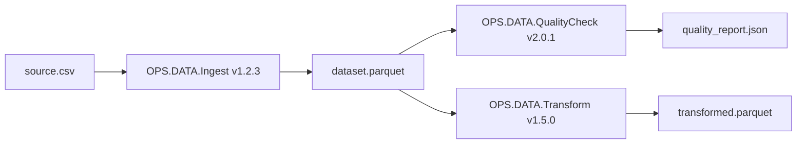

# ADR-004: S3 as Primary Artifact Store

**Date:** 2026-01-27
**Status:** Accepted
**Deciders:** Platform Engineering, Architecture Team, Data Engineering
**Consulted:** Security Team, SRE/Ops, Compliance, Cloud Infrastructure

---

## Context

### Problem Statement
GL-FOUND-X-001 (GreenLang Orchestrator) requires durable artifact storage for:
- Step inputs and outputs (datasets, reports, model outputs)
- Pipeline definitions and execution plans
- Audit records and lineage metadata
- Agent container images and configuration

The storage system must support lineage tracking, multi-region replication, and audit compliance.

### Current Situation
- **Artifact Volume:** Expected 10TB+ daily artifact generation at scale
- **Retention:** 30-365 days depending on namespace policy
- **Access Patterns:** Write-once, read-many; occasional deletes per retention policy
- **Compliance:** CBAM, CSRD require immutable audit trails with lineage
- **Multi-Region:** EU data residency requirements for some tenants

### Business Impact
- **Audit Compliance:** Artifacts must be verifiable and tamper-evident
- **Cost Efficiency:** Storage costs scale with data volume
- **Performance:** Artifact retrieval latency impacts pipeline performance
- **Disaster Recovery:** Artifacts must survive regional failures

---

## Decision

### What We're Implementing
**AWS S3** as the primary artifact store, with **S3-compatible API support** for alternative backends (MinIO, GCS, Azure Blob via gateway).

### Core Architecture

1. **Artifact Storage Model**
   ```
   s3://gl-artifacts-{region}/
     ├── {tenant}/
     │   ├── runs/
     │   │   ├── {run_id}/
     │   │   │   ├── plan.json
     │   │   │   ├── metadata.json
     │   │   │   ├── steps/
     │   │   │   │   ├── {step_id}/
     │   │   │   │   │   ├── inputs/
     │   │   │   │   │   │   └── manifest.json
     │   │   │   │   │   └── outputs/
     │   │   │   │   │       ├── manifest.json
     │   │   │   │   │       ├── dataset.parquet
     │   │   │   │   │       └── report.pdf
     │   │   │   └── events/
     │   │   │       └── audit_trail.jsonl
     │   └── pipelines/
     │       └── {pipeline_hash}/
     │           └── definition.yaml
     └── registry/
         └── agents/
             └── {agent_name}/
                 └── {version}/
                     └── manifest.json
   ```

2. **Artifact Metadata Schema**
   ```json
   {
     "artifact_id": "art_abc123",
     "uri": "s3://gl-artifacts-eu/acme/runs/run_xyz/steps/ingest/outputs/dataset.parquet",
     "sha256": "e3b0c44298fc1c149afbf4c8996fb92427ae41e4649b934ca495991b7852b855",
     "size_bytes": 104857600,
     "media_type": "application/x-parquet",
     "created_at": "2026-01-27T10:30:00Z",
     "producer": {
       "run_id": "run_xyz",
       "step_id": "stp_ingest_001",
       "agent": "OPS.DATA.Ingest",
       "agent_version": "1.2.3"
     },
     "lineage": {
       "inputs": [
         {
           "artifact_id": "art_input001",
           "uri": "s3://gl-artifacts-eu/acme/runs/run_xyz/steps/ingest/inputs/source.csv"
         }
       ]
     },
     "retention": {
       "policy": "90-days",
       "expires_at": "2026-04-27T10:30:00Z"
     }
   }
   ```

3. **Storage Configuration**
   - **Bucket per Region:** `gl-artifacts-{region}` (us-east-1, eu-west-1, ap-southeast-1)
   - **Versioning:** Enabled for audit compliance
   - **Encryption:** SSE-S3 (default) or SSE-KMS (customer-managed keys)
   - **Lifecycle Policies:** Automatic transition to Glacier, deletion per retention

### Technology Stack
- **Primary:** AWS S3
- **S3-Compatible Alternatives:** MinIO (on-prem), GCS (via S3 gateway), Azure Blob (via gateway)
- **SDK:** boto3 (Python), aws-sdk (Go)
- **Metadata DB:** PostgreSQL for artifact metadata and lineage queries

### Code Location
- `greenlang/orchestrator/artifacts/`
  - `store.py` - Artifact store interface
  - `s3_backend.py` - S3 implementation
  - `minio_backend.py` - MinIO implementation (S3-compatible)
  - `metadata.py` - Artifact metadata management
  - `lineage.py` - Lineage graph operations
  - `retention.py` - Retention policy enforcement

---

## Rationale

### Why AWS S3

**1. Maturity and Reliability**
- 99.999999999% (11 9s) durability
- 99.99% availability SLA
- Proven at massive scale (exabytes)
- 18+ years of production hardening

**2. Multi-Region Support**
- Native cross-region replication (CRR)
- Data residency compliance via regional buckets
- Global acceleration for cross-region access

**3. Auditable**
- Object versioning for tamper evidence
- CloudTrail logging for access audit
- Object Lock for WORM compliance
- Presigned URLs for controlled access

**4. S3-Compatible API as Standard**
- De facto standard for object storage
- MinIO, GCS, Azure Blob all support S3 API
- Single codebase for multiple backends
- Portable across cloud and on-prem

**5. Cost-Effective**
- Pay-per-use pricing
- Intelligent tiering for cost optimization
- Glacier for long-term archive
- No upfront commitments required

**6. Rich Feature Set**
- Multipart uploads for large artifacts
- Event notifications (Lambda triggers)
- Inventory reports for compliance
- Select for querying data in place

---

## Alternatives Considered

### Alternative 1: Google Cloud Storage (GCS)
**Pros:**
- Strong consistency (unlike S3 eventual consistency historically)
- Good BigQuery integration
- Competitive pricing

**Cons:**
- Smaller market share than S3
- S3 API compatibility requires gateway
- Less tooling availability
- Single cloud vendor lock-in

**Why Rejected:** S3 API is more universal. GCS can be used via S3-compatible gateway if needed.

### Alternative 2: Azure Blob Storage
**Pros:**
- Strong enterprise adoption
- Good Azure ecosystem integration
- Competitive features

**Cons:**
- Different API than S3
- Requires gateway for S3 compatibility
- Less common in sustainability/climate tech
- Single cloud vendor lock-in

**Why Rejected:** S3 API standard preferred for portability. Azure Blob supported via gateway.

### Alternative 3: MinIO Only (On-Prem)
**Pros:**
- S3-compatible
- No cloud dependency
- Lower cost for high volume
- Full control over infrastructure

**Cons:**
- Must manage infrastructure
- Durability depends on setup
- Multi-region requires manual configuration
- No managed service benefits

**Why Rejected:** Operational burden too high for primary storage. MinIO supported as alternative backend for on-prem deployments.

### Alternative 4: Distributed File System (HDFS, Ceph)
**Pros:**
- Proven for big data workloads
- Good for large sequential reads
- No cloud dependency

**Cons:**
- Complex to operate
- Not object storage native
- Limited metadata capabilities
- Overkill for artifact storage

**Why Rejected:** Object storage semantics better fit artifact use case. HDFS/Ceph add operational complexity without clear benefit.

---

## Consequences

### Positive
- **Durability:** 11 9s durability protects critical artifacts
- **Portability:** S3 API works across cloud and on-prem
- **Scalability:** Handles exabyte-scale without configuration
- **Cost Efficiency:** Pay-per-use with tiering options
- **Compliance:** Versioning, Object Lock, CloudTrail for audit
- **Ecosystem:** Rich tooling (aws-cli, boto3, rclone)

### Negative
- **AWS Dependency:** Primary implementation tied to AWS
- **Egress Costs:** Cross-region access incurs data transfer fees
- **Eventual Consistency:** Some operations eventually consistent (mitigated by S3 strong consistency for reads after writes)
- **Latency:** Object storage latency higher than local filesystem
- **Complexity:** Multi-region setup requires careful planning

### Neutral
- **Metadata DB Required:** S3 alone insufficient for lineage queries
- **Gateway for Alternatives:** GCS/Azure require S3-compatible gateway

---

## Implementation Plan

### Phase 1: Core Storage (Week 1-2)
1. Create regional S3 buckets with security baselines
2. Implement S3 backend with upload/download
3. Add multipart upload for large artifacts
4. Configure encryption (SSE-S3)

### Phase 2: Metadata Layer (Week 3-4)
1. Design artifact metadata schema in PostgreSQL
2. Implement metadata CRUD operations
3. Build lineage graph storage and queries
4. Add artifact manifest generation

### Phase 3: Compliance Features (Week 5-6)
1. Enable S3 versioning on all buckets
2. Configure lifecycle policies for retention
3. Set up CloudTrail logging
4. Implement checksum verification on read

### Phase 4: Multi-Region (Week 7-8)
1. Deploy buckets in EU, US, APAC regions
2. Configure cross-region replication
3. Implement region-aware artifact routing
4. Test failover scenarios

---

## Bucket Configuration

### Security Baseline
```json
{
  "Version": "2012-10-17",
  "Statement": [
    {
      "Sid": "DenyUnencryptedUploads",
      "Effect": "Deny",
      "Principal": "*",
      "Action": "s3:PutObject",
      "Resource": "arn:aws:s3:::gl-artifacts-*/*",
      "Condition": {
        "StringNotEquals": {
          "s3:x-amz-server-side-encryption": ["AES256", "aws:kms"]
        }
      }
    },
    {
      "Sid": "DenyInsecureTransport",
      "Effect": "Deny",
      "Principal": "*",
      "Action": "s3:*",
      "Resource": [
        "arn:aws:s3:::gl-artifacts-*",
        "arn:aws:s3:::gl-artifacts-*/*"
      ],
      "Condition": {
        "Bool": {
          "aws:SecureTransport": "false"
        }
      }
    }
  ]
}
```

### Lifecycle Configuration
```json
{
  "Rules": [
    {
      "ID": "TransitionToInfrequentAccess",
      "Status": "Enabled",
      "Filter": {
        "Prefix": ""
      },
      "Transitions": [
        {
          "Days": 30,
          "StorageClass": "STANDARD_IA"
        },
        {
          "Days": 90,
          "StorageClass": "GLACIER"
        }
      ]
    },
    {
      "ID": "ExpireOldVersions",
      "Status": "Enabled",
      "NoncurrentVersionExpiration": {
        "NoncurrentDays": 365
      }
    }
  ]
}
```

---

## Compliance & Security

### Security Considerations
- **Encryption at Rest:** SSE-S3 or SSE-KMS
- **Encryption in Transit:** TLS 1.2+ required
- **Access Control:** IAM policies, bucket policies
- **Audit Logging:** CloudTrail for all operations
- **Versioning:** Enabled for tamper evidence

### Compliance Considerations
- **Data Residency:** Regional buckets for EU/US/APAC
- **Retention:** Lifecycle policies enforce retention
- **Immutability:** Object Lock for WORM requirements
- **Audit Trail:** CloudTrail + artifact metadata

### Lineage Example


---

## Migration Plan

### Short-term (0-6 months)
- Deploy S3 buckets in primary regions
- Implement core artifact store operations
- Migrate existing artifacts from legacy storage

### Medium-term (6-12 months)
- Add cross-region replication for DR
- Implement intelligent tiering
- Build artifact search and discovery

### Long-term (12+ months)
- Add Object Lock for compliance-critical artifacts
- Implement artifact deduplication
- Evaluate S3 Express One Zone for low-latency access

---

## Links & References

- **PRD:** GL-FOUND-X-001 GreenLang Orchestrator
- **Related ADRs:** ADR-001 (GLIP v1), ADR-005 (Hash-Chained Audit)
- **AWS S3 Documentation:** [docs.aws.amazon.com/s3](https://docs.aws.amazon.com/s3)
- **MinIO Documentation:** [min.io/docs](https://min.io/docs)

---

## Updates

### 2026-01-27 - Status: Accepted
ADR approved by Platform Engineering and Data Engineering. Bucket provisioning scheduled for Q1 2026.

---

**Template Version:** 1.0
**Last Updated:** 2026-01-27
**ADR Author:** Platform Architecture Team
**Reviewers:** Security Team, Data Engineering, Cloud Infrastructure
