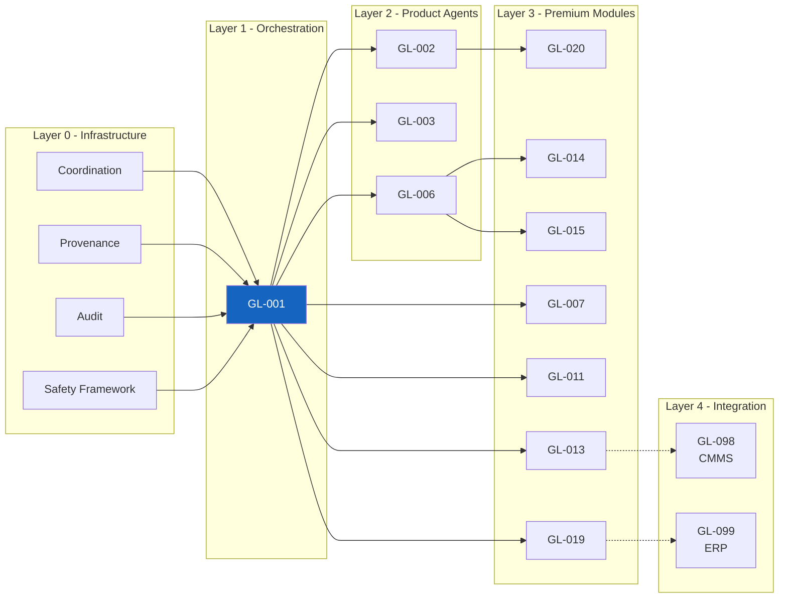
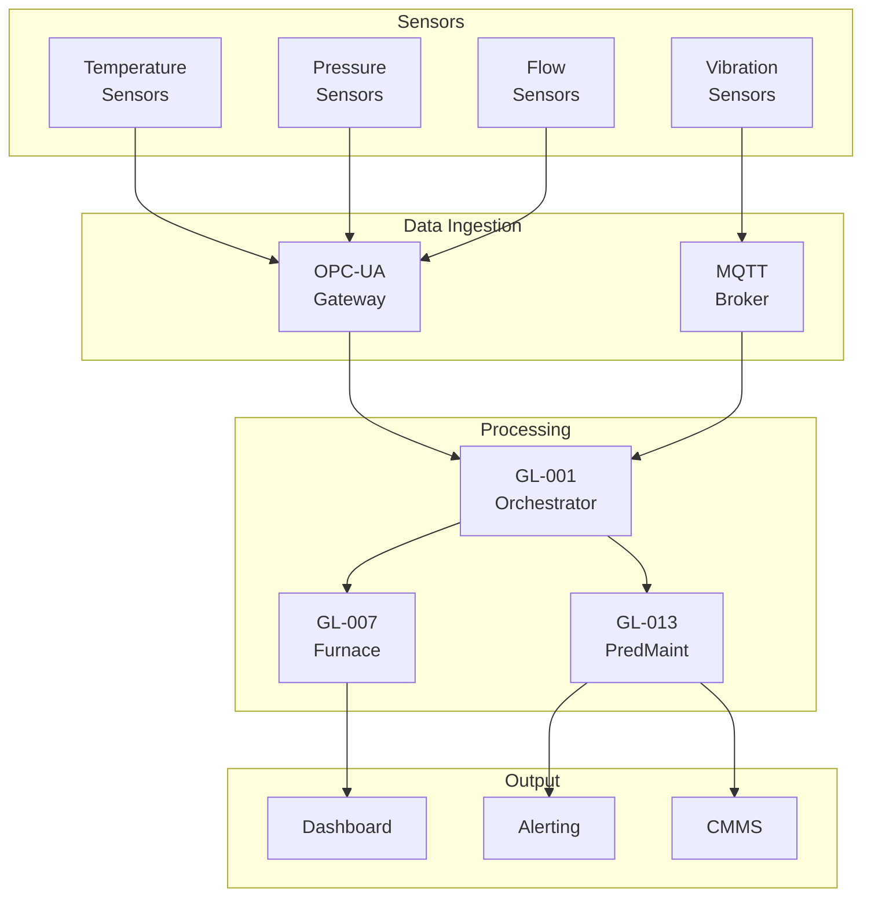
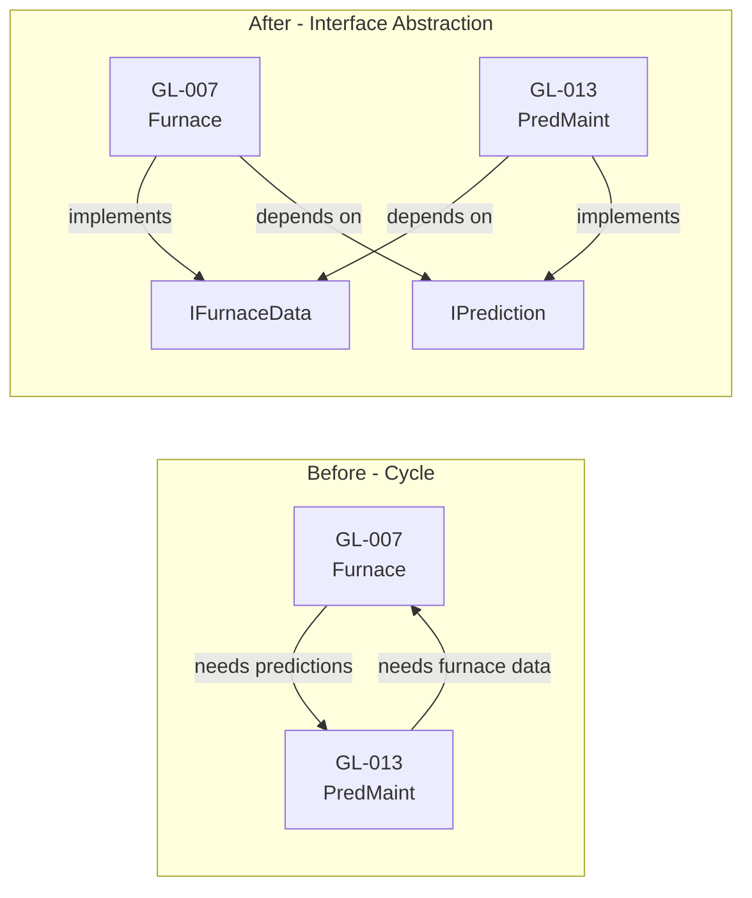
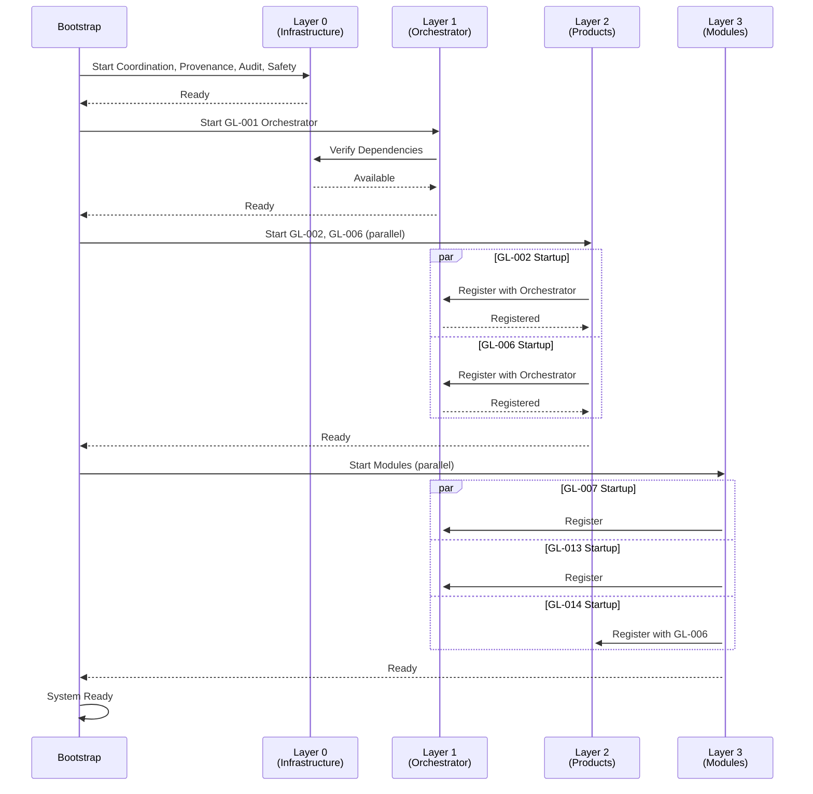
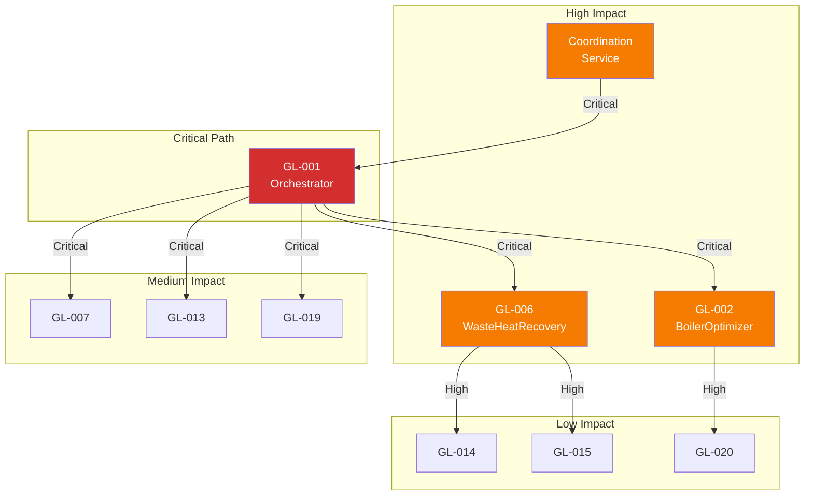

# Module Dependency Graph

**Document ID:** ARCH-020
**Version:** 1.0.0
**Last Updated:** 2025-12-07
**Classification:** Technical Architecture
**Owner:** GreenLang Process Heat Engineering Team

---

## Table of Contents

1. [Overview](#1-overview)
2. [Visual Dependency Diagram](#2-visual-dependency-diagram)
3. [Dependency Matrix Table](#3-dependency-matrix-table)
4. [Circular Dependency Prevention](#4-circular-dependency-prevention)
5. [Optional vs Required Dependencies](#5-optional-vs-required-dependencies)
6. [Version Compatibility Matrix](#6-version-compatibility-matrix)
7. [Dependency Injection Patterns](#7-dependency-injection-patterns)
8. [Startup Ordering Requirements](#8-startup-ordering-requirements)
9. [Failure Cascade Analysis](#9-failure-cascade-analysis)
10. [Dependency Management Implementation](#10-dependency-management-implementation)

---

## 1. Overview

### 1.1 Purpose

This document defines the dependency relationships between all modules in the GreenLang Process Heat Agent ecosystem. Understanding these dependencies is critical for:
- Proper startup sequencing
- Failure impact analysis
- Change management
- Capacity planning

### 1.2 Module Ecosystem

The Process Heat ecosystem consists of 100+ modules organized into product families:

| Product Family | Code Range | Description |
|----------------|------------|-------------|
| ThermalCommand | GL-001, GL-005-013, GL-019 | Process furnace optimization |
| BoilerOptimizer | GL-002-004, GL-020 | Boiler efficiency |
| WasteHeatRecovery | GL-006, GL-014-015 | Heat recovery systems |
| SafetyCompliance | GL-040-049 | Safety and compliance |
| EnterpriseIntegration | GL-090-099 | ERP and CMMS integration |

### 1.3 Dependency Types

| Type | Symbol | Description |
|------|--------|-------------|
| **Required** | `-->` | Module cannot function without dependency |
| **Optional** | `-.->` | Enhanced functionality when available |
| **Bidirectional** | `<-->` | Mutual data exchange |
| **Event-based** | `~~>` | Pub/Sub event subscription |

---

## 2. Visual Dependency Diagram

### 2.1 Core Module Dependencies

```mermaid
graph TB
    subgraph Orchestration Layer
        GL001[GL-001<br/>ThermalCommand<br/>Orchestrator]
    end

    subgraph Product Agents
        GL002[GL-002<br/>BoilerOptimizer]
        GL006[GL-006<br/>WasteHeatRecovery]
    end

    subgraph Premium Modules - ThermalCommand
        GL007[GL-007<br/>FurnacePulse]
        GL011[GL-011<br/>FuelCraft]
        GL013[GL-013<br/>PredictMaint]
        GL019[GL-019<br/>HeatScheduler]
    end

    subgraph Premium Modules - WasteHeatRecovery
        GL014[GL-014<br/>ExchangerPro]
        GL015[GL-015<br/>InsulScan]
    end

    subgraph Premium Modules - BoilerOptimizer
        GL020[GL-020<br/>EconoPulse]
    end

    subgraph Shared Services
        COORD[Coordination<br/>Service]
        PROV[Provenance<br/>Tracker]
        AUDIT[Audit<br/>Logger]
    end

    %% Orchestrator dependencies
    GL001 --> COORD
    GL001 --> PROV
    GL001 --> AUDIT

    %% Product agent dependencies
    GL002 --> GL001
    GL006 --> GL001

    %% ThermalCommand module dependencies
    GL007 --> GL001
    GL011 --> GL001
    GL013 --> GL001
    GL019 --> GL001

    %% WasteHeatRecovery module dependencies
    GL014 --> GL006
    GL015 --> GL006

    %% BoilerOptimizer module dependencies
    GL020 --> GL002

    %% Cross-module dependencies (optional)
    GL013 -.-> GL007
    GL019 -.-> GL013
    GL020 -.-> GL015

    %% Event-based dependencies
    GL007 ~~> GL013
    GL014 ~~> GL013

    style GL001 fill:#1565c0,color:#fff
    style GL002 fill:#2e7d32,color:#fff
    style GL006 fill:#6a1b9a,color:#fff
    style COORD fill:#f57c00,color:#fff
    style PROV fill:#f57c00,color:#fff
    style AUDIT fill:#f57c00,color:#fff
```

### 2.2 Complete Dependency Graph



### 2.3 Data Flow Dependencies



---

## 3. Dependency Matrix Table

### 3.1 Module-to-Module Dependencies

| Module | GL-001 | GL-002 | GL-003 | GL-006 | GL-007 | GL-011 | GL-013 | GL-014 | GL-015 | GL-019 | GL-020 |
|--------|:------:|:------:|:------:|:------:|:------:|:------:|:------:|:------:|:------:|:------:|:------:|
| **GL-001** | - | - | - | - | - | - | - | - | - | - | - |
| **GL-002** | R | - | - | - | - | - | - | - | - | - | - |
| **GL-003** | R | R | - | - | - | - | - | - | - | - | - |
| **GL-006** | R | - | - | - | - | - | - | - | - | - | - |
| **GL-007** | R | - | - | - | - | - | - | - | - | - | - |
| **GL-011** | R | - | - | - | O | - | - | - | - | - | - |
| **GL-013** | R | - | - | - | O | - | - | - | - | - | - |
| **GL-014** | - | - | - | R | - | - | O | - | - | - | - |
| **GL-015** | - | - | - | R | - | - | O | O | - | - | - |
| **GL-019** | R | - | - | - | - | O | O | - | - | - | - |
| **GL-020** | - | R | - | - | - | - | - | - | O | - | - |

**Legend:**
- `R` = Required dependency
- `O` = Optional dependency
- `-` = No dependency

### 3.2 Module-to-Service Dependencies

| Module | Coordination | Provenance | Audit | Safety | Database | Redis | Kafka |
|--------|:------------:|:----------:|:-----:|:------:|:--------:|:-----:|:-----:|
| **GL-001** | R | R | R | R | R | R | O |
| **GL-002** | O | R | R | R | R | O | O |
| **GL-003** | O | R | R | O | R | O | O |
| **GL-006** | O | R | R | R | R | O | O |
| **GL-007** | O | R | R | R | R | O | O |
| **GL-011** | O | R | R | O | R | O | O |
| **GL-013** | O | R | R | R | R | R | O |
| **GL-014** | O | R | R | O | R | O | O |
| **GL-015** | O | R | R | O | R | O | O |
| **GL-019** | O | R | R | O | R | R | O |
| **GL-020** | O | R | R | R | R | O | O |

### 3.3 Capability Dependencies

| Capability | Required By | Provided By |
|------------|-------------|-------------|
| `WORKFLOW_ORCHESTRATION` | GL-002, GL-006 | GL-001 |
| `REAL_TIME_MONITORING` | GL-013, GL-019 | GL-007, GL-010 |
| `PREDICTIVE_ANALYTICS` | GL-019, GL-098 | GL-013 |
| `SAFETY_CRITICAL` | All modules | GL-001, Safety Framework |
| `ML_INFERENCE` | - | GL-013, GL-019 |
| `COMPLIANCE_REPORTING` | GL-098, GL-099 | GL-010, GL-071 |

---

## 4. Circular Dependency Prevention

### 4.1 Dependency Rules

```python
class DependencyRules:
    """
    Rules to prevent circular dependencies in the module ecosystem.

    Violations of these rules will cause startup failures.
    """

    # Rule 1: Layer Hierarchy
    # Modules can only depend on modules in lower or same layer
    LAYER_HIERARCHY = {
        0: {"Coordination", "Provenance", "Audit", "Safety"},
        1: {"GL-001"},
        2: {"GL-002", "GL-003", "GL-006"},
        3: {"GL-007", "GL-011", "GL-013", "GL-014", "GL-015", "GL-019", "GL-020"},
        4: {"GL-098", "GL-099"},
    }

    # Rule 2: No bidirectional required dependencies
    # If A requires B, B cannot require A

    # Rule 3: Product boundaries
    # Cross-product dependencies must be optional
    PRODUCT_BOUNDARIES = {
        "ThermalCommand": {"GL-001", "GL-007", "GL-011", "GL-013", "GL-019"},
        "BoilerOptimizer": {"GL-002", "GL-003", "GL-020"},
        "WasteHeatRecovery": {"GL-006", "GL-014", "GL-015"},
    }

    @classmethod
    def validate_dependency(
        cls,
        source: str,
        target: str,
        dep_type: str,
    ) -> tuple[bool, Optional[str]]:
        """
        Validate a dependency declaration.

        Args:
            source: Source module ID
            target: Target module ID
            dep_type: Dependency type (required/optional)

        Returns:
            Tuple of (is_valid, error_message)
        """
        # Check layer hierarchy
        source_layer = cls._get_layer(source)
        target_layer = cls._get_layer(target)

        if source_layer < target_layer:
            return False, (
                f"Layer violation: {source} (layer {source_layer}) cannot "
                f"depend on {target} (layer {target_layer})"
            )

        # Check cross-product boundaries
        if dep_type == "required":
            source_product = cls._get_product(source)
            target_product = cls._get_product(target)

            if source_product != target_product and target not in {"GL-001"}:
                return False, (
                    f"Cross-product required dependency: {source} "
                    f"({source_product}) -> {target} ({target_product})"
                )

        return True, None

    @classmethod
    def _get_layer(cls, module_id: str) -> int:
        """Get layer for a module."""
        for layer, modules in cls.LAYER_HIERARCHY.items():
            if module_id in modules:
                return layer
        return 3  # Default to premium module layer

    @classmethod
    def _get_product(cls, module_id: str) -> str:
        """Get product for a module."""
        for product, modules in cls.PRODUCT_BOUNDARIES.items():
            if module_id in modules:
                return product
        return "Unknown"
```

### 4.2 Circular Dependency Detection

```python
from collections import defaultdict
from typing import List, Set, Dict


class CircularDependencyDetector:
    """
    Detects circular dependencies using Tarjan's algorithm.

    Run during:
    - Module registration
    - System startup
    - Dependency graph updates
    """

    def __init__(self):
        self._graph: Dict[str, Set[str]] = defaultdict(set)
        self._index_counter = 0
        self._stack: List[str] = []
        self._lowlinks: Dict[str, int] = {}
        self._index: Dict[str, int] = {}
        self._on_stack: Dict[str, bool] = {}
        self._sccs: List[List[str]] = []

    def add_dependency(self, source: str, target: str) -> None:
        """Add a dependency edge."""
        self._graph[source].add(target)

    def find_cycles(self) -> List[List[str]]:
        """
        Find all strongly connected components (cycles).

        Returns:
            List of cycles (lists of module IDs)
        """
        self._index_counter = 0
        self._stack = []
        self._lowlinks = {}
        self._index = {}
        self._on_stack = {}
        self._sccs = []

        for node in self._graph:
            if node not in self._index:
                self._strongconnect(node)

        # Filter to only cycles (SCCs with > 1 node or self-loop)
        cycles = [
            scc for scc in self._sccs
            if len(scc) > 1 or (
                len(scc) == 1 and scc[0] in self._graph[scc[0]]
            )
        ]

        return cycles

    def _strongconnect(self, node: str) -> None:
        """Tarjan's algorithm implementation."""
        self._index[node] = self._index_counter
        self._lowlinks[node] = self._index_counter
        self._index_counter += 1
        self._stack.append(node)
        self._on_stack[node] = True

        for successor in self._graph[node]:
            if successor not in self._index:
                self._strongconnect(successor)
                self._lowlinks[node] = min(
                    self._lowlinks[node],
                    self._lowlinks[successor]
                )
            elif self._on_stack.get(successor, False):
                self._lowlinks[node] = min(
                    self._lowlinks[node],
                    self._index[successor]
                )

        if self._lowlinks[node] == self._index[node]:
            scc = []
            while True:
                successor = self._stack.pop()
                self._on_stack[successor] = False
                scc.append(successor)
                if successor == node:
                    break
            self._sccs.append(scc)


# Usage example
detector = CircularDependencyDetector()
detector.add_dependency("GL-001", "GL-002")
detector.add_dependency("GL-002", "GL-007")
detector.add_dependency("GL-007", "GL-001")  # This creates a cycle!

cycles = detector.find_cycles()
if cycles:
    raise DependencyError(f"Circular dependencies detected: {cycles}")
```

### 4.3 Breaking Cycles with Interfaces

When a logical cycle exists, break it using interface abstraction:



---

## 5. Optional vs Required Dependencies

### 5.1 Dependency Classification

```python
from enum import Enum
from dataclasses import dataclass
from typing import Optional, Callable


class DependencyType(Enum):
    """Types of module dependencies."""

    REQUIRED = "required"
    """
    Module cannot start without this dependency.
    Failure of dependency causes module failure.
    """

    OPTIONAL = "optional"
    """
    Module can start without this dependency.
    Provides enhanced functionality when available.
    """

    OPTIONAL_AT_RUNTIME = "optional_at_runtime"
    """
    Required at startup, but can be temporarily unavailable.
    Module enters degraded mode when unavailable.
    """

    LAZY = "lazy"
    """
    Not checked at startup.
    Resolved on first use.
    """


@dataclass
class DependencySpec:
    """Specification for a module dependency."""

    module_id: str
    dependency_type: DependencyType
    min_version: str
    max_version: Optional[str] = None
    fallback_handler: Optional[Callable] = None
    health_check_url: Optional[str] = None
    timeout_ms: int = 5000
    retry_count: int = 3

    def is_required(self) -> bool:
        """Check if dependency is required for startup."""
        return self.dependency_type in {
            DependencyType.REQUIRED,
            DependencyType.OPTIONAL_AT_RUNTIME,
        }
```

### 5.2 Handling Optional Dependencies

```python
class OptionalDependencyHandler:
    """
    Handles optional dependencies with graceful degradation.

    When an optional dependency is unavailable:
    1. Log warning
    2. Disable features that require the dependency
    3. Continue normal operation
    """

    def __init__(self, module_id: str):
        self.module_id = module_id
        self._optional_deps: Dict[str, DependencySpec] = {}
        self._available_deps: Set[str] = set()
        self._fallback_results: Dict[str, Any] = {}

    def register_optional(
        self,
        spec: DependencySpec,
    ) -> None:
        """Register an optional dependency."""
        if spec.dependency_type not in {
            DependencyType.OPTIONAL,
            DependencyType.LAZY,
        }:
            raise ValueError("Not an optional dependency")

        self._optional_deps[spec.module_id] = spec

    async def check_availability(
        self,
        dep_id: str,
    ) -> bool:
        """Check if optional dependency is available."""
        if dep_id not in self._optional_deps:
            raise ValueError(f"Unknown optional dependency: {dep_id}")

        spec = self._optional_deps[dep_id]

        try:
            # Attempt to connect/verify
            available = await self._verify_dependency(spec)

            if available:
                self._available_deps.add(dep_id)
                logger.info(f"Optional dependency available: {dep_id}")
            else:
                self._available_deps.discard(dep_id)
                logger.warning(f"Optional dependency unavailable: {dep_id}")

            return available

        except Exception as e:
            logger.warning(
                f"Error checking optional dependency {dep_id}: {e}"
            )
            self._available_deps.discard(dep_id)
            return False

    def is_available(self, dep_id: str) -> bool:
        """Check if dependency is currently available."""
        return dep_id in self._available_deps

    async def invoke_with_fallback(
        self,
        dep_id: str,
        method: str,
        *args,
        **kwargs,
    ) -> Any:
        """
        Invoke dependency method with fallback.

        Args:
            dep_id: Dependency module ID
            method: Method to invoke
            *args: Method arguments
            **kwargs: Method keyword arguments

        Returns:
            Result from dependency or fallback
        """
        if self.is_available(dep_id):
            try:
                result = await self._invoke_dependency(
                    dep_id, method, *args, **kwargs
                )
                return result
            except Exception as e:
                logger.warning(
                    f"Dependency {dep_id} failed, using fallback: {e}"
                )

        # Use fallback
        spec = self._optional_deps[dep_id]
        if spec.fallback_handler:
            return spec.fallback_handler(*args, **kwargs)

        # No fallback available
        raise DependencyUnavailableError(
            f"Optional dependency {dep_id} unavailable and no fallback"
        )


# Example: GL-019 with optional GL-013 dependency
class GL019HeatScheduler:
    """HeatScheduler with optional PredictMaint integration."""

    def __init__(self):
        self._optional_handler = OptionalDependencyHandler("GL-019")

        # Register optional dependency on GL-013
        self._optional_handler.register_optional(
            DependencySpec(
                module_id="GL-013",
                dependency_type=DependencyType.OPTIONAL,
                min_version="1.0.0",
                fallback_handler=self._equipment_health_fallback,
            )
        )

    async def create_schedule(self, demand_forecast: List[float]) -> Schedule:
        """Create optimized schedule."""

        # Try to get equipment health from GL-013
        equipment_health = await self._optional_handler.invoke_with_fallback(
            "GL-013",
            "get_equipment_health",
            equipment_ids=self._equipment_ids,
        )

        # Use health data to constrain schedule
        return self._optimize_schedule(demand_forecast, equipment_health)

    def _equipment_health_fallback(
        self,
        equipment_ids: List[str],
    ) -> Dict[str, float]:
        """Fallback: assume all equipment healthy."""
        logger.info(
            "Using fallback equipment health (assuming 100% for all)"
        )
        return {eid: 100.0 for eid in equipment_ids}
```

### 5.3 Dependency Feature Flags

```python
class DependencyFeatureFlags:
    """
    Feature flags based on dependency availability.

    Features that require optional dependencies are automatically
    disabled when those dependencies are unavailable.
    """

    def __init__(self):
        self._features: Dict[str, Set[str]] = {}  # feature -> required deps
        self._available_deps: Set[str] = set()

    def register_feature(
        self,
        feature_name: str,
        required_deps: Set[str],
    ) -> None:
        """Register a feature with its dependencies."""
        self._features[feature_name] = required_deps

    def update_availability(
        self,
        dep_id: str,
        available: bool,
    ) -> List[str]:
        """
        Update dependency availability.

        Returns:
            List of features whose availability changed
        """
        changed_features = []

        if available:
            self._available_deps.add(dep_id)
        else:
            self._available_deps.discard(dep_id)

        # Check which features are affected
        for feature, deps in self._features.items():
            if dep_id in deps:
                changed_features.append(feature)

        return changed_features

    def is_feature_enabled(self, feature_name: str) -> bool:
        """Check if a feature is enabled."""
        required = self._features.get(feature_name, set())
        return required.issubset(self._available_deps)

    def get_disabled_features(self) -> Dict[str, Set[str]]:
        """Get disabled features and their missing dependencies."""
        disabled = {}
        for feature, deps in self._features.items():
            missing = deps - self._available_deps
            if missing:
                disabled[feature] = missing
        return disabled


# Example usage
flags = DependencyFeatureFlags()
flags.register_feature("predictive_scheduling", {"GL-013"})
flags.register_feature("cmms_integration", {"GL-013", "GL-098"})

if flags.is_feature_enabled("predictive_scheduling"):
    # Use predictive scheduling
    pass
else:
    # Use basic scheduling
    pass
```

---

## 6. Version Compatibility Matrix

### 6.1 Module Version Compatibility

| Module | v1.0.x | v1.1.x | v1.2.x | v2.0.x |
|--------|:------:|:------:|:------:|:------:|
| **GL-001 v1.0.x** | C | C | C | I |
| **GL-001 v1.1.x** | C | C | C | I |
| **GL-001 v2.0.x** | I | D | D | C |
| **GL-002 v1.0.x** | C | C | C | I |
| **GL-007 v1.0.x** | C | C | C | I |
| **GL-013 v1.0.x** | C | C | C | I |

**Legend:**
- `C` = Compatible
- `D` = Deprecated (works with warnings)
- `I` = Incompatible

### 6.2 Interface Version Compatibility

```python
class VersionCompatibility:
    """
    Manages version compatibility between modules.

    Uses Semantic Versioning:
    - MAJOR: Breaking changes
    - MINOR: Backward-compatible features
    - PATCH: Bug fixes
    """

    @staticmethod
    def is_compatible(
        required: str,
        available: str,
    ) -> tuple[bool, Optional[str]]:
        """
        Check if versions are compatible.

        Args:
            required: Required version (semver with optional range)
            available: Available version

        Returns:
            Tuple of (is_compatible, warning_message)
        """
        req_parts = required.split('.')
        avail_parts = available.split('.')

        req_major = int(req_parts[0])
        avail_major = int(avail_parts[0])

        # Major version must match
        if req_major != avail_major:
            return False, (
                f"Major version mismatch: required {required}, "
                f"available {available}"
            )

        # Minor version: available must be >= required
        req_minor = int(req_parts[1]) if len(req_parts) > 1 else 0
        avail_minor = int(avail_parts[1]) if len(avail_parts) > 1 else 0

        if avail_minor < req_minor:
            return False, (
                f"Minor version too low: required >={required}, "
                f"available {available}"
            )

        # Check for deprecation (minor version 2+ ahead)
        if avail_minor > req_minor + 1:
            return True, (
                f"Version {required} is deprecated, consider upgrading"
            )

        return True, None


# Compatibility rules per module
COMPATIBILITY_RULES = {
    "GL-001": {
        "GL-002": {"min": "1.0.0", "max": "2.0.0"},
        "GL-007": {"min": "1.0.0", "max": "2.0.0"},
        "GL-013": {"min": "1.0.0", "max": "2.0.0"},
    },
    "GL-002": {
        "GL-001": {"min": "1.0.0", "max": "2.0.0"},
        "GL-020": {"min": "1.0.0", "max": "2.0.0"},
    },
}
```

### 6.3 API Version Negotiation

```python
class APIVersionNegotiator:
    """
    Negotiates API version between caller and callee.

    Supports:
    - Version headers
    - Accept-Version negotiation
    - Backward compatibility mode
    """

    SUPPORTED_VERSIONS = ["1.0", "1.1", "1.2", "2.0"]
    DEFAULT_VERSION = "1.2"

    @classmethod
    def negotiate(
        cls,
        requested_versions: List[str],
        supported_versions: Optional[List[str]] = None,
    ) -> str:
        """
        Negotiate best compatible version.

        Args:
            requested_versions: Versions client supports (preferred first)
            supported_versions: Versions server supports

        Returns:
            Best compatible version

        Raises:
            VersionNegotiationError: If no compatible version found
        """
        supported = supported_versions or cls.SUPPORTED_VERSIONS

        for version in requested_versions:
            if version in supported:
                return version

        # Try major version match
        for requested in requested_versions:
            req_major = requested.split('.')[0]
            for available in supported:
                if available.split('.')[0] == req_major:
                    return available

        raise VersionNegotiationError(
            f"No compatible version: requested={requested_versions}, "
            f"supported={supported}"
        )
```

---

## 7. Dependency Injection Patterns

### 7.1 Dependency Container

```python
from typing import TypeVar, Generic, Type, Dict, Callable, Any
import inspect

T = TypeVar('T')


class DependencyContainer:
    """
    IoC container for module dependency injection.

    Supports:
    - Singleton and transient lifecycles
    - Factory functions
    - Interface-based resolution
    - Scoped dependencies
    """

    def __init__(self):
        self._registrations: Dict[Type, Registration] = {}
        self._singletons: Dict[Type, Any] = {}

    def register_singleton(
        self,
        interface: Type[T],
        implementation: Type[T],
    ) -> None:
        """Register a singleton (one instance per container)."""
        self._registrations[interface] = Registration(
            implementation=implementation,
            lifecycle=Lifecycle.SINGLETON,
        )

    def register_transient(
        self,
        interface: Type[T],
        implementation: Type[T],
    ) -> None:
        """Register a transient (new instance per resolution)."""
        self._registrations[interface] = Registration(
            implementation=implementation,
            lifecycle=Lifecycle.TRANSIENT,
        )

    def register_factory(
        self,
        interface: Type[T],
        factory: Callable[[], T],
    ) -> None:
        """Register a factory function."""
        self._registrations[interface] = Registration(
            factory=factory,
            lifecycle=Lifecycle.TRANSIENT,
        )

    def resolve(self, interface: Type[T]) -> T:
        """
        Resolve a dependency.

        Args:
            interface: Interface type to resolve

        Returns:
            Instance of the implementation

        Raises:
            DependencyNotRegisteredError: If not registered
        """
        if interface not in self._registrations:
            raise DependencyNotRegisteredError(
                f"No registration for {interface.__name__}"
            )

        registration = self._registrations[interface]

        # Return existing singleton
        if (
            registration.lifecycle == Lifecycle.SINGLETON and
            interface in self._singletons
        ):
            return self._singletons[interface]

        # Create instance
        if registration.factory:
            instance = registration.factory()
        else:
            instance = self._create_instance(registration.implementation)

        # Cache singleton
        if registration.lifecycle == Lifecycle.SINGLETON:
            self._singletons[interface] = instance

        return instance

    def _create_instance(self, cls: Type[T]) -> T:
        """Create instance with dependency injection."""
        # Get constructor parameters
        sig = inspect.signature(cls.__init__)
        params = {}

        for name, param in sig.parameters.items():
            if name == 'self':
                continue

            if param.annotation != inspect.Parameter.empty:
                # Resolve dependency by type
                params[name] = self.resolve(param.annotation)
            elif param.default != inspect.Parameter.empty:
                # Use default value
                params[name] = param.default
            else:
                raise DependencyResolutionError(
                    f"Cannot resolve parameter '{name}' for {cls.__name__}"
                )

        return cls(**params)


class Lifecycle(Enum):
    SINGLETON = "singleton"
    TRANSIENT = "transient"
    SCOPED = "scoped"


@dataclass
class Registration:
    implementation: Optional[Type] = None
    factory: Optional[Callable] = None
    lifecycle: Lifecycle = Lifecycle.TRANSIENT
```

### 7.2 Module Dependency Injection

```python
from functools import wraps


def inject(container: DependencyContainer):
    """
    Decorator for dependency injection into module methods.

    Example:
        @inject(container)
        def process(self, input_data, gl_013: GL013Interface = None):
            # gl_013 will be automatically injected
            predictions = gl_013.get_predictions(input_data.equipment_id)
    """
    def decorator(func):
        @wraps(func)
        async def wrapper(self, *args, **kwargs):
            # Get function signature
            sig = inspect.signature(func)

            # Inject dependencies
            for name, param in sig.parameters.items():
                if name in {'self', 'args', 'kwargs'}:
                    continue

                # Skip if already provided
                if name in kwargs and kwargs[name] is not None:
                    continue

                # Check if type hint exists
                if param.annotation != inspect.Parameter.empty:
                    try:
                        kwargs[name] = container.resolve(param.annotation)
                    except DependencyNotRegisteredError:
                        # Only fail if no default value
                        if param.default == inspect.Parameter.empty:
                            raise

            return await func(self, *args, **kwargs)

        return wrapper
    return decorator


# Usage example
class GL019HeatScheduler:
    """HeatScheduler with dependency injection."""

    def __init__(self, container: DependencyContainer):
        self._container = container

    @inject(container)
    async def create_schedule(
        self,
        input_data: SchedulingInput,
        prediction_service: GL013Interface = None,
        fuel_service: GL011Interface = None,
    ) -> SchedulingOutput:
        """
        Create optimized schedule.

        Dependencies are automatically injected.
        """
        # prediction_service and fuel_service are injected
        equipment_health = await prediction_service.get_health(
            input_data.equipment_ids
        )
        fuel_costs = await fuel_service.get_fuel_costs(
            input_data.fuels
        )

        return self._optimize(input_data, equipment_health, fuel_costs)
```

### 7.3 Configuration-Based Injection

```python
# config/dependencies.yaml
dependencies:
  GL-019:
    required:
      - module: GL-001
        interface: OrchestratorInterface
        version: ">=1.0.0"
    optional:
      - module: GL-013
        interface: PredictionInterface
        version: ">=1.0.0"
        fallback: DefaultPredictionService
      - module: GL-011
        interface: FuelInterface
        version: ">=1.0.0"
        fallback: DefaultFuelService


class ConfigBasedInjector:
    """
    Configure dependencies from YAML configuration.
    """

    def __init__(self, config_path: str):
        with open(config_path) as f:
            self._config = yaml.safe_load(f)
        self._container = DependencyContainer()

    def configure(self, module_id: str) -> DependencyContainer:
        """Configure container for a module."""
        module_config = self._config["dependencies"].get(module_id, {})

        # Register required dependencies
        for dep in module_config.get("required", []):
            interface = self._load_interface(dep["interface"])
            implementation = self._resolve_implementation(dep["module"])
            self._container.register_singleton(interface, implementation)

        # Register optional dependencies with fallbacks
        for dep in module_config.get("optional", []):
            interface = self._load_interface(dep["interface"])
            try:
                implementation = self._resolve_implementation(dep["module"])
                self._container.register_singleton(interface, implementation)
            except ModuleNotAvailableError:
                # Use fallback
                fallback = self._load_fallback(dep["fallback"])
                self._container.register_singleton(interface, fallback)

        return self._container
```

---

## 8. Startup Ordering Requirements

### 8.1 Startup Order Algorithm

```python
from collections import defaultdict, deque
from typing import List, Dict, Set


class StartupOrderResolver:
    """
    Resolves correct startup order based on dependencies.

    Uses topological sort with:
    - Dependency-based ordering
    - Priority within layers
    - Parallel startup for independent modules
    """

    def __init__(self):
        self._dependencies: Dict[str, Set[str]] = defaultdict(set)
        self._reverse_deps: Dict[str, Set[str]] = defaultdict(set)
        self._priorities: Dict[str, int] = {}

    def add_module(
        self,
        module_id: str,
        dependencies: Set[str],
        priority: int = 0,
    ) -> None:
        """Add a module with its dependencies."""
        self._dependencies[module_id] = dependencies
        self._priorities[module_id] = priority

        for dep in dependencies:
            self._reverse_deps[dep].add(module_id)

    def get_startup_order(self) -> List[List[str]]:
        """
        Get startup order as layers.

        Returns:
            List of layers, where modules in same layer can start in parallel.

        Raises:
            CircularDependencyError: If circular dependency detected
        """
        # Calculate in-degrees
        in_degree = {m: len(self._dependencies[m]) for m in self._dependencies}

        # Initialize with modules that have no dependencies
        ready = deque([m for m, d in in_degree.items() if d == 0])

        layers = []
        processed = set()

        while ready:
            # Process all ready modules as one layer
            current_layer = []

            while ready:
                module = ready.popleft()
                current_layer.append(module)
                processed.add(module)

            # Sort by priority within layer
            current_layer.sort(key=lambda m: self._priorities.get(m, 0))
            layers.append(current_layer)

            # Find newly ready modules
            for module in current_layer:
                for dependent in self._reverse_deps[module]:
                    in_degree[dependent] -= 1
                    if in_degree[dependent] == 0:
                        ready.append(dependent)

        # Check for unprocessed modules (circular dependency)
        unprocessed = set(self._dependencies.keys()) - processed
        if unprocessed:
            raise CircularDependencyError(
                f"Circular dependency involving: {unprocessed}"
            )

        return layers

    def get_shutdown_order(self) -> List[List[str]]:
        """Get shutdown order (reverse of startup)."""
        startup_order = self.get_startup_order()
        return list(reversed(startup_order))
```

### 8.2 Startup Sequence



### 8.3 Startup Implementation

```python
class SystemBootstrap:
    """
    Bootstraps the Process Heat system in correct order.
    """

    def __init__(self, config: SystemConfig):
        self.config = config
        self._order_resolver = StartupOrderResolver()
        self._started_modules: Dict[str, ModuleInterface] = {}
        self._container = DependencyContainer()

    async def start(self) -> SystemStatus:
        """Start the system."""
        logger.info("Starting GreenLang Process Heat System")
        start_time = time.time()

        # Build dependency graph
        self._build_dependency_graph()

        # Get startup order
        layers = self._order_resolver.get_startup_order()
        logger.info(f"Startup order: {len(layers)} layers")

        # Start each layer
        for layer_idx, layer in enumerate(layers):
            logger.info(f"Starting layer {layer_idx}: {layer}")

            # Start modules in layer in parallel
            tasks = [
                self._start_module(module_id)
                for module_id in layer
            ]

            results = await asyncio.gather(*tasks, return_exceptions=True)

            # Check for failures
            for module_id, result in zip(layer, results):
                if isinstance(result, Exception):
                    logger.error(f"Failed to start {module_id}: {result}")
                    # Rollback started modules
                    await self._rollback_startup()
                    raise SystemStartupError(
                        f"Failed to start {module_id}: {result}"
                    )

                self._started_modules[module_id] = result

        duration = time.time() - start_time
        logger.info(f"System started in {duration:.2f}s")

        return SystemStatus(
            status="running",
            modules=list(self._started_modules.keys()),
            startup_duration_s=duration,
        )

    async def _start_module(
        self,
        module_id: str,
    ) -> ModuleInterface:
        """Start a single module."""
        logger.debug(f"Starting module: {module_id}")

        # Get module class
        module_class = self._get_module_class(module_id)

        # Get configuration
        module_config = self.config.modules.get(module_id, {})

        # Create and initialize
        module = module_class()

        # Inject dependencies
        for dep_id in self._order_resolver._dependencies[module_id]:
            dep = self._started_modules.get(dep_id)
            if dep:
                module.inject_dependency(dep_id, dep)

        # Initialize
        await module.initialize(module_config)

        # Verify health
        health = module.health_check()
        if health["status"] == "unhealthy":
            raise ModuleStartupError(
                f"Module {module_id} health check failed: {health}"
            )

        logger.info(f"Module {module_id} started successfully")
        return module

    async def _rollback_startup(self) -> None:
        """Rollback partial startup on failure."""
        logger.warning("Rolling back startup")

        # Shutdown in reverse order
        for module_id in reversed(list(self._started_modules.keys())):
            try:
                await self._started_modules[module_id].shutdown(graceful=False)
            except Exception as e:
                logger.error(f"Error shutting down {module_id}: {e}")

        self._started_modules.clear()
```

---

## 9. Failure Cascade Analysis

### 9.1 Impact Analysis



### 9.2 Failure Impact Matrix

| Failed Module | Direct Impact | Cascade Impact | Business Impact |
|---------------|---------------|----------------|-----------------|
| **GL-001** | All modules | System down | Critical |
| **Coordination** | GL-001 | All modules | Critical |
| **GL-002** | GL-020 | Boiler optimization | High |
| **GL-006** | GL-014, GL-015 | Heat recovery | High |
| **GL-007** | None | Furnace monitoring | Medium |
| **GL-013** | GL-019 (partial) | Predictive maintenance | Medium |
| **GL-014** | None | Heat exchanger | Low |
| **GL-015** | None | Insulation analysis | Low |
| **GL-019** | None | Scheduling | Medium |
| **GL-020** | None | Economizer | Low |

### 9.3 Failure Cascade Handler

```python
class FailureCascadeHandler:
    """
    Handles failure cascades and implements circuit breakers.

    Strategies:
    1. Isolate failed module
    2. Notify dependent modules
    3. Enable degraded mode
    4. Attempt recovery
    """

    def __init__(self, dependency_graph: Dict[str, Set[str]]):
        self._graph = dependency_graph
        self._reverse_graph = self._build_reverse_graph()
        self._failed_modules: Set[str] = set()
        self._degraded_modules: Set[str] = set()
        self._circuit_breakers: Dict[str, CircuitBreaker] = {}

    def handle_failure(
        self,
        module_id: str,
        error: Exception,
    ) -> FailureCascadeResult:
        """
        Handle module failure and manage cascade.

        Args:
            module_id: Failed module ID
            error: The error that occurred

        Returns:
            FailureCascadeResult with impact analysis
        """
        logger.error(f"Module {module_id} failed: {error}")

        result = FailureCascadeResult(failed_module=module_id)

        # Mark as failed
        self._failed_modules.add(module_id)

        # Trip circuit breaker
        if module_id not in self._circuit_breakers:
            self._circuit_breakers[module_id] = CircuitBreaker()
        self._circuit_breakers[module_id].record_failure()

        # Analyze impact
        affected = self._get_affected_modules(module_id)
        result.affected_modules = list(affected)

        # Notify dependent modules
        for dep_module in affected:
            self._notify_dependency_failure(dep_module, module_id)

            # Check if should enter degraded mode
            if self._should_degrade(dep_module):
                self._degraded_modules.add(dep_module)
                result.degraded_modules.append(dep_module)

        # Check for critical failure
        if module_id in self._get_critical_modules():
            result.is_critical = True
            result.action = "EMERGENCY_SHUTDOWN"
        else:
            result.action = "DEGRADED_OPERATION"

        return result

    def _get_affected_modules(self, failed_module: str) -> Set[str]:
        """Get all modules affected by failure (transitive)."""
        affected = set()
        queue = deque([failed_module])

        while queue:
            current = queue.popleft()
            dependents = self._reverse_graph.get(current, set())

            for dep in dependents:
                if dep not in affected:
                    affected.add(dep)
                    queue.append(dep)

        return affected

    def _should_degrade(self, module_id: str) -> bool:
        """Check if module should enter degraded mode."""
        dependencies = self._graph.get(module_id, set())
        required_deps = self._get_required_dependencies(module_id)

        failed_required = required_deps & self._failed_modules

        # Degrade if any required dependency failed
        return len(failed_required) > 0

    def _get_critical_modules(self) -> Set[str]:
        """Get modules whose failure is critical."""
        return {"GL-001", "Coordination", "Safety"}

    async def attempt_recovery(
        self,
        module_id: str,
    ) -> bool:
        """Attempt to recover a failed module."""
        circuit_breaker = self._circuit_breakers.get(module_id)

        if circuit_breaker and not circuit_breaker.allow_request():
            logger.info(
                f"Circuit breaker open for {module_id}, skipping recovery"
            )
            return False

        try:
            # Attempt recovery logic
            success = await self._recover_module(module_id)

            if success:
                self._failed_modules.discard(module_id)
                circuit_breaker.record_success()

                # Check if dependents can exit degraded mode
                await self._reevaluate_dependents(module_id)

            return success

        except Exception as e:
            circuit_breaker.record_failure()
            logger.error(f"Recovery failed for {module_id}: {e}")
            return False


@dataclass
class FailureCascadeResult:
    """Result of failure cascade analysis."""

    failed_module: str
    affected_modules: List[str] = field(default_factory=list)
    degraded_modules: List[str] = field(default_factory=list)
    is_critical: bool = False
    action: str = "CONTINUE"
```

### 9.4 Graceful Degradation Modes

```python
class DegradationMode(Enum):
    """Module degradation modes."""

    FULL = "full"
    """Full functionality available."""

    REDUCED = "reduced"
    """Core features only, optional features disabled."""

    MINIMAL = "minimal"
    """Safety-critical functions only."""

    OFFLINE = "offline"
    """Module not operational."""


class GracefulDegradation:
    """
    Implements graceful degradation when dependencies fail.

    Each module defines behavior for each degradation level.
    """

    # Degradation rules per module
    DEGRADATION_RULES = {
        "GL-019": {
            DegradationMode.FULL: {
                "features": ["ml_forecast", "optimization", "storage"],
                "requires": {"GL-001", "GL-013"},
            },
            DegradationMode.REDUCED: {
                "features": ["simple_forecast", "optimization"],
                "requires": {"GL-001"},
            },
            DegradationMode.MINIMAL: {
                "features": ["manual_scheduling"],
                "requires": set(),
            },
        },
        "GL-013": {
            DegradationMode.FULL: {
                "features": ["weibull", "vibration", "oil", "ml", "cmms"],
                "requires": {"GL-001", "GL-098"},
            },
            DegradationMode.REDUCED: {
                "features": ["weibull", "vibration", "oil"],
                "requires": {"GL-001"},
            },
            DegradationMode.MINIMAL: {
                "features": ["threshold_alerts"],
                "requires": set(),
            },
        },
    }

    def __init__(self, module_id: str):
        self.module_id = module_id
        self._current_mode = DegradationMode.FULL
        self._available_deps: Set[str] = set()

    def update_dependency_status(
        self,
        dep_id: str,
        available: bool,
    ) -> DegradationMode:
        """
        Update dependency status and recalculate degradation mode.

        Returns:
            New degradation mode
        """
        if available:
            self._available_deps.add(dep_id)
        else:
            self._available_deps.discard(dep_id)

        # Determine best possible mode
        rules = self.DEGRADATION_RULES.get(self.module_id, {})

        for mode in [
            DegradationMode.FULL,
            DegradationMode.REDUCED,
            DegradationMode.MINIMAL,
        ]:
            mode_rules = rules.get(mode)
            if mode_rules:
                required = mode_rules["requires"]
                if required.issubset(self._available_deps):
                    self._current_mode = mode
                    return mode

        self._current_mode = DegradationMode.OFFLINE
        return DegradationMode.OFFLINE

    def get_available_features(self) -> List[str]:
        """Get features available in current mode."""
        rules = self.DEGRADATION_RULES.get(self.module_id, {})
        mode_rules = rules.get(self._current_mode)

        if mode_rules:
            return mode_rules["features"]
        return []

    def is_feature_available(self, feature: str) -> bool:
        """Check if a feature is available."""
        return feature in self.get_available_features()
```

---

## 10. Dependency Management Implementation

### 10.1 Complete Dependency Manager

```python
class DependencyManager:
    """
    Central dependency management for Process Heat modules.

    Integrates:
    - Dependency resolution
    - Version compatibility
    - Startup ordering
    - Failure handling
    - Graceful degradation
    """

    def __init__(self):
        self._container = DependencyContainer()
        self._order_resolver = StartupOrderResolver()
        self._cascade_handler: Optional[FailureCascadeHandler] = None
        self._modules: Dict[str, ModuleInterface] = {}
        self._degradation: Dict[str, GracefulDegradation] = {}

    def register_module(
        self,
        module_id: str,
        module_class: Type[ModuleInterface],
        dependencies: List[DependencySpec],
        priority: int = 0,
    ) -> None:
        """Register a module with its dependencies."""
        # Add to startup order resolver
        dep_ids = {d.module_id for d in dependencies if d.is_required()}
        self._order_resolver.add_module(module_id, dep_ids, priority)

        # Register with container
        for dep in dependencies:
            # Get interface type from dependency spec
            interface = self._get_interface_type(dep.module_id)
            self._container.register_singleton(interface, module_class)

        # Initialize degradation handler
        self._degradation[module_id] = GracefulDegradation(module_id)

    async def start_system(self, config: SystemConfig) -> SystemStatus:
        """Start all modules in correct order."""
        # Get startup order
        layers = self._order_resolver.get_startup_order()

        # Initialize cascade handler
        self._cascade_handler = FailureCascadeHandler(
            self._order_resolver._dependencies
        )

        # Start each layer
        for layer in layers:
            await asyncio.gather(*[
                self._start_module(mid, config.modules.get(mid, {}))
                for mid in layer
            ])

        return SystemStatus(status="running", modules=list(self._modules.keys()))

    async def stop_system(self, graceful: bool = True) -> None:
        """Stop all modules in reverse order."""
        layers = self._order_resolver.get_shutdown_order()

        for layer in layers:
            await asyncio.gather(*[
                self._stop_module(mid, graceful)
                for mid in layer
            ])

    def handle_failure(
        self,
        module_id: str,
        error: Exception,
    ) -> FailureCascadeResult:
        """Handle module failure."""
        result = self._cascade_handler.handle_failure(module_id, error)

        # Update degradation modes
        for affected in result.affected_modules:
            if affected in self._degradation:
                self._degradation[affected].update_dependency_status(
                    module_id, False
                )

        return result

    def get_module(self, module_id: str) -> Optional[ModuleInterface]:
        """Get a running module by ID."""
        return self._modules.get(module_id)

    def get_degradation_mode(self, module_id: str) -> DegradationMode:
        """Get current degradation mode for a module."""
        if module_id in self._degradation:
            return self._degradation[module_id]._current_mode
        return DegradationMode.OFFLINE

    async def _start_module(
        self,
        module_id: str,
        config: Dict[str, Any],
    ) -> ModuleInterface:
        """Start a single module."""
        module = self._container.resolve(self._get_module_type(module_id))
        await module.initialize(config)
        self._modules[module_id] = module

        # Update degradation status for dependents
        for dependent_id, degradation in self._degradation.items():
            if module_id in self._order_resolver._dependencies.get(dependent_id, set()):
                degradation.update_dependency_status(module_id, True)

        return module

    async def _stop_module(
        self,
        module_id: str,
        graceful: bool,
    ) -> None:
        """Stop a single module."""
        if module_id in self._modules:
            await self._modules[module_id].shutdown(graceful=graceful)
            del self._modules[module_id]

            # Update degradation status
            for dependent_id, degradation in self._degradation.items():
                if module_id in self._order_resolver._dependencies.get(dependent_id, set()):
                    degradation.update_dependency_status(module_id, False)
```

### 10.2 Usage Example

```python
# Example: Setting up the Process Heat system

from greenlang.agents.process_heat.shared.dependencies import (
    DependencyManager,
    DependencySpec,
    DependencyType,
)

async def main():
    # Create dependency manager
    manager = DependencyManager()

    # Register infrastructure services
    manager.register_module(
        "Coordination",
        CoordinationService,
        dependencies=[],
        priority=100,  # Start first
    )

    # Register orchestrator
    manager.register_module(
        "GL-001",
        ThermalCommandOrchestrator,
        dependencies=[
            DependencySpec("Coordination", DependencyType.REQUIRED, "1.0.0"),
            DependencySpec("Provenance", DependencyType.REQUIRED, "1.0.0"),
            DependencySpec("Audit", DependencyType.REQUIRED, "1.0.0"),
        ],
        priority=90,
    )

    # Register product agents
    manager.register_module(
        "GL-002",
        BoilerOptimizer,
        dependencies=[
            DependencySpec("GL-001", DependencyType.REQUIRED, "1.0.0"),
        ],
        priority=80,
    )

    # Register premium modules
    manager.register_module(
        "GL-013",
        PredictiveMaintenanceAgent,
        dependencies=[
            DependencySpec("GL-001", DependencyType.REQUIRED, "1.0.0"),
            DependencySpec("GL-007", DependencyType.OPTIONAL, "1.0.0"),
            DependencySpec("GL-098", DependencyType.OPTIONAL, "1.0.0"),
        ],
        priority=70,
    )

    # Start system
    config = SystemConfig.from_file("config/system.yaml")
    status = await manager.start_system(config)

    print(f"System started: {status.modules}")

    # Handle module failure
    try:
        # Simulate failure
        raise ModuleError("GL-007 sensor connection lost")
    except ModuleError as e:
        result = manager.handle_failure("GL-007", e)
        print(f"Failure handled: affected={result.affected_modules}")
        print(f"GL-013 mode: {manager.get_degradation_mode('GL-013')}")

    # Graceful shutdown
    await manager.stop_system(graceful=True)


if __name__ == "__main__":
    asyncio.run(main())
```

---

**Document Control:**

| Version | Date | Author | Changes |
|---------|------|--------|---------|
| 1.0.0 | 2025-12-07 | GL-TechWriter | Initial release |

---

**END OF DOCUMENT**
