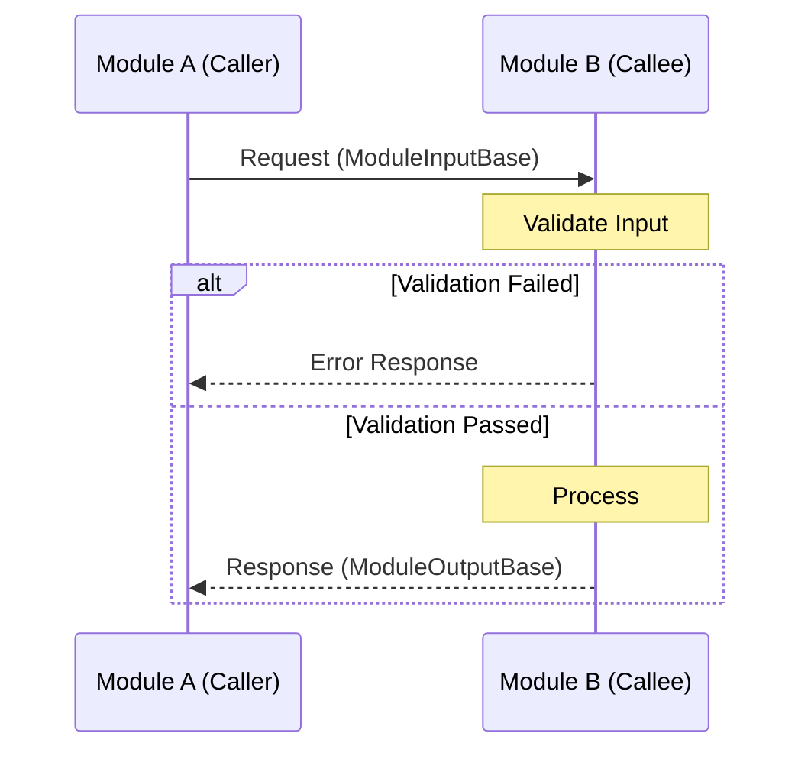
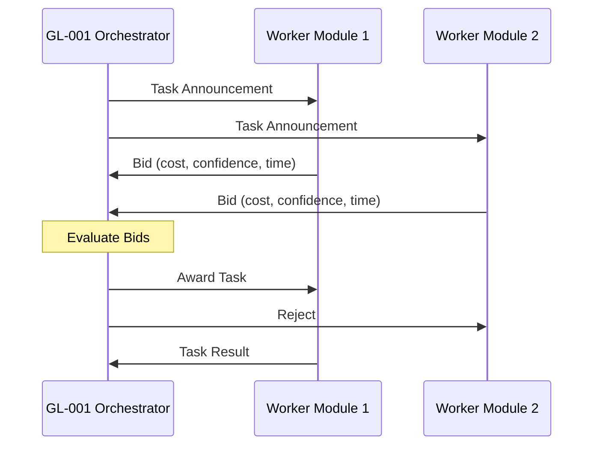

# Module Interface Specifications

**Document ID:** ARCH-018
**Version:** 1.0.0
**Last Updated:** 2025-12-07
**Classification:** Technical Architecture
**Owner:** GreenLang Process Heat Engineering Team

---

## Table of Contents

1. [Overview](#1-overview)
2. [Standard Module Interface Contract](#2-standard-module-interface-contract)
3. [Communication Protocols](#3-communication-protocols)
4. [Data Type Specifications](#4-data-type-specifications)
5. [Error Handling and Propagation](#5-error-handling-and-propagation)
6. [Version Compatibility Requirements](#6-version-compatibility-requirements)
7. [Module Interface Definitions](#7-module-interface-definitions)
8. [Interface Testing Requirements](#8-interface-testing-requirements)
9. [Appendices](#appendices)

---

## 1. Overview

### 1.1 Purpose

This document defines the standard interface contracts for all modules in the GreenLang Process Heat Agent ecosystem. These specifications ensure consistent communication, data exchange, and error handling across the 100+ modules that comprise the Process Heat platform.

### 1.2 Scope

This specification covers:
- Standard interface patterns for all GL-XXX modules
- Synchronous and asynchronous communication protocols
- Inter-module data type specifications
- Error handling and propagation rules
- Version compatibility and migration guidelines

### 1.3 Module Ecosystem Overview

```
greenlang/agents/process_heat/
├── shared/                      # Shared utilities and base classes
│   ├── base_agent.py           # BaseProcessHeatAgent
│   ├── coordination.py         # MultiAgentCoordinator
│   ├── provenance.py          # ProvenanceTracker
│   └── audit.py               # AuditLogger
├── gl_001_thermal_command/     # Orchestrator
├── gl_002_boiler_optimizer/    # Boiler optimization
├── gl_003_unified_steam/       # Steam system optimization
├── gl_005_combustion_diagnostics/
├── gl_006_waste_heat_recovery/
├── gl_007_furnace/             # Furnace performance
├── gl_011_fuel_optimization/
├── gl_013_predictive_maintenance/
├── gl_014_heat_exchanger/
├── gl_015_insulation_analysis/
├── gl_019_scheduling/          # Load scheduling
└── gl_020_economizer/          # Economizer performance
```

---

## 2. Standard Module Interface Contract

### 2.1 Base Interface Definition

All Process Heat modules MUST implement the `ModuleInterface` contract:

```python
from abc import ABC, abstractmethod
from typing import Any, Dict, Generic, List, Optional, TypeVar
from pydantic import BaseModel
from datetime import datetime

# Type variables for input/output
TInput = TypeVar('TInput', bound=BaseModel)
TOutput = TypeVar('TOutput', bound=BaseModel)


class ModuleInterface(ABC, Generic[TInput, TOutput]):
    """
    Standard interface contract for all Process Heat modules.

    All GL-XXX modules MUST implement this interface to ensure
    consistent behavior, error handling, and observability.
    """

    # =========================================================================
    # IDENTIFICATION
    # =========================================================================

    @property
    @abstractmethod
    def module_id(self) -> str:
        """
        Unique module identifier (e.g., 'GL-007', 'GL-013').

        Returns:
            Module identifier string
        """
        pass

    @property
    @abstractmethod
    def module_name(self) -> str:
        """
        Human-readable module name.

        Returns:
            Module name (e.g., 'FurnacePerformanceMonitor')
        """
        pass

    @property
    @abstractmethod
    def version(self) -> str:
        """
        Semantic version (MAJOR.MINOR.PATCH).

        Returns:
            Version string following SemVer
        """
        pass

    @property
    @abstractmethod
    def capabilities(self) -> set[str]:
        """
        Set of capabilities this module provides.

        Returns:
            Set of capability identifiers
        """
        pass

    # =========================================================================
    # LIFECYCLE
    # =========================================================================

    @abstractmethod
    async def initialize(self, config: Dict[str, Any]) -> bool:
        """
        Initialize the module with configuration.

        Args:
            config: Module-specific configuration dictionary

        Returns:
            True if initialization successful

        Raises:
            ModuleInitializationError: If initialization fails
        """
        pass

    @abstractmethod
    async def shutdown(self, graceful: bool = True) -> bool:
        """
        Shutdown the module.

        Args:
            graceful: If True, complete pending operations first

        Returns:
            True if shutdown successful
        """
        pass

    @abstractmethod
    def get_state(self) -> str:
        """
        Get current module state.

        Returns:
            One of: INIT, READY, RUNNING, PAUSED, ERROR, SHUTDOWN
        """
        pass

    # =========================================================================
    # PROCESSING
    # =========================================================================

    @abstractmethod
    def validate_input(self, input_data: TInput) -> tuple[bool, List[str]]:
        """
        Validate input data before processing.

        Args:
            input_data: Input data model

        Returns:
            Tuple of (is_valid, list_of_error_messages)
        """
        pass

    @abstractmethod
    async def process(self, input_data: TInput) -> TOutput:
        """
        Process input and produce output.

        This is the main processing entry point. All calculations
        MUST be deterministic with ZERO HALLUCINATION.

        Args:
            input_data: Validated input data

        Returns:
            Processing result

        Raises:
            ProcessingError: If processing fails
            ValidationError: If output validation fails
        """
        pass

    @abstractmethod
    def validate_output(self, output_data: TOutput) -> tuple[bool, List[str]]:
        """
        Validate output data after processing.

        Args:
            output_data: Output data model

        Returns:
            Tuple of (is_valid, list_of_error_messages)
        """
        pass

    # =========================================================================
    # HEALTH & MONITORING
    # =========================================================================

    @abstractmethod
    def health_check(self) -> Dict[str, Any]:
        """
        Perform health check.

        Returns:
            Health status dictionary with:
            - status: healthy | degraded | unhealthy
            - checks: Dict of individual check results
            - timestamp: ISO 8601 timestamp
        """
        pass

    @abstractmethod
    def get_metrics(self) -> Dict[str, float]:
        """
        Get current metrics.

        Returns:
            Dictionary of metric_name -> value
        """
        pass
```

### 2.2 Input/Output Base Models

All module inputs and outputs MUST extend these base models:

```python
from pydantic import BaseModel, Field
from datetime import datetime
from typing import Any, Dict, Optional
from enum import Enum


class RequestPriority(str, Enum):
    """Request priority levels."""
    LOW = "low"
    NORMAL = "normal"
    HIGH = "high"
    CRITICAL = "critical"
    EMERGENCY = "emergency"


class ModuleInputBase(BaseModel):
    """
    Base model for all module inputs.

    Every module input MUST include these fields for traceability.
    """

    request_id: str = Field(
        ...,
        description="Unique request identifier (UUID)",
        example="550e8400-e29b-41d4-a716-446655440000"
    )

    timestamp: datetime = Field(
        default_factory=lambda: datetime.now(timezone.utc),
        description="Request timestamp (UTC)"
    )

    source_module: Optional[str] = Field(
        default=None,
        description="Source module ID if called by another module"
    )

    correlation_id: Optional[str] = Field(
        default=None,
        description="Correlation ID for distributed tracing"
    )

    priority: RequestPriority = Field(
        default=RequestPriority.NORMAL,
        description="Request priority level"
    )

    context: Dict[str, Any] = Field(
        default_factory=dict,
        description="Additional context data"
    )

    class Config:
        json_encoders = {
            datetime: lambda v: v.isoformat()
        }


class ModuleOutputBase(BaseModel):
    """
    Base model for all module outputs.

    Every module output MUST include these fields for traceability
    and provenance tracking.
    """

    request_id: str = Field(
        ...,
        description="Original request ID"
    )

    timestamp: datetime = Field(
        default_factory=lambda: datetime.now(timezone.utc),
        description="Response timestamp (UTC)"
    )

    module_id: str = Field(
        ...,
        description="Processing module ID"
    )

    module_version: str = Field(
        ...,
        description="Processing module version"
    )

    status: str = Field(
        ...,
        description="Processing status: success | partial | failed"
    )

    processing_time_ms: float = Field(
        ...,
        ge=0,
        description="Processing time in milliseconds"
    )

    provenance_hash: Optional[str] = Field(
        default=None,
        description="SHA-256 hash for audit trail"
    )

    warnings: List[str] = Field(
        default_factory=list,
        description="Non-fatal warnings during processing"
    )

    metadata: Dict[str, Any] = Field(
        default_factory=dict,
        description="Additional metadata"
    )

    class Config:
        json_encoders = {
            datetime: lambda v: v.isoformat()
        }
```

### 2.3 Capability Identifiers

Standard capability identifiers used across the ecosystem:

| Capability ID | Description | Example Modules |
|---------------|-------------|-----------------|
| `REAL_TIME_MONITORING` | Can process real-time sensor data | GL-007, GL-010, GL-013 |
| `PREDICTIVE_ANALYTICS` | Provides predictions and forecasts | GL-013, GL-019, GL-069 |
| `OPTIMIZATION` | Performs optimization calculations | GL-002, GL-011, GL-014 |
| `COMPLIANCE_REPORTING` | Generates compliance reports | GL-010, GL-071 |
| `SAFETY_CRITICAL` | SIL-rated safety functions | GL-001, GL-005, GL-040 |
| `ML_INFERENCE` | Uses ML models for inference | GL-013, GL-019 |
| `WORKFLOW_ORCHESTRATION` | Coordinates multi-agent workflows | GL-001 |
| `DATA_INTEGRATION` | Integrates with external systems | GL-001, GL-098 |
| `CALCULATION_ENGINE` | Performs engineering calculations | GL-009, GL-011, GL-048 |

---

## 3. Communication Protocols

### 3.1 Synchronous Communication

#### 3.1.1 Direct Method Invocation

For tightly-coupled modules within the same process:

```python
class SynchronousInvocation:
    """
    Synchronous module-to-module communication pattern.

    Use for:
    - Low-latency requirements (<10ms)
    - Guaranteed ordering
    - Transaction boundaries
    """

    async def invoke_module(
        self,
        target_module: ModuleInterface,
        input_data: ModuleInputBase,
        timeout_ms: float = 5000,
    ) -> ModuleOutputBase:
        """
        Invoke another module synchronously.

        Args:
            target_module: Module to invoke
            input_data: Input data
            timeout_ms: Timeout in milliseconds

        Returns:
            Module output

        Raises:
            TimeoutError: If invocation times out
            ModuleError: If target module fails
        """
        # Validate input
        is_valid, errors = target_module.validate_input(input_data)
        if not is_valid:
            raise ValidationError(f"Input validation failed: {errors}")

        # Execute with timeout
        try:
            result = await asyncio.wait_for(
                target_module.process(input_data),
                timeout=timeout_ms / 1000
            )
            return result
        except asyncio.TimeoutError:
            raise TimeoutError(
                f"Module {target_module.module_id} timed out after {timeout_ms}ms"
            )
```

#### 3.1.2 Request-Response Pattern



### 3.2 Asynchronous Communication

#### 3.2.1 Event-Driven Pattern

For loosely-coupled modules using the message broker:

```python
class AsyncEventPublisher:
    """
    Asynchronous event publishing for module communication.

    Use for:
    - Decoupled communication
    - Fan-out patterns
    - Non-blocking operations
    """

    async def publish_event(
        self,
        topic: str,
        event: ModuleEvent,
        partition_key: Optional[str] = None,
    ) -> str:
        """
        Publish an event to the message broker.

        Args:
            topic: Event topic (e.g., 'process_heat.alerts')
            event: Event data
            partition_key: Optional key for partitioning

        Returns:
            Event ID
        """
        pass


class ModuleEvent(BaseModel):
    """Event model for async communication."""

    event_id: str = Field(default_factory=lambda: str(uuid.uuid4()))
    event_type: str = Field(..., description="Event type identifier")
    source_module: str = Field(..., description="Source module ID")
    timestamp: datetime = Field(default_factory=lambda: datetime.now(timezone.utc))
    priority: RequestPriority = Field(default=RequestPriority.NORMAL)
    payload: Dict[str, Any] = Field(default_factory=dict)
    correlation_id: Optional[str] = Field(default=None)
```

#### 3.2.2 Topic Structure

Standard topic naming convention:

```
process_heat.{domain}.{event_type}

Examples:
- process_heat.safety.alarm_triggered
- process_heat.optimization.recommendation_generated
- process_heat.maintenance.work_order_created
- process_heat.metrics.efficiency_calculated
```

### 3.3 Contract Net Protocol Integration

For task allocation between orchestrator and worker modules:



### 3.4 Communication Protocol Selection Guide

| Scenario | Protocol | Latency | Reliability |
|----------|----------|---------|-------------|
| Safety-critical operations | Synchronous | <10ms | Guaranteed |
| Real-time sensor processing | Synchronous | <50ms | Guaranteed |
| Optimization workflows | Async/CNP | <1s | At-least-once |
| Alert notifications | Async Pub/Sub | <100ms | At-least-once |
| Batch reporting | Async Queue | Minutes | Guaranteed |
| Heartbeat/Health | Async Pub/Sub | <1s | Best-effort |

---

## 4. Data Type Specifications

### 4.1 Primitive Types

| Type | Description | Range/Format | Example |
|------|-------------|--------------|---------|
| `Temperature` | Temperature value | -273.15 to 2000 C | `{"value": 450.5, "unit": "C"}` |
| `Pressure` | Pressure value | 0 to 10000 psig | `{"value": 150.0, "unit": "psig"}` |
| `FlowRate` | Flow rate | 0 to 1000000 | `{"value": 5000, "unit": "lb/h"}` |
| `Efficiency` | Efficiency percentage | 0.0 to 1.0 | `0.875` |
| `Timestamp` | ISO 8601 UTC | RFC 3339 | `"2025-12-07T10:30:00Z"` |
| `Duration` | Time duration | Milliseconds | `{"value": 5000, "unit": "ms"}` |

### 4.2 Domain-Specific Types

```python
from pydantic import BaseModel, Field, validator
from typing import List, Optional
from enum import Enum


class TemperatureUnit(str, Enum):
    CELSIUS = "C"
    FAHRENHEIT = "F"
    KELVIN = "K"


class Temperature(BaseModel):
    """Temperature measurement with unit."""

    value: float = Field(..., description="Temperature value")
    unit: TemperatureUnit = Field(default=TemperatureUnit.CELSIUS)

    @validator('value')
    def validate_range(cls, v, values):
        unit = values.get('unit', TemperatureUnit.CELSIUS)
        if unit == TemperatureUnit.CELSIUS and v < -273.15:
            raise ValueError("Temperature below absolute zero")
        return v

    def to_celsius(self) -> float:
        """Convert to Celsius."""
        if self.unit == TemperatureUnit.CELSIUS:
            return self.value
        elif self.unit == TemperatureUnit.FAHRENHEIT:
            return (self.value - 32) * 5 / 9
        else:  # Kelvin
            return self.value - 273.15


class SensorReading(BaseModel):
    """Standard sensor reading model."""

    sensor_id: str = Field(..., description="Unique sensor identifier")
    timestamp: datetime = Field(...)
    value: float = Field(...)
    unit: str = Field(...)
    quality: float = Field(
        ge=0, le=1,
        description="Data quality indicator (0=bad, 1=good)"
    )
    status: str = Field(
        default="valid",
        description="Sensor status: valid | stale | error"
    )


class EquipmentData(BaseModel):
    """Equipment identification and state."""

    equipment_id: str = Field(..., description="Equipment identifier")
    equipment_tag: Optional[str] = Field(None, description="Plant tag number")
    equipment_type: str = Field(..., description="Equipment type code")
    running_hours: float = Field(ge=0, description="Total running hours")
    operational_state: str = Field(..., description="Current operational state")


class AlertData(BaseModel):
    """Alert/alarm data model."""

    alert_id: str = Field(...)
    source_module: str = Field(...)
    severity: str = Field(..., description="info | warning | critical | emergency")
    timestamp: datetime = Field(...)
    equipment_id: Optional[str] = Field(None)
    message: str = Field(...)
    acknowledged: bool = Field(default=False)
    acknowledged_by: Optional[str] = Field(None)
    resolution: Optional[str] = Field(None)
```

### 4.3 Inter-Module Data Schemas

#### 4.3.1 Thermal Data Exchange

```python
class ThermalDataPacket(BaseModel):
    """
    Standard thermal data exchange format.

    Used for communication between:
    - GL-001 <-> GL-007 (Furnace monitoring)
    - GL-001 <-> GL-002 (Boiler optimization)
    - GL-006 <-> GL-014 (Heat exchanger optimization)
    """

    packet_id: str = Field(default_factory=lambda: str(uuid.uuid4()))
    source_module: str = Field(...)
    target_module: str = Field(...)
    timestamp: datetime = Field(...)

    # Thermal properties
    temperatures: List[SensorReading] = Field(default_factory=list)
    heat_flows: List[SensorReading] = Field(default_factory=list)
    pressures: List[SensorReading] = Field(default_factory=list)

    # Calculated values
    efficiency: Optional[float] = Field(None, ge=0, le=1)
    heat_loss_kw: Optional[float] = Field(None, ge=0)
    fuel_consumption_rate: Optional[float] = Field(None, ge=0)

    # Metadata
    data_quality_score: float = Field(ge=0, le=1)
    calculation_method: Optional[str] = Field(None)


class MaintenanceDataPacket(BaseModel):
    """
    Maintenance data exchange format.

    Used for communication between:
    - GL-013 <-> GL-001 (Predictive maintenance to orchestrator)
    - GL-013 <-> CMMS (Work order generation)
    """

    packet_id: str = Field(...)
    equipment_id: str = Field(...)
    timestamp: datetime = Field(...)

    # Health metrics
    health_status: str = Field(...)
    health_score: float = Field(ge=0, le=100)
    remaining_useful_life_hours: Optional[float] = Field(None, ge=0)

    # Failure predictions
    failure_predictions: List[Dict[str, Any]] = Field(default_factory=list)

    # Recommendations
    recommendations: List[Dict[str, Any]] = Field(default_factory=list)
    work_orders: List[Dict[str, Any]] = Field(default_factory=list)
```

---

## 5. Error Handling and Propagation

### 5.1 Error Hierarchy

```python
class ModuleError(Exception):
    """Base exception for all module errors."""

    def __init__(
        self,
        message: str,
        module_id: str,
        error_code: str,
        details: Optional[Dict[str, Any]] = None,
        cause: Optional[Exception] = None,
    ):
        super().__init__(message)
        self.module_id = module_id
        self.error_code = error_code
        self.details = details or {}
        self.cause = cause
        self.timestamp = datetime.now(timezone.utc)

    def to_dict(self) -> Dict[str, Any]:
        """Convert to dictionary for serialization."""
        return {
            "error_type": self.__class__.__name__,
            "message": str(self),
            "module_id": self.module_id,
            "error_code": self.error_code,
            "details": self.details,
            "timestamp": self.timestamp.isoformat(),
            "cause": str(self.cause) if self.cause else None,
        }


class ValidationError(ModuleError):
    """Input or output validation failed."""
    pass


class ProcessingError(ModuleError):
    """Error during data processing."""
    pass


class ConfigurationError(ModuleError):
    """Configuration error."""
    pass


class CommunicationError(ModuleError):
    """Inter-module communication error."""
    pass


class TimeoutError(ModuleError):
    """Operation timed out."""
    pass


class SafetyError(ModuleError):
    """Safety-critical error - triggers ESD."""
    pass


class DependencyError(ModuleError):
    """Required dependency unavailable."""
    pass
```

### 5.2 Error Codes

Standard error code format: `{MODULE_ID}-{CATEGORY}-{NUMBER}`

| Category | Code Range | Description |
|----------|------------|-------------|
| INIT | 1000-1099 | Initialization errors |
| VAL | 2000-2099 | Validation errors |
| PROC | 3000-3099 | Processing errors |
| COMM | 4000-4099 | Communication errors |
| DEP | 5000-5099 | Dependency errors |
| SAFE | 6000-6099 | Safety errors |
| CFG | 7000-7099 | Configuration errors |
| SYS | 9000-9099 | System errors |

Example error codes:
- `GL-013-VAL-2001`: Invalid sensor reading format
- `GL-001-COMM-4002`: Agent not responding
- `GL-007-SAFE-6001`: Temperature limit exceeded

### 5.3 Error Propagation Rules

```python
class ErrorPropagation:
    """
    Error propagation rules for module chains.

    Rules:
    1. Wrap lower-level errors with context
    2. Preserve the original error chain
    3. Add correlation ID for tracing
    4. Log at appropriate levels
    5. Never swallow errors silently
    """

    @staticmethod
    def propagate_error(
        error: Exception,
        current_module: str,
        context: Dict[str, Any],
        correlation_id: str,
    ) -> ModuleError:
        """
        Propagate an error with context.

        Args:
            error: Original exception
            current_module: Current module ID
            context: Additional context
            correlation_id: Tracing correlation ID

        Returns:
            Wrapped ModuleError
        """
        if isinstance(error, ModuleError):
            # Add context to existing error
            error.details["propagation_chain"] = error.details.get(
                "propagation_chain", []
            ) + [current_module]
            error.details["correlation_id"] = correlation_id
            error.details.update(context)
            return error
        else:
            # Wrap in ProcessingError
            return ProcessingError(
                message=f"Error in {current_module}: {str(error)}",
                module_id=current_module,
                error_code=f"{current_module}-SYS-9000",
                details={
                    "original_error": str(error),
                    "error_type": type(error).__name__,
                    "correlation_id": correlation_id,
                    **context,
                },
                cause=error,
            )
```

### 5.4 Error Response Format

All error responses MUST follow this format:

```json
{
    "request_id": "550e8400-e29b-41d4-a716-446655440000",
    "timestamp": "2025-12-07T10:30:00Z",
    "status": "failed",
    "error": {
        "error_type": "ProcessingError",
        "error_code": "GL-013-PROC-3001",
        "message": "Vibration analysis failed: FFT computation error",
        "module_id": "GL-013",
        "details": {
            "sensor_id": "VIB-001",
            "data_points": 4096,
            "correlation_id": "trace-12345"
        },
        "propagation_chain": ["GL-013", "GL-001"],
        "recoverable": true,
        "retry_after_ms": 5000
    }
}
```

---

## 6. Version Compatibility Requirements

### 6.1 Semantic Versioning

All modules MUST follow Semantic Versioning 2.0.0:

```
MAJOR.MINOR.PATCH

- MAJOR: Breaking interface changes
- MINOR: Backward-compatible feature additions
- PATCH: Backward-compatible bug fixes
```

### 6.2 Compatibility Matrix

| Interface Version | Compatible Module Versions | Notes |
|------------------|---------------------------|-------|
| v1.0.x | GL-XXX v1.0.0 - v1.99.x | Full compatibility |
| v1.0.x | GL-XXX v2.0.x | Deprecated warnings |
| v2.0.x | GL-XXX v2.0.0+ | New interface required |

### 6.3 Version Negotiation

```python
class VersionNegotiator:
    """
    Negotiate compatible versions between modules.
    """

    @staticmethod
    def check_compatibility(
        caller_version: str,
        callee_version: str,
        interface_version: str,
    ) -> tuple[bool, Optional[str]]:
        """
        Check version compatibility.

        Args:
            caller_version: Calling module version
            callee_version: Called module version
            interface_version: Interface specification version

        Returns:
            Tuple of (is_compatible, warning_message)
        """
        caller_major = int(caller_version.split('.')[0])
        callee_major = int(callee_version.split('.')[0])

        if caller_major == callee_major:
            return True, None
        elif abs(caller_major - callee_major) == 1:
            return True, f"Version mismatch: {caller_version} <-> {callee_version}"
        else:
            return False, f"Incompatible versions: {caller_version} <-> {callee_version}"
```

### 6.4 Deprecation Policy

1. **Announcement**: 2 minor versions before removal
2. **Warning Period**: 1 minor version with deprecation warnings
3. **Removal**: Next major version

```python
import warnings

def deprecated_method():
    warnings.warn(
        "This method is deprecated and will be removed in v2.0.0. "
        "Use new_method() instead.",
        DeprecationWarning,
        stacklevel=2
    )
```

---

## 7. Module Interface Definitions

### 7.1 GL-007 Furnace Module Interface with GL-001

```python
class GL007FurnaceInterface:
    """
    GL-007 FurnacePulse interface specification for GL-001 ThermalCommand.

    The Furnace Performance Monitor provides real-time furnace monitoring
    and efficiency optimization to the central orchestrator.
    """

    # =========================================================================
    # INTERFACE METADATA
    # =========================================================================

    MODULE_ID = "GL-007"
    MODULE_NAME = "FurnacePulse"
    INTERFACE_VERSION = "1.0.0"
    PARENT_MODULE = "GL-001"

    CAPABILITIES = {
        "REAL_TIME_MONITORING",
        "PREDICTIVE_ANALYTICS",
        "SAFETY_CRITICAL",
    }

    # =========================================================================
    # INPUT SCHEMA
    # =========================================================================

    class FurnaceMonitoringInput(ModuleInputBase):
        """Input from GL-001 to GL-007."""

        furnace_id: str = Field(..., description="Furnace identifier")

        # Temperature sensors
        tube_metal_temps_f: List[float] = Field(
            ...,
            description="Tube metal temperatures (F)"
        )
        flue_gas_temp_f: float = Field(..., description="Flue gas temperature")
        combustion_zone_temps_f: List[float] = Field(
            default_factory=list,
            description="Combustion zone temperatures"
        )

        # Operating data
        fuel_flow_rate: float = Field(..., ge=0, description="Fuel flow rate")
        air_flow_rate: float = Field(..., ge=0, description="Air flow rate")
        process_fluid_temp_in_f: float = Field(...)
        process_fluid_temp_out_f: float = Field(...)

        # Optional IR data
        thermal_image_base64: Optional[str] = Field(
            None,
            description="Base64-encoded thermal image"
        )

    # =========================================================================
    # OUTPUT SCHEMA
    # =========================================================================

    class FurnaceMonitoringOutput(ModuleOutputBase):
        """Output from GL-007 to GL-001."""

        furnace_id: str = Field(...)

        # Performance metrics
        thermal_efficiency_pct: float = Field(
            ...,
            ge=0, le=100,
            description="Calculated thermal efficiency"
        )
        heat_duty_mmbtu_h: float = Field(
            ...,
            ge=0,
            description="Heat duty (MMBtu/h)"
        )
        fuel_consumption_efficiency: float = Field(
            ...,
            ge=0, le=100,
            description="Fuel consumption efficiency %"
        )

        # Tube analysis
        max_tmt_f: float = Field(..., description="Maximum tube metal temperature")
        tmt_limit_margin_f: float = Field(
            ...,
            description="Margin to TMT limit"
        )
        hotspot_detected: bool = Field(default=False)
        hotspot_locations: List[str] = Field(default_factory=list)

        # Alerts
        active_alerts: List[AlertData] = Field(default_factory=list)

        # Recommendations
        optimization_recommendations: List[str] = Field(default_factory=list)

    # =========================================================================
    # ERROR CODES
    # =========================================================================

    ERROR_CODES = {
        "GL-007-VAL-2001": "Invalid tube metal temperature",
        "GL-007-VAL-2002": "Insufficient sensor data",
        "GL-007-PROC-3001": "TMT calculation failed",
        "GL-007-PROC-3002": "Efficiency calculation failed",
        "GL-007-SAFE-6001": "TMT limit exceeded",
        "GL-007-SAFE-6002": "Hotspot temperature critical",
    }

    # =========================================================================
    # COMMUNICATION PATTERN
    # =========================================================================

    COMMUNICATION_PATTERN = "synchronous"
    TYPICAL_LATENCY_MS = 50
    TIMEOUT_MS = 2000
    RETRY_POLICY = {
        "max_retries": 2,
        "backoff_ms": 100,
    }
```

### 7.2 GL-011 Fuel Module Interface with GL-001

```python
class GL011FuelInterface:
    """
    GL-011 FuelCraft interface specification for GL-001 ThermalCommand.

    The Fuel Management Optimizer provides multi-fuel optimization,
    cost analysis, and carbon intensity calculations.
    """

    MODULE_ID = "GL-011"
    MODULE_NAME = "FuelCraft"
    INTERFACE_VERSION = "1.0.0"
    PARENT_MODULE = "GL-001"

    CAPABILITIES = {
        "OPTIMIZATION",
        "CALCULATION_ENGINE",
        "PREDICTIVE_ANALYTICS",
    }

    class FuelOptimizationInput(ModuleInputBase):
        """Input from GL-001 to GL-011."""

        # Current fuel mix
        current_fuels: List[Dict[str, Any]] = Field(
            ...,
            description="Current fuel types and quantities"
        )

        # Demand
        heat_demand_mmbtu_h: float = Field(..., ge=0)
        steam_demand_klb_h: Optional[float] = Field(None, ge=0)

        # Constraints
        emissions_limit_lb_h: Optional[float] = Field(None)
        fuel_availability: Dict[str, float] = Field(default_factory=dict)

        # Pricing
        fuel_prices: Dict[str, float] = Field(
            ...,
            description="Fuel prices by type ($/unit)"
        )
        carbon_price_per_ton: Optional[float] = Field(None)

        # Optimization objective
        objective: str = Field(
            default="cost",
            description="cost | emissions | balanced"
        )

    class FuelOptimizationOutput(ModuleOutputBase):
        """Output from GL-011 to GL-001."""

        # Optimal fuel mix
        recommended_fuel_mix: Dict[str, float] = Field(
            ...,
            description="Recommended fuel quantities by type"
        )

        # Cost analysis
        total_fuel_cost_per_h: float = Field(...)
        carbon_cost_per_h: Optional[float] = Field(None)
        savings_vs_current_pct: float = Field(...)

        # Emissions
        total_co2_emissions_lb_h: float = Field(...)
        emissions_reduction_pct: float = Field(...)

        # Heating values
        blended_hhv_btu_lb: float = Field(...)
        blended_lhv_btu_lb: float = Field(...)

        # Carbon intensity
        carbon_intensity_kg_co2_mmbtu: float = Field(...)


### 7.3 GL-013 PredictiveMaint Module Interface with GL-001

```python
class GL013PredictiveMaintenanceInterface:
    """
    GL-013 PredictMaint interface specification for GL-001 ThermalCommand.

    The Predictive Maintenance Agent provides comprehensive equipment
    health monitoring with Weibull RUL analysis and ML-based predictions.
    """

    MODULE_ID = "GL-013"
    MODULE_NAME = "PredictMaint"
    INTERFACE_VERSION = "1.0.0"
    PARENT_MODULE = "GL-001"

    CAPABILITIES = {
        "PREDICTIVE_ANALYTICS",
        "REAL_TIME_MONITORING",
        "ML_INFERENCE",
        "COMPLIANCE_REPORTING",
    }

    class PredictiveMaintenanceInput(ModuleInputBase):
        """Input from GL-001 to GL-013."""

        equipment_id: str = Field(...)
        equipment_type: str = Field(...)
        running_hours: Optional[float] = Field(None, ge=0)
        load_percent: Optional[float] = Field(None, ge=0, le=100)

        # Sensor data
        vibration_readings: List[Dict[str, Any]] = Field(default_factory=list)
        oil_analysis: Optional[Dict[str, Any]] = Field(None)
        temperature_readings: List[Dict[str, Any]] = Field(default_factory=list)
        current_readings: List[Dict[str, Any]] = Field(default_factory=list)
        thermal_images: List[Dict[str, Any]] = Field(default_factory=list)

    class PredictiveMaintenanceOutput(ModuleOutputBase):
        """Output from GL-013 to GL-001."""

        equipment_id: str = Field(...)

        # Health assessment
        health_status: str = Field(
            ...,
            description="healthy | degraded | warning | critical | failed"
        )
        health_score: float = Field(..., ge=0, le=100)
        health_trend: str = Field(
            ...,
            description="improving | stable | degrading"
        )

        # RUL prediction
        rul_hours: Optional[float] = Field(None, ge=0)
        rul_confidence_interval: Optional[tuple[float, float]] = Field(None)

        # Failure predictions
        failure_predictions: List[Dict[str, Any]] = Field(default_factory=list)
        overall_failure_probability_30d: float = Field(..., ge=0, le=1)

        # Alerts and recommendations
        active_alerts: List[AlertData] = Field(default_factory=list)
        recommendations: List[Dict[str, Any]] = Field(default_factory=list)
        work_orders: List[Dict[str, Any]] = Field(default_factory=list)

        # KPIs
        kpis: Dict[str, float] = Field(default_factory=dict)
```

### 7.4 GL-014 HeatExchanger Module Interface with GL-006

```python
class GL014HeatExchangerInterface:
    """
    GL-014 ExchangerPro interface specification for GL-006 HeatReclaim.

    The Heat Exchanger Optimizer provides TEMA-compliant optimization
    with epsilon-NTU effectiveness calculations and fouling prediction.
    """

    MODULE_ID = "GL-014"
    MODULE_NAME = "ExchangerPro"
    INTERFACE_VERSION = "1.0.0"
    PARENT_MODULE = "GL-006"

    CAPABILITIES = {
        "OPTIMIZATION",
        "CALCULATION_ENGINE",
        "PREDICTIVE_ANALYTICS",
    }

    class HeatExchangerInput(ModuleInputBase):
        """Input from GL-006 to GL-014."""

        exchanger_id: str = Field(...)
        exchanger_type: str = Field(
            ...,
            description="shell_tube | plate | air_cooled | ..."
        )

        # Hot side
        hot_inlet_temp_f: float = Field(...)
        hot_outlet_temp_f: float = Field(...)
        hot_flow_rate_lb_h: float = Field(..., ge=0)
        hot_fluid: str = Field(...)

        # Cold side
        cold_inlet_temp_f: float = Field(...)
        cold_outlet_temp_f: float = Field(...)
        cold_flow_rate_lb_h: float = Field(..., ge=0)
        cold_fluid: str = Field(...)

        # Pressure drops
        hot_side_dp_psi: Optional[float] = Field(None, ge=0)
        cold_side_dp_psi: Optional[float] = Field(None, ge=0)

        # Design data
        design_ua_btu_h_f: Optional[float] = Field(None, ge=0)
        design_effectiveness: Optional[float] = Field(None, ge=0, le=1)

    class HeatExchangerOutput(ModuleOutputBase):
        """Output from GL-014 to GL-006."""

        exchanger_id: str = Field(...)

        # Performance
        actual_effectiveness: float = Field(..., ge=0, le=1)
        heat_duty_btu_h: float = Field(..., ge=0)
        actual_ua_btu_h_f: float = Field(..., ge=0)
        lmtd_f: float = Field(...)

        # Fouling
        fouling_factor: float = Field(..., ge=0)
        cleanliness_factor: float = Field(..., ge=0, le=1)
        performance_degradation_pct: float = Field(..., ge=0)

        # Predictions
        days_until_cleaning: Optional[int] = Field(None, ge=0)
        recommended_cleaning_date: Optional[datetime] = Field(None)

        # Recommendations
        cleaning_recommendation: str = Field(...)
        optimization_opportunities: List[str] = Field(default_factory=list)
```

### 7.5 GL-015 Insulation Module Interface with GL-006

```python
class GL015InsulationInterface:
    """
    GL-015 InsulScan interface specification for GL-006 HeatReclaim.

    The Insulation Analysis Agent provides comprehensive insulation
    analysis with economic thickness calculations and thermal imaging.
    """

    MODULE_ID = "GL-015"
    MODULE_NAME = "InsulScan"
    INTERFACE_VERSION = "1.0.0"
    PARENT_MODULE = "GL-006"

    CAPABILITIES = {
        "CALCULATION_ENGINE",
        "REAL_TIME_MONITORING",
    }

    class InsulationAnalysisInput(ModuleInputBase):
        """Input from GL-006 to GL-015."""

        equipment_id: str = Field(...)
        equipment_type: str = Field(
            ...,
            description="pipe | vessel | tank | valve | ..."
        )

        # Surface data
        surface_temp_f: float = Field(...)
        ambient_temp_f: float = Field(...)
        wind_speed_mph: float = Field(default=0.0, ge=0)

        # Geometry
        outer_diameter_in: Optional[float] = Field(None, ge=0)
        length_ft: Optional[float] = Field(None, ge=0)
        surface_area_ft2: Optional[float] = Field(None, ge=0)

        # Current insulation
        current_insulation_type: Optional[str] = Field(None)
        current_insulation_thickness_in: Optional[float] = Field(None, ge=0)
        insulation_condition: Optional[str] = Field(None)

        # Operating parameters
        process_temp_f: float = Field(...)
        operating_hours_per_year: float = Field(default=8760, ge=0)
        energy_cost_per_mmbtu: float = Field(..., ge=0)

        # Optional thermal image
        thermal_image_base64: Optional[str] = Field(None)

    class InsulationAnalysisOutput(ModuleOutputBase):
        """Output from GL-015 to GL-006."""

        equipment_id: str = Field(...)

        # Heat loss
        heat_loss_btu_h: float = Field(..., ge=0)
        heat_loss_annual_mmbtu: float = Field(..., ge=0)
        energy_cost_annual: float = Field(..., ge=0)

        # Analysis
        economic_thickness_in: float = Field(..., ge=0)
        current_vs_economic_delta_in: float = Field(...)
        potential_savings_annual: float = Field(..., ge=0)

        # Recommendations
        insulation_recommendation: str = Field(...)
        recommended_material: Optional[str] = Field(None)
        estimated_installation_cost: Optional[float] = Field(None, ge=0)
        simple_payback_years: Optional[float] = Field(None, ge=0)

        # Defect detection (if thermal image provided)
        defects_detected: List[Dict[str, Any]] = Field(default_factory=list)
        repair_priority: str = Field(
            default="none",
            description="none | low | medium | high | critical"
        )
```

### 7.6 GL-019 Scheduling Module Interface with GL-001

```python
class GL019SchedulingInterface:
    """
    GL-019 HeatScheduler interface specification for GL-001 ThermalCommand.

    The Process Heating Scheduler provides ML-based demand forecasting
    with thermal storage optimization and TOU tariff arbitrage.
    """

    MODULE_ID = "GL-019"
    MODULE_NAME = "HeatScheduler"
    INTERFACE_VERSION = "1.0.0"
    PARENT_MODULE = "GL-001"

    CAPABILITIES = {
        "OPTIMIZATION",
        "PREDICTIVE_ANALYTICS",
        "ML_INFERENCE",
    }

    class SchedulingInput(ModuleInputBase):
        """Input from GL-001 to GL-019."""

        # Time horizon
        schedule_horizon_hours: int = Field(default=24, ge=1, le=168)
        time_resolution_minutes: int = Field(default=15)

        # Demand forecast inputs
        historical_demand_mmbtu_h: List[float] = Field(...)
        production_schedule: List[Dict[str, Any]] = Field(default_factory=list)
        weather_forecast: Optional[Dict[str, Any]] = Field(None)

        # Equipment availability
        equipment_status: Dict[str, str] = Field(...)
        equipment_capacities: Dict[str, float] = Field(...)
        equipment_min_loads: Dict[str, float] = Field(default_factory=dict)

        # Energy pricing
        electricity_tou_schedule: List[Dict[str, Any]] = Field(...)
        gas_prices: Dict[str, float] = Field(...)
        demand_charges: Optional[Dict[str, float]] = Field(None)

        # Thermal storage
        thermal_storage_available: bool = Field(default=False)
        storage_capacity_mmbtu: Optional[float] = Field(None, ge=0)
        storage_current_level_mmbtu: Optional[float] = Field(None, ge=0)

    class SchedulingOutput(ModuleOutputBase):
        """Output from GL-019 to GL-001."""

        # Demand forecast
        demand_forecast_mmbtu_h: List[float] = Field(...)
        forecast_confidence: float = Field(..., ge=0, le=1)

        # Optimized schedule
        equipment_schedules: Dict[str, List[Dict[str, Any]]] = Field(...)
        storage_dispatch_schedule: Optional[List[Dict[str, Any]]] = Field(None)

        # Cost analysis
        total_energy_cost: float = Field(..., ge=0)
        demand_charge_cost: float = Field(default=0.0, ge=0)
        savings_vs_baseline: float = Field(..., ge=0)
        savings_percentage: float = Field(..., ge=0)

        # Peak shaving
        peak_demand_kw: float = Field(..., ge=0)
        peak_reduction_kw: float = Field(..., ge=0)

        # Schedule summary
        schedule_summary: str = Field(...)
        key_actions: List[str] = Field(default_factory=list)
```

### 7.7 GL-020 Economizer Module Interface with GL-002

```python
class GL020EconomizerInterface:
    """
    GL-020 EconoPulse interface specification for GL-002 BoilerOptimizer.

    The Economizer Performance Agent provides acid dew point monitoring,
    steaming detection, and soot blowing optimization.
    """

    MODULE_ID = "GL-020"
    MODULE_NAME = "EconoPulse"
    INTERFACE_VERSION = "1.0.0"
    PARENT_MODULE = "GL-002"

    CAPABILITIES = {
        "REAL_TIME_MONITORING",
        "CALCULATION_ENGINE",
        "PREDICTIVE_ANALYTICS",
    }

    class EconomizerInput(ModuleInputBase):
        """Input from GL-002 to GL-020."""

        economizer_id: str = Field(...)
        boiler_id: str = Field(...)

        # Flue gas side
        flue_gas_inlet_temp_f: float = Field(...)
        flue_gas_outlet_temp_f: float = Field(...)
        flue_gas_flow_rate_lb_h: float = Field(..., ge=0)

        # Emissions data
        so2_ppm: Optional[float] = Field(None, ge=0)
        so3_ppm: Optional[float] = Field(None, ge=0)
        moisture_content_pct: Optional[float] = Field(None, ge=0, le=100)

        # Water side
        feedwater_inlet_temp_f: float = Field(...)
        feedwater_outlet_temp_f: float = Field(...)
        feedwater_flow_rate_lb_h: float = Field(..., ge=0)
        feedwater_pressure_psig: float = Field(..., ge=0)

        # Soot blowing
        last_soot_blow_timestamp: Optional[datetime] = Field(None)
        soot_blow_steam_available: bool = Field(default=True)

    class EconomizerOutput(ModuleOutputBase):
        """Output from GL-020 to GL-002."""

        economizer_id: str = Field(...)

        # Performance
        effectiveness: float = Field(..., ge=0, le=1)
        heat_recovery_btu_h: float = Field(..., ge=0)
        approach_temp_f: float = Field(...)

        # Acid dew point (Verhoff-Banchero)
        acid_dew_point_f: float = Field(...)
        margin_to_adp_f: float = Field(...)
        adp_risk_level: str = Field(
            ...,
            description="safe | marginal | at_risk | violation"
        )

        # Steaming detection
        steaming_detected: bool = Field(default=False)
        steaming_risk: str = Field(default="low")

        # Fouling
        fouling_indicator: float = Field(..., ge=0)
        days_since_cleaning: int = Field(..., ge=0)

        # Soot blowing
        soot_blow_recommended: bool = Field(default=False)
        optimal_soot_blow_time: Optional[datetime] = Field(None)

        # Recommendations
        operating_recommendations: List[str] = Field(default_factory=list)
        maintenance_recommendations: List[str] = Field(default_factory=list)
```

---

## 8. Interface Testing Requirements

### 8.1 Contract Testing

All module interfaces MUST have contract tests:

```python
import pytest
from pydantic import ValidationError

class TestModuleInterfaceContract:
    """Contract tests for module interfaces."""

    def test_input_schema_validation(self, valid_input, module):
        """Test that valid input passes validation."""
        is_valid, errors = module.validate_input(valid_input)
        assert is_valid
        assert len(errors) == 0

    def test_input_schema_rejection(self, invalid_input, module):
        """Test that invalid input is rejected."""
        is_valid, errors = module.validate_input(invalid_input)
        assert not is_valid
        assert len(errors) > 0

    def test_output_contains_required_fields(self, valid_input, module):
        """Test output contains all required fields."""
        output = module.process(valid_input)

        assert hasattr(output, 'request_id')
        assert hasattr(output, 'timestamp')
        assert hasattr(output, 'status')
        assert hasattr(output, 'processing_time_ms')
        assert hasattr(output, 'provenance_hash')

    def test_provenance_hash_generated(self, valid_input, module):
        """Test that provenance hash is generated."""
        output = module.process(valid_input)

        assert output.provenance_hash is not None
        assert len(output.provenance_hash) == 64  # SHA-256

    def test_error_response_format(self, error_input, module):
        """Test error response follows standard format."""
        with pytest.raises(ModuleError) as exc_info:
            module.process(error_input)

        error = exc_info.value
        error_dict = error.to_dict()

        assert 'error_type' in error_dict
        assert 'error_code' in error_dict
        assert 'module_id' in error_dict
        assert 'timestamp' in error_dict
```

### 8.2 Integration Testing

```python
class TestModuleIntegration:
    """Integration tests for module communication."""

    async def test_orchestrator_to_module_communication(
        self,
        orchestrator,
        target_module,
    ):
        """Test GL-001 can communicate with target module."""
        input_data = create_test_input()

        result = await orchestrator.invoke_module(
            target_module,
            input_data,
        )

        assert result.status == "success"
        assert result.module_id == target_module.module_id

    async def test_module_chain_execution(
        self,
        orchestrator,
        module_chain,
    ):
        """Test multi-module workflow execution."""
        workflow = WorkflowSpec(
            tasks=[
                TaskSpec(module_id=m.module_id)
                for m in module_chain
            ]
        )

        result = await orchestrator.execute_workflow(workflow)

        assert result.status == "completed"
        assert len(result.task_results) == len(module_chain)
```

---

## Appendices

### Appendix A: Error Code Reference

Complete list of standard error codes by module:

| Module | Error Code | Description |
|--------|-----------|-------------|
| GL-001 | GL-001-INIT-1001 | Orchestrator initialization failed |
| GL-001 | GL-001-COMM-4001 | Agent communication timeout |
| GL-001 | GL-001-SAFE-6001 | ESD triggered |
| GL-007 | GL-007-VAL-2001 | Invalid temperature reading |
| GL-007 | GL-007-SAFE-6001 | TMT limit exceeded |
| GL-011 | GL-011-PROC-3001 | Fuel optimization infeasible |
| GL-013 | GL-013-VAL-2001 | Invalid sensor data |
| GL-013 | GL-013-ML-8001 | Model prediction failed |
| GL-014 | GL-014-PROC-3001 | Effectiveness calculation failed |
| GL-015 | GL-015-VAL-2001 | Missing geometry data |
| GL-019 | GL-019-PROC-3001 | Scheduling infeasible |
| GL-020 | GL-020-SAFE-6001 | Acid dew point violation |

### Appendix B: Data Exchange Examples

#### Example: GL-001 to GL-007 Request/Response

**Request:**
```json
{
    "request_id": "550e8400-e29b-41d4-a716-446655440000",
    "timestamp": "2025-12-07T10:30:00Z",
    "source_module": "GL-001",
    "priority": "high",
    "furnace_id": "FURNACE-001",
    "tube_metal_temps_f": [1450.5, 1455.2, 1448.8, 1452.1],
    "flue_gas_temp_f": 1850.0,
    "fuel_flow_rate": 5000.0,
    "air_flow_rate": 55000.0,
    "process_fluid_temp_in_f": 650.0,
    "process_fluid_temp_out_f": 850.0
}
```

**Response:**
```json
{
    "request_id": "550e8400-e29b-41d4-a716-446655440000",
    "timestamp": "2025-12-07T10:30:00.052Z",
    "module_id": "GL-007",
    "module_version": "1.0.0",
    "status": "success",
    "processing_time_ms": 52.3,
    "provenance_hash": "a1b2c3d4e5f6...",
    "furnace_id": "FURNACE-001",
    "thermal_efficiency_pct": 87.5,
    "heat_duty_mmbtu_h": 125.5,
    "max_tmt_f": 1455.2,
    "tmt_limit_margin_f": 44.8,
    "hotspot_detected": false,
    "active_alerts": [],
    "optimization_recommendations": [
        "Consider reducing excess air by 2% to improve efficiency"
    ]
}
```

### Appendix C: Module Registration Template

```python
# Module registration with GL-001 ThermalCommand Orchestrator

from greenlang.agents.process_heat.shared.coordination import (
    AgentRegistration,
    AgentRole,
)

registration = AgentRegistration(
    agent_id="gl-007-furnace-001",
    agent_type="GL-007",
    name="FurnacePulse Primary",
    role=AgentRole.SPECIALIST,
    capabilities={
        "REAL_TIME_MONITORING",
        "PREDICTIVE_ANALYTICS",
        "SAFETY_CRITICAL",
    },
    endpoint="grpc://localhost:50051",
    metadata={
        "furnace_ids": ["FURNACE-001", "FURNACE-002"],
        "safety_level": "SIL-2",
    },
)

# Register with orchestrator
orchestrator.register_agent(registration)
```

---

**Document Control:**

| Version | Date | Author | Changes |
|---------|------|--------|---------|
| 1.0.0 | 2025-12-07 | GL-TechWriter | Initial release |

---

**END OF DOCUMENT**
