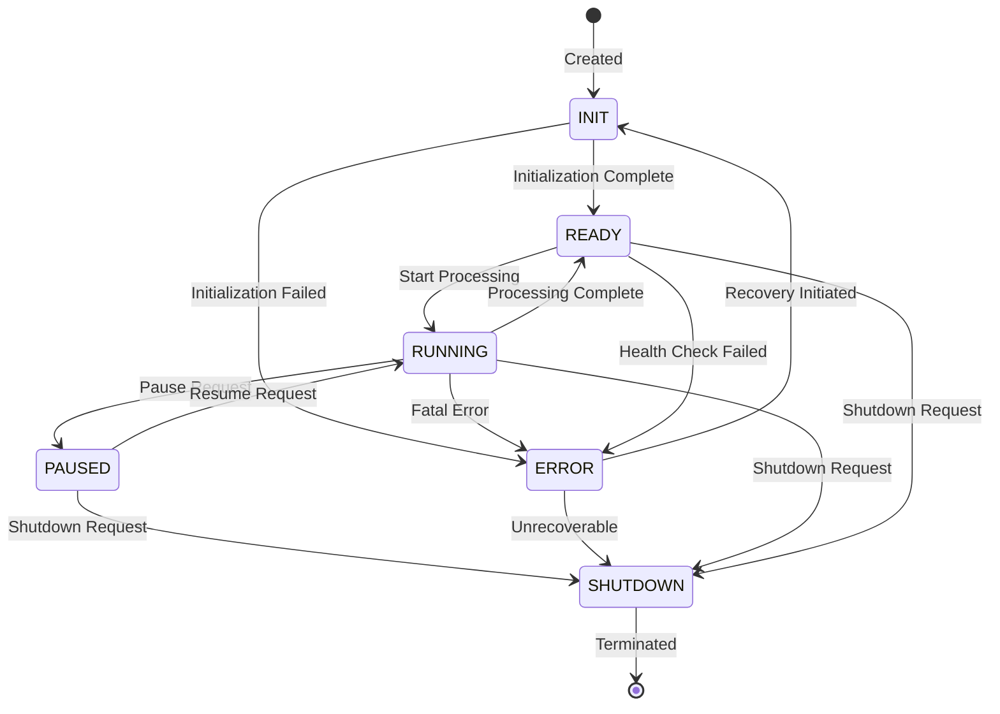
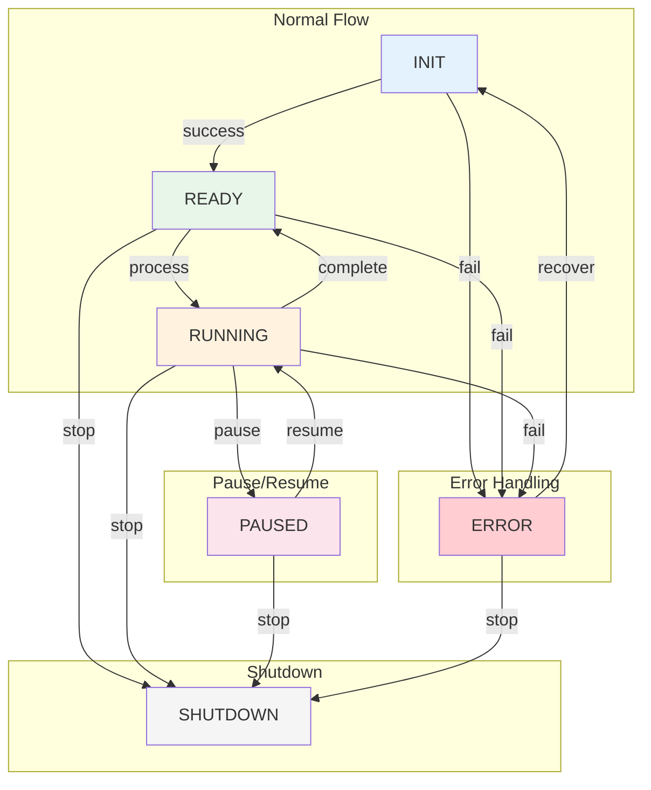
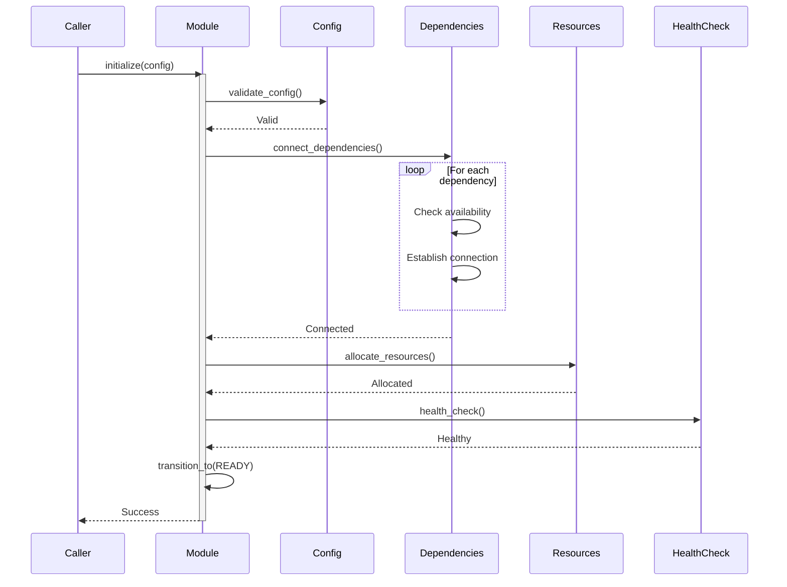
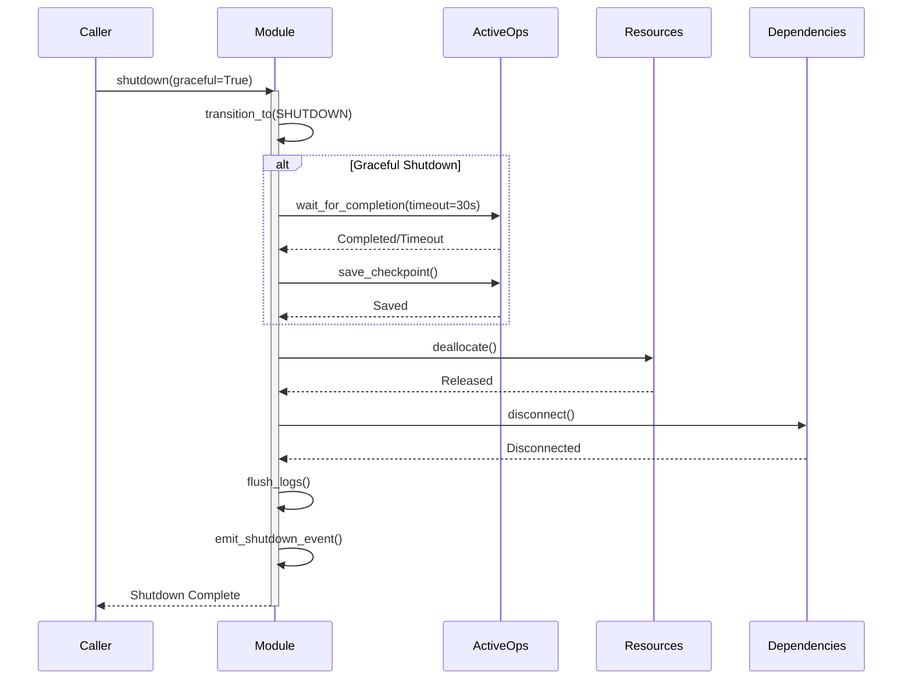
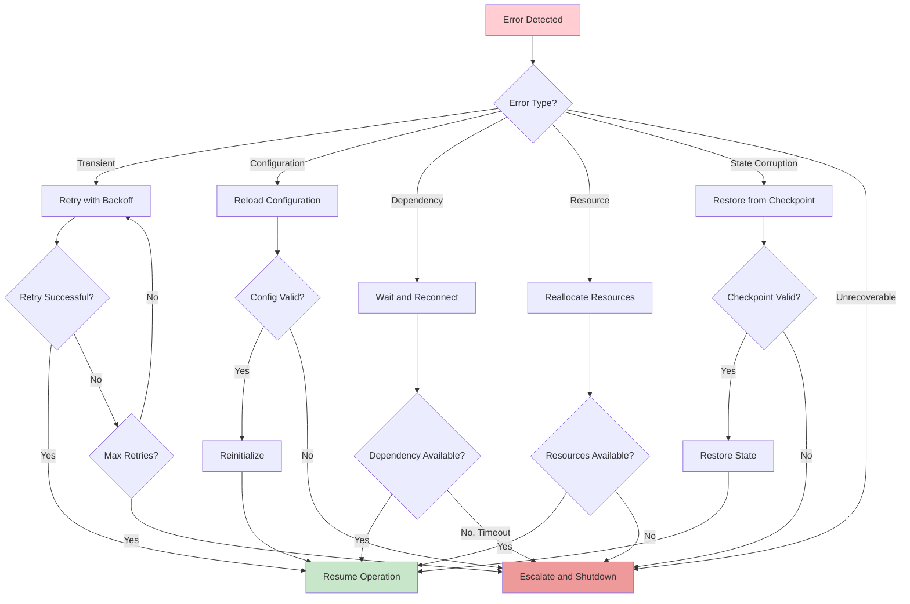
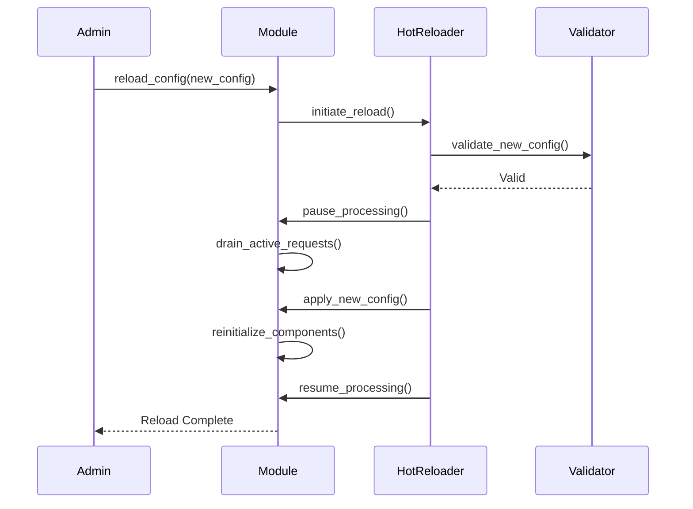
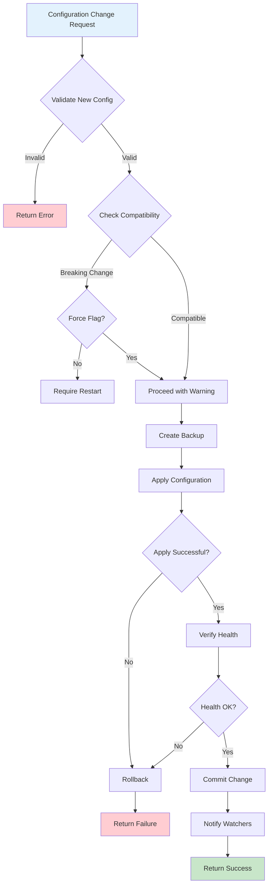

# Module Lifecycle Management

**Document ID:** ARCH-019
**Version:** 1.0.0
**Last Updated:** 2025-12-07
**Classification:** Technical Architecture
**Owner:** GreenLang Process Heat Engineering Team

---

## Table of Contents

1. [Overview](#1-overview)
2. [Module States](#2-module-states)
3. [State Transitions](#3-state-transitions)
4. [Initialization Sequence](#4-initialization-sequence)
5. [Graceful Shutdown Procedures](#5-graceful-shutdown-procedures)
6. [Health Check Protocols](#6-health-check-protocols)
7. [Recovery Procedures](#7-recovery-procedures)
8. [Hot-Reload Capabilities](#8-hot-reload-capabilities)
9. [Configuration Update Lifecycle](#9-configuration-update-lifecycle)
10. [Implementation Reference](#10-implementation-reference)

---

## 1. Overview

### 1.1 Purpose

This document defines the lifecycle management standards for all modules in the GreenLang Process Heat Agent ecosystem. Proper lifecycle management ensures reliable operation, graceful degradation, and fast recovery from failures.

### 1.2 Scope

This specification covers:
- Standard module states and transitions
- Initialization and shutdown procedures
- Health monitoring protocols
- Failure recovery mechanisms
- Hot-reload and configuration update procedures

### 1.3 Design Principles

| Principle | Description |
|-----------|-------------|
| **Fail-Safe** | Modules fail to safe states without propagating errors |
| **Observable** | All state changes are logged and emit events |
| **Recoverable** | Automatic recovery from transient failures |
| **Graceful** | Clean shutdown without data loss |
| **Deterministic** | State transitions are predictable and documented |

---

## 2. Module States

### 2.1 State Definitions

All Process Heat modules operate in one of six defined states:



### 2.2 State Descriptions

| State | Code | Description | Allowed Operations |
|-------|------|-------------|-------------------|
| **INIT** | `0` | Module created, initializing resources | Configure, Initialize |
| **READY** | `1` | Initialized and ready to process requests | Start, Process, Shutdown |
| **RUNNING** | `2` | Actively processing a request | Monitor, Pause, Abort |
| **PAUSED** | `3` | Processing suspended temporarily | Resume, Shutdown |
| **ERROR** | `4` | Error occurred, requires attention | Recover, Shutdown |
| **SHUTDOWN** | `5` | Shutting down, releasing resources | None |

### 2.3 State Implementation

```python
from enum import IntEnum, auto
from dataclasses import dataclass
from datetime import datetime, timezone
from typing import Optional, Callable, Dict, Any
import threading


class ModuleState(IntEnum):
    """
    Standard module states.

    States are ordered by severity/priority for comparison.
    """
    INIT = 0
    READY = 1
    RUNNING = 2
    PAUSED = 3
    ERROR = 4
    SHUTDOWN = 5


@dataclass
class StateInfo:
    """Detailed information about current state."""

    state: ModuleState
    entered_at: datetime
    previous_state: Optional[ModuleState]
    reason: str
    details: Dict[str, Any]


class StateManager:
    """
    Manages module state with thread-safe transitions.

    Features:
    - Thread-safe state transitions
    - Transition validation
    - State change events
    - State history tracking
    """

    # Valid state transitions
    VALID_TRANSITIONS = {
        ModuleState.INIT: {ModuleState.READY, ModuleState.ERROR},
        ModuleState.READY: {ModuleState.RUNNING, ModuleState.ERROR, ModuleState.SHUTDOWN},
        ModuleState.RUNNING: {ModuleState.READY, ModuleState.PAUSED, ModuleState.ERROR, ModuleState.SHUTDOWN},
        ModuleState.PAUSED: {ModuleState.RUNNING, ModuleState.SHUTDOWN},
        ModuleState.ERROR: {ModuleState.INIT, ModuleState.SHUTDOWN},
        ModuleState.SHUTDOWN: set(),  # Terminal state
    }

    def __init__(
        self,
        module_id: str,
        on_state_change: Optional[Callable[[ModuleState, ModuleState], None]] = None,
    ):
        """
        Initialize state manager.

        Args:
            module_id: Module identifier for logging
            on_state_change: Callback for state changes
        """
        self._module_id = module_id
        self._state = ModuleState.INIT
        self._state_info = StateInfo(
            state=ModuleState.INIT,
            entered_at=datetime.now(timezone.utc),
            previous_state=None,
            reason="Module created",
            details={},
        )
        self._lock = threading.RLock()
        self._on_state_change = on_state_change
        self._history: list[StateInfo] = [self._state_info]
        self._max_history = 100

    @property
    def state(self) -> ModuleState:
        """Get current state."""
        with self._lock:
            return self._state

    @property
    def state_info(self) -> StateInfo:
        """Get detailed state information."""
        with self._lock:
            return self._state_info

    def transition_to(
        self,
        new_state: ModuleState,
        reason: str,
        details: Optional[Dict[str, Any]] = None,
    ) -> bool:
        """
        Transition to a new state.

        Args:
            new_state: Target state
            reason: Reason for transition
            details: Additional details

        Returns:
            True if transition successful

        Raises:
            InvalidStateTransitionError: If transition not allowed
        """
        with self._lock:
            if new_state not in self.VALID_TRANSITIONS[self._state]:
                raise InvalidStateTransitionError(
                    f"Cannot transition from {self._state.name} to {new_state.name}"
                )

            old_state = self._state
            self._state = new_state
            self._state_info = StateInfo(
                state=new_state,
                entered_at=datetime.now(timezone.utc),
                previous_state=old_state,
                reason=reason,
                details=details or {},
            )

            # Track history
            self._history.append(self._state_info)
            if len(self._history) > self._max_history:
                self._history.pop(0)

            # Invoke callback
            if self._on_state_change:
                try:
                    self._on_state_change(old_state, new_state)
                except Exception as e:
                    # Don't let callback errors affect state
                    pass

            return True

    def can_transition_to(self, target_state: ModuleState) -> bool:
        """Check if transition to target state is valid."""
        with self._lock:
            return target_state in self.VALID_TRANSITIONS[self._state]

    def get_history(self) -> list[StateInfo]:
        """Get state transition history."""
        with self._lock:
            return list(self._history)
```

---

## 3. State Transitions

### 3.1 Transition Diagram



### 3.2 Transition Rules

#### 3.2.1 INIT to READY

```python
async def initialize(self, config: Dict[str, Any]) -> bool:
    """
    Transition from INIT to READY.

    Requirements:
    - Configuration is valid
    - All dependencies are available
    - Resources are allocated
    - Health check passes
    """
    try:
        self._state_manager.transition_to(
            ModuleState.INIT,
            reason="Starting initialization",
        )

        # Step 1: Validate configuration
        self._validate_config(config)

        # Step 2: Connect to dependencies
        await self._connect_dependencies()

        # Step 3: Allocate resources
        await self._allocate_resources()

        # Step 4: Perform initial health check
        health = self.health_check()
        if health["status"] != "healthy":
            raise InitializationError(f"Health check failed: {health}")

        # Step 5: Transition to READY
        self._state_manager.transition_to(
            ModuleState.READY,
            reason="Initialization complete",
            details={"config_hash": self._config_hash},
        )

        return True

    except Exception as e:
        self._state_manager.transition_to(
            ModuleState.ERROR,
            reason=f"Initialization failed: {str(e)}",
            details={"error_type": type(e).__name__},
        )
        raise
```

#### 3.2.2 READY to RUNNING

```python
async def process(self, input_data: ModuleInputBase) -> ModuleOutputBase:
    """
    Transition from READY to RUNNING during processing.

    Requirements:
    - Current state is READY
    - Input validation passes
    - No active processing
    """
    # Pre-processing checks
    if self._state_manager.state != ModuleState.READY:
        raise StateError(
            f"Cannot process: current state is {self._state_manager.state.name}"
        )

    # Transition to RUNNING
    self._state_manager.transition_to(
        ModuleState.RUNNING,
        reason=f"Processing request {input_data.request_id}",
        details={"request_id": input_data.request_id},
    )

    try:
        # Execute processing
        result = await self._execute(input_data)

        # Transition back to READY
        self._state_manager.transition_to(
            ModuleState.READY,
            reason="Processing complete",
            details={
                "request_id": input_data.request_id,
                "status": result.status,
            },
        )

        return result

    except Exception as e:
        # Transition to ERROR
        self._state_manager.transition_to(
            ModuleState.ERROR,
            reason=f"Processing failed: {str(e)}",
            details={
                "request_id": input_data.request_id,
                "error": str(e),
            },
        )
        raise
```

#### 3.2.3 RUNNING to PAUSED

```python
def pause(self, reason: str = "Manual pause") -> bool:
    """
    Pause processing.

    Requirements:
    - Current state is RUNNING
    - Current operation can be safely paused
    """
    if self._state_manager.state != ModuleState.RUNNING:
        return False

    # Set pause flag for current operation
    self._pause_requested = True

    # Wait for safe pause point
    while self._processing and not self._at_safe_point:
        time.sleep(0.1)

    self._state_manager.transition_to(
        ModuleState.PAUSED,
        reason=reason,
        details={"paused_at": datetime.now(timezone.utc).isoformat()},
    )

    return True


def resume(self) -> bool:
    """
    Resume from paused state.

    Requirements:
    - Current state is PAUSED
    """
    if self._state_manager.state != ModuleState.PAUSED:
        return False

    self._pause_requested = False

    self._state_manager.transition_to(
        ModuleState.RUNNING,
        reason="Resumed from pause",
    )

    return True
```

#### 3.2.4 ERROR to INIT (Recovery)

```python
async def recover(self) -> bool:
    """
    Recover from ERROR state.

    Requirements:
    - Current state is ERROR
    - Error is recoverable
    - Recovery conditions are met
    """
    if self._state_manager.state != ModuleState.ERROR:
        return False

    # Check if error is recoverable
    error_info = self._state_manager.state_info
    if not self._is_recoverable(error_info.details):
        return False

    # Attempt cleanup
    await self._cleanup_error_state()

    # Transition back to INIT
    self._state_manager.transition_to(
        ModuleState.INIT,
        reason="Recovery initiated",
        details={"recovery_attempt": self._recovery_count + 1},
    )

    # Re-initialize
    try:
        await self.initialize(self._last_config)
        self._recovery_count += 1
        return True
    except Exception as e:
        # Recovery failed
        self._state_manager.transition_to(
            ModuleState.ERROR,
            reason=f"Recovery failed: {str(e)}",
        )
        return False
```

### 3.3 Transition Events

All state transitions emit events for observability:

```python
@dataclass
class StateTransitionEvent:
    """Event emitted on state transition."""

    module_id: str
    timestamp: datetime
    from_state: ModuleState
    to_state: ModuleState
    reason: str
    details: Dict[str, Any]
    duration_in_previous_state_ms: float


# Event topics
STATE_TRANSITION_TOPIC = "process_heat.lifecycle.state_transition"
ERROR_STATE_TOPIC = "process_heat.lifecycle.error"
RECOVERY_TOPIC = "process_heat.lifecycle.recovery"
```

---

## 4. Initialization Sequence

### 4.1 Initialization Flow



### 4.2 Initialization Requirements

#### 4.2.1 Configuration Validation

```python
class ConfigurationValidator:
    """Validates module configuration before initialization."""

    @staticmethod
    def validate(
        config: Dict[str, Any],
        schema: Type[BaseModel],
    ) -> tuple[bool, list[str]]:
        """
        Validate configuration against schema.

        Args:
            config: Configuration dictionary
            schema: Pydantic schema class

        Returns:
            Tuple of (is_valid, list_of_errors)
        """
        try:
            schema(**config)
            return True, []
        except ValidationError as e:
            errors = [f"{err['loc']}: {err['msg']}" for err in e.errors()]
            return False, errors

    @staticmethod
    def validate_dependencies(
        config: Dict[str, Any],
        required_modules: set[str],
    ) -> tuple[bool, list[str]]:
        """Validate that required module dependencies are configured."""
        errors = []
        dependencies = config.get("dependencies", {})

        for module_id in required_modules:
            if module_id not in dependencies:
                errors.append(f"Missing required dependency: {module_id}")

        return len(errors) == 0, errors
```

#### 4.2.2 Dependency Verification

```python
class DependencyManager:
    """Manages module dependencies during initialization."""

    async def verify_dependencies(
        self,
        dependencies: Dict[str, str],
        timeout_s: float = 30.0,
    ) -> Dict[str, str]:
        """
        Verify all dependencies are available.

        Args:
            dependencies: Map of dependency_id -> endpoint
            timeout_s: Total timeout for verification

        Returns:
            Dict of dependency_id -> status

        Raises:
            DependencyError: If required dependency unavailable
        """
        results = {}
        start_time = time.time()

        for dep_id, endpoint in dependencies.items():
            remaining = timeout_s - (time.time() - start_time)
            if remaining <= 0:
                results[dep_id] = "timeout"
                continue

            try:
                status = await self._check_dependency(
                    dep_id,
                    endpoint,
                    timeout_s=min(remaining, 5.0),
                )
                results[dep_id] = status
            except Exception as e:
                results[dep_id] = f"error: {str(e)}"

        # Check for failures
        failures = {k: v for k, v in results.items() if v != "available"}
        if failures:
            raise DependencyError(
                f"Dependency verification failed: {failures}"
            )

        return results
```

#### 4.2.3 Resource Allocation

```python
class ResourceAllocator:
    """Allocates resources during module initialization."""

    def __init__(self, limits: ResourceLimits):
        self.limits = limits
        self._allocated = {}

    async def allocate(self, resource_spec: ResourceSpec) -> Dict[str, Any]:
        """
        Allocate resources for module.

        Args:
            resource_spec: Required resources

        Returns:
            Allocated resource handles

        Raises:
            ResourceError: If allocation fails
        """
        allocated = {}

        try:
            # Allocate memory pool
            if resource_spec.memory_mb > 0:
                allocated["memory_pool"] = self._allocate_memory(
                    resource_spec.memory_mb
                )

            # Allocate database connections
            if resource_spec.db_connections > 0:
                allocated["db_pool"] = await self._allocate_db_connections(
                    resource_spec.db_connections
                )

            # Allocate thread pool
            if resource_spec.worker_threads > 0:
                allocated["thread_pool"] = self._allocate_thread_pool(
                    resource_spec.worker_threads
                )

            self._allocated = allocated
            return allocated

        except Exception as e:
            # Cleanup partial allocation
            await self.deallocate()
            raise ResourceError(f"Resource allocation failed: {e}")

    async def deallocate(self) -> None:
        """Deallocate all resources."""
        for resource_type, handle in self._allocated.items():
            try:
                await self._release_resource(resource_type, handle)
            except Exception as e:
                logger.warning(f"Failed to release {resource_type}: {e}")

        self._allocated = {}
```

### 4.3 Initialization Timeout

```python
INITIALIZATION_TIMEOUTS = {
    "config_validation": 5.0,      # seconds
    "dependency_check": 30.0,       # seconds
    "resource_allocation": 15.0,    # seconds
    "health_check": 10.0,          # seconds
    "total": 60.0,                 # seconds
}


async def initialize_with_timeout(
    module: ModuleInterface,
    config: Dict[str, Any],
) -> bool:
    """
    Initialize module with timeout protection.

    Args:
        module: Module to initialize
        config: Configuration

    Returns:
        True if successful

    Raises:
        InitializationTimeoutError: If initialization exceeds timeout
    """
    try:
        return await asyncio.wait_for(
            module.initialize(config),
            timeout=INITIALIZATION_TIMEOUTS["total"],
        )
    except asyncio.TimeoutError:
        raise InitializationTimeoutError(
            f"Module {module.module_id} initialization timed out "
            f"after {INITIALIZATION_TIMEOUTS['total']}s"
        )
```

---

## 5. Graceful Shutdown Procedures

### 5.1 Shutdown Flow



### 5.2 Shutdown Implementation

```python
class ShutdownManager:
    """Manages graceful module shutdown."""

    def __init__(
        self,
        module_id: str,
        graceful_timeout_s: float = 30.0,
    ):
        self.module_id = module_id
        self.graceful_timeout_s = graceful_timeout_s
        self._shutdown_initiated = False
        self._shutdown_complete = asyncio.Event()

    async def shutdown(
        self,
        graceful: bool = True,
        save_checkpoint: bool = True,
    ) -> ShutdownResult:
        """
        Execute shutdown procedure.

        Args:
            graceful: If True, wait for active operations
            save_checkpoint: If True, save state for recovery

        Returns:
            ShutdownResult with details
        """
        self._shutdown_initiated = True
        start_time = time.time()
        result = ShutdownResult(module_id=self.module_id)

        try:
            # Phase 1: Stop accepting new requests
            self._stop_accepting_requests()
            result.phases["stop_accepting"] = "complete"

            # Phase 2: Wait for active operations (graceful only)
            if graceful:
                completed = await self._wait_for_active_operations(
                    timeout_s=self.graceful_timeout_s
                )
                result.phases["wait_operations"] = (
                    "complete" if completed else "timeout"
                )
                if not completed:
                    result.warnings.append("Some operations were aborted")

            # Phase 3: Save checkpoint
            if save_checkpoint:
                checkpoint_id = await self._save_checkpoint()
                result.checkpoint_id = checkpoint_id
                result.phases["save_checkpoint"] = "complete"

            # Phase 4: Release resources
            await self._release_resources()
            result.phases["release_resources"] = "complete"

            # Phase 5: Disconnect dependencies
            await self._disconnect_dependencies()
            result.phases["disconnect"] = "complete"

            # Phase 6: Final cleanup
            await self._final_cleanup()
            result.phases["cleanup"] = "complete"

            result.success = True
            result.duration_ms = (time.time() - start_time) * 1000

        except Exception as e:
            result.success = False
            result.error = str(e)

        finally:
            self._shutdown_complete.set()

        return result

    async def _wait_for_active_operations(
        self,
        timeout_s: float,
    ) -> bool:
        """Wait for active operations to complete."""
        try:
            await asyncio.wait_for(
                self._all_operations_complete.wait(),
                timeout=timeout_s,
            )
            return True
        except asyncio.TimeoutError:
            # Abort remaining operations
            await self._abort_remaining_operations()
            return False

    async def _save_checkpoint(self) -> str:
        """Save module state for potential recovery."""
        checkpoint = {
            "module_id": self.module_id,
            "timestamp": datetime.now(timezone.utc).isoformat(),
            "state": self._capture_state(),
            "pending_work": self._get_pending_work(),
        }

        checkpoint_id = hashlib.sha256(
            json.dumps(checkpoint, sort_keys=True).encode()
        ).hexdigest()[:16]

        await self._checkpoint_store.save(checkpoint_id, checkpoint)
        return checkpoint_id


@dataclass
class ShutdownResult:
    """Result of shutdown procedure."""

    module_id: str
    success: bool = False
    duration_ms: float = 0.0
    phases: Dict[str, str] = field(default_factory=dict)
    checkpoint_id: Optional[str] = None
    warnings: List[str] = field(default_factory=list)
    error: Optional[str] = None
```

### 5.3 Emergency Shutdown

For safety-critical situations requiring immediate shutdown:

```python
async def emergency_shutdown(
    self,
    reason: str,
    triggered_by: str,
) -> None:
    """
    Execute emergency shutdown (non-graceful).

    This immediately stops all operations without waiting.
    Use only for safety-critical situations.

    Args:
        reason: Reason for emergency shutdown
        triggered_by: Entity that triggered shutdown
    """
    logger.critical(
        f"EMERGENCY SHUTDOWN: {reason} (triggered by {triggered_by})"
    )

    # Immediately stop all operations
    self._abort_all_operations()

    # Transition to shutdown state
    self._state_manager.transition_to(
        ModuleState.SHUTDOWN,
        reason=f"Emergency: {reason}",
        details={
            "emergency": True,
            "triggered_by": triggered_by,
        },
    )

    # Release critical resources only
    await self._release_critical_resources()

    # Emit emergency event
    await self._emit_event(
        topic="process_heat.safety.emergency_shutdown",
        event={
            "module_id": self.module_id,
            "reason": reason,
            "triggered_by": triggered_by,
            "timestamp": datetime.now(timezone.utc).isoformat(),
        },
    )
```

---

## 6. Health Check Protocols

### 6.1 Health Check Structure

```python
class HealthStatus(str, Enum):
    """Module health status levels."""
    HEALTHY = "healthy"
    DEGRADED = "degraded"
    UNHEALTHY = "unhealthy"


@dataclass
class HealthCheckResult:
    """Result of health check."""

    status: HealthStatus
    timestamp: datetime
    checks: Dict[str, Dict[str, Any]]
    latency_ms: float
    message: Optional[str] = None


class HealthChecker:
    """
    Performs health checks on module components.

    Health checks are performed:
    - Periodically (configurable interval)
    - On-demand via API
    - Before processing requests (optional)
    """

    def __init__(
        self,
        module_id: str,
        check_interval_s: float = 30.0,
    ):
        self.module_id = module_id
        self.check_interval_s = check_interval_s
        self._checks: Dict[str, Callable] = {}
        self._last_result: Optional[HealthCheckResult] = None

    def register_check(
        self,
        name: str,
        check_fn: Callable[[], Dict[str, Any]],
        critical: bool = False,
    ) -> None:
        """
        Register a health check.

        Args:
            name: Check name
            check_fn: Function that returns check result
            critical: If True, failure makes module unhealthy
        """
        self._checks[name] = {
            "fn": check_fn,
            "critical": critical,
        }

    def perform_check(self) -> HealthCheckResult:
        """
        Perform all registered health checks.

        Returns:
            HealthCheckResult with status and details
        """
        start_time = time.time()
        checks = {}
        critical_failures = []

        for name, check_info in self._checks.items():
            try:
                result = check_info["fn"]()
                checks[name] = {
                    "status": result.get("status", "unknown"),
                    "details": result,
                }

                if (
                    check_info["critical"] and
                    result.get("status") != "pass"
                ):
                    critical_failures.append(name)

            except Exception as e:
                checks[name] = {
                    "status": "error",
                    "error": str(e),
                }
                if check_info["critical"]:
                    critical_failures.append(name)

        # Determine overall status
        if critical_failures:
            status = HealthStatus.UNHEALTHY
            message = f"Critical checks failed: {critical_failures}"
        elif any(c["status"] != "pass" for c in checks.values()):
            status = HealthStatus.DEGRADED
            message = "Some non-critical checks failed"
        else:
            status = HealthStatus.HEALTHY
            message = "All checks passed"

        result = HealthCheckResult(
            status=status,
            timestamp=datetime.now(timezone.utc),
            checks=checks,
            latency_ms=(time.time() - start_time) * 1000,
            message=message,
        )

        self._last_result = result
        return result
```

### 6.2 Standard Health Checks

Every module MUST implement these health checks:

```python
class StandardHealthChecks:
    """Standard health checks for all modules."""

    @staticmethod
    def memory_check(threshold_mb: float = 1024) -> Dict[str, Any]:
        """Check memory usage."""
        import psutil
        process = psutil.Process()
        memory_mb = process.memory_info().rss / 1024 / 1024

        return {
            "status": "pass" if memory_mb < threshold_mb else "warn",
            "memory_mb": round(memory_mb, 2),
            "threshold_mb": threshold_mb,
        }

    @staticmethod
    def cpu_check(threshold_pct: float = 90) -> Dict[str, Any]:
        """Check CPU usage."""
        import psutil
        cpu_pct = psutil.cpu_percent(interval=0.1)

        return {
            "status": "pass" if cpu_pct < threshold_pct else "warn",
            "cpu_percent": cpu_pct,
            "threshold_percent": threshold_pct,
        }

    @staticmethod
    def dependency_check(
        dependencies: Dict[str, str],
    ) -> Dict[str, Any]:
        """Check dependency availability."""
        results = {}
        all_available = True

        for dep_id, endpoint in dependencies.items():
            try:
                # Ping dependency
                available = _ping_endpoint(endpoint, timeout=2.0)
                results[dep_id] = "available" if available else "unavailable"
                if not available:
                    all_available = False
            except Exception as e:
                results[dep_id] = f"error: {str(e)}"
                all_available = False

        return {
            "status": "pass" if all_available else "fail",
            "dependencies": results,
        }

    @staticmethod
    def state_check(
        state_manager: StateManager,
    ) -> Dict[str, Any]:
        """Check module state."""
        state = state_manager.state
        state_info = state_manager.state_info

        acceptable_states = {ModuleState.READY, ModuleState.RUNNING}

        return {
            "status": "pass" if state in acceptable_states else "fail",
            "current_state": state.name,
            "state_duration_s": (
                datetime.now(timezone.utc) - state_info.entered_at
            ).total_seconds(),
        }
```

### 6.3 Health Check API

```python
# Health check endpoint response format
{
    "status": "healthy",
    "timestamp": "2025-12-07T10:30:00Z",
    "module_id": "GL-013",
    "module_version": "1.0.0",
    "uptime_seconds": 86400,
    "checks": {
        "memory": {
            "status": "pass",
            "memory_mb": 512.5,
            "threshold_mb": 1024
        },
        "cpu": {
            "status": "pass",
            "cpu_percent": 25.3,
            "threshold_percent": 90
        },
        "dependencies": {
            "status": "pass",
            "dependencies": {
                "GL-001": "available",
                "database": "available"
            }
        },
        "state": {
            "status": "pass",
            "current_state": "READY",
            "state_duration_s": 3600
        }
    },
    "latency_ms": 15.2
}
```

### 6.4 Liveness and Readiness Probes

For Kubernetes deployment:

```python
class KubernetesProbes:
    """Liveness and readiness probes for Kubernetes."""

    def __init__(self, module: ModuleInterface):
        self.module = module

    def liveness_probe(self) -> tuple[bool, str]:
        """
        Liveness probe - is the module alive?

        Returns:
            Tuple of (is_alive, message)
        """
        state = self.module.get_state()

        # Module is alive if not in SHUTDOWN state
        if state == ModuleState.SHUTDOWN:
            return False, "Module is shut down"

        # Check if responsive
        try:
            # Simple responsiveness check
            _ = self.module.module_id
            return True, "Module is alive"
        except Exception as e:
            return False, f"Module not responsive: {e}"

    def readiness_probe(self) -> tuple[bool, str]:
        """
        Readiness probe - is the module ready to accept traffic?

        Returns:
            Tuple of (is_ready, message)
        """
        state = self.module.get_state()

        if state not in {ModuleState.READY, ModuleState.RUNNING}:
            return False, f"Module not ready: state={state.name}"

        # Perform quick health check
        health = self.module.health_check()
        if health["status"] == "unhealthy":
            return False, f"Health check failed: {health.get('message')}"

        return True, "Module is ready"
```

---

## 7. Recovery Procedures

### 7.1 Recovery Strategy



### 7.2 Recovery Implementation

```python
class RecoveryManager:
    """Manages module recovery from error states."""

    # Recovery strategies by error type
    RECOVERY_STRATEGIES = {
        "transient": "retry_with_backoff",
        "configuration": "reload_config",
        "dependency": "reconnect_dependencies",
        "resource": "reallocate_resources",
        "state_corruption": "restore_checkpoint",
        "unknown": "full_restart",
    }

    def __init__(
        self,
        module: ModuleInterface,
        max_retries: int = 3,
        backoff_base_s: float = 1.0,
        backoff_max_s: float = 60.0,
    ):
        self.module = module
        self.max_retries = max_retries
        self.backoff_base = backoff_base_s
        self.backoff_max = backoff_max_s
        self._retry_count = 0
        self._recovery_history: List[Dict] = []

    async def attempt_recovery(
        self,
        error: ModuleError,
    ) -> RecoveryResult:
        """
        Attempt to recover from an error.

        Args:
            error: The error to recover from

        Returns:
            RecoveryResult with success status and details
        """
        start_time = time.time()
        error_type = self._classify_error(error)
        strategy = self.RECOVERY_STRATEGIES.get(error_type, "full_restart")

        logger.info(
            f"Attempting recovery for {self.module.module_id}: "
            f"error_type={error_type}, strategy={strategy}"
        )

        try:
            if strategy == "retry_with_backoff":
                success = await self._retry_with_backoff()
            elif strategy == "reload_config":
                success = await self._reload_configuration()
            elif strategy == "reconnect_dependencies":
                success = await self._reconnect_dependencies()
            elif strategy == "reallocate_resources":
                success = await self._reallocate_resources()
            elif strategy == "restore_checkpoint":
                success = await self._restore_from_checkpoint()
            else:
                success = await self._full_restart()

            result = RecoveryResult(
                success=success,
                strategy=strategy,
                duration_ms=(time.time() - start_time) * 1000,
                retry_count=self._retry_count,
            )

        except Exception as e:
            result = RecoveryResult(
                success=False,
                strategy=strategy,
                error=str(e),
                duration_ms=(time.time() - start_time) * 1000,
            )

        self._recovery_history.append({
            "timestamp": datetime.now(timezone.utc).isoformat(),
            "error_type": error_type,
            "strategy": strategy,
            "success": result.success,
        })

        return result

    async def _retry_with_backoff(self) -> bool:
        """Retry operation with exponential backoff."""
        for attempt in range(self.max_retries):
            self._retry_count = attempt + 1

            # Calculate backoff
            backoff = min(
                self.backoff_base * (2 ** attempt),
                self.backoff_max,
            )

            logger.info(
                f"Retry attempt {attempt + 1}/{self.max_retries}, "
                f"waiting {backoff}s"
            )

            await asyncio.sleep(backoff)

            try:
                # Attempt to reinitialize
                await self.module.initialize(self.module._last_config)
                return True
            except Exception as e:
                logger.warning(f"Retry {attempt + 1} failed: {e}")

        return False

    async def _restore_from_checkpoint(self) -> bool:
        """Restore module state from checkpoint."""
        # Find latest valid checkpoint
        checkpoint = await self._find_latest_checkpoint()
        if not checkpoint:
            return False

        try:
            # Restore state
            await self._apply_checkpoint(checkpoint)

            # Verify state
            health = self.module.health_check()
            return health["status"] != "unhealthy"

        except Exception as e:
            logger.error(f"Checkpoint restoration failed: {e}")
            return False

    def _classify_error(self, error: ModuleError) -> str:
        """Classify error type for recovery strategy selection."""
        error_code = error.error_code

        if "COMM" in error_code or "TIMEOUT" in str(error):
            return "transient"
        elif "CFG" in error_code:
            return "configuration"
        elif "DEP" in error_code:
            return "dependency"
        elif "RES" in error_code or "MEMORY" in str(error).upper():
            return "resource"
        elif "STATE" in error_code or "CORRUPT" in str(error).upper():
            return "state_corruption"
        else:
            return "unknown"


@dataclass
class RecoveryResult:
    """Result of recovery attempt."""

    success: bool
    strategy: str
    duration_ms: float = 0.0
    retry_count: int = 0
    checkpoint_id: Optional[str] = None
    error: Optional[str] = None
```

### 7.3 Circuit Breaker Pattern

```python
class CircuitBreaker:
    """
    Circuit breaker for protecting against repeated failures.

    States:
    - CLOSED: Normal operation
    - OPEN: Failures exceeded threshold, reject calls
    - HALF_OPEN: Testing if service recovered
    """

    class State(Enum):
        CLOSED = "closed"
        OPEN = "open"
        HALF_OPEN = "half_open"

    def __init__(
        self,
        failure_threshold: int = 5,
        reset_timeout_s: float = 30.0,
        half_open_max_calls: int = 3,
    ):
        self.failure_threshold = failure_threshold
        self.reset_timeout_s = reset_timeout_s
        self.half_open_max_calls = half_open_max_calls

        self._state = self.State.CLOSED
        self._failure_count = 0
        self._last_failure_time: Optional[float] = None
        self._half_open_calls = 0

    @property
    def state(self) -> State:
        """Get current circuit breaker state."""
        if self._state == self.State.OPEN:
            # Check if reset timeout has passed
            if (
                self._last_failure_time and
                time.time() - self._last_failure_time > self.reset_timeout_s
            ):
                self._state = self.State.HALF_OPEN
                self._half_open_calls = 0

        return self._state

    def allow_request(self) -> bool:
        """Check if request should be allowed."""
        state = self.state

        if state == self.State.CLOSED:
            return True
        elif state == self.State.OPEN:
            return False
        else:  # HALF_OPEN
            if self._half_open_calls < self.half_open_max_calls:
                self._half_open_calls += 1
                return True
            return False

    def record_success(self) -> None:
        """Record successful call."""
        if self._state == self.State.HALF_OPEN:
            self._state = self.State.CLOSED
        self._failure_count = 0

    def record_failure(self) -> None:
        """Record failed call."""
        self._failure_count += 1
        self._last_failure_time = time.time()

        if self._failure_count >= self.failure_threshold:
            self._state = self.State.OPEN
```

---

## 8. Hot-Reload Capabilities

### 8.1 Hot-Reload Overview

Hot-reload allows modules to update configurations and certain code paths without full restart:



### 8.2 Hot-Reload Implementation

```python
class HotReloader:
    """
    Enables hot-reload of module configuration.

    Supports:
    - Configuration updates
    - Threshold changes
    - Feature flag updates
    - Connection pool resizing
    """

    # Components that support hot-reload
    HOT_RELOADABLE = {
        "thresholds",
        "feature_flags",
        "logging_config",
        "timeout_values",
        "pool_sizes",
    }

    # Components requiring restart
    REQUIRES_RESTART = {
        "module_id",
        "safety_level",
        "core_dependencies",
        "security_config",
    }

    def __init__(self, module: ModuleInterface):
        self.module = module
        self._reload_lock = asyncio.Lock()
        self._reload_in_progress = False

    async def reload(
        self,
        new_config: Dict[str, Any],
        force: bool = False,
    ) -> HotReloadResult:
        """
        Hot-reload module configuration.

        Args:
            new_config: New configuration
            force: If True, reload even non-hot-reloadable items

        Returns:
            HotReloadResult with details
        """
        async with self._reload_lock:
            self._reload_in_progress = True
            result = HotReloadResult()

            try:
                # Step 1: Determine what changed
                changes = self._detect_changes(
                    self.module._config,
                    new_config,
                )

                # Step 2: Check if changes require restart
                requires_restart = changes & self.REQUIRES_RESTART
                if requires_restart and not force:
                    result.success = False
                    result.requires_restart = True
                    result.restart_reasons = list(requires_restart)
                    return result

                # Step 3: Validate new config
                is_valid, errors = self._validate_config(new_config)
                if not is_valid:
                    result.success = False
                    result.validation_errors = errors
                    return result

                # Step 4: Pause processing
                await self._pause_module()

                # Step 5: Apply changes
                for component in changes:
                    try:
                        await self._apply_change(component, new_config)
                        result.reloaded_components.append(component)
                    except Exception as e:
                        result.failed_components.append(
                            (component, str(e))
                        )

                # Step 6: Resume processing
                await self._resume_module()

                result.success = len(result.failed_components) == 0

            finally:
                self._reload_in_progress = False

            return result

    async def _pause_module(self) -> None:
        """Pause module for reload."""
        # Stop accepting new requests
        self.module._accepting_requests = False

        # Wait for active requests to complete (with timeout)
        try:
            await asyncio.wait_for(
                self.module._active_requests_complete.wait(),
                timeout=30.0,
            )
        except asyncio.TimeoutError:
            logger.warning("Active requests did not complete within timeout")

    async def _resume_module(self) -> None:
        """Resume module after reload."""
        self.module._accepting_requests = True


@dataclass
class HotReloadResult:
    """Result of hot-reload operation."""

    success: bool = False
    requires_restart: bool = False
    restart_reasons: List[str] = field(default_factory=list)
    reloaded_components: List[str] = field(default_factory=list)
    failed_components: List[tuple[str, str]] = field(default_factory=list)
    validation_errors: List[str] = field(default_factory=list)
```

---

## 9. Configuration Update Lifecycle

### 9.1 Configuration Sources

```python
class ConfigurationSource(Enum):
    """Sources of module configuration."""
    FILE = "file"           # YAML/JSON config files
    ENVIRONMENT = "env"     # Environment variables
    SECRETS = "secrets"     # Secret manager (Vault, AWS SM)
    API = "api"            # Configuration API
    DATABASE = "database"   # Configuration database


class ConfigurationManager:
    """
    Manages module configuration with multiple sources.

    Priority (highest to lowest):
    1. Environment variables
    2. API/Database (runtime)
    3. Secrets manager
    4. Configuration files
    5. Default values
    """

    def __init__(
        self,
        module_id: str,
        config_schema: Type[BaseModel],
    ):
        self.module_id = module_id
        self.config_schema = config_schema
        self._config: Optional[BaseModel] = None
        self._config_hash: Optional[str] = None
        self._watchers: List[Callable] = []

    async def load_config(self) -> BaseModel:
        """Load configuration from all sources."""
        config_dict = {}

        # Layer 1: Default values
        config_dict.update(self._get_defaults())

        # Layer 2: Configuration files
        file_config = await self._load_from_files()
        config_dict.update(file_config)

        # Layer 3: Secrets
        secrets = await self._load_secrets()
        config_dict.update(secrets)

        # Layer 4: Database/API
        runtime_config = await self._load_runtime_config()
        config_dict.update(runtime_config)

        # Layer 5: Environment variables
        env_config = self._load_from_env()
        config_dict.update(env_config)

        # Validate and create config object
        self._config = self.config_schema(**config_dict)
        self._config_hash = self._compute_hash(config_dict)

        return self._config

    def watch_for_changes(
        self,
        callback: Callable[[BaseModel, BaseModel], None],
    ) -> None:
        """
        Watch for configuration changes.

        Args:
            callback: Function called with (old_config, new_config)
        """
        self._watchers.append(callback)

    async def _check_for_updates(self) -> bool:
        """Check if configuration has changed."""
        current_hash = self._config_hash

        # Reload from sources
        new_config = await self.load_config()
        new_hash = self._config_hash

        if current_hash != new_hash:
            # Notify watchers
            for watcher in self._watchers:
                try:
                    watcher(self._config, new_config)
                except Exception as e:
                    logger.error(f"Config watcher error: {e}")

            return True

        return False
```

### 9.2 Configuration Update Flow



### 9.3 Configuration Versioning

```python
class ConfigurationVersion:
    """Tracks configuration versions for audit and rollback."""

    def __init__(self, storage_path: str):
        self.storage_path = storage_path
        self._versions: List[ConfigVersion] = []
        self._max_versions = 100

    async def save_version(
        self,
        config: Dict[str, Any],
        source: str,
        applied_by: str,
    ) -> str:
        """
        Save a new configuration version.

        Args:
            config: Configuration dictionary
            source: Source of change
            applied_by: User/system that applied change

        Returns:
            Version ID
        """
        version = ConfigVersion(
            version_id=str(uuid.uuid4())[:8],
            timestamp=datetime.now(timezone.utc),
            config_hash=hashlib.sha256(
                json.dumps(config, sort_keys=True).encode()
            ).hexdigest(),
            config=config,
            source=source,
            applied_by=applied_by,
        )

        self._versions.append(version)

        # Trim old versions
        if len(self._versions) > self._max_versions:
            self._versions = self._versions[-self._max_versions:]

        # Persist
        await self._persist_version(version)

        return version.version_id

    async def rollback_to(
        self,
        version_id: str,
    ) -> Dict[str, Any]:
        """
        Rollback to a previous version.

        Args:
            version_id: Version to rollback to

        Returns:
            Configuration from that version
        """
        version = next(
            (v for v in self._versions if v.version_id == version_id),
            None,
        )

        if not version:
            raise ValueError(f"Version {version_id} not found")

        return version.config


@dataclass
class ConfigVersion:
    """A configuration version."""

    version_id: str
    timestamp: datetime
    config_hash: str
    config: Dict[str, Any]
    source: str
    applied_by: str
```

---

## 10. Implementation Reference

### 10.1 Complete Lifecycle Manager

```python
class ModuleLifecycleManager:
    """
    Complete lifecycle manager for Process Heat modules.

    Integrates:
    - State management
    - Initialization
    - Shutdown
    - Health checks
    - Recovery
    - Hot-reload
    - Configuration management
    """

    def __init__(
        self,
        module: ModuleInterface,
        config_schema: Type[BaseModel],
    ):
        self.module = module
        self._state_manager = StateManager(
            module.module_id,
            on_state_change=self._on_state_change,
        )
        self._health_checker = HealthChecker(module.module_id)
        self._recovery_manager = RecoveryManager(module)
        self._hot_reloader = HotReloader(module)
        self._config_manager = ConfigurationManager(
            module.module_id,
            config_schema,
        )
        self._shutdown_manager = ShutdownManager(module.module_id)

        # Register standard health checks
        self._register_standard_health_checks()

    async def start(self, config: Dict[str, Any]) -> bool:
        """Start the module through full initialization."""
        try:
            # Load and validate configuration
            validated_config = await self._config_manager.load_config()

            # Initialize module
            success = await self.module.initialize(validated_config.dict())

            if success:
                # Start background tasks
                asyncio.create_task(self._health_check_loop())
                asyncio.create_task(self._config_watch_loop())

            return success

        except Exception as e:
            logger.error(f"Module start failed: {e}")
            return False

    async def stop(self, graceful: bool = True) -> ShutdownResult:
        """Stop the module through shutdown procedure."""
        return await self._shutdown_manager.shutdown(graceful=graceful)

    async def recover(self, error: ModuleError) -> RecoveryResult:
        """Attempt recovery from error state."""
        return await self._recovery_manager.attempt_recovery(error)

    async def reload_config(
        self,
        new_config: Dict[str, Any],
    ) -> HotReloadResult:
        """Hot-reload configuration."""
        return await self._hot_reloader.reload(new_config)

    def get_state(self) -> ModuleState:
        """Get current module state."""
        return self._state_manager.state

    def health_check(self) -> HealthCheckResult:
        """Perform health check."""
        return self._health_checker.perform_check()

    async def _health_check_loop(self) -> None:
        """Background health check loop."""
        while self._state_manager.state != ModuleState.SHUTDOWN:
            try:
                result = self._health_checker.perform_check()

                if result.status == HealthStatus.UNHEALTHY:
                    logger.warning(
                        f"Health check failed: {result.message}"
                    )

                    # Attempt auto-recovery if in appropriate state
                    if self._state_manager.state == ModuleState.READY:
                        self._state_manager.transition_to(
                            ModuleState.ERROR,
                            reason=f"Health check failed: {result.message}",
                        )

            except Exception as e:
                logger.error(f"Health check error: {e}")

            await asyncio.sleep(self._health_checker.check_interval_s)

    async def _config_watch_loop(self) -> None:
        """Watch for configuration changes."""
        while self._state_manager.state != ModuleState.SHUTDOWN:
            try:
                changed = await self._config_manager._check_for_updates()
                if changed:
                    logger.info("Configuration change detected")
                    # Auto-reload if enabled
                    if self.module._config.get("auto_reload", False):
                        await self.reload_config(
                            self._config_manager._config.dict()
                        )

            except Exception as e:
                logger.error(f"Config watch error: {e}")

            await asyncio.sleep(30.0)  # Check every 30 seconds

    def _on_state_change(
        self,
        old_state: ModuleState,
        new_state: ModuleState,
    ) -> None:
        """Handle state change events."""
        logger.info(
            f"Module {self.module.module_id} state changed: "
            f"{old_state.name} -> {new_state.name}"
        )

        # Emit state change event
        # (In production, publish to event bus)

    def _register_standard_health_checks(self) -> None:
        """Register standard health checks."""
        self._health_checker.register_check(
            "memory",
            lambda: StandardHealthChecks.memory_check(),
            critical=False,
        )
        self._health_checker.register_check(
            "state",
            lambda: StandardHealthChecks.state_check(self._state_manager),
            critical=True,
        )
```

### 10.2 Usage Example

```python
# Example: Using lifecycle manager with GL-013 PredictiveMaintenance

from greenlang.agents.process_heat.gl_013_predictive_maintenance import (
    PredictiveMaintenanceAgent,
    PredictiveMaintenanceConfig,
)

async def main():
    # Create module
    agent = PredictiveMaintenanceAgent(
        PredictiveMaintenanceConfig(
            equipment_id="PUMP-001",
            equipment_type=EquipmentType.CENTRIFUGAL_PUMP,
        )
    )

    # Create lifecycle manager
    lifecycle = ModuleLifecycleManager(
        module=agent,
        config_schema=PredictiveMaintenanceConfig,
    )

    # Start module
    success = await lifecycle.start({
        "equipment_id": "PUMP-001",
        "check_interval_s": 30.0,
    })

    if not success:
        print("Failed to start module")
        return

    # Check state
    print(f"Module state: {lifecycle.get_state().name}")

    # Health check
    health = lifecycle.health_check()
    print(f"Health: {health.status.value}")

    # Hot-reload configuration
    reload_result = await lifecycle.reload_config({
        "check_interval_s": 60.0,  # Update interval
    })
    print(f"Reload successful: {reload_result.success}")

    # Graceful shutdown
    shutdown_result = await lifecycle.stop(graceful=True)
    print(f"Shutdown: {shutdown_result.success}")


if __name__ == "__main__":
    asyncio.run(main())
```

---

**Document Control:**

| Version | Date | Author | Changes |
|---------|------|--------|---------|
| 1.0.0 | 2025-12-07 | GL-TechWriter | Initial release |

---

**END OF DOCUMENT**
