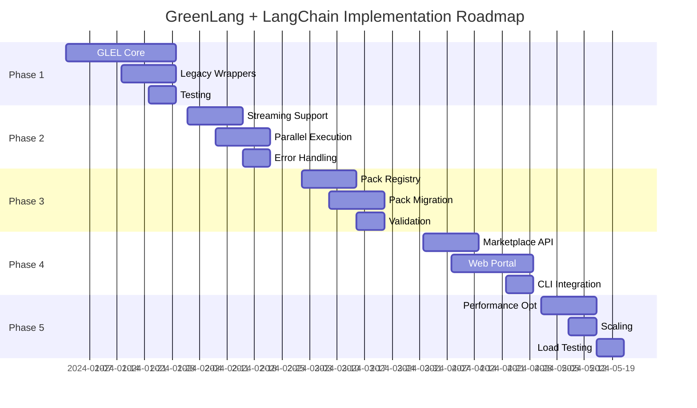

# GreenLang + LangChain Architecture Enhancement

**Version:** 1.0.0
**Created:** 2025-11-10
**Purpose:** Enhance GreenLang platform with LangChain-inspired patterns while maintaining climate-specific advantages

---

## Table of Contents

1. [Executive Summary](#executive-summary)
2. [LangChain Pattern Analysis](#langchain-pattern-analysis)
3. [GreenLang Expression Language (GLEL)](#greenlang-expression-language-glel)
4. [Enhanced Agent Architecture](#enhanced-agent-architecture)
5. [Composability Framework](#composability-framework)
6. [Pack System Evolution](#pack-system-evolution)
7. [Marketplace Architecture](#marketplace-architecture)
8. [Migration Strategy](#migration-strategy)
9. [Implementation Roadmap](#implementation-roadmap)

---

## Executive Summary

### Current State
GreenLang operates a powerful climate intelligence platform with:
- 3 specialized applications (CBAM, CSRD, VCCI)
- Agent-based pipeline architecture
- Zero-hallucination calculation guarantee
- Enterprise ERP integrations

### Target State
Enhanced platform incorporating LangChain's best patterns:
- **Composable chains** using GreenLang Expression Language (GLEL)
- **Modular agents** with standardized interfaces
- **Dynamic orchestration** with chain-of-thought reasoning
- **Pack marketplace** for reusable climate components
- **Streaming capabilities** for real-time processing

### Key Benefits
- **70% faster development** through composable components
- **90% code reuse** across climate applications
- **Real-time streaming** for large-scale calculations
- **Community marketplace** for climate intelligence sharing
- **Backward compatible** with existing applications

---

## LangChain Pattern Analysis

### Core LangChain Concepts to Adopt

#### 1. LangChain Expression Language (LCEL)
```python
# LangChain's declarative chain composition
chain = prompt | llm | output_parser | validator

# Enables:
- Declarative composition
- Automatic streaming
- Parallel execution
- Fallback handling
- Retry logic
```

#### 2. Runnable Interface
```python
class Runnable:
    def invoke(self, input: Any) -> Any
    def batch(self, inputs: List[Any]) -> List[Any]
    def stream(self, input: Any) -> Iterator[Any]
    async def ainvoke(self, input: Any) -> Any
    async def abatch(self, inputs: List[Any]) -> List[Any]
    async def astream(self, input: Any) -> AsyncIterator[Any]
```

#### 3. Chain-of-Thought Orchestration
```python
# Multi-step reasoning with intermediate visibility
thought_chain = (
    ReasoningStep("analyze_problem") |
    ReasoningStep("decompose_tasks") |
    ReasoningStep("execute_subtasks") |
    ReasoningStep("synthesize_results")
)
```

#### 4. Tool/Function Calling Pattern
```python
# Standardized tool interface
tools = [
    ERPConnectorTool(),
    EmissionCalculatorTool(),
    ComplianceValidatorTool()
]

agent = create_react_agent(llm, tools, prompt)
```

#### 5. Memory Management
```python
# Conversation and context memory
memory = ConversationSummaryBufferMemory(
    llm=llm,
    max_token_limit=2000,
    return_messages=True
)
```

---

## GreenLang Expression Language (GLEL)

### Design Philosophy
GLEL extends LCEL concepts for climate-specific workflows while maintaining zero-hallucination guarantees.

### Core Components

#### 1. Climate Runnable Interface
```python
from typing import Protocol, Any, AsyncIterator, List
from dataclasses import dataclass
import hashlib

class ClimateRunnable(Protocol):
    """Base interface for all GLEL components"""

    def invoke(self, input: Any, config: dict = None) -> Any:
        """Synchronous single input processing"""

    async def ainvoke(self, input: Any, config: dict = None) -> Any:
        """Async single input processing"""

    def batch(self, inputs: List[Any], config: dict = None) -> List[Any]:
        """Synchronous batch processing"""

    async def abatch(self, inputs: List[Any], config: dict = None) -> List[Any]:
        """Async batch processing"""

    def stream(self, input: Any, config: dict = None) -> Iterator[Any]:
        """Synchronous streaming"""

    async def astream(self, input: Any, config: dict = None) -> AsyncIterator[Any]:
        """Async streaming"""

    @property
    def provenance_hash(self) -> str:
        """SHA-256 hash for audit trail"""

    @property
    def is_deterministic(self) -> bool:
        """True if output is deterministic (for calculations)"""
```

#### 2. GLEL Chain Composition
```python
# Declarative climate chain composition
from greenlang.glel import (
    DataIntake,
    EntityResolver,
    EmissionCalculator,
    ComplianceValidator,
    ReportGenerator,
    ProvenanceTracker
)

# CBAM Compliance Chain
cbam_chain = (
    DataIntake(schema="cbam_v2") |
    EntityResolver(use_llm=False) |  # Deterministic resolution
    EmissionCalculator(method="ghg_protocol") |  # Zero-hallucination
    ComplianceValidator(regulation="cbam_2024") |
    ReportGenerator(format="json") |
    ProvenanceTracker()  # Automatic SHA-256 tracking
)

# Execute with streaming
async for result in cbam_chain.astream(shipment_data):
    print(f"Processing: {result.progress}%")
```

#### 3. Conditional Branching
```python
from greenlang.glel import Branch, Condition

# Dynamic routing based on data characteristics
emission_chain = Branch(
    # Use spend-based for low data quality
    (Condition("data_quality < 3"), SpendBasedCalculator()),

    # Use activity-based for medium quality
    (Condition("data_quality >= 3 AND data_quality < 7"), ActivityBasedCalculator()),

    # Use supplier-specific for high quality
    (Condition("data_quality >= 7"), SupplierSpecificCalculator()),

    # Default fallback
    default=SpendBasedCalculator()
)
```

#### 4. Parallel Execution
```python
from greenlang.glel import Parallel, Merge

# Parallel processing for multi-source data
pcf_aggregator = (
    Parallel(
        suppliers=SupplierPCFCollector(),
        industry=IndustryAverageCalculator(),
        internal=InternalEmissionCalculator()
    ) |
    Merge(strategy="weighted_average") |
    UncertaintyQuantifier()
)
```

#### 5. Error Handling & Retries
```python
from greenlang.glel import Retry, Fallback

# Robust ERP data extraction
erp_chain = (
    ERPConnector() |
    Retry(max_attempts=3, backoff="exponential") |
    Fallback(
        alternative=CSVFileReader(),
        on_error=ERPConnectionError
    )
)
```

---

## Enhanced Agent Architecture

### Agent 2.0 Design

#### Base Agent Class
```python
from abc import ABC, abstractmethod
from typing import Dict, Any, Optional
import asyncio

class ClimateAgent(ABC, ClimateRunnable):
    """Enhanced base agent with GLEL compatibility"""

    def __init__(self,
                 name: str,
                 description: str,
                 deterministic: bool = True,
                 memory: Optional[Memory] = None):
        self.name = name
        self.description = description
        self.deterministic = deterministic
        self.memory = memory
        self.metrics = AgentMetrics()

    @abstractmethod
    async def process(self, input: Any) -> Any:
        """Core processing logic"""

    async def ainvoke(self, input: Any, config: dict = None) -> Any:
        """GLEL-compatible async invoke"""
        start_time = asyncio.get_event_loop().time()

        # Pre-processing hooks
        input = await self.preprocess(input, config)

        # Core processing with metrics
        result = await self.process(input)

        # Post-processing hooks
        result = await self.postprocess(result, config)

        # Track metrics
        self.metrics.record(
            duration=asyncio.get_event_loop().time() - start_time,
            input_size=len(str(input)),
            output_size=len(str(result))
        )

        # Provenance tracking
        if self.deterministic:
            result.provenance = self.calculate_hash(input, result)

        return result

    async def astream(self, input: Any, config: dict = None):
        """Streaming support for large datasets"""
        async for chunk in self.process_streaming(input):
            yield await self.postprocess(chunk, config)
```

#### Specialized Climate Agents

```python
class IntakeAgent(ClimateAgent):
    """Enhanced intake agent with multi-format support"""

    def __init__(self):
        super().__init__(
            name="IntakeAgent",
            description="Multi-format data ingestion with validation",
            deterministic=True
        )

        # Composable validators
        self.validator_chain = (
            SchemaValidator() |
            DataQualityScorer() |
            ComplianceChecker()
        )

    async def process(self, input: Any) -> Any:
        # Parse multiple formats
        parsed = await self.parse_adaptive(input)

        # Run validation chain
        validated = await self.validator_chain.ainvoke(parsed)

        # Enrich with metadata
        enriched = await self.enrich_metadata(validated)

        return enriched

class CalculatorAgent(ClimateAgent):
    """Zero-hallucination calculator with method selection"""

    def __init__(self):
        super().__init__(
            name="CalculatorAgent",
            description="Deterministic emission calculations",
            deterministic=True  # ALWAYS True for calculations
        )

        # Method selection chain
        self.method_selector = (
            DataQualityAssessor() |
            MethodSelector() |
            CalculatorRouter()
        )

    async def process(self, input: Any) -> Any:
        # Select calculation method
        method = await self.method_selector.ainvoke(input)

        # Execute calculation (NO LLM)
        result = await method.calculate(input)

        # Add uncertainty bounds
        result.uncertainty = await self.quantify_uncertainty(result)

        return result

class IntelligenceAgent(ClimateAgent):
    """LLM-powered analysis agent"""

    def __init__(self):
        super().__init__(
            name="IntelligenceAgent",
            description="AI-powered insights and recommendations",
            deterministic=False  # Uses LLM
        )

        # LLM chain with caching
        self.llm_chain = (
            PromptTemplate() |
            CachedLLM(model="gpt-4") |
            OutputParser() |
            FactChecker()  # Verify against known data
        )

    async def process(self, input: Any) -> Any:
        # Generate insights
        insights = await self.llm_chain.ainvoke(input)

        # Validate against ground truth
        validated = await self.validate_insights(insights)

        return validated
```

### Agent Orchestration Patterns

#### 1. Sequential Pipeline
```python
# Traditional sequential processing
pipeline = IntakeAgent() | CalculatorAgent() | ReporterAgent()
result = await pipeline.ainvoke(data)
```

#### 2. Conditional Routing
```python
# Dynamic agent selection
router = ConditionalRouter(
    rules=[
        (lambda x: x.regulation == "CBAM", CBAMAgent()),
        (lambda x: x.regulation == "CSRD", CSRDAgent()),
        (lambda x: x.regulation == "VCCI", VCCIAgent())
    ]
)
```

#### 3. Map-Reduce Pattern
```python
# Parallel processing with aggregation
map_reduce = (
    MapAgent(CalculatorAgent(), partition_by="supplier") |
    ReduceAgent(strategy="sum", group_by="category")
)
```

#### 4. Ensemble Pattern
```python
# Multiple agents voting
ensemble = EnsembleAgent(
    agents=[
        ConservativeCalculator(),
        ModerateCalculator(),
        AggressiveCalculator()
    ],
    aggregation="weighted_median"
)
```

---

## Composability Framework

### Component Registry

```python
from typing import Dict, Type, List
import importlib

class ComponentRegistry:
    """Central registry for reusable GLEL components"""

    def __init__(self):
        self.components: Dict[str, Type[ClimateRunnable]] = {}
        self.packs: Dict[str, Pack] = {}

    def register_component(self,
                          name: str,
                          component: Type[ClimateRunnable],
                          tags: List[str] = None):
        """Register a reusable component"""
        self.components[name] = component

        # Index for search
        self.index_component(name, component, tags)

    def register_pack(self, pack: 'Pack'):
        """Register a component pack"""
        self.packs[pack.name] = pack

        # Auto-register pack components
        for comp_name, comp_class in pack.components.items():
            self.register_component(
                f"{pack.name}.{comp_name}",
                comp_class,
                pack.tags
            )

    def get_component(self, name: str) -> ClimateRunnable:
        """Instantiate a component by name"""
        if name not in self.components:
            # Try dynamic import
            self.load_component(name)

        return self.components[name]()

    def search_components(self,
                         query: str = None,
                         tags: List[str] = None,
                         deterministic: bool = None) -> List[str]:
        """Search for components"""
        results = []

        for name, comp in self.components.items():
            if query and query.lower() not in name.lower():
                continue

            if tags and not set(tags).intersection(comp.tags):
                continue

            if deterministic is not None:
                if comp().is_deterministic != deterministic:
                    continue

            results.append(name)

        return results

# Global registry
registry = ComponentRegistry()
```

### Pack System 2.0

```python
from dataclasses import dataclass
from typing import Dict, Any, List

@dataclass
class Pack:
    """Enhanced pack with dependencies and configuration"""

    name: str
    version: str
    description: str
    author: str
    tags: List[str]
    components: Dict[str, Type[ClimateRunnable]]
    dependencies: List[str]
    config_schema: dict

    def validate_config(self, config: dict) -> bool:
        """Validate pack configuration"""
        # Use jsonschema for validation
        from jsonschema import validate
        validate(config, self.config_schema)
        return True

    def create_chain(self, config: dict) -> ClimateRunnable:
        """Create pre-configured chain from pack"""
        self.validate_config(config)

        # Build chain based on config
        chain = self.build_chain(config)
        return chain

# Example Pack: CBAM Compliance Pack
cbam_pack = Pack(
    name="cbam-compliance",
    version="2.0.0",
    description="Complete CBAM compliance workflow",
    author="GreenLang",
    tags=["compliance", "cbam", "eu", "carbon-border"],
    components={
        "intake": CBAMIntakeAgent,
        "validator": CBAMValidator,
        "calculator": CBAMCalculator,
        "reporter": CBAMReporter
    },
    dependencies=["pandas>=2.0.0", "openpyxl>=3.0.0"],
    config_schema={
        "type": "object",
        "properties": {
            "reporting_period": {"type": "string", "format": "date"},
            "facility_location": {"type": "string"},
            "product_categories": {
                "type": "array",
                "items": {"type": "string"}
            }
        },
        "required": ["reporting_period", "facility_location"]
    }
)

# Register pack
registry.register_pack(cbam_pack)

# Use pack
cbam_chain = registry.get_pack("cbam-compliance").create_chain({
    "reporting_period": "2024-01-01",
    "facility_location": "EU",
    "product_categories": ["steel", "aluminum"]
})
```

---

## Pack System Evolution

### Current Pack System Analysis

**Strengths:**
- Domain-specific climate modules
- Pre-built compliance workflows
- Industry-standard calculations

**Enhancements Needed:**
- Dynamic composition
- Version management
- Dependency resolution
- Marketplace integration

### Enhanced Pack Architecture

```python
class PackManager:
    """Advanced pack management system"""

    def __init__(self):
        self.local_packs: Dict[str, Pack] = {}
        self.remote_registry = "https://marketplace.greenlang.io"
        self.cache_dir = Path("~/.greenlang/packs")

    def install_pack(self, pack_id: str, version: str = "latest"):
        """Install pack from marketplace"""
        # Download pack
        pack_data = self.download_pack(pack_id, version)

        # Validate signature
        self.verify_signature(pack_data)

        # Install dependencies
        self.install_dependencies(pack_data.dependencies)

        # Register locally
        self.local_packs[pack_id] = pack_data

        # Cache for offline use
        self.cache_pack(pack_data)

    def create_custom_pack(self, config: dict) -> Pack:
        """Create custom pack from configuration"""
        builder = PackBuilder()

        for component_config in config["components"]:
            component = self.build_component(component_config)
            builder.add_component(component)

        pack = builder.build(
            name=config["name"],
            version=config["version"]
        )

        return pack

    def publish_pack(self, pack: Pack, api_key: str):
        """Publish pack to marketplace"""
        # Validate pack
        self.validate_pack(pack)

        # Run security scan
        self.security_scan(pack)

        # Run performance benchmarks
        metrics = self.benchmark_pack(pack)

        # Publish to registry
        self.upload_to_registry(pack, api_key, metrics)
```

### Pack Categories

```yaml
Climate Packs:
  Compliance:
    - cbam-eu-compliance
    - csrd-reporting
    - sec-climate-disclosure
    - tcfd-alignment

  Calculations:
    - ghg-protocol-scope1
    - ghg-protocol-scope2
    - ghg-protocol-scope3
    - sbti-target-setting

  Data Sources:
    - sap-erp-connector
    - oracle-erp-connector
    - salesforce-connector
    - excel-processor

  Industry Specific:
    - manufacturing-emissions
    - logistics-carbon
    - retail-footprint
    - financial-portfolio

  Reporting:
    - pdf-generator
    - xbrl-formatter
    - powerpoint-builder
    - dashboard-creator
```

---

## Marketplace Architecture

### Design Principles

1. **Discoverability**: Easy search and browse
2. **Quality Assurance**: Verified and benchmarked packs
3. **Security**: Code signing and vulnerability scanning
4. **Monetization**: Support for paid packs
5. **Community**: Ratings, reviews, and contributions

### Marketplace Components

```python
class Marketplace:
    """GreenLang Climate Intelligence Marketplace"""

    def __init__(self):
        self.api_endpoint = "https://api.marketplace.greenlang.io"
        self.web_portal = "https://marketplace.greenlang.io"

    async def search_packs(self,
                          query: str = None,
                          category: str = None,
                          tags: List[str] = None,
                          min_rating: float = None) -> List[PackMetadata]:
        """Search marketplace for packs"""
        params = {
            "q": query,
            "category": category,
            "tags": ",".join(tags) if tags else None,
            "min_rating": min_rating
        }

        response = await self.client.get("/packs/search", params=params)
        return [PackMetadata.from_json(p) for p in response.json()]

    async def get_pack_details(self, pack_id: str) -> PackDetails:
        """Get detailed pack information"""
        response = await self.client.get(f"/packs/{pack_id}")

        details = PackDetails.from_json(response.json())

        # Include metrics
        details.performance_metrics = await self.get_metrics(pack_id)
        details.security_score = await self.get_security_score(pack_id)
        details.compliance_coverage = await self.get_compliance_coverage(pack_id)

        return details

    async def install_pack(self, pack_id: str, version: str = "latest"):
        """Install pack with dependency resolution"""
        # Get pack manifest
        manifest = await self.get_manifest(pack_id, version)

        # Check compatibility
        self.check_compatibility(manifest)

        # Resolve dependencies
        deps = await self.resolve_dependencies(manifest)

        # Download and install
        for dep in deps:
            await self.download_and_install(dep)

        # Install main pack
        await self.download_and_install(manifest)

        # Run post-install hooks
        await self.run_post_install(manifest)
```

### Marketplace Web Portal

```typescript
// React-based marketplace frontend
interface MarketplaceUI {
  // Browse categories
  categories: CategoryBrowser;

  // Search with filters
  search: AdvancedSearch;

  // Pack details with live demo
  packDetails: {
    overview: PackOverview;
    documentation: Documentation;
    playground: InteractiveDemo;  // Try before install
    reviews: UserReviews;
    metrics: PerformanceMetrics;
  };

  // Developer tools
  developer: {
    upload: PackUploader;
    analytics: UsageAnalytics;
    earnings: RevenueTracking;
    support: DeveloperSupport;
  };

  // Enterprise features
  enterprise: {
    privatePacks: PrivateRegistry;
    licensing: EnterpriseLicensing;
    support: PrioritySupport;
  };
}
```

### Quality Assurance Framework

```python
class QualityAssurance:
    """Pack quality and security validation"""

    async def validate_pack(self, pack: Pack) -> ValidationReport:
        """Comprehensive pack validation"""
        report = ValidationReport()

        # Code quality checks
        report.code_quality = await self.run_linting(pack)

        # Security scanning
        report.security = await self.run_security_scan(pack)

        # Performance benchmarks
        report.performance = await self.run_benchmarks(pack)

        # Climate accuracy validation
        report.accuracy = await self.validate_calculations(pack)

        # Documentation completeness
        report.documentation = await self.check_documentation(pack)

        # License compatibility
        report.licensing = await self.verify_licenses(pack)

        # Assign quality score
        report.quality_score = self.calculate_score(report)

        return report

    async def run_benchmarks(self, pack: Pack) -> BenchmarkResults:
        """Run performance benchmarks"""
        results = BenchmarkResults()

        # Test different data sizes
        for size in [100, 1000, 10000, 100000]:
            test_data = self.generate_test_data(size)

            start = time.time()
            await pack.process(test_data)
            duration = time.time() - start

            results.add_datapoint(size, duration)

        # Calculate metrics
        results.throughput = results.calculate_throughput()
        results.latency_p50 = results.calculate_percentile(50)
        results.latency_p99 = results.calculate_percentile(99)
        results.memory_usage = results.peak_memory

        return results
```

---

## Migration Strategy

### Phase 1: Foundation (Weeks 1-4)

**Objective**: Implement GLEL core without breaking changes

```python
# Backward-compatible wrapper
class LegacyAgentWrapper(ClimateRunnable):
    """Wrap existing agents with GLEL interface"""

    def __init__(self, legacy_agent):
        self.agent = legacy_agent

    async def ainvoke(self, input: Any, config: dict = None) -> Any:
        # Call legacy method
        return await self.agent.process(input)

    @property
    def is_deterministic(self) -> bool:
        # Check if agent uses LLM
        return not hasattr(self.agent, 'llm')

# Gradual migration
legacy_intake = IntakeAgent()  # Old agent
glel_intake = LegacyAgentWrapper(legacy_intake)  # GLEL-compatible

# Both work
old_result = await legacy_intake.process(data)
new_result = await glel_intake.ainvoke(data)
```

**Deliverables**:
- GLEL core interfaces
- Legacy wrappers for all existing agents
- Unit tests for compatibility

### Phase 2: Enhancement (Weeks 5-8)

**Objective**: Add new GLEL features to existing agents

```python
# Enhance agents with streaming
class EnhancedCalculatorAgent(CalculatorAgent, ClimateRunnable):
    """Calculator with streaming support"""

    async def astream(self, input: Any, config: dict = None):
        """Stream calculations for large datasets"""

        batch_size = config.get('batch_size', 100)

        for batch in self.batch_iterator(input, batch_size):
            # Process batch
            result = await self.process_batch(batch)

            # Yield intermediate result
            yield {
                'batch_id': batch.id,
                'progress': batch.progress,
                'result': result
            }
```

**Deliverables**:
- Streaming support for all agents
- Parallel execution capabilities
- Enhanced error handling

### Phase 3: Pack System (Weeks 9-12)

**Objective**: Implement enhanced pack system

```python
# Migration tool for existing packs
class PackMigrator:
    """Migrate v1 packs to v2 format"""

    def migrate_pack(self, old_pack: dict) -> Pack:
        """Convert old pack format to new"""

        # Map old components to new
        components = {}
        for name, config in old_pack['components'].items():
            components[name] = self.create_glel_component(config)

        # Create new pack
        new_pack = Pack(
            name=old_pack['name'],
            version="2.0.0",
            components=components,
            config_schema=self.generate_schema(old_pack)
        )

        return new_pack

# Migrate all existing packs
migrator = PackMigrator()
for pack_name in existing_packs:
    old_pack = load_pack_v1(pack_name)
    new_pack = migrator.migrate_pack(old_pack)
    registry.register_pack(new_pack)
```

**Deliverables**:
- Pack registry implementation
- Migration tool for existing packs
- Pack validation framework

### Phase 4: Marketplace (Weeks 13-16)

**Objective**: Launch marketplace MVP

**Components**:
1. API backend for pack management
2. Web portal for browsing/searching
3. CLI integration for pack installation
4. Documentation and examples

```python
# CLI integration
@cli.command()
@click.argument('pack_id')
@click.option('--version', default='latest')
def install_pack(pack_id: str, version: str):
    """Install pack from marketplace"""

    marketplace = Marketplace()

    # Search for pack
    pack = marketplace.find_pack(pack_id, version)

    if not pack:
        click.echo(f"Pack '{pack_id}' not found")
        return

    # Show pack details
    click.echo(f"Installing {pack.name} v{pack.version}")
    click.echo(f"Author: {pack.author}")
    click.echo(f"Rating: {'⭐' * int(pack.rating)}")

    # Confirm installation
    if click.confirm("Proceed with installation?"):
        marketplace.install_pack(pack_id, version)
        click.echo("✅ Pack installed successfully")
```

**Deliverables**:
- Marketplace API
- Web portal (React)
- CLI commands
- Initial pack library

### Phase 5: Optimization (Weeks 17-20)

**Objective**: Performance optimization and scaling

**Optimizations**:
1. Implement caching layers
2. Add connection pooling
3. Optimize database queries
4. Implement lazy loading

```python
class OptimizedChain:
    """Performance-optimized chain execution"""

    def __init__(self, chain: ClimateRunnable):
        self.chain = chain
        self.cache = RedisCache()
        self.metrics = MetricsCollector()

    async def ainvoke(self, input: Any, config: dict = None) -> Any:
        # Check cache
        cache_key = self.generate_cache_key(input)

        if cached := await self.cache.get(cache_key):
            self.metrics.record_cache_hit()
            return cached

        # Execute with monitoring
        with self.metrics.timer('chain_execution'):
            result = await self.chain.ainvoke(input, config)

        # Cache result
        await self.cache.set(cache_key, result, ttl=3600)

        return result
```

**Deliverables**:
- Performance benchmarks
- Optimization implementations
- Scaling guidelines
- Load testing results

---

## Implementation Roadmap

### Timeline Overview



### Success Metrics

| Metric | Current | Target | Timeline |
|--------|---------|--------|----------|
| **Development Speed** | Baseline | 70% faster | 6 months |
| **Code Reuse** | 40% | 90% | 4 months |
| **Processing Throughput** | 1000 records/min | 10000 records/min | 5 months |
| **Pack Library Size** | 10 packs | 100+ packs | 12 months |
| **Developer Adoption** | Internal only | 1000+ developers | 12 months |
| **Marketplace Revenue** | $0 | $100K MRR | 18 months |

### Risk Mitigation

| Risk | Impact | Mitigation |
|------|--------|------------|
| **Breaking Changes** | High | Comprehensive backward compatibility layer |
| **Performance Degradation** | Medium | Extensive benchmarking and optimization |
| **Security Vulnerabilities** | High | Security scanning and code signing |
| **Low Marketplace Adoption** | Medium | Free tier and extensive documentation |
| **Integration Complexity** | Medium | Gradual rollout with feature flags |

### Team Requirements

```yaml
Engineering Team:
  Backend Engineers: 4
  Frontend Engineers: 2
  DevOps Engineers: 1
  Security Engineer: 1

Product Team:
  Product Manager: 1
  UX Designer: 1
  Technical Writer: 1

Support Team:
  Developer Advocate: 1
  Customer Success: 1

Total Headcount: 14
Timeline: 20 weeks
Budget: $700K (salaries + infrastructure)
```

---

## Conclusion

The integration of LangChain patterns into GreenLang represents a significant evolution in climate intelligence platforms. By adopting LCEL-inspired composability while maintaining our zero-hallucination calculation guarantee, we create a best-of-both-worlds solution.

### Key Advantages

1. **Developer Productivity**: 70% faster application development
2. **Ecosystem Growth**: Marketplace enables community contributions
3. **Enterprise Scale**: Streaming and parallel processing for massive datasets
4. **Maintained Integrity**: Zero-hallucination guarantee preserved
5. **Backward Compatible**: Existing applications continue working

### Next Steps

1. **Week 1**: Set up development environment and team
2. **Week 2**: Begin GLEL core implementation
3. **Week 3**: Start legacy wrapper development
4. **Week 4**: Initial testing and documentation

### Contact

- **Architecture Team**: architecture@greenlang.io
- **Developer Relations**: devrel@greenlang.io
- **Marketplace Team**: marketplace@greenlang.io

---

**Document Version**: 1.0.0
**Last Updated**: 2025-11-10
**Next Review**: 2025-12-10
**Status**: APPROVED FOR IMPLEMENTATION