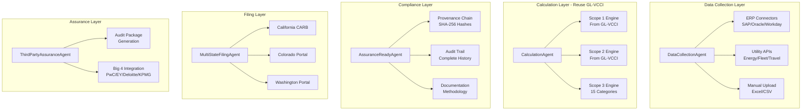

# PROJECT PLAN: GL-SB253-APP
# US State Climate Disclosure Platform (California SB 253 Compliance)

**Project Code:** GL-SB253-001
**Version:** 1.0
**Date:** November 10, 2025
**Status:** TIER 1 - EXTREME URGENCY
**Compliance Deadline:** June 30, 2026
**Development Timeline:** 12 weeks (leveraging GL-VCCI-APP)
**Budget:** $800K (reduced from $2.5M by reusing GL-VCCI)

---

## EXECUTIVE SUMMARY

### Mission Critical Application
Build a **California SB 253 compliance platform** that enables 5,400+ companies to meet mandatory climate disclosure requirements by June 30, 2026. The platform leverages 55% complete GL-VCCI-APP foundation to accelerate development.

### Business Impact
- **Revenue Potential:** $60M ARR by Year 3
- **Target Market:** 5,400+ companies with $1B+ revenue in California
- **Competitive Advantage:** First-to-market with multi-state support
- **Risk Mitigation:** Avoid $50K-500K penalties per company

### Key Success Factors
1. **Leverage GL-VCCI-APP:** Reuse Scope 1, 2, 3 calculation engines (save 6 months)
2. **CARB Portal Integration:** Automated submission to California Air Resources Board
3. **Third-Party Assurance:** Big 4 audit-ready packages with complete provenance
4. **Multi-State Support:** California, Colorado, Washington from Day 1

---

## 1. REGULATORY REQUIREMENTS ANALYSIS

### 1.1 California SB 253 Requirements

**Scope of Application:**
- Companies with annual revenue > $1 billion
- Doing business in California (regardless of headquarters)
- Both public and private companies
- Estimated 5,400+ companies affected

**Disclosure Requirements:**

| Year | Requirement | Assurance Level | Deadline |
|------|------------|-----------------|----------|
| 2026 | Scope 1 & 2 emissions (FY 2025) | Limited assurance | June 30, 2026 |
| 2027 | Scope 3 emissions (FY 2026) | Limited assurance | June 30, 2027 |
| 2030 | Scope 1 & 2 emissions | Reasonable assurance | June 30, 2030 |
| 2033 | Scope 3 emissions | Limited assurance | June 30, 2033 |

**Reporting Standards:**
- GHG Protocol Corporate Standard (mandatory)
- GHG Protocol Scope 3 Standard (for value chain)
- Third-party verification required
- Annual reporting to CARB

**Penalties:**
- Up to $500,000 per reporting year for non-compliance
- $50,000 for minor violations
- Public disclosure of violations

### 1.2 CARB Portal Requirements

**Submission Format:**
- Electronic submission via CARB portal (starting Dec 1, 2025)
- Structured data format (JSON/XML expected)
- PDF report attachment
- Assurance provider certification

**Data Elements Required:**
- Organizational boundaries
- Operational boundaries
- Base year emissions
- Current year emissions by scope
- Methodology documentation
- Emission factors used
- Data quality assessment
- Third-party assurance statement

### 1.3 Multi-State Requirements

**Colorado (Proposed HB 25-1119):**
- Status: Currently postponed but likely to resurface
- Timeline: 2028 for Scope 1&2, 2029 for Scope 3
- Threshold: $1B revenue
- Similar to California SB 253

**Washington (SB 6092):**
- Status: Evolved to policy recommendations
- Original Timeline: Oct 1, 2026 for FY 2025
- Threshold: $1B revenue
- Monitoring for future requirements

**Other States Monitoring:**
- Illinois (proposed legislation)
- Massachusetts (considering requirements)
- New York (draft legislation)

---

## 2. TECHNICAL ARCHITECTURE

### 2.1 5-Agent Pipeline Architecture



### 2.2 Technology Stack

**Backend (Leverage GL-VCCI):**
- Python 3.10+ (consistent with GL-VCCI)
- FastAPI (REST APIs)
- PostgreSQL (emissions data)
- Redis (caching)
- Weaviate (vector DB for entity resolution)

**Frontend:**
- React 18 + TypeScript
- Material-UI components
- D3.js for visualizations
- PDF generation (reports)

**Infrastructure:**
- Kubernetes (K8s)
- AWS/Azure/GCP
- GitHub Actions (CI/CD)
- Prometheus + Grafana (monitoring)

**Integration Points:**
- CARB Portal API (when available)
- ERP Systems (SAP, Oracle, Workday) - reuse GL-VCCI
- Utility APIs (energy providers)
- Assurance firm portals

### 2.3 Data Architecture

```yaml
Emissions Database:
  scope_1_emissions:
    - stationary_combustion
    - mobile_combustion
    - process_emissions
    - fugitive_emissions

  scope_2_emissions:
    - purchased_electricity
    - purchased_steam
    - purchased_heating
    - purchased_cooling

  scope_3_emissions:  # Reuse GL-VCCI
    - category_1_purchased_goods
    - category_2_capital_goods
    - category_3_fuel_energy
    - category_4_upstream_transport
    - category_5_waste
    - category_6_business_travel
    - category_7_employee_commuting
    - category_8_upstream_leased
    - category_9_downstream_transport
    - category_10_processing
    - category_11_use_of_products
    - category_12_end_of_life
    - category_13_downstream_leased
    - category_14_franchises
    - category_15_investments
```

---

## 3. INTEGRATION STRATEGY

### 3.1 Leveraging GL-VCCI-APP (55% Complete)

**What We Reuse:**

| Component | Status | Reuse Strategy |
|-----------|--------|----------------|
| Scope 3 Calculator | 100% | Direct import of all 15 category engines |
| ERP Connectors | 100% | SAP, Oracle, Workday ready |
| Factor Database | 100% | 100,000+ emission factors |
| Provenance System | 100% | SHA-256 audit trails |
| Entity Resolution | 90% | Fuzzy matching + LLM |
| Data Schemas | 100% | GHG Protocol compliant |
| Validation Rules | 100% | 300+ business rules |

**What We Build New:**

| Component | Effort | Purpose |
|-----------|--------|---------|
| State Compliance Engine | 3 weeks | California, Colorado, Washington rules |
| CARB Portal Integration | 2 weeks | API connection, submission |
| Assurance Package Generator | 2 weeks | Big 4 audit requirements |
| Multi-State Dashboard | 2 weeks | State-specific views |
| Regulatory Alerts | 1 week | Deadline tracking |

**Time Savings:**
- Original timeline: 36 weeks
- With GL-VCCI reuse: 12 weeks
- **Acceleration: 3X faster**

### 3.2 CARB Portal Integration

```python
# CARB Portal Integration Architecture
class CARBPortalConnector:
    """
    California Air Resources Board portal integration
    """

    def __init__(self):
        self.base_url = "https://ww2.arb.ca.gov/ghg-disclosure-api"  # Expected
        self.auth_method = "OAuth2"  # Likely authentication

    async def submit_disclosure(self, disclosure_data):
        """
        Submit annual GHG disclosure to CARB
        """
        payload = {
            "reporting_year": disclosure_data.year,
            "organization": {
                "name": disclosure_data.company_name,
                "revenue": disclosure_data.revenue,
                "ein": disclosure_data.ein
            },
            "emissions": {
                "scope_1": disclosure_data.scope_1_total,
                "scope_2_location": disclosure_data.scope_2_location,
                "scope_2_market": disclosure_data.scope_2_market,
                "scope_3": disclosure_data.scope_3_by_category
            },
            "assurance": {
                "provider": disclosure_data.assurance_provider,
                "level": disclosure_data.assurance_level,
                "statement": disclosure_data.assurance_statement_url
            }
        }

        # Sign payload with SHA-256 for integrity
        signature = self.sign_payload(payload)

        # Submit to CARB
        response = await self.post("/disclosures", payload, signature)

        return response.disclosure_id
```

### 3.3 State-Specific Compliance Engine

```python
# Multi-State Compliance Engine
class StateComplianceEngine:
    """
    Handle state-specific climate disclosure requirements
    """

    STATES = {
        "CA": {
            "name": "California",
            "law": "SB 253",
            "threshold": 1_000_000_000,  # $1B
            "scope_1_2_deadline": "2026-06-30",
            "scope_3_deadline": "2027-06-30",
            "assurance_required": True,
            "portal": "CARB"
        },
        "CO": {
            "name": "Colorado",
            "law": "HB 25-1119 (proposed)",
            "threshold": 1_000_000_000,
            "scope_1_2_deadline": "2028-06-30",
            "scope_3_deadline": "2029-06-30",
            "assurance_required": True,
            "portal": "TBD"
        },
        "WA": {
            "name": "Washington",
            "law": "SB 6092 (evolved)",
            "threshold": 1_000_000_000,
            "scope_1_2_deadline": "2026-10-01",
            "scope_3_deadline": "2027-10-01",
            "assurance_required": True,
            "portal": "Dept of Ecology"
        }
    }

    def check_requirements(self, company, state):
        """
        Determine if company must report in state
        """
        state_config = self.STATES[state]

        # Check revenue threshold
        if company.revenue < state_config["threshold"]:
            return False

        # Check if doing business in state
        if not company.has_operations_in(state):
            return False

        return True
```

---

## 4. DEVELOPMENT TIMELINE (12 WEEKS)

### Phase 1: Foundation (Weeks 1-2)
**Team:** Architect + PM

- [ ] Week 1: Architecture design, GL-VCCI integration plan
- [ ] Week 2: Development environment, CI/CD setup

**Deliverables:**
- Technical architecture document
- GL-VCCI integration specifications
- Development infrastructure

### Phase 2: Core Development (Weeks 3-8)
**Team:** 4 Engineers

- [ ] Week 3-4: DataCollectionAgent + ERP connector adaptation
- [ ] Week 5: CalculationAgent integration (import GL-VCCI engines)
- [ ] Week 6: AssuranceReadyAgent (provenance, audit trails)
- [ ] Week 7: MultiStateFilingAgent (state rules engine)
- [ ] Week 8: ThirdPartyAssuranceAgent (audit packages)

**Deliverables:**
- 5 operational agents
- API endpoints
- Database schemas

### Phase 3: Integration (Weeks 9-10)
**Team:** Integration Engineer + Backend

- [ ] Week 9: CARB portal integration (mock initially)
- [ ] Week 10: Third-party assurance firm integration

**Deliverables:**
- CARB submission capability
- Assurance package generation

### Phase 4: Frontend & Testing (Weeks 11-12)
**Team:** Frontend + QA

- [ ] Week 11: Multi-state dashboard, reporting UI
- [ ] Week 12: End-to-end testing, performance optimization

**Deliverables:**
- Complete UI/UX
- 85%+ test coverage
- Performance benchmarks

---

## 5. TEAM REQUIREMENTS

### Core Team (4-5 Engineers)

| Role | Responsibility | Skills Required | Allocation |
|------|---------------|-----------------|------------|
| **Project Manager** | Overall delivery, stakeholder management | SB 253 expertise, Agile | 100% |
| **Solutions Architect** | Technical design, GL-VCCI integration | Python, cloud architecture | 50% |
| **Backend Engineer** | Agent development, API creation | Python, FastAPI, PostgreSQL | 100% |
| **Integration Engineer** | CARB portal, ERP connectors | API integration, OAuth | 100% |
| **Frontend Engineer** | Dashboard, reporting UI | React, TypeScript, D3.js | 100% |
| **QA Engineer** | Testing, compliance validation | Pytest, Selenium, compliance | 50% |

### Extended Team Support

- **GL-VCCI Team:** Knowledge transfer (10 hours/week)
- **Legal/Compliance:** SB 253 interpretation (as needed)
- **DevOps:** Kubernetes deployment (Week 11-12)
- **Customer Success:** Beta program support (Week 10-12)

---

## 6. RISK ASSESSMENT & MITIGATION

### 6.1 Critical Risks

| Risk | Probability | Impact | Mitigation Strategy |
|------|------------|--------|-------------------|
| **CARB API not ready** | High | High | Build mock API, manual submission backup |
| **GL-VCCI integration issues** | Medium | High | Dedicate Week 1-2 for deep integration analysis |
| **Assurance requirements change** | Medium | High | Partner with Big 4 firm early for requirements |
| **Beta customer delays** | Medium | Medium | Recruit 20 candidates, need only 10 |
| **State law changes** | Low | High | Build flexible compliance engine |
| **Performance issues** | Low | Medium | Load test with 10K companies early |

### 6.2 Technical Risks

**Risk: Data Quality from ERPs**
- **Mitigation:** Robust validation, manual override capability

**Risk: Calculation Accuracy**
- **Mitigation:** Reuse proven GL-VCCI engines, extensive testing

**Risk: Audit Trail Completeness**
- **Mitigation:** SHA-256 every transaction, immutable logs

### 6.3 Business Risks

**Risk: Market Competition**
- **Mitigation:** First-mover advantage, multi-state support

**Risk: Customer Adoption**
- **Mitigation:** Free pilot for first 10 customers

**Risk: Regulatory Penalties**
- **Mitigation:** Legal review, compliance insurance

---

## 7. SUCCESS METRICS

### 7.1 Development Metrics

| Metric | Target | Measurement |
|--------|--------|-------------|
| **Delivery Date** | March 31, 2026 | On-time delivery |
| **Budget** | < $800K | Actual vs. planned |
| **Code Coverage** | > 85% | Test coverage report |
| **Performance** | < 5 min for 10K suppliers | Load testing |
| **Security Score** | > 95/100 | OWASP scan |

### 7.2 Business Metrics

| Metric | Q2 2026 | Q3 2026 | Q4 2026 |
|--------|---------|---------|---------|
| **Customers** | 10 (beta) | 30 | 50 |
| **ARR** | $1.5M | $5M | $8M |
| **States Supported** | 3 | 3 | 5 |
| **Compliance Rate** | 100% | 100% | 100% |

### 7.3 Customer Success Metrics

- **Onboarding Time:** < 2 weeks
- **Data Coverage:** > 80% Scope 3
- **Audit Pass Rate:** 100%
- **Customer Satisfaction:** > 4.5/5

---

## 8. NEXT STEPS (IMMEDIATE ACTIONS)

### Week 1 Actions (Nov 11-15, 2025)

1. **Technical Setup:**
   - [ ] Clone GL-VCCI-APP repository
   - [ ] Analyze integration points
   - [ ] Set up GL-SB253-APP repository
   - [ ] Configure CI/CD pipeline

2. **Team Assembly:**
   - [ ] Confirm team assignments
   - [ ] Schedule kickoff meeting
   - [ ] Establish daily standups

3. **Requirements Refinement:**
   - [ ] Deep dive on CARB requirements
   - [ ] Contact CARB for API documentation
   - [ ] Engage Big 4 firm for assurance requirements

4. **Architecture Design:**
   - [ ] Document agent specifications
   - [ ] Design state compliance engine
   - [ ] Plan CARB integration approach

5. **Customer Engagement:**
   - [ ] Identify 20 beta candidates
   - [ ] Prepare beta program materials
   - [ ] Schedule initial conversations

---

## 9. DEPENDENCIES

### External Dependencies
- **GL-VCCI-APP:** Must be accessible and stable
- **CARB Portal:** API documentation needed by Week 8
- **Big 4 Firms:** Assurance requirements by Week 6
- **Beta Customers:** Signed agreements by Week 9

### Internal Dependencies
- **Engineering Resources:** 4-5 engineers confirmed
- **Infrastructure:** K8s cluster available
- **Budget Approval:** $800K released
- **Sales Support:** Customer pipeline ready

---

## 10. APPROVAL & SIGN-OFF

| Stakeholder | Role | Approval | Date |
|-------------|------|----------|------|
| GL Executive Team | Sponsor | Pending | |
| Engineering Lead | Technical | Pending | |
| Product Manager | Product | Pending | |
| Compliance Officer | Regulatory | Pending | |
| CFO | Budget | Pending | |

---

## APPENDICES

### Appendix A: California SB 253 Full Text
- Link: [leginfo.legislature.ca.gov/faces/billNavClient.xhtml?bill_id=202320240SB253](https://leginfo.legislature.ca.gov/faces/billNavClient.xhtml?bill_id=202320240SB253)

### Appendix B: CARB Guidance
- Link: [ww2.arb.ca.gov/ghg-disclosure](https://ww2.arb.ca.gov/our-work/programs/california-corporate-greenhouse-gas-ghg-reporting-and-climate-related-financial)

### Appendix C: GL-VCCI-APP Documentation
- Location: `C:\Users\aksha\Code-V1_GreenLang\GL-VCCI-Carbon-APP\`

### Appendix D: GHG Protocol Standards
- Corporate Standard: [ghgprotocol.org/corporate-standard](https://ghgprotocol.org/corporate-standard)
- Scope 3 Standard: [ghgprotocol.org/scope-3-standard](https://ghgprotocol.org/standards/scope-3-standard)

---

**Document Version Control:**
- v1.0 - Initial Release (Nov 10, 2025)
- Next Review: Nov 17, 2025

**Contact:**
- Project Manager: GL-SB253-PM
- Technical Lead: gl-app-architect
- Compliance Lead: gl-compliance-officer

---

END OF PROJECT PLAN