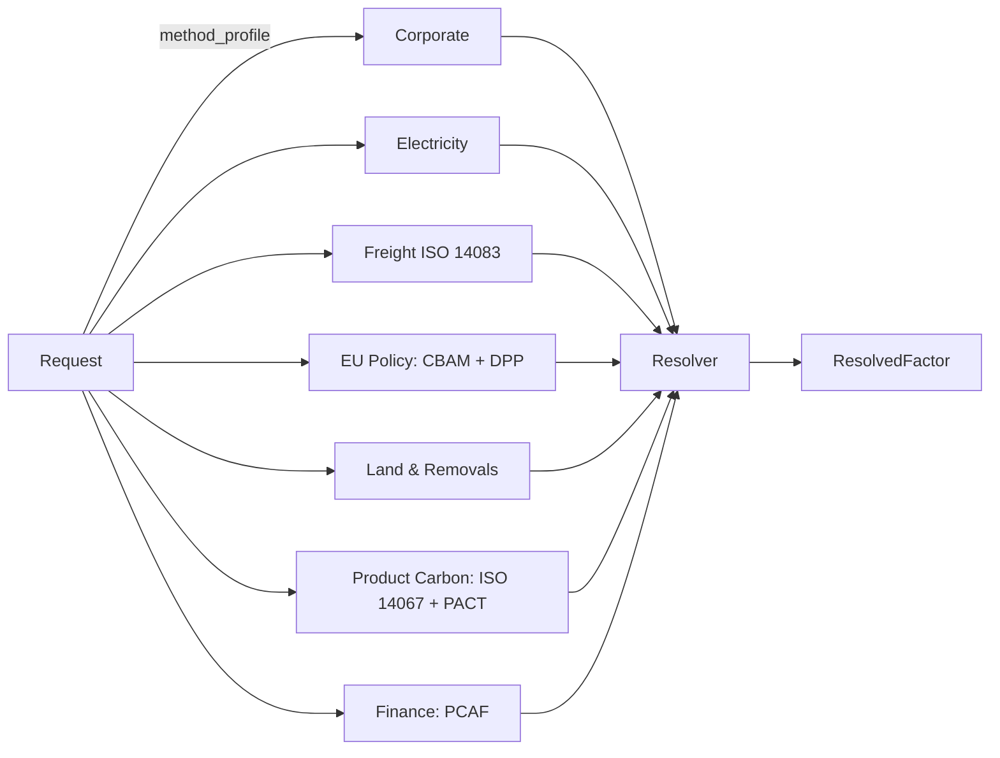

# GreenLang Factors — CTO Architecture Deck

**Audience:** Engineering leads, prospective enterprise buyers, platform partners, third-party assurance reviewers.
**Use:** Present from this file. Each section is one slide's worth of material; diagrams are ASCII / mermaid so the deck renders everywhere.

---

## 0. One-line definition

**GreenLang Factors = Factor Registry + Resolution Engine + Method Packs + Governance + API.**

A single, signed, reproducible surface for emission factors and climate reference data. Six non-negotiables: gas-vector storage, no overwrites, no hidden fallback, no mixed licensing in a response, no missing validity / source version, no raw factors without a method profile.

---

## 1. Pillar — Factor Registry

Canonical record schema `factor_record_v1.schema.json` (frozen 2026-04-22). Every row carries:

- Identity: `factor_id`, `factor_version` (semver), `status`.
- Provenance: `source_id`, `source_version`, `lineage.ingested_by`, `lineage.approved_by`, `lineage.raw_record_ref`.
- Math: `numerator` (CO2 / CH4 / N2O / F-gas vector; never only CO2e) + `denominator` + `gwp_set`.
- Jurisdiction: `country`, `region`, `grid_region`.
- Validity: `valid_from`, `valid_to`.
- Parameters: discriminated union by `factor_family` (combustion / electricity / transport / materials_products / refrigerants / land_removals / finance_proxies / waste).
- Quality: five 1-5 component scores → 0-100 composite FQS.
- Licensing: one of four redistribution classes (`open`, `licensed_embedded`, `customer_private`, `oem_redistributable`).
- Explainability: `assumptions[]`, `fallback_rank`, `rationale`.

```
+-----------------------+       +--------------------+
|   Raw ingestion       |       |   Canonical row    |
|   CSV / XLSX / PDF    |  -->  |  factor_record_v1  |
|   XML / JSON / API    |       |  (gas vector kept) |
+-----------------------+       +--------------------+
                                         |
                                         v
                                 +-------------------+
                                 |  Factor Catalog   |
                                 |  (PostgreSQL +    |
                                 |   pgvector for    |
                                 |   semantic index) |
                                 +-------------------+
```

Spec: [`docs/specs/factor_record_v1.md`](../specs/factor_record_v1.md).

---

## 2. Pillar — Resolution Engine

Seven-step cascade, evaluated in order. The resolver returns a structured `FactorCannotResolveSafelyError` if no tier satisfies the method pack's `SelectionRule` + `BoundaryRule`.

```
 tier 1   customer_override          (tenant overlay)
 tier 2   supplier_specific          (supplier contracted data)
 tier 3   facility_specific          (facility / site-level)
 tier 4   utility_or_grid_subregion  (eGRID subregion, ENTSOE zone)
 tier 5   country_or_sector_average  (DEFRA / CEA / DCCEEW)
 tier 6   method_pack_default        (IPCC Tier 1, PCAF proxy)
 tier 7   global_default             (rare; Certified packs refuse)
```

Every resolution returns:
- Chosen factor (id + version + `release_version` / edition).
- Alternates considered with scores.
- Full gas breakdown (CO2 / CH4 / N2O / HFC / PFC / SF6 / NF3 / biogenic) with the `gwp_basis` used.
- FQS + uncertainty.
- Assumptions + fallback rank.
- Audit-text narrative.
- Signed receipt.

Non-negotiable: fallback logic is never hidden — `/explain` exposes every tier considered.

Endpoint docs: [`docs/developer-portal/api-reference/resolve.md`](../developer-portal/api-reference/resolve.md), [`.../explain.md`](../developer-portal/api-reference/explain.md).

---

## 3. Pillar — Method Packs

Every resolution MUST bind a `method_profile`. Fourteen profiles across seven packs.



Pack controls: selection rules, boundary rules, gas-to-CO2e, biogenic treatment, market-instrument treatment, region hierarchy, fallback, reporting labels, audit-text template. Pack spec: [`docs/specs/method_pack_template.md`](../specs/method_pack_template.md).

Certified packs require `fallback.cannot_resolve_action = raise_no_safe_match` — no weak defaults in regulated flows.

---

## 4. Pillar — Governance

Three layers of machine-enforceable governance.

### 4.1 Editions

Immutable, signed catalog snapshots (`builtin-v<semver>`). Pinning an edition guarantees bit-identical resolution of the same request forever. Old editions retained for regulatory re-runs.

### 4.2 Signed receipts

Every response carries `signed_receipt = {receipt_id, signature, verification_key_hint, alg, payload_hash}`. Ed25519 default (public keys via JWKS); HMAC-SHA256 for private deployments. Offline verification via SDK or CLI. See [`docs/developer-portal/concepts/signed_receipt.md`](../developer-portal/concepts/signed_receipt.md).

### 4.3 Method review board

- Every method pack version reviewed by the methodology WG before promotion to `certified`.
- Audit-text templates carry frontmatter signoff (`approved: true` gates regulatory emission).
- Minimum 180-day deprecation window (365 for Corporate/Scope 2).
- 180-day review SLA per template.

Audit-text policy: [`docs/specs/audit_text_template_policy.md`](../specs/audit_text_template_policy.md).

---

## 5. Pillar — API

REST (OpenAPI 3.1 at [`docs/api/factors-v1.yaml`](../api/factors-v1.yaml)) + GraphQL + webhooks.

```
 client --> Kong Gateway --> Factors API
                               ├── /resolve  -> Resolution Engine
                               ├── /explain  -> Trace + audit text
                               ├── /search   -> Catalog query
                               ├── /sources  -> Source catalog
                               ├── /method-packs
                               ├── /editions + /bulk-export
                               ├── /batch-resolve
                               ├── /webhooks
                               ├── /graphql
                               └── /quality
```

Typed SDKs for Python and TypeScript; CLI (`gl-factors`) ships in the Python package.

CTO non-negotiables enforced at the API layer:
- `X-GreenLang-Edition` on every response.
- `signed_receipt` on every `/resolve` and `/explain`.
- 451 response when a caller's entitlement cannot reach a record's redistribution class.
- 422 `factor_cannot_resolve_safely` when the cascade exhausts without a safe match.

---

## 6. Pillar — Licensing

Four data classes and a **BYO-credentials carve-out** for commercial publishers that do not permit redistribution at v1 (ecoinvent, IEA, Electricity Maps, EC3, Green-e, GLEC, TCR).

```
 open                     licensed_embedded         customer_private        oem_redistributable
 |                        |                         |                       |
 community bulk            Premium pack              tenant only             OEM sub-tenants
 Certified export          API only                  zero cross-tenant       via upstream contract
 e.g. EPA, DESNZ, CEA     e.g. PCAF, PACT, GHG-P    tenant overlay factors  (post-contract)
                         (+ BYO for pre-contract)
```

Policy: [`docs/developer-portal/licensing.md`](../developer-portal/licensing.md). Legal: [`docs/legal/source_rights_matrix.md`](../legal/source_rights_matrix.md).

---

## 7. Stack summary (one slide)

```
+-------------------------------------------------------------+
|                      Developer Portal                        |
|    docs.greenlang.io    api.greenlang.io    app.greenlang.io |
+-------------------------------------------------------------+
|  Kong API Gateway  (JWT + OAuth2 + entitlements + rate limit)|
+-------------------------------------------------------------+
|  Factors API (FastAPI)     GraphQL     Webhooks     Admin    |
+-------------------------------------------------------------+
|  Resolution Engine (7-step cascade)                           |
|   - SelectionRule  - BoundaryRule  - FallbackLogic            |
+-------------------------------------------------------------+
|  Method Packs (14 profiles)     Audit Text Templates (Jinja)  |
+-------------------------------------------------------------+
|  Factor Catalog      |  Source Registry  |  Edition Store     |
|  PostgreSQL+pgvector |  YAML + per-row   |  S3 + Ed25519 sig |
+-------------------------------------------------------------+
|  Governance:  Methodology WG + Audit-text signoff + Legal     |
+-------------------------------------------------------------+
```

---

## 8. Canonical demo (the Definition of Done)

Per the CTO Master ToDo §30, the product is 100% complete when the canonical demo works:

```
Resolve factor for 12,500 kWh, India, FY2027,
corporate inventory, Scope 2, location-based.
```

Response must include: chosen factor, alternates considered, why it won, source + source version, factor version, method pack + version, validity window, gas breakdown, GWP basis, quality score, uncertainty, licensing class, assumptions, fallback rank, signed receipt.

Every field of this response maps to a pillar above. If any field is missing, Factors is not done.

Quickstart that runs this demo end-to-end: [`docs/developer-portal/quickstart.md`](../developer-portal/quickstart.md).

---

## Presenter notes

- For each pillar slide, have the demo URL + the example code snippet ready.
- Start with pillar 4 (Governance) for enterprise / auditor audiences — that is what earns trust.
- Start with pillar 5 (API) for developer audiences — that is what they integrate.
- Start with pillar 6 (Licensing) for legal / procurement audiences — that is what they evaluate.

---

## Related

- Methodology manual: [`methodology_manual.md`](methodology_manual.md).
- Engineering runbook: [`engineering_runbook.md`](engineering_runbook.md).
- Legal source binder: [`legal_source_rights_binder.md`](legal_source_rights_binder.md).
