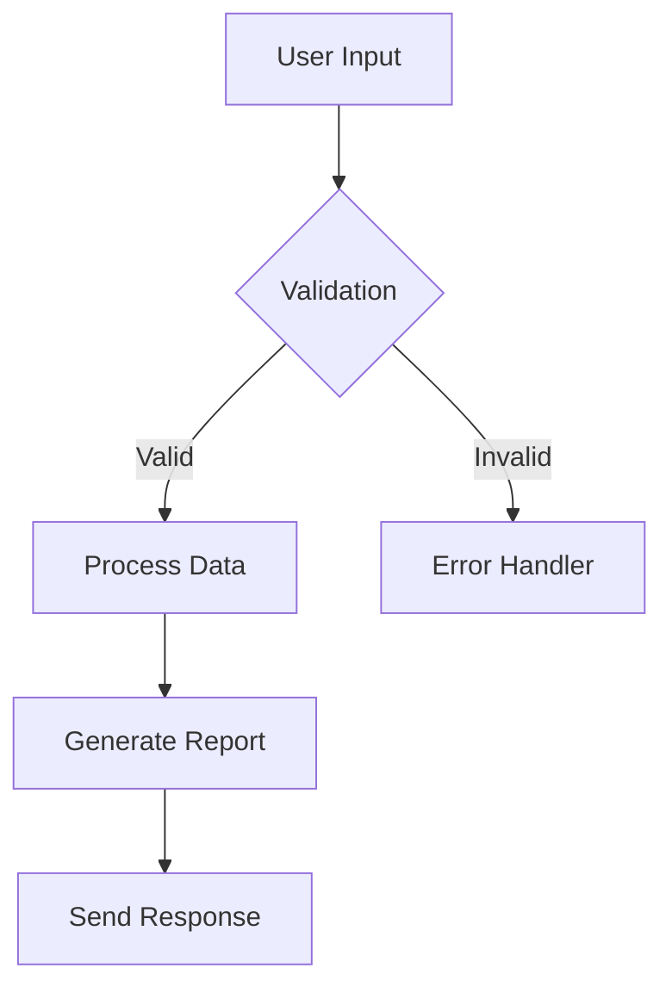

# GreenLang Documentation Tooling Setup

## Overview

This guide provides complete setup instructions for GreenLang's documentation infrastructure, including all tools, configurations, and workflows needed to create and maintain world-class technical documentation.

## Core Technology Stack

### Documentation Platform: Docusaurus 3.0

#### Installation
```bash
# Create documentation project
npx create-docusaurus@latest docs greenlang-docs classic --typescript

# Navigate to project
cd greenlang-docs

# Install additional dependencies
npm install @docusaurus/theme-mermaid
npm install @docusaurus/plugin-ideal-image
npm install @docusaurus/theme-live-codeblock
npm install docusaurus-plugin-sass
npm install @algolia/docsearch-react
```

#### Configuration (docusaurus.config.js)
```javascript
module.exports = {
  title: 'GreenLang Documentation',
  tagline: 'Sustainability Technology for Everyone',
  url: 'https://docs.greenlang.io',
  baseUrl: '/',
  favicon: 'img/favicon.ico',
  organizationName: 'greenlang',
  projectName: 'documentation',

  presets: [
    [
      'classic',
      {
        docs: {
          sidebarPath: require.resolve('./sidebars.js'),
          editUrl: 'https://github.com/greenlang/docs/tree/main/',
          showLastUpdateAuthor: true,
          showLastUpdateTime: true,
          versions: {
            current: {
              label: 'Next',
              path: 'next',
            },
          },
        },
        blog: {
          showReadingTime: true,
          editUrl: 'https://github.com/greenlang/docs/tree/main/',
        },
        theme: {
          customCss: require.resolve('./src/css/custom.css'),
        },
        gtag: {
          trackingID: 'G-XXXXXXXXXX',
          anonymizeIP: true,
        },
      },
    ],
  ],

  themes: [
    '@docusaurus/theme-mermaid',
    '@docusaurus/theme-live-codeblock',
  ],

  plugins: [
    'docusaurus-plugin-sass',
    [
      '@docusaurus/plugin-ideal-image',
      {
        quality: 70,
        max: 1030,
        min: 640,
        steps: 2,
        disableInDev: false,
      },
    ],
    [
      '@docusaurus/plugin-pwa',
      {
        debug: true,
        offlineModeActivationStrategies: [
          'appInstalled',
          'standalone',
          'queryString',
        ],
        pwaHead: [
          {
            tagName: 'link',
            rel: 'icon',
            href: '/img/logo.png',
          },
          {
            tagName: 'link',
            rel: 'manifest',
            href: '/manifest.json',
          },
        ],
      },
    ],
  ],

  themeConfig: {
    navbar: {
      title: 'GreenLang',
      logo: {
        alt: 'GreenLang Logo',
        src: 'img/logo.svg',
      },
      items: [
        {
          type: 'doc',
          docId: 'intro',
          position: 'left',
          label: 'Documentation',
        },
        {
          to: '/tutorials',
          label: 'Tutorials',
          position: 'left'
        },
        {
          to: '/api',
          label: 'API Reference',
          position: 'left'
        },
        {
          type: 'docsVersionDropdown',
          position: 'right',
        },
        {
          href: 'https://github.com/greenlang/greenlang',
          label: 'GitHub',
          position: 'right',
        },
      ],
    },
    footer: {
      style: 'dark',
      links: [
        {
          title: 'Docs',
          items: [
            {
              label: 'Getting Started',
              to: '/docs/intro',
            },
            {
              label: 'API Reference',
              to: '/api',
            },
          ],
        },
        {
          title: 'Community',
          items: [
            {
              label: 'Discord',
              href: 'https://discord.gg/greenlang',
            },
            {
              label: 'Twitter',
              href: 'https://twitter.com/greenlang',
            },
          ],
        },
      ],
      copyright: `Copyright © ${new Date().getFullYear()} GreenLang. Built with Docusaurus.`,
    },
    prism: {
      theme: lightCodeTheme,
      darkTheme: darkCodeTheme,
      additionalLanguages: ['python', 'bash', 'json', 'yaml'],
    },
    algolia: {
      appId: 'YOUR_APP_ID',
      apiKey: 'YOUR_API_KEY',
      indexName: 'greenlang',
      contextualSearch: true,
      searchParameters: {},
    },
  },

  markdown: {
    mermaid: true,
  },
};
```

### API Documentation: OpenAPI + Redoc

#### Setup OpenAPI Specification
```yaml
# openapi.yaml
openapi: 3.0.0
info:
  title: GreenLang API
  version: 2.0.0
  description: Complete API reference for GreenLang platform
  contact:
    email: api@greenlang.io
  license:
    name: Apache 2.0
    url: http://www.apache.org/licenses/LICENSE-2.0.html

servers:
  - url: https://api.greenlang.io/v2
    description: Production server
  - url: https://staging-api.greenlang.io/v2
    description: Staging server

paths:
  /agents:
    get:
      summary: List all agents
      operationId: listAgents
      tags:
        - Agents
      responses:
        '200':
          description: Successful response
          content:
            application/json:
              schema:
                type: array
                items:
                  $ref: '#/components/schemas/Agent'
```

#### Redoc Integration
```html
<!-- redoc.html -->
<!DOCTYPE html>
<html>
  <head>
    <title>GreenLang API Documentation</title>
    <meta charset="utf-8"/>
    <meta name="viewport" content="width=device-width, initial-scale=1">
    <link href="https://fonts.googleapis.com/css?family=Montserrat:300,400,700|Roboto:300,400,700" rel="stylesheet">
  </head>
  <body>
    <redoc spec-url='./openapi.yaml'></redoc>
    <script src="https://cdn.jsdelivr.net/npm/redoc@next/bundles/redoc.standalone.js"> </script>
  </body>
</html>
```

### Version Control: Git + GitHub

#### Repository Structure
```
greenlang-docs/
├── .github/
│   ├── workflows/
│   │   ├── build.yml
│   │   ├── deploy.yml
│   │   └── validate-links.yml
│   ├── ISSUE_TEMPLATE/
│   │   ├── documentation-bug.md
│   │   ├── documentation-request.md
│   │   └── typo.md
│   └── pull_request_template.md
├── docs/
│   ├── getting-started/
│   ├── tutorials/
│   ├── how-to/
│   ├── api/
│   ├── concepts/
│   └── reference/
├── static/
│   ├── img/
│   ├── videos/
│   └── downloads/
├── src/
│   ├── components/
│   ├── css/
│   └── pages/
├── docusaurus.config.js
├── package.json
└── README.md
```

#### GitHub Actions Workflow
```yaml
# .github/workflows/deploy.yml
name: Deploy Documentation

on:
  push:
    branches: [main]
  pull_request:
    branches: [main]

jobs:
  test:
    runs-on: ubuntu-latest
    steps:
      - uses: actions/checkout@v3
      - uses: actions/setup-node@v3
        with:
          node-version: 18
          cache: npm

      - name: Install dependencies
        run: npm ci

      - name: Test build
        run: npm run build

  deploy:
    if: github.event_name == 'push' && github.ref == 'refs/heads/main'
    runs-on: ubuntu-latest
    needs: test
    steps:
      - uses: actions/checkout@v3
      - uses: actions/setup-node@v3
        with:
          node-version: 18
          cache: npm

      - name: Install dependencies
        run: npm ci

      - name: Build website
        run: npm run build

      - name: Deploy to GitHub Pages
        uses: peaceiris/actions-gh-pages@v3
        with:
          github_token: ${{ secrets.GITHUB_TOKEN }}
          publish_dir: ./build
```

### Search: Algolia DocSearch

#### Application Setup
1. Apply at https://docsearch.algolia.com/apply
2. Configure crawler settings
3. Add API keys to Docusaurus config

#### Crawler Configuration
```json
{
  "index_name": "greenlang",
  "start_urls": [
    "https://docs.greenlang.io/"
  ],
  "sitemap_urls": [
    "https://docs.greenlang.io/sitemap.xml"
  ],
  "stop_urls": [],
  "selectors": {
    "text": ".theme-doc-markdown p, .theme-doc-markdown li",
    "lvl0": {
      "selector": ".menu__link--sublist.menu__link--active",
      "global": true,
      "default_value": "Documentation"
    },
    "lvl1": "header h1",
    "lvl2": "article h2",
    "lvl3": "article h3",
    "lvl4": "article h4",
    "lvl5": "article h5, article td:first-child",
    "lvl6": "article h6"
  }
}
```

### Content Management

#### Markdown Linting: markdownlint
```bash
# Install
npm install -g markdownlint-cli

# Configuration (.markdownlintrc)
{
  "MD013": false,
  "MD033": false,
  "MD041": false,
  "line-length": false,
  "no-inline-html": false,
  "first-line-heading": false
}

# Run linter
markdownlint docs/**/*.md
```

#### Vale for Style Checking
```bash
# Install
brew install vale  # macOS
# or
wget https://github.com/errata-ai/vale/releases/download/v2.20.0/vale_2.20.0_Linux_64-bit.tar.gz

# Configuration (.vale.ini)
StylesPath = .github/styles
MinAlertLevel = warning

Packages = Microsoft, proselint, write-good

[*]
BasedOnStyles = Vale, Microsoft, proselint, write-good
```

### Code Examples Management

#### CodeSandbox Integration
```javascript
// Component for embedded examples
import React from 'react';
import CodeSandbox from '@site/src/components/CodeSandbox';

export default function Example() {
  return (
    <CodeSandbox
      title="GreenLang Agent Example"
      src="https://codesandbox.io/embed/greenlang-agent-example"
      style={{ width: '100%', height: '500px' }}
    />
  );
}
```

#### Jupyter Notebook Integration
```bash
# Convert notebooks to markdown
jupyter nbconvert --to markdown notebook.ipynb

# Embed in documentation
:::note Interactive Notebook
View the [interactive version](https://colab.research.google.com/github/greenlang/notebooks/blob/main/example.ipynb) on Google Colab.
:::
```

### Diagramming Tools

#### Mermaid Diagrams
```markdown

```

#### PlantUML Integration
```bash
# Install PlantUML
npm install -g node-plantuml

# Generate diagrams
puml generate diagram.puml -o diagram.png
```

### Analytics and Monitoring

#### Google Analytics 4
```javascript
// Add to docusaurus.config.js
gtag: {
  trackingID: 'G-XXXXXXXXXX',
  anonymizeIP: true,
}
```

#### Hotjar Integration
```html
<!-- Add to custom HTML -->
<script>
  (function(h,o,t,j,a,r){
    h.hj=h.hj||function(){(h.hj.q=h.hj.q||[]).push(arguments)};
    h._hjSettings={hjid:XXXXXXX,hjsv:6};
    // Hotjar tracking code
  })(window,document,'https://static.hotjar.com/c/hotjar-','.js?sv=');
</script>
```

### Localization Tools

#### Crowdin Integration
```yaml
# crowdin.yml
project_id: "greenlang-docs"
api_token: "${CROWDIN_TOKEN}"
base_path: "."
base_url: "https://api.crowdin.com"

preserve_hierarchy: true

files:
  - source: /docs/**/*.md
    translation: /i18n/%locale%/docs/**/%original_file_name%
    update_option: update_as_unapproved
```

#### i18n Configuration
```javascript
// docusaurus.config.js
i18n: {
  defaultLocale: 'en',
  locales: ['en', 'es', 'fr', 'de', 'zh', 'ja'],
  localeConfigs: {
    en: {
      htmlLang: 'en-US',
      label: 'English',
    },
    es: {
      htmlLang: 'es-ES',
      label: 'Español',
    },
    // ... other locales
  },
}
```

### Development Environment

#### VS Code Extensions
```json
// .vscode/extensions.json
{
  "recommendations": [
    "yzhang.markdown-all-in-one",
    "davidanson.vscode-markdownlint",
    "streetsidesoftware.code-spell-checker",
    "bierner.markdown-mermaid",
    "jebbs.plantuml",
    "redhat.vscode-yaml",
    "esbenp.prettier-vscode",
    "dbaeumer.vscode-eslint",
    "github.copilot"
  ]
}
```

#### VS Code Settings
```json
// .vscode/settings.json
{
  "editor.formatOnSave": true,
  "editor.codeActionsOnSave": {
    "source.fixAll.markdownlint": true
  },
  "markdown.extension.toc.levels": "2..6",
  "markdown.extension.preview.autoShowPreviewToSide": true,
  "[markdown]": {
    "editor.defaultFormatter": "esbenp.prettier-vscode",
    "editor.wordWrap": "on",
    "editor.quickSuggestions": true,
    "editor.snippetSuggestions": "top"
  },
  "cSpell.words": [
    "GreenLang",
    "CSRD",
    "CBAM",
    "ESG"
  ]
}
```

### CI/CD Pipeline

#### Link Validation
```yaml
# .github/workflows/validate-links.yml
name: Check Links

on:
  schedule:
    - cron: '0 0 * * 0'  # Weekly on Sunday
  workflow_dispatch:

jobs:
  linkChecker:
    runs-on: ubuntu-latest
    steps:
      - uses: actions/checkout@v3

      - name: Link Checker
        uses: lycheeverse/lychee-action@v1
        with:
          args: --verbose --no-progress './docs/**/*.md'
        env:
          GITHUB_TOKEN: ${{ secrets.GITHUB_TOKEN }}
```

#### Spell Checking
```yaml
# .github/workflows/spellcheck.yml
name: Spell Check

on: [push, pull_request]

jobs:
  spellcheck:
    runs-on: ubuntu-latest
    steps:
      - uses: actions/checkout@v3

      - uses: streetsidesoftware/cspell-action@v2
        with:
          files: "**/*.md"
          config: ".cspell.json"
```

### Screenshot and Video Tools

#### Snagit Configuration
- Template: GreenLang Documentation
- Resolution: 1920x1080
- Format: PNG
- Naming: feature-name-step-number.png
- Annotations: Use brand colors

#### Loom Integration
```javascript
// Embed Loom videos
import LoomVideo from '@site/src/components/LoomVideo';

<LoomVideo id="abc123def456" />
```

### Performance Optimization

#### Image Optimization
```bash
# Install image optimization tools
npm install -g imagemin-cli imagemin-pngquant imagemin-mozjpeg

# Optimize images
imagemin static/img/*.{jpg,png} --out-dir=static/img/optimized
```

#### CDN Configuration (Cloudflare)
```javascript
// cloudflare-pages.config.js
module.exports = {
  buildCommand: "npm run build",
  buildDirectory: "build",
  envVariables: {
    NODE_VERSION: "18"
  },
  headers: {
    "/*": {
      "Cache-Control": "public, max-age=3600"
    },
    "/api/*": {
      "Cache-Control": "no-cache"
    }
  }
};
```

### Accessibility Testing

#### axe DevTools
```bash
# Install for CI/CD
npm install -D @axe-core/cli

# Run accessibility tests
axe https://docs.greenlang.io
```

#### Pa11y Configuration
```json
// .pa11yci.json
{
  "defaults": {
    "timeout": 30000,
    "wait": 500,
    "standard": "WCAG2AA"
  },
  "urls": [
    "https://docs.greenlang.io",
    "https://docs.greenlang.io/docs/intro",
    "https://docs.greenlang.io/api"
  ]
}
```

### Documentation Metrics

#### Custom Analytics Dashboard
```javascript
// analytics-config.js
export const metrics = {
  pageViews: {
    query: 'ga:pageviews',
    dimensions: 'ga:pagePath',
  },
  avgTimeOnPage: {
    query: 'ga:avgTimeOnPage',
    dimensions: 'ga:pagePath',
  },
  searchQueries: {
    query: 'ga:searchUniques',
    dimensions: 'ga:searchKeyword',
  },
  userFlow: {
    query: 'ga:users',
    dimensions: 'ga:landingPagePath,ga:exitPagePath',
  },
};
```

### Backup and Disaster Recovery

#### Automated Backups
```yaml
# .github/workflows/backup.yml
name: Backup Documentation

on:
  schedule:
    - cron: '0 2 * * *'  # Daily at 2 AM

jobs:
  backup:
    runs-on: ubuntu-latest
    steps:
      - uses: actions/checkout@v3

      - name: Create backup
        run: |
          tar -czf docs-backup-$(date +%Y%m%d).tar.gz docs/ static/

      - name: Upload to S3
        uses: jakejarvis/s3-sync-action@master
        with:
          args: --acl private
        env:
          AWS_S3_BUCKET: greenlang-docs-backup
          AWS_ACCESS_KEY_ID: ${{ secrets.AWS_ACCESS_KEY_ID }}
          AWS_SECRET_ACCESS_KEY: ${{ secrets.AWS_SECRET_ACCESS_KEY }}
```

## Deployment Commands

```bash
# Local development
npm start

# Build for production
npm run build

# Deploy to production
npm run deploy

# Run tests
npm test

# Check links
npm run check-links

# Validate markdown
npm run lint:md

# Generate API docs
npm run generate-api-docs

# Update search index
npm run update-search

# Create new version
npm run docusaurus docs:version 2.0
```

## Monitoring and Alerts

```yaml
# monitoring-config.yaml
alerts:
  - name: "Documentation Build Failed"
    condition: "build_status == 'failed'"
    notify: ["docs-team@greenlang.io"]

  - name: "Broken Links Detected"
    condition: "broken_links > 0"
    notify: ["docs-team@greenlang.io"]

  - name: "Search Index Outdated"
    condition: "last_index_update > 24h"
    notify: ["docs-team@greenlang.io"]

  - name: "High 404 Rate"
    condition: "404_rate > 5%"
    notify: ["docs-team@greenlang.io"]
```

## Team Collaboration Tools

### Slack Integration
```javascript
// slack-notifications.js
const { WebClient } = require('@slack/web-api');

const slack = new WebClient(process.env.SLACK_TOKEN);

async function notifyDocsUpdate(update) {
  await slack.chat.postMessage({
    channel: '#docs-updates',
    text: `Documentation updated: ${update.title}`,
    blocks: [
      {
        type: 'section',
        text: {
          type: 'mrkdwn',
          text: `*${update.title}*\n${update.description}\n<${update.url}|View changes>`
        }
      }
    ]
  });
}
```

### GitHub Integration
```yaml
# .github/CODEOWNERS
# Documentation owners
/docs/ @greenlang/docs-team
/docs/api/ @greenlang/api-team
/docs/tutorials/ @greenlang/education-team
/i18n/ @greenlang/localization-team
```

## Quality Assurance Checklist

### Pre-deployment
- [ ] All markdown files pass linting
- [ ] No broken internal links
- [ ] All code examples tested
- [ ] Images optimized and have alt text
- [ ] Search index updated
- [ ] Version numbers correct
- [ ] Navigation structure logical

### Post-deployment
- [ ] Site accessible and loads quickly
- [ ] Search functionality working
- [ ] Analytics tracking active
- [ ] No console errors
- [ ] Mobile responsive
- [ ] Accessibility score >90
- [ ] No 404 errors

## Maintenance Schedule

### Daily
- Monitor error logs
- Check for broken links
- Review user feedback

### Weekly
- Update documentation for new features
- Review and merge pull requests
- Update search index

### Monthly
- Full site audit
- Performance analysis
- SEO review
- Accessibility testing

### Quarterly
- Major version releases
- Infrastructure updates
- Tool evaluations
- Team training