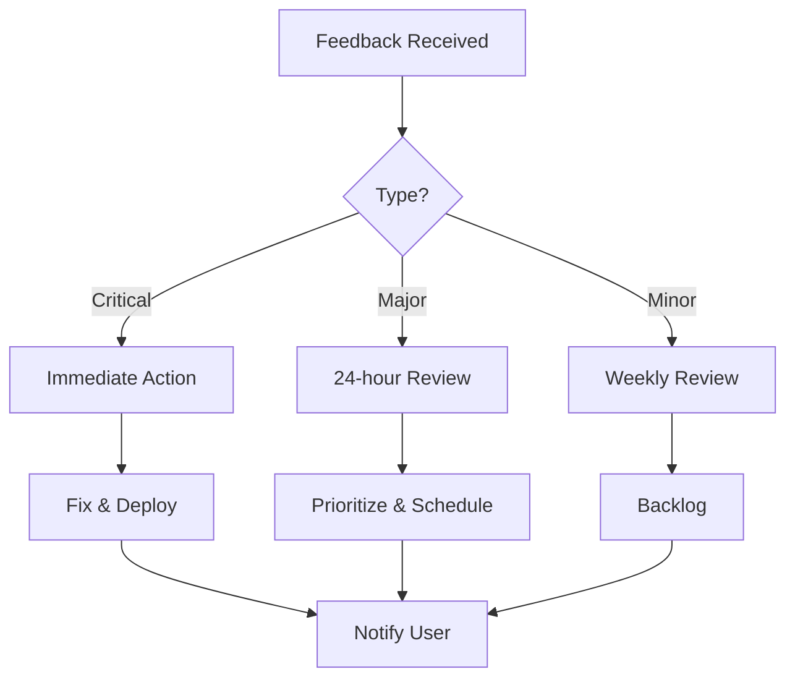

# GreenLang Documentation Quality Metrics & User Feedback System

## Quality Metrics Framework

### 1. Content Quality Metrics

#### Accuracy Metrics
- **Technical Accuracy Rate:** >99%
- **Code Example Success Rate:** >95%
- **API Endpoint Validity:** 100%
- **Link Validity:** >99%
- **Version Currency:** <7 days lag

**Measurement Methods:**
```javascript
// Automated accuracy checking
const accuracyCheck = {
  codeExamples: {
    automated_testing: true,
    success_threshold: 0.95,
    frequency: 'daily'
  },
  apiEndpoints: {
    validation_method: 'automated_curl',
    frequency: 'hourly',
    alert_on_failure: true
  },
  links: {
    checker: 'lychee',
    frequency: 'weekly',
    internal_links: true,
    external_links: true
  }
};
```

#### Completeness Metrics
- **API Coverage:** 100% of public APIs
- **Feature Documentation:** 100% within 48 hours
- **Code Examples:** Every concept
- **Use Cases:** 3+ per feature
- **Error Documentation:** All error codes

**Coverage Dashboard:**
```yaml
coverage_tracking:
  apis:
    total: 500
    documented: 495
    coverage: 99%
    missing:
      - /api/v2/experimental/*

  features:
    total: 150
    documented: 150
    coverage: 100%

  examples:
    concepts: 200
    with_examples: 198
    coverage: 99%
```

#### Clarity Metrics
- **Readability Score:** 60-70 (Flesch)
- **Average Sentence Length:** <20 words
- **Jargon Density:** <5%
- **Passive Voice:** <10%
- **Undefined Terms:** 0

**Readability Analysis:**
```python
from textstat import flesch_reading_ease, avg_sentence_length

def analyze_readability(content):
    return {
        'flesch_score': flesch_reading_ease(content),
        'avg_sentence': avg_sentence_length(content),
        'passive_voice_pct': count_passive_voice(content),
        'jargon_density': calculate_jargon_density(content)
    }
```

### 2. User Engagement Metrics

#### Page-Level Metrics
```javascript
const pageMetrics = {
  views: {
    daily_average: 1000,
    monthly_total: 30000,
    unique_visitors: 15000
  },
  engagement: {
    avg_time_on_page: '3:45',
    scroll_depth: 75,
    bounce_rate: 25,
    exit_rate: 30
  },
  interactions: {
    copy_code_clicks: 500,
    feedback_submissions: 50,
    comments: 25,
    shares: 100
  }
};
```

#### Search Metrics
- **Search Success Rate:** >80%
- **No Results Rate:** <5%
- **Search Refinement Rate:** <20%
- **Click-Through Rate:** >60%
- **Time to Result:** <2 seconds

**Search Analytics Dashboard:**
```sql
-- Top failed searches
SELECT
  search_query,
  COUNT(*) as search_count,
  AVG(results_clicked) as clicks
FROM search_logs
WHERE results_count = 0
GROUP BY search_query
ORDER BY search_count DESC
LIMIT 50;
```

#### Navigation Metrics
- **Direct Navigation:** 40%
- **Search Navigation:** 30%
- **Browse Navigation:** 30%
- **Path Depth:** 3-5 pages
- **Return Visitor Rate:** >60%

### 3. User Satisfaction Metrics

#### Feedback Widget Implementation
```html
<!-- Embedded feedback widget -->
<div id="doc-feedback" class="feedback-widget">
  <h4>Was this helpful?</h4>
  <button onclick="submitFeedback('helpful')">👍 Yes</button>
  <button onclick="submitFeedback('not-helpful')">👎 No</button>
  <button onclick="showDetailedFeedback()">💬 Leave feedback</button>
</div>

<script>
function submitFeedback(type) {
  analytics.track('Documentation Feedback', {
    page: window.location.pathname,
    type: type,
    timestamp: new Date().toISOString()
  });
}

function showDetailedFeedback() {
  // Show detailed feedback form
  const modal = document.createElement('div');
  modal.innerHTML = `
    <form id="detailed-feedback">
      <h3>How can we improve this documentation?</h3>
      <label>
        <input type="radio" name="issue" value="unclear">
        Information is unclear
      </label>
      <label>
        <input type="radio" name="issue" value="incorrect">
        Information is incorrect
      </label>
      <label>
        <input type="radio" name="issue" value="incomplete">
        Information is incomplete
      </label>
      <label>
        <input type="radio" name="issue" value="outdated">
        Information is outdated
      </label>
      <textarea name="details" placeholder="Additional details..."></textarea>
      <button type="submit">Submit Feedback</button>
    </form>
  `;
  document.body.appendChild(modal);
}
</script>
```

#### CSAT (Customer Satisfaction Score)
- **Target:** >4.5/5.0
- **Measurement:** Monthly survey
- **Response Rate:** >20%
- **Trending:** Positive

**CSAT Survey Questions:**
1. How satisfied are you with our documentation? (1-5)
2. How easy was it to find what you needed? (1-5)
3. How clear were the explanations? (1-5)
4. How helpful were the code examples? (1-5)
5. How likely are you to recommend our docs? (NPS)

#### Net Promoter Score (NPS)
- **Target:** >50
- **Promoters:** >60%
- **Passives:** <30%
- **Detractors:** <10%

### 4. Performance Metrics

#### Page Load Performance
```javascript
const performanceTargets = {
  first_contentful_paint: '<1.5s',
  largest_contentful_paint: '<2.5s',
  time_to_interactive: '<3.5s',
  cumulative_layout_shift: '<0.1',
  first_input_delay: '<100ms',
  lighthouse_score: '>90'
};

// Monitor with Web Vitals
import {getLCP, getFID, getCLS} from 'web-vitals';

function sendToAnalytics({name, delta, value, id}) {
  ga('send', 'event', {
    eventCategory: 'Web Vitals',
    eventAction: name,
    eventValue: Math.round(name === 'CLS' ? value * 1000 : value),
    eventLabel: id,
    nonInteraction: true,
  });
}

getLCP(sendToAnalytics);
getFID(sendToAnalytics);
getCLS(sendToAnalytics);
```

#### Search Performance
- **Search Latency:** <500ms
- **Indexing Lag:** <1 hour
- **Autocomplete Speed:** <100ms
- **Result Relevance:** >90%

### 5. Content Freshness Metrics

#### Update Frequency
- **Average Page Age:** <90 days
- **Outdated Content:** <5%
- **Review Cycle:** 90 days
- **Update Response Time:** <48 hours

**Staleness Detection:**
```python
from datetime import datetime, timedelta

def check_content_freshness(pages):
    stale_pages = []
    for page in pages:
        last_updated = page['last_updated']
        days_old = (datetime.now() - last_updated).days

        if days_old > 90:
            stale_pages.append({
                'url': page['url'],
                'days_old': days_old,
                'priority': calculate_priority(page)
            })

    return sorted(stale_pages, key=lambda x: x['priority'])
```

## User Feedback System

### 1. Feedback Collection Channels

#### In-Documentation Feedback
```javascript
class DocFeedback {
  constructor() {
    this.feedbackTypes = [
      'helpful',
      'not-helpful',
      'unclear',
      'incorrect',
      'incomplete',
      'outdated'
    ];
  }

  collectFeedback(type, details = {}) {
    const feedback = {
      type: type,
      page: window.location.pathname,
      section: this.getCurrentSection(),
      timestamp: new Date().toISOString(),
      sessionId: this.getSessionId(),
      userId: this.getUserId(),
      details: details
    };

    this.sendToAPI(feedback);
    this.showThankYou();
  }

  async sendToAPI(feedback) {
    await fetch('/api/feedback', {
      method: 'POST',
      headers: {'Content-Type': 'application/json'},
      body: JSON.stringify(feedback)
    });
  }
}
```

#### GitHub Issues Integration
```yaml
# .github/ISSUE_TEMPLATE/doc-feedback.yml
name: Documentation Feedback
description: Report an issue with documentation
labels: ["documentation", "feedback"]
body:
  - type: input
    id: page
    attributes:
      label: Documentation Page
      description: URL of the documentation page
      placeholder: https://docs.greenlang.io/...
    validations:
      required: true

  - type: dropdown
    id: issue-type
    attributes:
      label: Issue Type
      options:
        - Information is incorrect
        - Information is unclear
        - Information is missing
        - Code example doesn't work
        - Broken link
        - Other
    validations:
      required: true

  - type: textarea
    id: description
    attributes:
      label: Description
      description: Describe the issue in detail
    validations:
      required: true
```

#### Community Forums
```javascript
// Forum integration for feedback
const forumIntegration = {
  category: 'documentation-feedback',
  autoTag: ['docs', 'feedback'],
  priorityMapping: {
    'critical': 'P1',
    'major': 'P2',
    'minor': 'P3'
  },
  responseTime: {
    'P1': '2 hours',
    'P2': '24 hours',
    'P3': '72 hours'
  }
};
```

#### Support Ticket Integration
```python
# Automatically create tickets for critical feedback
def process_feedback(feedback):
    if feedback['type'] in ['incorrect', 'broken']:
        ticket = {
            'title': f"Doc Issue: {feedback['page']}",
            'priority': 'high',
            'category': 'documentation',
            'description': feedback['details'],
            'assignee': get_doc_owner(feedback['page'])
        }
        create_support_ticket(ticket)
```

### 2. Feedback Processing Workflow

#### Triage Process


#### Response Templates
```javascript
const responseTemplates = {
  acknowledged: `
    Thank you for your feedback on {page}.
    We've received your report and will review it shortly.
    Ticket ID: {ticketId}
  `,

  investigating: `
    We're investigating the issue you reported on {page}.
    Expected resolution time: {eta}
  `,

  resolved: `
    The issue you reported on {page} has been resolved.
    View the updated documentation: {link}
    Thank you for helping us improve!
  `,

  wont_fix: `
    After review, we've decided not to make changes based on your feedback.
    Reason: {reason}
    If you have questions, please reply to this message.
  `
};
```

### 3. Analytics Dashboard

#### Real-Time Metrics Dashboard
```javascript
// Dashboard configuration
const dashboardConfig = {
  widgets: [
    {
      type: 'metric',
      title: 'Documentation CSAT',
      value: 4.7,
      change: '+0.2',
      period: 'last 30 days'
    },
    {
      type: 'chart',
      title: 'Page Views',
      data: pageViewsTimeSeries,
      period: 'last 90 days'
    },
    {
      type: 'table',
      title: 'Top Search Queries',
      data: topSearchQueries,
      limit: 20
    },
    {
      type: 'heatmap',
      title: 'Content Engagement',
      data: engagementHeatmap
    }
  ],

  updateFrequency: '5 minutes',
  dataSource: 'analytics_api',
  alerts: [
    {
      condition: 'csat < 4.0',
      action: 'email_team'
    },
    {
      condition: 'error_rate > 5%',
      action: 'page_oncall'
    }
  ]
};
```

#### Weekly Report Template
```markdown
# Documentation Weekly Report

## Week of {date}

### Key Metrics
- **Page Views:** {total_views} ({change}% from last week)
- **Unique Visitors:** {unique_visitors}
- **CSAT Score:** {csat}/5.0
- **NPS Score:** {nps}
- **Search Success Rate:** {search_success}%

### Top Content
1. {top_page_1} - {views_1} views
2. {top_page_2} - {views_2} views
3. {top_page_3} - {views_3} views

### Feedback Summary
- **Total Feedback:** {feedback_count}
- **Positive:** {positive}%
- **Issues Reported:** {issues}
- **Issues Resolved:** {resolved}

### Action Items
- [ ] Update {outdated_page_1}
- [ ] Fix broken links on {page_with_broken_links}
- [ ] Add examples to {page_needing_examples}
- [ ] Review {pending_feedback_count} pending feedback items

### Upcoming
- {upcoming_feature_1} documentation
- {upcoming_tutorial_1} tutorial
- {upcoming_video_1} video
```

### 4. Continuous Improvement Process

#### Monthly Review Meeting
```yaml
monthly_review:
  attendees:
    - Documentation Manager
    - Lead Writers
    - Product Manager
    - Engineering Lead
    - Customer Success Lead

  agenda:
    - Review metrics dashboard
    - Analyze user feedback trends
    - Identify improvement areas
    - Prioritize documentation updates
    - Plan upcoming content
    - Review resource allocation

  outputs:
    - Action items list
    - Updated roadmap
    - Metric targets adjustment
    - Process improvements
```

#### Quarterly Documentation Audit
```python
class DocumentationAudit:
    def __init__(self):
        self.audit_criteria = {
            'accuracy': self.check_accuracy,
            'completeness': self.check_completeness,
            'clarity': self.check_clarity,
            'freshness': self.check_freshness,
            'accessibility': self.check_accessibility,
            'seo': self.check_seo
        }

    def run_audit(self):
        results = {}
        for criterion, check_func in self.audit_criteria.items():
            results[criterion] = check_func()

        return self.generate_report(results)

    def generate_report(self, results):
        return {
            'timestamp': datetime.now(),
            'overall_score': self.calculate_score(results),
            'details': results,
            'recommendations': self.generate_recommendations(results),
            'priority_fixes': self.identify_priorities(results)
        }
```

### 5. User Research Integration

#### User Interviews
```javascript
const userInterviewProtocol = {
  frequency: 'monthly',
  participants: 10,
  duration: '30 minutes',

  questions: [
    "How do you typically use our documentation?",
    "What's your biggest challenge with our docs?",
    "What's missing from our documentation?",
    "How do you prefer to learn new features?",
    "What other documentation do you find excellent?"
  ],

  analysisMethod: 'thematic_analysis',
  outputFormat: 'insights_report',
  actionableInsights: true
};
```

#### A/B Testing
```javascript
// A/B test different documentation formats
const abTest = {
  name: 'tutorial_format_test',
  variants: {
    A: 'step_by_step_text',
    B: 'video_with_transcript'
  },
  metrics: [
    'completion_rate',
    'time_to_complete',
    'satisfaction_score',
    'support_tickets'
  ],
  duration: '30 days',
  sample_size: 1000
};
```

### 6. Quality Assurance Automation

#### Automated Quality Checks
```yaml
# .github/workflows/doc-quality.yml
name: Documentation Quality Check

on:
  pull_request:
    paths:
      - 'docs/**'

jobs:
  quality:
    runs-on: ubuntu-latest
    steps:
      - uses: actions/checkout@v3

      - name: Check spelling
        uses: streetsidesoftware/cspell-action@v2

      - name: Check links
        uses: lycheeverse/lychee-action@v1

      - name: Check markdown
        uses: DavidAnson/markdownlint-cli2-action@v9

      - name: Check readability
        run: |
          npm install textstat
          node scripts/check-readability.js

      - name: Validate code examples
        run: |
          python scripts/test-code-examples.py

      - name: Check API accuracy
        run: |
          npm test -- --testPathPattern=api-docs
```

### 7. Feedback Loop Closure

#### User Notification System
```javascript
class FeedbackClosure {
  async notifyUserOfResolution(feedbackId) {
    const feedback = await this.getFeedback(feedbackId);
    const user = await this.getUser(feedback.userId);

    const notification = {
      to: user.email,
      subject: 'Your documentation feedback has been addressed',
      body: this.generateResolutionEmail(feedback),
      includeSurvey: true
    };

    await this.sendNotification(notification);
    await this.trackResolution(feedbackId);
  }

  generateResolutionEmail(feedback) {
    return `
      Hi ${feedback.userName},

      Thank you for your feedback about ${feedback.page}.

      We've updated the documentation based on your suggestion:
      ${feedback.resolution}

      View the updated documentation: ${feedback.updatedUrl}

      Was this helpful? [Yes] [No]

      Best regards,
      The GreenLang Documentation Team
    `;
  }
}
```

## Success Criteria

### Year 1 (2025)
- CSAT Score: >4.3/5.0
- NPS Score: >40
- Search Success: >75%
- Page Load: <2.5s
- Feedback Response: <48h

### Year 2 (2026)
- CSAT Score: >4.5/5.0
- NPS Score: >50
- Search Success: >80%
- Page Load: <2.0s
- Feedback Response: <24h

### Year 3+ (2027-2030)
- CSAT Score: >4.7/5.0
- NPS Score: >60
- Search Success: >85%
- Page Load: <1.5s
- Feedback Response: <12h

## Reporting Structure

### Daily Metrics
- Page views
- Search queries
- Feedback submissions
- Error rates
- Performance metrics

### Weekly Reports
- Engagement trends
- Top content
- Feedback summary
- Issues resolved
- Upcoming priorities

### Monthly Reports
- CSAT/NPS scores
- Comprehensive analytics
- User research insights
- Team performance
- Strategic recommendations

### Quarterly Business Reviews
- ROI analysis
- Success metrics
- Strategic alignment
- Resource planning
- Roadmap updates