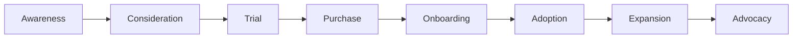

# GreenLang Hub Go-to-Market & Marketing Strategy (2025-2030)

**Version:** 1.0
**Date:** 2025-11-12
**Product Manager:** GL-ProductManager
**Status:** GTM Strategic Planning Document

---

## Executive Summary

This document outlines the comprehensive go-to-market and marketing strategy for GreenLang Hub, the world's premier marketplace for sustainability compliance agents. We'll position GreenLang Hub as the "npm of compliance" while building a $100M ecosystem revenue business by 2030.

**Strategic Positioning:** "Deploy compliance in minutes, not months"

---

## 1. Market Analysis & Competitive Positioning

### 1.1 Total Addressable Market (TAM)

```python
market_sizing = {
    "compliance_software_market": {
        "2027": "15B",   # $15 billion
        "2030": "30B",   # $30 billion
        "cagr": "20%"
    },
    "greenlang_addressable_market": {
        "2027": "500M",   # Agent marketplace segment
        "2030": "2B",     # Growing with marketplace adoption
        "our_target": "5% market share = $100M by 2030"
    },
    "customer_segments": {
        "enterprise": {
            "market_size": "10B",
            "greenlang_share": "60M",
            "avg_deal_size": "100K-500K"
        },
        "mid_market": {
            "market_size": "3B",
            "greenlang_share": "30M",
            "avg_deal_size": "10K-100K"
        },
        "smb_developer": {
            "market_size": "2B",
            "greenlang_share": "10M",
            "avg_deal_size": "100-10K"
        }
    }
}
```

### 1.2 Competitive Landscape

```markdown
# Competitive Analysis Matrix

## Direct Competitors (Agent Marketplaces)

### LangChain Hub
**Strengths:**
- First mover in AI agent marketplace
- Strong developer community (50K+ GitHub stars)
- Backed by Sequoia Capital
- Comprehensive documentation

**Weaknesses:**
- Generic (not industry-specific)
- No compliance guarantees
- Limited enterprise features
- Weak monetization model

**GreenLang Advantage:**
- Compliance-specific with guarantees
- Built for enterprise from day one
- Regulatory expertise
- Higher barriers to entry

### Hugging Face Hub
**Strengths:**
- Massive ML model marketplace
- 500K+ models
- Strong community (1M+ users)
- Open source friendly

**Weaknesses:**
- ML models, not agents
- No compliance focus
- Complex for non-technical users
- No SLAs or guarantees

**GreenLang Advantage:**
- Purpose-built for compliance workflows
- Business-ready agents
- Enterprise SLAs
- Regulatory focus

## Indirect Competitors (Compliance Platforms)

### Workiva, OneTrust, Diligent
**Strengths:**
- Established enterprise relationships
- Comprehensive compliance suites
- Professional services teams
- Trusted brands

**Weaknesses:**
- Monolithic platforms
- Expensive ($500K+ annually)
- Slow to innovate
- Not developer-friendly

**GreenLang Advantage:**
- Modular, pay-as-you-grow
- 10x faster implementation
- Developer-first
- Modern tech stack

### Consulting Firms (Deloitte, KPMG, PwC)
**Strengths:**
- Trusted advisors
- Deep regulatory expertise
- Global reach
- C-suite relationships

**Weaknesses:**
- Labor-intensive ($500-2000/hour)
- Slow (6-18 month projects)
- Not scalable
- Knowledge doesn't transfer

**GreenLang Advantage:**
- Automated (minutes vs. months)
- 100x cost reduction
- Reproducible knowledge
- Continuous updates

## Build-It-Yourself
**Why Companies Build:**
- Custom requirements
- Data sensitivity
- Legacy system integration
- Control and ownership

**Why They'll Choose GreenLang:**
- 80% faster time-to-market
- Lower TCO (5-year basis)
- Compliance guarantees
- Continuous regulatory updates
- Focus on core business
```

### 1.3 Unique Value Propositions

```markdown
# GreenLang Hub Unique Value Props

## For Developers
1. **Speed:** Deploy compliance agents in <60 seconds
2. **Choice:** 5,000+ agents by 2028
3. **Quality:** All agents tested, certified, guaranteed
4. **Community:** Learn from 100K+ developers

## For Publishers
1. **Revenue:** Earn $100K+ annually with 70%+ revenue share
2. **Distribution:** Reach 10K+ enterprises instantly
3. **Support:** Marketing, technical, and sales enablement
4. **Certification:** Build credibility with badges

## For Enterprises
1. **Risk Mitigation:** Compliance guarantees up to $10M
2. **Speed:** 90% faster than consultants
3. **Cost:** 80% cheaper than building in-house
4. **Updates:** Automatic regulatory updates

## For Society
1. **Climate Action:** Accelerate global sustainability
2. **Transparency:** Open source foundations
3. **Accessibility:** Make compliance affordable for SMBs
4. **Innovation:** Democratize regulatory technology
```

---

## 2. Brand Positioning & Messaging

### 2.1 Brand Architecture

```
GreenLang (Parent Brand)
└── GreenLang Hub (Marketplace)
    ├── Community Hub (Free)
    ├── Premium Store (Paid)
    └── Enterprise (Custom)
```

### 2.2 Brand Positioning Statement

**For:** Sustainability-focused enterprises and developers
**Who:** Need to comply with evolving ESG regulations
**GreenLang Hub is:** The premier marketplace for compliance automation agents
**That:** Enables deployment in minutes instead of months
**Unlike:** Generic platforms and expensive consultants
**We:** Provide certified, guaranteed, continuously-updated compliance solutions

### 2.3 Messaging Framework

```markdown
# Messaging Hierarchy

## Primary Message (All Audiences)
"Deploy Compliance in Minutes, Not Months"

## Secondary Messages

### For Developers
"5,000+ Ready-to-Deploy Compliance Agents"
"From npm install to production in 60 seconds"

### For Enterprises
"Guaranteed Compliance with $10M Protection"
"80% Cost Reduction vs. Building In-House"

### For Publishers
"Earn $100K+ Selling Compliance Agents"
"70% Revenue Share, Instant Distribution"

## Supporting Messages

### Trust & Quality
- "All agents certified and guaranteed"
- "SOC 2 Type II compliant"
- "99.9% uptime SLA"

### Innovation & Speed
- "Continuous regulatory updates"
- "Deploy in <60 seconds"
- "API-first architecture"

### Community & Ecosystem
- "100K+ developer community by 2028"
- "500+ publishers by 2028"
- "Open source foundations"
```

### 2.4 Brand Voice & Tone

```markdown
# Brand Voice Guidelines

## Voice Characteristics

### Developer-Friendly
- Technical but accessible
- Use code examples liberally
- Avoid marketing jargon
- Show, don't just tell

### Confident but Humble
- We're experts, not know-it-alls
- Acknowledge when we're wrong
- Share failures and learnings
- Credit the community

### Sustainability-Driven
- Purpose beyond profit
- Optimistic about climate action
- Data-driven, not preachy
- Celebrate customer impact

### Fast & Efficient
- Concise copy (respect time)
- Clear CTAs
- No fluff or buzzwords
- Action-oriented

## Tone by Channel

| Channel | Tone | Example |
|---------|------|---------|
| Documentation | Instructional, precise | "Install the agent with: npm i @greenlang/csrd" |
| Blog | Educational, conversational | "Last week we shipped the CBAM calculator..." |
| Social Media | Casual, engaging | "Just hit 10K GitHub stars! Thanks devs 🎉" |
| Sales Materials | Professional, value-focused | "Reduce compliance costs by 80%" |
| Support | Empathetic, solution-oriented | "Let's get this fixed for you" |
```

---

## 3. Launch Strategy (Q3 2026)

### 3.1 Pre-Launch Phase (Q1-Q2 2026)

```markdown
# Pre-Launch Activities (6 months)

## Month 1-2: Foundation
- [ ] Finalize brand identity (logo, colors, voice)
- [ ] Build marketing website
- [ ] Create content library (10 blog posts, 5 videos)
- [ ] Set up analytics (Mixpanel, Amplitude)
- [ ] Launch developer preview program (50 developers)

## Month 3-4: Early Adopters
- [ ] Recruit 10 launch partners
- [ ] Build initial agent inventory (100 agents)
- [ ] Create documentation (API docs, guides)
- [ ] Develop case studies (3 early customers)
- [ ] Launch private beta waitlist

## Month 5-6: Launch Prep
- [ ] PR agency selection and briefing
- [ ] Product Hunt launch preparation
- [ ] Conference speaking slots secured (3+)
- [ ] Launch video production
- [ ] Press kit and media outreach
- [ ] Beta testing with 500 developers
```

### 3.2 Launch Week (Q3 2026)

```markdown
# Launch Week Timeline

## Monday: Soft Launch
- Launch to email list and existing customers
- Activate beta testers as advocates
- Monitor systems and fix bugs

## Tuesday: Developer Launch
- Product Hunt launch
- Hacker News post
- Dev.to and Reddit posts
- GitHub release announcement

## Wednesday: Press & Media
- Press release distribution
- Media interviews (TechCrunch, VentureBeat)
- Podcast appearances
- LinkedIn thought leadership

## Thursday: Community Focus
- Live AMA on Discord
- Twitter Spaces discussion
- YouTube live demo
- Blog post on company blog

## Friday: Partner Activation
- Partner co-marketing launches
- Customer case studies published
- Webinar with SAP/Oracle
- Celebration & retrospective
```

### 3.3 Launch Goals & Metrics

```python
launch_metrics = {
    "week_1": {
        "signups": 1000,
        "agent_installs": 5000,
        "github_stars": 1000,
        "press_mentions": 20,
        "product_hunt": "Top 5 Product of the Day"
    },
    "month_1": {
        "signups": 5000,
        "active_publishers": 50,
        "paying_customers": 100,
        "mrr": 10000,  # $10K
        "nps": 40
    },
    "quarter_1": {
        "signups": 20000,
        "active_publishers": 200,
        "paying_customers": 500,
        "mrr": 50000,  # $50K
        "community_discord": 5000
    }
}
```

---

## 4. Marketing Mix Strategy

### 4.1 Content Marketing (40% of Budget)

```markdown
# Content Marketing Strategy

## Content Pillars

### 1. Product Education (40%)
**Goal:** Teach developers how to use GreenLang Hub
**Formats:**
- Documentation and tutorials
- Video tutorials (YouTube)
- Interactive demos
- Webinars and workshops
**Cadence:** 2 pieces/week

### 2. Thought Leadership (30%)
**Goal:** Establish GreenLang as compliance experts
**Formats:**
- Executive blog posts
- Industry reports
- Whitepapers
- Conference talks
**Cadence:** 1 piece/week

### 3. Community Stories (20%)
**Goal:** Showcase publisher and customer success
**Formats:**
- Case studies
- Publisher spotlights
- Customer interviews
- Community highlights
**Cadence:** 1 piece/week

### 4. Product Updates (10%)
**Goal:** Keep community informed of changes
**Formats:**
- Release notes
- Product announcements
- Roadmap updates
- Behind-the-scenes
**Cadence:** Weekly

## Content Calendar Example (Weekly)

**Monday:** Blog post (product tutorial)
**Tuesday:** Video tutorial release
**Wednesday:** Community spotlight
**Thursday:** Twitter thread (tips/tricks)
**Friday:** Newsletter (weekly roundup)
```

#### Content Production Metrics

```python
content_metrics = {
    "blog": {
        "target_posts_per_month": 20,
        "target_traffic": "50K monthly visitors by 2027",
        "target_conversion": "5% to signup"
    },
    "video": {
        "youtube_videos_per_month": 8,
        "target_subscribers": "25K by 2027",
        "target_watch_time": "8 minutes average"
    },
    "documentation": {
        "guides": "100+ by launch",
        "api_references": "Complete OpenAPI spec",
        "satisfaction": "4.5+ stars"
    },
    "webinars": {
        "frequency": "Weekly",
        "attendance": "100-200 per session",
        "conversion": "10% to trial"
    }
}
```

### 4.2 Developer Relations (25% of Budget)

```markdown
# DevRel Programs

## 1. Conference Strategy (50+ Talks/Year)

### Target Conferences
**Tier 1 (Must Attend):**
- Web Summit (Nov, Lisbon)
- Google I/O (May, SF)
- Microsoft Build (May, Seattle)
- AWS re:Invent (Dec, Las Vegas)
- KubeCon (Mar/Oct, rotating)
- React Summit (Jun, Amsterdam)
- PyCon US (Apr, rotating)

**Tier 2 (Regional):**
- Nordic.js (Stockholm)
- JSConf EU (Berlin)
- DeveloperWeek (SF)
- DevOps Days (various)

**Tier 3 (Industry):**
- Climate Tech Summit
- Sustainability Week NYC
- ESG Summit Europe

### Speaking Topics
- "Building Compliance Agents with GCEL"
- "Zero-Hallucination Architecture"
- "From Zero to Production in 60 Seconds"
- "The State of Compliance Automation"

## 2. Meetup Program (10 Cities by 2027)

### City Strategy
**Phase 1 (2026):** London, Berlin, NYC
**Phase 2 (2027):** Paris, Amsterdam, SF, Singapore
**Phase 3 (2028+):** Toronto, Sydney, Tokyo

### Meetup Format
- Monthly (or bi-monthly)
- 2-hour evening event
- 1 featured talk + lightning talks
- Networking with food/drinks
- GreenLang sponsorship ($500-1000/event)

## 3. Online Community

### Discord Server
- Technical support channel
- Agent showcase
- Events and announcements
- Regional channels
- Target: 10K members by 2027

### Forum (Discourse)
- Long-form discussions
- Troubleshooting
- Feature requests
- Community knowledge base
- Target: 25K users by 2027

### Office Hours
- Weekly Zoom session
- Rotating topics
- Q&A with team
- Recorded and published
```

### 4.3 Paid Acquisition (20% of Budget)

```markdown
# Paid Marketing Strategy

## Google Ads ($50K/month by 2027)

### Search Campaigns
**Keywords:**
- "CSRD compliance software"
- "CBAM calculator"
- "sustainability reporting tool"
- "compliance automation"
- "ESG software"

**Landing Pages:**
- Regulation-specific (csrd, cbam, eudr)
- Use case specific (manufacturing, finance)
- Role-specific (developers, compliance officers)

**Metrics:**
- Target CPA: $100
- Target ROAS: 3:1
- Conversion rate: 5%

## LinkedIn Ads ($30K/month by 2027)

### Targeting
**Job Titles:**
- Chief Sustainability Officer
- Compliance Manager
- Head of ESG
- VP of Operations
- Software Engineer

**Companies:**
- 500-10,000 employees
- Manufacturing, Financial Services, Retail
- EU and US locations

**Ad Formats:**
- Sponsored content
- InMail campaigns
- Video ads
- Thought leadership ads

## Developer Platforms ($20K/month)

### Dev.to Sponsorship
- Promoted articles
- Newsletter sponsorship
- Display ads

### Stack Overflow
- Targeted display ads
- Sponsored tags (sustainability, compliance)

### GitHub Sponsors
- Repository sponsorship
- Banner ads
```

### 4.4 Partnerships & Co-Marketing (15% of Budget)

```markdown
# Partnership Marketing Strategy

## Technology Partners

### SAP Partnership
**Joint Activities:**
- Co-authored whitepapers
- Joint webinars (quarterly)
- SAP events (SAP Sapphire)
- SAP AppCenter listing
- Case study development

**Investment:** $50K/year

### Oracle Partnership
**Joint Activities:**
- Oracle Cloud Marketplace
- Joint customer events
- Technical integration guides
- Oracle OpenWorld presence

**Investment:** $50K/year

### Cloud Providers (AWS, Azure, GCP)
**Joint Activities:**
- Marketplace listings
- Joint reference architectures
- Startup credits programs
- Cloud events (re:Invent, etc.)

**Investment:** $30K/year each

## Industry Associations

### Partnerships
- World Business Council for Sustainable Development (WBCSD)
- CDP (formerly Carbon Disclosure Project)
- Global Reporting Initiative (GRI)
- Sustainability Accounting Standards Board (SASB)

**Benefits:**
- Credibility and trust
- Access to member networks
- Speaking opportunities
- Thought leadership

**Investment:** $10K-25K/year each
```

---

## 5. Sales Enablement Strategy

### 5.1 Sales Process & Methodology

```markdown
# GreenLang Hub Sales Playbook

## Sales Stages

### 1. Lead Generation
**Sources:**
- Inbound (website, content)
- Outbound (SDR team)
- Partner referrals
- Events and conferences

### 2. Qualification (BANT)
- **Budget:** $10K+ annual spend
- **Authority:** Decision maker or champion
- **Need:** Compliance requirements (CSRD, CBAM, etc.)
- **Timeline:** <6 months to decision

### 3. Discovery Call (45 min)
**Goals:**
- Understand compliance requirements
- Identify pain points (manual process, consultants)
- Assess technical capabilities
- Determine success criteria

### 4. Demo (60 min)
**Agenda:**
- Quick overview (10 min)
- Live demo of relevant agents (30 min)
- Q&A (15 min)
- Next steps (5 min)

### 5. Proof of Value (2 weeks)
**Activities:**
- Trial account setup
- Sample data processing
- Results comparison (vs. manual/consultant)
- Success meeting

### 6. Proposal & Negotiation (1-2 weeks)
**Deliverables:**
- Custom pricing proposal
- SOW for implementation
- Security and compliance docs
- References and case studies

### 7. Close & Onboarding (2-4 weeks)
**Activities:**
- Contract signing
- Kickoff call
- Technical onboarding
- Training sessions
- Success metrics definition
```

### 5.2 Sales Materials & Assets

```python
sales_assets = {
    "pitch_decks": [
        "Corporate overview (10 slides)",
        "Product deep-dive (20 slides)",
        "Security & compliance (15 slides)",
        "ROI calculator (Excel)",
        "Competitor comparison (1-pager)"
    ],
    "case_studies": [
        "Manufacturing company (CSRD)",
        "Financial services (TCFD)",
        "Retail chain (supply chain)",
        "Energy company (CBAM)"
    ],
    "one_pagers": [
        "Platform overview",
        "CSRD solution",
        "CBAM solution",
        "Enterprise features",
        "Security & compliance"
    ],
    "video_demos": [
        "2-minute overview",
        "5-minute product demo",
        "CSRD walkthrough (15 min)",
        "Customer testimonials"
    ],
    "technical_docs": [
        "Architecture whitepaper",
        "Integration guide",
        "API documentation",
        "Security questionnaire",
        "Compliance certifications"
    ]
}
```

### 5.3 Sales Compensation Plan

```python
sales_comp_plan = {
    "account_executive": {
        "base_salary": 120000,
        "variable": 120000,
        "ote": 240000,  # On-target earnings
        "quota": 1200000,  # $1.2M annually
        "commission_structure": {
            "0-80%_quota": "8% commission",
            "80-100%_quota": "10% commission",
            "100-120%_quota": "12% commission",
            "120%+_quota": "15% commission + accelerators"
        }
    },
    "enterprise_ae": {
        "base_salary": 150000,
        "variable": 150000,
        "ote": 300000,
        "quota": 2000000,  # $2M annually
        "commission_structure": "Same as above"
    },
    "sales_engineer": {
        "base_salary": 130000,
        "variable": 50000,
        "ote": 180000,
        "bonus_structure": "Team achievement + individual contribution"
    }
}
```

---

## 6. Customer Acquisition Strategy

### 6.1 Customer Segmentation

```markdown
# Target Customer Segments

## Segment 1: Enterprise (60% of Revenue)

**Profile:**
- 1,000-10,000+ employees
- $500M-10B annual revenue
- EU-based or EU operations
- Regulated industries (finance, manufacturing)

**Needs:**
- Multi-entity compliance
- Integration with SAP/Oracle
- Enterprise SLAs and support
- Compliance guarantees

**Buying Process:**
- 3-9 month sales cycle
- Multiple stakeholders (CSO, CTO, CFO, Legal)
- RFP process common
- Proof of value required

**GTM Motion:**
- Direct enterprise sales
- Account-based marketing
- Executive sponsorship
- Professional services

**Target:** 250 customers by 2030

## Segment 2: Mid-Market (30% of Revenue)

**Profile:**
- 200-1,000 employees
- $50M-500M annual revenue
- Growth-stage companies
- Tech-savvy

**Needs:**
- Quick implementation
- Self-service + support
- Scalable pricing
- Best practices guidance

**Buying Process:**
- 1-3 month sales cycle
- 1-3 decision makers
- Product-led with sales assist
- Trial to paid conversion

**GTM Motion:**
- Inside sales
- Product-led growth
- Webinars and content
- Community support

**Target:** 2,000 customers by 2030

## Segment 3: SMB/Developer (10% of Revenue)

**Profile:**
- <200 employees
- Startups and scale-ups
- Developer-led organizations
- Modern tech stack

**Needs:**
- Self-service
- Affordable pricing
- Great documentation
- Community support

**Buying Process:**
- <1 month
- Individual contributor decision
- Credit card purchase
- Try before buy

**GTM Motion:**
- Product-led growth
- Developer relations
- Content marketing
- Community support

**Target:** 10,000 customers by 2030
```

### 6.2 Customer Journey Mapping



#### Journey Stages Detail

```markdown
## Stage 1: Awareness
**Goal:** Introduce GreenLang Hub to target audience
**Channels:**
- Content marketing (blog, video)
- Social media
- Conferences
- PR and media

**Metrics:**
- Website traffic
- Social followers
- Brand searches

## Stage 2: Consideration
**Goal:** Educate on capabilities and value
**Channels:**
- Product demos
- Webinars
- Case studies
- Comparison content

**Metrics:**
- Demo requests
- Content downloads
- Trial signups

## Stage 3: Trial
**Goal:** Enable hands-on product experience
**Channels:**
- Self-service trial
- Guided POC
- Sales demos
- Technical workshops

**Metrics:**
- Trial activations
- API calls
- Agent installs

## Stage 4: Purchase
**Goal:** Convert trial to paid customer
**Channels:**
- Sales conversations
- Pricing discussions
- Contract negotiation
- Security reviews

**Metrics:**
- Win rate
- Sales cycle length
- Average deal size

## Stage 5: Onboarding
**Goal:** Successful product implementation
**Channels:**
- Onboarding calls
- Documentation
- Training sessions
- Success team

**Metrics:**
- Time to first value
- Setup completion
- Training attendance

## Stage 6: Adoption
**Goal:** Drive product usage and value
**Channels:**
- In-app guidance
- Email campaigns
- Success manager check-ins
- Community support

**Metrics:**
- DAU/MAU
- Feature adoption
- API usage

## Stage 7: Expansion
**Goal:** Grow account revenue
**Channels:**
- Upsell conversations
- New use case enablement
- Executive business reviews
- ROI reporting

**Metrics:**
- Net revenue retention
- Upsell rate
- Cross-sell rate

## Stage 8: Advocacy
**Goal:** Create promoters and references
**Channels:**
- Case study development
- Review requests
- Referral program
- User conference

**Metrics:**
- NPS score
- Reviews and ratings
- Referrals
- Testimonials
```

---

## 7. Channel Strategy

### 7.1 Direct Sales (70% of Revenue)

```markdown
# Direct Sales Strategy

## Enterprise Sales Team

### Structure (by 2027)
- 1 VP of Sales
- 3 Regional Directors (Americas, EMEA, APAC)
- 15 Enterprise AEs
- 7 Sales Engineers
- 3 Sales Ops

### Coverage Model
- Named accounts (Fortune 2000)
- Territory-based (by region/industry)
- Account-based selling
- Multi-threading strategy

### Sales Process
- Qualification → Discovery → Demo → POC → Proposal → Close
- Average deal size: $100K-500K
- Sales cycle: 3-9 months
- Close rate: 25-30%

## Inside Sales Team

### Structure (by 2027)
- 1 Director of Inside Sales
- 10 Inside Sales Reps
- 5 SDRs (outbound)

### Coverage Model
- Mid-market accounts ($50M-500M revenue)
- Inbound lead handling
- Upsell/cross-sell
- Volume-based approach

### Sales Process
- Faster cycle: 1-3 months
- Average deal size: $10K-100K
- Close rate: 30-40%
```

### 7.2 Channel Partners (20% of Revenue)

```markdown
# Channel Partner Strategy

## Partner Types

### 1. System Integrators (SIs)
**Target Partners:**
- Accenture
- Deloitte Digital
- Capgemini
- Cognizant

**Model:**
- Referral fee: 15%
- Implementation services
- Joint go-to-market
- Co-selling

### 2. Technology Partners
**Target Partners:**
- SAP
- Oracle
- Workday
- Salesforce

**Model:**
- OEM/reseller agreements
- Bundled offerings
- Marketplace listings
- Revenue share: 20%

### 3. Regional VARs (Value-Added Resellers)
**Target Partners:**
- 10-20 regional partners globally
- Local market expertise
- Implementation and support

**Model:**
- Reseller discount: 30%
- Deal registration
- MDF (Market Development Funds): $10K-50K/year

### 4. Compliance Consultants
**Target Partners:**
- ERM (Environmental Resources Management)
- Anthesis
- South Pole
- Ecometrica

**Model:**
- Referral program: 10%
- Preferred partner program
- Joint service offerings
```

### 7.3 Self-Service / PLG (10% of Revenue)

```markdown
# Product-Led Growth Strategy

## Free Tier
**Features:**
- Access to community agents
- 1,000 API calls/month
- Community support
- Basic documentation

**Goal:** Convert 5% to paid within 90 days

## Conversion Strategy

### In-Product Triggers
- Usage limits (API calls, agents)
- Feature gates (advanced analytics, SLAs)
- Time-based trial expiration
- Team collaboration features

### Email Nurture
- Day 1: Welcome email with quick start guide
- Day 3: Tutorial video series
- Day 7: Customer success story
- Day 14: Feature highlight (premium)
- Day 30: Upgrade offer (limited time discount)

### Upgrade Incentives
- Annual discount (2 months free)
- First month 50% off
- Team discounts
- Free onboarding ($2K value)

## Self-Service Purchase
- Credit card payment
- Instant activation
- Automated onboarding
- In-app support
```

---

## 8. Marketing Budget Allocation (5-Year: $15M)

```python
marketing_budget_by_year = {
    "2026": {
        "total": 500000,  # $500K
        "content_marketing": 200000,  # 40%
        "devrel": 125000,  # 25%
        "paid_acquisition": 100000,  # 20%
        "events": 50000,  # 10%
        "tools_and_ops": 25000  # 5%
    },
    "2027": {
        "total": 2000000,  # $2M
        "content_marketing": 800000,  # 40%
        "devrel": 500000,  # 25%
        "paid_acquisition": 400000,  # 20%
        "events": 200000,  # 10%
        "tools_and_ops": 100000  # 5%
    },
    "2028": {
        "total": 4000000,  # $4M
        "content_marketing": 1600000,
        "devrel": 1000000,
        "paid_acquisition": 800000,
        "events": 400000,
        "tools_and_ops": 200000
    },
    "2029": {
        "total": 5500000,  # $5.5M
        "content_marketing": 2200000,
        "devrel": 1375000,
        "paid_acquisition": 1100000,
        "events": 550000,
        "tools_and_ops": 275000
    },
    "2030": {
        "total": 7000000,  # $7M
        "content_marketing": 2800000,
        "devrel": 1750000,
        "paid_acquisition": 1400000,
        "events": 700000,
        "tools_and_ops": 350000
    }
}
```

### Budget Breakdown by Tactic

```markdown
# Marketing Budget Detail (2027 Example: $2M)

## Content Marketing ($800K)
- Blog and SEO: $200K
  - Writers (2 FTE): $120K
  - SEO tools: $30K
  - Content promotion: $50K

- Video Production: $250K
  - YouTube channel: $150K
  - Product videos: $100K

- Webinars: $100K
  - Platform (Zoom, ON24): $20K
  - Production: $50K
  - Promotion: $30K

- Thought Leadership: $150K
  - Research reports: $75K
  - Whitepapers: $50K
  - Executive ghostwriting: $25K

- Documentation: $100K
  - Technical writers (1 FTE): $80K
  - Tools (GitBook): $20K

## Developer Relations ($500K)
- Conferences: $200K
  - Sponsorships: $100K
  - Travel: $75K
  - Materials: $25K

- Meetups: $50K
  - Venue and catering: $30K
  - Swag: $20K

- Community Platform: $50K
  - Discord, Discourse licenses: $10K
  - Moderation: $40K

- Developer Grants: $200K
  - Grant pool: $150K
  - Program management: $50K

## Paid Acquisition ($400K)
- Google Ads: $200K
- LinkedIn Ads: $120K
- Developer Platforms: $80K

## Events ($200K)
- GreenLang Summit: $100K
- Trade shows: $50K
- Regional events: $50K

## Tools & Operations ($100K)
- Marketing automation (HubSpot): $30K
- Analytics (Mixpanel, Amplitude): $20K
- Design tools (Figma, Adobe): $10K
- PR agency: $30K
- Misc tools: $10K
```

---

## 9. Key Performance Indicators (KPIs)

### 9.1 Marketing KPIs Dashboard

```python
marketing_kpis_2027 = {
    "awareness": {
        "website_traffic": {
            "target": 500000,  # Monthly unique visitors
            "channels": {
                "organic": 60,  # %
                "direct": 20,
                "paid": 15,
                "referral": 5
            }
        },
        "brand_searches": {
            "target": 10000,  # Monthly
            "growth": "20% MoM"
        },
        "social_reach": {
            "twitter_followers": 25000,
            "linkedin_followers": 50000,
            "youtube_subscribers": 25000
        },
        "github_stars": 30000,
        "press_mentions": 100  # Annual
    },

    "engagement": {
        "blog_readership": 50000,  # Monthly
        "video_views": 100000,  # Monthly
        "webinar_attendance": 200,  # Per webinar
        "documentation_traffic": 100000,  # Monthly
        "community_discord": 10000,  # Members
        "forum_users": 25000
    },

    "demand_generation": {
        "mqls": 2000,  # Monthly qualified leads
        "sqls": 500,  # Sales qualified leads
        "demo_requests": 300,  # Monthly
        "trial_signups": 1000,  # Monthly
        "trial_to_paid": 0.05  # 5% conversion
    },

    "pipeline": {
        "pipeline_generated": 5000000,  # $5M monthly
        "pipeline_influenced": 10000000,  # $10M monthly
        "win_rate": 0.25,  # 25%
        "average_deal_size": 50000
    },

    "customer": {
        "cac": 850,  # Customer acquisition cost
        "ltv": 10000,  # Lifetime value
        "ltv_cac_ratio": 12,
        "payback_period_months": 6,
        "nps": 50
    }
}
```

### 9.2 Content Marketing Metrics

```python
content_metrics = {
    "seo": {
        "organic_keywords_ranking": 5000,
        "top_3_rankings": 500,
        "domain_authority": 60,
        "backlinks": 10000
    },
    "blog": {
        "posts_per_month": 20,
        "monthly_traffic": 50000,
        "average_time_on_page": "3 minutes",
        "conversion_rate": 0.05
    },
    "video": {
        "videos_per_month": 8,
        "monthly_views": 100000,
        "average_watch_time": "8 minutes",
        "subscriber_growth": "20% MoM"
    },
    "email": {
        "list_size": 50000,
        "open_rate": 0.25,
        "click_rate": 0.05,
        "unsubscribe_rate": 0.01
    }
}
```

---

## 10. International Expansion Marketing

### 10.1 Geographic Priority

```markdown
# Market Entry Strategy

## Phase 1: English-Speaking Markets (2026)
**Markets:** US, UK, Canada, Australia
**Rationale:** Language advantage, regulatory alignment
**Investment:** $500K
**Approach:** Central marketing team, localized content

## Phase 2: Western Europe (2027)
**Markets:** Germany, France, Netherlands, Nordics
**Rationale:** Strong sustainability focus, CSRD compliance
**Investment:** $1M
**Approach:** Regional marketing managers, translated content

## Phase 3: Asia-Pacific (2028)
**Markets:** Singapore, Japan, South Korea, Australia
**Rationale:** Growing sustainability regulations
**Investment:** $1.5M
**Approach:** Regional offices, local partnerships

## Phase 4: Latin America & MEA (2029-2030)
**Markets:** Brazil, Mexico, UAE, South Africa
**Rationale:** Emerging markets, global coverage
**Investment:** $2M
**Approach:** Partner-led, selective direct presence
```

### 10.2 Localization Strategy

```python
localization_by_market = {
    "tier_1_markets": {
        "languages": ["English"],
        "localization": {
            "website": "Full translation",
            "product_ui": "Full translation",
            "documentation": "Full translation",
            "support": "Native language",
            "content": "Original + translated",
            "events": "Local presence"
        }
    },
    "tier_2_markets": {
        "languages": ["German", "French", "Spanish", "Japanese"],
        "localization": {
            "website": "Full translation",
            "product_ui": "Full translation",
            "documentation": "Key pages translated",
            "support": "Business hours",
            "content": "Selected translation",
            "events": "Partner-led"
        }
    },
    "tier_3_markets": {
        "languages": ["Portuguese", "Dutch", "Italian", "Korean"],
        "localization": {
            "website": "Key pages translated",
            "product_ui": "English with translation option",
            "documentation": "English + community translations",
            "support": "Email only",
            "content": "English",
            "events": "Virtual only"
        }
    }
}
```

---

## 11. Measurement & Optimization

### 11.1 Marketing Attribution Model

```markdown
# Multi-Touch Attribution

## Model: W-Shaped Attribution

**Touch Points (100% credit distributed):**
- First touch: 30%
- Middle touches: 20% (distributed evenly)
- Opportunity creation: 30%
- Close/won: 20%

## Tracked Channels
- Organic search
- Paid search
- Social media
- Email marketing
- Events
- Referrals
- Direct
- Partner

## Implementation
- Tool: HubSpot + Custom data warehouse
- Reporting: Weekly dashboards
- Optimization: Monthly reviews
```

### 11.2 A/B Testing Program

```markdown
# Continuous Optimization Through Testing

## Website Tests (Ongoing)
- Homepage messaging
- CTA buttons and copy
- Pricing page layouts
- Demo form fields
- Nav structure

## Email Tests
- Subject lines
- Send times
- Content length
- CTA placement
- Personalization

## Landing Page Tests
- Headlines
- Images vs. videos
- Social proof
- Form length
- Trust signals

## Ad Tests
- Headlines and copy
- Images and creative
- Targeting parameters
- Bid strategies
- Landing page variants

## Testing Process
1. Hypothesis formation
2. Test design (sample size, duration)
3. Implementation
4. Monitoring
5. Analysis
6. Decision (roll out, kill, iterate)

## Success Criteria
- Statistical significance: 95%
- Minimum sample size: 1,000 per variant
- Test duration: 2+ weeks
- Lift required: >10% to implement
```

---

## 12. Competitive Response Playbook

### 12.1 Competitive Monitoring

```markdown
# Competitive Intelligence System

## What We Monitor
- Product releases and announcements
- Pricing changes
- Customer wins and losses
- Content and messaging
- Events and conferences
- Job postings (expansion signals)
- Financial performance (if public)

## Tools
- Crayon competitive intelligence
- Google Alerts
- SimilarWeb (traffic)
- G2, Capterra (reviews)
- LinkedIn Sales Navigator
- Twitter lists

## Frequency
- Daily: Social media, news
- Weekly: Website changes, content
- Monthly: Comprehensive review
- Quarterly: Deep analysis and strategy update
```

### 12.2 Battlecards

```markdown
# Competitive Battlecard Template

## Competitor: [Name]

### Overview
- Company size, funding, age
- Target market and positioning
- Key products and pricing

### Strengths
- What they do well
- Why customers choose them
- Competitive advantages

### Weaknesses
- Gaps in offering
- Customer complaints
- Strategic vulnerabilities

### How We Win
- Our key differentiators
- Messaging to use
- Proof points (case studies, features)
- Discovery questions to ask

### How We Lose
- When they're a better fit
- How to minimize/avoid
- What to watch for

### Recent Updates
- Latest product launches
- Pricing changes
- Customer wins/losses
```

---

## Conclusion

This comprehensive go-to-market and marketing strategy positions GreenLang Hub for explosive growth from $0 to $100M in ecosystem revenue by 2030. The multi-channel approach balances:

1. **Developer-First** - Community, content, and DevRel at the core
2. **Enterprise-Ready** - Direct sales and enterprise features
3. **Product-Led** - Self-service and PLG for scalability
4. **Partner-Powered** - Leverage ecosystem for reach

**Key Success Factors:**
- Strong brand positioning vs. alternatives
- Developer community of 100K+ by 2028
- Multi-channel acquisition strategy
- Continuous optimization and testing
- Global expansion with localization

**Next Steps:**
1. Approve marketing budget allocation
2. Hire VP of Marketing and Head of DevRel (Q1 2026)
3. Launch developer preview program (Q2 2026)
4. Execute launch week (Q3 2026)
5. Scale channels based on performance (2027+)

---

**Document Control:**
- Version: 1.0
- Last Updated: 2025-11-12
- Author: GL-ProductManager
- Review Cycle: Quarterly
- Next Review: Q1 2026