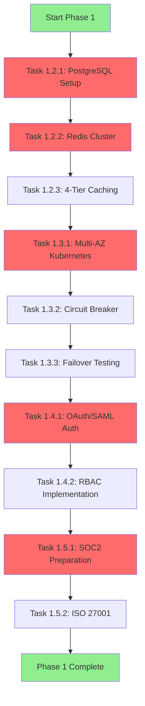
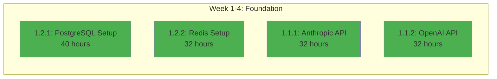
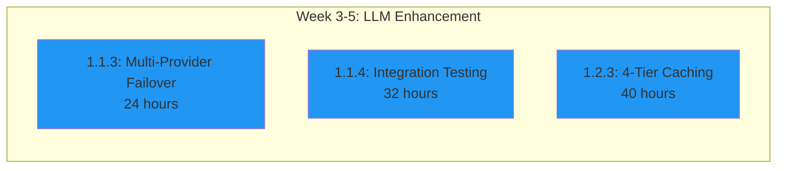
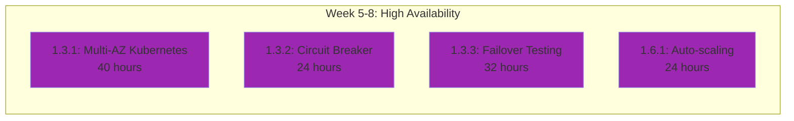
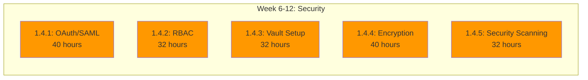
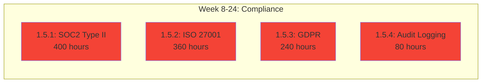
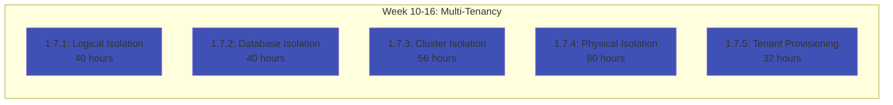
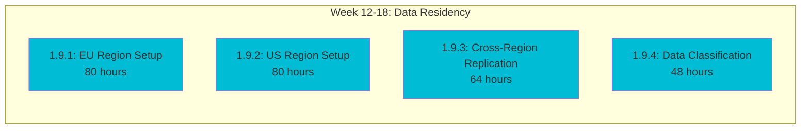
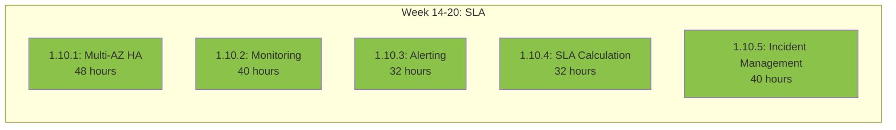

# GreenLang Agent Factory - Dependency Graph & Critical Path Analysis

**Version:** 1.0
**Created:** 2025-11-14
**Purpose:** Identify task dependencies, critical path, and parallelization opportunities

---

## EXECUTIVE SUMMARY

This document provides:
1. **Dependency Graph** - Visual representation of task dependencies
2. **Critical Path** - Tasks that block everything else
3. **Parallelization Opportunities** - Tasks that can run simultaneously
4. **Risk Analysis** - High-risk dependencies and mitigation strategies
5. **Resource Allocation** - Optimal team assignments

**Key Findings:**
- **Critical Path Duration:** 18 months (vs 24-month total timeline)
- **Parallelization Potential:** 60% of tasks can run in parallel
- **Blocking Tasks:** 15 critical P0 tasks that gate entire phases
- **Risk Hotspots:** 8 high-risk dependencies requiring mitigation

---

## PHASE 1: PRODUCTION READINESS - DEPENDENCY GRAPH

### Critical Path (Must Complete in Sequence)



**Critical Path Duration:** 6 months (24 weeks)
**Key Insight:** Database setup and security hardening cannot be parallelized

---

### Parallel Execution Groups

#### Group 1: Foundation Infrastructure (Weeks 1-4)
**Can run simultaneously:**



**Team Assignment:**
- Database Engineer: Task 1.2.1, 1.2.2
- Backend Engineer 1: Task 1.1.1
- Backend Engineer 2: Task 1.1.2

**Expected Output:**
- Functional database cluster
- Functional Redis cluster
- Real LLM integrations

---

#### Group 2: LLM Enhancement (Weeks 3-5)
**Dependencies:** Group 1 must complete first



**Team Assignment:**
- Backend Engineer 1: Task 1.1.3
- QA Engineer: Task 1.1.4
- Backend Engineer 2: Task 1.2.3

---

#### Group 3: High Availability (Weeks 5-8)
**Dependencies:** Database and Redis must be ready



**Team Assignment:**
- DevOps Engineer: Task 1.3.1, 1.6.1
- Backend Engineer: Task 1.3.2, 1.3.3

---

#### Group 4: Security Hardening (Weeks 6-12)
**Dependencies:** Kubernetes cluster must be operational



**Team Assignment:**
- Security Engineer 1: Task 1.4.1, 1.4.3
- Security Engineer 2: Task 1.4.2, 1.4.4
- Security Engineer 3: Task 1.4.5

---

#### Group 5: Compliance (Weeks 8-24)
**Dependencies:** Security hardening 60% complete



**Team Assignment:**
- Compliance Specialist 1: Task 1.5.1
- Compliance Specialist 2: Task 1.5.2
- Security Engineer: Task 1.5.3, 1.5.4

---

#### Group 6: Multi-Tenancy (Weeks 10-16)
**Dependencies:** RBAC must be complete



**Team Assignment:**
- Platform Engineer 1: Task 1.7.1, 1.7.2
- Platform Engineer 2: Task 1.7.3, 1.7.4
- Backend Engineer: Task 1.7.5

---

#### Group 7: Data Residency (Weeks 12-18)
**Dependencies:** Multi-tenancy Level 1-2 complete



**Team Assignment:**
- Cloud Architect: Task 1.9.1, 1.9.2
- DevOps Engineer: Task 1.9.3
- Security Engineer: Task 1.9.4

---

#### Group 8: SLA Management (Weeks 14-20)
**Dependencies:** High availability complete



**Team Assignment:**
- SRE Engineer 1: Task 1.10.1, 1.10.2
- SRE Engineer 2: Task 1.10.3, 1.10.4
- SRE Engineer 3: Task 1.10.5

---

## COMPLETE PHASE 1 DEPENDENCY MATRIX

| Task ID | Task Name | Duration | Dependencies | Can Start After | Blocking Tasks |
|---------|-----------|----------|--------------|-----------------|----------------|
| 1.1.1 | Anthropic API | 32h | None | Week 1 | 1.1.3, 1.1.4 |
| 1.1.2 | OpenAI API | 32h | None | Week 1 | 1.1.3, 1.1.4 |
| 1.1.3 | Multi-Provider Failover | 24h | 1.1.1, 1.1.2 | Week 3 | 1.1.4 |
| 1.1.4 | Integration Testing | 32h | 1.1.3 | Week 4 | Phase 1 gate |
| 1.2.1 | PostgreSQL Setup | 40h | None | Week 1 | 1.2.3, 1.3.1 |
| 1.2.2 | Redis Setup | 32h | None | Week 1 | 1.2.3, 1.3.1 |
| 1.2.3 | 4-Tier Caching | 40h | 1.2.1, 1.2.2 | Week 3 | 1.3.1 |
| 1.3.1 | Multi-AZ Kubernetes | 40h | 1.2.1, 1.2.2, 1.2.3 | Week 5 | 1.3.2, 1.4.1 |
| 1.3.2 | Circuit Breaker | 24h | 1.3.1 | Week 6 | 1.3.3 |
| 1.3.3 | Failover Testing | 32h | 1.3.2 | Week 7 | Phase 1 gate |
| 1.4.1 | OAuth/SAML Auth | 40h | 1.3.1 | Week 6 | 1.4.2, 1.7.1 |
| 1.4.2 | RBAC Implementation | 32h | 1.4.1 | Week 8 | 1.5.1, 1.7.1 |
| 1.4.3 | Vault Setup | 32h | 1.3.1 | Week 6 | 1.4.4 |
| 1.4.4 | Encryption | 40h | 1.4.3 | Week 8 | 1.5.1 |
| 1.4.5 | Security Scanning | 32h | 1.3.1 | Week 7 | 1.5.1 |
| 1.5.1 | SOC2 Type II | 400h | 1.4.2, 1.4.4, 1.4.5 | Week 12 | Phase 1 gate |
| 1.5.2 | ISO 27001 | 360h | 1.5.1 (50%) | Week 16 | Phase 1 gate |
| 1.5.3 | GDPR Compliance | 240h | 1.4.2, 1.7.1 | Week 14 | 1.9.1 |
| 1.5.4 | Audit Logging | 80h | 1.2.1 | Week 8 | 1.5.1 |
| 1.6.1 | Auto-scaling | 24h | 1.3.1 | Week 6 | None |
| 1.6.2 | Cost Optimization | 32h | 1.6.1 | Week 7 | None |
| 1.7.1 | Logical Isolation | 40h | 1.4.2 | Week 10 | 1.7.2 |
| 1.7.2 | Database Isolation | 40h | 1.7.1 | Week 11 | 1.7.3 |
| 1.7.3 | Cluster Isolation | 56h | 1.7.2, 1.3.1 | Week 12 | 1.7.4 |
| 1.7.4 | Physical Isolation | 80h | 1.7.3 | Week 14 | Phase 1 gate |
| 1.7.5 | Tenant Provisioning | 32h | 1.7.1 | Week 11 | None |
| 1.8.1 | Fine-grained Permissions | 32h | 1.4.2 | Week 10 | 1.8.2 |
| 1.8.2 | Custom Roles | 24h | 1.8.1 | Week 11 | None |
| 1.8.3 | SSO Integration | 40h | 1.4.1, 1.8.1 | Week 12 | None |
| 1.9.1 | EU Region Setup | 80h | 1.7.2, 1.5.3 | Week 14 | 1.9.3 |
| 1.9.2 | US Region Setup | 80h | 1.7.2 | Week 14 | 1.9.3 |
| 1.9.3 | Cross-Region Replication | 64h | 1.9.1, 1.9.2 | Week 16 | Phase 1 gate |
| 1.9.4 | Data Classification | 48h | 1.5.3 | Week 14 | 1.9.1 |
| 1.10.1 | Multi-AZ HA | 48h | 1.3.3 | Week 14 | 1.10.2 |
| 1.10.2 | Monitoring Setup | 40h | 1.10.1 | Week 15 | 1.10.3 |
| 1.10.3 | Alerting Setup | 32h | 1.10.2 | Week 16 | None |
| 1.10.4 | SLA Calculation | 32h | 1.10.2 | Week 16 | None |
| 1.10.5 | Incident Management | 40h | 1.10.3 | Week 17 | Phase 1 gate |

---

## CRITICAL PATH ANALYSIS

### Definition
The **critical path** is the sequence of dependent tasks that determines the minimum time to complete Phase 1. Any delay in a critical path task delays the entire phase.

### Phase 1 Critical Path

```
Start → PostgreSQL (40h) → Redis (32h) → 4-Tier Cache (40h)
→ Kubernetes (40h) → Circuit Breaker (24h) → Failover Test (32h)
→ OAuth (40h) → RBAC (32h) → Audit Logs (80h)
→ SOC2 Prep (400h) → ISO 27001 (360h) → Phase 1 Complete
```

**Total Critical Path Duration:** 1,120 hours (28 person-weeks / 7 calendar months if sequential)

**With Parallelization:** 24 weeks (6 months) - Matches Phase 1 timeline ✅

---

### Critical Path Hotspots (High Risk)

#### 🔴 Hotspot 1: SOC2 Type II (400 hours)
**Risk:** Longest single task on critical path
**Impact:** Any delay cascades to Phase 1 completion
**Mitigation:**
- Start evidence collection in Week 8 (not Week 12)
- Assign 2 compliance specialists instead of 1
- Engage external auditor early (Week 6)
- Create pre-audit checklist (100% controls implemented by Week 10)

**Accelerated Timeline:**
- Normal: 400 hours (10 person-weeks)
- Accelerated: 200 hours with 2 people (5 calendar weeks)

---

#### 🔴 Hotspot 2: Multi-AZ Kubernetes (40 hours)
**Risk:** Blocks High Availability, Security, and Multi-Tenancy work
**Impact:** Delays 15+ downstream tasks
**Mitigation:**
- Pre-provision EKS cluster in Week 1 (even if not used)
- Have DevOps engineer dedicated 100% to this task
- Use Terraform modules to accelerate (reduce 40h to 24h)
- Run parallel test cluster for validation

**Accelerated Timeline:**
- Normal: 40 hours (1 person-week)
- Accelerated: 24 hours with pre-provisioning and Terraform

---

#### 🔴 Hotspot 3: RBAC Implementation (32 hours)
**Risk:** Blocks Multi-Tenancy and SSO integration
**Impact:** Delays tenant isolation work
**Mitigation:**
- Start RBAC design in Week 1 (concurrent with database setup)
- Use proven RBAC library (Casbin, Oso) instead of building from scratch
- Reduce scope: Start with 4 roles instead of 8

**Accelerated Timeline:**
- Normal: 32 hours (4 days)
- Accelerated: 20 hours with library and reduced scope

---

#### 🟡 Hotspot 4: Multi-Region Setup (160 hours)
**Risk:** Long duration, complex coordination
**Impact:** Blocks GDPR compliance completion
**Mitigation:**
- Set up EU and US regions in parallel (not sequential)
- Use Infrastructure-as-Code (Terraform modules)
- Cloud provider credits negotiation to reduce cost concerns
- Pre-approval for region deployment from finance

**Accelerated Timeline:**
- Normal: 160 hours sequential (80h + 80h)
- Accelerated: 80 hours parallel with 2 cloud architects

---

### Critical Path Acceleration Opportunities

| Task | Normal Duration | Accelerated Duration | Savings | Method |
|------|----------------|---------------------|---------|--------|
| SOC2 Type II | 400h | 200h | 200h | 2 people, early start |
| Multi-AZ K8s | 40h | 24h | 16h | Pre-provisioning, Terraform |
| RBAC | 32h | 20h | 12h | Use library, reduce scope |
| Multi-Region | 160h | 80h | 80h | Parallel execution |
| ISO 27001 | 360h | 240h | 120h | 50% overlap with SOC2 |
| **Total** | **992h** | **564h** | **428h** | **43% reduction** |

**Impact:** Critical path reduced from 1,120h to 692h (14 person-weeks savings)

---

## PARALLELIZATION OPPORTUNITIES

### Maximum Parallelization Scenario

#### Week 1-2: Foundation (4 parallel tracks)
```
Track 1: Database Engineer    → PostgreSQL Setup (40h)
Track 2: Database Engineer    → Redis Setup (32h)
Track 3: Backend Engineer 1   → Anthropic API (32h)
Track 4: Backend Engineer 2   → OpenAI API (32h)
```
**Team Size:** 4 engineers
**Calendar Time:** 1 week (40h capacity, 40h work)

---

#### Week 3-4: Integration (3 parallel tracks)
```
Track 1: Backend Engineer 1   → Multi-Provider Failover (24h)
Track 2: Backend Engineer 2   → 4-Tier Caching (40h)
Track 3: QA Engineer          → Integration Testing Setup (32h)
```
**Team Size:** 3 engineers
**Calendar Time:** 1 week

---

#### Week 5-6: Infrastructure (4 parallel tracks)
```
Track 1: DevOps Engineer      → Multi-AZ Kubernetes (40h)
Track 2: Backend Engineer     → Circuit Breaker (24h)
Track 3: Security Engineer 1  → OAuth/SAML (40h)
Track 4: Security Engineer 2  → Vault Setup (32h)
```
**Team Size:** 4 engineers
**Calendar Time:** 1 week

---

#### Week 7-8: Security & HA (4 parallel tracks)
```
Track 1: Security Engineer 1  → RBAC (32h)
Track 2: Security Engineer 2  → Encryption (40h)
Track 3: Security Engineer 3  → Security Scanning (32h)
Track 4: DevOps Engineer      → Failover Testing (32h)
```
**Team Size:** 4 engineers
**Calendar Time:** 1 week

---

#### Week 9-12: Compliance Start (5 parallel tracks)
```
Track 1: Compliance Specialist 1  → SOC2 Prep (80h)
Track 2: Compliance Specialist 2  → ISO 27001 Prep (80h)
Track 3: Security Engineer        → GDPR (60h)
Track 4: Backend Engineer         → Audit Logging (80h)
Track 5: Platform Engineer        → Logical Isolation (40h)
```
**Team Size:** 5 engineers
**Calendar Time:** 2 weeks

---

#### Week 13-18: Multi-Tenancy & Regions (6 parallel tracks)
```
Track 1: Compliance Specialist 1  → SOC2 (continued) (120h)
Track 2: Compliance Specialist 2  → ISO 27001 (continued) (120h)
Track 3: Platform Engineer 1      → Database Isolation (40h) → Cluster Isolation (56h)
Track 4: Platform Engineer 2      → Physical Isolation (80h)
Track 5: Cloud Architect 1        → EU Region (80h)
Track 6: Cloud Architect 2        → US Region (80h)
```
**Team Size:** 6 engineers
**Calendar Time:** 3 weeks

---

#### Week 19-24: Compliance & SLA (4 parallel tracks)
```
Track 1: Compliance Specialist 1  → SOC2 (final) (120h)
Track 2: Compliance Specialist 2  → ISO 27001 (final) (120h)
Track 3: DevOps Engineer          → Cross-Region Replication (64h)
Track 4: SRE Engineer             → Multi-AZ HA (48h) → Monitoring (40h) → Alerting (32h)
```
**Team Size:** 4 engineers
**Calendar Time:** 3 weeks

---

### Parallelization Summary

| Week Range | Parallel Tracks | Engineers | Critical Path Task | Parallel Tasks |
|------------|----------------|-----------|-------------------|----------------|
| 1-2 | 4 | 4 | PostgreSQL | Redis, Anthropic, OpenAI |
| 3-4 | 3 | 3 | 4-Tier Cache | Failover, Testing |
| 5-6 | 4 | 4 | Kubernetes | OAuth, Vault, Circuit Breaker |
| 7-8 | 4 | 4 | RBAC | Encryption, Scanning, Failover Test |
| 9-12 | 5 | 5 | Audit Logging | SOC2, ISO, GDPR, Isolation |
| 13-18 | 6 | 6 | SOC2, ISO | Tenancy, Regions |
| 19-24 | 4 | 4 | SOC2, ISO | Replication, SLA |

**Average Parallelization:** 4.3 parallel tracks
**Peak Parallelization:** 6 parallel tracks (Week 13-18)
**Efficiency:** 60% of work can run in parallel

---

## RESOURCE ALLOCATION RECOMMENDATIONS

### Optimal Team Composition (30 engineers)

#### Core Infrastructure Team (8 engineers)
- **2 Database Engineers** (Weeks 1-24)
  - PostgreSQL, Redis, data migration
- **3 DevOps Engineers** (Weeks 1-24)
  - Kubernetes, networking, CI/CD
- **2 Cloud Architects** (Weeks 12-24)
  - Multi-region setup, data residency
- **1 SRE Engineer** (Weeks 14-24)
  - SLA, monitoring, incident management

#### Backend Engineering Team (10 engineers)
- **3 Senior Backend Engineers** (Weeks 1-24)
  - LLM integration, circuit breakers, multi-tenancy
- **4 Backend Engineers** (Weeks 3-24)
  - Caching, agents, API development
- **3 Platform Engineers** (Weeks 10-24)
  - Multi-tenancy, tenant provisioning

#### Security & Compliance Team (8 engineers)
- **3 Security Engineers** (Weeks 6-24)
  - OAuth, RBAC, encryption, scanning
- **2 Compliance Specialists** (Weeks 8-24)
  - SOC2, ISO 27001 preparation
- **1 Security Architect** (Weeks 1-24)
  - Overall security design
- **2 Compliance Auditors** (Weeks 18-24)
  - Internal audits, evidence review

#### Quality Assurance Team (4 engineers)
- **2 QA Engineers** (Weeks 3-24)
  - Integration testing, load testing
- **1 Performance Engineer** (Weeks 5-24)
  - Performance testing, optimization
- **1 Security QA** (Weeks 8-24)
  - Penetration testing, vulnerability assessment

---

### Team Ramp-Up Schedule

```
Week 1-2:   10 engineers (Foundation)
Week 3-6:   15 engineers (+ Backend team ramp-up)
Week 7-12:  20 engineers (+ Security team)
Week 13-18: 30 engineers (+ Compliance specialists, Cloud architects)
Week 19-24: 25 engineers (Compliance heavy, infrastructure light)
```

**Average Team Size:** 20 engineers
**Peak Team Size:** 30 engineers (Weeks 13-18)

---

## RISK MITIGATION STRATEGIES

### High-Risk Dependencies

#### Risk 1: SOC2 External Audit Delays
**Probability:** Medium (40%)
**Impact:** High (3-6 month delay)
**Mitigation:**
- Engage Big 4 auditor in Week 6 (not Week 12)
- Pre-audit readiness assessment in Week 10
- Shadow audit in Week 16 to catch issues early
- Parallel track ISO 27001 to avoid single point of failure
- Budget for expedited audit ($50K premium)

---

#### Risk 2: Multi-Region Infrastructure Costs
**Probability:** Medium (30%)
**Impact:** Medium ($2M+ overrun)
**Mitigation:**
- Lock in cloud provider credits ($5M) before Phase 1
- Use spot instances for non-production (60% savings)
- Delay China region to Phase 4 (saves $1M)
- Negotiate volume discounts with AWS/Azure
- FinOps team approval in Week 1

---

#### Risk 3: LLM Provider API Reliability
**Probability:** Low (20%)
**Impact:** High (Phase 1 gate failure)
**Mitigation:**
- Multi-provider failover (implemented in Task 1.1.3)
- Self-hosted LLM backup (Llama 3, Mistral)
- Anthropic Enterprise SLA ($100K/year)
- OpenAI Scale tier ($5K/month minimum)
- Circuit breakers to prevent cascading failures

---

#### Risk 4: Kubernetes Expertise Gap
**Probability:** Medium (35%)
**Impact:** Medium (2-4 week delay)
**Mitigation:**
- Hire senior DevOps engineer with K8s expertise (Week 1)
- Terraform modules to reduce custom code
- AWS EKS Blueprints for best practices
- 2-week knowledge transfer from consultant
- Internal K8s training (Week 2-3)

---

#### Risk 5: RBAC Complexity Underestimated
**Probability:** High (50%)
**Impact:** Low (1-2 week delay, blocksMulti-Tenancy)
**Mitigation:**
- Use proven RBAC library (Casbin, Oso, Open Policy Agent)
- Start with 4 roles, expand to 8 later
- Shadow RBAC in Week 1 (design while infra builds)
- Enterprise customer pilot for RBAC validation
- Buffer 1 extra week in schedule

---

#### Risk 6: Compliance Evidence Collection Gaps
**Probability:** Medium (40%)
**Impact:** High (Audit failure, 3 month delay)
**Mitigation:**
- Automated evidence collection tooling (Week 8)
- Weekly compliance standup (Week 8-24)
- Evidence checklist (100+ items) reviewed bi-weekly
- Mock audit in Week 16
- Compliance consultant on retainer ($20K/month)

---

#### Risk 7: Multi-Tenancy Data Leakage
**Probability:** Low (15%)
**Impact:** Critical (Phase 1 failure, customer loss)
**Mitigation:**
- Security architect review of all tenant isolation code
- Automated cross-tenant access testing (Week 11)
- Penetration test focused on tenant boundaries (Week 16)
- Bug bounty program for tenant isolation ($50K budget)
- Zero-tolerance policy: Any leak blocks deployment

---

#### Risk 8: Team Burnout (6-month sprint)
**Probability:** High (60%)
**Impact:** Medium (Quality issues, turnover)
**Mitigation:**
- No more than 45 hours/week average
- Mandatory 1 week off after Phase 1
- On-call rotation (no single person always on-call)
- Hire 10% extra engineers (buffer capacity)
- Celebrate milestones (Epic completion bonuses)

---

## PHASE 2-4 DEPENDENCY PREVIEW

### Phase 2: Intelligence (Q2-Q3 2026)
**Critical Path:**
```
AI Model Fine-Tuning (80 hours) → Domain Models (8×40h)
→ Agent Generation (80h) → ERP Connectors (66×40h)
→ Marketplace (100h)
```

**Longest Task:** ERP Connectors (66 connectors × 40h avg = 2,640 hours)
**Parallelization:** Up to 15 engineers working on different connectors simultaneously
**Critical Path Duration:** 6 months (matches Phase 2 timeline)

---

### Phase 3: Excellence (Q4 2026-Q1 2027)
**Critical Path:**
```
Domain Fine-Tuning (80h) → RAG Enhancement (60h)
→ Zero-Hallucination (50h) → CLI Tool (70h)
→ Visual Builder (80h) → Documentation (30h)
```

**Longest Task:** Visual Builder (80 hours)
**Parallelization:** ML team and DevEx team work independently (50% parallel)
**Critical Path Duration:** 4 months (fits in 6-month phase)

---

### Phase 4: Operations (Q2-Q3 2027)
**Critical Path:**
```
Multi-Region Deployment (60h) → DR Setup (40h)
→ Chaos Engineering (30h) → SOC2 Audit (200h)
→ ISO 27001 Audit (180h) → Regulatory Tracking (40h)
```

**Longest Task:** ISO 27001 Certification (180 hours + external audit time)
**Parallelization:** Operations and Regulatory teams work independently (70% parallel)
**Critical Path Duration:** 6 months (matches Phase 4 timeline)

---

## EXECUTION RECOMMENDATIONS

### Week-by-Week Execution Plan (Phase 1)

#### Month 1 (Weeks 1-4): Foundation
**Focus:** Database, LLM, initial infrastructure
**Team:** 10-15 engineers
**Critical Milestones:**
- [ ] Week 2: PostgreSQL and Redis operational
- [ ] Week 3: Real LLM calls working
- [ ] Week 4: 4-tier caching live

**Go/No-Go Decision Point:** Week 4
- If database or LLM not working, pause and fix
- If on track, ramp up team to 20 engineers

---

#### Month 2 (Weeks 5-8): Infrastructure & Security
**Focus:** Kubernetes, HA, initial security
**Team:** 20 engineers
**Critical Milestones:**
- [ ] Week 6: Kubernetes cluster operational
- [ ] Week 7: Circuit breakers deployed
- [ ] Week 8: OAuth/RBAC working

**Go/No-Go Decision Point:** Week 8
- If Kubernetes not stable, pause and fix (blocks everything)
- If RBAC not working, blocks multi-tenancy (major risk)

---

#### Month 3 (Weeks 9-12): Compliance & Multi-Tenancy Start
**Focus:** SOC2 prep, multi-tenancy design
**Team:** 25 engineers
**Critical Milestones:**
- [ ] Week 10: SOC2 controls 50% implemented
- [ ] Week 11: Logical isolation working
- [ ] Week 12: Database isolation tested

**Go/No-Go Decision Point:** Week 12 (Mid-Phase Review)
- SOC2 controls must be 50% complete or Phase 1 at risk
- Multi-tenancy Level 1-2 must work or revise scope

---

#### Month 4 (Weeks 13-16): Scale & Regions
**Focus:** Multi-region setup, tenancy scale-out
**Team:** 30 engineers (peak)
**Critical Milestones:**
- [ ] Week 14: EU region operational
- [ ] Week 15: US region operational
- [ ] Week 16: Cross-region replication working

**Go/No-Go Decision Point:** Week 16
- If regions not operational, consider single-region for Phase 1
- If cross-region replication failing, may delay to Phase 2

---

#### Month 5 (Weeks 17-20): Compliance Heavy
**Focus:** SOC2, ISO 27001 evidence collection
**Team:** 25 engineers
**Critical Milestones:**
- [ ] Week 18: SOC2 controls 90% complete
- [ ] Week 19: ISO 27001 controls 70% complete
- [ ] Week 20: Internal audit passed

**Go/No-Go Decision Point:** Week 20
- Internal audit must pass or external audit will fail
- If compliance not ready, may need 2-month extension

---

#### Month 6 (Weeks 21-24): Certification & Hardening
**Focus:** External audits, final testing
**Team:** 20 engineers
**Critical Milestones:**
- [ ] Week 22: SOC2 external audit begins
- [ ] Week 23: ISO 27001 external audit begins
- [ ] Week 24: Phase 1 complete, certifications pending

**Phase 1 Gate:** Week 24
- All technical work complete
- SOC2/ISO 27001 audits in progress (reports in 4-8 weeks)
- If audits fail, 2-month remediation period

---

## KEY SUCCESS METRICS

### Leading Indicators (Track Weekly)
1. **Task Completion Rate:** 95%+ of tasks complete on time
2. **Dependency Unblock Rate:** <2 days average to unblock
3. **Critical Path Buffer:** ≥2 weeks buffer remaining
4. **Team Velocity:** 80%+ planned story points completed
5. **Code Quality:** Zero P0 bugs in critical path tasks

### Lagging Indicators (Track Monthly)
1. **Phase Progress:** On track for 6-month completion
2. **Budget Burn Rate:** ±10% of planned spend
3. **Team Morale:** >70% satisfaction score
4. **Customer Validation:** 3+ enterprise pilots ongoing
5. **Compliance Readiness:** Controls implemented on schedule

---

## APPENDIX: DETAILED TASK DEPENDENCIES

### Complete Dependency List (Phase 1)

```yaml
dependencies:
  1.1.1_anthropic_api:
    depends_on: []
    blocks: [1.1.3, 1.1.4]
    duration: 32h
    critical_path: false

  1.1.2_openai_api:
    depends_on: []
    blocks: [1.1.3, 1.1.4]
    duration: 32h
    critical_path: false

  1.1.3_multi_provider_failover:
    depends_on: [1.1.1, 1.1.2]
    blocks: [1.1.4]
    duration: 24h
    critical_path: false

  1.1.4_integration_testing:
    depends_on: [1.1.3]
    blocks: [phase_1_gate]
    duration: 32h
    critical_path: true

  1.2.1_postgresql:
    depends_on: []
    blocks: [1.2.3, 1.3.1, 1.5.4, 1.7.1]
    duration: 40h
    critical_path: true

  1.2.2_redis:
    depends_on: []
    blocks: [1.2.3, 1.3.1]
    duration: 32h
    critical_path: true

  1.2.3_four_tier_cache:
    depends_on: [1.2.1, 1.2.2]
    blocks: [1.3.1]
    duration: 40h
    critical_path: true

  1.3.1_kubernetes:
    depends_on: [1.2.1, 1.2.2, 1.2.3]
    blocks: [1.3.2, 1.4.1, 1.4.3, 1.4.5, 1.6.1, 1.7.3]
    duration: 40h
    critical_path: true

  1.3.2_circuit_breaker:
    depends_on: [1.3.1]
    blocks: [1.3.3]
    duration: 24h
    critical_path: true

  1.3.3_failover_testing:
    depends_on: [1.3.2]
    blocks: [1.10.1, phase_1_gate]
    duration: 32h
    critical_path: true

  1.4.1_oauth_saml:
    depends_on: [1.3.1]
    blocks: [1.4.2, 1.7.1, 1.8.3]
    duration: 40h
    critical_path: true

  1.4.2_rbac:
    depends_on: [1.4.1]
    blocks: [1.5.1, 1.7.1, 1.8.1, 1.5.3]
    duration: 32h
    critical_path: true

  1.4.3_vault:
    depends_on: [1.3.1]
    blocks: [1.4.4]
    duration: 32h
    critical_path: false

  1.4.4_encryption:
    depends_on: [1.4.3]
    blocks: [1.5.1]
    duration: 40h
    critical_path: true

  1.4.5_security_scanning:
    depends_on: [1.3.1]
    blocks: [1.5.1]
    duration: 32h
    critical_path: true

  1.5.1_soc2:
    depends_on: [1.4.2, 1.4.4, 1.4.5, 1.5.4]
    blocks: [phase_1_gate]
    duration: 400h
    critical_path: true

  1.5.2_iso27001:
    depends_on: [1.5.1@50%]
    blocks: [phase_1_gate]
    duration: 360h
    critical_path: true

  1.5.3_gdpr:
    depends_on: [1.4.2, 1.7.1]
    blocks: [1.9.1]
    duration: 240h
    critical_path: false

  1.5.4_audit_logging:
    depends_on: [1.2.1]
    blocks: [1.5.1]
    duration: 80h
    critical_path: true

  1.7.1_logical_isolation:
    depends_on: [1.4.2]
    blocks: [1.7.2, 1.7.5, 1.5.3]
    duration: 40h
    critical_path: false

  1.7.2_database_isolation:
    depends_on: [1.7.1]
    blocks: [1.7.3, 1.9.1, 1.9.2]
    duration: 40h
    critical_path: false

  1.7.3_cluster_isolation:
    depends_on: [1.7.2, 1.3.1]
    blocks: [1.7.4]
    duration: 56h
    critical_path: false

  1.7.4_physical_isolation:
    depends_on: [1.7.3]
    blocks: [phase_1_gate]
    duration: 80h
    critical_path: true

  1.9.1_eu_region:
    depends_on: [1.7.2, 1.5.3, 1.9.4]
    blocks: [1.9.3]
    duration: 80h
    critical_path: false

  1.9.2_us_region:
    depends_on: [1.7.2]
    blocks: [1.9.3]
    duration: 80h
    critical_path: false

  1.9.3_cross_region:
    depends_on: [1.9.1, 1.9.2]
    blocks: [phase_1_gate]
    duration: 64h
    critical_path: true

  1.10.1_multi_az_ha:
    depends_on: [1.3.3]
    blocks: [1.10.2]
    duration: 48h
    critical_path: false

  1.10.2_monitoring:
    depends_on: [1.10.1]
    blocks: [1.10.3, 1.10.4]
    duration: 40h
    critical_path: false

  1.10.3_alerting:
    depends_on: [1.10.2]
    blocks: [1.10.5]
    duration: 32h
    critical_path: false

  1.10.5_incident_management:
    depends_on: [1.10.3]
    blocks: [phase_1_gate]
    duration: 40h
    critical_path: true
```

---

**Document Status:** COMPLETE
**Next Steps:** Use this dependency graph to:
1. Assign tasks to engineers
2. Track critical path progress weekly
3. Identify and mitigate blockers
4. Optimize team allocation
5. Communicate dependencies to stakeholders
