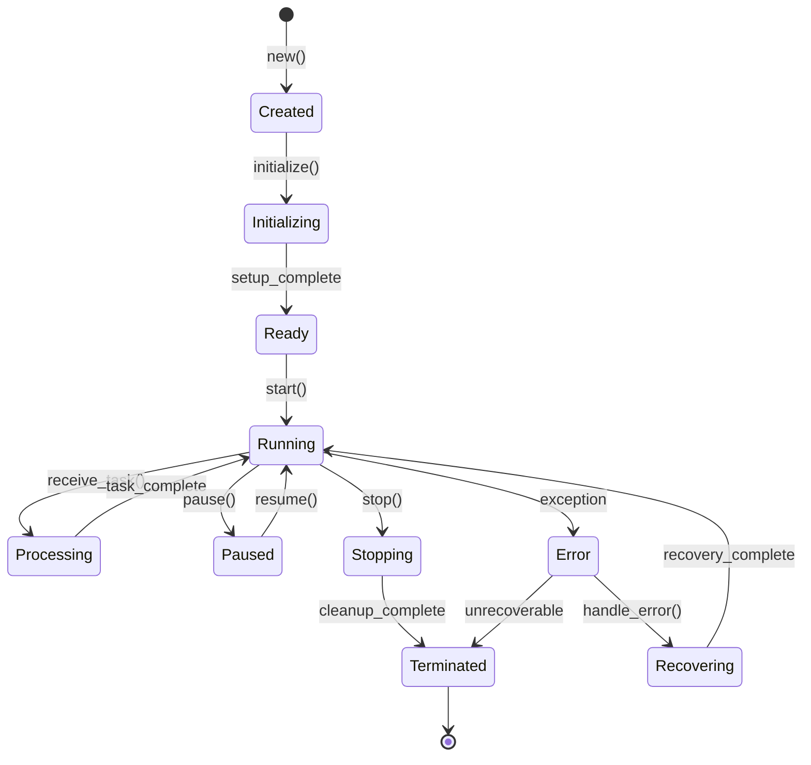

# Agent Development Guide

## Building Production-Ready AI Agents with GreenLang

This comprehensive guide covers everything you need to know about developing agents using the GreenLang Foundation, from basic concepts to advanced patterns.

---

## Table of Contents

1. [Understanding Agents](#understanding-agents)
2. [Agent Lifecycle](#agent-lifecycle)
3. [Creating Your First Agent](#creating-your-first-agent)
4. [Agent Types and Patterns](#agent-types-and-patterns)
5. [State Management](#state-management)
6. [Communication Patterns](#communication-patterns)
7. [Error Handling](#error-handling)
8. [Testing Agents](#testing-agents)
9. [Performance Optimization](#performance-optimization)
10. [Production Deployment](#production-deployment)

---

## Understanding Agents

### What is an Agent?

An agent in GreenLang is an autonomous software entity that:
- **Perceives** its environment through inputs
- **Reasons** about the information using AI/logic
- **Acts** to achieve specific goals
- **Learns** from experiences and feedback
- **Communicates** with other agents and systems

### Agent Anatomy

```python
class Agent:
    """Core components of every agent."""

    components = {
        'perception': 'Input processing and validation',
        'cognition': 'Reasoning and decision making',
        'memory': 'Information storage and retrieval',
        'action': 'Output generation and execution',
        'communication': 'Inter-agent messaging',
        'learning': 'Experience-based improvement'
    }
```

---

## Agent Lifecycle

### Lifecycle States



### Implementing Lifecycle Management

```python
from greenlang import BaseAgent, AgentState, AgentConfig
import asyncio

class LifecycleAgent(BaseAgent):
    """Agent with complete lifecycle management."""

    def __init__(self, config: AgentConfig):
        super().__init__(config)
        self.state = AgentState.CREATED
        self.tasks = []

    async def initialize(self):
        """Initialize agent resources."""
        self.state = AgentState.INITIALIZING

        try:
            # Setup resources
            await self.setup_memory()
            await self.setup_tools()
            await self.setup_communication()

            self.state = AgentState.READY
            self.logger.info(f"Agent {self.name} initialized successfully")

        except Exception as e:
            self.state = AgentState.ERROR
            self.logger.error(f"Initialization failed: {e}")
            raise

    async def start(self):
        """Start agent processing."""
        if self.state != AgentState.READY:
            raise RuntimeError(f"Cannot start from state {self.state}")

        self.state = AgentState.RUNNING
        self.logger.info(f"Agent {self.name} started")

        # Start processing loop
        asyncio.create_task(self.process_loop())

    async def process_loop(self):
        """Main processing loop."""
        while self.state == AgentState.RUNNING:
            try:
                # Process tasks
                task = await self.get_next_task()
                if task:
                    await self.process_task(task)

                await asyncio.sleep(0.1)  # Prevent busy waiting

            except Exception as e:
                await self.handle_error(e)

    async def pause(self):
        """Pause agent processing."""
        if self.state == AgentState.RUNNING:
            self.state = AgentState.PAUSED
            self.logger.info(f"Agent {self.name} paused")

    async def resume(self):
        """Resume agent processing."""
        if self.state == AgentState.PAUSED:
            self.state = AgentState.RUNNING
            self.logger.info(f"Agent {self.name} resumed")

    async def stop(self):
        """Stop agent gracefully."""
        self.state = AgentState.STOPPING

        # Wait for current tasks to complete
        await self.wait_for_tasks()

        # Cleanup resources
        await self.cleanup()

        self.state = AgentState.TERMINATED
        self.logger.info(f"Agent {self.name} stopped")

    async def cleanup(self):
        """Clean up resources."""
        await self.save_state()
        await self.close_connections()
        await self.flush_logs()
```

---

## Creating Your First Agent

### Basic Agent Template

```python
from greenlang import BaseAgent, AgentConfig
from typing import Dict, Any
import asyncio

class MyFirstAgent(BaseAgent):
    """A simple agent implementation."""

    def __init__(self, config: AgentConfig):
        super().__init__(config)
        self.setup()

    def setup(self):
        """Configure agent capabilities."""
        # Initialize components
        self.tools = self.load_tools()
        self.memory = self.initialize_memory()
        self.llm = self.setup_llm()

    async def process(self, input_data: Dict[str, Any]) -> Dict[str, Any]:
        """Main processing method."""

        # Step 1: Validate input
        validated = await self.validate_input(input_data)

        # Step 2: Retrieve context
        context = await self.get_context(validated)

        # Step 3: Perform reasoning
        decision = await self.reason(validated, context)

        # Step 4: Execute action
        result = await self.execute_action(decision)

        # Step 5: Store in memory
        await self.update_memory(result)

        return result

    async def validate_input(self, data: Dict[str, Any]) -> Dict[str, Any]:
        """Validate and sanitize input data."""
        # Implement validation logic
        required_fields = ['task', 'parameters']

        for field in required_fields:
            if field not in data:
                raise ValueError(f"Missing required field: {field}")

        return data

    async def get_context(self, data: Dict[str, Any]) -> Dict[str, Any]:
        """Retrieve relevant context from memory."""
        query = data.get('task')
        context = await self.memory.search(query, top_k=5)
        return {'previous_tasks': context}

    async def reason(self, data: Dict[str, Any], context: Dict[str, Any]) -> Dict[str, Any]:
        """Make decisions based on input and context."""
        prompt = self.build_prompt(data, context)
        response = await self.llm.generate(prompt)
        return self.parse_response(response)

    async def execute_action(self, decision: Dict[str, Any]) -> Dict[str, Any]:
        """Execute the decided action."""
        action_type = decision.get('action')

        if action_type == 'calculate':
            return await self.calculate(decision['parameters'])
        elif action_type == 'query':
            return await self.query_database(decision['parameters'])
        elif action_type == 'generate':
            return await self.generate_content(decision['parameters'])
        else:
            raise ValueError(f"Unknown action type: {action_type}")

    async def update_memory(self, result: Dict[str, Any]):
        """Store result in memory for future reference."""
        await self.memory.store(
            key=result.get('task_id'),
            value=result,
            metadata={'timestamp': self.current_timestamp()}
        )

# Usage example
async def main():
    config = AgentConfig(
        name="my-first-agent",
        version="1.0.0",
        capabilities=["reasoning", "calculation", "memory"]
    )

    agent = MyFirstAgent(config)
    await agent.initialize()

    result = await agent.process({
        'task': 'calculate_carbon_emissions',
        'parameters': {
            'activity': 'electricity',
            'amount': 1000,
            'unit': 'kWh'
        }
    })

    print(f"Result: {result}")

if __name__ == "__main__":
    asyncio.run(main())
```

---

## Agent Types and Patterns

### 1. Stateless Agents

```python
class StatelessAgent(BaseAgent):
    """Agent without persistent state between requests."""

    async def process(self, input_data: Dict[str, Any]) -> Dict[str, Any]:
        """Pure function processing."""
        # No state dependencies
        result = self.compute(input_data)
        return result

    def compute(self, data: Dict[str, Any]) -> Dict[str, Any]:
        """Stateless computation."""
        # Pure transformation
        return {'result': data['value'] * 2}
```

### 2. Stateful Agents

```python
class StatefulAgent(BaseAgent):
    """Agent maintaining state across requests."""

    def __init__(self, config: AgentConfig):
        super().__init__(config)
        self.state = {}
        self.session_memory = {}

    async def process(self, input_data: Dict[str, Any]) -> Dict[str, Any]:
        """Process with state management."""
        session_id = input_data.get('session_id')

        # Retrieve session state
        session_state = self.session_memory.get(session_id, {})

        # Update state based on input
        session_state = self.update_state(session_state, input_data)

        # Process with state context
        result = await self.process_with_state(input_data, session_state)

        # Save updated state
        self.session_memory[session_id] = session_state

        return result
```

### 3. Reactive Agents

```python
class ReactiveAgent(BaseAgent):
    """Event-driven reactive agent."""

    def __init__(self, config: AgentConfig):
        super().__init__(config)
        self.event_handlers = {}
        self.register_handlers()

    def register_handlers(self):
        """Register event handlers."""
        self.event_handlers['data_received'] = self.handle_data
        self.event_handlers['error_occurred'] = self.handle_error
        self.event_handlers['threshold_exceeded'] = self.handle_threshold

    async def on_event(self, event: Dict[str, Any]):
        """React to events."""
        event_type = event.get('type')
        handler = self.event_handlers.get(event_type)

        if handler:
            return await handler(event)
        else:
            self.logger.warning(f"No handler for event type: {event_type}")
```

### 4. Proactive Agents

```python
class ProactiveAgent(BaseAgent):
    """Goal-driven proactive agent."""

    def __init__(self, config: AgentConfig):
        super().__init__(config)
        self.goals = []
        self.plans = []

    async def run(self):
        """Proactive execution loop."""
        while self.is_running:
            # Check goals
            for goal in self.goals:
                if not goal.is_achieved():
                    plan = await self.create_plan(goal)
                    await self.execute_plan(plan)

            # Monitor environment
            changes = await self.monitor_environment()
            if changes:
                await self.adapt_to_changes(changes)

            await asyncio.sleep(1)

    async def create_plan(self, goal):
        """Create plan to achieve goal."""
        steps = await self.decompose_goal(goal)
        return {'goal': goal, 'steps': steps}

    async def execute_plan(self, plan):
        """Execute plan steps."""
        for step in plan['steps']:
            result = await self.execute_step(step)
            if not result['success']:
                # Replan if step fails
                new_plan = await self.replan(plan, step)
                return await self.execute_plan(new_plan)
```

### 5. Specialized Agents

```python
class ComplianceAgent(BaseAgent):
    """Specialized agent for regulatory compliance."""

    def __init__(self, config: AgentConfig):
        super().__init__(config)
        self.regulations = self.load_regulations()
        self.validators = self.load_validators()

    async def check_compliance(self, data: Dict[str, Any]) -> Dict[str, Any]:
        """Check data against regulations."""
        results = {
            'compliant': True,
            'violations': [],
            'warnings': [],
            'score': 100.0
        }

        for regulation in self.regulations:
            check = await self.validate_against_regulation(data, regulation)
            if not check['compliant']:
                results['compliant'] = False
                results['violations'].extend(check['violations'])
                results['score'] -= check['penalty']

        return results

class CalculatorAgent(BaseAgent):
    """Zero-hallucination calculation agent."""

    async def calculate(self, formula: str, variables: Dict[str, float]) -> Dict[str, Any]:
        """Perform verified calculations."""
        # Parse formula
        parsed = self.parse_formula(formula)

        # Validate inputs
        self.validate_variables(variables, parsed['required_vars'])

        # Calculate with verification
        result = self.execute_calculation(parsed, variables)

        # Generate provenance
        provenance = self.create_provenance_chain(formula, variables, result)

        return {
            'result': result,
            'formula': formula,
            'variables': variables,
            'provenance': provenance,
            'timestamp': self.current_timestamp()
        }
```

---

## State Management

### State Persistence

```python
class PersistentStateAgent(BaseAgent):
    """Agent with persistent state management."""

    def __init__(self, config: AgentConfig):
        super().__init__(config)
        self.state_store = self.setup_state_store()

    def setup_state_store(self):
        """Configure state persistence."""
        return StateStore(
            backend='postgresql',
            connection_string=os.getenv('DATABASE_URL'),
            table='agent_states'
        )

    async def save_state(self):
        """Persist current state."""
        state_data = {
            'agent_id': self.id,
            'state': self.get_current_state(),
            'metadata': self.get_metadata(),
            'timestamp': self.current_timestamp()
        }

        await self.state_store.save(state_data)
        self.logger.info(f"State saved for agent {self.id}")

    async def restore_state(self):
        """Restore previous state."""
        state_data = await self.state_store.load(self.id)

        if state_data:
            self.set_state(state_data['state'])
            self.set_metadata(state_data['metadata'])
            self.logger.info(f"State restored for agent {self.id}")
        else:
            self.logger.info(f"No previous state found for agent {self.id}")

    async def checkpoint(self):
        """Create state checkpoint."""
        checkpoint_id = self.generate_checkpoint_id()

        await self.state_store.create_checkpoint(
            agent_id=self.id,
            checkpoint_id=checkpoint_id,
            state=self.get_current_state()
        )

        return checkpoint_id

    async def rollback(self, checkpoint_id: str):
        """Rollback to checkpoint."""
        checkpoint = await self.state_store.get_checkpoint(checkpoint_id)

        if checkpoint:
            self.set_state(checkpoint['state'])
            self.logger.info(f"Rolled back to checkpoint {checkpoint_id}")
        else:
            raise ValueError(f"Checkpoint {checkpoint_id} not found")
```

### State Synchronization

```python
class SynchronizedAgent(BaseAgent):
    """Agent with distributed state synchronization."""

    def __init__(self, config: AgentConfig):
        super().__init__(config)
        self.state_sync = StateSync(
            redis_url=os.getenv('REDIS_URL'),
            namespace=f"agent:{self.id}"
        )

    async def update_shared_state(self, key: str, value: Any):
        """Update distributed state."""
        async with self.state_sync.lock(key):
            # Atomic update
            current = await self.state_sync.get(key)
            updated = self.merge_state(current, value)
            await self.state_sync.set(key, updated)

            # Broadcast update
            await self.broadcast_state_change(key, updated)

    async def watch_shared_state(self, keys: List[str]):
        """Watch for state changes."""
        async for change in self.state_sync.watch(keys):
            await self.handle_state_change(change)
```

---

## Communication Patterns

### Request-Response

```python
class RequestResponseAgent(BaseAgent):
    """Synchronous request-response communication."""

    async def send_request(self, target: str, request: Dict[str, Any]) -> Dict[str, Any]:
        """Send request and wait for response."""
        correlation_id = self.generate_correlation_id()

        message = Message(
            sender=self.id,
            recipient=target,
            type=MessageType.REQUEST,
            correlation_id=correlation_id,
            payload=request
        )

        # Send request
        await self.message_bus.send(message)

        # Wait for response
        response = await self.wait_for_response(correlation_id, timeout=30)

        return response

    async def handle_request(self, message: Message):
        """Process incoming request."""
        try:
            result = await self.process(message.payload)

            response = Message(
                sender=self.id,
                recipient=message.sender,
                type=MessageType.RESPONSE,
                correlation_id=message.correlation_id,
                payload=result
            )

            await self.message_bus.send(response)

        except Exception as e:
            await self.send_error_response(message, e)
```

### Publish-Subscribe

```python
class PublishSubscribeAgent(BaseAgent):
    """Event-driven publish-subscribe communication."""

    def __init__(self, config: AgentConfig):
        super().__init__(config)
        self.subscriptions = set()

    async def subscribe(self, topics: List[str]):
        """Subscribe to topics."""
        for topic in topics:
            await self.event_bus.subscribe(topic, self.handle_event)
            self.subscriptions.add(topic)

        self.logger.info(f"Subscribed to topics: {topics}")

    async def publish(self, topic: str, event: Dict[str, Any]):
        """Publish event to topic."""
        await self.event_bus.publish(
            topic=topic,
            event={
                'publisher': self.id,
                'timestamp': self.current_timestamp(),
                'data': event
            }
        )

    async def handle_event(self, topic: str, event: Dict[str, Any]):
        """Handle subscribed events."""
        self.logger.info(f"Received event on topic {topic}")
        await self.process_event(topic, event)
```

### Pipeline Pattern

```python
class PipelineAgent(BaseAgent):
    """Pipeline processing pattern."""

    async def process_pipeline(self, data: Any, pipeline: List[str]) -> Any:
        """Process data through pipeline of agents."""
        result = data

        for agent_name in pipeline:
            agent = await self.get_agent(agent_name)
            result = await agent.process(result)

            # Check for pipeline errors
            if result.get('error'):
                return self.handle_pipeline_error(result, agent_name)

        return result
```

---

## Error Handling

### Comprehensive Error Handling

```python
class RobustAgent(BaseAgent):
    """Agent with comprehensive error handling."""

    async def process_with_retry(self, input_data: Dict[str, Any]) -> Dict[str, Any]:
        """Process with retry logic."""
        max_retries = 3
        retry_delay = 1.0

        for attempt in range(max_retries):
            try:
                return await self.process(input_data)

            except TransientError as e:
                if attempt < max_retries - 1:
                    self.logger.warning(f"Transient error, retrying: {e}")
                    await asyncio.sleep(retry_delay * (2 ** attempt))
                else:
                    raise

            except PermanentError as e:
                self.logger.error(f"Permanent error, cannot retry: {e}")
                raise

            except Exception as e:
                self.logger.error(f"Unexpected error: {e}")
                await self.handle_unexpected_error(e)
                raise

    async def handle_unexpected_error(self, error: Exception):
        """Handle unexpected errors."""
        # Log detailed error
        self.logger.error(
            f"Unexpected error in agent {self.id}",
            exc_info=error,
            extra={
                'agent_id': self.id,
                'agent_state': self.state,
                'error_type': type(error).__name__
            }
        )

        # Send alert
        await self.send_alert({
            'severity': 'critical',
            'agent': self.id,
            'error': str(error),
            'traceback': traceback.format_exc()
        })

        # Attempt recovery
        await self.attempt_recovery()

    async def attempt_recovery(self):
        """Attempt to recover from error state."""
        self.state = AgentState.RECOVERING

        try:
            # Reset internal state
            await self.reset_state()

            # Reinitialize resources
            await self.reinitialize_resources()

            # Verify recovery
            if await self.verify_health():
                self.state = AgentState.READY
                self.logger.info("Recovery successful")
            else:
                self.state = AgentState.ERROR
                self.logger.error("Recovery failed")

        except Exception as e:
            self.logger.error(f"Recovery failed: {e}")
            self.state = AgentState.ERROR
```

### Circuit Breaker Pattern

```python
class CircuitBreakerAgent(BaseAgent):
    """Agent with circuit breaker for external calls."""

    def __init__(self, config: AgentConfig):
        super().__init__(config)
        self.circuit_breaker = CircuitBreaker(
            failure_threshold=5,
            recovery_timeout=60,
            expected_exception=ExternalServiceError
        )

    async def call_external_service(self, request: Dict[str, Any]) -> Dict[str, Any]:
        """Call external service with circuit breaker."""
        @self.circuit_breaker
        async def make_call():
            return await self.external_client.call(request)

        try:
            return await make_call()
        except CircuitBreakerOpen:
            # Use fallback
            return await self.use_fallback(request)
```

---

## Testing Agents

### Unit Testing

```python
import pytest
from unittest.mock import Mock, AsyncMock
from greenlang.testing import AgentTestCase

class TestMyAgent(AgentTestCase):
    """Unit tests for MyAgent."""

    @pytest.fixture
    async def agent(self):
        """Create test agent."""
        config = self.create_test_config()
        agent = MyAgent(config)
        await agent.initialize()
        return agent

    @pytest.mark.asyncio
    async def test_process_valid_input(self, agent):
        """Test processing valid input."""
        input_data = {
            'task': 'test_task',
            'parameters': {'value': 42}
        }

        result = await agent.process(input_data)

        assert result['status'] == 'success'
        assert result['value'] == 42

    @pytest.mark.asyncio
    async def test_error_handling(self, agent):
        """Test error handling."""
        input_data = {'invalid': 'data'}

        with pytest.raises(ValidationError) as exc_info:
            await agent.process(input_data)

        assert 'Missing required field' in str(exc_info.value)

    @pytest.mark.asyncio
    async def test_memory_integration(self, agent):
        """Test memory integration."""
        # Mock memory
        agent.memory = AsyncMock()
        agent.memory.search.return_value = [
            {'task': 'previous_task', 'result': 'success'}
        ]

        context = await agent.get_context({'task': 'test'})

        assert 'previous_tasks' in context
        agent.memory.search.assert_called_once()

    @pytest.mark.asyncio
    async def test_llm_integration(self, agent):
        """Test LLM integration."""
        # Mock LLM
        agent.llm = AsyncMock()
        agent.llm.generate.return_value = "Generated response"

        result = await agent.reason(
            {'task': 'test'},
            {'context': 'test_context'}
        )

        agent.llm.generate.assert_called_once()
```

### Integration Testing

```python
class TestAgentIntegration:
    """Integration tests for agent system."""

    @pytest.mark.integration
    async def test_multi_agent_workflow(self):
        """Test complete multi-agent workflow."""
        # Setup agents
        collector = DataCollectorAgent(self.config)
        processor = ProcessorAgent(self.config)
        reporter = ReporterAgent(self.config)

        # Setup orchestrator
        orchestrator = AgentOrchestrator()
        orchestrator.register(collector)
        orchestrator.register(processor)
        orchestrator.register(reporter)

        # Execute workflow
        result = await orchestrator.execute_workflow({
            'steps': [
                {'agent': 'collector', 'action': 'collect'},
                {'agent': 'processor', 'action': 'process'},
                {'agent': 'reporter', 'action': 'report'}
            ],
            'data': test_data
        })

        assert result['status'] == 'completed'
        assert len(result['steps']) == 3

    @pytest.mark.integration
    async def test_error_recovery(self):
        """Test error recovery in workflow."""
        agent = RobustAgent(self.config)

        # Simulate error
        agent.external_service = AsyncMock()
        agent.external_service.call.side_effect = [
            ExternalServiceError("Service unavailable"),
            ExternalServiceError("Service unavailable"),
            {"status": "success"}  # Success on third try
        ]

        result = await agent.process_with_retry({'task': 'test'})

        assert result['status'] == 'success'
        assert agent.external_service.call.call_count == 3
```

---

## Performance Optimization

### Async Optimization

```python
class OptimizedAgent(BaseAgent):
    """Performance-optimized agent."""

    async def process_batch(self, items: List[Dict[str, Any]]) -> List[Dict[str, Any]]:
        """Process items in parallel."""
        # Create tasks for parallel processing
        tasks = [self.process_item(item) for item in items]

        # Execute in parallel with concurrency limit
        results = []
        for batch in self.chunk_list(tasks, size=10):
            batch_results = await asyncio.gather(*batch, return_exceptions=True)
            results.extend(batch_results)

        # Handle any errors
        errors = [r for r in results if isinstance(r, Exception)]
        if errors:
            await self.handle_batch_errors(errors)

        return [r for r in results if not isinstance(r, Exception)]

    async def process_with_cache(self, input_data: Dict[str, Any]) -> Dict[str, Any]:
        """Process with caching."""
        cache_key = self.generate_cache_key(input_data)

        # Check cache
        cached = await self.cache.get(cache_key)
        if cached:
            self.logger.info(f"Cache hit for key {cache_key}")
            return cached

        # Process and cache result
        result = await self.process(input_data)
        await self.cache.set(cache_key, result, ttl=3600)

        return result

    def chunk_list(self, lst: List, size: int) -> List[List]:
        """Split list into chunks."""
        return [lst[i:i + size] for i in range(0, len(lst), size)]
```

### Resource Management

```python
class ResourceEfficientAgent(BaseAgent):
    """Agent with efficient resource management."""

    def __init__(self, config: AgentConfig):
        super().__init__(config)
        self.connection_pool = self.create_connection_pool()
        self.semaphore = asyncio.Semaphore(10)  # Limit concurrent operations

    def create_connection_pool(self):
        """Create reusable connection pool."""
        return ConnectionPool(
            min_size=5,
            max_size=20,
            timeout=30,
            recycle=3600
        )

    async def process_with_pooling(self, input_data: Dict[str, Any]) -> Dict[str, Any]:
        """Process using connection pooling."""
        async with self.semaphore:  # Limit concurrency
            async with self.connection_pool.acquire() as conn:
                return await self.execute_with_connection(conn, input_data)

    async def cleanup_resources(self):
        """Clean up resources periodically."""
        while self.is_running:
            await asyncio.sleep(300)  # Every 5 minutes

            # Clean up idle connections
            await self.connection_pool.clear_idle()

            # Clear expired cache entries
            await self.cache.clear_expired()

            # Garbage collection
            import gc
            gc.collect()
```

---

## Production Deployment

### Production-Ready Agent

```python
class ProductionAgent(BaseAgent):
    """Production-ready agent with all features."""

    def __init__(self, config: AgentConfig):
        super().__init__(config)
        self.setup_production_features()

    def setup_production_features(self):
        """Setup production features."""
        # Health checks
        self.health_checker = HealthChecker(
            checks=[
                self.check_database,
                self.check_cache,
                self.check_external_services
            ]
        )

        # Metrics collection
        self.metrics = MetricsCollector(
            namespace='greenlang.agents',
            tags={'agent': self.name}
        )

        # Rate limiting
        self.rate_limiter = RateLimiter(
            requests_per_minute=100,
            burst_size=10
        )

        # Security
        self.security = SecurityManager(
            encryption_key=os.getenv('ENCRYPTION_KEY'),
            auth_provider='oauth2'
        )

    async def process_production(self, input_data: Dict[str, Any]) -> Dict[str, Any]:
        """Production processing with all features."""
        # Rate limiting
        await self.rate_limiter.acquire()

        # Metrics
        with self.metrics.timer('process_time'):
            # Security validation
            self.security.validate_request(input_data)

            # Process with monitoring
            try:
                result = await self.process(input_data)
                self.metrics.increment('requests.success')
                return result

            except Exception as e:
                self.metrics.increment('requests.failed')
                raise

    async def health_check(self) -> Dict[str, Any]:
        """Comprehensive health check."""
        return {
            'status': 'healthy' if await self.health_checker.check() else 'unhealthy',
            'agent': self.name,
            'version': self.version,
            'uptime': self.get_uptime(),
            'metrics': await self.get_metrics(),
            'checks': await self.health_checker.detailed_check()
        }
```

### Deployment Configuration

```yaml
# production-agent.yaml
apiVersion: apps/v1
kind: Deployment
metadata:
  name: greenlang-agent
spec:
  replicas: 3
  selector:
    matchLabels:
      app: greenlang-agent
  template:
    metadata:
      labels:
        app: greenlang-agent
    spec:
      containers:
      - name: agent
        image: greenlang/agent:latest
        env:
        - name: AGENT_NAME
          value: "production-agent"
        - name: LOG_LEVEL
          value: "INFO"
        - name: METRICS_ENABLED
          value: "true"
        resources:
          requests:
            memory: "2Gi"
            cpu: "1"
          limits:
            memory: "4Gi"
            cpu: "2"
        livenessProbe:
          httpGet:
            path: /health
            port: 8080
          initialDelaySeconds: 30
          periodSeconds: 10
        readinessProbe:
          httpGet:
            path: /ready
            port: 8080
          initialDelaySeconds: 5
          periodSeconds: 5
```

---

## Best Practices Summary

### Do's
- ✅ Always validate input data
- ✅ Implement proper error handling
- ✅ Use async/await for I/O operations
- ✅ Implement health checks
- ✅ Log important events
- ✅ Write comprehensive tests
- ✅ Monitor performance metrics
- ✅ Use connection pooling
- ✅ Implement graceful shutdown
- ✅ Document your agents

### Don'ts
- ❌ Don't block the event loop
- ❌ Don't ignore errors
- ❌ Don't hardcode credentials
- ❌ Don't skip input validation
- ❌ Don't create memory leaks
- ❌ Don't use synchronous I/O in async code
- ❌ Don't forget to clean up resources
- ❌ Don't skip testing
- ❌ Don't deploy without monitoring
- ❌ Don't ignore security

---

## Conclusion

This guide covered the fundamentals of building production-ready agents with the GreenLang Foundation. For more advanced topics, see:

- [Memory Systems Guide](Memory_Systems_Guide.md)
- [Intelligence Layer Guide](Intelligence_Layer_Guide.md)
- [Orchestration Guide](Orchestration_Guide.md)
- [Testing Guide](Testing_Guide.md)

---

**Last Updated**: November 2024
**Version**: 1.0.0
**Maintainer**: GreenLang Development Team