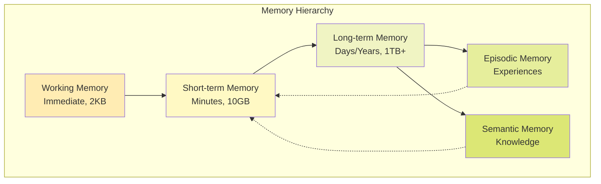

# Memory Systems Guide

## Hierarchical Memory Architecture for AI Agents

This guide covers the implementation and usage of GreenLang's sophisticated memory systems, enabling agents to store, retrieve, and learn from experiences.

---

## Table of Contents

1. [Memory Architecture Overview](#memory-architecture-overview)
2. [Short-Term Memory](#short-term-memory)
3. [Long-Term Memory](#long-term-memory)
4. [Episodic Memory](#episodic-memory)
5. [Semantic Memory](#semantic-memory)
6. [Memory Operations](#memory-operations)
7. [Memory Consolidation](#memory-consolidation)
8. [Implementation Examples](#implementation-examples)
9. [Performance Optimization](#performance-optimization)
10. [Best Practices](#best-practices)

---

## Memory Architecture Overview

### Hierarchical Memory Model



### Memory Components

```python
class MemoryArchitecture:
    """Complete memory system architecture."""

    components = {
        'working_memory': {
            'capacity': '2KB',
            'duration': '30 seconds',
            'access_time': '<1ms',
            'storage': 'Process memory'
        },
        'short_term_memory': {
            'capacity': '10GB',
            'duration': '5 minutes to 1 hour',
            'access_time': '<10ms',
            'storage': 'Redis'
        },
        'long_term_memory': {
            'capacity': '1TB+',
            'duration': 'Days to years',
            'access_time': '<100ms',
            'storage': 'PostgreSQL + S3'
        },
        'episodic_memory': {
            'capacity': '100GB',
            'duration': 'Permanent',
            'access_time': '<200ms',
            'storage': 'TimescaleDB'
        },
        'semantic_memory': {
            'capacity': 'Unlimited',
            'duration': 'Permanent',
            'access_time': '<50ms',
            'storage': 'Neo4j + Vector DB'
        }
    }
```

---

## Short-Term Memory

### Implementation

```python
from greenlang.memory import ShortTermMemory
import asyncio
from typing import Any, Dict, List, Optional

class STMImplementation:
    """Short-term memory implementation with Redis backend."""

    def __init__(self, capacity_mb: int = 100, ttl_seconds: int = 300):
        self.memory = ShortTermMemory(
            backend='redis',
            capacity=capacity_mb * 1024 * 1024,  # Convert to bytes
            ttl=ttl_seconds
        )
        self.attention_buffer = []
        self.working_set = {}

    async def store(self, key: str, value: Any, priority: float = 0.5) -> bool:
        """Store item in short-term memory."""
        # Check capacity
        if await self.is_full():
            await self.evict_least_important()

        # Store with metadata
        memory_item = {
            'value': value,
            'priority': priority,
            'access_count': 0,
            'last_accessed': self.current_timestamp(),
            'created_at': self.current_timestamp()
        }

        success = await self.memory.set(key, memory_item)

        # Update attention if high priority
        if priority > 0.7:
            self.attention_buffer.append(key)
            if len(self.attention_buffer) > 10:
                self.attention_buffer.pop(0)

        return success

    async def retrieve(self, key: str) -> Optional[Any]:
        """Retrieve item from memory."""
        item = await self.memory.get(key)

        if item:
            # Update access metadata
            item['access_count'] += 1
            item['last_accessed'] = self.current_timestamp()
            await self.memory.set(key, item)

            return item['value']

        return None

    async def search(self, query: str, top_k: int = 5) -> List[Dict[str, Any]]:
        """Search memory by semantic similarity."""
        # Get all keys matching pattern
        keys = await self.memory.search_keys(f"*{query}*")

        # Score by relevance
        results = []
        for key in keys:
            item = await self.memory.get(key)
            if item:
                score = self.calculate_relevance(query, key, item)
                results.append({
                    'key': key,
                    'value': item['value'],
                    'score': score
                })

        # Sort by score and return top k
        results.sort(key=lambda x: x['score'], reverse=True)
        return results[:top_k]

    async def consolidate_to_long_term(self) -> int:
        """Transfer important memories to long-term storage."""
        consolidated = 0

        # Get all keys
        all_keys = await self.memory.get_all_keys()

        for key in all_keys:
            item = await self.memory.get(key)

            # Check if should consolidate
            if self.should_consolidate(item):
                # Transfer to long-term memory
                await self.long_term_memory.store(key, item['value'])
                consolidated += 1

                # Remove from short-term
                await self.memory.delete(key)

        return consolidated

    def should_consolidate(self, item: Dict[str, Any]) -> bool:
        """Determine if memory should be consolidated."""
        # High priority items
        if item['priority'] > 0.8:
            return True

        # Frequently accessed items
        if item['access_count'] > 5:
            return True

        # Important patterns
        if self.is_important_pattern(item['value']):
            return True

        return False

    async def evict_least_important(self):
        """Remove least important memories when capacity reached."""
        all_keys = await self.memory.get_all_keys()

        # Score all items
        scores = []
        for key in all_keys:
            item = await self.memory.get(key)
            if item:
                score = self.calculate_importance(item)
                scores.append((key, score))

        # Sort by importance
        scores.sort(key=lambda x: x[1])

        # Evict bottom 10%
        evict_count = max(1, len(scores) // 10)
        for key, _ in scores[:evict_count]:
            await self.memory.delete(key)
```

### Working Memory Buffer

```python
class WorkingMemory:
    """Ultra-fast working memory for immediate tasks."""

    def __init__(self, capacity: int = 2048):
        self.buffer = deque(maxlen=capacity)
        self.attention_window = 512  # Focus window
        self.context = {}

    def add(self, item: Any):
        """Add item to working memory."""
        self.buffer.append({
            'data': item,
            'timestamp': time.time(),
            'attention_weight': 1.0
        })

        # Decay old attention weights
        self.decay_attention()

    def get_context(self, n: int = None) -> List[Any]:
        """Get current context from working memory."""
        n = n or self.attention_window

        # Get most recent items with attention weighting
        items = list(self.buffer)[-n:]

        # Sort by attention weight
        items.sort(key=lambda x: x['attention_weight'], reverse=True)

        return [item['data'] for item in items[:n]]

    def decay_attention(self):
        """Decay attention weights over time."""
        current_time = time.time()

        for item in self.buffer:
            age = current_time - item['timestamp']
            # Exponential decay
            item['attention_weight'] *= math.exp(-age / 60)  # 60 second half-life

    def clear(self):
        """Clear working memory."""
        self.buffer.clear()
        self.context.clear()
```

---

## Long-Term Memory

### Persistent Storage Implementation

```python
class LongTermMemory:
    """Persistent long-term memory with tiered storage."""

    def __init__(self):
        self.hot_storage = self.setup_hot_storage()  # PostgreSQL
        self.warm_storage = self.setup_warm_storage()  # S3
        self.cold_storage = self.setup_cold_storage()  # Glacier

    def setup_hot_storage(self):
        """Setup fast access storage."""
        return PostgreSQLStorage(
            connection_string=os.getenv('DATABASE_URL'),
            table='long_term_memory_hot',
            indexes=['agent_id', 'timestamp', 'category']
        )

    def setup_warm_storage(self):
        """Setup medium access storage."""
        return S3Storage(
            bucket='greenlang-memory-warm',
            prefix='long-term/',
            compression='gzip'
        )

    def setup_cold_storage(self):
        """Setup archival storage."""
        return GlacierStorage(
            vault='greenlang-memory-archive',
            retrieval_tier='Bulk'  # Cheaper but slower
        )

    async def store(self, key: str, value: Any, category: str = 'general'):
        """Store in long-term memory."""
        memory_record = {
            'key': key,
            'value': value,
            'category': category,
            'agent_id': self.agent_id,
            'timestamp': datetime.utcnow(),
            'embedding': await self.generate_embedding(value),
            'metadata': self.extract_metadata(value),
            'importance': self.calculate_importance(value),
            'hash': self.generate_hash(value)
        }

        # Store in hot storage initially
        await self.hot_storage.insert(memory_record)

        # Schedule migration to warm/cold based on access patterns
        await self.schedule_migration(key, memory_record)

        return key

    async def retrieve(self, key: str) -> Optional[Any]:
        """Retrieve from long-term memory."""
        # Try hot storage first
        record = await self.hot_storage.get(key)

        if not record:
            # Try warm storage
            record = await self.warm_storage.get(key)

            if record:
                # Promote to hot storage
                await self.promote_to_hot(record)

        if not record:
            # Try cold storage (slow)
            record = await self.cold_storage.retrieve(key)

            if record:
                # Promote to warm storage
                await self.promote_to_warm(record)

        if record:
            # Update access statistics
            await self.update_access_stats(key)
            return record['value']

        return None

    async def semantic_search(self, query: str, top_k: int = 10) -> List[Dict[str, Any]]:
        """Search by semantic similarity."""
        query_embedding = await self.generate_embedding(query)

        # Search in vector index
        results = await self.hot_storage.vector_search(
            embedding=query_embedding,
            top_k=top_k * 2  # Get more for filtering
        )

        # Filter and rank
        filtered_results = []
        for result in results:
            relevance_score = self.calculate_relevance(query, result)
            if relevance_score > 0.5:
                filtered_results.append({
                    'key': result['key'],
                    'value': result['value'],
                    'score': relevance_score,
                    'timestamp': result['timestamp']
                })

        # Sort by score
        filtered_results.sort(key=lambda x: x['score'], reverse=True)
        return filtered_results[:top_k]

    async def forget(self, key: str):
        """Remove memory (with audit trail)."""
        # Create deletion record for compliance
        await self.audit_deletion(key)

        # Delete from all storage tiers
        await self.hot_storage.delete(key)
        await self.warm_storage.delete(key)
        await self.cold_storage.delete(key)

    async def optimize_storage(self):
        """Optimize storage based on access patterns."""
        # Get access statistics
        stats = await self.get_access_statistics()

        for key, access_info in stats.items():
            # Move frequently accessed to hot
            if access_info['access_frequency'] > 10:
                await self.promote_to_hot(key)

            # Move rarely accessed to warm
            elif access_info['days_since_access'] > 7:
                await self.demote_to_warm(key)

            # Archive very old items
            elif access_info['days_since_access'] > 90:
                await self.archive_to_cold(key)
```

---

## Episodic Memory

### Experience-Based Memory

```python
class EpisodicMemory:
    """Memory system for storing and retrieving experiences."""

    def __init__(self):
        self.episodes = TimescaleDB(
            connection_string=os.getenv('TIMESCALE_URL'),
            table='episodic_memory'
        )
        self.pattern_detector = PatternDetector()

    async def record_episode(self, episode: Dict[str, Any]) -> str:
        """Record a complete episode."""
        episode_record = {
            'episode_id': str(uuid.uuid4()),
            'agent_id': self.agent_id,
            'timestamp': datetime.utcnow(),
            'context': episode.get('context'),
            'actions': episode.get('actions', []),
            'outcomes': episode.get('outcomes'),
            'reward': episode.get('reward', 0),
            'emotions': episode.get('emotions', {}),
            'importance': self.calculate_episode_importance(episode),
            'summary': await self.generate_episode_summary(episode),
            'embeddings': await self.generate_episode_embeddings(episode)
        }

        # Store episode
        await self.episodes.insert(episode_record)

        # Extract patterns
        patterns = await self.pattern_detector.analyze(episode_record)
        if patterns:
            await self.store_patterns(patterns)

        return episode_record['episode_id']

    async def recall_similar_episodes(self, context: Dict[str, Any], top_k: int = 5) -> List[Dict[str, Any]]:
        """Recall episodes similar to current context."""
        # Generate context embedding
        context_embedding = await self.generate_embedding(context)

        # Search for similar episodes
        similar = await self.episodes.vector_search(
            embedding=context_embedding,
            top_k=top_k * 3
        )

        # Score and filter
        scored_episodes = []
        for episode in similar:
            score = self.calculate_similarity(context, episode)
            if score > 0.6:
                scored_episodes.append({
                    **episode,
                    'similarity_score': score
                })

        # Sort by score
        scored_episodes.sort(key=lambda x: x['similarity_score'], reverse=True)
        return scored_episodes[:top_k]

    async def learn_from_episodes(self) -> Dict[str, Any]:
        """Extract learning from episodic memories."""
        # Get recent episodes
        recent_episodes = await self.episodes.get_recent(days=7)

        # Analyze patterns
        patterns = {
            'successful_patterns': [],
            'failure_patterns': [],
            'strategies': [],
            'improvements': []
        }

        for episode in recent_episodes:
            if episode['reward'] > 0.7:
                # Successful episode
                pattern = self.extract_success_pattern(episode)
                patterns['successful_patterns'].append(pattern)

            elif episode['reward'] < 0.3:
                # Failed episode
                pattern = self.extract_failure_pattern(episode)
                patterns['failure_patterns'].append(pattern)

        # Generate strategies
        patterns['strategies'] = await self.generate_strategies(patterns)

        # Identify improvements
        patterns['improvements'] = await self.identify_improvements(patterns)

        return patterns

    async def replay_episodes(self, criteria: Dict[str, Any]) -> List[Dict[str, Any]]:
        """Replay episodes matching criteria for learning."""
        # Query episodes
        episodes = await self.episodes.query(criteria)

        # Replay for learning
        replayed = []
        for episode in episodes:
            # Simulate episode
            simulation = await self.simulate_episode(episode)

            # Compare with actual outcome
            learning = self.compare_outcomes(
                actual=episode['outcomes'],
                simulated=simulation['outcomes']
            )

            replayed.append({
                'episode': episode,
                'simulation': simulation,
                'learning': learning
            })

        return replayed

    def extract_success_pattern(self, episode: Dict[str, Any]) -> Dict[str, Any]:
        """Extract pattern from successful episode."""
        return {
            'context_features': self.extract_context_features(episode['context']),
            'action_sequence': episode['actions'],
            'key_decisions': self.identify_key_decisions(episode),
            'success_factors': self.identify_success_factors(episode),
            'reusability_score': self.calculate_reusability(episode)
        }
```

---

## Semantic Memory

### Knowledge Graph Implementation

```python
class SemanticMemory:
    """Semantic memory using knowledge graphs and embeddings."""

    def __init__(self):
        self.knowledge_graph = Neo4jGraph(
            uri=os.getenv('NEO4J_URI'),
            auth=(os.getenv('NEO4J_USER'), os.getenv('NEO4J_PASSWORD'))
        )
        self.vector_store = VectorStore(
            backend='faiss',
            dimensions=768
        )
        self.ontology = self.load_ontology()

    async def store_concept(self, concept: Dict[str, Any]) -> str:
        """Store conceptual knowledge."""
        # Create concept node
        concept_node = {
            'id': str(uuid.uuid4()),
            'name': concept['name'],
            'type': concept['type'],
            'definition': concept['definition'],
            'properties': concept.get('properties', {}),
            'embedding': await self.generate_embedding(concept['definition'])
        }

        # Add to knowledge graph
        await self.knowledge_graph.create_node(concept_node)

        # Add to vector store
        await self.vector_store.add(
            vector=concept_node['embedding'],
            metadata=concept_node
        )

        # Create relationships
        if 'relationships' in concept:
            await self.create_relationships(concept_node['id'], concept['relationships'])

        return concept_node['id']

    async def store_fact(self, fact: Dict[str, Any]) -> str:
        """Store factual knowledge."""
        fact_triple = {
            'subject': fact['subject'],
            'predicate': fact['predicate'],
            'object': fact['object'],
            'confidence': fact.get('confidence', 1.0),
            'source': fact.get('source', 'direct_observation'),
            'timestamp': datetime.utcnow()
        }

        # Store in knowledge graph
        await self.knowledge_graph.create_triple(fact_triple)

        # Update embeddings
        await self.update_fact_embeddings(fact_triple)

        return self.generate_fact_id(fact_triple)

    async def query_knowledge(self, query: str) -> List[Dict[str, Any]]:
        """Query semantic memory."""
        # Parse query
        parsed_query = await self.parse_query(query)

        results = []

        # Graph query
        if parsed_query['type'] == 'graph':
            graph_results = await self.knowledge_graph.query(
                parsed_query['cypher']
            )
            results.extend(graph_results)

        # Vector similarity search
        elif parsed_query['type'] == 'similarity':
            vector_results = await self.vector_store.search(
                query_vector=parsed_query['embedding'],
                top_k=10
            )
            results.extend(vector_results)

        # Hybrid query
        elif parsed_query['type'] == 'hybrid':
            # Combine graph and vector search
            graph_results = await self.knowledge_graph.query(
                parsed_query['cypher']
            )
            vector_results = await self.vector_store.search(
                query_vector=parsed_query['embedding'],
                top_k=10
            )

            # Merge and rank results
            results = self.merge_results(graph_results, vector_results)

        return results

    async def reason_over_knowledge(self, question: str) -> Dict[str, Any]:
        """Perform reasoning over semantic memory."""
        # Extract entities and relations
        entities = await self.extract_entities(question)
        relations = await self.extract_relations(question)

        # Build reasoning graph
        reasoning_graph = await self.build_reasoning_graph(entities, relations)

        # Apply inference rules
        inferences = await self.apply_inference_rules(reasoning_graph)

        # Generate answer
        answer = await self.generate_answer(question, reasoning_graph, inferences)

        return {
            'question': question,
            'answer': answer,
            'reasoning_steps': inferences,
            'confidence': self.calculate_confidence(inferences),
            'sources': self.get_sources(reasoning_graph)
        }

    async def update_beliefs(self, new_information: Dict[str, Any]):
        """Update semantic memory with new information."""
        # Check consistency
        conflicts = await self.check_consistency(new_information)

        if conflicts:
            # Resolve conflicts
            resolution = await self.resolve_conflicts(conflicts, new_information)
            new_information = resolution['resolved_information']

        # Update knowledge graph
        await self.knowledge_graph.update(new_information)

        # Update embeddings
        await self.vector_store.update(new_information)

        # Propagate changes
        await self.propagate_belief_updates(new_information)
```

---

## Memory Operations

### Unified Memory Interface

```python
class UnifiedMemory:
    """Unified interface for all memory systems."""

    def __init__(self):
        self.working = WorkingMemory()
        self.short_term = ShortTermMemory()
        self.long_term = LongTermMemory()
        self.episodic = EpisodicMemory()
        self.semantic = SemanticMemory()

    async def remember(self, content: Any, memory_type: str = 'auto') -> str:
        """Store content in appropriate memory."""
        if memory_type == 'auto':
            memory_type = self.determine_memory_type(content)

        if memory_type == 'working':
            self.working.add(content)
            return 'working_memory'

        elif memory_type == 'short_term':
            key = await self.short_term.store(content)
            return key

        elif memory_type == 'long_term':
            key = await self.long_term.store(content)
            return key

        elif memory_type == 'episodic':
            episode_id = await self.episodic.record_episode(content)
            return episode_id

        elif memory_type == 'semantic':
            concept_id = await self.semantic.store_concept(content)
            return concept_id

    async def recall(self, query: str, memory_types: List[str] = None) -> Dict[str, Any]:
        """Recall from specified memory types."""
        if not memory_types:
            memory_types = ['working', 'short_term', 'long_term', 'episodic', 'semantic']

        results = {}

        if 'working' in memory_types:
            results['working'] = self.working.get_context()

        if 'short_term' in memory_types:
            results['short_term'] = await self.short_term.search(query)

        if 'long_term' in memory_types:
            results['long_term'] = await self.long_term.semantic_search(query)

        if 'episodic' in memory_types:
            results['episodic'] = await self.episodic.recall_similar_episodes({'query': query})

        if 'semantic' in memory_types:
            results['semantic'] = await self.semantic.query_knowledge(query)

        return results

    async def consolidate(self):
        """Consolidate memories across systems."""
        # Working → Short-term
        working_items = self.working.get_context()
        for item in working_items:
            if self.should_promote_to_short_term(item):
                await self.short_term.store(item)

        # Short-term → Long-term
        consolidated = await self.short_term.consolidate_to_long_term()

        # Episodic → Semantic
        patterns = await self.episodic.learn_from_episodes()
        for pattern in patterns['successful_patterns']:
            await self.semantic.store_concept({
                'name': f"pattern_{pattern['id']}",
                'type': 'learned_pattern',
                'definition': pattern['description'],
                'properties': pattern
            })

        return {
            'working_to_short': len(working_items),
            'short_to_long': consolidated,
            'episodic_to_semantic': len(patterns['successful_patterns'])
        }
```

---

## Memory Consolidation

### Sleep-Like Consolidation Process

```python
class MemoryConsolidation:
    """Memory consolidation and optimization process."""

    async def sleep_cycle(self):
        """Perform sleep-like memory consolidation."""
        # Phase 1: Replay important experiences
        await self.replay_important_episodes()

        # Phase 2: Extract patterns
        await self.extract_and_store_patterns()

        # Phase 3: Prune redundant memories
        await self.prune_redundant_memories()

        # Phase 4: Strengthen important connections
        await self.strengthen_important_memories()

        # Phase 5: Optimize storage
        await self.optimize_memory_storage()

    async def replay_important_episodes(self):
        """Replay important episodes for learning."""
        important_episodes = await self.episodic.get_important_episodes(
            importance_threshold=0.7
        )

        for episode in important_episodes:
            # Simulate replay
            await self.simulate_episode_replay(episode)

            # Extract learnings
            learnings = await self.extract_learnings(episode)

            # Update semantic memory
            await self.semantic.update_from_learnings(learnings)

    async def extract_and_store_patterns(self):
        """Extract patterns from memories."""
        # Get recent memories
        recent_memories = await self.get_recent_memories()

        # Detect patterns
        patterns = await self.pattern_detector.detect_patterns(recent_memories)

        # Store significant patterns
        for pattern in patterns:
            if pattern['significance'] > 0.6:
                await self.semantic.store_pattern(pattern)

    async def prune_redundant_memories(self):
        """Remove redundant or low-value memories."""
        # Identify redundant memories
        redundant = await self.identify_redundant_memories()

        for memory_id in redundant:
            # Check if safe to prune
            if await self.safe_to_prune(memory_id):
                await self.delete_memory(memory_id)

    async def strengthen_important_memories(self):
        """Strengthen connections for important memories."""
        important_memories = await self.identify_important_memories()

        for memory in important_memories:
            # Increase priority
            await self.increase_memory_priority(memory['id'])

            # Create additional associations
            await self.create_memory_associations(memory)

            # Move to faster storage tier
            await self.promote_to_faster_storage(memory['id'])
```

---

## Implementation Examples

### Complete Memory System

```python
class AgentWithMemory(BaseAgent):
    """Agent with complete memory system."""

    def __init__(self, config: AgentConfig):
        super().__init__(config)
        self.memory = UnifiedMemory()
        self.consolidator = MemoryConsolidation()

    async def process_with_memory(self, input_data: Dict[str, Any]) -> Dict[str, Any]:
        """Process input using memory context."""
        # Add to working memory
        self.memory.working.add(input_data)

        # Recall relevant memories
        context = await self.memory.recall(
            query=input_data.get('query', ''),
            memory_types=['short_term', 'long_term', 'semantic']
        )

        # Process with context
        result = await self.process_with_context(input_data, context)

        # Store experience
        episode = {
            'context': input_data,
            'actions': result.get('actions', []),
            'outcomes': result,
            'reward': self.calculate_reward(result)
        }
        await self.memory.episodic.record_episode(episode)

        # Update short-term memory
        await self.memory.short_term.store(
            key=f"result_{result['id']}",
            value=result,
            priority=result.get('importance', 0.5)
        )

        return result

    async def learn_from_experience(self):
        """Learn from accumulated experiences."""
        # Consolidate memories
        consolidation_stats = await self.memory.consolidate()

        # Extract patterns from episodic memory
        patterns = await self.memory.episodic.learn_from_episodes()

        # Update semantic knowledge
        for pattern in patterns['successful_patterns']:
            await self.memory.semantic.store_concept({
                'name': f"learned_pattern_{pattern['id']}",
                'type': 'experiential_knowledge',
                'definition': pattern['description'],
                'confidence': pattern['confidence']
            })

        return {
            'consolidation': consolidation_stats,
            'patterns_learned': len(patterns['successful_patterns']),
            'improvements_identified': len(patterns['improvements'])
        }

    async def perform_maintenance(self):
        """Perform memory maintenance."""
        # Run consolidation cycle
        await self.consolidator.sleep_cycle()

        # Optimize storage
        await self.memory.long_term.optimize_storage()

        # Clean up old memories
        await self.cleanup_old_memories()

        self.logger.info("Memory maintenance completed")
```

---

## Performance Optimization

### Memory Access Optimization

```python
class OptimizedMemory:
    """Performance-optimized memory operations."""

    def __init__(self):
        self.cache = LRUCache(maxsize=1000)
        self.index = self.build_index()
        self.prefetcher = MemoryPrefetcher()

    async def fast_recall(self, query: str) -> Any:
        """Optimized memory recall."""
        # Check cache first
        cache_key = self.generate_cache_key(query)
        if cache_key in self.cache:
            return self.cache[cache_key]

        # Use index for fast lookup
        candidates = self.index.search(query)

        # Parallel retrieval
        results = await asyncio.gather(*[
            self.retrieve_memory(candidate)
            for candidate in candidates[:10]
        ])

        # Score and rank
        best_match = self.rank_results(results, query)[0]

        # Cache result
        self.cache[cache_key] = best_match

        # Prefetch related memories
        asyncio.create_task(self.prefetcher.prefetch_related(best_match))

        return best_match

    def build_index(self):
        """Build memory index for fast search."""
        return InvertedIndex(
            fields=['content', 'tags', 'category'],
            analyzer='standard',
            similarity='BM25'
        )

    async def batch_store(self, memories: List[Dict[str, Any]]):
        """Efficiently store multiple memories."""
        # Prepare batch
        prepared = []
        for memory in memories:
            prepared.append({
                **memory,
                'embedding': await self.generate_embedding_batch([memory])[0],
                'hash': self.generate_hash(memory)
            })

        # Batch insert
        await self.storage.batch_insert(prepared)

        # Update index
        self.index.add_documents(prepared)

        # Invalidate affected cache entries
        self.invalidate_cache(prepared)
```

---

## Best Practices

### Memory Management Best Practices

1. **Hierarchical Storage**
   - Use working memory for immediate context
   - Short-term for recent interactions
   - Long-term for important knowledge
   - Archive old data to cold storage

2. **Consolidation Strategy**
   - Regular consolidation cycles (every hour)
   - Priority-based promotion
   - Pattern extraction during quiet periods
   - Redundancy elimination

3. **Performance Optimization**
   - Cache frequently accessed memories
   - Use indexes for fast search
   - Batch operations when possible
   - Prefetch related memories

4. **Data Quality**
   - Verify memory integrity
   - Remove contradictions
   - Update confidence scores
   - Maintain provenance

5. **Privacy and Security**
   - Encrypt sensitive memories
   - Implement access controls
   - Audit memory access
   - Support right to be forgotten

---

## Conclusion

The GreenLang memory system provides a sophisticated, biologically-inspired architecture for agent memory management. By combining multiple memory types with intelligent consolidation and optimization, agents can effectively learn from experience and maintain relevant knowledge over time.

For more information, see:
- [Agent Development Guide](Agent_Development_Guide.md)
- [Intelligence Layer Guide](Intelligence_Layer_Guide.md)
- [Performance Optimization Guide](Best_Practices.md#performance)

---

**Last Updated**: November 2024
**Version**: 1.0.0
**Maintainer**: GreenLang Memory Systems Team