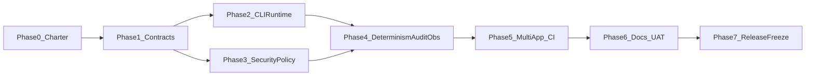

# GreenLang v1 Dependency Graph

## Critical Path

Phase 0 -> Phase 1 -> Phase 2 -> Phase 4 -> Phase 5 -> Phase 6 -> Phase 7

## Blocking Dependencies

- Phase 1 blocks all runtime and security conformance.
- Phase 3 policy baseline must pass before Phase 5 gate enforcement.
- Phase 6 UAT evidence is required for Phase 7 go/no-go.

