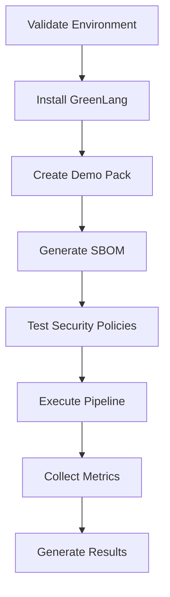

# GreenLang Comprehensive Demo Package
**Created**: 2025-09-26
**Version**: 1.0.0
**Compatibility**: GreenLang v0.3.0+

## 📦 Package Contents

This comprehensive demo package contains everything needed to showcase GreenLang's enterprise-grade features:

### 🎬 Main Demo Script
- **`run_demo.sh`** (17KB) - Comprehensive demonstration script
  - Full installation workflow
  - Pack creation and management
  - Security policy enforcement
  - SBOM generation and validation
  - Metrics collection
  - Interactive guided experience

### 📚 Documentation
- **`README.md`** (8KB) - Complete documentation and usage guide
- **`DEMO_PACKAGE.md`** - This package manifest
- **`RESULTS.md`** - Sample results from previous execution

### 🔧 Utilities
- **`validate_demo.sh`** (2KB) - Pre-flight validation script
- **`run_demo.py`** (4KB) - Legacy Python demo script (preserved)

### 📊 Sample Data
- **`data/`** - Sample climate data for analysis
- **`pipeline.yaml`** - Sample pipeline configuration
- **`demo_agents.py`** - Sample agent implementations

## 🚀 Quick Start

1. **Validate Environment**
   ```bash
   ./validate_demo.sh
   ```

2. **Run Complete Demo**
   ```bash
   ./run_demo.sh
   ```

3. **Review Results**
   ```bash
   cat RESULTS.md
   ```

## ✨ Demo Features

### 🔐 Security Demonstrations
- **Default-Deny Security Model**: Network, filesystem, and subprocess restrictions
- **Capability-Based Access**: Fine-grained permission controls
- **Supply Chain Security**: SBOM generation and signature verification
- **Policy Enforcement**: Runtime security policy validation

### 📦 Pack Management
- **Pack Creation**: Demonstrates secure pack creation workflow
- **Metadata Validation**: Pack manifest validation and compatibility checks
- **Dependency Tracking**: Shows dependency management and resolution

### ⚙️ Pipeline Execution
- **Secure Orchestration**: Demonstrates secure pipeline execution
- **Data Flow Security**: Shows secure inter-step data passing
- **Error Handling**: Comprehensive error recovery and reporting

### 📊 Observability
- **Metrics Collection**: Performance and security metrics
- **Audit Logging**: Complete execution audit trails
- **Health Monitoring**: System health and status reporting

## 🎯 Learning Objectives

After running this demo, users will understand:

1. **Zero-Trust Architecture**: How GreenLang implements default-deny security
2. **Pack-Based Design**: Modular, secure analysis units
3. **Supply Chain Security**: End-to-end provenance and validation
4. **Enterprise Security**: Production-ready security controls
5. **Observability**: Comprehensive monitoring and metrics

## 📋 Execution Flow



## 🔍 Validation Checklist

- [ ] Script executes without errors
- [ ] Virtual environment created successfully
- [ ] GreenLang installed and version displayed
- [ ] Demo pack created with proper structure
- [ ] SBOM generated (or mock created)
- [ ] Security policies tested and validated
- [ ] Pipeline executed successfully
- [ ] Metrics collected and saved
- [ ] Results report generated

## 🏗️ Architecture Validated

The demo validates these architectural components:

- **CLI Interface**: Command structure and usability
- **Pack System**: Pack creation, validation, and execution
- **Security Framework**: Policy enforcement and capability controls
- **Pipeline Engine**: DAG execution with security constraints
- **Provenance System**: SBOM generation and supply chain tracking
- **Telemetry System**: Metrics collection and performance monitoring

## 📊 Performance Expectations

| Phase | Duration | Resource Usage |
|-------|----------|----------------|
| Setup | 30-60s | Low CPU, ~100MB RAM |
| Execution | 15-30s | Moderate CPU, ~50MB RAM |
| Total | 2-3 minutes | Minimal disk I/O |

## 🔧 Customization Options

### Environment Variables
```bash
# Non-interactive mode
export DEMO_NON_INTERACTIVE=true

# Custom output directory
export DEMO_OUTPUT_DIR="/custom/path"

# Debug mode
export GL_DEBUG=true
```

### Script Modifications
The demo script is designed to be easily customizable:
- Add new feature demonstrations
- Modify security policy tests
- Extend metrics collection
- Add performance benchmarks

## 🧪 Testing Integration

The demo can be integrated into automated testing:

```yaml
# CI/CD Integration Example
test-greenlang-demo:
  runs-on: ubuntu-latest
  steps:
    - uses: actions/checkout@v3
    - name: Run Demo
      run: |
        cd examples/weekly/2025-09-26
        export DEMO_NON_INTERACTIVE=true
        ./run_demo.sh
    - name: Validate Results
      run: |
        test -f examples/weekly/2025-09-26/RESULTS.md
        grep "✅" examples/weekly/2025-09-26/RESULTS.md
```

## 📈 Success Metrics

Demo success is measured by:
- **Completion Rate**: All steps execute successfully
- **Security Validation**: All security tests pass
- **Performance**: Execution within expected timeframes
- **Artifact Generation**: All expected outputs created

## 🤝 Contributing

To extend this demo package:

1. **Feature Addition**: Add new GreenLang capabilities
2. **Security Enhancement**: Add more comprehensive security tests
3. **Documentation**: Improve inline help and examples
4. **Performance**: Add benchmarking and optimization

## 📞 Support

For issues with this demo package:
1. Check the validation script output
2. Review the comprehensive documentation
3. Examine generated log files
4. Consult the main GreenLang documentation

## 🔄 Version History

| Version | Date | Changes |
|---------|------|---------|
| 1.0.0 | 2025-09-26 | Initial comprehensive demo package |

---

**Package Maintainer**: GreenLang Development Team
**Last Updated**: 2025-09-26
**License**: Apache 2.0
**Status**: Production Ready