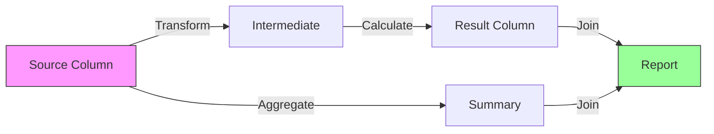

# Column-Level Data Lineage Tracking

## Overview

The GreenLang Column Lineage Tracker provides comprehensive field-level data lineage tracking for regulatory compliance, audit trails, and impact analysis. It maintains a complete directed acyclic graph (DAG) of all data transformations, enabling full traceability from source to destination.

## Architecture

### Core Components

```
┌─────────────────────────────────────────────────────────────┐
│                   ColumnLineageTracker                       │
│  ┌─────────────┐  ┌─────────────┐  ┌─────────────────────┐ │
│  │ LineageNode │  │ Transform   │  │   LineageGraph      │ │
│  │             │  │   Record    │  │                     │ │
│  │ - id        │  │ - sources   │  │ - nodes: Dict       │ │
│  │ - name      │  │ - dests     │  │ - transformations   │ │
│  │ - type      │  │ - formula   │  │ - graph: nx.DiGraph │ │
│  │ - is_pii    │  │ - type      │  │                     │ │
│  │ - sox_crit  │  │ - agent     │  │ - get_upstream()    │ │
│  └─────────────┘  └─────────────┘  │ - get_downstream()  │ │
│                                     │ - impact_analysis() │ │
│                                     └─────────────────────┘ │
│                                                             │
│  ┌─────────────────────────────────────────────────────┐   │
│  │              Storage Backends                       │   │
│  │  ┌──────┐  ┌──────────┐  ┌──────┐  ┌────────────┐ │   │
│  │  │Memory│  │PostgreSQL│  │Neo4j │  │File/Parquet│ │   │
│  │  └──────┘  └──────────┘  └──────┘  └────────────┘ │   │
│  └─────────────────────────────────────────────────────┘   │
└─────────────────────────────────────────────────────────────┘
```

### Data Flow



## Features

### 1. Automatic Tracking

- **Decorator-based**: `@track_lineage` for automatic function tracking
- **Context managers**: Explicit transformation tracking
- **DataFrame integration**: Automatic pandas operation tracking
- **SQL parsing**: Extract lineage from SQL queries

### 2. Compliance Support

- **GDPR**: Track PII data flows, retention policies, lawful basis
- **SOX**: Identify critical financial fields, audit trails
- **Regulatory**: Classification-based tracking (PII, Financial, Regulatory)

### 3. Query Capabilities

- **Upstream analysis**: Find all source columns for a field
- **Downstream analysis**: Find all derived columns
- **Impact analysis**: Assess change impacts
- **Path finding**: Trace complete transformation paths

### 4. Visualization

- **Mermaid diagrams**: For documentation
- **Graphviz**: High-quality static diagrams
- **Interactive HTML**: Web-based exploration
- **Export formats**: PNG, SVG, DOT

## Installation

```python
# Basic usage (memory storage)
from greenlang.lineage import ColumnLineageTracker

tracker = ColumnLineageTracker()

# With Neo4j backend (recommended for production)
tracker = ColumnLineageTracker(
    storage_backend="neo4j",
    config={
        "uri": "bolt://localhost:7687",
        "user": "neo4j",
        "password": "password"
    }
)

# With PostgreSQL backend
tracker = ColumnLineageTracker(
    storage_backend="postgresql",
    config={
        "host": "localhost",
        "database": "lineage",
        "user": "postgres",
        "password": "password"
    }
)
```

## Usage Examples

### Basic Column Registration

```python
from greenlang.lineage import (
    ColumnLineageTracker,
    TransformationType,
    DataClassification
)

tracker = ColumnLineageTracker()

# Register a source column
fuel_col = tracker.add_column(
    system="erp",
    dataset="fuel_consumption",
    column_name="liters",
    data_type="float",
    classification=DataClassification.INTERNAL
)

# Register a regulatory column
emissions_col = tracker.add_column(
    system="reporting",
    dataset="ghg_emissions",
    column_name="co2_total",
    data_type="float",
    classification=DataClassification.REGULATORY,
    sox_critical=True
)
```

### Track Transformations

```python
# Using context manager
with tracker.track_transformation(
    agent_name="emissions_calculator",
    transformation_type=TransformationType.CALCULATE,
    pipeline_id="PIPE-2024-001"
) as t:
    t.add_source("erp.fuel_consumption.liters")
    t.add_source("reference.factors.co2_per_liter")
    t.add_destination("reporting.emissions.co2_total")
    t.set_formula("liters * co2_per_liter")
    t.add_validation_rule("result >= 0")
```

### Track PII Data (GDPR)

```python
# Register PII column with GDPR metadata
customer_email = tracker.add_column(
    system="crm",
    dataset="customers",
    column_name="email",
    data_type="varchar",
    is_pii=True,
    classification=DataClassification.PII,
    gdpr_lawful_basis="consent",
    retention_days=365,
    owner="data_protection@company.com"
)

# Track anonymization
with tracker.track_transformation("anonymize", TransformationType.DERIVE) as t:
    t.add_source(customer_email.id)
    t.add_destination("analytics.users.email_hash")
    t.set_formula("SHA256(LOWER(email))")
```

### Pandas Integration

```python
import pandas as pd

# Automatic tracking of DataFrame operations
input_df = pd.DataFrame({'value': [10, 20, 30]})
output_df = input_df.copy()
output_df['doubled'] = input_df['value'] * 2

tracker.track_dataframe_operation(
    input_df, output_df,
    operation="Double values",
    agent_name="data_processor"
)
```

### SQL Lineage Extraction

```python
sql = """
SELECT
    o.order_id,
    o.amount * 0.1 as tax,
    c.name as customer_name
FROM orders o
JOIN customers c ON o.customer_id = c.id
"""

tracker.parse_sql_lineage(sql, default_system="warehouse")
```

### Query Lineage

```python
# Find all upstream columns
upstream = tracker.graph.get_upstream("reporting.emissions.co2_total")
print(f"Source columns: {upstream}")

# Find all downstream impacts
impact = tracker.graph.impact_analysis("erp.fuel_consumption.liters")
print(f"Affected columns: {impact['total_impacted']}")
print(f"Critical impacts: {impact['critical_impacts']}")

# Find transformation paths
paths = tracker.graph.find_transformation_path(
    source="erp.fuel.liters",
    destination="reporting.emissions.total"
)
```

### Generate Compliance Reports

```python
# GDPR compliance report
gdpr_report = tracker.generate_compliance_report("gdpr")
print(f"PII columns: {gdpr_report['gdpr']['pii_columns_count']}")

# SOX compliance report
sox_report = tracker.generate_compliance_report("sox")
print(f"Critical fields: {sox_report['sox']['critical_fields_count']}")

# Full compliance report
full_report = tracker.generate_compliance_report("all")
```

### Visualization

```python
# Generate Mermaid diagram
mermaid = tracker.visualize_lineage(
    column_id="reporting.emissions.total",
    output_format="mermaid"
)

# Generate interactive HTML
tracker.visualize_lineage(
    output_format="html",
    output_file="lineage.html"
)

# Generate PNG diagram
tracker.visualize_lineage(
    column_id="finance.revenue.total",
    output_format="png",
    output_file="lineage.png"
)
```

## Integration with GreenLang Agents

### Update Agent Base Class

```python
from greenlang.lineage import ColumnLineageTracker

class BaseAgent:
    def __init__(self, config):
        self.config = config
        self.lineage_tracker = ColumnLineageTracker(
            storage_backend=config.get('lineage_backend', 'memory')
        )

    def process(self, input_data):
        # Track lineage automatically
        with self.lineage_tracker.track_transformation(
            agent_name=self.__class__.__name__,
            pipeline_id=self.pipeline_id
        ) as t:
            # Track inputs
            for field in input_data.model_fields:
                t.add_source(f"{self.config.system}.input.{field}")

            # Process data
            result = self._process_core(input_data)

            # Track outputs
            for field in result.model_fields:
                t.add_destination(f"{self.config.system}.output.{field}")

            return result
```

### Pipeline Integration

```python
class Pipeline:
    def __init__(self, name: str):
        self.name = name
        self.lineage_tracker = ColumnLineageTracker()
        self.agents = []

    def execute(self):
        for agent in self.agents:
            # Share lineage tracker
            agent.lineage_tracker = self.lineage_tracker
            agent.pipeline_id = self.execution_id

            result = agent.process(data)

        # Generate lineage report
        return self.lineage_tracker.generate_compliance_report("all")
```

## Storage Backends

### Memory (Default)
- In-memory NetworkX graph
- Fast, no persistence
- Good for development/testing

### Neo4j (Recommended for Production)
- Graph database optimized for relationships
- Persistent storage
- Advanced graph queries with Cypher
- Scales to millions of nodes

### PostgreSQL
- Relational storage with recursive CTEs
- Good integration with existing infrastructure
- JSONB for flexible metadata
- Supports complex queries

### File-based (Parquet)
- Simple file storage
- Good for archival
- Portable across systems
- Limited query capabilities

## Performance Considerations

- **Batch operations**: Track multiple transformations together
- **Async tracking**: Use background tasks for large graphs
- **Caching**: Cache frequent queries (upstream/downstream)
- **Indexing**: Create indexes on system, dataset, column_name

## Compliance Features

### GDPR Support
- Track PII data flows
- Document lawful basis
- Enforce retention policies
- Generate data maps
- Support right-to-be-forgotten

### SOX Compliance
- Identify critical financial fields
- Complete audit trails
- Track all transformations
- Immutable provenance
- Change impact analysis

### Regulatory Reporting
- Classification-based tracking
- Automated compliance reports
- Data flow documentation
- Retention management
- Access control integration

## API Reference

### ColumnLineageTracker

```python
class ColumnLineageTracker:
    def __init__(self, storage_backend="memory", config=None)
    def add_column(system, dataset, column_name, data_type, **kwargs) -> LineageNode
    def track_transformation(agent_name, transformation_type, pipeline_id=None)
    def track_dataframe_operation(input_df, output_df, operation, agent_name=None)
    def parse_sql_lineage(sql_query, default_system="database")
    def get_lineage_graph(column_id) -> LineageGraph
    def generate_compliance_report(compliance_type="all") -> Dict
    def visualize_lineage(column_id=None, output_format="html", output_file=None) -> str
```

### LineageNode

```python
class LineageNode:
    id: str                          # system.dataset.column
    name: str                        # Column name
    system: str                      # Source system
    dataset: str                     # Table/dataset
    data_type: str                   # Data type
    classification: DataClassification
    is_pii: bool                     # PII flag
    sox_critical: bool               # SOX critical flag
    gdpr_lawful_basis: Optional[str]
    retention_days: Optional[int]
```

### TransformationRecord

```python
class TransformationRecord:
    source_columns: List[str]        # Source column IDs
    destination_columns: List[str]    # Destination column IDs
    transformation_type: TransformationType
    formula: Optional[str]           # Transformation logic
    agent_name: Optional[str]        # Agent that performed
    pipeline_id: Optional[str]       # Pipeline execution ID
    validation_rules: List[str]      # Applied validations
```

## Testing

```bash
# Run unit tests
pytest greenlang/lineage/test_column_tracker.py

# Run examples
python greenlang/lineage/examples.py

# Test specific backend
pytest greenlang/lineage/test_column_tracker.py::test_storage_backends
```

## Best Practices

1. **Always track PII**: Mark all PII fields explicitly
2. **Use classifications**: Apply appropriate data classifications
3. **Document formulas**: Include transformation logic
4. **Add validation rules**: Document data quality checks
5. **Set retention policies**: Define for compliance
6. **Regular audits**: Generate compliance reports regularly
7. **Test lineage**: Verify paths in tests
8. **Monitor performance**: Track graph size and query times

## Troubleshooting

### Common Issues

1. **Circular dependencies**: The system maintains a DAG; cycles are prevented
2. **Missing columns**: Ensure all columns are registered before tracking
3. **Storage errors**: Check backend connectivity and permissions
4. **Large graphs**: Consider pagination or filtering for queries

### Performance Optimization

```python
# Use max_depth for large graphs
upstream = tracker.graph.get_upstream(column_id, max_depth=5)

# Filter by system for focused analysis
relevant_nodes = [n for n in tracker.graph.nodes.values()
                  if n.system == "critical_system"]

# Use batch operations
with tracker.track_transformation("batch") as t:
    for source in sources:
        t.add_source(source)
    for dest in destinations:
        t.add_destination(dest)
```

## License

Part of the GreenLang Framework - Enterprise License